# RNN循环神经网络

* [返回上层目录](../recurrent-neural-network.md)
* [为什么需要RNN](#为什么需要RNN)
* [RNN原理](*RNN原理)
  * [直观图解](#直观图解)
  * [公式](#公式)
* [RNN的不同架构](#RNN的不同架构)
  * [多层Deep的RNN](#多层Deep的RNN)
  * [Elman和Jordan网络架构](#Elman和Jordan网络架构)
  * [双向RNN](#双向RNN)


# 为什么需要RNN

以订票系统的填空（slot filling）为例，比如一个智慧订票系统，往往需要slot filling技术。

假设订票系统需要根据人说的话得到两个slot：`目的地`和`到达时间`。

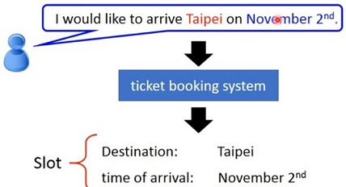

这个问题我们首先想到可以用全连接网络（FNN：FeedForword Neural Network）来解决。

这个全连接网络的输入是一个词汇，比如把台北变为一个Embedding（OneHot、N-gram、Word2vec）输入到神经网络里。然后希望输出是一个概率，即属于所有slot的几率。

但是只有这样是不够的，全连接网络不能解决这个问题。为什么呢？

如果有两个输入：

```
arrive Taipei on November 2nd
leave Taipei on November 2nd
```

但对于全连接神经网络来说，输入一样，输出也会一样。输入`Taipei`，要么输出是`目的地`的几率最高，要么是`出发地`的几率最高，没有办法有时候让`目的地`的几率最高，有时候让`出发地`的几率最高，那怎么办呢？

**这个时候，我们就希望神经网络是有记忆力的**。

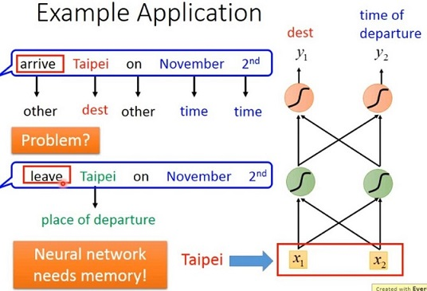

如果神经网络是有记忆力的，它会记得在看到红色`Taipei`这个词之前，就已经看过`arrive`这个词汇；它会记得在看到绿色`Taipei`这个词之前，就已经看过`leave`这个词汇。它会根据这段话的上下文，产生不同的输出。

**如果神经网络是有记忆力的，这样就可以解决输入同样的词汇，但是输出必须不同这个问题**。那么这种有记忆力的神经网络，就叫做Recurrnt Neural Network(RNN)。

# RNN原理

## 直观图解

每次前向神经网络里的隐藏层的神经元产生输出（下图中的$a_1$和$a_2$）后，都会被存到memory中去，然后当下一个input输入后，隐藏层的输入不仅仅考虑$x_1$和$x_2$，还会考虑上一次的隐藏层输出存在memory中的值。

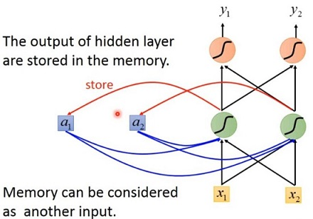

那具体过程是怎样的呢？用一个简单的例子来说明会比较清楚。

假设如下图所示的所有权值都是1，所有的神经元都没有bias，假设所有的激活函数都是线性的，假设input是sequence，具体值如下图中所示，假设memory的初始值是0。

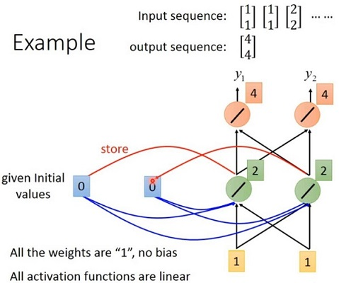

然后如下图所示**隐藏层的值2被写到memory中**，接下来再输入第二个单词的embedding，那么**隐藏层的输入有四个**，加权的结果是6，输出的结果也是6。

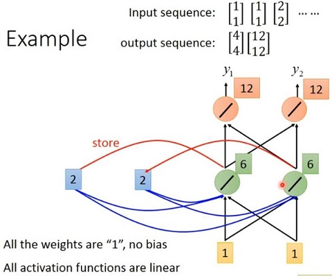

由上图可以看出，输入是一样的，但是输出是可能不一样的，因为存在memory中的值是不一样的。

接下来，如下图所示上图中隐藏层的输出6就会被存到memory中去，memory中的值就由2变为6。隐藏层的输入有四个（6+6+2+2=16），所以隐层的输出就是16。

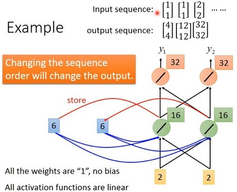

所以因为memory的存在，**任意调换sequence的顺序，那么输出就会不一样**。比如把sequence的最后一个单词挪到最前面去，则输出是会完全不一样的。所以，**RNN会考虑输入的seqence的顺序**。

**example**：

现在RNN的原理就讲完了，下面还是用前面的订票系统来距离说明。

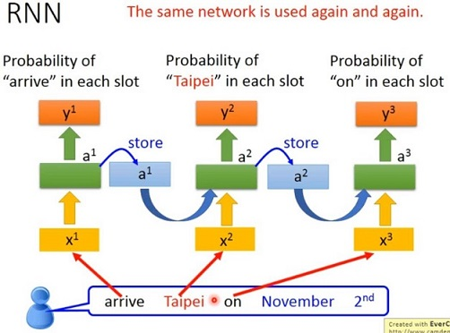

上面并不是三个网络，而是同一个神经网络，是同一个网络在三个不同的时间点被使用了三次。

所以，有了memory以后，我们希望输入同一个词汇，输出不同的概率这个问题，就有可能解决。

如下图所示，同样是输入`Taipei`，但是因为红色`Taipei`前面接`leave`，绿色`Taipei`前面接`arrive`，因为`leave`和`arrive`它们的embedding不一样，所以隐层的输出也会不同，存在memory里面的值也会不同。所以虽然现在两个$x^2$是一模一样的，但是因为存在memory里面的值不同，所以隐层的输出就会不一样，所以最后的输出也就会不一样。

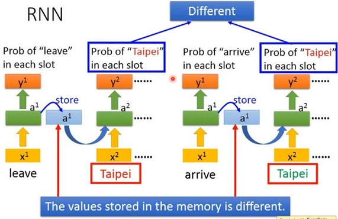

## 公式

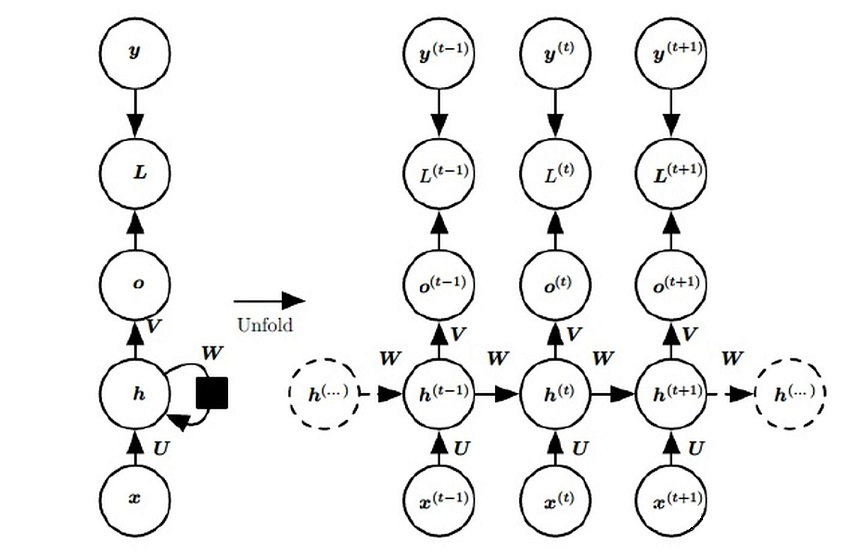

这是一个标准的RNN结构图，图中每个箭头代表做一次变换，也就是说箭头连接带有权值。左侧是折叠起来的样子，右侧是展开的样子，左侧中$h$旁边的箭头代表此结构中的“循环“体现在隐层。

**前向传播算法：**

$x$是输入，$h$是隐层单元，$o$为输出，$L$为损失函数，$y$为训练集的标签。这些元素右上角带的t代表$t$时刻的状态，其中需要注意的是，因此单元$h$在$t$时刻的表现不仅由此刻的输入决定，还受$t$时刻之前时刻的影响。$V$、$W$、$U$是权值，同一类型的权连接权值相同。

前向传播算法其实非常简单，对于$t$时刻：
$$
h(t)=ϕ(U\cdot x(t)+W\cdot h(t−1)+b)
$$
其中$\phi()$为激活函数，一般来说会选择$tanh$函数，$b$为偏置。

$t$时刻的**输出**就更为简单：
$$
o(t)=V\cdot h(t)+c
$$
最终模型的预测输出为：
$$
\hat{y}(t)=\sigma(o(t))
$$
其中$\sigma$为激活函数，通常RNN用于分类，故这里一般用softmax函数。

**损失函数**

对于分类问题，采用交叉熵。

**后向传播算法：**

BPTT（back-propagation through time）算法是常用的训练RNN的方法，其实本质还是BP算法，只不过RNN处理时间序列数据，所以要基于时间反向传播，故叫随时间反向传播。BPTT的中心思想和BP算法相同，沿着需要优化的参数的负梯度方向不断寻找更优的点直至收敛。综上所述，BPTT算法本质还是BP算法，BP算法本质还是梯度下降法，那么求各个参数的梯度便成了此算法的核心。

需要寻优的参数有三个，分别是U、V、W。与BP算法不同的是，其中W和U两个参数的寻优过程需要追溯之前的历史数据，参数V相对简单只需关注目前。

# RNN的不同架构

## 多层Deep的RNN

RNN当然也可以有很多层，如下图所示

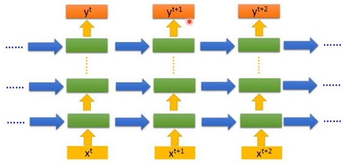

## Elman和Jordan网络架构

前面我们讲的都是Elman网络架构，Jordan网络往memory中存的是output的值。Jordan网络可以得到比较好的性能，因为Elman网络的隐藏层是没有target的，比较难控制它学到了什么信息，但是Jordan网络的输出$y$是有target的，可以对放在memory中的是什么东西比较清楚的。

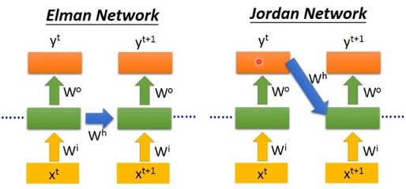

## 双向RNN

RNN的读取方向不仅可以是按照句子的顺序，也可以是反过来的。

可以同时train一个正向的RNN和逆向的RNN，然后把两个RNN的隐藏层都拿出来接给一个输出层，得到最后的输出y。

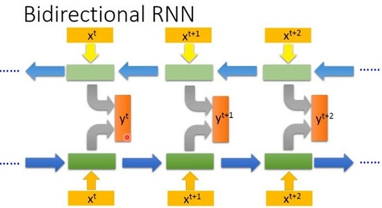

用双向RNN的好处，就是网络产生输出的时候，看的范围比较广。如果只有正向的RNN，在产生$y^{t+1}$的时候，网络只看过$x^1$一直到$x^{t+1}$，但是如果是双向的RNN，在产生$y^{t+1}$的时候，网络不只是看过$x^1$一直到$x^{t+1}$，也看了从句尾一直到$x^{t+1}$。就是说，**网络是看了整个sequence后，才决定输出是什么**，会比只看句子的一半得到更好的性能。

# RNN的梯度消失问题

RNN的缺陷是梯度消失问题，即便是LSTM也只能缓解该问题。


# 参考资料

* [李宏毅教授讲解 RNN LSTM的视频](http://speech.ee.ntu.edu.tw/~tlkagk/courses/ML_2017/Lecture/RNN1.mp4)
* [B站李宏毅深度学习RNN2019](https://www.bilibili.com/video/av73798762?p=43)

本文参考了该视频。两个视频都一样。

* [Recurrent Neural Networks (RNN) - The Vanishing Gradient Problem](https://www.superdatascience.com/blogs/recurrent-neural-networks-rnn-the-vanishing-gradient-problem)
* [paper: On the difficulty of training recurrent neural networks](http://proceedings.mlr.press/v28/pascanu13.pdf?source=post_page---------------------------)

"RNN的梯度消失问题"参考该博客，paper没看，但是觉得有用。

===

[完全图解RNN、RNN变体、Seq2Seq、Attention机制](https://zhuanlan.zhihu.com/p/28054589)

[seq2seq学习笔记](https://blog.csdn.net/jerr__y/article/details/53749693)

RNN基础
对于RNN，我看到讲得最通俗易懂的应该是Andrej发的博客： 
The Unreasonable Effectiveness of Recurrent Neural Networks

这里有它的中文翻译版本： 
递归神经网络不可思议的有效性


如果想了解 LSTM 的原理，可以参考这篇文章：（译）理解 LSTM 网络 （Understanding LSTM Networks by colah）。 
下面的连接中对RNN还有BPTT（RNN的反向传播算法），LSTM和GRU的原理和实现讲解得也是非常棒： 
http://www.wildml.com/2015/09/recurrent-neural-networks-tutorial-part-1-introduction-to-rnns/


[Visualizing memorization in RNNs](https://distill.pub/2019/memorization-in-rnns/)

[谁能用比较通俗有趣的语言解释RNN和LSTM？](https://www.zhihu.com/question/314002073)

[一文读懂LSTM和循环神经网络](https://zhuanlan.zhihu.com/p/35878575)

[深度学习循环神经网络详解](https://zhuanlan.zhihu.com/p/37428697)

[【深度学习之美】循环递归RNN，序列建模套路深（入门系列之十三）](https://yq.aliyun.com/articles/169880?spm=a2c4e.11153940.blogcont86580.22.152919797EqPuO)

[【Deep Learning】通俗大白话详述RNN理论和LSTM理论](https://mp.weixin.qq.com/s/3Rpq1EvYi-_9wvJ5fUB5dQ)

[深度学习实战教程(五)：循环神经网络](https://cuijiahua.com/blog/2018/12/dl-11.html)

[The Ultimate Guide to Recurrent Neural Networks (RNN)](https://www.superdatascience.com/blogs/the-ultimate-guide-to-recurrent-neural-networks-rnn)

