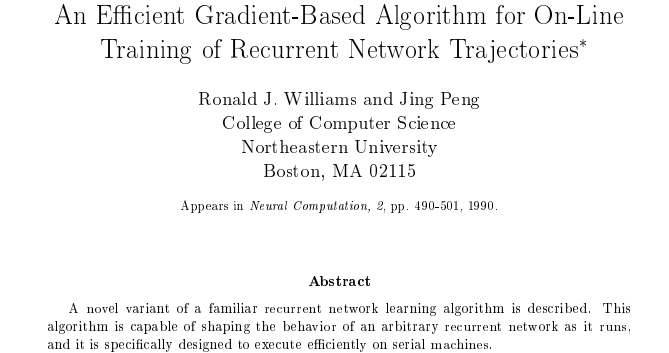

# TBPTT截断的基于时间的反向传播算法Truncated Backpropagation Through Time

* [返回上层目录](../recurrent-neural-network.md)

paper: [An Efficient Gradient-Based Algorithm for On-Line Training of Recurrent Network Tra jectories](https://citeseerx.ist.psu.edu/document?repid=rep1&type=pdf&doi=26bc0449360d7016f684eafae5b5d2feded32041)

===

[如何理解LSTM模型的bptt？](https://www.zhihu.com/question/50525265)

[A Gentle Introduction to Backpropagation Through Time](https://machinelearningmastery.com/gentle-introduction-backpropagation-time/)

[详细阐述基于时间的反向传播算法（Back-Propagation Through Time,BPTT）](https://blog.csdn.net/Hearthougan/article/details/82751840)

[截断反向传播算法（Truncated Backpropagation Through Time, Truncated BPTT）](https://blog.csdn.net/m0_51200050/article/details/139760487)

[RNN解决序列太长存储激活值过大问题的方法：TBPTT](https://blog.csdn.net/smartcat2010/article/details/105333822)

[TBPTT算法——Truncated Backpropagation Through Time](https://blog.csdn.net/Answer3664/article/details/101059171)