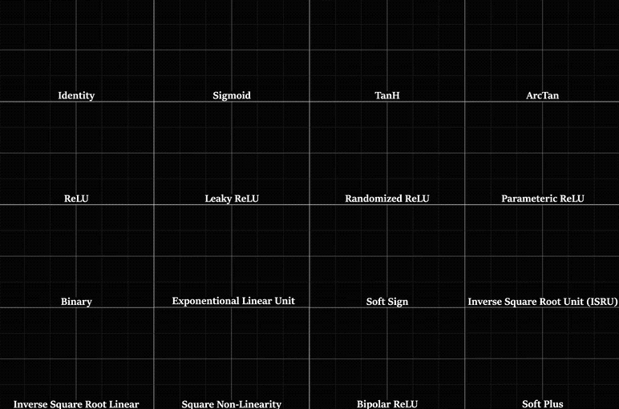
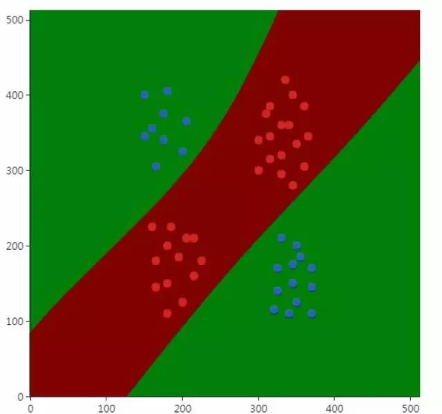
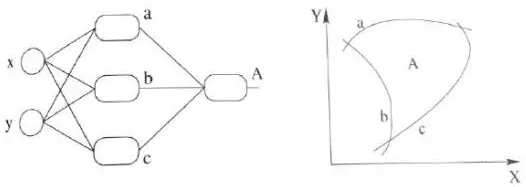
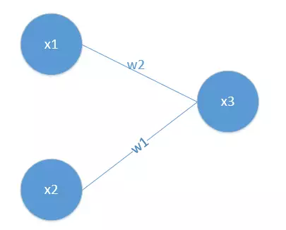

# 激活函数

* [返回上层目录](../tips.md)
* [为什么需要激活函数](#为什么需要激活函数)
* [什么样的函数可以做激活函数](#什么样的函数可以做激活函数)
* [如何评价激活函数](#如何评价激活函数)
* [激活函数的作用](#激活函数的作用)
  * [加入非线性因素，解决非线性问题](#加入非线性因素，解决非线性问题)
  * [组合训练数据的特征，特征的充分组合](#组合训练数据的特征，特征的充分组合)
* [常用的激活函数](#常用的激活函数)
* [不同激活函数的区别](#不同激活函数的区别)

# 为什么需要激活函数

从数学上看，神经网络是一个多层复合函数。激活函数在很早以前就被引入，其作用是保证神经网络的非线性，因为线性函数无论怎样复合结果还是线性的。假设神经网络的输入是n维向量x，输出是m维向量y，它实现了如下向量到向量的映射：$R^n\rightarrow R^m$。我们将这个函数记为：$y=h(x)$

除输入层之外，标准的前馈型神经网络第I层实现的变换可以分为线性组合、激活函数两步。在某些开源框架中，这两步可能会拆分成不同的层，以利于代码复用和灵活组合。例如Caffe中线性组合由内积层InnerProductLayer类实现，激活函数由神经元层NeuronLayer类实现。神经网络第层的变换写成矩阵和向量形式为：
$$
\begin{aligned}
u^{(i)}&=W^{(i)}x^{(i-1)}+b^{(i)}\\
x^{(i)}&=f(u^{(i)})
\end{aligned}
$$
其中W是权重矩阵，b是偏置向量，u是临时结果，x是神经网络每一层的输出。激活函数分别作用于向量u的每一个分量，产生一个向量输出x。在正向传播阶段，反复用上面的公式进行计算，最后得到网络的输出。对于一个3层的网络，整个映射可以写成：
$$
h(x)=f\left( W^{(3)}f\left( W^{(2)}f\left( W^{(1)}x+b^{(1)} \right) +b^{(2)}\right) +b^{(3)}\right)
$$
这是一个3层的复合函数。从这里可以清晰的看到，如果没有激活函数，整个函数将是一个线性函数：
$$
W^{(3)}\left( W^{(2)}\left( W^{(1)}x+b^{(1)} \right) +b^{(2)}\right) +b^{(3)}
$$
因此对激活函数最基本的要求是必须是非线性的。在早期，普遍使用的是sigmoid函数和tanh函数。

sigmoid函数的计算公式为：
$$
f(x)=\frac{1}{1+\text{exp}(-x)}
$$
这个函数的图像为：

tanh函数的计算公式为：
$$
f(x)=\frac{1-e^{-2x}}{1+e^{-2x}}
$$
它的图像为：

前者的值域为(0,1)，单调递增且有界；后者的值域为(-1,+1)，是一个中心对称的奇函数，同样也是单调递增且有界。

# 什么样的函数可以做激活函数

前面已经说过，为保证非线性，激活函数必须为非线性函数，但仅仅具有非线性是不够的。神经网络在本质上是一个复合函数，这会让我们思考一个问题：这个函数的建模能力有多强？即它能模拟什么样的目标函数？已经证明，**只要激活函数选择得当，神经元个数足够多，使用3层即包含一个隐含层的神经网络就可以实现对任何一个从输入向量到输出向量的连续映射函数的逼近**，这个结论称为**万能逼近**（universal approximation）定理。万能逼近定理的表述为：

如果$\phi(x)$是一个非常数，有界，单调递增的连续函数，Im是m维的单位立方体，Im中的连续函数空间为$C(I_m)$。对于任意$\epsilon>0$以及函数$f\in C(I_m)$，存在整数N，实数$v_i,b_i$，实向量$w_i\in R^m$，通过它们构造函数$F(x)$作为函数$f$的逼近：
$$
F(x)=\sum_{i-1}^Nv_i\phi(w_i^Tx+b_i)
$$
对任意的$X\in I_m$满足：
$$
|F(x)-f(x)|<\epsilon
$$
万能逼近定理的直观解释是可以构造出上面这种形式的函数，逼近定义在单位立方体空间中的任何一个连续函数到任意指定的精度。这个定理对激活函数的要求是必须非常数、有界、单调递增，并且连续。

文献《Cybenko, G. Approximation by superpositions of a sigmoid function. Mathematics of Control, Signals, and Systems, 2, 303-314, 1989.》对使用sigmoid激活函数时的情况进行了证明：如果$\sigma$是一个连续函数，并且满足下面条件：
$$
\begin{aligned}
\mathop{\text{lim}}_{x\rightarrow -\infty}\sigma(x)&=0\\
\mathop{\text{lim}}_{x\rightarrow \infty}\sigma(x)&=1
\end{aligned}
$$
则函数族：
$$
f(x)=\sum\alpha_i\sigma(w_i^Tx+b_i)
$$
在空间n维单位立方体空间$C^m[0, 1]$中是稠密的，即这样的函数可以逼近定义在单位立方体空间中的任意连续函数到任意指定的精度。显然sigmoid函数就满足对σ的要求。上面这些结论的函数输出值都是一个标量，但我们可以把它推广的向量的情况，神经网络的输出一般是一个向量。

只要网络规模设计得当，使用sigmoid函数和ReLU函数作为激活函数的逼近能力都能够得到保证。ReLU函数定义为：
$$
\text{ReLU}(x)=\text{max}(0,x)
$$
它是一个分段线性函数。文献《Montufar, G. Universal approximation depth and errors of narrow belief networks with discrete units. Neural Computation, 26, 2014.》和《Raman Arora, Amitabh Basu, Poorya Mianjy, Anirbit Mukherjee. Understanding Deep Neural Networks with Rectified Linear Units. 2016, Electronic Colloquium on Computational Complexity.》分析了使用ReLU激活函数的神经网络的逼近能力。下图是一个非线性分类问题的例子，说明了神经网络确实能处理这种非线性问题：

在上图中，用图中的圆圈（红色和蓝色）训练样本训练出来的神经网络模型成功的将蓝色和红色两类样本分开了，分界面是两条曲线。

仅仅**满足万能逼近定理的要求**也是不够的。神经网络的训练一般采用反向传播算法+梯度下降法。反向传播算法从复合函数求导的链式法则导出，因为神经网络是一个多层的复合函数。在反向传播时，误差项的计算公式为：
$$
\delta^{(i)}=\left( W^{(i+1)} \right)^T\delta^{(i+1)}\text{o}f'\left( u^{(i)} \right)
$$
由于使用梯度下降法需要计算损失函数对参数的梯度值，这个梯度值根据上面的误差项计算，而误差项的计算又涉及到计算激活函数的导数，因此**激活函数必须是可导的**。实际应用时并不要求它在定义域内处处可导，只要是几乎处处可导即可。“几乎处处可导”看上去是一个比较有文学味道的词，但实际上是数学中一个严格的概念，这涉及到实变函数的知识。它的严格定义是这样的：

定义R为一维欧氏空间，E⊆R是它的一个子集，mE为点集E的Lebesgue测度。如果E为R中的可测集，f(x)为定义在E上的实函数，如果存在N⊆E，满足：mN=0，对于任意的x0∈E/N，函数f(x)在x0处都可导，则称f(x)在E上几乎处处可导。

上面这个定义过于晦涩。我们可以简单的将几乎处处可导理解成不可导点只有有限个，或者无限可列个（即可用自然数对这些点进行编号，某一区间上的实数就是无限不可列的），即不可导点的测度是0。可以将测度理解成一维直线的一些点的集合的长度，或者二维平面上一些点的集合的面积。在概率论中我们知道，连续型随机变量取任何一个点处的值的概率为0，如果将激活函数输入值x看做是随机变量，则它落在这些不可导点处的概率是0。在计算机实现时，浮点数是进行了离散化的，分成尾数和阶码表示，计算机能表示的浮点数是有限个，因此有一定的概率会落在不可导点处，但概率非常小。ReLU函数在0点处就不可导。

# 如何评价激活函数

反向传播算法计算误差项时每一层都要乘以本层激活函数的导数。如果激活函数导数的绝对值值小于1，多次连乘之后误差项很快会衰减到接近于0，参数的梯度值由误差项计算得到，从而导致前面层的权重梯度接近于0，参数没有得到有效更新，这称为**梯度消失**问题。与之相反的是梯度爆炸问题，如果激活函数导数的绝对大于1，多次乘积之后权重值会趋向于非常大的数，这称为**梯度爆炸**。梯度消失问题最早在1991年发现，文献《X. Glorot, Y. Bengio. Understanding the difficulty of training deep feedforward neural networks. AISTATS, 2010.》对深层网络难以训练的问题进行了分析，在很长一段时间内，梯度消失问题是困扰神经网络层次加深的一个重要因素。

上述文献对深层神经网络难以训练的问题进行了理论分析和实验验证。在实验中，作者训练了有1-5个隐藏层的神经网络，每个隐藏层有1000个神经元，输出层使用softmax logistic回归函数。激活函数使用了sigmoid，tanh，以及softsign：
$$
\frac{x}{1+|x|}
$$
权重初始化公式为：
$$
W_{ij}=U\left[ -\frac{1}{\sqrt{n}}, \frac{1}{\sqrt{n}} \right]
$$
其中，U[a, b]是[a, b]中的均匀分布，n是前一层的尺寸。理论分析和实验结果都证明，随着网络层数的增加，反向传播的作用越来越小，网络更加难以训练和收敛。

文献《Caglar Gulcehre, Marcin Moczulski, Misha Denil, Yoshua Bengio. Noisy Activation Functions. ICML 2016.》中定义了激活函数饱和性的概念，并对各种激活函数进行了分析，给出了改进措施。如果一个激活函数满足：
$$
\mathop{\text{lim}}_{x\rightarrow\infty}f'(x)=0
$$
即在正半轴函数的导数趋向于0，则称该函数为右饱和。类似的如果满足：
$$
\mathop{\text{lim}}_{x\rightarrow-\infty}f'(x)=0
$$
即在负半轴函数的导数趋向于0，则称该函数左饱和。如果一个激活函数既满足左饱和又满足右饱和，称之为**饱和**。如果存在常数c，当x>c时有：
$$
f'(x)=0
$$
则称函数右硬饱和；当x<c时有：
$$
f'(x)=0
$$
则称函数左硬饱和。既满足左硬饱和又满足右硬饱和的激活函数为**硬饱和**函数。**饱和性和梯度消失问题密切相关**。在反向传播过程中，误差项在每一层都要乘以激活函数导数值，一旦x的值落入饱和区间，多次乘积之后会导致梯度越来越小，从而出现梯度消失问题。

sigmoid函数的输出映射在(0,1)之间，单调连续，求导容易。但是由于其**软饱和性，容易产生梯度消失**，导致训练出现问题；另外它的输出并不是以0为中心的。

tanh函数的输出值以0为中心，位于(-1,+1)区间，相比sigmoid函数训练时收敛速度更快，但它还是饱和函数，存在梯度消失问题。

ReLU函数其形状为一条折线，当x<0时做截断处理。该函数在0点出不可导，如果忽略这一个点其导数为sgn。函数的导数计算很简单，而且由于在正半轴导数为1，有效的缓解了梯度消失问题。在ReLU的基础上又出现了各种新的激活函数，包括ELU、PReLU等。如果对各种激活函数深入的比较和分析感兴趣，可以阅读文献《Caglar Gulcehre, Marcin Moczulski, Misha Denil, Yoshua Bengio. Noisy Activation Functions. ICML 2016.》。

# 激活函数的作用

激活函数有两个作用：

* 加入非线性因素，解决线性模型所不能解决的问题
* 用来组合训练数据的特征，特征的充分组合

下面分别对激活函数的两个作用进行解释。

## 加入非线性因素，解决非线性问题

首先我们有这个需求，就是二分类问题，如我要将下面的三角形和圆形点进行正确的分类，如下图：

利用我们单层的感知机, 用它可以划出一条线, 把三角形和圆形样本分割开：

上图直线是由
$$
w_1x_1+w_2x_2+b=0
$$
得到，那么该感知器实现预测的功能步骤如下，就是我已经训练好了一个感知器模型，后面对于要预测的样本点，带入模型中。

如果y>0,那么就说明是直线的右侧，也就是正类（我们这里是三角形）。

如果y<0,那么就说明是直线的左侧，也就是负类（我们这里是圆形），虽然这和我们的题目关系不大，但是还是提一下~

好吧，很容易能够看出，我给出的样本点根本不是线性可分的，一个感知器无论得到的直线怎么动，都不可能完全正确的将三角形与圆形区分出来，那么我们很容易想到用多个感知器来进行组合，以便获得更大的分类问题，好的，下面我们上图，看是否可行：

好的，我们已经得到了多感知器分类器了，那么它的分类能力是否强大到能将非线性数据点正确分类开呢~我们来分析一下：

我们能够得到
$$
\begin{aligned}
y=\quad&w_{2-1}(w_{1-11}x_1+w_{1-21}x_2+b_{1-1})\\
+&w_{2-2}(w_{1-12}x_1+w_{1-22}x_2+b_{1-2})\\
+&w_{2-3}(w_{1-13}x_1+w_{1-23}x_2+b_{1-3})\\
\end{aligned}
$$
哎呀呀，不得了，这个式子看起来非常复杂，估计应该可以处理我上面的情况了吧，哈哈哈哈~不一定额，我们来给它变个形。上面公式合并同类项后等价于下面公式：
$$
\begin{aligned}
y=\quad&x_1(w_{2-1}w_{1-11}+w_{2-2}w_{1-12}+w_{2-3}w_{1-13})\\
+&x_2(w_{2-1}w_{1-21}+w_{2-2}w_{1-22}+w_{2-3}w_{1-23})\\
+&w_{2-1}b_{1-1}+w_{2-2}b_{1-2}+w_{2-3}b_{1-3}\\
\end{aligned}
$$
**啧啧，估计大家都看出了，不管它怎么组合，最多就是线性方程的组合，最后得到的分类器本质还是一个线性方程，该处理不了的非线性问题，它还是处理不了。**

就好像下图，直线无论在平面上如果旋转，都不可能完全正确的分开三角形和圆形点：

既然是非线性问题，总有线性方程不能正确分类的地方~

那么抛开神经网络中神经元需不需要激活函数这点不说，如果没有激活函数，仅仅是线性函数的组合解决的问题太有限了，碰到非线性问题就束手无策了.那么加入激活函数是否可能能够解决呢？

在上面线性方程的组合过程中，我们其实类似在做三条直线的组合，如下图：

下面我们来讲一下激活函数，我们都知道，每一层叠加完了之后，我们需要加入一个激活函数（激活函数的种类也很多，如sigmod等等~）这里就给出sigmod例子，如下图：

通过这个激活函数映射之后，输出很明显就是一个非线性函数！能不能解决一开始的非线性分类问题不清楚，但是至少说明有可能啊，上面不加入激活函数神经网络压根就不可能解决这个问题~

同理，扩展到多个神经元组合的情况时候，表达能力就会更强~对应的组合图如下：（现在已经升级为三个非线性感知器在组合了）

跟上面线性组合相对应的非线性组合如下：

这看起来厉害多了，是不是~最后再通过最优化损失函数的做法，我们能够学习到不断学习靠近能够正确分类三角形和圆形点的曲线，到底会学到什么曲线，不知道到底具体的样子，也许是下面这个~

那么随着不断训练优化，我们也就能够解决非线性的问题了~

所以到这里为止，我们就解释了这个观点，加入激活函数是用来加入非线性因素的，解决线性模型所不能解决的问题。

## 组合训练数据的特征，特征的充分组合

首先我们看一个简单的感知机如下：

**其中，x1,x2输入均为特征的输入**

则x3为
$$
x_3=w_1x_1+w_2x_2
$$
激活函数采取sigmoid函数，公式表达如下：
$$
S(x)=\frac{1}{1+e^{-x}}
$$
则
$$
S(x)=\frac{1}{1+e^{-x_3}}
$$
此时，我们可能看不出什么不同，**但是根据泰勒展开，**
$$
e^x=1+\frac{1}{1!}x+\frac{1}{2!}x^2+\frac{1}{3!}x^3+o(x^3)
$$
我们能够看到，将x3代入到激活函数的时候，其实激活函数的$e^x$泰勒展开后，有平方项，有立方项，有更高的项，**这些自动能够把输入特征进行两两组合，进行三三组合或者其它的组合。**

**比如其中的平方项体现了将特征进行两两组合：**
$$
\begin{aligned}
(w_1x_1+w_2x_2)^2=&\quad w_1w_1x_1x_1\\
&+w_2w_2x_2x_2\\
&+w_1x_1w_2x_2\\
\end{aligned}
$$
**这就把原来需要领域知识的专家对特征进行组合的情况，在激活函数运算后，其实也能够起到类似特征组合的作用。**

**（只要激活函数中有能够泰勒展开的函数，就可能起到特征组合的作用）**

**这也许能给我们一些思考。**

# 常用的激活函数

下表列出了Caffe中支持的激活函数和它们的导数：

## ReLU

### PreLU

## elu

elu论文：*[Fast and Accurate Deep Network Learning by Exponential Linear Units (ELUs) ICLR2016](https://arxiv.org/abs/1511.07289)*

论文中提到，elu函数可以加速训练并且可以提高分类的准确率。它有以下特征：

* elu由于其正值特性，可以像relu,lrelu,prelu一样缓解梯度消失的问题。

* 相比relu，elu存在负值，可以将激活单元的输出均值往0推近，达到batchnormlization的效果且减少了计算量。（输出均值接近0可以减少偏移效应进而使梯度接近于自然梯度。）

* Lrelu和prelu虽然有负值存在，但是不能确保是一个噪声稳定的去激活状态。

* Elu在负值时是一个指数函数，对于输入特征只定性不定量。

# 不同激活函数的区别

卷积网络的激活函数sigmoid和relu有什么区别？

使用sigmod函数会导致将近一半的神经元被激活。不太符合人类脑活动工程学。

而relu函数在这方面神似，自动引入稀疏性，相当于无监督预练习。

AlexNet用ReLU代替了Sigmoid，发现使用ReLU得到的SGD的收敛速度会比sigmoid/tanh 快很多。主要是因为它是linear，而且non-saturating（因为ReLU的导数始终是1），相比于sigmoid/tanh，ReLU只需要一个阈值就可以得到激活值，而不用去算一大堆复杂的运算。

# 参考资料

* [理解神经网络的激活函数](https://mp.weixin.qq.com/s?__biz=MzU4MjQ3MDkwNA==&mid=2247483977&idx=1&sn=401b211bf72bc70f733d6ac90f7352cc&chksm=fdb69fdecac116c81aad9e5adae42142d67f50258106f501af07dc651d2c1473c52fad8678c3&mpshare=1&scene=1&srcid=07308RapV3KncGG6CBZwmF8w#rd)

"激活函数"参考了此资料。

* [理解激活函数作用，看这篇文章就够了！](https://mp.weixin.qq.com/s?__biz=MzI4MDYzNzg4Mw==&mid=2247488049&idx=1&sn=4cad0db659391faaa4dac0ace524a21f&chksm=ebb42ae5dcc3a3f3145c70529bb828ebdb66429cc0c1433ad5ad5072ef2c2bb86094f27320be&scene=0#rd)
* [一种新的思路通俗理解激活函数](https://mp.weixin.qq.com/s?__biz=MzI4MDYzNzg4Mw==&mid=2247488052&idx=1&sn=327b04f1a7b2a7cd62a5c369e33b9f62&chksm=ebb42ae0dcc3a3f6809ba19dfd4432b4700f52a6ca5d448a98e0b6ea58f6a67e41d517295079&mpshare=1&scene=1&srcid=0723FSI6mqiC7zFLQNzK9HpT#rd)

"激活函数的作用"一节参考了此微信文章。

* [ReLU、LReLU、PReLU、CReLU、ELU、SELU](https://blog.csdn.net/qq_20909377/article/details/79133981)

* [激活函数（relu，prelu，elu，+BN）对比on cifar10](https://blog.csdn.net/m0_37561765/article/details/78398098)

"常用的激活函数"一节参考了上述文章。

===

[聊一聊深度学习的activation function](https://zhuanlan.zhihu.com/p/25110450)

[Activation Functions Explained - GELU, SELU, ELU, ReLU and more](https://mlfromscratch.com/activation-functions-explained/#/)

[一文搞懂激活函数(Sigmoid/ReLU/LeakyReLU/PReLU/ELU)](https://zhuanlan.zhihu.com/p/172254089)

