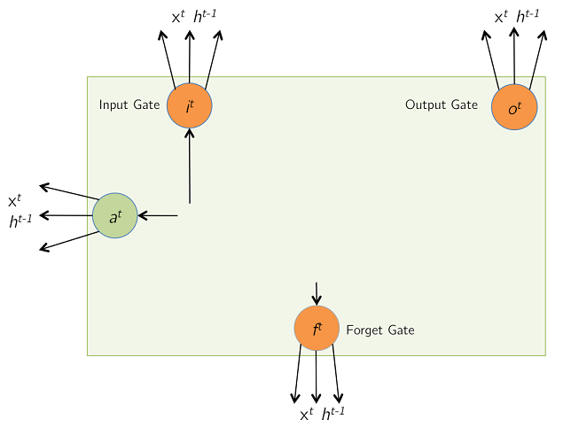
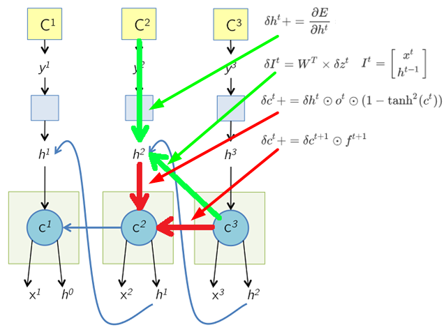

# LSTM的反向传播原理

* [返回上层目录](../back-propagation.md)
* [前向传播](#前向传播)
  * [初始化状态](#初始化状态)
  * [输入和门计算（前向传播）](#输入和门计算（前向传播）)
  * [记忆单元更新（前向传播）](#记忆单元更新（前向传播）)
  * [输出（前向传播）](#输出（前向传播）)
  * [展开的网络（前向传播）](#展开的网络（前向传播）)
* [反向传播](#反向传播)
  * [展开的网络（反向传播）](#展开的网络（反向传播）)
  * [输出（反向传播）](#输出（反向传播）)
  * [记忆单元更新（反向传播）](#记忆单元更新（反向传播）)
  * [输入和门计算（反向传播）](#输入和门计算（反向传播）)
  * [更新参数](#更新参数)

现在的pytorch已经帮我们做好了自动微分，这就避免了手动求梯度的痛苦，但是，为了对LSTM具体是怎么工作的，并且为了满足好奇心，我们必须要深入到细节来研究LSTM。

本文是对LSTM的前向计算和反向传播公式的手动推导，这是比较容易理解的。

在学习本文之前，需要了解反向传播和链式法则的原理。

# 前向传播

## 初始化状态

在最初的时刻$t$，LSTM的记忆单元保留了来自上一时刻$t-1$的值。

## 输入和门计算（前向传播）

在$t$时刻，LSTM收到了新的输出向量$x^t$（包括了偏移项），同时收到了来自上一时刻$t-1$的LSTM自身的输出$h^{t-1}$。

公式为：
$$
\begin{aligned}
a^t&=\tanh(W_cx^t+U_ch^{t-1})=\tanh(\hat{a}^t)\\
i^t&=\sigma(W_ix^t+U_ih^{t-1})=\sigma(\hat{i}^t)\\
f^t&=\sigma(W_fx^t+U_fh^{t-1})=\sigma(\hat{f}^t)\\
o^t&=\sigma(W_ox^t+U_oh^{t-1})=\sigma(\hat{o}^t)\\
\end{aligned}
$$
我们把上述未经过激活函数的输入记为
$$
z^t=
\begin{bmatrix}
\hat{a}^t\\ 
\hat{i}^t\\ 
\hat{f}^t\\
\hat{o}^t\\
\end{bmatrix}
=
\begin{bmatrix}
W^c & U^c\\
W^i & U^i\\
W^f & U^f\\
W^o & U^o\\
\end{bmatrix}
\times
\begin{bmatrix}
x^t\\
h^{t-1}\\
\end{bmatrix}
=
W\times I^t
$$
如果输入$x^t$的维度为$n\times 1$，且记忆单元的维度是$d$，则$W^*$和$U^*$的维度分别为$d\times n$和$d\times d$。$W$的维度为$4d\times (n+d)$。请注意，每个$d$维的存储单元$c^t$都有自己的权重$W^∗$和$U^∗$，与其他LSTM单元共享存储单元值的唯一时间是在与$U^∗$的乘积期间。

## 记忆单元更新（前向传播）

在这一步中，基于单元的值被$a^t$和上一时刻的记忆单元的内容$c^{t-1}$共同更新。更新的权重是基于输入门$i^t$和遗忘门$f^t$的大小。$\odot$是逐元素相乘的意思（哈达玛积）。

$$
c^t=i^t\odot a^t+f^t\odot c^{t-1}
$$
然后记忆单元的值被更新为最新的值。

$$
c^{t-1}\rightarrow c^t
$$

## 输出（前向传播）

最终，LSTM单元计算出输出，通过记忆单元的非线性变换。输出门决定了计算的最终输出$h^t$有多少能实际从LSTM单元传出。

$$
h^t=o^t\odot \tanh(c^t)
$$

## 展开的网络（前向传播）

下面展示了前向传递过程中展开的网络。请注意，为了简洁起见，没有展示这些门控结构。

这里值得注意的一个有趣之处是，在下面的计算图中，时间$T$的细胞状态$c^T$既负责计算$h^T$，也负责计算下一个细胞状态$c^{T+1}$。在每个时间步，细胞输出$h^T$被传递到一些更多的层上，在这些层上计算成本函数$C^T$，就像LSTM在典型的应用中（如标题生成或语言建模）的使用方式一样。

# 反向传播

## 展开的网络（反向传播）

下面展示了在反向传递过程中展开的网络。之前PPT中的所有箭头现在都改变了方向。时间$T$的细胞状态$c^T$接收来自$h^T$以及下一个细胞状态$c^{T+1}$的梯度。接下来的几张PPT将专注于计算这两个梯度。在任何时间步$T$，这两个梯度在反向传播到细胞以下的层和之前的时间步之前会累积起来。

如下图所示，

* $h^T$的梯度来自于绿色的两条线：
  * 下一时刻的$C^{T-1}$
  * 本时刻的损失函数$E^T$
* $c^T$的梯度来自于红色的两条线：
  - 下一时刻的$C^{T-1}$
  - 本时刻的$h^T$

## 输出（反向传播）

前向传播：
$$
h^t=o^t\odot \tanh(c^t)
$$
已知有$\delta h^t=\frac{\partial E}{\partial h^t}$，求$\delta o^t$，$\delta c^t$。

（1）求$\delta o^t$
$$
\begin{aligned}
\frac{\partial E}{\partial o_i^t}&=\frac{\partial E}{\partial h_i^t}\frac{\partial h_i^t}{\partial o_i^t}\\
&=\delta h_i^t\cdot \tanh(c_i^t)
\end{aligned}
$$

所以，
$$
\delta o^t=\delta h^t\odot \tanh(c^t)
$$
（2）求$\delta c^t$
$$
\begin{aligned}
\frac{\partial E}{\partial c_i^t}&=\frac{\partial E}{\partial h_i^t}\frac{\partial h_i^t}{\partial c_i^t}\\
&=\delta h_i^t\cdot o_i^t \cdot (1-\tanh^2(c_i^t))
\end{aligned}
$$
所以，
$$
\delta c^t += \delta h^t\odot o^t \odot (1-\tanh^2(c^t))
$$
请注意，上面的+=是为了将这个梯度加到时间步$t+1$的梯度上（在下一张幻灯片中计算，参考之前提到的梯度累积）。也就是本步计算的是下图中两个红色箭头中上面的那个箭头朝下的梯度回传路径，下一步就该计算右面的箭头朝左的梯度回传路径了。

## 记忆单元更新（反向传播）

前向传播：
$$
c^t=i^t\odot a^t + f^t\odot c^{t-1}
$$
已知$\delta c^t=\frac{\partial E}{\partial c_i^t}$（上一步已经算出来了，虽然只算出来了一部分，但是在序列最末尾只包含这一部分），求$\delta i^t$，$\delta a^t$，$\delta f^t$，$\delta c^{t-1}$。

前面我们知道：$c^t=i^t\odot a^t+f^t\odot c^{t-1}$

（1）求$\delta i^t$
$$
\begin{aligned}
\frac{\partial E}{\partial i_i^t}&=\frac{\partial E}{\partial c_i^t}\frac{\partial c_i^t}{\partial i_i^t}\\
&=\delta c_i^t\cdot a_i^t
\end{aligned}
$$
所以
$$
\delta i^t = \delta c^t\odot a^t
$$
（2）求$\delta a^t$
$$
\begin{aligned}
\frac{\partial E}{\partial a_i^t}&=\frac{\partial E}{\partial c_i^t}\frac{\partial c_i^t}{\partial a_i^t}\\
&=\delta c_i^t\cdot i_i^t
\end{aligned}
$$
所以
$$
\delta a^t = \delta c^t\odot i^t
$$
（3）求$\delta f^t$
$$
\begin{aligned}
\frac{\partial E}{\partial f_i^t}&=\frac{\partial E}{\partial c_i^t}\frac{\partial c_i^t}{\partial f_i^t}\\
&=\delta c_i^t\cdot c_i^{t-1}
\end{aligned}
$$
所以
$$
\delta i^t = \delta c^t\odot c^{t-1}
$$
（4）求$\delta c^{t-1}$
$$
\begin{aligned}
\frac{\partial E}{\partial c_i^{t-1}}&=\frac{\partial E}{\partial c_i^t}\frac{\partial c_i^t}{\partial i_i^{t-1}}\\
&=\delta c_i^t\cdot f_i^t
\end{aligned}
$$
所以
$$
\delta c^{t-1} = \delta c^t\odot f^t
$$
则$\delta c^t$的完整值为如下图所示的两部分的叠加：
$$
\delta c^t = \delta h^t\odot o^t \odot (1-\tanh^2(c^t)) + \delta c^{t+1}\odot f^{t+1}
$$

## 输入和门计算（反向传播）

先回顾一下公式：
$$
\begin{aligned}
a^t&=\tanh(W_cx^t+U_ch^{t-1})=\tanh(\hat{a}^t)\\
i^t&=\sigma(W_ix^t+U_ih^{t-1})=\sigma(\hat{i}^t)\\
f^t&=\sigma(W_fx^t+U_fh^{t-1})=\sigma(\hat{f}^t)\\
o^t&=\sigma(W_ox^t+U_oh^{t-1})=\sigma(\hat{o}^t)\\
\end{aligned}
$$
已知：$\delta a^t$，$\delta a^t$，$\delta a^t$，$\delta a^t$，求$\delta z^t$：
$$
\begin{aligned}
\delta \hat{a}^t &= \delta a^t \odot (1-\tanh^2(\hat{a}^t))\\
\delta \hat{i}^t &= \delta i^t \odot i^t \odot (1-\hat{i}^t)\\
\delta \hat{f}^t &= \delta f^t \odot f^t \odot (1-\hat{f}^t)\\
\delta \hat{o}^t &= \delta o^t \odot o^t \odot (1-\hat{o}^t)\\
\delta z^t &= \left[ \delta \hat{a}^t, \delta \hat{i}^t, \delta \hat{f}^t, \delta \hat{o}^t \right]^T
\end{aligned}
$$
我们把上述未经过激活函数的输入记为
$$
z^t=
\begin{bmatrix}
\hat{a}^t\\ 
\hat{i}^t\\ 
\hat{f}^t\\
\hat{o}^t\\
\end{bmatrix}
=
\begin{bmatrix}
W^c & U^c\\
W^i & U^i\\
W^f & U^f\\
W^o & U^o\\
\end{bmatrix}
\times
\begin{bmatrix}
x^t\\
h^{t-1}\\
\end{bmatrix}
=
W\times I^t
$$
已知：$\delta z^t$，求$\delta W^t$，$\delta h^{t-1}$。

（1）求$\delta I^t$
$$
\delta I^t=W^T\times \delta z^t
$$
由于
$$
I^t=
\begin{bmatrix}
x^t\\ 
h^{t-1}\\
\end{bmatrix}
$$
$\delta h^{t-1}$可以从$\delta I^t$中抽取出来。

那此时的关于$h$的梯度可以全部计算出来了，具体为下式和下图所示。
$$
\delta h^t = \frac{\partial E}{\partial h^t} + \delta T^{t+1}_{[h^t]}
$$

（2）求$\delta W^t$
$$
\delta W^t = \delta z^t \times (I^t)^T
$$
## 更新参数

如果输入$x$有$T$个时间步，即
$$
x=[x^1,x^2,...,x^T]
$$
那么，
$$
\delta W = \sum_{t=1}^T \delta W^t
$$
然后$W$会被更新，使用随机梯度下降法。

LSTM和RNN梯度回传过程差不多，我们先看看RNN再看LSTM。**RNN网络结构可以被看做为同一个神经网络的多次复制**，每个神经网络模块会将信息传递给下一层模块。

RNN每一层的权重$W$都是共享的。**总体Loss由每一步的Loss组合而成**。

**梯度回传时也会回传到每一步**，然后从每一步再依次向前回传到第0步（BPTT）。

说明：
$$
\begin{aligned}
L&=\sum_{t=1}^TL_t\\
L_t&=Loss(\hat{y}_t, y_t)\\
\hat{y}_t&=W_{hy}h_t\\
h_t&=\tanh(z_t)=\tanh(W_{hh}h_{t-1}+W_{xh}x_t)\\
\end{aligned}
$$
**梯度多次流经相同的权重W，这意味着计算梯度时将包括多次关于W的重复计算。**

而在LSTM中，存在着一条从$C_t$到$C_{t−1}$再一直到$C_0$的不被影响的梯度流，因此可以缓解梯度消失的问题。之所以说是 “缓解”，是因为只有在这一条路上能解决，而其他路上还是存在梯度消失的问题。

多次回传会带来一些问题，比较典型的问题是**梯度爆炸or消失**：

对于梯度爆炸： 可考虑梯度裁剪，将过大的梯度裁剪到一定范围。

对于梯度消失： 可考虑设置合适的激活函数，合适的权重初始化，设计更合理的网络结构。

# 参考资料

* [LSTM Forward and Backward Pass](https://arunmallya.github.io/writeups/nn/lstm/index.html#/)

本文主要参考此博客。

* [如何理解LSTM模型的bptt？](https://www.zhihu.com/question/50525265/answer/2505069915)

本文最后的章节参考此知乎回答。

