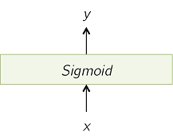

# 神经网络的反向传播原理

* [返回上层目录](../back-propagation.md)
* [多层神经网络结构](#多层神经网络结构)
* [通用层结构](#通用层结构)
* [连续值预测损失层](#连续值预测损失层)
* [离散值分类损失层](#离散值分类损失层)
* [Sigmoid层](#Sigmoid层)
* [Softmax层](#Softmax层)
* [全连接层](#全连接层)

这是一个对反向传播的快速介绍。

# 多层神经网络结构

这里以一个典型的多层全连接神经网络为例，该网络的顶端为损失函数$E(\cdot)$，如下图所示。

网络的前向传播和后向传播的流程：每一层都有输入，然后以某种方式做变换，然后产生输出，然后传给下一层，一直到达最总的误差层。然后计算预测值和真实值（目标值）的误差，然后计算梯度向后传播来修正网络参数。

# 通用层结构

大多数层可表示为一个参数为$w$的函数$f(\cdot)$，其输入为长度为$m$的向量$x$，输出为长度为$n$的向量$y$。我们使用$i$来表示$x$向量的下标，使用$j$来表示$y$向量的下标。

某些层会输入或输出不只多个输入/输出值。比如损失层就会同时输出预测值和真实目标值，然后产出对应的误差。

还有某些层并不包含任何参数$w$，而是仅仅是个固定的函数。比如，损失层和非线性激活函数层（sigmoid、tanh、ReLU）。

接下来，我们会分析一些常见的层，并且推导其反向传播的公式。

# 连续值预测损失层

L2（欧式空间）损失层一般在所有层的最顶端，其输出不会继续传给任何层了，所以$y$是不存在的，只有误差$E$该损失函数是不包含任何参数$w$的。

其会按照如下公式来计算输入的预测值$x$和期望的目标值$t$之间的距离：
$$
\text{Error}=E=\frac{1}{2}\sum_{i=1}^m(x_i-t_i)^2
$$
该层的反向传播的梯度计算为：
$$
\frac{\partial E}{\partial x_i}=\frac{1}{2}\cdot 2 \cdot (x_i-t_i)=x_i-t_i\\
\delta x = \left[ \frac{\partial E}{\partial x_i} \right]_i=x-t
$$
$\delta x$和$t$的尺寸是$m\times 1$。

用来更新参数的各变量梯度为：
$$
\delta x = x-t\\
\delta w = N.A.
$$

# 离散值分类损失层

交叉熵损失也度量了输入$x$和真实目标值$t$之间的距离，但是使用的公式是交叉熵公式：
$$
\text{Error}=E=-\sum_{i=1}^mt_i\log x_i
$$

那么反向传播的梯度计算为：
$$
\frac{\partial E}{\partial x_i}=-\frac{t_i}{x_i}\\
\delta x = \left[ \frac{\partial E}{\partial x_i} \right]_i=-t\odot \frac{1}{x}
$$
$\delta x$和$t$的尺寸是$m\times 1$。

用来更新参数的各变量梯度为：
$$
\delta x = -t\odot \frac{1}{x}\\
\delta w = N.A.
$$

# Sigmoid层

Sigmoid层不含有参数$w$，其功能是对输入$x$的每个元素进行如下变换变换：
$$
y_i=\frac{1}{1+e^{-x_i}}
$$
那么反向传播的梯度计算为：
$$
\frac{\partial E}{\partial x_i}=\frac{\partial E}{\partial y_i}\cdot \frac{\partial y_i}{\partial x_i}=\delta y_i\cdot \frac{\partial y_i}{\partial x_i}
$$
 而
$$
\begin{aligned}
&\frac{\partial y_i}{\partial x_i}=\frac{e^{-x_i}}{(1+e^{-x_i})^2}\\
=&\frac{1}{1+e^{-x_i}}\cdot \frac{1+e^{-x_i}-1}{1+e^{-x_i}}\\
=&\frac{1}{1+e^{-x_i}}\cdot (1-\frac{1}{1+e^{-x_i}})\\
=&y_i\cdot(1-y_i)
\end{aligned}
$$
所以有
$$
\frac{\partial E}{\partial x_i}=\delta y_i\cdot y_i\cdot(1-y_i)\\
\delta x = \left[ \frac{\partial E}{\partial x_i} \right]_i=\delta y\odot y\odot(1-y)
$$
注意，在本层，输入维度$m$和输出维度$n$是相等的，即$m=n$。

$\delta x$的维度是$m\times 1$，$\delta y$的维度是$n\times 1$，$y$和$(1-y)$的维度都是$n\times 1$。

用来更新参数的各变量梯度为：
$$
\delta x = \delta y\odot y\odot(1-y)\\
\delta w = N.A.
$$

# Softmax层

Softmax层用于产生概率分布。其对输入进行正则化产出$y$，且$y$的各元素之和为1，使用的是如下的公式：
$$
y_i=\frac{e^{x_i}}{\sum_{k=1}^me^{x_k}}
$$
该层常用于预测输入的类别概率。注意，其每一个输出$y_i$都是依赖于每一个输出$x_i$的。

那么反向传播的梯度计算为：
$$
\frac{\partial E}{\partial x_i}=\sum_{j=1}^n\left(\frac{\partial E}{\partial y_i}\cdot \frac{\partial y_i}{\partial x_i}\right)
$$
 如果$i=j$，则
$$
\begin{aligned}
&\frac{\partial y_i}{\partial x_i}=\frac{\partial}{\partial x_i}\left(\frac{e^{x_i}}{\sum_{k=1}^me^{x_k}}\right)\\
=&\frac{e^{x_i}(\sum_{k=1}^me^{x_k})-(e^{x_i})^2}{\left(\sum_{k=1}^me^{x_k}\right)^2}\\
=&\frac{e^{x_i}}{\sum_{k=1}^me^{x_k}}-\frac{(e^{x_i})^2}{\left(\sum_{k=1}^me^{x_k}\right)^2}\\
=&\frac{e^{x_i}}{\sum_{k=1}^me^{x_k}}\left(1-\frac{e^{x_i}}{\sum_{k=1}^me^{x_k}}\right)\\
=&y_i\cdot (1-y_i)\\
=&y_i\cdot (1\{i=j\}-y_j)
\end{aligned}
$$
 如果$i\neq j$，则
$$
\begin{aligned}
&\frac{\partial y_i}{\partial x_i}=\frac{\partial}{\partial x_i}\left(\frac{e^{x_j}}{\sum_{k=1}^me^{x_k}}\right)\\
=&\frac{-e^{x_i}e^{x_j}}{\left(\sum_{k=1}^me^{x_k}\right)^2}\\
=&-\frac{e^{x_i}}{\sum_{k=1}^me^{x_k}}\cdot\frac{e^{x_j}}{\sum_{k=1}^me^{x_k}}\\
=&-y_i\cdot y_j\\
=&y_i\cdot (1\{i=j\}-y_j)
\end{aligned}
$$
所以有
$$
\begin{aligned}
\frac{\partial E}{\partial x_i}&=\sum_{j=1}^n\delta y_j\cdot y_i\cdot (1\{i=j\}-y_j)\\
&=\sum_{j=1}^nJ_{ij}\times \delta y_j\\
\text{Where} \quad J_{ij}&=y_i\cdot (1\{i=j\}-y_j)\\
\delta x &= \left[ \frac{\partial E}{\partial x_i} \right]_i = J\times \delta y
\end{aligned}
$$
注意，在本层，输入维度$m$和输出维度$n$是相等的，即$m=n$。

$\delta x$的维度是$m\times 1$，，$J$的维度是$m\times n$，$\delta y$的维度是$n\times 1$。

用来更新参数的各变量梯度为：
$$
\delta x = J\times \delta y\\
\delta w = N.A.
$$
注：$1\{i=j\}$的意思是，当$i=j$时，该表达式的值为1，否则为0。

# 全连接层

在全连接层，每一个输出的神经元$y_i,...,y_n$都和每一个输入值$x_1, ..., x_m$连接，中间是通过了权重$w_{ij}$的。所有权重的集合$W=\{w_{ij}\}$是该层的参数集合，其是一个大小为$n\times m$的矩阵。输入和输出之间的关系如下式和下图所示。
$$
y_j=\sum_{i=1}^mw_{ij}\cdot x_i
$$
或者等效的以矩阵形式表示：$y=W\times x$，其中$W=\{w_{ij}\}$的大小是$n\times m$。

那么反向传播的梯度计算为：
$$
\frac{\partial E}{\partial x_i}=\sum_{j=1}^n\left(\frac{\partial E}{\partial y_i}\cdot \frac{\partial y_i}{\partial x_i}\right)
$$
其中，
$$
\frac{\partial y_i}{\partial x_i}=\frac{\partial\left( \sum\limits_{i=1}^mw_{ij}\cdot x_i \right)}{\partial x_i}=w_{ji}
$$
所以
$$
\frac{\partial E}{\partial x_i}=\sum_{j=1}^n\left(\delta y_j\cdot w_{ji}\right)=\sum_{j=1}^n\left(w_{ij}^T\cdot \delta y_j\right)
$$
则有
$$
\delta x = \left[ \frac{\partial E}{\partial x_i} \right]_i = W^T\times \delta y
$$
$\delta x$的维度是$m\times 1$，$W^T$的维度是$m\times n$，$\delta y$的维度是$n\times 1$。
$$
\frac{\partial E}{\partial w_{ji}}=\frac{\partial E}{\partial y_i}\cdot \frac{\partial y_i}{\partial w_{ji}}=\delta y_j\cdot \frac{\partial y_j}{\partial w_{ji}}
$$
其中，
$$
\frac{\partial y_j}{\partial w_{ji}}=\frac{\partial\left( \sum\limits_{i=1}^mw_{ji}\cdot x_i \right)}{\partial w_{ji}}=x_i
$$
所以
$$
\frac{\partial E}{\partial w_{ji}}=\delta y_j\cdot x_i
$$
则有
$$
\delta w = \left[ \frac{\partial E}{\partial w_{ji}} \right]_{ji} = \delta y\times x^T
$$
$\delta w$的维度是$n\times m$，$\delta y$的维度是$n\times 1$，$x^T$的维度是$1\times m$。

用来更新参数的各变量梯度为：
$$
\delta x = W^T\times \delta y\\
\delta w = \delta y\times x^T
$$

# 参考资料

* [A Quick Introduction to Backpropagation](https://arunmallya.github.io/writeups/nn/backprop.html)

本文参考此资料