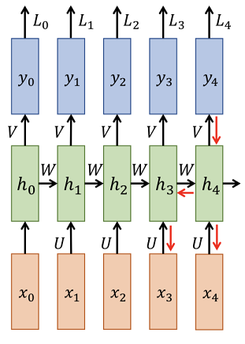
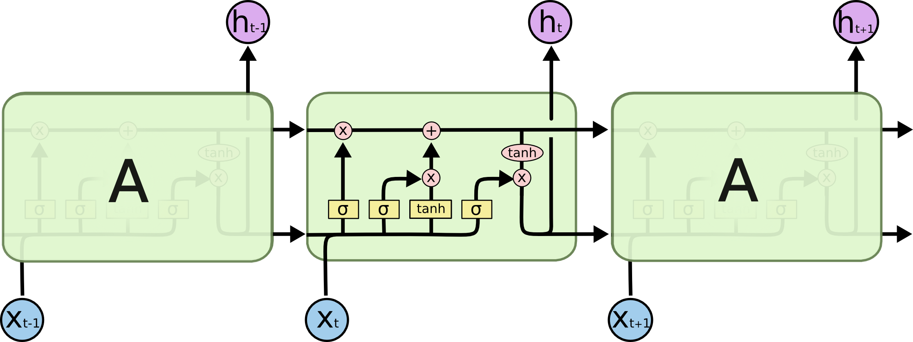

# RNN的反向传播原理

* [返回上层目录](../back-propagation.md)
* [RNN的运行原理](#RNN的运行原理)
* [求矩阵的反向传播梯度](#求矩阵的反向传播梯度)
* [链式传播导致的梯度消失和梯度爆炸](#链式传播导致的梯度消失和梯度爆炸)
* [LSTM的门控机制如何缓解梯度消失、爆炸问题](#LSTM的门控机制如何缓解梯度消失、爆炸问题)

# RNN的运行原理

RNN的运行原理：
$$
\begin{aligned}
h_t&=\tanh(Wh_{t-1}+Ux_t)\\
y_t&=Vh_t\\
L_t&=(y_t-y_{t0})^2
\end{aligned}
$$

#  求矩阵的反向传播梯度

此时，以矩阵$U$为例，求其偏导数来更新其参数。

RNN中反向传播使用的是back propagation through time(BPTT)方法，损失loss对参数W的梯度等于loss在各时间步对w求导之和。用公式表示就是：
$$
\frac{\partial L}{\partial U} = \sum_t \frac{\partial L_t}{\partial U}
$$
以其中某个时刻来举例，例如$t=4$时，
$$
\frac{\partial L_4}{\partial U}=\frac{\partial L_4}{\partial y_4}\frac{\partial y_4}{\partial h_4}\frac{\partial h_4}{\partial U}
$$
其中，
$$
h_4=\tanh(Wh_3+Ux_4)
$$
而此处的$h_3$也是依赖$U$的，因为$U$矩阵的参数共享。

也就是说，由于$h_4$依赖于$U$，并且它还依赖于前面的隐藏状态$h3,h2,h1$，需要用链式法则递归地展开。

现在我们要求的是
$$
\frac{\partial h_4}{\partial U}
$$
（1）直接依赖关系的梯度

从公式$h_4=\tanh(Wh_3+Ux_4)$可以看出，$h_4$直接依赖于$U$。因此：
$$
\frac{\partial h_4}{\partial U}=\frac{\partial h_4}{\partial Wh_3+Ux_4}\cdot\frac{\partial (Wh_3+Ux_4)}{\partial U}
$$

* 第一部分：$\frac{\partial h_4}{\partial Wh_3+Ux_4}$

  使用$h_4=\tanh(Wh_3+Ux_4)$的导数性质，得到：
  $$
  \frac{\partial h_4}{\partial Wh_3+Ux_4}=1-h_4^2
  $$

* 第二部分：$\frac{\partial (Wh_3+Ux_4)}{\partial U}$

  这里$Ux_4$是矩阵与向量的乘积，直接对$U$求导会得到输入向量$x4$：
  $$
  \frac{\partial (Wh_3+Ux_4)}{\partial U}=W\frac{\partial h_3}{\partial U}+x_4^T
  $$

所以：
$$
\begin{aligned}
\frac{\partial h_4}{\partial U}&=(1-h_4^2)\cdot (W\frac{\partial h_3}{\partial U}+x_4^T)\\
&=(1-h_4^2)x_4^T+(1-h_4^2)\cdot W\frac{\partial h_3}{\partial U}
\end{aligned}
$$
这其实是一个递归公式：
$$
\frac{\partial h_t}{\partial U}=(1-h_t^2)x_t^T+(1-h_t^2)\cdot W\frac{\partial h_{t-1}}{\partial U}
$$
梯度计算的直观含义

- 第一项：$(1-h_t^2)x_t^T+(1-h_t^2)$表示时间步$t$的当前输入对$U$的贡献。
- 第二项：$(1-h_t^2)\cdot W\frac{\partial h_{t-1}}{\partial U}$表示通过前面时间步$t−1$间接传递过来的梯度贡献。

对于$t=4$，梯度会依次向前递归，直到时间步$t=0$。

我们将上面递归公式逐步展开，得到最终的梯度表达式。
$$
\begin{aligned}
\frac{\partial h_4}{\partial U}&=(1-h_4^2)x_4^T+(1-h_4^2)\cdot W\frac{\partial h_3}{\partial U}\\
&=\prod_{t=4}^{4}(1-h_t^2)x_4^T+(1-h_4^2)\cdot W\left((1-h_3^2)x_3^T+(1-h_3^2)\cdot W\frac{\partial h_2}{\partial U}\right)\\
&=\prod_{t=4}^{4}(1-h_t^2)x_4^T+\prod_{t=3}^{4}(1-h_t^2) W x_3^T+\prod_{t=3}^{4}(1-h_t^2) W^2\frac{\partial h_2}{\partial U}\\
&=\prod_{t=4}^{4}(1-h_t^2)x_4^T+\prod_{t=3}^{4}(1-h_t^2) W x_3^T+\prod_{t=3}^{4}(1-h_t^2) W^2\left((1-h_2^2)x_2^T+(1-h_2^2)\cdot W\frac{\partial h_1}{\partial U}\right)\\
&=\prod_{t=4}^{4}(1-h_t^2)x_4^T+\prod_{t=3}^{4}(1-h_t^2)W x_3^T+\prod_{t=2}^{4}(1-h_t^2) W^2x_2^T+\prod_{t=2}^{4}(1-h_t^2)\cdot W^3\frac{\partial h_1}{\partial U}\\
&=\prod_{t=4}^{4}(1-h_t^2)x_4^T+\prod_{t=3}^{4}(1-h_t^2)W x_3^T+\prod_{t=2}^{4}(1-h_t^2) W^2x_2^T+\prod_{t=2}^{4}(1-h_t^2)\cdot W^3\left((1-h_1^2)x_1^T+(1-h_1^2)\cdot W\frac{\partial h_{0}}{\partial U}\right)\\
&=\prod_{t=4}^{4}(1-h_t^2)x_4^T+\prod_{t=3}^{4}(1-h_t^2)W x_3^T+\prod_{t=2}^{4}(1-h_t^2) W^2x_2^T+\prod_{t=1}^{4}(1-h_t^2)\cdot W^3\cdot x_1^T+\prod_{t=1}^{4}(1-h_t^2)\cdot W^4\frac{\partial h_{0}}{\partial U}\\
&=\prod_{t=4}^{4}(1-h_t^2)x_4^T+\prod_{t=3}^{4}(1-h_t^2)W x_3^T+\prod_{t=2}^{4}(1-h_t^2) W^2x_2^T+\prod_{t=1}^{4}(1-h_t^2)\cdot W^3\cdot x_1^T+\prod_{t=1}^{4}(1-h_t^2)\cdot W^4\cdot (1-h_0^2)\cdot x_0^T\\
&=\prod_{t=4}^{4}(1-h_t^2)x_4^T+\prod_{t=3}^{4}(1-h_t^2)W x_3^T+\prod_{t=2}^{4}(1-h_t^2) W^2x_2^T+\prod_{t=1}^{4}(1-h_t^2)\cdot W^3\cdot x_1^T+\prod_{t=0}^{4}(1-h_t^2)\cdot W^4\cdot x_0^T\\
&=\sum_{s=0}^4W^{4-s}\prod_{t=s}^{4}(1-h_t^2)x_s^T\\
&=\sum_{s=0}^4\left(W^{4-s}\prod_{t=s+1}^{4}(1-h_t^2)\right)\left((1-h_s^2)x_s^T\right)\\
&=\sum_{s=0}^4\left(W^{4-s}\prod_{t=s+1}^{4}(1-h_t^2)\right)\frac{\partial h_s}{\partial U}\quad (1)\frac{\partial h_s}{\partial U}=(1-h_s^2)x_s^T\\
&=\sum_{s=0}^4\frac{\partial h_4}{\partial h_s}\frac{\partial h_s}{\partial U}\quad (2)\frac{\partial h_t}{\partial h_s}=W^{4-s}\prod_{t=s+1}^{4}(1-h_t^2)\\
\end{aligned}
$$
注意：上式中的(1)处的$\frac{\partial h_s}{\partial U}=(1-h_s^2)x_s^T$中的$h_s$只考虑当前步的$x_s$的影响，即此处$h_s=\tanh(Ux_s)$，而不是通常的$h_s=\tanh(Wh_{s-1}+Ux_s)$

所以有：
$$
\begin{aligned}
\frac{\partial h_4}{\partial U}&=(1-h_4^2)x_4^T+(1-h_4^2)\cdot W\frac{\partial h_3}{\partial U}\\
&=\sum_{s=0}^4\frac{\partial h_4}{\partial h_s}\frac{\partial h_s}{\partial U}
\end{aligned}
$$
所以，
$$
\begin{aligned}
\frac{\partial L_t}{\partial U}&=\frac{\partial L_t}{\partial y_t}\cdot \frac{\partial y_t}{\partial h_t}\cdot \frac{\partial h_t}{\partial U}\\
&=\frac{\partial L_t}{\partial y_t}\cdot \frac{\partial y_t}{\partial h_t}\cdot \sum_{s=0}^4\frac{\partial h_t}{\partial h_s}\frac{\partial h_s}{\partial U}\quad \text{here}\ \frac{\partial y_t}{\partial h_t}=V\ (\text{surpose} \ y_t=Vh_t)
\end{aligned}
$$
则
$$
\frac{\partial L}{\partial U} = \sum_t \frac{\partial L_t}{\partial U}= \sum_t\frac{\partial L_t}{\partial y_t}\cdot \frac{\partial y_t}{\partial h_t}\cdot \sum_{s=0}^4\frac{\partial h_t}{\partial h_s}\frac{\partial h_s}{\partial U}
$$

# 链式传播导致的梯度消失和梯度爆炸

$$
\frac{\partial h_t}{\partial h_s}=\frac{\partial h_t}{\partial h_{t-1}}\cdot \frac{\partial h_{t-1}}{\partial h_{t-2}}... \frac{\partial h_{s+1}}{\partial h_{s}}
$$

这个公式是描述 **时间上的梯度依赖性**，并且与梯度消失和梯度爆炸的问题有关。

每个时间步$h_{t}$对前一个时间步$h_{t-1}$的梯度可以表示为：
$$
\frac{\partial h_t}{\partial h_{t-1}} = W \cdot \text{diag}(1 - h_t^2)
$$
这里：

- $W$是RNN中隐藏层的权重矩阵；
- $\text{diag}(1 - h_t^2)$是激活函数（假设是$\tanh$）的导数。

公式中$\frac{\partial h_t}{\partial h_s}$是这类项的累积乘积，即：
$$
\frac{\partial h_t}{\partial h_s} = W^{t-s} \cdot \prod_{k=s+1}^t \text{diag}(1 - h_k^2)
$$
**梯度传播中的问题**

随着时间步数$t−s$增加，这个累积乘积会带来两个潜在问题：

1. **梯度消失：**

   - 如果$W$的特征值小于 1（或者是激活函数的梯度较小），那么连续的矩阵乘积会让梯度值指数级地衰减。

   - 导致较早时间步$h_s$对当前时间步$h_t$的影响几乎消失，网络无法捕捉到长期依赖信息。loss对时间步j的梯度值反映了时间步$s$对最终输出$y_t$的影响程度。j对最终输出$y_t$的影响程度越大，loss对时间步$s$的梯度值也就越大。如果loss对时间步$s$的梯度值趋于0，说明$s$对最终输出$y_t$没影响，就是常说的长期遗忘问题了。

     综上：距离时间步$t$较远的$s$的梯度会消失，$s$对最终输出$y_t$没影响。就是RNN中不能长期依赖问题。

2. **梯度爆炸：**

   - 如果$W$的特征值大于1，那么连续的矩阵乘积会导致梯度值指数级地增长。
   - 导致梯度变得非常不稳定，从而使训练过程中的参数更新变得不可控。

这两个问题统称为**梯度消失和梯度爆炸问题**，是经典RNN模型的核心挑战之一。

**如何缓解这些问题？**

1. **使用梯度截断（Gradient Clipping）：**
   - 将梯度的大小限制在一定范围内，以避免梯度爆炸问题。
2. **使用改进的网络结构（如 LSTM 和 GRU）：**
   - LSTM和GRU通过引入门机制（例如遗忘门和输入门），能够更好地捕捉长期依赖信息，并缓解梯度消失问题。

# LSTM的门控机制如何缓解梯度消失、爆炸问题

当然，裁剪的方式虽然也能work，但终究是无奈之举，况且裁剪也只能解决梯度爆炸问题，解决不了梯度消失，如果能从模型设计上解决这个问题，那么自然是最好的。传说中的LSTM就是这样的一种设计，真相是否如此？我们马上来分析一下。

LSTM的更新公式比较复杂，它是：
$$
\begin{aligned}
f_t&=\sigma(W_fx_t+U_fh_{t-1}+b_f)\\
i_t&=\sigma(W_ix_t+U_ih_{t-1}+b_i)\\
o_t&=\sigma(W_ox_t+U_oh_{t-1}+b_o)\\
\hat{c}_t&=\tanh(W_cx_t+U_ch_{t-1}+b_c)\quad \text{input}\\
c_t&=f_t\odot c_{t-1}+i_t\odot \hat{c}_t\\
h_t&=o_t\odot \tanh(c_t)
\end{aligned}
$$
我们可以像上面一样计算$\frac{\partial h_t}{\partial h_{t-1}}$，但从$h_t=o_t\odot \tanh(c_t)$可以看出分析$c_t$就等价于分析$h_t$，而计算$\frac{\partial c_t}{\partial c_{t-1}}$显得更加简单一些，因此我们往这个方向走。

同样地，我们先只关心链式长度为1的情形，这时候根据求导公式，我们有
$$
\frac{\partial c_t}{\partial c_{t-1}}=f_t+c_{t-1}\frac{\partial f_t}{\partial c_{t-1}}+\hat{c}_t\frac{\partial i_t}{\partial c_{t-1}}+i_t\frac{\partial \hat{c}_t}{\partial c_{t-1}}
$$
右端第一项$f_t$，也就是我们所说的“遗忘门”，从下面的论述我们可以知道一般情况下其余三项都是次要项，因此$f_t$是“主项”，由于$f_t$在0～1之间，因此就意味着梯度爆炸的风险将会很小，至于会不会梯度消失，取决于$f_t$是否接近于1。但非常碰巧的是，这里有个相当自洽的结论：**如果我们的任务比较依赖于历史信息，那么$f_t$就会接近于1，这时候历史的梯度信息也正好不容易消失；如果$f_t$很接近于0，那么就说明我们的任务不依赖于历史信息，这时候就算梯度消失也无妨了**。

所以，现在的关键就是看“**其余三项都是次要项**”这个结论能否成立。后面的三项都是“一项乘以另一项的偏导”的形式，而且求偏导的项都是$\sigma$或$\tanh$激活，前面在回顾数学公式的时候说了$\sigma$和$\tanh$基本上是等价的，因此后面三项是类似的，分析了其中一项就相当于分析了其余两项。以第二项为例，代入$h_{t-1}=o_{t-1}\odot \tanh(c_{t-1})$，可以算得：
$$
\begin{aligned}
c_{t-1}\frac{\partial f_t}{\partial c_{t-1}}&=c_{t-1}\frac{\partial f_t}{\partial h_{t-1}}\frac{\partial h_{t-1}}{\partial c_{t-1}}\\
&=c_{t-1}\left(f_t(1-f_t)U_f\right)\frac{\partial h_{t-1}}{\partial c_{t-1}}\\
&=c_{t-1}\left(f_t(1-f_t)U_f\right)\left(o_{t-1}(1-\tanh^2(c_{t-1}))\right)
\end{aligned}
$$
注意到$f_t$,$1−f_t$,$o_{t−1}$都是在0～1之间，也可以证明$|c_{t-1}(1-\tanh^2(c_{t-1}))|<0.45$，因此它也在-1～1之间。所以$c_{t-1}\frac{\partial f_t}{\partial c_{t-1}}$就相当于1个$U_f$乘上4个门，结果会变得更加小，所以只要初始化不是很糟糕，那么它都会被压缩得相当小，因此占不到主导作用。跟简单RNN的梯度相比，它多出了3个门，所以这个变化说白点就是：1个门让你变不小，那我多来几个门还不行么？

剩下两项的结论也是类似的：
$$
\begin{aligned}
\hat{c}_t\frac{\partial i_t}{\partial c_{t-1}}=\hat{c}_t\left(i_t(1-i_t)U_i\right)\left(o_{t-1}(1-\tanh^2(c_{t-1}))\right)\\
i_t\frac{\partial \hat{c}_t}{\partial c_{t-1}}=i_t\left(1-\hat{c}_t^2\right)U_c\left(o_{t-1}(1-\tanh^2(c_{t-1}))\right)
\end{aligned}
$$
所以，后面三项的梯度带有更多的“门”，一般而言乘起来后会被压缩的更厉害，因此占主导的项还是$f_t$，$f_t$在0～1之间这个特性决定了它梯度爆炸的风险很小，同时$f_t$表明了模型对历史信息的依赖性，也正好是历史梯度的保留程度，两者相互自洽，所以LSTM也能较好地缓解梯度消失问题。因此，LSTM同时较好地缓解了梯度消失/爆炸问题，现在我们训练LSTM时，多数情况下只需要直接调用Adam等自适应学习率优化器，不需要人为对梯度做什么调整了。

当然，这些结果都是“概论”，你非要构造一个会梯度消失/爆炸的LSTM来，那也是能构造出来的。此外，就算LSTM能缓解这两个问题，也是在一定步数内，如果你的序列很长，比如几千上万步，那么该消失的还会消失。毕竟单靠一个向量，也缓存不了那么多信息啊～

# 参考资料

* [也来谈谈RNN的梯度消失/爆炸问题](https://kexue.fm/archives/7888)

本文LSTM解决梯度爆炸消失部分参考了此博客。

===

* [LSTM,GRU为什么可以缓解梯度消失问题？](https://zhuanlan.zhihu.com/p/149819433)

