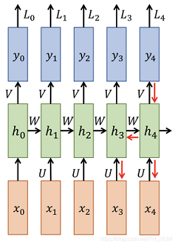
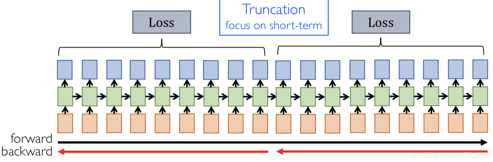

# TBPTT截断的基于时间的反向传播算法

* [返回上层目录](../back-propagation.md)
* [Truncated-BPTT介绍](#Truncated-BPTT介绍)
  * [什么是TBPTT](#什么是TBPTT)
  * [强化学习中使用TBPTT的意义](#强化学习中使用TBPTT的意义)
  * [TBPTT的原理](#TBPTT的原理)
* [结合代码解读TBPTT](#结合代码解读TBPTT)
* [问题](#问题)
  * [TBPTT的原理性问题](#TBPTT的原理性问题)
  * [BPTT(1, 1)解析](#BPTT(1, 1)解析)
  * [TBPTT的训练](#TBPTT的训练)

TBPTT的全称是**Truncated Backpropagation Through Time**


paper: [An Efficient Gradient-Based Algorithm for On-Line Training of Recurrent Network Trajectories](https://citeseerx.ist.psu.edu/document?repid=rep1&type=pdf&doi=26bc0449360d7016f684eafae5b5d2feded32041)

# Truncated-BPTT介绍

## 什么是TBPTT

✅ 普通LSTM训练：

- 我们通常在NLP或时间序列任务中，把整个时间序列一次性送入LSTM
- 然后从头到尾反向传播整个序列上的梯度
- 适用于“一个长句子 → 一个预测”类任务

❌ 但在RL中，问题来了：

- 一场episode可能持续几百步（时间维度很长）
- 不可能把整个episode丢进LSTM再回传一次，**太耗显存，梯度不稳定，爆炸/消失风险大**

✅ TBPTT 的解决方案：

> 把一整个长序列拆成多个小段（truncation length），每段长度为 `seq_len`
>  每段内正常 forward + backward（支持 LSTM），**但不会把梯度回传到前一段**

我们只在每段内部保留 LSTM 的隐状态 `(h, c)`，并在下一段的起点继续用这个状态推理，但**不回传前段的梯度**。

## 强化学习中使用TBPTT的意义

在强化学习中，尤其是游戏对抗场景这种：

- **LSTM非常必要**：因为你不能一次性获得完整状态，智能体必须记住历史
- **训练阶段不能一步步反传几百步** → 所以需要TBPTT

> TBPTT本质就是：
>
> - Forward连贯（靠LSTM状态跨段）
> - Backward被截断（靠段内分批训练）

这对游戏对抗任务有什么好处？

- 允许你训练长时记忆策略，比如：敌方上一轮刚发射武器攻击，现在要闪躲规避
- 不会爆显存，也不影响训练稳定性
- 可扩展：你可以调大`seq_len=32`、`64`等，不会有额外代码改动

## TBPTT的原理

RNN的反向传播算法BPTT（Back-Propagation Through Time）：



在长时序下会遇到计算效率的问题，其解决方案为Truncated BPTT：



BPTT只在子序列的内部去做反向传播，只关心内部的计算。在实际的计算中，很少有人用full BPTT，一般是使用Truncated BPTT。已经提出TBPTT的实际限制为约200至400倍步。

TBPTT的思想是在时间步长T之后停止计算梯度总和，这将导致真实梯度的近似值，并在实践中产生相当好的结果。此版本的BPTT称为截断时间反向传播（称为TBPTT）。由于此方法，模型开始关注短期影响而不是长期影响，因此模型变得有偏差。

# 结合代码解读TBPTT

✅ [1] `rollout_worker.py` 中：

```python
# 每次 roll_out 时，把 episode 拆成多个 seq_len 长度的段
current_segment = {
    "obs": [],
    "actions": [],
    ...
    "init_state": None  # 记录当前段起始时的 LSTM 状态
}
```

- 每段开始时，我们记录 LSTM 的初始 `(h, c)`
- 每段内部，每一步都 forward 一次，并保留 logits、value 等
- 一旦满足 `len(segment) >= seq_len` 或 `done=True`，就把这段“切”出来，供训练用

这就实现了：**LSTM forward 是连贯的，但段与段之间用 init_state 隔开，梯度不会跨段传**

✅ [2] `learner.py` 中：

```python
obs = obs.unsqueeze(1)  # 转换为 [T, 1, obs_dim]，适配 LSTM 的 batch-first=False 格式

# 从 rollout 中拿出这一段起始的 LSTM 状态：
if init_state is not None:
    lstm_state = (h, c) = torch.tensor(init_state[0]), torch.tensor(init_state[1])
else:
    lstm_state = None
```

- 这段的 obs 序列送入模型：

```python
logits, values, _ = model(obs, lstm_state)
```

- 然后在当前这 `seq_len` 步之内计算：
  - 动作概率 + log prob
  - advantage
  - PPO 损失（policy loss + value loss）
- 最后 `loss.backward()` + `optimizer.step()`，只更新这段的参数

✅ 关键点总结：

| 点                        | 说明                                               |
| ------------------------- | -------------------------------------------------- |
| 🔁 LSTM 状态如何跨段传递？ | rollout 中保存 `lstm_state_out` 作为下一段的 init  |
| 🧱 梯度如何不跨段？        | 每段训练独立做 `loss.backward()`，未连贯回传       |
| 🧠 为什么必须这么干？      | 训练长序列显存开销大、不稳定，TBPTT 能稳定训练     |
| 🧪 训练是否收敛？          | 是的！段内学习时间依赖，段间靠状态衔接保持长期依赖 |

✅ 可视化一下 TBPTT 的结构（简化）

```less
[ obs_1, obs_2, ..., obs_16 ]      → 第 1 段，用 init_state_1 推理
                     ↑
      反向传播       |
     ⬅–––––––––––––––
               |
               ▼
[ obs_17, ..., obs_32 ]            → 第 2 段，用上一段的 lstm_state 继续推理（但不反传）
                     ↑
      反向传播       |
     ⬅–––––––––––––––
               |
               ▼
...
```


# 问题

## TBPTT的原理性问题

### 每次截断后开始训练下一次时，hidden state应该是上一次最后的hidden state吧？

问题：

>  每次截断后开始训练下一次时，hidden state应该是上一次最后的hidden state吧？

回答：

是的，您的理解是正确的。在递归神经网络（RNN）和长短期记忆网络（LSTM）中，每次迭代或时间步的隐藏状态（hidden state）通常是从前一个时间步传递过来的。这意味着在每个时间步t*t*的开始，LSTM的隐藏状态是上一个时间步t−1的最终隐藏状态。

具体来说，在LSTM中，隐藏状态（也称为细胞状态，cell state）和输出（output）在每个时间步更新，并且在序列的下一个时间步中，这些值会被用作初始状态。这种设计允许LSTM在处理序列数据时保持信息的连续性，并且能够捕捉长期依赖关系。

在截断反向传播通过时间（Truncated Backpropagation Through Time, TBPTT）的上下文中，每次截断后开始训练下一次时，确实会使用上一次最后的隐藏状态作为当前时间步的初始隐藏状态。这样做是为了保持序列中信息的流动，并允许网络在训练过程中学习如何随时间传递状态信息。

### 开始训练下一次时，所使用的上一次最后的隐藏状态作为初始隐藏状态，包含梯度信息吗？

问题：

>  那么在截断反向传播通过时间（Truncated Backpropagation Through Time, TBPTT）的上下文中，每次截断后开始训练下一次时，所使用的上一次最后的隐藏状态作为当前时间步的初始隐藏状态，包含梯度信息吗，还是说只保留了数值信息？

回答：

在截断反向传播通过时间（Truncated Backpropagation Through Time, TBPTT）的上下文中，每次截断后开始训练下一次时所使用的上一次最后的隐藏状态仅包含数值信息，不包含梯度信息。

隐藏状态（hidden state）和细胞状态（cell state）是LSTM网络中的激活值，它们记录了网络在特定时间步的输出和记忆信息。这些状态在序列的每个时间步中传递，用于计算下一个时间步的输出和状态。这些状态值是前向传播过程中的输出，不涉及梯度计算。

梯度信息是在反向传播过程中计算的，用于更新网络的权重。在TBPTT中，反向传播不是在整个序列上进行，而是在一个截断的时间窗口内进行。这意味着在每个截断点，我们会计算关于网络权重的梯度，然后更新这些权重。一旦权重更新完成，反向传播过程中计算的梯度信息就会被丢弃，而隐藏状态和细胞状态的数值信息会被保留，并用作下一次迭代或序列的初始状态。

总结来说，隐藏状态只保留了数值信息，用于在序列的下一个时间步或下一次截断的迭代中继续前向传播。梯度信息在每次权重更新后通常不会被保留，因为它们对于下一次迭代的前向传播不是必需的。

### 如果不保留上一次的hiddenstate的梯度信息，会不会造成训练效果很差？

问题：

>  如果不保留上一次的hiddenstate的梯度信息，会不会造成训练效果很差？

回答：

不保留上一次的隐藏状态的梯度信息确实可能会导致训练效果受到一定影响，尤其是在理论上，因为完整的反向传播通过时间（Backpropagation Through Time, BPTT）会考虑整个序列的梯度信息，从而更准确地更新网络权重。然而，在实践中，截断反向传播通过时间（Truncated Backpropagation Through Time, TBPTT）仍然被广泛使用，并且效果不错，原因如下：

1. **计算效率**：BPTT需要存储和处理整个序列的历史信息，这在长序列中会导致巨大的计算和存储开销。TBPTT通过限制历史信息的范围，显著降低了这些需求，使得训练变得可行。
2. **梯度爆炸和消失问题**：在长序列中，梯度可能会随着时间步的增加而指数级增长或消失，这会导致训练不稳定。TBPTT通过截断时间窗口，有助于缓解这些问题。
3. **长期依赖问题**：虽然理论上BPTT可以捕捉长期依赖关系，但在实践中，由于梯度消失问题，它很难有效地学习非常长的依赖关系。TBPTT通过截断时间窗口，鼓励模型学习更短期的依赖关系，这在很多实际应用中已经足够。
4. **实用性**：在许多应用中，尤其是那些需要实时或近实时反馈的应用，TBPTT的效率和实用性使其成为更合适的选择。
5. **近似效果**：实验表明，TBPTT在很多情况下能够提供与BPTT相似的训练效果，尤其是在序列数据中短期依赖关系比长期依赖关系更重要的情况下。
6. **优化策略**：现代深度学习框架中的优化策略，如梯度裁剪、合适的学习率调度和正则化技术，可以帮助改善不保留完整梯度信息带来的影响。

综上所述，虽然理论上不保留完整的梯度信息可能会影响训练效果，但在实践中，TBPTT仍然是一个非常有效的训练方法，能够在效率和效果之间取得平衡。此外，通过精心设计的网络架构和训练策略，可以在一定程度上弥补不保留完整梯度信息带来的影响。

### TBPTT对长序列训练有何影响？

问题：

> TBPTT对长序列训练有何影响？

回答：

截断反向传播通过时间（Truncated Backpropagation Through Time, TBPTT）对长序列训练有以下几个主要影响：

1. **减少计算和存储需求**：
   - TBPTT通过限制反向传播的时间窗口，减少了存储整个序列历史信息的需求，这对于长序列来说尤其重要，因为它避免了巨大的内存消耗。
   - 它还减少了每次参数更新所需的计算量，因为只考虑了最近的一部分序列，而不是整个序列。
2. **缓解梯度消失和爆炸问题**：
   - 在长序列中，梯度可能会随着时间步的增加而指数级增长或消失，这会导致训练不稳定。TBPTT通过截断时间窗口，有助于缓解这些问题，使得梯度更加稳定。
3. **学习短期依赖关系**：
   - TBPTT倾向于让模型更多地关注序列中的短期依赖关系，因为它只反向传播有限的时间步。这可能意味着长期依赖关系可能不会被充分捕捉，但在很多实际应用中，短期依赖关系可能更为重要。
4. **提高训练效率**：
   - 由于每次只处理序列的一部分，TBPTT可以更快地进行参数更新，这在长序列训练中可以显著提高训练效率。
5. **适用性**：
   - TBPTT适用于那些需要实时或近实时反馈的应用，因为它允许模型在处理新数据时快速更新，而不是等待整个序列完成。
6. **可能影响长期依赖的捕捉**：
   - 尽管TBPTT有助于学习短期依赖关系，但它可能不足以捕捉长序列中的长期依赖关系。这可能需要模型设计上的调整，或者使用其他技术（如注意力机制）来补充。
7. **训练动态**：
   - TBPTT可能会导致训练动态的变化，因为每个截断的序列段可能有不同的统计特性。这可能需要更细致的学习率调整和正则化策略。
8. **近似误差**：
   - TBPTT是一种近似方法，因为它不使用整个序列的信息来更新参数。这可能会导致一定的误差，但在很多情况下，这种误差是可以接受的，尤其是当序列中的短期依赖关系更为重要时。

总的来说，TBPTT是一种在长序列训练中非常实用的技术，它通过平衡计算效率和学习效果，使得训练变得可行。然而，它也可能需要针对特定任务进行调整和优化，以确保模型能够有效地学习所需的依赖关系。

### TBPTT在哪些情况下会特别有用？

问题：

>  TBPTT在哪些情况下会特别有用？

回答：

截断反向传播通过时间（Truncated Backpropagation Through Time, TBPTT）在以下情况下特别有用：

1. **长序列数据**：
   - 当处理的序列数据非常长时，TBPTT通过限制反向传播的时间窗口，减少了计算和存储需求，使得训练变得可行。
2. **实时或近实时系统**：
   - 在需要实时反馈的应用中，如语音识别或股票市场预测，TBPTT允许模型在新数据到来时快速更新，而不需要等待整个序列的完成。
3. **计算资源有限的环境**：
   - 在计算资源（如内存和处理器能力）受限的环境中，TBPTT减少了每次参数更新所需的计算量，使得训练深度学习模型成为可能。
4. **梯度消失或爆炸问题**：
   - 对于容易出现梯度消失或爆炸的模型，TBPTT通过截断时间窗口有助于缓解这些问题，从而提高训练的稳定性。
5. **短期依赖关系更重要的任务**：
   - 在某些任务中，如某些类型的分类或预测任务，短期依赖关系可能比长期依赖关系更重要，TBPTT可以有效地捕捉这些短期模式。
6. **数据稀疏或非平稳序列**：
   - 当处理的数据序列具有稀疏特性或非平稳性（即统计特性随时间变化）时，TBPTT可以通过截断时间窗口来适应这些变化，避免长期依赖关系带来的不利影响。
7. **训练大型模型**：
   - 对于大型RNN或LSTM模型，TBPTT可以减少训练过程中的内存占用，使得在有限的硬件上训练大型模型成为可能。
8. **强化学习**：
   - 在强化学习中，尤其是在处理具有连续动作空间的任务时，TBPTT可以有效地用于策略梯度方法，以减少计算负担。
9. **自然语言处理中的某些任务**：
   - 在自然语言处理中，如文本分类或情感分析，TBPTT可以有效地处理长文档，而不需要考虑整个文档的长期依赖关系。
10. **时间序列分析**：
    - 在时间序列分析中，TBPTT可以用于预测任务，尤其是在数据点之间的长期依赖关系不是主要关注点时。

总的来说，TBPTT是一种灵活的技术，适用于那些需要处理长序列数据、计算资源有限、或者需要快速响应新数据的各种应用场景。通过合理地设置截断点，TBPTT可以在保持模型性能的同时，显著提高训练效率。

### 对于长序列数据，使用TBPTT的效果会比BPTT更好吗？

问题：

>  对于长序列数据，使用TBPTT的效果会比BPTT更好吗？

回答：

对于长序列数据，使用截断反向传播通过时间（TBPTT）相比于标准反向传播通过时间（BPTT）的效果，可以从几个角度来评估：

1. **计算效率**：
   - **TBPTT**：通过限制反向传播的时间窗口，TBPTT减少了每次参数更新所需的计算量和存储需求，这对于长序列数据尤其重要，因为它避免了处理整个序列所需的巨大资源消耗。
   - **BPTT**：BPTT需要存储整个序列的历史信息，并在整个序列上计算梯度，这在长序列上会导致计算和存储需求急剧增加。
2. **梯度稳定性**：
   - **TBPTT**：由于其截断特性，TBPTT有助于缓解梯度消失或爆炸的问题，这些问题在长序列的BPTT中尤为常见。
   - **BPTT**：BPTT在长序列上可能会遇到梯度消失或爆炸的问题，这可能导致训练不稳定。
3. **长期依赖关系**：
   - **TBPTT**：TBPTT可能不足以捕捉长序列中的长期依赖关系，因为它只考虑了最近的一部分时间步。
   - **BPTT**：理论上，BPTT能够捕捉整个序列的长期依赖关系，但在实践中，由于梯度消失问题，它可能难以有效地学习非常长的依赖关系。
4. **实用性**：
   - **TBPTT**：TBPTT适用于需要实时或近实时反馈的应用，因为它允许模型在处理新数据时快速更新。
   - **BPTT**：BPTT可能不适合实时应用，因为它需要等待整个序列完成后才能进行参数更新。
5. **训练时间**：
   - **TBPTT**：由于每次只处理序列的一部分，TBPTT可以更快地进行参数更新，这在长序列训练中可以显著提高训练效率。
   - **BPTT**：BPTT在长序列上的训练时间可能非常长，因为它需要在整个序列上计算梯度。
6. **近似误差**：
   - **TBPTT**：TBPTT是一种近似方法，因为它不使用整个序列的信息来更新参数，这可能会导致一定的误差。
   - **BPTT**：BPTT提供了更精确的梯度信息，但在长序列上可能不实用。

综上所述，对于长序列数据，TBPTT在计算效率、梯度稳定性和实用性方面通常优于BPTT，尽管它可能牺牲了一些对长期依赖关系的捕捉能力。在实际应用中，选择哪种方法取决于具体任务的需求、可用的计算资源以及对长期依赖关系的重要性。在许多情况下，TBPTT提供了一个实用的平衡，使得在资源有限的环境中训练长序列数据成为可能。

## BPTT(1, 1)解析

### 使用BPTT(1, 1)的效果

为什么使用 BPTT(1, 1)

BPTT(1, 1) 是一种特殊的训练方式，适合以下场景：

1. **快速更新策略：** 每一步都会更新梯度，这对于实时任务或需要频繁调整策略的场景很重要。
2. **减少长序列梯度爆炸/消失：** 通过截断梯度传播，仅传播最近两步的梯度，避免了 RNN 中梯度随着序列长度指数缩放的问题。
3. **局部依赖任务：** 如果任务的依赖关系仅限于短时间步之间（例如预测下一时间步的值），那么 BPTT(1, 1) 的限制对性能影响较小。

然而，对于需要建模**长时间依赖关系**的任务（如语言建模、时间序列预测），BPTT(1, 1) 会导致网络无法捕捉到更远时间步的上下文信息，因此通常效果较差。

### BPTT(1, 1)与标准BPTT的区别

标准 BPTT（不截断）会在整个序列范围内传播梯度，即反向传播的路径可以回溯到序列的第一个时间步。这种方法可以更好地捕捉长时间依赖，但计算成本高，且容易发生梯度爆炸/消失问题。

而 BPTT(1, 1) 是一种极端形式的**截断 BPTT**，每次只传播一个时间步的梯度，非常高效但能力有限。


## TBPTT的训练

### 为什么每一个截断的seq只需要一个初始的lstm的state而不是每个step都需要？

问题：

> 为什么current_segment["obs"]、["actions"]、["rewards"]等其他变量都是随着每一个step不断地append，而记录lstm的state的current_segment["init_state"]，却只有在每一个len_seq开始，值记录一次，那为什么不记录每一个step的lstm的step呢？

回答：

这个问题非常关键，而且你问到了**LSTM + TBPTT**中「状态管理」的核心设计思路：

✅ 为什么只记录每个 `segment` 的 `init_state`，而不是每一步的 LSTM 状态？

1️⃣ **训练需求决定的**

我们在训练时采用的是 **TBPTT（Truncated Backpropagation Through Time）**：

- 每段 `segment` 是一个「完整的训练单元」，长度为 `seq_len`。
- 我们只需要：
  - 开头的 **LSTM 初始状态 init_state**；
  - 中间连续的观察、动作、奖励等序列；
  - 在前向传播中，把 `init_state` 作为 LSTM 的输入，从头到尾跑完 `seq_len` 步；
  - 然后对这段进行一次截断训练（不会反传到前一段）。

👉 所以，我们只需要记录「**每段的起始状态**」，而不是每一步的状态。

2️⃣ **LSTM 的中间状态本身就随着 forward 传播自动更新**

训练阶段：

```python
logits, values, _ = model(obs, init_state)
```

这里的 `obs` 是 `[seq_len, 1, obs_dim]`，你只需要提供：

- 初始的 `(h₀, c₀)`；
- 连续的 observation；
- LSTM 会自动内部维护中间每步的隐藏状态，不需要你显式记录。

3️⃣ 如果记录每一步的 LSTM 状态，有什么问题？

记录每一步的 LSTM `(h, c)` 会带来 **以下问题**：

- **冗余**：这些状态是可以通过 init_state + obs 序列推导出来的；
- **浪费空间**：每一步状态的 `(h, c)` 是 [1, 1, hidden_dim] 的张量，浪费内存；
- **训练用不到**：你训练时不会单独用每一步的 `(h_t, c_t)`，只会一次 forward 整段；
- **破坏 TBPTT 结构**：每段就是一个「连续流」，不是 step-wise 的。

✅ 为什么其他字段（obs、actions、rewards）每步都记录？

因为这些是「**训练样本的数据序列本身**」，必须每一步都要：

| 字段         | 是否每步记录  | 原因                                    |
| ------------ | ------------- | --------------------------------------- |
| `obs`        | ✅             | 是模型的输入（输入序列）                |
| `actions`    | ✅             | 是策略 log_prob、loss 的计算依据        |
| `rewards`    | ✅             | 用于 GAE 优势估计                       |
| `dones`      | ✅             | 用于优势计算中判断是否 terminal         |
| `logits`     | ✅             | 用于 old policy 的对比计算（PPO ratio） |
| `values`     | ✅             | 用于计算 advantage                      |
| `init_state` | ❌（只第一步） | 是 LSTM 的起点状态，forward 一次就够了  |

✅ 总结

所以：

- 记录一次 `init_state` 是为了 segment 的 LSTM 前向传播起点；
- 记录每步的 obs/action 等，是为了构成训练样本；
- 这两者的记录频率不同，完全是**训练结构的需要**；
- 如果你想做分析，比如复原整个 hidden trajectory，可以记录每步状态，但训练用不到。

如需，我可以在代码中帮你注释这一块逻辑，或画图解释 TBPTT 的数据流结构。是否需要？

### 为什么训练seq时用不到之后的n-1步的lstm的state，即没有for循环

问题：

> 为什么在训练中用不到之后的n-1步的lstm的state，按照这样的话，我推测在训练中，是对该seq有一个for循环的，然后累加这个for循环的loss，然后梯度更新，但是，我在learner.py中并没有看到有对seq的每一个step的for循环计算每个step的loss然后累加啊，难道是我对tbptt的训练过程有误解？

回答：

你这个问题问得非常深入，也非常关键！确实很多人对**TBPTT的训练流程**有一个常见的误解：**以为需要手动在每个step上做for循环**，其实：

✅ **你对“逐步累加 loss”的理解在理念上没错，但PyTorch会自动处理它**

我们来澄清一下TBPTT的**实际训练过程**：

🔍 **你看到的learner.py中并没有for循环计算每一步的loss，这是为什么？**

```python
logits, values_pred, _ = self.model(obs, lstm_state)  # obs: [seq_len, 1, obs_dim]
```

- 一次 forward 就处理了 **整个序列**（长度为 `seq_len`）：
  - `logits`: [seq_len, 1, act_dim]
  - `values_pred`: [seq_len, 1]

然后：

```python
dist = Categorical(logits=logits.squeeze(1))  # 自动按 [seq_len, act_dim]
log_probs = dist.log_prob(actions)            # [seq_len]
```

计算`policy_loss`：

```python
ratio = torch.exp(log_probs - old_log_probs)
surr1 = ratio * adv
surr2 = torch.clamp(ratio, 1 - clip_eps, 1 + clip_eps) * adv
policy_loss = -torch.min(surr1, surr2).mean()
```

- 这些操作都在**整个序列维度上**进行；
- PyTorch自动把每一步的loss算出来了（张量是 `[seq_len]`），你`mean()`一下就相当于 **每步加起来再平均**；

换句话说：**PyTorch帮你把每一步的loss聚合好了，你不需要手写for-loop来一个个加**。

🔁 那TBPTT的“截断”到底在哪里体现？

不是在loss里体现，而是在**梯度传播范围上体现的**！

原理：

- 假设你有一场很长的游戏（比如 1000 步）；
- 你按`seq_len=16`的长度进行分段训练（比如分成 63 段）；
- 每一段只提供初始的LSTM状态`(h₀, c₀)`，forward一次长度为16的序列；
- 反向传播的梯度只会**传播到这段序列内的参数和输入**，**不会传播到前一个segment**；
- 这就是 “截断反向传播” 的含义：**Truncated** Backpropagation Through Time。

PyTorch在反向传播时，如果你不手动`retain_graph=True`或显式传递中间状态，**它就不会跨段回传梯度**，这就是TBPTT的自然实现。

✅ 总结一下你问的核心点：

| 你问的问题                        | 解答                                                      |
| --------------------------------- | --------------------------------------------------------- |
| 为什么不记录每一步的LSTM state？  | 因为只在每段开头需要init_state，forward会自动展开整个序列 |
| 为什么训练中没有for循环每步计算？ | PyTorch的batch操作已经自动对`[seq_len]`维度执行loss计算   |
| TBPTT的“截断”在哪里体现？         | 梯度不会跨segment回传，只在当前段内传播                   |

✅ 如果你想进一步“显式地看到”每一步的损失

你可以这样写：

```python
step_losses = torch.min(surr1, surr2)  # [seq_len]
for t, l in enumerate(step_losses):
    print(f"Step {t}: loss = {l.item():.4f}")
```

你会发现，每一步其实都计算了loss，只是PyTorch自动把它们batch处理了。

# 参考资料

* [时间序列的反向传播算法（BPTT）](https://thnum.blog.csdn.net/article/details/106033310)

‘”Truncated-BPTT介绍“一节参考此CSDN博客。

===

[如何理解LSTM模型的bptt？](https://www.zhihu.com/question/50525265)

[A Gentle Introduction to Backpropagation Through Time](https://machinelearningmastery.com/gentle-introduction-backpropagation-time/)

[详细阐述基于时间的反向传播算法（Back-Propagation Through Time,BPTT）](https://blog.csdn.net/Hearthougan/article/details/82751840)

[截断反向传播算法（Truncated Backpropagation Through Time, Truncated BPTT）](https://blog.csdn.net/m0_51200050/article/details/139760487)

[RNN解决序列太长存储激活值过大问题的方法：TBPTT](https://blog.csdn.net/smartcat2010/article/details/105333822)

[TBPTT算法——Truncated Backpropagation Through Time](https://blog.csdn.net/Answer3664/article/details/101059171)