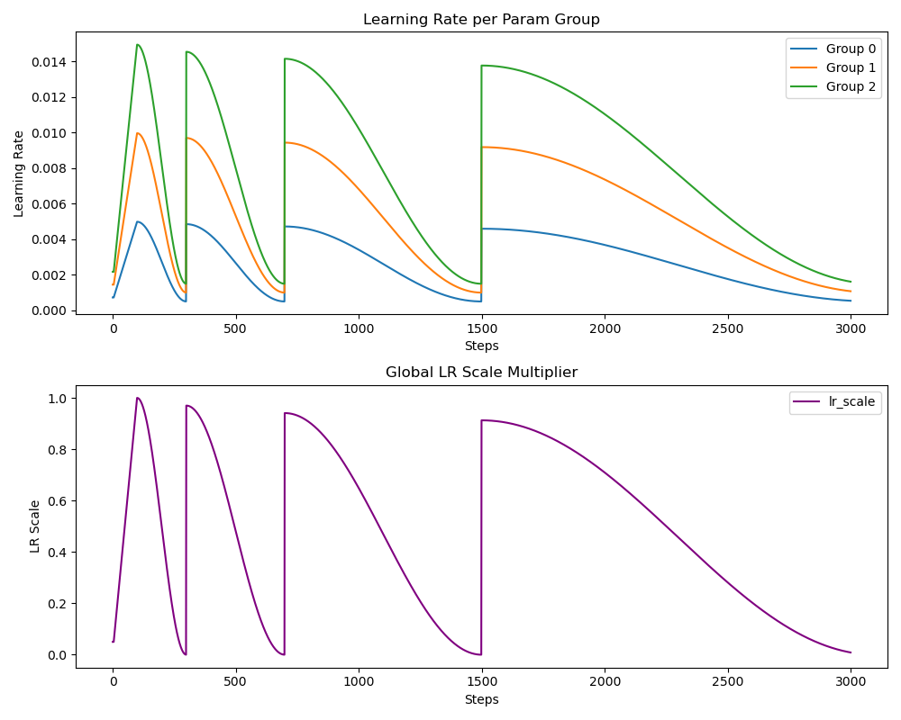
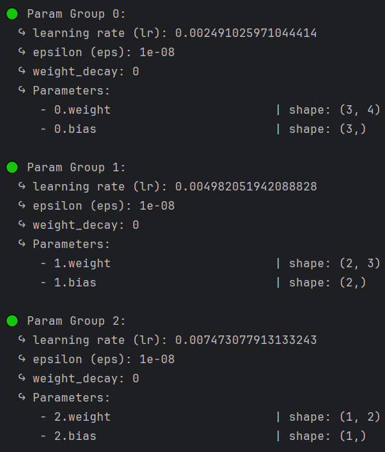

# 自定义LearningRateScheduler

- [返回上层目录](../learning-rate.md)
- [源码与测试脚本](#源码与测试脚本)
  - [源码](#源码)
  - [测试脚本](#测试脚本)
  - [使用示例](#使用示例)
- [源码的功能示例](#源码的功能示例)
  - [保存与恢复](#保存与恢复)
  - [可视化学习率变化](#可视化学习率变化)
  - [lambda自定义调度策略](#lambda自定义调度策略)
  - [参数组可视化](#参数组可视化)
  - [单元测试](#单元测试)
- [问题](#)
  - [最大和最小学习率比值的选取](#最大和最小学习率比值的选取)


本项目提供了一个结构清晰、功能全面、实用性强的**PyTorch自定义学习率调度器**，适用于深度强化学习等对训练过程有精细控制需求的场景。

调度器支持多种先进功能，包括：

- **Warm-up机制**：支持线性或余弦方式进行学习率预热；
- **余弦退火 + 重启**：通过周期性重启机制，动态调整学习率；
- **周期内指数衰减**：每个训练周期内可设置指数式衰减策略；
- **Batch Size自适应缩放**：根据当前batch size动态缩放学习率，支持线性、平方根、混合等缩放方式；
- **多参数组（param group）支持**：可为每组参数设定不同的初始学习率及调度策略；
- **Lambda 自定义调度函数**：支持任意函数定义调度策略，灵活性极高；
- **训练中断恢复机制**：支持完整的学习率状态保存与恢复，便于断点续训；
- **可视化工具**：内置学习率曲线绘图、保存与恢复机制，便于观察和调试训练过程；

核心调度器通过一个统一的类 `LRScheduler` 实现，接口友好，便于集成到任意PyTorch训练流程中，并对不同训练需求提供强大且可控的支持。

其对学习率的作用如下图所示：



# 源码与测试脚本

## 源码

初始化参数说明：

| 参数名             | 类型      | 默认值   | 说明                           |
| ------------------ | --------- | -------- | ------------------------------ |
| `optimizer`        | Optimizer | -        | PyTorch 优化器                 |
| `warmup_steps`     | int       | 100      | warm-up 步数                   |
| `warmup_scale_min` | float     | 0.05     | warm-up 起始比例               |
| `warmup_type`      | str       | "linear" | 可选 `linear` 或 `cosine`      |
| `T_0`              | int       | 200      | 第一个余弦重启周期长度         |
| `T_mult`           | int       | 2        | 每次重启后周期长度乘数         |
| `eta_scal_min`     | float     | 0.2      | 最低学习率缩放比例             |
| `eta_scal_max`     | float     | 2.0      | 最大学习率缩放比例             |
| `gamma`            | float     | 0.97     | 每次重启后的衰减因子           |
| `base_batch_size`  | int       | 64       | 参考 batch size，用于缩放      |
| `batch_size_mode`  | str       | "sqrt"   | 可选 `linear`、`sqrt`、`blend` |

```python
"""
Custom Learning Rate Scheduler for PyTorch
Supports:
- Warm-up (linear or cosine)
- Cosine Annealing with Warm Restarts
- Exponential Decay (per cycle)
- Batch size scaling (linear, sqrt, blend)
- Multi-parameter-group compatibility
- Custom lambda-based scheduling function
- Learning rate visualization and full training checkpointing support (save/load/resume)
"""
import math
from typing import Literal, Optional, Callable
from torch.optim import Optimizer


# 学习率调度器（支持batch_size自适应、周期重启、warmup、指数衰减、保存恢复）
class LRScheduler:
    def __init__(
            self,
            optimizer: Optimizer,  # torch.optim.Optimizer对象
            # 预热机制
            warmup_steps: int = 100,
            warmup_scale_min: float = 0.05,  # warmup阶段的比例一开始就是该值，别从0开始
            warmup_type: Literal["linear", "cosine"] = "linear",  # 预热机制是线性上升还是余弦上升
            # 余弦重启
            T_0: int = 200,  # 每T_0步进行一次重启，但周期步数会指数级增长
            T_mult: int = 2,  # 余弦重启的周期增长比例
            eta_scal_min: float = 0.2,  # 余弦重启的最小学习率对默认学习率的比值
            eta_scal_max: float = 2.0,  # 余弦重启的最大学习率对默认学习率的比值
            # 指数衰减
            gamma: float = 0.97,  # 指数衰减系数，在每次余弦重启的时候才衰减，而不是每一步
            # BatchSize缩放
            base_batch_size: int = 64,  # 参考学习率的基础batch size
            batch_size_mode: Literal["linear", "sqrt", "blend"] = "sqrt",
            #
            custom_lambda: Optional[Callable[[int], float]] = None  # 户可以传入一个函数，接受 global_step，返回一个用于缩放学习率的值。
    ):
        self.optimizer = optimizer
        self.base_lrs = [group['lr'] for group in self.optimizer.param_groups]
        # 冷启动
        self.warmup_steps = warmup_steps
        self.warmup_scale_min = warmup_scale_min
        self.warmup_type = warmup_type
        # 余弦重启
        self.T_0 = T_0
        self.T_mult = T_mult
        self.eta_min_lrs = [base_lr * eta_scal_min for base_lr in self.base_lrs]
        self.eta_max_lrs = [base_lr * eta_scal_max for base_lr in self.base_lrs]
        # 指数衰减
        self.gamma = gamma
        # BatchSize缩放
        self.base_batch_size = base_batch_size
        self.batch_size_mode = batch_size_mode
        #
        self.custom_lambda = custom_lambda  # 保存用户传入的函数

        self.global_step = 0
        self.T_i = T_0  # 当前周期长度
        self.T_cur = 0  # 当前周期内的step数
        self.cycle = 0  # 当前是第几次重启

        self.lr_scale = 1

    def step(self, batch_size=None):
        self.global_step += 1

        scale_batch = self.batch_size_step(batch_size)
        scale_warmup = self.warmup_step()
        scale_cosine = self.cosine_annealing_warm_restarts_step()
        scale_decay = self.exponential_decrease_step()
        scale_custom = self.custom_lambda_step()

        self.lr_scale = scale_batch * scale_warmup * scale_cosine * scale_decay * scale_custom

        for i, param_group in enumerate(self.optimizer.param_groups):
            lr_min, lr_max = self.eta_min_lrs[i], self.eta_max_lrs[i]
            adjusted_lr = lr_min + (lr_max - lr_min) * self.lr_scale
            param_group["lr"] = adjusted_lr

    def warmup_step(self):
        if self.global_step <= self.warmup_steps:
            progress = self.global_step / self.warmup_steps
            if self.warmup_type == "cosine":
                return max(self.warmup_scale_min, 0.5 * (1 - math.cos(progress * math.pi)))
            else:
                return max(self.warmup_scale_min, progress)
        else:
            return 1.0

    def cosine_annealing_warm_restarts_step(self):
        if self.global_step <= self.warmup_steps:
            return 1.0
        else:
            # 余弦重启阶段
            self.T_cur += 1
            if self.T_cur >= self.T_i:
                self.T_cur = 0
                self.T_i = self.T_i * self.T_mult  # 注意，这里不能是**
                self.cycle += 1

            cos_inner = math.pi * self.T_cur / self.T_i
            scale = 0.5 * (1 + math.cos(cos_inner))
            return scale

    def exponential_decrease_step(self):
        if self.global_step <= self.warmup_steps:
            return 1.0
        else:
            # 每轮结束后base学习率乘以gamma
            scale = self.gamma**self.cycle
            return scale

    def batch_size_step(self, batch_size=None):
        """
        根据当前batch size更新学习率
        :param batch_size: 当前batch size
        """
        if batch_size is None:
            return 1

        batch_size = max(1, batch_size)

        scale_linear = batch_size / self.base_batch_size  # 线性增加学习率
        scale_sqrt = math.sqrt(batch_size / self.base_batch_size)  # 开方增加学习率
        scale_blend = 0.5 * scale_linear + 0.5 * scale_sqrt  # 混合

        return {"linear": scale_linear, "sqrt": scale_sqrt}.get(self.batch_size_mode, scale_blend)

    def custom_lambda_step(self):
        return self.custom_lambda(self.global_step) if self.custom_lambda else 1.0

    def plot(self, max_steps, batch_size=None):
        """
        绘制学习率的变化曲线。
        :param max_steps: 最大步骤数
        :param batch_size: 当前的batch_size
        """
        import matplotlib.pyplot as plt
        steps = list(range(max_steps))
        lr_scales = []
        lr_groups = []

        # clone 当前状态，防止破坏现有 scheduler 状态
        backup_state = self.state_dict()

        for _ in range(max_steps):
            self.step(batch_size)
            lr_scales.append(self.lr_scale)
            lr_groups.append([param_group["lr"] for param_group in self.optimizer.param_groups])

        # 恢复原始状态，保证训练不受影响
        self.load_state_dict(backup_state)

        # --------- 画图部分 ---------
        fig, axs = plt.subplots(2, 1, figsize=(10, 8))
        # 图1：实际学习率变化（每个param group一条线）
        for i in range(len(self.optimizer.param_groups)):
            axs[0].plot(steps, [lr[i] for lr in lr_groups], label=f'Group {i}')
        axs[0].set_title('Learning Rate per Param Group')
        axs[0].set_xlabel('Steps')
        axs[0].set_ylabel('Learning Rate')
        axs[0].legend()

        # 图2：lr_scale 的变化
        axs[1].plot(steps, lr_scales, label='lr_scale', color='purple')
        axs[1].set_title('Global LR Scale Multiplier')
        axs[1].set_xlabel('Steps')
        axs[1].set_ylabel('LR Scale')
        axs[1].legend()

        plt.tight_layout()
        plt.show()

    def state_dict(self):
        return {
            'global_step': self.global_step,
            'T_i': self.T_i,
            'T_cur': self.T_cur,
            'cycle': self.cycle,
        }

    def load_state_dict(self, state_dict):
        self.global_step = state_dict['global_step']
        self.T_i = state_dict['T_i']
        self.T_cur = state_dict['T_cur']
        self.cycle = state_dict['cycle']

    @staticmethod
    def visualize_optimizer_param_groups(model, optimizer):
        # 获取带名字的参数，用于匹配 param group 内的参数
        name_map = {p: n for n, p in model.named_parameters()}

        for i, group in enumerate(optimizer.param_groups):
            print(f"\n🟢 Param Group {i}:")
            print(f"  ↪ learning rate (lr): {group.get('lr', 'N/A')}")
            print(f"  ↪ epsilon (eps): {group.get('eps', 'N/A')}")
            print(f"  ↪ weight_decay: {group.get('weight_decay', 'N/A')}")
            print(f"  ↪ Parameters:")

            for param in group["params"]:
                name = name_map.get(param, "⚠️ unnamed")
                print(f"     - {name:30} | shape: {tuple(param.shape)}")
```

## 测试脚本

把上面的类的代码复制到下面的测试脚本中

```python
if __name__ == '__main__':
    import torch

    # 模型定义
    def create_model():
        model_A = torch.nn.Linear(4, 3)
        model_B = torch.nn.Linear(3, 2)
        model_C = torch.nn.Linear(2, 1)
        return torch.nn.Sequential(model_A, model_B, model_C)

    # 优化器初始化
    def create_optimizer(model):
        return torch.optim.Adam([
            {"params": model[0].parameters(), "lr": 0.001},
            {"params": model[1].parameters(), "lr": 0.002},
            {"params": model[2].parameters(), "lr": 0.003},
        ])

    # 模拟训练
    def train_and_save(model, optimizer, scheduler, steps=300, save_step=150, ckpt_path="scheduler_ckpt.pth"):
        for step in range(steps):
            scheduler.step(batch_size=128)  # 这里假设每步 batch size 是 128
            if step == save_step:
                torch.save({
                    "model": model.state_dict(),
                    "optimizer": optimizer.state_dict(),
                    "scheduler": scheduler.state_dict(),
                }, ckpt_path)
                print(f"✅ Checkpoint saved at step {step}")
        print(
            f"🧮 Final scheduler state: step={scheduler.global_step}, cycle={scheduler.cycle}, T_cur={scheduler.T_cur}")

    # 模拟恢复
    def load_and_resume(ckpt_path="scheduler_ckpt.pth"):
        model = create_model()
        optimizer = create_optimizer(model)
        scheduler = LRScheduler(optimizer, warmup_steps=200, T_0=100, gamma=0.9)

        checkpoint = torch.load(ckpt_path)
        model.load_state_dict(checkpoint["model"])
        optimizer.load_state_dict(checkpoint["optimizer"])
        scheduler.load_state_dict(checkpoint["scheduler"])

        print(f"✅ Scheduler restored: step={scheduler.global_step}, cycle={scheduler.cycle}, T_cur={scheduler.T_cur}")
        return model, optimizer, scheduler

    def custom_schedule_fn(step: int) -> float:
        # 举例：训练早期保持1.0，中后期线性下降到0.5
        # return 1.0 if step < 1000 else max(0.5, 1 - (step - 1000) * 1e-4)
        return 1.0

    checkpoint_path = "scheduler_ckpt.pth"

    # 第一次训练并保存
    model = create_model()
    optimizer = create_optimizer(model)
    scheduler = LRScheduler(
        optimizer,
        warmup_steps=200,
        T_0=100,
        gamma=0.9,
        custom_lambda=custom_schedule_fn
    )
    train_and_save(model, optimizer, scheduler, steps=300, save_step=150, ckpt_path=checkpoint_path)

    # 恢复后继续训练
    model_restored, optimizer_restored, scheduler_restored = load_and_resume(checkpoint_path)

    # 打印各个参数组的学习率，用于核实顺序
    for i, group in enumerate(optimizer.param_groups):
        print(f"Param group {i} learning rate: {group['lr']}")

    # 设置基础学习率
    scheduler = LRScheduler(
        optimizer,
        base_batch_size=64  # 默认基础batch size
    )

    # 每轮训练后更新学习率
    for _ in range(0):
        current_batch_size = 128
        scheduler.step(current_batch_size)  # 传入当前实际的batch size

    # 显示模型结构
    scheduler.visualize_optimizer_param_groups(model, optimizer)

    # 画出学习率变化曲线
    scheduler.plot(3000)
```

## 使用示例

```python
model = create_model()
optimizer = create_optimizer(model)

scheduler = LRScheduler(
    optimizer,
    warmup_steps=200,
    T_0=100,
    gamma=0.9,
    base_batch_size=64,
    batch_size_mode='sqrt'
)

for step in range(total_steps):
    ...
    scheduler.step(batch_size=当前实际batch_size)
    ...
```

# 源码的功能示例

## 保存与恢复

```python
# 保存
torch.save({
    "model": model.state_dict(),
    "optimizer": optimizer.state_dict(),
    "scheduler": scheduler.state_dict(),
}, "checkpoint.pth")

# 恢复
checkpoint = torch.load("checkpoint.pth")
model.load_state_dict(checkpoint["model"])
optimizer.load_state_dict(checkpoint["optimizer"])
scheduler.load_state_dict(checkpoint["scheduler"])
```

**问题**：一般来说，保存模型时也要保存这个学习率调度器是吧，那是加在一起保存在一个文件里呢，还是分开保存？

一般来说，**保存模型时也会一并保存优化器和学习率调度器的状态**，这样你在恢复训练时能从完全一样的训练状态继续，无缝衔接。

推荐的做法：**统一保存在一个文件里**

这样管理更方便，推荐你用以下格式打包保存：

```python
torch.save({
    'model_state_dict': model.state_dict(),
    'optimizer_state_dict': optimizer.state_dict(),
    'scheduler_state_dict': scheduler.state_dict(),
    'epoch': current_epoch,  # 可选：你训练了几轮
    'step': global_step,     # 可选：你训练了几个 batch
}, 'checkpoint.pth')
```

加载的时候：

```python
checkpoint = torch.load('checkpoint.pth')

model.load_state_dict(checkpoint['model_state_dict'])
optimizer.load_state_dict(checkpoint['optimizer_state_dict'])
scheduler.load_state_dict(checkpoint['scheduler_state_dict'])

# 如果有保存 epoch/step，可以继续从那儿训练
start_epoch = checkpoint.get('epoch', 0)
global_step = checkpoint.get('step', 0)
```

单独保存有必要吗？

单独保存scheduler的`.pth`文件也是可以的，**但通常不推荐**，因为：

- 你恢复训练时必须记得把 scheduler 和 optimizer 一起恢复；
- 多个文件管理不方便，不如集中在一个 `checkpoint.pth` 文件中；
- 除非你特别需要拆开保存（比如只更新 scheduler 而不动模型），才考虑分开保存。

## 可视化学习率变化

```python
scheduler.plot(max_steps=1000, batch_size=128)
```


## lambda自定义调度策略

用户可以传入一个函数，接收`global_step`，返回一个用于缩放学习率的值。

```python
def custom_schedule_fn(step: int) -> float:
    # 举例：训练早期保持1.0，中后期线性下降到0.5
    return 1.0 if step < 1000 else max(0.5, 1 - (step - 1000) * 1e-4)

scheduler = LRScheduler(
    optimizer,
    warmup_steps=200,
    T_0=100,
    gamma=0.9,
    custom_lambda=custom_schedule_fn
)
```

这项扩展让`LRScheduler`：

- 更通用，用户可以轻松定义任意调度策略；
- 与PyTorch的`LambdaLR`保持一致，但功能更强；
- 与已有的warmup + cosine + gamma + batch_size缩放完全兼容。

注意：保存与恢复 `custom_lambda`：

一般我们**不序列化函数本身**，你可以在 `state_dict()` 和 `load_state_dict()` 中忽略 `custom_lambda`，让用户在恢复后重新设置。

## 参数组可视化

```python
LRScheduler.visualize_optimizer_param_groups(model, optimizer)
```



## 单元测试

在`__main__`中包含了完整的使用示例和保存/恢复流程，适合调试。

# 问题

## 最大和最小学习率比值的选取

> 例如 eta_scal_min = 0.2 和 eta_scal_max = 2.0 其实是调节范围因子，但常见默认可能是 0.1 和 1.0，

为什么默认的最大比例是1呢？这样会让整体的平均学习率小于默认值，我设置为2是因为：

* 放大学习率，让学习率比较大的时候能跳出极小值

* 让整体的平均学习率接近默认的学习率

你的理解非常到位，而且你给出的两个理由都**非常合理且具有实践价值**：

**默认`eta_scal_min=0.1`和`eta_scal_max=1.0`的原因：**

* **保守策略**：默认值设计通常倾向于“保守”，为了稳定地衰减学习率，不放大它，降低过拟合风险。
* **避免震荡**：最大值是1.0意味着不会比初始学习率更高，能保证初始时不会“抖得太厉害”。
* **整体平均学习率下降**：从而减小更新步长，有利于收敛。

**你设置`eta_scal_max=2.0`的两个理由解析：**

1. **放大学习率，跳出局部极小值或鞍点**

- 学习率高 → 优化器可以“跳过”不太理想的解
- 在策略学习（尤其是强化学习）或非凸优化中尤其重要
   💡 例如，在PPO中policy被KL约束，如果学习率过小容易陷入suboptimal policy

2. **提高平均学习率，避免过早收敛到suboptimal解**

- 余弦退火的平均值$\approx (\eta_{max} + \eta_{min}) / 2$
- 如果设为$(1.0, 0.1)$，平均为0.55倍初始lr，容易太低
- 你设为$(2.0, 0.2)$，平均为1.1倍初始lr，更接近base lr，而且有探索性

