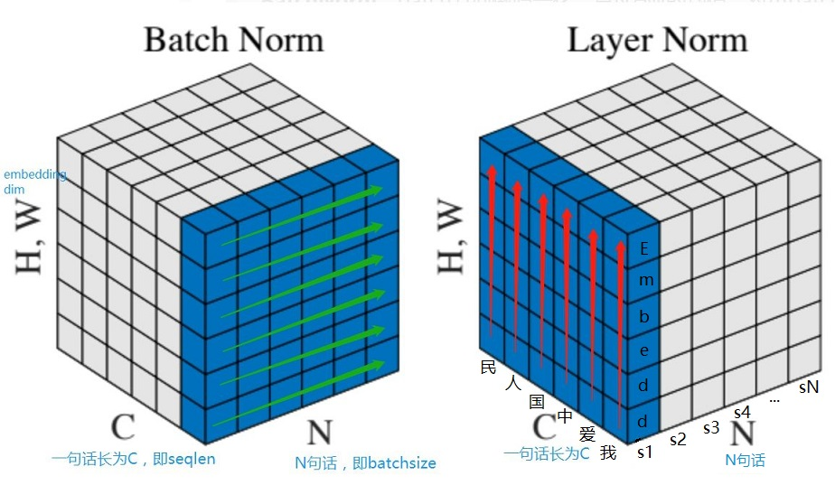

# Layer Normalization

- [返回上层目录](../tips.md)


对于batch normalization实际上有两种说法，一种是说BN能够解决“Internal Covariate Shift”这种问题。简单理解就是随着层数的增加，中间层的输出会发生“漂移”。另外一种说法是：BN能够解决梯度弥散。通过将输出进行适当的缩放，可以缓解梯度消失的状况。

那么NLP领域中，我们很少遇到BN，而出现了很多的LN，例如bert等模型都使用layer normalization。这是为什么呢？


# BN与LN主要区别

**主要区别在于normalization的方向不同！**

Batch Norm顾名思义是对一个batch进行操作。假设我们有10行3列 的数据，即我们的`batchsize = 10`，每一行数据有三个特征，假设这三个特征是【身高、体重、年龄】。那么BN是针对每一列（特征）进行缩放，例如算出【身高】的均值与方差，再对身高这一列的10个数据进行缩放。体重和年龄同理。这是一种“列缩放”。

而Layer Norm方向相反，它针对的是每一行进行缩放。即只看一笔数据，算出这笔所有特征的均值与方差再缩放。这是一种“行缩放”。

细心的你已经看出来，Layer Normalization对所有的特征进行缩放，这显得很没道理。我们算出一行这【身高、体重、年龄】三个特征的均值方差并对其进行缩放，事实上会因为特征的量纲不同而产生很大的影响。但是BN则没有这个影响，因为BN是对一列进行缩放，一列的量纲单位都是相同的。

那么我们为什么还要使用LN呢？因为NLP领域中，LN更为合适。

如果我们将一批文本组成一个batch，那么BN的操作方向是，对每句话的**第一个**词进行操作。但语言文本的复杂性是很高的，任何一个词都有可能放在初始位置，且词序可能并不影响我们对句子的理解。而BN是**针对每个位置**进行缩放，这**不符合NLP的规律**。

而LN则是针对一句话进行缩放的，且L**N一般用在第三维度**，如[batchsize, seq_len, dims]中的dims，一般为词向量的维度，或者是RNN的输出维度等等，这一维度各个特征的量纲应该相同。因此也不会遇到上面因为特征的量纲不同而导致的缩放问题。

如下图所示：



假如我们的词向量是100维（如图是立方体的高），batchsize是64（立方体中的N）。

BN：固定每句话的第一个位置，则这个切片是 （64， 100）维的矩阵。

LN：固定一句话，则切片是（seq_len, 100）维。

但是，BN取出一条 **（1，64）**的向量（**绿色剪头方向**）并进行缩放，LN则是取出一条**（1， 100）**维（**红色箭头**）进行缩放。


# Layer-normalization代码

Layer normalization代码实现实例如下：

```python
class LayerNormalization(tf.keras.layers.Layer):
    def __init__(self, epsilon=1e-8, **kwargs):
        super(LayerNormalization, self).__init__(**kwargs)
        self.epsilon = epsilon
    def build(self, input_shape):
        self.gamma = self.add_weight(name='gamma',
                                     shape=input_shape[-1:],
                                     initializer=tf.ones_initializer(),
                                     trainable=True)
        self.beta = self.add_weight(name='beta',
                                    shape=input_shape[-1:],
                                    initializer=tf.zeros_initializer(),
                                    trainable=True)
        super(LayerNormalization, self).build(input_shape)
    def call(self, x): # x shape=[batch_size, seq_len, d_model]
        mean = tf.keras.backend.mean(x, axis=-1, keepdims=True)
        std = tf.keras.backend.std(x, axis=-1, keepdims=True)
        return self.gamma * (x - mean) / (std + self.epsilon) + self.beta

```


# 参考资料

* [NLP中 batch normalization与 layer normalization](https://zhuanlan.zhihu.com/p/74516930)

本文参考了该知乎博客。

* [Transformer学习总结附TF2.0代码实现](https://blog.csdn.net/qq_43079023/article/details/103301846)

本文中的代码参考此博客。

