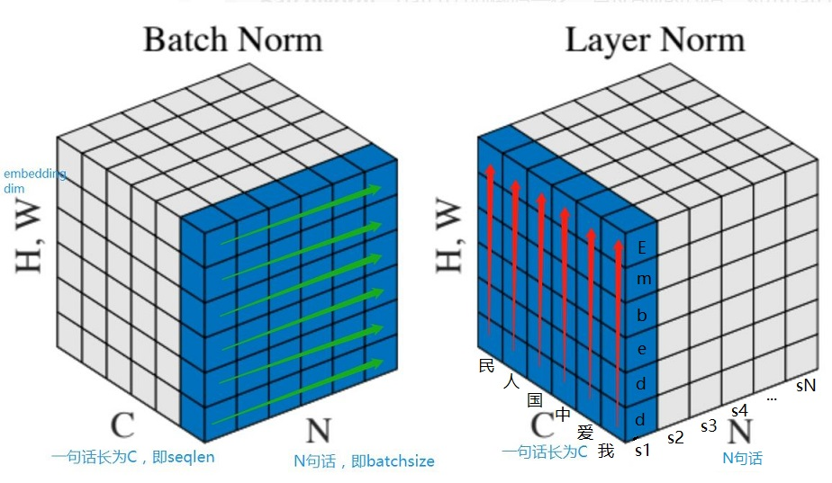

# Layer Normalization

- [返回上层目录](../tips.md)
- [BN与LN主要区别](#BN与LN主要区别)
- [LayerNorm的数学定义](#LayerNorm的数学定义)
- [LayerNorm代码实现与直观理解](#LayerNorm代码实现与直观理解)
  - [LayerNorm代码实现](#LayerNorm代码实现)
  - [LayerNorm的计算过程](#LayerNorm的计算过程)
  - [mean和var](#mean和var)
  - [gamma和beta](#gamma和beta)
  - [用一句话概括](#用一句话概括)
  - [直观理解](#直观理解)
  - [计算流程图](#计算流程图)
- [问题](#问题)
  - [LayerNorm实际是怎么工作的](#LayerNorm实际是怎么工作的)
  - [LayerNorm代码实现中的γ和β是逐元素学习](#LayerNorm代码实现中的γ和β是逐元素学习)
  - [强化学习中应该做LayerNorm](#强化学习中应该做LayerNorm)
  - [LayerNorm之后做Padding会屏蔽LN的可学习参数的梯度回传](#LayerNorm之后做Padding会屏蔽LN的可学习参数的梯度回传)
  - [整个ActorCritic网络架构在哪加LayerNorm](#整个ActorCritic网络架构在哪加LayerNorm)
  - [重要：在MLP之后做LN不会破坏信息](#重要：在MLP之后做LN不会破坏信息)
  - [重要：经过LN前的信息的平均值和方差不会丢失](#重要：经过LN前的信息的平均值和方差不会丢失)
  - [加LN无需加大其前面的MLP容量](#加LN无需加大其前面的MLP容量)


对于batch normalization实际上有两种说法，一种是说BN能够解决“Internal Covariate Shift”这种问题。简单理解就是随着层数的增加，中间层的输出会发生“漂移”。另外一种说法是：BN能够解决梯度弥散。通过将输出进行适当的缩放，可以缓解梯度消失的状况。

那么NLP领域中，我们很少遇到BN，而出现了很多的LN，例如Bert等模型都使用Layer Normalization。这是为什么呢？

# BN与LN主要区别

**主要区别在于normalization的方向不同！**

Batch Norm顾名思义是对一个batch进行操作。假设我们有10行3列 的数据，即我们的`batchsize = 10`，每一行数据有三个特征，假设这三个特征是【身高、体重、年龄】。那么BN是针对每一列（特征）进行缩放，例如算出【身高】的均值与方差，再对身高这一列的10个数据进行缩放。体重和年龄同理。这是一种“列缩放”。

而Layer Norm方向相反，它针对的是每一行进行缩放。即只看一笔数据，算出这笔所有特征的均值与方差再缩放。这是一种“行缩放”。

细心的你已经看出来，Layer Normalization对所有的特征进行缩放，这显得很没道理。我们算出一行这【身高、体重、年龄】三个特征的均值方差并对其进行缩放，事实上会因为特征的量纲不同而产生很大的影响。但是BN则没有这个影响，因为BN是对一列进行缩放，一列的量纲单位都是相同的。

那么我们为什么还要使用LN呢？因为NLP领域中，LN更为合适。

如果我们将一批文本组成一个batch，那么BN的操作方向是，对每句话的**第一个**词进行操作。但语言文本的复杂性是很高的，任何一个词都有可能放在初始位置，且词序可能并不影响我们对句子的理解。而BN是**针对每个位置**进行缩放，这**不符合NLP的规律**。

而LN则是针对一句话进行缩放的，且L**N一般用在第三维度**，如[batchsize, seq_len, dims]中的dims，一般为词向量的维度，或者是RNN的输出维度等等，这一维度各个特征的量纲应该相同。因此也不会遇到上面因为特征的量纲不同而导致的缩放问题。

如下图所示：



假如我们的词向量是100维（如图是立方体的高），batchsize是64（立方体中的N）。

BN：固定每句话的第一个位置，则这个切片是 （64， 100）维的矩阵。

LN：固定一句话，则切片是（seq_len, 100）维。

但是，BN取出一条 **（1，64）**的向量（**绿色剪头方向**）并进行缩放，LN则是取出一条**（1， 100）**维（**红色箭头**）进行缩放。

# LayerNorm的数学定义

LayerNorm 对 **最后一个维度（feature维）** 做归一化。

假设输入：
$$
x \in \mathbb{R}^{B \times N \times D}
$$
其中：

- $B$ = batch
- $N$ = token / object 数
- $D$ = embedding dimension

LayerNorm 在 **每一个 token 的 D 维向量上做 normalization**：
$$
y_i = \gamma \frac{x_i - \mu}{\sqrt{\sigma^2 + \epsilon}} + \beta
$$
其中
$$
\begin{aligned}
\mu &= \frac{1}{D}\sum_{i=1}^{D}x_i\\
\sigma^2 &= \frac{1}{D}\sum_{i=1}^{D}(x_i-\mu)^2
\end{aligned}
$$
其中，

* $\mu$和$\sigma^2$是实时对每一个toekn的$D$维的embedding的统计结果，是单个数值标量，每一个embedding统计的$\mu$和$\sigma^2$都不一样。
* $\gamma$和$\beta$是可学习参数，一定要注意是$D$维的，即单个$D$维的embedding的每一个元素都有一个单独的$\gamma$和$\beta$。但是这两个参数是所有token共享的，即当前样本里$x \in \mathbb{R}^{B \times N \times D}$中的$B\times N$个的token的$D$维embedding都共享这两个参数。

如果你看懂了上一段内容，那你就会理解一个很多人忽略但非常重要的点

LayerNorm **不是对整个 batch 做 normalization**。

而是：

```
每个 token 独立做
```

例如：

```
x = [B, N, D]
```

实际计算是：

```python
for b in B:
  for n in N:
      normalize(x[b,n,:])
```

所以：

```
不同 token 的均值不同
```

**LayerNorm 会抹掉特征平均值信息。**

Transformer 设计者认为：

```
绝对尺度不重要
相对结构更重要
```

给你一个 RL / Attention 的直觉

假设一个 embedding：

```
[10, 11, 9, 10]
```

另一个：

```
[100, 101, 99, 100]
```

结构完全一样：

```
+1 -1 0
```

LayerNorm 会把它们变成几乎一样的表示。

Transformer 认为：

```
pattern > magnitude
```


# LayerNorm代码实现与直观理解

## LayerNorm代码实现

```python
class LayerNorm(nn.Module):

    def __init__(self, embed_size, eps=1e-5):
        super().__init__()
        self.gamma = nn.Parameter(torch.ones(embed_size))
        self.beta = nn.Parameter(torch.zeros(embed_size))
        self.eps = eps

    def forward(self, x):

        mean = x.mean(dim=-1, keepdim=True)
        var = x.var(dim=-1, keepdim=True, unbiased=False)

        x_norm = (x - mean) / torch.sqrt(var + self.eps)

        return self.gamma * x_norm + self.beta
```

## LayerNorm的计算过程

你给的代码：

```python
mean = x.mean(dim=-1, keepdim=True)
var = x.var(dim=-1, keepdim=True)
x_norm = (x - mean) / (var + 1e-6).sqrt()
out = self.gamma * x_norm + self.beta
```

对于某一条样本`x`，

假设：`x.shape = [B, N, D]`，其中

* B = batch size
* N = 序列长度 / token 数
* D = embedding 维度

### mean和var

* `mean = x.mean(dim=-1, keepdim=True)`
  * 对 **最后一个维度 D** 求平均
  * 输出 shape = `[B, N, 1]`
  * 对每条样本（或每个 token）都是一个 **标量平均值**

* `var = x.var(dim=-1, keepdim=True)`
  * 同理，对最后一个维度 D 求方差
  * 输出 shape = `[B, N, 1]`
  * 对每条样本（或每个 token）都是一个 **标量方差**

* 所以对于一个样本的一个 token，mean 和 var 是 **单值**，整个 embedding 里只有一个均值和一个方差。

### gamma和beta

* `gamma` 和 `beta` 是参数向量，shape = `[D]`

* 在计算时 PyTorch 会 **广播**：

  ```python
  x_norm.shape = [B, N, D]
  gamma.shape = [D]
  beta.shape  = [D]
  ```

* 作用：`out[b, n, d] = gamma[d] * x_norm[b, n, d] + beta[d]`

* 也就是说 **每个维度 D 都有自己可学习的缩放/偏移**

* 对 batch 和 token 是共享的，但对 embedding 的每个元素都不一样

### 用一句话概括

- `mean` 和 `var`：每条样本/每个 token 的 **标量**，用于标准化
- `gamma` 和 `beta`：每个维度的 **向量参数**，控制缩放和平移
- 结果：标准化是 “每条样本沿 D 维减均值除方差”，再按维度缩放和偏移

### 直观理解

假设：

```python
x[b, n] = [x1, x2, x3, x4]
```

- mean = (x1+x2+x3+x4)/4 → 单值
- var = 方差 → 单值
- 标准化：

```python
x_norm = [(x1-mean)/sqrt(var), ..., (x4-mean)/sqrt(var)]
```

- gamma = [g1, g2, g3, g4]
- beta  = [b1, b2, b3, b4]

最终输出：

```python
out = [g1*x_norm1+b1, g2*x_norm2+b2, g3*x_norm3+b3, g4*x_norm4+b4]
```

### 计算流程图

```
Input x = [x1, x2, x3, x4]
        |
        v
Compute mean/var (scalar)
        |
        v
x_norm = (x - mean)/sqrt(var)
        |
        v
out = gamma * x_norm + beta   (element-wise)
        |
        v
Output = [out1, out2, out3, out4]
```

# 问题

## LayerNorm实际是怎么工作的

> LayerNorm实际是怎么工作的，比如我输入的特征是[B, N, D]维度，即[batch, 每个batch里的entity数量， 每个entity的特征维度]，那LayerNorm是统计的什么范围里的数据来计算均值和方差的？这里我始终不清楚，你一定要讲透这里

明白，这是很多人对 **LayerNorm** 最核心、也是最容易混淆的地方。我们来彻底讲透，特别针对 `[B, N, D]` 这种典型的 RL / set 编码输入。

---

**1️⃣ LayerNorm 的数学公式**

给定输入张量 XXX 的最后一个维度为 `D`（embedding size）：
$$
X \in \mathbb{R}^{B \times N \times D}
$$
LayerNorm 的公式是：
$$
\mu_i = \frac{1}{D} \sum_{j=1}^{D} X_{i,j}, \quad \sigma_i^2 = \frac{1}{D} \sum_{j=1}^{D} (X_{i,j} - \mu_i)^2\\
\text{LN}(X_{i,:}) = \gamma \odot \frac{X_{i,:} - \mu_i}{\sqrt{\sigma_i^2 + \epsilon}} + \beta
$$
解释：

- 对 **每一个 entity 的特征向量** 做归一化
- `i` 表示某个具体 entity（在 `[B, N]` 上展开，通常是 batch 内每个 entity）
- `D` 是 embedding size → LN 的统计量只计算这个 entity 内的维度
- $\gamma, \beta \in \mathbb{R}^D$ 是可学习参数，分别做缩放和平移

**关键点：**

> LN 不跨 batch，也不跨 entity，只对每个 entity 内部的特征维度做归一化。

---

**2️⃣ 具体到 `[B, N, D]` 的行为**

假设输入：

```python
item_emb = torch.randn(B, N, D)
ln = nn.LayerNorm(D)
out = ln(item_emb)
```

1. 对 `item_emb[b, n, :]`（第 b 个 batch，第 n 个 entity 的特征向量）：

   - 计算均值 μ[b, n] = mean(item_emb[b, n, :])
   - 计算方差 σ²[b, n] = var(item_emb[b, n, :])

2. 用公式归一化每个 entity 内的 D 个维度：
   $$
   \text{item\_emb\_norm}[b, n, d] = \gamma[d] * \frac{\text{item\_emb}[b,n,d] - \mu[b,n]}{\sqrt{\sigma^2[b,n] + \epsilon}} + \beta[d]
   $$

3. 所有 batch 和 entity 是独立处理的 → 不会互相影响

**所以 LayerNorm 对 `[B, N, D]` 来说**：

- **统计范围**：每个 entity 的 `D` 个特征维度
- **输出维度**：和输入相同 `[B, N, D]`
- **batch 或 entity 之间**：互不干扰

---

**3️⃣ 可学习参数 γ / β**

- γ：对每个 feature 维度做缩放
- β：对每个 feature 维度做平移
- 对 padding token 也会有 γ/β 的梯度，但通常你在 LN 后会 mask → padding 的输出和梯度被归零 → γ/β 的梯度在这些位置就不参与更新

---

**4️⃣ 为什么不会破坏信息**

- LN 改变的是 **特征向量的均值和方差**，但 **相对模式和排序保持不变**
- 对 RL 或 Set 输入来说，网络关心的是 **embedding 的相对结构**，而不是绝对数值
- γ/β 可以恢复或调整每个维度的重要性
- mask 在最后归零 → padding 不干扰 downstream

---

**5️⃣ 对比 BatchNorm**

| 特性            | LayerNorm                      | BatchNorm                       |
| --------------- | ------------------------------ | ------------------------------- |
| 归一化范围      | 每个 token / entity 的特征维度 | batch + 可能 channel            |
| 依赖 batch size | 不依赖                         | 依赖 batch size                 |
| RL/Set 场景适用 | ✅ 稳定，非平稳输入友好         | ❌ batch size 小或非平稳输入不稳 |

------

✅ **核心结论**：

- `[B, N, D]` 输入 → LN 对 `D` 做统计 → 每个 entity 独立
- γ/β 可学习 → 不会破坏原始信息模式
- mask 必须在 LN 后 → padding 归零，不影响均值方差统计

## LayerNorm代码实现中的γ和β是逐元素学习

问题：

> ```python
> self.gamma = nn.Parameter(torch.ones(embed_size))
> self.beta = nn.Parameter(torch.zeros(embed_size))
> ```
>
> layer norm中的gamma和beta还是逐元素学习的啊，我还以为就一个值

回答：

你理解得很好，`gamma` 和 `beta` 其实是在 **Layer Normalization** 中逐元素学习的，并不是每个 Batch 共享一个单一的值。

**Layer Normalization 中的 `gamma` 和 `beta`：**

在 **Layer Normalization** 中，`gamma` 和 `beta` 是可学习的参数，它们用于对每个输入样本的标准化结果进行缩放（scaling）和偏移（shifting）。`gamma` 和 `beta` 的形状通常是 `[embed_size]`，其中 `embed_size` 是输入特征的维度。

**具体细节：**

- **gamma（缩放因子）**：用来缩放标准化后的结果，学习一个逐元素的缩放因子。这意味着每个特征维度都会有一个对应的 `gamma` 参数。
- **beta（偏移量）**：用来平移标准化后的结果，同样学习一个逐元素的偏移量，每个特征维度对应一个 `beta`。

**为什么 `gamma` 和 `beta` 不是单一的值？**

- **逐元素的学习**：`gamma` 和 `beta` 是逐元素学习的，是为了确保在标准化后的每个特征维度上都有独立的缩放和偏移。这使得模型能够为每个特征分配独立的学习参数，从而使模型的表达能力更强，能够学习到不同特征的不同尺度和偏移。
- **每个特征都有一个 gamma 和 beta**：因为 Layer Normalization 是对每个样本的所有特征进行标准化，所以我们希望对每个特征都有独立的缩放和偏移。在 `embed_size` 维度上，`gamma` 和 `beta` 都会有一个对应的参数。

**为什么不能只有一个值？**

如果 `gamma` 和 `beta` 只有一个值，那么它们就会在所有的特征维度上共享同一个缩放因子和偏移量，这就限制了模型在每个特征维度上进行不同的学习调整。而在实践中，**每个特征的尺度和偏移是不同的**，所以使用逐元素学习的 `gamma` 和 `beta` 更符合实际的需求，能够更好地适应不同特征的分布。

**总结：**

- **gamma 和 beta 逐元素学习**：它们分别对每个特征维度有独立的学习参数，使得每个特征能够单独进行缩放和偏移。
- 这样做是为了让 **Layer Normalization** 能够更好地处理每个特征的标准化，同时保持足够的灵活性，适应不同特征的分布。

## 强化学习中应该做LayerNorm

先一句话回答：

> 应该。
>
> 特别值得一提的是 DreamerV3，Hafner 等人在论文中明确指出：**在所有网络中使用 LayerNorm 是他们实现跨域泛化的关键设计之一**。他们发现不用 LayerNorm 时，网络输出的量级会在训练过程中不断增长，导致训练不稳定。
>
> 但是要加对位置

问题：

有人说：

> 有一个 AlphaStar 的小 trick：
>
> AlphaStar 的 entity encoder 最后一定有 LayerNorm：
>
> ```
> entity_embedding
>       ↓
> LayerNorm
>       ↓
> attention / pooling
> ```
>
> 原因是：
>
> entity feature distribution 在 RL 中非常不稳定，而LayerNorm 可以：
>
> * 稳定 attention score
>
> * 稳定 gating
>
> * 稳定 PPO 训练
>
> 所以建议在你的代码里的EntityEncoder里，MLP之后，Mask之前，加上一层LayerNorm：
>
> ```python
> self.ln = nn.LayerNorm(output_dim)
> entity_emb = self.ln(entity_emb)
> ```
>
> 训练稳定性会明显提高。

我自己的看法和疑惑：

> 你觉得他说的对吗？我自己好像不是很想这样做，但是又感觉他说的有道理。。。
>
> 就是其实我一直长久被这个问题困惑，强化学习中到底能不能，应不应该加入LayerNorm？如果可以，应该在哪里加？
>
> 我的个人直觉是，不加，因为它会破坏信息，比如原始特征传入的速度位置方位等信息，可能会被LayerNorm破坏，但是我也不是很确定到底会不会破坏。总之，这真的是一个最困扰我的问题，你能彻底说清楚吗？

这是一个很好的问题，我来彻底把 LayerNorm 在 RL 中的使用讲清楚，帮你消除这个长期困惑。

---

**你的直觉哪里对，哪里错**

你的直觉是：**"LayerNorm 会破坏速度、位置、方位等信息"**。

这个直觉**在原始特征层面是完全正确的**，但**在 backbone 输出层面是不适用的**。这是区分的关键。

**如果对原始输入做 LayerNorm：确实有害**

假设原始特征是 `[velocity=300, altitude=5000, bearing=0.78, distance=12000]`，这些数值有明确的物理含义和量纲。如果你在这里做 LayerNorm：

- 它会算这 4 个数的均值和方差，然后归一化
- velocity=300 和 altitude=5000 被强行映射到同一个尺度
- **"300 比 5000 小"这个信息被消除了**——但这个信息本身可能有意义
- 不同物理量之间的相对大小被扭曲

**所以你的直觉在这个层面是对的：不要对原始特征做 LayerNorm。**

**但 EntityEncoder 输出已经不是原始特征了**

EntityEncoder 内部是一个 3 层 MLP（Linear → SiLU → Linear → SiLU → Linear）。经过这三层变换后，输出 `set_h` 的每个维度：

- **已经不代表"速度"或"方位"了**——它是所有原始特征经过非线性混合后的抽象表征
- **没有物理单位**——维度 i 可能同时编码了速度、距离、方位角的某种组合
- **量纲已经被网络权重决定**——而不是被物理世界决定

在这个抽象空间里，LayerNorm 归一化的是**网络自己生成的内部表征**，而不是物理量。**它不会"破坏速度信息"，因为这里已经没有"速度"这个概念了——只有"EntityEncoder 学到的第 k 个抽象特征"。**

---

**AlphaStar 的做法是否正确：正确，而且有充分理由**

建议的位置是：在MLP之后，Mask之前放LayerNorm层

这正是 AlphaStar entity encoder 的做法。我来解释为什么它在 RL 中特别重要。

**原因 1：RL 中特征分布是非平稳的**

这是 RL 与监督学习最根本的区别。在监督学习中，训练数据分布是固定的——ImageNet 的图片不会因为你训练了 10 个 epoch 就变了。但在 RL 中：

- **策略改变 → 观测分布改变 → backbone 输入分布改变 → backbone 输出分布改变**
- 训练初期，agent 随机行动，看到的状态分布是 A
- 训练中期，agent 学会了某些行为，看到的状态分布变成 B
- 训练后期，分布又变成 C

没有 LayerNorm 时，MLP输出的embedding（`mlp_emb`）的尺度和分布在整个训练过程中不断漂移。这意味着：

- `sigmoid(W_g * mlp_emb + b_g)` 中的 sigmoid 可能在训练早期工作正常，但到中期 `mlp_emb` 尺度变大，sigmoid 饱和，**gate 梯度消失**
- `softmax(W_g * mlp_emb + b_g)` 网络的输出量级也在漂移，softmax 的行为不可预测——可能突然从"合理分布"变成"全部集中在一个 entity"

LayerNorm 自动将 `mlp_emb` 归一化到零均值、单位方差，**无论策略怎么变、观测分布怎么漂移，downstream 的 sigmoid/softmax 看到的输入始终在一个稳定的范围内**。

**原因 2：稳定 sigmoid gating**

你当前的代码：

```python
gate = torch.sigmoid(self.gate(mlp_emb))  # [B, N, H]
```

sigmoid 的有效工作区间大约是 [-4, 4]。如果 `self.gate(mlp_emb)` 的值超出这个范围，sigmoid 输出接近 0 或 1，梯度接近 0。在训练过程中，如果 `mlp_emb` 的尺度逐渐增大（这在没有归一化的深度网络中很常见），gate 会逐渐失去学习能力。

LayerNorm 保证 `mlp_emb` 的尺度稳定，从而保证 gate 的输入始终在 sigmoid 的敏感区间内。

**原因 3：稳定 attention score**

同理，`score` 网络的输出喂给 softmax。如果 score 值的量级过大，softmax 会变成 one-hot（只关注一个 entity）；如果量级过小，softmax 接近均匀分布。LayerNorm 稳定了 score 的输入，间接稳定了 attention 分布。

**所以现有的 masking 机制已经足以处理 LayerNorm 引入的 padding 非零问题，不需要额外修改。**

---

**工业界的实际证据**

| 系统                     | 是否用 LayerNorm | 位置                                                 |
| ------------------------ | ---------------- | ---------------------------------------------------- |
| **AlphaStar** (DeepMind) | 是               | entity encoder 输出后                                |
| **OpenAI Five**          | 是               | LSTM 内部（Layer-normalized LSTM）                   |
| **Decision Transformer** | 是               | 标准 Transformer 的 LayerNorm                        |
| **DreamerV3** (Hafner)   | 是               | 所有网络层都用 LayerNorm（他们称之为关键设计）       |
| **PPO 实践**             | 常见             | 很多成熟实现用 observation normalization（本质类似） |

特别值得一提的是 DreamerV3，Hafner 等人在论文中明确指出：**在所有网络中使用 LayerNorm 是他们实现跨域泛化的关键设计之一**。他们发现不用 LayerNorm 时，网络输出的量级会在训练过程中不断增长，导致训练不稳定。

---

**哪里不该加 LayerNorm**

为了完整，也说清楚"不该加"的位置：

1. **原始输入特征上**：不同物理量混在一起归一化会丢失量纲信息（你的直觉在这里是对的）
2. **Value 网络的最终输出**：V(s) 需要保持正确的尺度来匹配 reward，不能归一化
3. **Policy logits 的最终输出**：logits 的尺度决定了策略的 entropy，不能被归一化篡改

但在**中间表征层**（即 MLP 输出之后），LayerNorm 是安全且有益的。

---

**我的最终建议**

**加。** 

理由总结：

1. **你的担忧不适用于这个位置**——MLP输出是抽象表征，不是物理量，LayerNorm 不会破坏"速度信息"
2. **RL 的非平稳性让它比监督学习更需要这种归一化**——随着策略变化，MLP输出分布在漂移，LayerNorm 是最自然的对冲手段
3. **它直接保护了你的 sigmoid gate 和 softmax attention**——防止训练过程中因尺度漂移导致的饱和和梯度消失
4. **AlphaStar 和 DreamerV3 验证了它在大规模 RL 中的有效性**——不是理论猜想，是工业实践
5. **代价极小**——2H 个参数，计算开销可忽略，且不改变任何接口

## LayerNorm之后做Padding会屏蔽LN的可学习参数的梯度回传

问题：

> 虽然LayerNorm在不同的embedding之间互不影响，但是padding位置的gamma和beta也是会被梯度下降学习到的呀。我的理解对吗？

首先说前向计算：LayerNorm 统计和归一化只作用于同一个 token/entity 内部的 feature 维度 D，不跨 token，不跨 batch。

然后说反向传播：

啊，这正是你卡住的核心！我来把这个问题彻底拆开，从**数学原理**到**PyTorch autograd**逐步解释，让你彻底理解为什么 mask 后 padding 不会更新 γ/β。

**1、梯度传播的链式法则**

假设 LayerNorm 后你有一个 padding token 的输出：
$$
y = \gamma * x + \beta
$$
mask 后：
$$
y_{\text{masked}} = m \cdot y
$$
其中：

- $m = 0$ 表示 padding
- $y \in \mathbb{R}^D$ 是 LayerNorm 输出

**2、对 γ 的梯度**

PyTorch 会用链式法则计算梯度：
$$
\frac{\partial L}{\partial \gamma} = \frac{\partial L}{\partial y_{\text{masked}}} \cdot \frac{\partial y_{\text{masked}}}{\partial \gamma}
$$
我们先算 $\frac{\partial y_{\text{masked}}}{\partial \gamma}$：
$$
y_{\text{masked}} = m \cdot (\gamma x + \beta) \implies \frac{\partial y_{\text{masked}}}{\partial \gamma} = m \cdot x
$$

- 对 padding token，mask $m = 0$
- 所以 $\frac{\partial y_{\text{masked}}}{\partial \gamma} = 0$

再乘上上游梯度 $\frac{\partial L}{\partial y_{\text{masked}}}$ → 整个梯度为 0。

**同理，对 β 的梯度也是：**
$$
\frac{\partial y_{\text{masked}}}{\partial \beta} = m
$$

- padding token $m=0 \implies \frac{\partial y_{\text{masked}}}{\partial \beta} = 0$

所以 mask 后，padding token 对 $\gamma/\beta$ **完全没有贡献**。

**3、对输入 x 的梯度**
$$
\frac{\partial y_{\text{masked}}}{\partial x} = m \cdot \gamma
$$

- padding token $m=0 \implies \frac{\partial L}{\partial x} = 0$
- 即 padding token 对 MLP/LayerNorm 输入的梯度也被屏蔽 → 没有更新

**4、PyTorch 示例验证**

```python
import torch
import torch.nn as nn

x = torch.randn(2, 4, requires_grad=True)  # 2 token, 4 dim
gamma = nn.Parameter(torch.ones(4))
beta = nn.Parameter(torch.zeros(4))

mask = torch.tensor([[1, 0], [1, 0]])  # 第二个 token 是 padding

# forward
y = gamma * x + beta
y_masked = y * mask.unsqueeze(-1)
loss = y_masked.sum()
loss.backward()

print("x.grad:\n", x.grad)
print("gamma.grad:\n", gamma.grad)
print("beta.grad:\n", beta.grad)
```

输出你会发现：

- padding token 对 $\gamma$、$\beta$、$x$ 的梯度全是 0
- 有效 token 的梯度正常

**5、核心结论**

- **mask=0 → 乘以 0 → 梯度链路被乘以 0 → 梯度消失**
- 这是梯度阻断的自然机制，不需要 detach
- 所以 LayerNorm 的 $\gamma/\beta$ 参数只由有效 token 更新，padding 不会污染
- padding 也不会通过 MLP 反向更新梯度 → 节省计算，同时保持 masking 效果

> 你可以把 mask 理解为“梯度屏蔽器”，它直接乘在前向输出上，自动阻断反向梯度。

**6、为什么不需要额外 detach**

- 有些人担心 LN 的 $\gamma/\beta$ 受 padding 学习污染 → mask 后已经屏蔽
- 不需要 detach
- 这样还保持了梯度通过有效 token 正常回传，保持网络通路之间的协作

## 整个ActorCritic网络架构在哪加LayerNorm

问题：

> 整个ActorCritic网络架构到底应该在哪些地方加 LayerNorm

回答：

这是你最核心的困惑。我假设一个完整数据流来举例，标注每个位置是否应该加 LN：

```
原始观测 state [T, B, obs_dim]
        ↓ split
┌───────────────────────────────────────────────┐
│  context_encoder (2层MLP)     → context_emb   │  不需要 LN（维度小，简单 MLP）
│  entity_encoder (EntityEncoder) → entity_emb  │  ✅ 内部有 LN
│  set_encoder     → set_emb                    │  ✅ 内部 backbone 有 LN
└───────────────────────────────────────────────┘
        ↓
       mlp         → [T, B, hidden_dim]         ⬅️ 建议加 LN
        ↓
      lstm1 → [T, B, lstm_state_dim]         （LSTM 内部不好加，见下文）
        ↓
       mlp         → [T, B, hidden_dim]         ⬅️ 建议加 LN
        ↓
      lstm2 → [T, B, lstm_state_dim]
        ↓
   final_shared    → [T, B, hidden_dim]
        ↓
      heads → logits / mean                     ❌ 绝对不加
```

**第一层：EntityEncoder 内部 — 必须加**

这是你这次要做的改动。覆盖了所有 entity 表征，是收益最大的一处。

**第二层：state_fusion 输出（LSTM 输入之前）— 建议加**

你的 `state_fusion` 把 `full_emb_dim` 维度的拼接向量压缩到 `hidden_dim`。这个输出直接喂给 `memory_lstm`。

**为什么 LSTM 前需要 LN：** LSTM 内部的 forget gate、input gate 都是 sigmoid，cell state 更新依赖 tanh。这些非线性函数对输入尺度极其敏感。如果 state_fusion 的输出尺度在训练过程中漂移（RL 中一定会），LSTM 的门控行为会变得不可预测。

AlphaStar 和 OpenAI Five 用的是 **Layer-Normalized LSTM**（在 LSTM cell 内部每个时步都做 LN），但这需要自定义 LSTM 实现。PyTorch 原生 `nn.LSTM` 不支持。

**务实的替代方案：在 LSTM 输入前加 LN。** 虽然不如 LN-LSTM（不能逐时步归一化），但能显著稳定 LSTM 的起始输入分布。对于 PPO 的 rollout（T 通常不大），这已经足够。

**第三层：middle_transform 输出（第二个 LSTM 输入之前）— 建议加**

同理，`middle_transform` 的输出喂给 `policy_lstm`，加 LN 保护第二个 LSTM。

**不需要加的地方**

| 位置                              | 原因                                                         |
| --------------------------------- | ------------------------------------------------------------ |
| `context_encoder` 后              | 维度小（16维），结构简单，收益微乎其微                       |
| `final_shared` 后                 | 这里的输出直接喂给 action heads，action heads 自己有多层 MLP 可以适应尺度 |
| action head 输出（logits / mean） | **绝对不加**。logits 的尺度控制 policy entropy；mean 的尺度要匹配动作空间范围 |
| value head 输出                   | **绝对不加**。V(s) 的尺度要匹配 reward 的累积量              |

**工业界是怎么做的：总结**

| 项目              | 策略                                               | 你的对应                                 |
| ----------------- | -------------------------------------------------- | ---------------------------------------- |
| **AlphaStar**     | entity encoder 后 LN + LN-LSTM + Transformer 内 LN | EntityEncoder 内 LN + LSTM 前 LN         |
| **OpenAI Five**   | 输入观测归一化 + LN-LSTM                           | EntityEncoder 内 LN + LSTM 前 LN         |
| **DreamerV3**     | 所有网络的每个隐藏层后都加 LN                      | 太激进，不推荐作为起点                   |
| **CleanRL / SB3** | 不加 LN                                            | 适用于简单环境，不适用于你的复杂实体架构 |

**你的系统最匹配 AlphaStar 的架构模式**（entity-based + LSTM），所以跟 AlphaStar 的 LN 策略最合适。

## 重要：在MLP之后做LN不会破坏信息

问题：

> 我其实还是不理解，为什么在MLP之后做LayerNorm，不会破坏信息？
>
> 我知道此时MLP之后的信息已经不再是原始的语义信息了，比如速度位置角度等，但是依然是有某种人类无法理解但是下游模型可以“理解“的信息的，那加一个LayerNorm，不就是把这种信息给拦腰截断并且缩放了，从而破坏掉了该信息，导致后面的网络无法再理解LayerNorm后传过来的被修改过的信息了吗？
> 比如，某个特征的某一位本来是负数，结果经过LayerNorm，不仅改变了数值大小，还改变了符号，变成正数了，也许本来这一位特征的符号对于后面的神经网络有重要意义，但是LayerNorm直接把正负号的性质都给改变了，这显然是严重破坏了原有正确信息啊。
>
> 这是我一直对LayerNorm的核心困惑，我是觉得可能有监督学习，数据的分布基本都大差不差，也许这种破坏还能小一点，但是强化学习的环境一直是随着仿真时间步的推进或者策略在变的，那不就是完全不能用LayerNorm了吗？我一直受困于此，所以从来对LayerNorm都不放心，更别提强化学习上用LayerNorm了。我希望你能深刻的讲清楚这个问题。

回答：

这个问题问得非常好。这是理解深度学习的核心概念之一，我来彻底讲清楚。

---

**你的推理链条哪里断了**

你的推理是这样的：

> MLP 输出了一组数值 → 这些数值包含了某种"信息" → LayerNorm 改变了这些数值（甚至改变了正负号） → 信息被破坏了 → 下游网络无法理解

这个推理链条的**隐含假设**是：

> **"下游网络已经学会了如何解读 MLP 的原始输出，LayerNorm 破坏了这个已经建立的约定"**

但这个假设是错的。我来说明为什么。

---

**核心事实：下游网络是和 LayerNorm 一起从零开始训练的**

你不是在一个已经训练好的网络中间"插入"了一个 LayerNorm。你是从一开始就把 LayerNorm 放在那里，然后从随机初始化开始训练整个网络。

这意味着：

- **下游网络从来没有见过"没有 LayerNorm 的 MLP 输出"**——它从第一个 gradient step 开始，就只见过归一化后的数值
- **下游网络学到的所有权重，都是为了解读 LayerNorm 的输出而优化的**——它从来不需要去解读原始 MLP 输出
- **MLP 也知道自己的输出会经过 LayerNorm**——反向传播的梯度穿过 LayerNorm，MLP 的权重更新方向已经考虑了 LN 的存在

没有人被"欺骗"了。所有人从出生就知道规则。

---

**用你的例子来具体说明**

你说："某一维特征本来是负数，LN 之后变成正数了，正负号的意义被破坏了。"

假设没有 LayerNorm，MLP 输出的第 5 维是 -2.3。下游网络学到了一个权重 W₅ = -10，形成 W₅ × (-2.3) = +23，触发了某个"危险"信号。这里下游网络学到了：**"第 5 维是负数 = 危险"**。

现在加了 LayerNorm，MLP 输出的同样内容，经过 LN 后第 5 维变成了 +0.7。下游网络怎么办？它会学到 W₅ = +33，形成 W₅ × 0.7 = +23，**触发完全一样的"危险"信号**。

下游网络不在乎正负号——它在乎的是**最终能不能做出正确的决策**。权重 W 可以是任何值，正负号只是一个随训练而定的约定。**下游网络学到的权重会自动适应 LayerNorm 的输出格式。**

"第 5 维是负数 = 危险"和"第 5 维是正数 = 危险"对神经网络来说没有任何区别。正负号不是物理定律，是训练出来的约定。有 LN 时，网络学到一套约定；没有 LN 时，学到另一套约定。两套约定都能正确工作。

---

**LayerNorm 到底丢失了什么，保留了什么**

LayerNorm 的公式：`y = γ * (x - μ) / σ + β`

对于一个 H 维向量 x：

**丢失的**（2 个标量）：

- 均值 μ（所有维度的平均激活水平）
- 标准差 σ（所有维度的激活离散程度）

**保留的**（H - 2 个自由度）：

- 哪些维度比其他维度大
- 维度之间的相对差异
- 激活向量的"形状"（pattern）

对于 H=64，丢失 2/64 = 3% 的信息容量；对于 H=128，丢失 1.5%。

关键问题是：**丢失的那 2 个标量有用吗？**

均值 μ 代表什么？MLP 所有输出维度的平均值。这主要由 MLP 最后一层的 bias 之和 决定，再加上输入的缩放效应。它不代表"速度大不大"或"距离远不远"——它是一个纯粹的网络内部产物，没有语义。

标准差 σ 代表什么？MLP 输出维度之间的离散程度。这主要由权重矩阵的范数决定。同样是网络内部产物。

**真正有语义的信息在"形状"里：哪些维度被强烈激活，哪些维度被抑制，维度之间的相对关系。** 这些信息被 LayerNorm 完整保留了。

---

**用照片做类比：彻底理解**

想象你在做图像识别。相机拍了一张猫的照片，像素值范围是 [50, 200]。

**对像素做归一化（类似 LayerNorm）：** 将像素映射到 [0, 255]。有些像素值变了，有些甚至可能从 120（"较暗"）变成 180（"较亮"）。

你会说"归一化破坏了猫的信息"吗？不会。猫的轮廓、纹理、耳朵的形状——所有有意义的信息都完好无损。变的只是亮度和对比度的"基准线"。下游的卷积网络照样能认出猫。

现在假设相机的曝光不稳定（类似 RL 的非平稳性）：同一只猫，有时拍出来像素范围是 [10, 50]（很暗），有时是 [200, 250]（很亮）。

**不做归一化：** 图像识别网络必须应对这种剧烈变化的分布。本来学到了"像素 > 150 是猫的白色毛发"，结果拍暗了变成 "像素 30 也是白色毛发"。网络很痛苦，因为同样的语义对应了完全不同的数值范围。

**做归一化：** 不管曝光怎么变，归一化后猫的照片总是在一个稳定的像素范围内。白色毛发永远对应高像素值。网络很轻松。

**这就是 LayerNorm 在 RL 中的作用。非平稳性恰恰是 LayerNorm 最大的用武之地，不是它的禁区。**

---

**你的 RL 非平稳性论点为什么恰好反了**

你说："RL 中分布一直在变，所以更不能用 LayerNorm。"

让我用你的代码来具体说明为什么这是反的。

**没有 LayerNorm 时的真实场景：**

训练初期，agent 随机行动。敌方导弹距离普遍较远。MLP 输出的某些维度的值大约在 [-1, 1] 范围。下游的 sigmoid gate 学到：`sigmoid(W × 0.5 + b)` ≈ 0.6，工作正常。

训练到 50 万步，agent 学会了激进策略，频繁近距离交战。导弹距离更近、速度更快。MLP 的输入分布变了，输出的那些维度现在在 [-5, 5] 范围。下游的 sigmoid gate：`sigmoid(W × 4.0 + b)` ≈ 1.0，**sigmoid 饱和了，梯度消失**。

gate 无法再学习。训练卡死。

**有 LayerNorm 时：**

不管是训练初期还是 50 万步后，LN 保证 MLP 输出始终在零均值、单位方差的范围。下游的 sigmoid gate 始终在 sigmoid 的敏感区间工作，梯度正常流动。

**关键理解：没有 LN 时，是下游网络被迫去适应不断变化的分布——它总在追赶一个移动的靶子。有 LN 时，LN 替下游网络挡住了分布漂移——靶子是固定的。**

---

**最后的严谨性：为什么 LayerNorm 不是"破坏"而是"重新参数化"**

数学上，LayerNorm 是一个**近似可逆的坐标变换**。它把"在绝对坐标系里描述一个向量"变成了"在相对坐标系（零均值、单位方差）里描述一个向量"。

这就像把地理坐标从"东经 116.4°, 北纬 39.9°"变成"距离参考点东偏 2.3km, 北偏 1.1km"。信息一样多，只是参考系不同。

而且 LayerNorm 还有可学习的 γ 和 β，它们让网络可以选择自己想要的参考系——如果网络觉得某种偏移和缩放对下游有用，γ 和 β 会学到。这比固定的绝对坐标更灵活，不是更差。

---

**一句话总结**

**LayerNorm 不是在一个已经理解了信号的系统中间破坏信号。它是在系统建立之初就定义了信号的格式，然后整个系统学会了在这个格式下工作。** 就像一个团队从一开始就用公制单位——没有人的信息被破坏，因为所有人从来只知道公制。

## 重要：经过LN前的信息的平均值和方差不会丢失

问题：

> 你说的我理解了，我觉得很形象，就是类似于对一张照片的像素做一次归一化，也就是对[B, N, D]里的最底层的每一个[B, N]里的D维信息做一次归一化。
>
> 但是我现在没有理解的是，不同的特征的数据的平均值有高有低，也许这个平均值的高低本身就代表了某种重要信息，而不是只有其相对信息才有信息，
>
> 比如，亮度高的猫照片，说明环境是有充分的太阳光照的，这说明大概率是在白天，亮度低的猫的照片，说明环境本身的光照不足，这说明大概率是阴天，而晴天和阴天可能就是强化学习用于决策的重要信息，但是经过LayerNorm后，这种基本的平均值信息就被舍弃了，LayerNorm是能学到平均意义上的平均值，但是这是区分不出来晴天和阴天的。这里是我对LayerNorm的最后一个疑惑了，如果你能彻底深刻+形象的讲清楚这里，那就说明你是彻底理解LayerNorm的，我也就终身不会再对LayerNorm有任何困惑了。

这是一个极其精准的问题，说明你已经触及了 LayerNorm 最本质的地方。让我彻底回答。

---

**你的质疑完全成立——但只在一种情况下**

你说得对：**如果直接对猫照片的像素做 LayerNorm，亮度信息（晴天/阴天）确实会被丢掉。**

> 亮照片 → 归一化 → 标准亮度
>
> 暗照片 → 归一化 → 标准亮度

下游网络看到两张标准亮度的照片，无法区分晴天和阴天。**信息确实被毁了。**

**这正是为什么不能对原始特征做 LayerNorm。** 你的直觉在这一层是完全正确的。

---

**但你的代码不是这种情况——因为 LayerNorm 前面有一个 MLP**

你的架构是：

```
原始特征 → MLP（三层） → LayerNorm → 下游网络
```

这里有一个关键的角色：**MLP**。

MLP 是一个可学习的函数，它看到了原始特征（包括"亮度"信息），然后它**自己选择**如何编码输出。它不是一个固定的透传管道——它是一个有几十万参数的可学习变换。

当整个系统端到端训练时，MLP 通过梯度知道一件事：**"我的输出要经过 LayerNorm，然后才被下游网络使用。"** 

所以 MLP 会怎么做？**它会把"平均亮度"信息，主动编码成一个 LayerNorm 不会丢弃的形式——即维度之间的相对差异。**

---

**具体演示：MLP 如何在 LayerNorm 下保留"晴天/阴天"**

假设 MLP 输出 4 维（为了演示方便），实际是 64 或 128 维，原理相同。

**没有 MLP、直接对原始亮度做 LN（你担心的场景）：**

```
晴天照片平均像素：[200, 210, 190, 205]
阴天照片平均像素：[ 50,  60,  40,  55]

LayerNorm 后：
晴天：[-0.27, 1.07, -1.60, 0.80]    ← 只剩相对差异
阴天：[-0.27, 1.07, -1.60, 0.80]    ← 和晴天一模一样！

→ 无法区分。信息确实丢了。
```

**有 MLP 时（你的实际架构）：**

MLP 看到原始特征，经过训练后，学会了输出如下模式：

```
晴天 → MLP 输出：[5.0, 1.0, 2.0, 0.0]   ← 维度 0 远大于其他维度
阴天 → MLP 输出：[0.0, 1.0, 2.0, 5.0]   ← 维度 3 远大于其他维度

LayerNorm 后（均值=2, 标准差≈1.87）：
晴天：[+1.60, -0.53, 0.00, -1.07]    ← 维度 0 最大
阴天：[-1.07, -0.53, 0.00, +1.60]    ← 维度 3 最大

→ 完全可以区分！下游网络只需看"维度 0 大还是维度 3 大"。
```

**MLP 把"亮度高"编码成了"第 0 维突出"，把"亮度低"编码成了"第 3 维突出"。** 这是一种 pattern（相对差异），LayerNorm 完整保留。

---

**为什么 MLP 会自动学会这样编码**

你可能会问："MLP 怎么知道要这样做？"

答案是**反向传播的梯度会告诉它**。

训练过程中，如果"晴天/阴天"的区分对最终决策很重要，下游网络需要这个信息。但下游网络发现它无法从 LayerNorm 的输出中读到这个信息（因为 MLP 还没有学会正确编码）。于是：

1. 下游网络产生了一个大的 loss
2. 梯度回传到 LayerNorm
3. 梯度穿过 LayerNorm 回传到 MLP
4. MLP 收到梯度信号：**"你需要把晴天和阴天编码成不同的 pattern，而不是不同的均值"**
5. MLP 调整权重，开始把亮度信息放进维度之间的相对差异中

这不需要人工设计。端到端训练会自动完成这个过程。

---

**关键区分：为什么在 MLP 之后加 LN 安全，在原始特征上加不安全**

```
原始特征 → LayerNorm → 下游网络      ← 危险！均值信息被直接抹掉，没有人有机会提前编码
原始特征 → MLP → LayerNorm → 下游网络  ← 安全！MLP 有机会把均值信息转码为 pattern
```

**LayerNorm 的安全前提是：它前面有一个可学习的变换（MLP），能够在训练中学会把"会被 LN 丢掉的信息"转码成"LN 不会丢的形式"。**

这就是为什么你之前的直觉——"不能在原始特征上加 LayerNorm"——是对的。因为原始特征前面没有 MLP 来做转码。但在 MLP 之后，有了这个转码器，LayerNorm 就是安全的。

---

**最后一个维度：64 维够不够做"转码"**

你可能还有一个隐忧：MLP 输出 64 维，LayerNorm 丢掉均值和标准差，只剩 62 个自由度。够不够？

原始输入特征可能是 15-20 维。MLP 把它们扩展到了 64 维。这 64 维里有大量的"冗余容量"。用其中 1-2 个维度的相对大小来编码"均值信息"，完全绑绑有余。

类比：你有一张 A4 纸写信（64 维），LayerNorm 撕掉了纸的边缘 3%（2 维）。你要传递的原始信息只需要半张纸（15-20 维）。剩下的空间足以重新编码任何被撕掉的信息。

---

**一句话总结**

**LayerNorm 确实会丢弃均值和标量信息。但它前面的 MLP 是一个可学习的编码器，会在训练中自动学会把"均值里的信息"转码为"维度之间的相对差异"——后者是 LayerNorm 不会丢弃的。所以在 MLP 之后加 LayerNorm，没有任何信息是真正丢失的——只是被重新编码了。**

## 加LN无需加大其前面的MLP容量

 问题：

> LayerNorm需要神经网络来编码用相对差距来表示强度平均值，从而可以保留全部的信息。
>
> 我现在彻底理解LayerNorm了。
>
> 接下来问题是：所以，我是不是应该加大LayerNorm前的MLP的层数和层宽来让MLP更好的拥有这种能力？也就是说，目前的MLP够用吗？目前我的对原始特征做编码的MLP只有三层。

回答：

不需要加大。你现在的 3 层 MLP 绑绑有余。

原因很简单：**"把均值信息转码为相对差异"对 MLP 来说是一个极其简单的操作**。

想想 MLP 最后一层做的事情：`y = W × x + b`。假设 MLP 想把"亮度高"编码到输出的第 0 维上，它只需要让 W 的第 0 行对"亮度相关的输入特征"有较大的正权重。这只需要调整几个权重值，不需要额外的层或宽度。

一个单层线性变换就能完成这种转码。你有三层带非线性激活的 MLP，而且第一层还做了 4 倍扩展（`max(4 * input_dim, ...)`），**这个容量用来做"均值转码"就像用卡车运一封信**。

真正需要 MLP 容量的是学习输入特征之间的复杂非线性交互（比如"距离近 + 速度快 + 迎头角 = 极度危险"）。这才是 3 层 MLP 的主要工作。转码均值信息只是顺手的事，几乎不占用任何额外容量。

所以结论是：不需要改 MLP。直接加 LayerNorm 就行。

# 参考资料

* [NLP中 batch normalization与 layer normalization](https://zhuanlan.zhihu.com/p/74516930)

本文参考了该知乎博客。

* [Transformer学习总结附TF2.0代码实现](https://blog.csdn.net/qq_43079023/article/details/103301846)

本文中的代码参考此博客。

