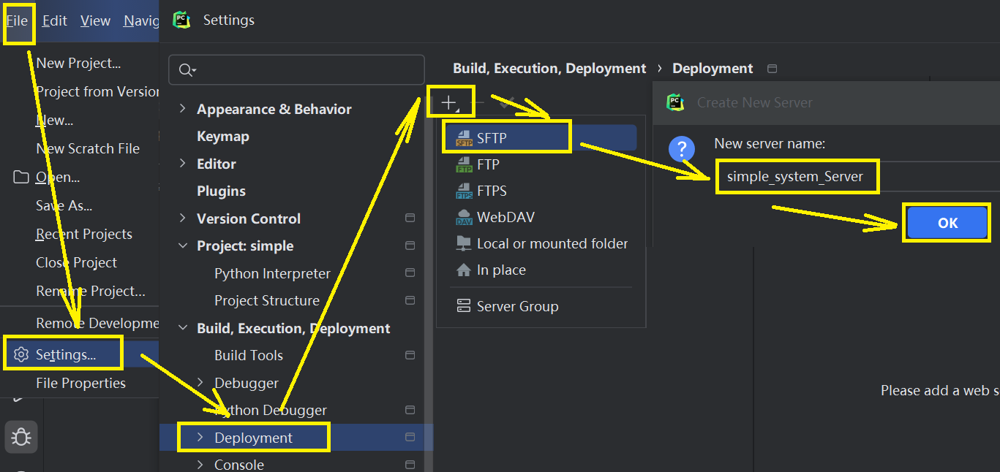
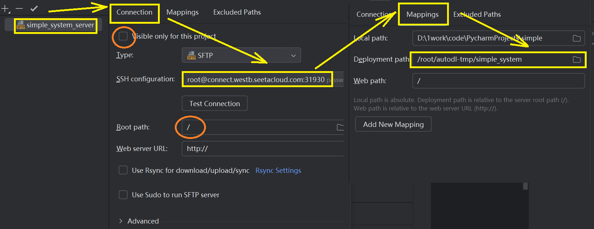
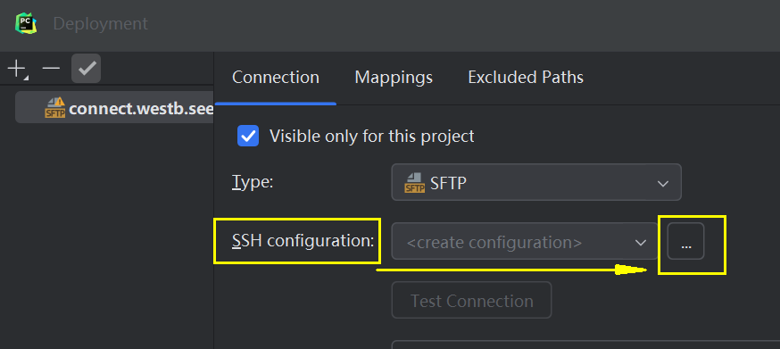
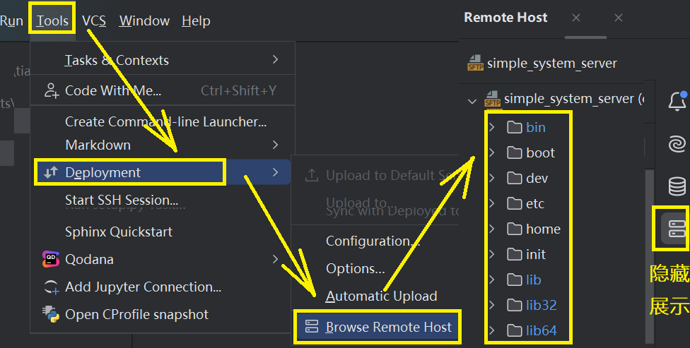
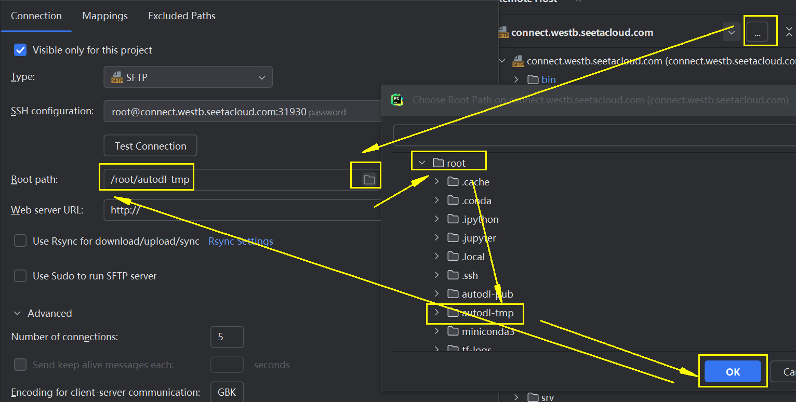
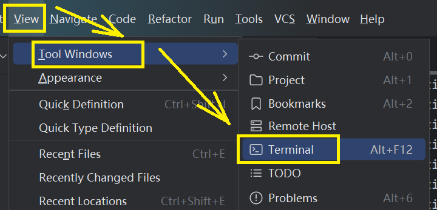
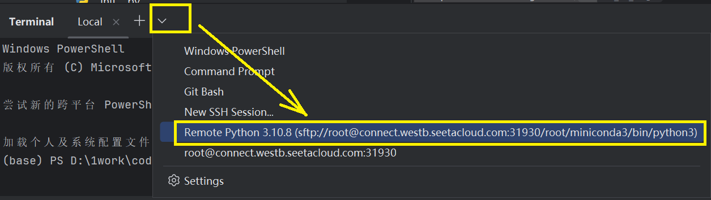
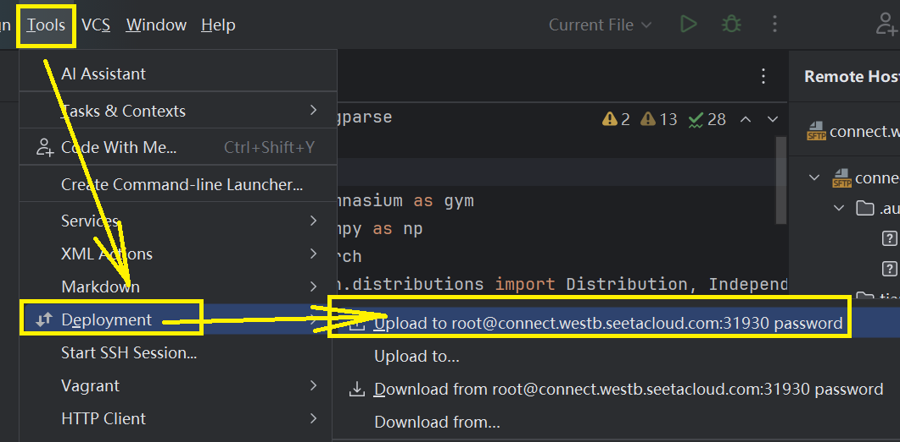
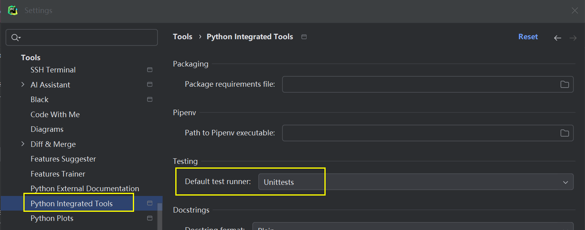
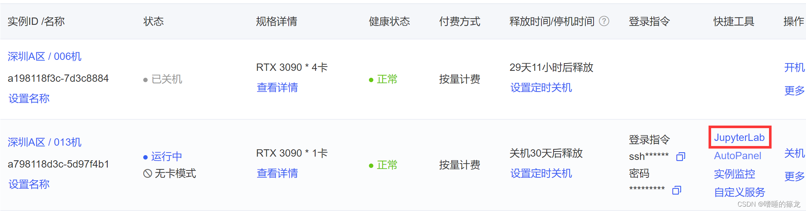

# Pycharm远程连接服务器


* [返回上层目录](../IDE-remote-link-server.md)
* [下载专业版Pycharm](#下载专业版Pycharm)
* [获取远程主机SSH链接](#获取远程主机SSH链接)
* [配置Pycharm的Python解释器的SSH链接](#配置Pycharm的Python解释器的SSH链接)

  * [创建新的conda环境](#创建新的conda环境)
* [配置Pycharm的SFTP的SSH链接](#配置Pycharm的SFTP的SSH链接)

  * [方法1（推荐）](#方法1（推荐）)
  * [方法2](#方法2)
* [显示云服务器的文件目录](#显示云服务器的文件目录)
* [运行Python](#运行Python)

  * [运行和调试](#运行和调试)
  * [报错找不到文件](#报错找不到文件)
  * [内置函数有红线](#内置函数有红线)
  * [含test文件名运行报错找不到pytest](#含test文件名运行报错找不到pytest)
  * [报错找不到远程凭据](#报错找不到远程凭据)
* [模型训练技巧](#模型训练技巧)

  * [获取公共数据集](#获取公共数据集)
  * [守护进程（离线训练）](#守护进程（离线训练）)
  * [自动关机](#自动关机)
  * [AutoDL实时查看tensorboard曲线情况](#AutoDL实时查看tensorboard曲线情况)


# 下载专业版Pycharm

只有Pycharm的专业版才支持远程开发功能！

PyCharm官网下载地址：[PyCharm](https://www.jetbrains.com/pycharm/download/?section=windows#section=windows)，注意要选择专业版的。

下载完安装好，然后上淘宝搜`pycharm激活`，就2-5元，根据介绍激活就行。

注意，如果你安装的不是专业版的，那就需要先卸载（bin/uninstall.exe），然后清理环境里的相关路径。

# 获取远程主机SSH链接

在此之前，先需要打开一个远程云服务平台或者远程主机，这里我们以远程云服务平台[AutoDL](https://www.autodl.com/)为例，


其分配的ssh登录语句为：

```shell
ssh -p 31930 root@connect.westb.seetacloud.com
```

各个参数的含义为：

```shell
host: connect.westb.seetacloud.com
username: root
port: 31930
```

# 配置Pycharm的Python解释器的SSH链接

这里具体可看[**AutoDL帮助文档**：PyCharm远程开发](https://www.autodl.com/docs/pycharm/)。

`File` -> `Settings`，打开以下设置弹窗，搜索interpreter找到`Python interpreter`设置项


将实例SSH指令中的Host、Port与Username进行匹配和填写（Username均为root，Host和Port查看自己实例的SSH指令)


继续下一步，直到看到下面的弹窗。


在上图中，选择`System Interpreter`（经过我的测试，上面的`Virtualenv Environment`也可以选，只是这里选择System的吧先），配置远程Python解释器地址为`/root/miniconda3/bin/python3`（如果您在miniconda中安装了其他的虚拟环境，那么虚拟环境的python解释器路径在`/root/miniconda3/envs/{对应的虚拟环境名称}/bin/python）`。

在上图中，配置同步目录，意思是本地项目和远程实例中的哪个目录进行关联，这里设置为实例的数据盘子目录：`/root/autodl-tmp/simple_system/` （不建议使用默认的/tmp目录）。这里再解释一下这一步的目的，就是当你在本地IDE里运行`本地路径/main.py`时，实际运行的是`/root/autodl-tmp/simple_system/simple.py`。

点击创建，如果配置均无误PyCharm会有一小会的配置过程，完成后即可远程开发。

## 创建新的conda环境

如果要创建新的conda环境，那么：

```python
conda create -n tf python=3.7           # 构建一个虚拟环境，名为：tf
conda init bash && source /root/.bashrc # 更新bashrc中的环境变量
conda activate tf                       # 切换到创建的虚拟环境：tf
```

参考：[Miniconda: 创建新的conda环境](https://www.autodl.com/docs/miniconda/)


**问题：配置好了环境，比如安装了各种包，该怎么长久保存呢？会不会关机后再打开就没有了？**

# 配置Pycharm的SFTP的SSH链接

为什么要做这一步呢？前面不是已经配好了python解释器了吗？

>  这是因为，这一步的目的是方便你同步（上传下载）你本地的文件到远程服务器上去，没有这一步的话，远程服务器就没有你的py文件，那Python解释器执行对应的远程py文件时就会报错：对应地址找不到文件，除非你手动把文件上传上去。也就是说，如果你能接受手动长传文件的麻烦，你也可以不做这一步。我想，大家都想能自动同步文件的吧。。。

## 方法1（推荐）

配置完Python解释器后，紧接着



然后配置SSH和Mapping，和前面配置Python解释器类似。



上图中，要注意两处画红圈的地方，1，取消选择进队当前工程可见；2，`Root Path`设置为`\`。

参考：[**Pycharm IDE下本地Windows+远端Linux项目配置方法**](https://www.bilibili.com/read/cv23040185/)

>  这个配置的默认名字是SSH的用户名@主机地址。注意！请赶紧给这个配置改一个名字（比如你的项目名），否则很容易混用并弄乱！
>
> 另外，务必确保右边“仅对此项目可见”的复选框没有勾上！根路径也不要改！否则可能会引起一些问题：比如项目被上传到错误路径、临时路径，以及会有类似这样的错误： 

## 方法2

（1）Tools -> Deployment -> Configuration，准备与远程服务器连接


（2）添加SFTP

点击上一步的配置按钮，会出现


服务端名字随便取，这里直接就取个`simple_system_server`吧，然后点击OK。

注意，最好别这样取：`connect.westb.seetacloud.com`。

（3）点击`...`进入`SSH Configurations`



点击`...`会出现下图所示界面


点击OK，再点击上一页的OK，完成SSH的配置。

# 显示云服务器的文件目录



指定远程系统根目录



切换到`root/autodl-tmp`目录下，就能看到我们上传的数据和代码了，如果你已经上传了的话。。


上传的源码和数据如果很大的话，一般会通过阿里云上传到`root/autodl-nas`云盘目录下，因此会把根目录改为这个目录，但此时我还没有用阿里云上传过，就先把`/root/autodl-tmp`作为根目录。

连接到远程终端

如果第一次打开IDE找不到终端，那就按照下图打开终端。



连接到远程终端



# 运行Python

##  运行和调试

点击运行，结果如下：

```shell
/root/miniconda3/bin/python3 /root/autodl-tmp/simple_system/main.py 
Hi, PyCharm
```

点击调试，输出如下：

```shell
/root/miniconda3/bin/python3 /root/.pycharm_helpers/pydev/pydevd.py --multiprocess --qt-support=auto --client localhost --port 40983 --file /root/autodl-tmp/simple_system/main.py 
Connected to pydev debugger (build 241.15989.155)
```

**注意**：到目前为止，为了省钱还是开的`无卡模式`，所以为了验证环境已经配置完善，需要`先关机`，再直接`开机`（不要再选择无卡模式了，此时就是要开始烧钱了，`2.3/h`）

输入以下代码验证：

```python
import torchvision
import torch
print(torchvision.__version__)
print(torch.cuda.is_available())
# 0.16.2+cu121
# True
```

这里参考：[AutoDL使用教程：1）创建实例 2）配置环境+上传数据 3）PyCharm2021.3专业版下载安装与远程连接完整步骤 4）实时查看tensorboard曲线情况](https://blog.csdn.net/lwd19981223/article/details/127085811/)

## 报错找不到文件

如果您在运行时找不到Python文件，可能是没有自动同步代码，那么可以选择手动同步：



或者右击单个文件，选择上传同步单个文件：


## 内置函数有红线

参考：[【PyCharm】SSH连接远程服务器，代码能跑但导入的库被标红的解决方案](https://zhuanlan.zhihu.com/p/660353345)

在PyCharm里点击“File”，然后“Invalidates Caches...”，最后“Invalidate and Restart”

##  报错找不到远程凭据

报错：

`Cannot find remote credentials for target config`

参考：[Pycharm运行.py文件报错Cannot find remote credentials for target config com.jetbrains.plugins.remotesdk.tar](https://blog.csdn.net/weixin_46038114/article/details/134540854)

废话不多说，直接上解决办法：

检查你的 Python Interpreter 是否设置正常！！！

选中远程解释器，看看SSH Server是否是正确的配置，点Test Connection是否能正常连接。

我的报错是 因为之前将用于配置远程解释器的 SSH 配置删除了，导致已配置的解释器不能用。

这种情况 直接重新配置远程解释器 即可解决问题。


##  含test文件名运行报错找不到pytest

这是因为你的文件名含有test，比如`test_xxx.py`，Pycharm就会认为这是测试文件，就用pytest执行了，但是你有没有装pytest，就会报错，那就只需要永久禁止所有名字含有test的脚本的pytest运行模式。

具体：

（1）打开文件-设置-工具-python集成工具；

（2）将testing中的运行方式改为unittests；

（3）确认保存



参考：[pycharm取消代码的pytest运行模式](https://blog.csdn.net/nominior/article/details/114673923)

# 模型训练技巧

参考：[【深度学习】Pycharm连接远程服务器（AutoDL）训练YOLOv5](https://blog.csdn.net/weixin_43799388/article/details/124759054)

## 获取公共数据集

获取xxx数据集：

AutoDL的实例均提供公开数据集（CIFAR10、VOC2007、VOC2012、COCO2017等），默认地址在/root/autodl-publ路径下。

```shell
# 在autodl-tmp（数据盘）中新建VOC2007文件夹
(base) root@container-a798118d3c-5d97f4b1:/# mkdir autodl-tmp/VOC2007
# 进入Pascal VOC2007数据集保存路径
(base) root@container-a798118d3c-5d97f4b1:/# cd autodl-pub/VOCdevkit/
# 将Pascal VOC2007数据集解压到自定义路径
(base) root@container-a798118d3c-5d97f4b1:~/autodl-pub/VOCdevkit# tar -zxvf VOC2007.tar.gz -C /root/autodl-tmp/VOC2007/
```

## 守护进程（离线训练）

我们在使用以SSH为基础的工具软件（比如XShell、MobaXterm、PyCharm，VSCode等）进行远程执行程序时，为了避免因为SSH连接中断导致程序终止，遭受不必要的损失，通常会开启守护进程来执行程序。这里介绍两种守护进程方式：AutoDL自带的Jupyterlab终端和screen工具

1、最简单的方式是通过jupyterlab的终端来执行，只要jupyterlab不出现重启（几乎不会），jupyterlab的终端就会一直运行，无论是本地主机断网还是关机。如果关机了这个终端tab，可以在左侧栏正在运行终端和内核中找回。



2、使用`screen`命令，首先要在命令行终端安装`screen`：

```shell
apt-get update && apt-get install -y screen
```

之后就是常规操作了：

```shell
$ screen          # 开启screen
$ screen -ls      # 找到所有离开的会话
$ screen -r ...   # 恢复指定会话
$ kill ...        # 关掉指定会话
```


## 自动关机

不确定自己的代码需要执行多久结束，希望执行完成后立马关机，这类场景可以通过`shutdown`命令来解决。

1、命令行后面加`shutdown`

```shell
python train.py              # 原执行命令
python train.py; shutdown    # 用;拼接意味着前边的指令不管执行成功与否，都会执行shutdown命令
python train.py && shutdown  # 用&&拼接表示前边的命令执行成功后才会执行shutdown
```

2、在Python代码中执行`shutdown`命令

```python
import os

if __name__ == "__main__":
    # xxxxxx
    os.system("shutdown")
```

## AutoDL实时查看tensorboard曲线情况

参考：[AutoDL实时查看tensorboard曲线情况（结合官方文档使用）](https://blog.csdn.net/LWD19981223/article/details/127558739)

# 参考资料

