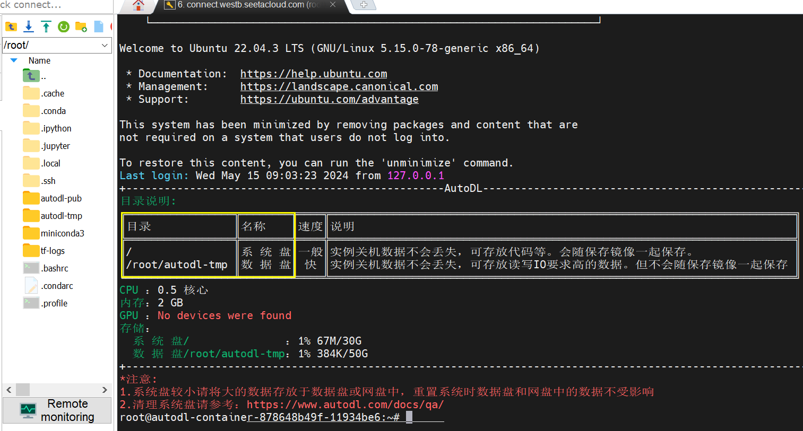

# AutoDL

* [返回上层目录](../cloud-server-platform.md)
* [租用一台算力容器](#租用一台算力容器)
* [本地终端SSH远程链接](#本地终端SSH远程链接)
* [知识点](#知识点)
  * [创建新的conda环境](#创建新的conda环境)
  * [用阿里云盘上传数据](#用阿里云盘上传数据)


# 租用一台算力容器

[AutoDL算力市场](https://www.autodl.com/market/list)


在算力市场里选择好服务器，然后点租用。

然后选好相应的对应的深度学习框架，然后点击开机，同时开始计费。


但是注意，此时你可能还需要上传文件，或者配置本地的pycharm、VScode等来远程ssh链接，所以此时你并不需要GPU运行，那就点击关机，然后选择无GPU运行，此时收费只有0.1元/小时。

# 本地终端SSH远程链接

这里我们使用MobaXterm链接。

复制你租用的登录ssh指令，比如：

```
ssh -p 31930 root@connect.westb.seetacloud.com
```

然后，打开MobaXterm用SSH链接，如下图所示。


注意，上图中的host来自`ssh -p 31930 root@connect.westb.seetacloud.com`中@后的部分，用户名来自@前的部分，Port来自`-p`后的部分，`-p`的意思就是port端口。

注意，登录时会让你输密码，请你手敲进去，不然可能会出错。

登录进去的界面如下：



然后在上图的左侧部分就可以拖拽数据上传下载了。

AutoDL官网常见两个概念：数据盘和系统盘。不考虑物理结构，通过文件目录区分。在/root/autodl-tmp下放置文件表示存储在数据盘，此外其他所有文件都是在系统盘中。


# 知识点

## 创建新的conda环境

如果要创建新的conda环境，那么：

```python
conda create -n tf python=3.7           # 构建一个虚拟环境，名为：tf
conda init bash && source /root/.bashrc # 更新bashrc中的环境变量
conda activate tf                       # 切换到创建的虚拟环境：tf
```

参考：[Miniconda: 创建新的conda环境](https://www.autodl.com/docs/miniconda/)

## 用阿里云盘上传数据

网速确实是问题，所以会把常用的环境配好，保存私有镜像下次可以直接加载，还有文件存到阿里云盘，方便下载，毕竟主要是还是用他们家便宜的卡，就忍忍了。


# 参考资料


===

- [【深度学习】模型训练云服务器平台推荐！！！个人心路历程，新手少踩坑](https://zhuanlan.zhihu.com/p/597476907)

介绍了[AutoDL-品质GPU租用平台-租GPU就上AutoDL](https://www.autodl.com/register?code=cd8a7443-6fc2-4ec4-b88a-da35fb2ac603)

()