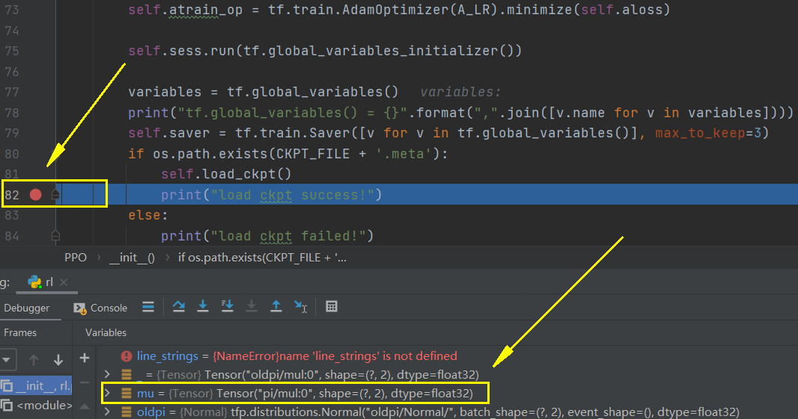

# TensorFlow中ckpt转pb文件（模型持久化）

* [返回上层目录](../tools.md)
* [TensorFlow模型文件解读](#tensorflow模型文件解读)
* [获取需要持久化模型的输出节点名称](#获取需要持久化模型的输出节点名称)
* [ckpt文件生成持久化模型pb文件](#ckpt文件生成持久化模型pb文件)
* [读取生成的pb文件并打印节点名称](#读取生成的pb文件并打印节点名称)
* [利用生成的pb文件实现推断](#利用生成的pb文件实现推断)


# TensorFlow模型文件解读

使用tensorflow训练好的模型会自动保存为四个文件，如下


* **checkpoint：**记录近几次训练好的模型结果（名称）。

* **xxx.data-00000-of-00001:** 模型的所有变量的值(weights, biases, placeholders,gradients, hyper-parameters etc)，也就是模型训练好的**权重的值**和其他值。

* **xxx.index ：**模型的元数据，二进制或者其他格式，不可直接查看 。是一个不可变得字符串表，每一个键都是张量的名称，它的值是一个序列化的BundleEntryProto。 每个BundleEntryProto描述张量的元数据：“数据”文件中的哪个文件包含张量的内容，该文件的偏移量，校验和一些辅助数据等。

* **xxx.meta：**模型的meta数据 ，二进制或者其他格式，不可直接查看，保存了TensorFlow**计算图的结构**信息，通俗地讲就是**神经网络的网络结构**。该文件可以被`tf.train.import_meta_graph`加载到当前默认的图来使用。

# 获取需要持久化模型的输出节点名称

节点名称通常可以在正常的ckpt模型推断代码中找到。

在模型构建的代码的末尾打上断点，如下所示：

```python
class DeepNet(object):
    def __init__(self):
        self.sess = tf.Session()
        # ......
        self.saver = tf.train.Saver([v for v in tf.global_variables()], max_to_keep=3)
        if os.path.exists(CKPT_FILE + '.meta'):
            self.load_ckpt()  # 就在这里打上断点吧!!!
            print("load ckpt success!")
        else:
            print("load ckpt failed!")
```

然后调试，会发现你想要输出的tensor的别名，在本例中，想要输出的tensor是`mu`，如下图的黄框所示，其别名叫做`pi/mul`，注意不是`pi/mu:0`。

```shell
name: "pi/mul"  # 名字叫这个
op: "Mul"
input: "pi/mul/x"
input: "pi/actor_mu/Tanh"
attr {
  key: "T"
  value {
    type: DT_FLOAT
  }
}
```



# ckpt文件生成持久化模型pb文件

获取节点名称后通过ckpt文件持久化模型，生成pb文件

```python
from tensorflow.python.framework import graph_util
import tensorflow as tf
import numpy as np

# tensorflow中ckpt转pb文件（模型持久化） https://zhuanlan.zhihu.com/p/147658249

def freeze_graph(input_checkpoint, output_graph):
    '''
    :param input_checkpoint:
    :param output_graph: PB模型保存路径
    :return:
    '''
    # checkpoint = tf.train.get_checkpoint_state(model_folder) #检查目录下ckpt文件状态是否可用
    # input_checkpoint = checkpoint.model_checkpoint_path #得ckpt文件路径

    # 指定输出的节点名称,该节点名称必须是原模型中存在的节点
    output_node_names = "pi/mul"  # 打断点调试查看，这个是系统根据功能命名，不是你自己设置的name=xxx的名字
    saver = tf.train.import_meta_graph(input_checkpoint + '.meta', clear_devices=True)
    graph = tf.get_default_graph()  # 获得默认的图
    input_graph_def = graph.as_graph_def()  # 返回一个序列化的图代表当前的图

    with tf.Session() as sess:
        saver.restore(sess, input_checkpoint)  # 恢复图并得到数据
        output_graph_def = graph_util.convert_variables_to_constants(  # 模型持久化，将变量值固定
            sess=sess,
            input_graph_def=input_graph_def,  # 等于:sess.graph_def
            output_node_names=output_node_names.split(","))  # 如果有多个输出节点，以逗号隔开

        with tf.gfile.GFile(output_graph, "wb") as fgraph:  # 保存模型
            fgraph.write(output_graph_def.SerializeToString())  # 序列化输出

    print("%d ops in the final graph." % len(output_graph_def.node))  # 得到当前图有几个操作节点
    # i = 1
    # for node in output_graph_def.node:
    #     print("===> {} <===".format(i))
    #     print(node)
    #     i += 1
    #
    # print("="*40)
    # i = 1
    # for op in graph.get_operations():
    #     print("index = {}, name = {}, value = {}".format(i, op.name, op.values()))
    #     i += 1
    
    # op的打印顺序大致以 以下顺序排列：
    # 前向传播op
    # 占位符op
    # 优化器op
    # 评估指标（loss、acc）op
    # 反向传播梯度op


if __name__ == '__main__':
    ckpt_file = "../model/xxxx"
    pb_file = "../model/xxxx.pb"

    freeze_graph(ckpt_file, pb_file)
```

# 读取生成的pb文件并打印节点名称

读取生成的pb文件，并打印节点名称：

```python
from tensorflow.python.framework import graph_util
import tensorflow as tf
import numpy as np

# 读取pb文件
def read_pb(graph_path):
    graph_def = tf.GraphDef()
    with tf.gfile.FastGFile(graph_path, 'rb') as f:
        graph_def.ParseFromString(f.read())
        tf.import_graph_def(graph_def, name='')
    for node in graph_def.node:
        print(node.name)

        
if __name__ == '__main__':
    ckpt_file = "../model/xxxx"
    pb_file = "../model/xxxx.pb"
    
    read_pb(pb_file)
```

结果如下，一共有17个节点：

```shell
state
pi/net_hidden/kernel
pi/net_hidden/kernel/read
pi/net_hidden/bias
pi/net_hidden/bias/read
pi/net_hidden/MatMul
pi/net_hidden/BiasAdd
pi/net_hidden/Relu
pi/net_mu/kernel
pi/net_mu/kernel/read
pi/net_mu/bias
pi/net_mu/bias/read
pi/net_mu/MatMul
pi/net_mu/BiasAdd
pi/net_mu/Tanh
pi/mul/x
pi/mul
```

之所以只剩下17个节点了，是因为这17个节点是前向传播的，其余的op算子都不属于前向传播推理，所以就被去掉了。

```
op的打印顺序大致以 以下顺序排列：
前向传播op
占位符op
优化器op
评估指标（loss、acc）op
反向传播梯度op
```

# 利用生成的pb文件实现推断

```python
from tensorflow.python.framework import graph_util
import tensorflow as tf
import numpy as np

# pb图模型推断
def pbInference(graph_path):
    # 导入图模型
    graph_def = tf.GraphDef()
    with tf.gfile.FastGFile(graph_path, 'rb') as f:
        graph_def.ParseFromString(f.read())
        tf.import_graph_def(graph_def, name='')

    # PB图模型中节点名称
    tensor_name_list = [tensor.name for tensor in tf.get_default_graph().as_graph_def().node]

    isess = tf.InteractiveSession()
    # 默认是Placeholder可以在pb文件中查看节点名称，也可以在tensor_name_list这个变量中查看
    state_placeholder = tf.get_default_graph().get_tensor_by_name("state:0")
    action = tf.get_default_graph().get_tensor_by_name("pi/mul:0")

    s = np.array([0., -1.5, -1.29, -1.5, -1.29, -0.5, -0.29])
    s = s[np.newaxis, :]
    action_, = isess.run([action], feed_dict={state_placeholder: s})
    print(action_)  # [[ 0.8672415 , -0.55812573]]
    print(action_[0])  # [ 0.8672415  -0.55812573]


if __name__ == '__main__':
    ckpt_file = "../model/xxxx"
    pb_file = "../model/xxxx.pb"

    pbInference(pb_file)
```

最后的推断结果的为`[ 0.8672415  -0.55812573]`，和直接用模型预测的结果完全一致。

# 参考资料

* [tensorflow模型文件(ckpt)转pb文件的方法（不知道输出节点名）](http://www.kaotop.com/it/19844.html)

开头的“tensorflow模型文件解读”参考了此博客。

* [tensorflow中ckpt转pb文件（模型持久化）](https://zhuanlan.zhihu.com/p/147658249)

本文主要参考了此博客。

