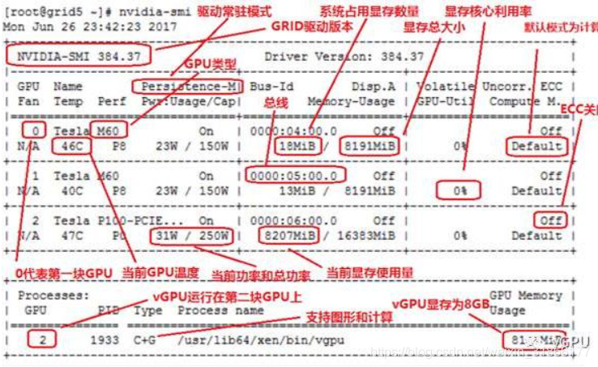

# Tensorflow中使用GPU

* [返回上层目录](../tools.md)
* [测试是否支持GPU](#测试是否支持GPU)
* [查看GPU的信息](#查看GPU的信息)
* [动态指定空闲GPU](#动态指定空闲GPU)
* [程序按需占用GPU显存](#程序按需占用GPU显存)
* [网上的云GPU](#网上的云GPU)


# 测试是否支持GPU

```python
print(tf.test.is_gpu_available())
```

# 查看GPU的信息

使用`nvidia-smi`命令查看当前机器的GPU基本信息和被占用信息。

比如下图所示，当前机器有8个GPU，其中[3, 4, 5]被占用。

```shell
Tue Mar 31 20:03:24 2020       
+-----------------------------------------------------------------------------+
| NVIDIA-SMI 418.67       Driver Version: 418.67       CUDA Version: 10.1     |
|-------------------------------+----------------------+----------------------+
| GPU  Name        Persistence-M| Bus-Id        Disp.A | Volatile Uncorr. ECC |
| Fan  Temp  Perf  Pwr:Usage/Cap|         Memory-Usage | GPU-Util  Compute M. |
|===============================+======================+======================|
|   0  Tesla V100-SXM2...  Off  | 00000000:8A:00.0 Off |                    0 |
| N/A   41C    P0    44W / 300W |      0MiB / 32480MiB |      0%      Default |
+-------------------------------+----------------------+----------------------+
|   1  Tesla V100-SXM2...  Off  | 00000000:8B:00.0 Off |                    0 |
| N/A   37C    P0    45W / 300W |      0MiB / 32480MiB |      0%      Default |
+-------------------------------+----------------------+----------------------+
|   2  Tesla V100-SXM2...  Off  | 00000000:8C:00.0 Off |                    0 |
| N/A   45C    P0    46W / 300W |      0MiB / 32480MiB |      0%      Default |
+-------------------------------+----------------------+----------------------+
|   3  Tesla V100-SXM2...  Off  | 00000000:8D:00.0 Off |                    0 |
| N/A   50C    P0    75W / 300W |   8940MiB / 32480MiB |     49%      Default |
+-------------------------------+----------------------+----------------------+
|   4  Tesla V100-SXM2...  Off  | 00000000:B3:00.0 Off |                    0 |
| N/A   44C    P0    60W / 300W |   1008MiB / 32480MiB |     28%      Default |
+-------------------------------+----------------------+----------------------+
|   5  Tesla V100-SXM2...  Off  | 00000000:B4:00.0 Off |                    0 |
| N/A   46C    P0    92W / 300W |   1016MiB / 32480MiB |     41%      Default |
+-------------------------------+----------------------+----------------------+
|   6  Tesla V100-SXM2...  Off  | 00000000:B5:00.0 Off |                    0 |
| N/A   43C    P0    46W / 300W |      0MiB / 32480MiB |      0%      Default |
+-------------------------------+----------------------+----------------------+
|   7  Tesla V100-SXM2...  Off  | 00000000:B6:00.0 Off |                    0 |
| N/A   42C    P0    44W / 300W |      0MiB / 32480MiB |      0%      Default |
+-------------------------------+----------------------+----------------------+
                                                                               
+-----------------------------------------------------------------------------+
| Processes:                                                       GPU Memory |
|  GPU       PID   Type   Process name                             Usage      |
|=============================================================================|
|    3    320060      C   python                                      8923MiB |
|    4    320060      C   python                                       993MiB |
|    5    320060      C   python                                      1001MiB |
+-----------------------------------------------------------------------------+
```

再通过命令`ll /proc/pid`查看pid信息。

另外，`nvidia-smi -l`命令可以不断自动刷新GPU信息。

**GPU信息介绍**



GPU：本机中的GPU编号

Name：GPU类型

Persistence-M：驱动常驻模式

Fan：风扇转速

Temp：温度，单位摄氏度

Perf：表征性能状态，从P0到P12，P0表示最大性能，P12表示状态最小性能

Pwr:Usage/Cap：能耗表示

Bus-Id：涉及GPU总线的相关信息；

Disp.A：Display Active，表示GPU的显示是否初始化

Memory-Usage：显存使用率

Volatile GPU-Util：浮动的GPU利用率

Uncorr. ECC：关于ECC的东西

Compute M.：计算模式

Processes 显示每块GPU上每个进程所使用的显存情况。

# 动态指定空闲GPU

有两种，第一种是github上找的，另一种是自己写的。

* github上的：[gputil](https://github.com/anderskm/gputil)

* 自己写的：见具体的代码，这里就不写了，有点长。

# 程序按需占用GPU显存

在使用过程中，我发现我的机器显存在没有执行复杂操作的时候已经占用很高。经过调查发现，tensorflow默认是占用所有显卡和全部显存，用户可以通过以下设置，让tensorflow按需要占用显存。

以下命令为TensorFlow 2.x的命令：

```python
import tensorflow as tf
gpus = tf.config.experimental.list_physical_devices('GPU')
if gpus:
    try:
        # Currently, memory growth needs to be the same across GPUs
        for gpu in gpus:
            tf.config.experimental.set_memory_growth(gpu, True)
        logical_gpus = tf.config.experimental.list_logical_devices('GPU')
        print(len(gpus), "Physical GPUs,", len(logical_gpus), "Logical GPUs")
    except RuntimeError as e:
        # Memory growth must be set before GPUs have been initialized
        print(e)
```


# 参考资料


===

[指定当前程序使用的 GPU](https://www.cnblogs.com/king-lps/p/12748459.html)


