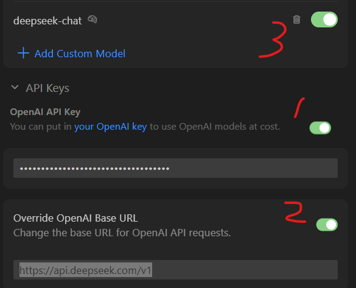
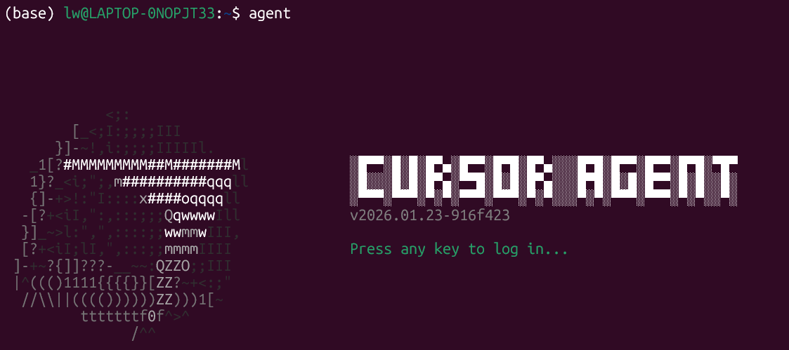

# Cursor远程连接服务器

* [返回上层目录](../IDE-remote-link-server.md)

# 使用大模型开发代码

具体看这里：

[【Cursor】Cursor的基本使用方式](https://zhuanlan.zhihu.com/p/32081323818)

## 使用自己的API集成到Cursor中

比如用DeepSeek：

上DeepSeek官网注册账号，获取自己的API，然后

按照https://api-docs.deepseek.com/zh-cn/用户手册中的

```python
# Please install OpenAI SDK first: `pip3 install openai`
import os
from openai import OpenAI

client = OpenAI(
    api_key=os.environ.get('DEEPSEEK_API_KEY'),
    base_url="https://api.deepseek.com")

response = client.chat.completions.create(
    model="deepseek-chat",
    messages=[
        {"role": "system", "content": "You are a helpful assistant"},
        {"role": "user", "content": "Hello"},
    ],
    stream=False
)

print(response.choices[0].message.content)
```

你就知道了你可用的模型是`deepseek-chat`，当然了你可以换成其他的可用的DS模型。

然后打开Cursor的设置页面，在下面的OpenAI API里填入两项：

* OpenAI API keys，写你的API
* Base URL，写https://api.deepseek.com/v1

然后添加你调用的模型的名称，需要新加入模型`deepseek-chat`。



## Cursor Agent CLI

```shell
(base) user@LAPTOP:~$ curl https://cursor.com/install -fsS | bash

Cursor Agent Installer

✓ Detected linux/x64
✓ Package downloaded and extracted
✓ Package installed successfully
✓ Bin directory ready
✓ Symlink created

✨ Installation Complete!

Start using Cursor Agent:
   agent

Happy coding! 🚀

(base) lw@LAPTOP-0NOPJT33:~$ agent
```



具体使用方法：


# 问题

## Python项目Ctrl+鼠标左键不跳转函数

安装Pydance或者Pyright。经过测试，优先Pyright。

## cursor无法进行代码补全

Python Language Server 服务器的设置，很重要

尝试**Kylin Python (with jedi language server)**，请安装该插件。提供代码补全体验。选择一个选项后需要重启Cursor才能完全生效

为啥不用VSCode中的**Pylance**呢？因为这是微软开发的，已经不让cursor用了，因为和VSCode构成了竞争。

## 报错This model provider doesn’t serve your region

之前在魔法下可以正常使用，但是今天先开了编辑器ide，后来使用提示区域问题，不知道该怎么办了的时候最后搞好了，具体的报错信息和截图见下方：

```
Model not available

This model provider doesn’t serve your region. Visit https://docs.cursor.com/account/regions for more information.
```

在右上角的设置，点击⚙️设置按钮，选择network，run diagnostic 检查下就可以了，前提是需要提前打开魔法。

# 参考资料

* [cursor无法进行代码补全时候的修正(折磨我2小时）](https://blog.csdn.net/ranzhiyimu/article/details/146153804)

cursor无法进行代码补全部分参考这里。

* [cursor报错This model provider doesn’t serve your region.](https://blog.csdn.net/haobindayi/article/details/150443135)

报错This model provider doesn’t serve your region 参考这里。

