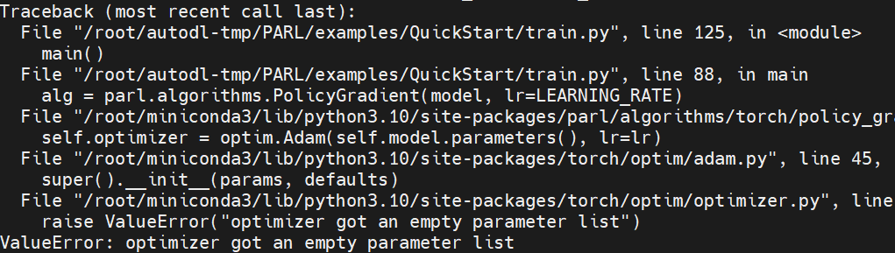
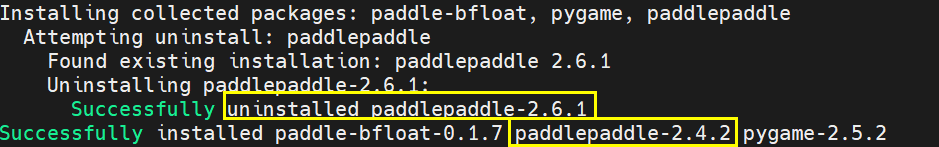
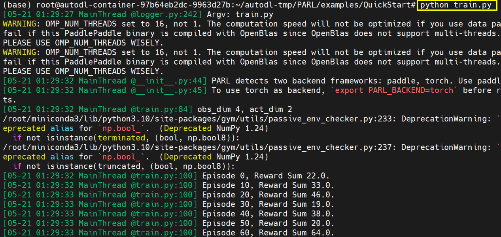

# PARL强化学习训练框架

* [返回上层目录](../reinforcement-learning-training-framework.md)
* [PARL介绍](#PARL介绍)
* [PARL安装](#PARL安装)


# PARL介绍

PARL是**百度**出的一款强化学习训练框架/算法库。

Github：[https://github.com/PaddlePaddle/PARL](https://link.zhihu.com/?target=https%3A//github.com/PaddlePaddle/PARL)

**多机多卡：支持**

百度出品，基于PaddlePaddle的RL框架，其核心卖点一是使用了黑科技可以消除python多线程GIL锁的限制，使得可以高效利用多核CPU来环境并行。经过他们的测试PARL的吞吐效率是比Ray高一些。

缺点是使用**这个框架需要使用paddlepaddle**，而不能使用pytorch这些熟悉的框架。

# PARL安装

参考[PARL tutorial](https://parl.readthedocs.io/en/latest/tutorial/getting_started.html)：

```shell
# Install dependencies
pip install paddlepaddle

pip install gym
git clone https://github.com/PaddlePaddle/PARL.git
cd PARL
pip install .

# Train model
cd examples/QuickStart/
python train.py
```

参考[PARL/examples/QuickStart](https://github.com/PaddlePaddle/PARL/tree/develop/examples/QuickStart)，跑下里面自带的简单例子：Quick Start。

> Train an agent with PARL to solve the CartPole problem, a classical benchmark in RL.

开始训练：

```shell
cd PARL/examples/QuickStart
python train.py  
```

但是，竟然出错了：



分析原因：怀疑是那个quickstart目录下的cartpole model.py中的类是继承了parl.Model，其在某个版本不支持parameter参数，解决办法是在这个目录下执行`pip install -r requirement.txt`，然后再运行train

尝试执行

```shell
pip install -r requirement.txt
```

果然发现



是前面安装的paddlepaddle版本太高了（`2.6.1`），而这里只需要某个低版本（`2.4.2`）的，所以出错了。

那么经过对paddlepaddle的降级（`2.6.1`->`2.4.2`），应该就能运行了吧？

试一试：

```shell
cd PARL/examples/QuickStart
python train.py
```

果然可以运行了：



# 参考资料

