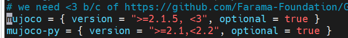
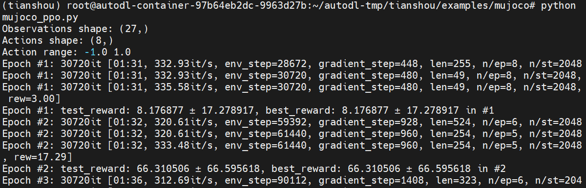

# 天授强化学习训练框架

* [返回上层目录](../reinforcement-learning-training-framework.md)
* [天授简介](#天授简介)
* [天授的安装](#天授的安装)
  * [安装天授本身](#安装天授本身)
  * [安装mujoco和mujoco-py](#安装mujoco和mujoco-py)


# 天授简介

Github: [tianshou](https://github.com/thu-ml/tianshou)，包含了源码和使用介绍。

> **Tianshou** (天授) is a reinforcement learning platform based on pure **PyTorch** and **[Gymnasium](http://github.com/Farama-Foundation/Gymnasium)**. Unlike other reinforcement learning libraries, which may have complex codebases, unfriendly high-level APIs, or are not optimized for speed, Tianshou provides a high-performance, modularized framework and user-friendly interfaces for building deep reinforcement learning agents. One more aspect that sets Tianshou apart is its generality: it supports online and offline RL, multi-agent RL, and model-based algorithms.

# 天授的安装

## 安装天授本身

具体的安装说明参见其Github: [tianshou](https://github.com/thu-ml/tianshou)。

注意，注意，注意！！！**天授需要的Python版本必须是3.11以上，包括3.11，否则直接报错**。在github的安装部分说了：`It requires Python >= 3.11`。

**不要试图在小于3.11的Python版本安装！！！**，因为我帮你已经踩过了这个坑了！如果你本地不能装3.11版本的python和pytorch，那可以找个云主机（比如AutoDL）装。

先安装poetry：

```shell
pip install poetry
```

然后

```shell
git clone https://github.com/thu-ml/tianshou.git
cd tianshou
poetry install
```

测试是否安装天授成功：

```python
import tianshou
print(tianshou.__version__)
```

## 安装mujoco和mujoco-py

我们找到里面的ppo的例子，来试着运行[mujoco_ppo.py](https://github.com/thu-ml/tianshou/blob/master/examples/mujoco/mujoco_ppo.py)：

> https://github.com/thu-ml/tianshou/blob/master/examples/mujoco/mujoco_ppo.py

按照其[README.md](https://github.com/thu-ml/tianshou/tree/master/examples/mujoco)：

```python
python mujoco_sac.py --task Ant-v3
```

发现竟然报错了：



是因为没有装mujoco和mujoco-py，那就把这两个装上，装好后再运行就成功了，如下图



# 参考资料

