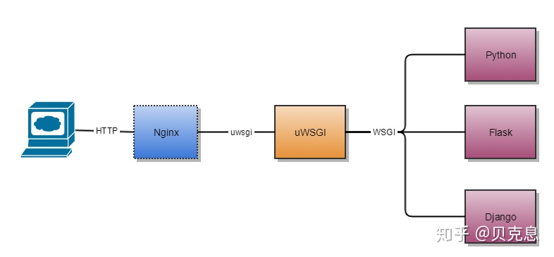

# TensorFlow Serving

* [返回上层目录](../tensorflow.md)
* [TFserving介绍](#TFserving介绍)
* [Docker与TFserving](#Docker与TFserving)
  * [安装Docker](#安装Docker)
    * [win10安装](#win10安装)
    * [linux安装](#linux安装)
  * [拉取TF.Serving镜像](#拉取TF.Serving镜像)
  * [运行容器](#运行容器)
  * [通过API查看模型状态，元数据](#通过API查看模型状态，元数据)
    * [通过model-status-API查看模型状态](#通过model-status-API查看模型状态)
    * [通过model-metadata-API查看模型的元数据](#通过model-metadata-API查看模型的元数据)
  * [gRPC与RESTful请求的区别](#gRPC与RESTful请求的区别)
  * [使用RESTful-API请求预测](#使用RESTful-API请求预测)
  * [使用gRPC请求预测](#使用gRPC请求预测)
    * [输入数据为文本或数字类型](#输入数据为文本或数字类型)
    * [输入数据为图像类型](#输入数据为图像类型)
  * [ckpt格式转为pd格式用于TFserving](#ckpt格式转为pd格式用于TFserving)
* [Flask服务](#Flask服务)
  * [为什么需要Flask服务器](#为什么需要Flask服务器)
  * [Flask的HelloWorld代码](#Flask的HelloWorld代码)
  * [Flask的缺陷](#Flask的缺陷)
  * [gevent+Flask同步变异步](#gevent+Flask同步变异步)
* [Nginx+Gunicorn+Flask部署](#Nginx+Gunicorn+Flask部署)
  * [理解Nginx+Gunicorn+Flask](#理解Nginx+Gunicorn+Flask)
    * [为什么要用Nginx+Gunicorn+Flask+supervisor方式部署](#为什么要用Nginx+Gunicorn+Flask+supervisor方式部署)
    * [Nginx、gunicore和Flask之间的关系](#Nginx、gunicore和Flask之间的关系)
    * [为什么Flask和Nginx之间要用uwsgi服务器](#为什么Flask和Nginx之间要用uwsgi服务器)
    * [为什么需要Nginx](#为什么需要Nginx)
  * [部署流程](#部署流程)
  * [Flask](#Flask)
  * [Gunicorn](#Gunicorn)
    * [什么是Gunicorn](#什么是Gunicorn)
    * [Gunicorn配置](#Gunicorn配置)
    * [运行Gunicorn](#运行Gunicorn)
  * [Nginx](#Nginx)
    * [Nginx介绍](#Nginx介绍)
    * [修改配置](#修改配置)
    * [Nginx的应用](#Nginx的应用)
      * [反向代理](#反向代理)
      * [负载均衡](#负载均衡)
    * [安装、配置并运行Nginx](#安装、配置并运行Nginx)
  * [supervisord](#supervisord)
    * [新增Nginx进程配置文件](#新增Nginx进程配置文件)
    * [supervisorctl操作命令](#supervisorctl操作命令)
    * [新增Gunicorn进程配置文件](#新增Gunicorn进程配置文件)
  * [简单例子部署完成总结](#简单例子部署完成总结)
* [基于supervisor+Nginx+Gunicorn+Flask+Docker部署TFserving服务](#基于supervisor+Nginx+Gunicorn+Flask+Docker部署TFserving服务)
  * [部署模型](#部署模型)
  * [部署Docker](#部署Docker)
  * [部署Flask](#部署Flask)
  * [部署Gunicorn](#部署Gunicorn)
  * [部署Nginx](#部署Nginx)
  * [部署supervisor](#部署supervisor)
    * [新增Docker进程配置文件](#新增Docker进程配置文件)
    * [新增Gunicorn进程配置文件](#新增Gunicorn进程配置文件)
    * [新增Nginx进程配置文件](#新增Nginx进程配置文件)
  * [部署完成总结](#部署完成总结)
  * [基于python的客户端请求](#基于python的客户端请求)
  * [用ab压测](#用ab压测)
    * [ab原理](#ab原理)
    * [服务器qps预估](#服务器qps预估)
    * [对模型进行测试](#对模型进行测试)
  * [多模型在线部署](#多模型在线部署)
    * [多模型部署](#多模型部署)
    * [模型版本控制](#模型版本控制)
      * [服务端配置](#服务端配置)
      * [客户端调用](#客户端调用)
    * [热更新](#热更新)
      * [发送HandleReloadConfigRequest-rpc调用](#发送HandleReloadConfigRequest-rpc调用)
      * [指定–-model_config_file_poll_wait_seconds选项](#指定–-model_config_file_poll_wait_seconds选项)
    * [其他有用参数](#其他有用参数)
    * [多模型在线部署实例](#多模型在线部署实例)
      * [多模型配置与docker部署](#多模型配置与docker部署)
      * [Flask部署](#Flask部署)
      * [supervisor部署](#supervisor部署)
        * [Docker进程配置](#Docker进程配置)
        * [Gunicorn进程配置](#Gunicorn进程配置)
        * [Nginx进程配置](#Nginx进程配置)
        * [使用supervisord进行reload启动进程](#使用supervisord进行reload启动进程)
      * [使用python进行客户端请求](#使用python进行客户端请求)
      * [使用ab进行压测](#使用ab进行压测)
        * [压测lstm评论感情识别模型](#压测lstm评论感情识别模型)
        * [压测图像显著性检测模型](#压测图像显著性检测模型)

人工智能应用需要数据、算法、算力、服务等环节。模型服务是应用的必不可少的一步，目前普遍使用TensorFlow Serving提供模型服务功能。

人工智能模型服务的线上发布则需要选择更高性能的web服务。这里推荐的部署方式：Nginx + Gunicorn + Flask + supervisor，这种配置可以很好的支持高并发，负载均衡，进程监控，并且安全性和鲁棒性更高。

Nginx + Gunicorn + Flask + supervisor的部署方式：


TFserving + Flask的部署方式：


# TFserving介绍

TensorFlow服务是你训练应用机器学习模型的方式。

TensorFlow服务使得投入生产的过程模型更容易、更快速。它允许你安全地部署新模型并运行实验，同时保持相同的服务器体系结构和API。开箱即用，它提供了与TensorFlow的集成，而且它可以扩展为其他类型的模型。


大家习惯使用TensorFlow进行模型的训练、验证和预测，但模型完善之后的生产上线流程，就变得五花八门了。针对这种情况Google提供了TensorFlow Servering，可以将训练好的模型直接上线并提供服务。在2017年的TensorFlow开发者Summit上便提出了TensorFlow Serving。

但那时候客户端和服务端的通信只支持gRPC。在实际的生产环境中比较广泛使用的C/S通信手段是基于RESTfull API的，幸运的是从tf1.8以后，TFserving也正式支持RESTfull API通信方式了。

* 用什么来部署：当然是TFserving
* 怎么提供api接口：TFserving有提供RESTful api接口，现实部署时会在前面再加一层如Flask api
* 多个模型GPU资源如何分配：TFserving支持部署多模型，通过配置
* 线上模型如何更新而服务不中断：TFserving支持模型的不同的版本，如your_model中1和2两个版本，当你新增一个模型3时，TFserving会自动判断，自动加载模型3为当前模型，不需要重启

TensorFlow Serving还支持同时挂载多个模型或者多个版本的模型，只需简单地指定模型名称即可调用相应的模型，无需多写几份代码、运行多个后台服务。因此优势在于：

**1. 自动刷新使用新版本模型，无需重启服务。**

**2. 无需写任何部署代码。**

**3. 可以同时挂载多个模型。**

# Docker与TFserving

## 安装Docker

### win10安装

对于win10环境，需要[Docker Desktop for Windows](https://hub.docker.com/editions/community/docker-ce-desktop-windows)，点击`get docker`进行下载，大约500MB。

注意，win10家庭版要升级到专业版，否则无法安装，可让淘宝帮助升级。


然后进行安装。这样就安装好了docker了。

win10的docker是基于hyper-v的，但是开启了hyper-v，就无法打开其他虚拟机，比如vmware。如果要关闭hyper-v虚拟机，则运行

```shell
Disable-WindowsOptionalFeature -Online -FeatureName Microsoft-Hyper-V-Hypervisor
```

### linux安装

安装docker：

```shell
sudo apt install docker.io
```

需要下载的文件有近300M大小，所以如果下载速度很慢，就将apt换成国内的源（具体参考[Ubuntu使用apt-get下载速度慢的解决方法](https://blog.csdn.net/qq_24326765/article/details/81916222)）。

后续的docker的linux命令，前面都要加sudo。

关于docker的一些命令：[Docker在Linux下载安装及部署](https://blog.csdn.net/qq_35139965/article/details/109475695)。

## 拉取TF.Serving镜像

打开`powershell`，然后这里我们选择tensorflow 1.14.0版本的镜像。

```shell
docker pull tensorflow/serving:1.14.0
docker pull tensorflow/serving:1.14.0-gpu # 注意，可以选GPU
```


安装完可以用下面的命令查看安装的镜像：

```shell
docker images
```

如果下载错了，可以这样删除：

```shell
docker rmi tensorflow/serving:1.14.0
```

## 运行容器

上述准备工作完成后可以运行容器：

对于RESTful，使用8501端口（如下所示）：

```shell
docker run -p 8501:8501 --name="lstm" --mount type=bind,source=D:\code\PycharmProject\tf_model\sentiment-analysis\v1_lstm_csv\saved_model,target=/models/lstm -e MODEL_NAME=lstm -t tensorflow/serving:1.14.0 "&"
```

而如果使用gRPC请求预测，则需将上面的8501改成8500端口：

```shell
docker run -p 8500:8500 --name="lstm" --mount type=bind,source=D:\code\PycharmProject\tf_model\sentiment-analysis\v1_lstm_csv\saved_model,target=/models/lstm -e MODEL_NAME=lstm -t tensorflow/serving:1.14.0 "&"
```

如果docker安装选的是`docker pull tensorflow/serving:1.14.0-gpu`，可以选择指定GPU：

```shell
docker run -p 8500:8500 --name="lstm" --mount type=bind,source=D:\code\PycharmProject\tf_model\sentiment-analysis\v1_lstm_csv\saved_model,target=/models/lstm -e MODEL_NAME=lstm CUDA_VISIBLE_DEVICES=0 -t tensorflow/serving:1.14.0 "&"
```

上面的命令中：

* `-p 8501:8501`是端口映射，是将容器的8501端口映射到宿主机的8501端口，后面预测的时候使用该端口。

  默认tensorflow serving的8500端口是对gRPC开放，8501是对REST API开放，8501:8501即（主机端口:容器端口），如果不进行设定，则都是默认端口。

  更具体点说，-p 22222:33333 关键参数，指定docker虚拟机的22222端口，映射为container的33333端口，即对192.168.59.103:22222的访问，统统访问到container的33333端口。如果要映射80端口，设置-p 80:80就好。

* `-e MODEL_NAME=lstm` 设置模型名称；

  - 可选参数: MODLE_NAME（默认值：model）
  - 可选参数：MODEL_BASE_PATH（默认值/models）

* `--mount type=bind,source=D:\xxx\v1_lstm_csv\saved_model,target=/models/lstm` 是将宿主机的路径D:\xxx\v1_lstm_csv\saved_model挂载到容器的/models/lstm下。D:\xxx\v1_lstm_csv\saved_model是存放的是上述准备工作中保存的模型文件，在D:\xxx\v1_lstm_csv\saved_model下新建一个以数字命名的文件夹，如100001，并将模型文件（包含一个.pb文件和一个variables文件夹）放到该文件夹中。容器内部会根据绑定的路径读取模型文件；

* `-t tensorflow/serving:1.14.0` 根据名称“tensorflow/serving:1.14.0”运行容器；

注意：上面的`source=D:\code\xxx\v1_lstm_csv\saved_model`里的模型，是一个中文评论情感分类的模型，可以直接在github上下载：[linguishi/**chinese_sentiment**](https://github.com/linguishi/chinese_sentiment/tree/master/model/lstm/saved_model)，要将包含模型数据的数字名字的文件夹放在`D:\code\xxx\v1_lstm_csv\saved_model`路径下，因为docker会自动找最新的数字文件夹名进行加载，即路径只需到模型这一级，不能精确到版本级别，比如：/root/mutimodel/linear_model而不是/root/mutimodel/linear_model/1，服务会默认加载最大版本号的模型。


此外，如果想停止TFserving服务或者删除同名服务，则

停掉TFserving服务

先找到Docker容器进程：

> docker ps -a
>
> 或者更精确一点：docker ps -a | grep "tensorflow/serving"

输出：


第一列为container id，干掉它即可：

```shell
sudo docker kill d4fcf5591676
```

删除该任务的话，需要输入：

```shell
sudo docker rm d4fcf5591676
```

## 通过API查看模型状态，元数据

### 通过model-status-API查看模型状态

```shell
curl http://localhost:8501/v1/models/lstm
```

可得

> {
>  "model_version_status": [
>   {
>    "version": "1609392632",
>    "state": "AVAILABLE",
>    "status": {
>     "error_code": "OK",
>     "error_message": ""

### 通过model-metadata-API查看模型的元数据

```shell
curl http://localhost:8501/v1/models/lstm/metadata
```

可得

> {
> "model_spec":{
>  "name": "lstm",
>  "signature_name": "",
>  "version": "1609392632"
> }
> ,
> "metadata": {"signature_def": {
>  "signature_def": {
>   "serving_default": {
>    "inputs": {
>     "nwords": {
>      "dtype": "DT_INT32",
>      "tensor_shape": {
>       "dim": [
>        {
>         "size": "-1",
>         "name": ""
>        }
>       ],
>       "unknown_rank": false
>      },
>      "name": "nwords:0"
>     },
>     "words": {
>      "dtype": "DT_STRING",
>      "tensor_shape": {
>       "dim": [
>        {
>         "size": "-1",
>         "name": ""
>        },
>        {
>         "size": "-1",
>         "name": ""
>        }
>       ],
>       "unknown_rank": false
>      },
>      "name": "words:0"
>     }
>    },
>    "outputs": {
>     "labels": {
>      "dtype": "DT_STRING",
>      "tensor_shape": {
>       "dim": [
>        {
>         "size": "-1",
>         "name": ""
>        }
>       ],
>       "unknown_rank": false
>      },
>      "name": "index_to_string_Lookup:0"
>     },
>     "classes_id": {
>      "dtype": "DT_INT64",
>      "tensor_shape": {
>       "dim": [
>        {
>         "size": "-1",
>         "name": ""
>        }
>       ],
>       "unknown_rank": false
>      },
>      "name": "ArgMax:0"
>     },
>     "softmax": {
>      "dtype": "DT_FLOAT",
>      "tensor_shape": {
>       "dim": [
>        {
>         "size": "-1",
>         "name": ""
>        },
>        {
>         "size": "3",
>         "name": ""
>        }
>       ],
>       "unknown_rank": false
>      },
>      "name": "Softmax:0"
>     }
>    },
>    "method_name": "tensorflow/serving/predict"

我们就知道了模型的`signature_def`的名字（即`serving_default`），输入`inputs`的名称（即`nwords`和`words`），还有输出`outputs`的名称（即`classes_id`、`labels`和`softmax`）。这些名字在随后的tf_serving代码中是要用到的。

或者还可以使用`saved_model_cli`命令行：

```shell
saved_model_cli show --all --dir D:\code\PycharmProject\tf_model\sentiment-analysis\v1_lstm_csv\saved_model\1609392632
```

来获取模型的`signature_def`的名字（即`serving_default`），输入`inputs`的名称（即`nwords`和`words`），还有输出`outputs`的名称（即`classes_id`、`labels`和`softmax`）。这些名字在随后的tf_serving代码中是要用到的。

>MetaGraphDef with tag-set: 'serve' contains the following SignatureDefs:
>
>signature_def['serving_default']:
>  The given SavedModel SignatureDef contains the following input(s):
>    inputs['nwords'] tensor_info:
>        dtype: DT_INT32
>        shape: (-1)
>        name: nwords:0
>    inputs['words'] tensor_info:
>        dtype: DT_STRING
>        shape: (-1, -1)
>        name: words:0
>  The given SavedModel SignatureDef contains the following output(s):
>    outputs['classes_id'] tensor_info:
>        dtype: DT_INT64
>        shape: (-1)
>        name: ArgMax:0
>    outputs['labels'] tensor_info:
>        dtype: DT_STRING
>        shape: (-1)
>        name: index_to_string_Lookup:0
>    outputs['softmax'] tensor_info:
>        dtype: DT_FLOAT
>        shape: (-1, 3)
>        name: Softmax:0
>  Method name is: tensorflow/serving/predict

## gRPC与RESTful请求的区别

* **gRPC**

  gRPC是一个高性能、开源和通用的RPC框架，面向服务端和移动端，基于HTTP/2设计。

  RPC(remote procedure call远程过程调用)框架目标就是让远程服务调用更加简单、透明。RPC框架负责屏蔽底层的传输方式（TCP或者UDP）、序列化方式（XML/Json/二进制）和通信细节。服务调用者可以像调用本地接口一样调用远程的服务提供者，而不需要关心底层通信细节和调用过程。

  gRPC的g是google，意思是google开发的。

* **RESTful**

  REST（Representational State Transfer）表现层状态转换，RESTful一般是采用http+JSON实现的架构。

* gRPC与RESTful API的**区别**

  **RESTful API**通常使用JSON或XML的格式传输信息，比较通俗易懂，但文本格式序列化性能较差；

  **gRPC**对接口有严格的约束条件，安全性更高，对于高并发的场景更适用。

  gRPC是HTTP/2协议，REST API是HTTP/1协议

## 使用RESTful-API请求预测

第一种方式是命令行下使用**curl**请求预测：

```shell
curl -Body '{"instances":[{"words": ["\u5f88", "\u559c\u6b22"], "nwords": 2}]}' -Uri http://localhost:8501/v1/models/lstm:predict -Method 'POST'
```

返回结果：

```shell
Content: {
    "predictions": [
        {
            "softmax": [0.00012, 0.99938, 0.00049],
            "labels": "POS",
            "classes_id": 1
        }
    ]
}
```

这种比较简单，但是遇到稍微复杂的情况就不方便处理。比如上面的`["\u5f88", "\u559c\u6b22"]`其实是`['很', '喜欢']`的字符。这是因为RESTful接受的数据必须是json格式，而json格式就需要把中文转成unicode格式，不然得出的结果就是错的。

如果机器有公网IP（如将tfsevring部署在阿里云服务器上），则可以在其他机器上通过IP地址访问进行预测，将上面的地址中的localhost改为运行容器的机器的公网IP地址即可。

第二种方式是使用**Python代码**请求预测：

```python
from __future__ import print_function
import base64
import requests
import json
import numpy as np

# grpc vs RESTful
# 代码来自 https://medium.com/tensorflow/serving-ml-quickly-with-tensorflow-serving-and-docker-7df7094aa008

# The server URL specifies the endpoint of your server running the lstm
# model with the name "lstm" and using the predict interface.
SERVER_URL = ' http://localhost:8501/v1/models/lstm:predict'


def main():
    # 数字
    # predict_request = '{"instances" : [1.0, 2.0, 5.0]}'  # for example half_plus_two
    # 文本
    predict_request = {
        #"signature_name": "serving_default",  # 这个可加可不加
        # 单个：
        # "instances": [{"words": words, "nwords": nwords}]
        # 同时输入多个：
        "instances": [{"words": ["很", "喜欢"], "nwords": 2}, {"words": ["很", "垃圾"], "nwords": 2}]

    }
    print("请求文本的原始格式 predict_request = {}".format(predict_request))

    # json.dumps在默认情况下，对于非ascii字符生成的是相对应的字符编码，而非原始字符
    predict_request = json.dumps(predict_request)
    print("请求文本的json格式 predict_request = {}".format(predict_request))

    # Send few actual requests and report average latency.
    total_time = 0
    # 发送请求
    response = requests.post(SERVER_URL, data=predict_request)
    response.raise_for_status()  # assert response.status_code == 200, "http request error!"
    total_time += response.elapsed.total_seconds()
    prediction = response.json()['predictions']
    for i in range(len(prediction)):
        prediction_i = prediction[i]
        print("第{}个：labels = {}, 详细信息 = {}".format(i, prediction_i["labels"], prediction_i))
    print('latency: {} ms'.format(total_time*1000))


if __name__ == '__main__':
    main()
```

结果为:

```
请求文本的原始格式 predict_request = {'instances': [{'words': ['很', '喜欢'], 'nwords': 2}, {'words': ['很', '垃圾'], 'nwords': 2}]}

请求文本的json格式 predict_request = {"instances": [{"words": ["\u5f88", "\u559c\u6b22"], "nwords": 2}, {"words": ["\u5f88", "\u5783\u573e"], "nwords": 2}]}

第0个：labels = POS, 详细信息 = {'labels': 'POS', 'classes_id': 1, 'softmax': [0.000121352808, 0.999383211, 0.000495323213]}
第1个：labels = NEG, 详细信息 = {'labels': 'NEG', 'classes_id': 0, 'softmax': [0.998190105, 3.86381435e-05, 0.0017712554]}

latency: 9.841000000000001 ms
```

## 使用gRPC请求预测

### 输入数据为文本或数字类型

这里需要在运行容器时将gRPC的端口映射到宿主机的8500端口，前面`运行容器`章节已经说过了，这里再重复一遍：

> ```shell
> docker run -p 8500:8500 --name="lstm" --mount type=bind,source=D:\code\PycharmProject\tf_model\sentiment-analysis\v1_lstm_csv\saved_model,target=/models/lstm -e MODEL_NAME=lstm -t tensorflow/serving:1.14.0 "&"
> ```
>
> 如果发生重名冲突就删除已有的容器：
>
> ```shell
> docker ps -a  # 根据冲突提示找到冲突的已有容器
> docker kill d4fcf5591676  # 停止冲突的已有容器
> docker rm d4fcf5591676  # 删除冲突的的已有容器
> ```

运行python版的gRPC请求预测，需要安装tensorflow-serving-api，即`C:\Users\user_name\Anaconda3\envs\tf14\Scripts\pip install tensorflow_serving_api`（根据自己实际来选择pip路径，一般直接pip就可以了，这里是要安装到ananconda的虚拟环境中）。

```python
import grpc
import numpy as np
# C:\Users\luwei\Anaconda3\envs\tf14\Scripts\pip install tensorflow_serving_api
from tensorflow_serving.apis import model_service_pb2_grpc, model_management_pb2, get_model_status_pb2, predict_pb2, prediction_service_pb2_grpc
from tensorflow_serving.config import model_server_config_pb2
from tensorflow.contrib.util import make_tensor_proto
from tensorflow.core.framework import types_pb2

serving_config = {
    "hostport": "127.0.0.1:8500",
    "max_message_length": 10 * 1024 * 1024,
    "timeout": 300,
    "signature_name": "serving_default",
    "model_name": "lstm"
}

def predict_test(batch_size, serving_config):
    channel = grpc.insecure_channel(serving_config['hostport'], options=[
        ('grpc.max_send_message_length', serving_config['max_message_length']),
        ('grpc.max_receive_message_length', serving_config['max_message_length'])])
    stub = prediction_service_pb2_grpc.PredictionServiceStub(channel)

    # Creating random images for given batch size
    input_data_words = ["很", "喜欢"]
    input_data_nwords = 2

    request = predict_pb2.PredictRequest()
    request.model_spec.name = serving_config['model_name']
    request.model_spec.signature_name = serving_config['signature_name']
    request.inputs['words'].CopyFrom(make_tensor_proto(
        input_data_words, shape=[1, 2]))  # , dtype=types_pb2.DT_STRING))
    request.inputs['nwords'].CopyFrom(make_tensor_proto(
        input_data_nwords, shape=[1]))  # , dtype=types_pb2.DT_INT32))
    result = stub.Predict(request, serving_config['timeout'])
    channel.close()
    return result

if __name__ == "__main__":
    predict_result = predict_test(1, serving_config)
    # print(predict_result)  # 通过打印此语句获知output含有什么项及其类型
    print(predict_result.outputs['classes_id'].int64_val[0])
    print(predict_result.outputs['labels'].string_val[0].decode())
    print(predict_result.outputs['softmax'].float_val)
```

上面的代码中，`serving_config`里的`signature_name`（`serving_default`）是从前面的`通过model metadata API 查看模型的元数据`章节中得到的，`model_name`（`lstm`）是从前面的`运行容器`章节中的`docker run -p 8501:8501 --name="lstm"`得到的。

上述代码运行结果为：

```
1
POS
[0.00012, 0.99938, 0.00049]
```

### 输入数据为图像类型

这里需要在运行容器时将gRPC的端口映射到宿主机的8500端口，前面`运行容器`章节已经说过了，这里再重复一遍（该模型来自下节的`ckpt格式转为pd格式用于TFserving`中产出的pd格式模型）：

> ```python
> # 运行容器
> sudo docker run -p 8500:8500 --name="cv_sod" --mount type=bind,source=/home/luwei/Desktop/model/cv_sod/saved_model,target=/models/cv_sod -e MODEL_NAME=cv_sod -t tensorflow/serving:1.14.0 &
> ```
>
> 如果发生重名冲突就删除已有的容器：
>
> ```shell
> docker ps -a  # 根据冲突提示找到冲突的已有容器
> docker kill d4fcf5591676  # 停止冲突的已有容器
> docker rm d4fcf5591676  # 删除冲突的的已有容器
> ```

然后运行通过gRPC请求TFserving的python代码：`tf_serving_grpc_img.py`

```python
import grpc
import json
import cv2
import imageio
from scipy import misc
import numpy as np
# pip install tensorflow_serving_api
from tensorflow_serving.apis import model_service_pb2_grpc, model_management_pb2, get_model_status_pb2, predict_pb2, prediction_service_pb2_grpc
from tensorflow_serving.config import model_server_config_pb2
from tensorflow.contrib.util import make_tensor_proto
from tensorflow.core.framework import types_pb2

serving_config = {
    "hostport": "127.0.0.1:8500",
    "max_message_length": 10 * 1024 * 1024,
    "timeout": 300,
    "signature_name": "serving_default",
    "model_name": "cv_sod"
}


def predict_test(serving_config, image_in_file, image_out_file):
    channel = grpc.insecure_channel(serving_config['hostport'], options=[
        ('grpc.max_send_message_length', serving_config['max_message_length']),
        ('grpc.max_receive_message_length', serving_config['max_message_length'])])
    stub = prediction_service_pb2_grpc.PredictionServiceStub(channel)

    # ==========图片前处理====================
    rgb = imageio.imread(image_in_file)
    if rgb.shape[2] == 4:
        def rgba2rgb(img):
            return img[:, :, :3] * np.expand_dims(img[:, :, 3], 2)
        rgb = rgba2rgb(rgb)
    origin_shape = rgb.shape
    g_mean = np.array(([126.88, 120.24, 112.19])).reshape([1, 1, 3])
    rgb = np.expand_dims(
        misc.imresize(rgb.astype(np.uint8), [320, 320, 3], interp="nearest").astype(np.float32) - g_mean, 0)

    # ==========请求TFserving服务====================
    request = predict_pb2.PredictRequest()
    request.model_spec.name = serving_config['model_name']
    request.model_spec.signature_name = serving_config['signature_name']
    request.inputs['img_in'].CopyFrom(make_tensor_proto(rgb, shape=[1, 320, 320, 3], dtype=types_pb2.DT_FLOAT))
    result = stub.Predict(request, serving_config['timeout'])
    channel.close()
    # return result, origin_shape

    # ==========图片后处理====================
    # print(predict_result)  # 通过打印此语句获知output含有什么项及其类型
    img_out = result.outputs['img_out'].float_val  # [0]
    img_out = np.array(img_out).reshape((-1, 320, 320, 1))
    final_alpha = misc.imresize(np.squeeze(img_out), origin_shape)
    imageio.imwrite(image_out_file, final_alpha)


if __name__ == "__main__":
    image_in_file = '/home/luwei/Desktop/flask_osd/goat.jpg'
    image_out_file = '/home/luwei/Desktop/flask_osd/goat_osd.jpg'

    predict_test(image_in_file, image_out_file, serving_config)
```

## ckpt格式转为pd格式用于TFserving

TFserving使用的是PB（ProtoBuf）文件格式，它体积较小但不可更改，而一般模型训练保存的模型文件为ckpt格式，它体积大但结构和变量值是分离的，比较灵活。所以，如果没有pb格式，就需要把ckpt格式转为pb格式。

使用`tf.saved_model.save`可以生成pb格式的模型文件，其他格式没有网络结构tensorflow-serving无法复现。

对于tf1.x，以图像的显著性检测为例（该例子的论文和github代码在下面代码注释中已给出），转换代码如下：

```shell
# -*- coding: utf-8 -*-
import tensorflow as tf
from tensorflow.python import saved_model

# Joker316701882/Salient-Object-Detection
# github: https://github.com/Joker316701882/Salient-Object-Detection
# paper: https://openaccess.thecvf.com/content_cvpr_2017/papers/Hou_Deeply_Supervised_Salient_CVPR_2017_paper.pdf


def convert_ckpt_to_pb_for_tfserving(meta_graph_file, ckpt_path, export_path):
    gpu_options = tf.GPUOptions(per_process_gpu_memory_fraction=0.3)
    with tf.Session(config=tf.ConfigProto(gpu_options=gpu_options)) as sess:
        saver = tf.train.import_meta_graph(meta_graph_file)
        saver.restore(sess, tf.train.latest_checkpoint(ckpt_path))
        sess.run(tf.global_variables_initializer())
        saved_model.simple_save(session=sess,
                                export_dir=export_path,  # 此路径过长会产生错误
                                inputs={"img_in": tf.get_collection('image_batch')[0]},
                                outputs={"img_out": tf.get_collection('mask')[0]})


if __name__ == "__main__":
    meta_graph_file = "D:/model/v1/meta_graph/my-model.meta"
    ckpt_path = "D:model/v1/salience_model/"
    export_path = "D:/pd"

    convert_ckpt_to_pb_for_tfserving(meta_graph_file, ckpt_path, export_path)
```

利用`saved_model_cli`命令可以查看该pb文件的输入、输出信息，命令如下：

```shell
cd pb模型所在目录
saved_model_cli show --dir ./ --all
```

结果为：

```shell
MetaGraphDef with tag-set: 'serve' contains the following SignatureDefs:

signature_def['serving_default']:
  The given SavedModel SignatureDef contains the following input(s):
    inputs['img_in'] tensor_info:
        dtype: DT_FLOAT
        shape: (1, 320, 320, 3)
        name: Placeholder:0
  The given SavedModel SignatureDef contains the following output(s):
    outputs['img_out'] tensor_info:
        dtype: DT_FLOAT
        shape: (1, 320, 320, 1)
        name: final_mask/mask:0
  Method name is: tensorflow/serving/predict
```

易知，该pb文件的输入为`img_in`，输出为`img_out`。

# Flask服务


## 为什么需要Flask服务器

我们可以看到，我们在serving_sample_request.py（前端调用者）中执行了一些图像预处理步骤。以下是在TensorFlow服务器上创建Flask服务器的原因：

* 当我们向前端团队提供API端点时，我们需要确保不会因预处理技术问题而造成阻碍。
* 我们可能并不总是拥有Python后端服务器（例如Node.js服务器），因此使用numpy和keras库进行预处理可能会很麻烦。
* 如果我们计划提供多个模型，那么我们将不得不创建多个TensorFlow服务服务器，并且必须在我们的前端代码中添加新的URL。但是我们的Flask服务器会保持域URL相同，我们只需要添加一个新路由（一个函数）。
* 可以在Flask应用程序中执行基于订阅的访问、异常处理和其他任务。

我们要做的是消除TensorFlow服务器和我们的前端之间的紧密耦合。


## Flask的HelloWorld代码

```python
from flask import Flask
app = Flask(__name__)


@app.route("/")
def hello():
    return "Hello World!"


if __name__ == "__main__":
    # http://127.0.0.1:5000/
    app.run()
```

## Flask的缺陷

Flask自带的网关不是并发的，性能不好，不适用于生产环境。

Flask是一个web框架，而非web server，直接用Flask拉起的web服务仅限于开发环境使用，生产环境不够稳定，也无法承受大量请求的并发，在生产环境下需要使用服务器软件来处理各种请求，如Gunicorn、 Nginx或Apache。

**Flask框架是通过多线程/多进程+阻塞的socket实现非阻塞，其本质是基于python的源库socketserver实现的**

## gevent+Flask同步变异步

gevent+Flask是最简单的把同步程序变成异步程序的方法。

Flask自带的网关不是并发的，性能不好，不适用于生产环境。Flask的web server，不能用于生产环境，不稳定，比如说，每隔十几分钟，有一定概率遇到连接超时无返回的情况。因此Flask，Django，webpy等框架自带的web server性能都很差，只能用来做测试用途。

**gevent的原理**

Python通过`yield`提供了对协程的基本支持，但是不完全。而第三方的gevent为Python提供了比较完善的协程支持。

gevent是第三方库，基于greenlet（一个轻量级的协程库）的网络库，通过greenlet实现协程，其基本思想是：

当一个greenlet遇到IO操作时，比如访问网络，就自动切换到其他的greenlet，等到IO操作完成，再在适当的时候切换回来继续执行。由于IO操作非常耗时，经常使程序处于等待状态，有了gevent为我们自动切换协程，就保证总有greenlet在运行，而不是等待IO。

由于切换是在IO操作时自动完成，所以gevent需要修改Python自带的一些标准库，这一过程在启动时通过monkey patch完成。

具体gevent+Flask代码如下：

```python
# -*- coding: utf-8 -*-
from gevent import monkey  # 猴子补丁
monkey.patch_all()  # 这两行必须放到代码最前面
from flask import Flask
from flask import request
import json
import numpy as np
from time import sleep
from tf_serving_grpc_text import serving_config, predict_test
from gevent import pywsgi
from werkzeug.debug import DebuggedApplication


app = Flask(__name__)


@app.route("/")
def hello():
    return "Hello World!"


@app.route("/predict", methods=["GET", "POST"])
def predict():
    # Flask url中参数 https://zhuanlan.zhihu.com/p/43656865
    print("request.method =", request.method)
    if request.method == 'GET':  # get方法 ?num=10
        data = request.args.to_dict()
    elif request.method == 'POST':
        data = request.get_json(force=True)
    else:
        return "ERROR: request.method is not GET or POST!"
    print("data = ", data)

    ret_data = {"status": -1}
    if 'words' in data and 'nwords' in data:
        ret_data["status"] = 0
    else:
        return ret_data

    data['words'] = eval(data['words'])
    data['nwords'] = eval(data['nwords'])
    predict_result = predict_test(1, serving_config, data)

    ret_data['classes_id'] = predict_result.outputs['classes_id'].int64_val[0]
    ret_data['labels'] = predict_result.outputs['labels'].string_val[0].decode()
    ret_data['softmax'] = [i for i in predict_result.outputs['softmax'].float_val]

    print("ret_data =", ret_data)
    return ret_data


if __name__ == "__main__":
    # Flask原生服务
    # app.run(host="0.0.0.0", port=5100, debug=True, threaded=True)  # threaded默认为True

    dapp = DebuggedApplication(app, evalex=True)
    server = pywsgi.WSGIServer(("0.0.0.0", 5100), dapp)
    server.serve_forever()
```

其中，用于import的的`tf_serving_grpc_text.py`的内容为：

```shell
# -*-coding:utf-8 -*-
import grpc
import numpy as np
# C:\Users\luwei\Anaconda3\envs\tf14\Scripts\pip install tensorflow_serving_api
from tensorflow_serving.apis import model_service_pb2_grpc, model_management_pb2, get_model_status_pb2, predict_pb2, prediction_service_pb2_grpc
from tensorflow_serving.config import model_server_config_pb2
from tensorflow.contrib.util import make_tensor_proto
from tensorflow.core.framework import types_pb2


serving_config = {
    "hostport": "127.0.0.1:8500",
    "max_message_length": 10 * 1024 * 1024,
    "timeout": 300,
    "signature_name": "serving_default",
    "model_name": "lstm"
}


def predict_test(batch_size, serving_config, input_data):
    channel = grpc.insecure_channel(serving_config['hostport'], options=[
        ('grpc.max_send_message_length', serving_config['max_message_length']),
        ('grpc.max_receive_message_length', serving_config['max_message_length'])])
    stub = prediction_service_pb2_grpc.PredictionServiceStub(channel)

    # Creating random images for given batch size
    # input_data_words = ["很", "喜欢"]
    # input_data_nwords = 2
    input_data_words = input_data["words"]
    input_data_nwords = input_data["nwords"]

    request = predict_pb2.PredictRequest()
    request.model_spec.name = serving_config['model_name']
    request.model_spec.signature_name = serving_config['signature_name']
    request.inputs['words'].CopyFrom(make_tensor_proto(
        input_data_words, shape=[1, 2]))  # , dtype=types_pb2.DT_STRING))
    request.inputs['nwords'].CopyFrom(make_tensor_proto(
        input_data_nwords, shape=[1]))  # , dtype=types_pb2.DT_INT32))
    result = stub.Predict(request, serving_config['timeout'])
    channel.close()
    return result


if __name__ == "__main__":
    predict_result = predict_test(1, serving_config)
    # print(predict_result)  # 通过打印此语句获知output含有什么项及其类型
    print(predict_result.outputs['classes_id'].int64_val[0])
    print(predict_result.outputs['labels'].string_val[0].decode())
    print(predict_result.outputs['softmax'].float_val)
```

# Nginx+Gunicorn+Flask部署

之前用Flask写了个网站，然后直接放在服务器上运行：

```shell
python run.py
```

结果感觉怎么那么不稳定！！！然后就以为是服务器不行。

后来才知道原来Flask的`app.run()`只是用来本地调试用的，如果真正放到服务器上运行的话，是完全不行的！需要配合Gunicorn/uWsgi和Nginx才行。

## 理解Nginx+Gunicorn+Flask


### 为什么要用Nginx+Gunicorn+Flask+supervisor方式部署

线上发布则需要选择更高性能的wsgi server。这里推荐的部署方式：Nginx + Gunicorn + Flask + supervisor。

用Flask开发之后，很多人，喜欢用`nohup python manage.py &`这样的形式，放到后台运行，其实这样只是个发开模式，很简陋，无法支持并发，进程监控等功能。所以采用Nginx + uwsgi + Flask的方式进行部署。

Flask自带的wsgi性能低下，只适合你开发调试的时候用，线上你必须用Nginx + Gunicorn才能获得更强的性能，和更高的安全性。

Nginx + Gunicorn，是利用Nginx高并发的优势，Nginx收到http请求之后，把他转发给wsgi服务器Gunicorn，Gunicorn上运行Flask应用，处理请求之后再返回给Nginx，而Gunicorn擅长于管理多进程，一般用来管理多个进程，有进程挂了Gunicorn可以把它拉起来，防止服务器长时间停止服务，还可以动态调整worker的数量，请求多的时候增加worker的数量，请求少的时候减少，这就是所谓的pre-fork模型。

如果要部署多个APP，可以采用单个Nginx，多个gunicorn+Flask的方式来实现，如下图所示。


### Nginx、gunicore和Flask之间的关系

知乎：[为什么Nginx可以直接部署，还要uWSGI，Gunicorn等中间件？](https://www.zhihu.com/question/342967945)



首先来看两个概念

**WSGI**：[Web Server Gateway Interface](https://en.wikipedia.org/wiki/Web_Server_Gateway_Interface)，是一个接口，定义web server如何转发请求到Python写的应用中。就像Java的servlet API，这样只要实现接口的web server都可以调用遵守此接口的任何Python应用。

**uWSGI：**实现了WSGI的一个中间件。

回到问题，其实题主问题是有些不太准确的，Nginx是不能直接部署python web的，因为Nginx不支持WSGI规范。当然Nginx也可以实现，不过术业有专攻，Nginx没有做。

uWSGI是实现了WSGI接口的，一个完整的http server，可以直接用来部署Python Web的，但为什么还需要Nginx呢？因为Nginx擅长高并发，静态文件，gzip压缩等，这些功能是uWSGI不具备的，如果你的网站访问量不大，可以只用uWSGI，完全不需要用Nginx。

所以现在流行的使用方法是Nginx+uWSGI（如上图），Nginx来完成Proxy，静态文件服务等，动态请求转给uWSGI调用Python来完成。Nginx与uWSGI通过[uwsgi](https://uwsgi-docs.readthedocs.io/en/latest/Protocol.html)（全部小写）协议来完成，uwsgi是一个二进制协议允许uWSGI与Nginx等应用服务器交互。

---

python代码里包括的wsgi app，简易的http server（不建议用于线上环境）：

比如你在Flask中的`app = Flask(__name__)​`，这个app就是wsgi app，它只是一个callable对象，传入一个wsgi请求，返回一个wsgi的响应， 想像成一个函数就好了，接收参数，返回结果。

一般的web框架还会提供一个简易的http server， 比如你在Flask中`app.run()`，其实就是启动了一个http server，这个server做的事情就是监听端口，把http请求转换为wsgi的请求，传递给wsgi app处理， 再把wsgi app返回的wsgi响应转换为http的响应，返回给客户端。

至于Nginx，其实在这里就是扮演了一个http server的角色，就像Flask内置的server一样，但是提供了更多的功能，也有更强的性能和稳定性。 那么Nginx怎么调用python写的wsgi app呢？两个办法：

1. 插件，就是Nginx用一个插件来在http和wsgi协议间做转换
2. 自己再提供一个http server，这样Nginx就只需要做转发就好了。 这就是uwsgi和Gunicorn的作用了，他们就是一个加强版的http server，把http转换为wsgi，http这头是Nginx，wsgi那头是wsgi app。当然，因为uwsgi，Gunicorn这些东西已经提供了http服务，不要Nginx也是可以的。还是那句话，生产环境不推荐。毕竟Nginx提供的http层面的很多功能是uwsgi这些东西没有的。

---

首先题主要清楚

1. 理论上Nginx可以通过一些手段不用Gunicorn这玩意。

2. 计算机世界里面的多一层的解决方案，都是是为了好管理，是为了职责清晰。

3. 某个场景下可以，不代表这个场景下这么做就好。比如，你可以去搬砖，但你没必要去搬砖，甚至说，你搬砖水平不如专业搬砖的。

举几个例子

1. 僧多粥少。Nginx 可以上万并发，而正常的python server根本不够这么多并发。那么很简单，把Nginx作为负载均衡，雨露均沾的分配请求到这些web服务器上。如果直接部署。则是把这些东西耦合在一起。没法scale。

2. 让专业的去做专业的事情。Gunicorn有很多worker的姿势，比如支持sync worker，gevent worker，比如tornado worker。Nginx如果全都支持，那岂不是要累死Nginx团队？

3. 精准控制，比如Gunicorn的sync worker是支持prefork，这也就意味着可以在收到足够多的请求的时候，预先帮你提升worker数量，来处理。比如，Gunicorn进程的用户可能和Nginx不一样，具备更高的权限，你用Nginx处理，是不是就有点简单粗暴了呢？再比如，我要针对wsgi做一些监控。这怎么处理？

### 为什么Flask和Nginx之间要用uwsgi服务器

为什么不直接把Flask部署到Nginx 上，而是要用uwsgi服务器？

uwsgi服务器是将web请求的参数/属性，转换成python中相应的数据结构，以便于上层的python代码不用关注tcp层的细节。

说的简单点，web端口接收到的请求原始格式是字符串，但是你在django中通过request.GET就可以获取到get请求的参数，是因为wsgi帮你把原始的字符串处理成request这样的数据结构。

而nginx的功能是处理一些静态的资源以及路由的转发。并不会将原始请求的字符串转换成python中的字符串，所以需要搭配使用！

### 为什么需要Nginx

先要弄清楚web开发的两大块，**web服务器**和**web框架**。

web服务器即用来接受客户端请求，建立连接，转发响应的程序。至于转发的内容是什么，交由web框架来处理，即处理这些业务逻辑。如查询数据库、生成实时信息等。Nginx就是一个web服务器，Django或Flask就是web框架。

一个普通的个人网站，访问量不大的话，当然可以由uWSGI和Django/Flask构成。但是一旦访问量过大，客户端请求连接就要进行长时间的等待。这个时候就出来了分布式服务器，我们可以多来几台web服务器，都能处理请求。但是谁来分配客户端的请求连接和web服务器呢？Nginx就是这样一个管家的存在，由它来分配。这也就是由Nginx实现反向代理，即代理服务器。


## 部署流程

整个部署过程可以总结为：

* 安装Flask、Gunicorn、Nginx
* 添加Flask项目
* 运行Gunicorn
* 修改Nginx配置文件
* 运行Nginx

下面一步步来。

## Flask

这里就创建一个最简单的Flask项目，创建一个`test.py`的Python文件。

```shell
#!/usr/bin/env python
# -*- coding: utf-8 -*-

from flask import Flask,request
app = Flask(__name__)


@app.route('/')
def home():
    return "home"


if __name__ == '__main__':
    # app.run(debug=False)
    app.run(host='0.0.0.0', port=8001, debug=True)
```

## Gunicorn

### 什么是Gunicorn

Gunicorn是一个基于Python的WSGI HTTP服务器。它所在的位置通常是在反向代理（如 Nginx）或者负载均衡（如AWS ELB）和一个web应用（比如Django或者Flask）之间。

Guincorn是支持wsgi协议的http server，实现了一个UNIX的预分发web服务端。是为了解决Django、Flask这些web框架自带wsgi server性能低下的问题。

好的，那这是什么意思呢？

- Gunicorn启动了被分发到的一个主线程，然后因此产生的子线程就是对应的worker。
- 主进程的作用是确保worker数量与设置中定义的数量相同。因此如果任何一个worker挂掉，主线程都可以通过分发它自身而另行启动。
- worker的角色是处理HTTP请求。worker的数量建议设置为$2\cdot \text{num}_{cpu}+1$。
- 这个 **预**in**预分发** 就意味着主线程在处理HTTP请求之前就创建了worker。
- 操作系统的内核就负责处理worker进程之间的负载均衡。

### Gunicorn配置

Gunicorn从三个不同地方获取配置：

- 框架设置（通常只影响到Paster应用）

- 配置文件（python文件）：配置文件中的配置会覆盖框架的设置。

- 命令行`gunicorn -w 2 -b 0.0.0.0:8000 test.application`

  -w: 指定fork的worker进程数

  -b: 指定绑定的端口

  test: 模块名,python文件名

  application: 变量名,python文件中可调用的wsgi接口名称

置文件必须是一个python文件，只是将命令行中的参数写进py文件中而已，如果需要设置哪个参数，则在py文件中为该参数赋值即可。例如：

```python
# example.py
bind = "127.0.0.1:8000"
workers = 2
```

运行gunicorn：

```shell
gunicorn -c example.py test:app
```

等同于：

```shell
gunicorn -w 2 -b 127.0.0.1:8000 test:app
```

当然，配置文件还能实现更复杂的配置：

```python
# gunicorn.py
import logging
import logging.handlers
from logging.handlers import WatchedFileHandler
import os
import multiprocessing
bind = '127.0.0.1:8000'      #绑定ip和端口号
backlog = 512                #监听队列
chdir = '/home/test/server/bin'  #gunicorn要切换到的目的工作目录
timeout = 30      #超时
worker_class = 'gevent' #使用gevent模式，还可以使用sync 模式，默认的是sync模式

workers = multiprocessing.cpu_count() * 2 + 1    #进程数
threads = 2 #指定每个进程开启的线程数
loglevel = 'info' #日志级别，这个日志级别指的是错误日志的级别，而访问日志的级别无法设置
access_log_format = '%(t)s %(p)s %(h)s "%(r)s" %(s)s %(L)s %(b)s %(f)s" "%(a)s"'    #设置gunicorn访问日志格式，错误日志无法设置

"""
其每个选项的含义如下：
h          remote address
l          '-'
u          currently '-', may be user name in future releases
t          date of the request
r          status line (e.g. ``GET / HTTP/1.1``)
s          status
b          response length or '-'
f          referer
a          user agent
T          request time in seconds
D          request time in microseconds
L          request time in decimal seconds
p          process ID
"""
accesslog = "/home/test/server/log/gunicorn_access.log"      #访问日志文件
errorlog = "/home/test/server/log/gunicorn_error.log"        #错误日志文件
```

### 运行Gunicorn

跳转到`test.py`文件所在的目录下。然后

```shell
 gunicorn -w 4 -b 0.0.0.0:8001 test:app
```

会起1个master进程和4个worker子进程：

```shell
ps -ef | grep gunicorn
# 1个父进程
14973 5033 python gunicorn -w 4 -b 0.0.0.0:8001 test:app
# 父进程开启4个子进程
14976 14973 python gunicorn -w 4 -b 0.0.0.0:8001 test:app
14977 14973 python gunicorn -w 4 -b 0.0.0.0:8001 test:app
14978 14973 python gunicorn -w 4 -b 0.0.0.0:8001 test:app
14979 14973 python gunicorn -w 4 -b 0.0.0.0:8001 test:app
```

可以看出worker进程（pid：14976, 14977, 14978, 14979）是master进程（pid：14973）的子进程。

## Nginx

### Nginx介绍

Nginx是什么：[连前端都看得懂的《Nginx 入门指南》](https://juejin.cn/post/6844904129987526663)

Nginx的基本操作：[Nginx 在Ubuntu上的安装，测试](https://blog.csdn.net/leon_zeng0/article/details/108820360)

Nginx是全球排名前三的服务器，并且近年来用户增长非常快。有人统计，世界上约有三分之一的网址采用了Nginx。在大型网站的架构中，Nginx被普遍使用，如 百度、阿里、腾讯、京东、网易、新浪、大疆等。Nginx 安装简单，配置简洁，作用却无可替代。

> “Nginx是一款轻量级的HTTP服务器，采用事件驱动的异步非阻塞处理方式框架，这让其具有极好的IO性能，时常用于服务端的**反向代理**和**负载均衡**。”

这是大多数开发者对Nginx的定义。

Nginx 是一款http服务器 （或叫web服务器）。它是由俄罗斯人`伊戈尔·赛索耶夫`为俄罗斯访问量第二的 Rambler.ru站点开发的，并于2004年首次公开发布的。

> web服务器：负责处理和响应用户请求，一般也称为http服务器，如Apache、IIS、Nginx
>
> 应用服务器：存放和运行系统程序的服务器，负责处理程序中的业务逻辑，如Tomcat、Weblogic、Jboss（现在大多数应用服务器也包含了web服务器的功能）

Nginx是什么，总结一下就是这些：

- 一种轻量级的web服务器
- 设计思想是事件驱动的异步非阻塞处理（类node.js）
- 占用内存少、启动速度快、并发能力强
- 使用C语言开发
- 扩展性好，第三方插件非常多
- 在互联网项目中广泛应用

### 修改配置

Nginx默认配置文件简介：

```shell
# 首尾配置暂时忽略
server {  
        # 当nginx接到请求后，会匹配其配置中的service模块
        # 匹配方法就是将请求携带的host和port去跟配置中的server_name和listen相匹配
        listen       8080;        
        server_name  localhost; # 定义当前虚拟主机（站点）匹配请求的主机名

        location / {
            root   html; # Nginx默认值
            # 设定Nginx服务器返回的文档名
            index  index.html index.htm; # 先找根目录下的index.html，如果没有再找index.htm
        }
}
# 首尾配置暂时忽略
```

server{ }其实是包含在http{ }内部的。每一个server{ }是一个虚拟主机（站点）。

上面代码块的意思是：当一个请求叫做`localhost:8080`请求Nginx服务器时，该请求就会被匹配进该代码块的 server{ }中执行。

当然Nginx的配置非常多，用的时候可以根据文档进行配置。

> 英文文档：[nginx.org/en/docs/](http://nginx.org/en/docs/)
>
> 中文文档：[www.nginx.cn/doc/](https://www.nginx.cn/doc/)

### Nginx的应用

主要有4大应用。

#### 反向代理

**反向代理是什么？**

反向代理其实就类似你去找代购帮你买东西（浏览器或其他终端向nginx请求），你不用管他去哪里买，只要他帮你买到你想要的东西就行（浏览器或其他终端最终拿到了他想要的内容，但是具体从哪儿拿到的这个过程它并不知道）。

**反向代理的作用**

1. 保障应用服务器的安全（增加一层代理，可以屏蔽危险攻击，更方便的控制权限）
2. 实现负载均衡（稍等~下面会讲）
3. 实现跨域（号称是最简单的跨域方式）

**配置反向代理**

配置一个简单的反向代理是很容易的，代码如下：

```shell
server {
    listen       8080;        
    server_name  localhost;

    location / {
    root   html; # Nginx默认值
    index  index.html index.htm;
    }

    proxy_pass http://localhost:8000; # 反向代理配置，请求会被转发到8000端口
}
```

反向代理的表现很简单。那上面的代码块来说，其实就是向nginx请求`localhost:8080`跟请求 `http://localhost:8000` 是一样的效果。（跟代购的原理一样）

这是一个反向代理最简单的模型，只是为了说明反向代理的配置。但是现实中反向代理多数是用在负载均衡中。

示意图如下：


Nginx就是充当图中的proxy。左边的3个client在请求时向Nginx获取内容，是感受不到3台server存在的。

> 此时，proxy就充当了3个server的反向代理。

反向代理应用十分广泛，CDN服务就是反向代理经典的应用场景之一。除此之外，反向代理也是实现负载均衡的基础，很多大公司的架构都应用到了反向代理。

#### 负载均衡

**负载均衡是什么？**

随着业务的不断增长和用户的不断增多，一台服务已经满足不了系统要求了。这个时候就出现了服务器[集群](https://www.cnblogs.com/bhlsheji/p/4026296.html)。

在服务器集群中，Nginx可以将接收到的客户端请求“均匀地”（严格讲并不一定均匀，可以通过设置权重）分配到这个集群中所有的服务器上。这个就叫做**负载均衡**。

负载均衡的示意图如下：


**负载均衡的作用**

- 分摊服务器集群压力
- 保证客户端访问的稳定性

前面也提到了，负载均衡可以解决分摊服务器集群压力的问题。除此之外，Nginx还带有**健康检查**（服务器心跳检查）功能，会定期轮询向集群里的所有服务器发送健康检查请求，来检查集群中是否有服务器处于异常状态。

一旦发现某台服务器异常，那么在这以后代理进来的客户端请求都不会被发送到该服务器上（直到健康检查发现该服务器已恢复正常），从而保证客户端访问的稳定性。

**配置负载均衡**

配置一个简单的负载均衡并不复杂，代码如下：

```shell
# 负载均衡：设置domain
upstream domain {
    server localhost:8000;
    server localhost:8001;
}
server {  
    listen       8080;        
    server_name  localhost;

    location / {
        # root   html; # Nginx默认值
        # index  index.html index.htm;

        proxy_pass http://domain; # 负载均衡配置，请求会被平均分配到8000和8001端口
        proxy_set_header Host $host:$server_port;
    }
}
```

8000和8001是我本地用 Node.js 起的两个服务，负载均衡成功后可以看到访问 `localhost:8080`有时会访问到8000端口的页面，有时会访问到8001端口的页面。

能看到这个效果，就说明你配置的负载均衡策略生效了。

实际项目中的负载均衡远比这个案例要更加复杂，但是万变不离其宗，都是根据这个理想模型衍生出来的。

受集群单台服务器内存等资源的限制，负载均衡集群的服务器也不能无限增多。但因其良好的容错机制，负载均衡成为了实现**高可用架构**中必不可少的一环。

### 安装、配置并运行Nginx

安装Ngnix：`sudo apt-get install nginx`。

安装了Ngnix之后，打开`/etc/nginx/sites-available/default`，然后修改默认的default为：

```shell
server {
    listen 80;
    server_name 127.0.0.1;

    location / {
    	try_files $uri @gunicorn_proxy;
    }

    location @gunicorn_proxy {
        proxy_set_header X-Forwarded-For $proxy_add_x_forwarded_for;
        proxy_set_header Host $http_host;
        proxy_redirect off;
        proxy_pass http://127.0.0.1:8001;
        proxy_connect_timeout 500s;
        proxy_read_timeout 500s;
        proxy_send_timeout 500s;
    }
}
```

配置好default.conf之后就启动Ngnix吧：

```shell
service nginx start
# 更改默认配置后用下面的命令热加载：
nginx -s reload
```

ok！到这一步，整个部署过程就搞定了！打开浏览器输入http://你的服务器ip看是否运行？

在本地打开：


在局域网其他主机打开（`192.168.43.75`是其在局域网中的IP）：


## supervisord

安装supervisord：

```shell
sudo apt-get install supervisor
```

装成功后，会在`/etc/supervisor`目录下，生成`supervisord.conf`配置文件。

你也可以使用`echo_supervisord_conf > supervisord.conf`命令，生成默认的配置文件（不建议，内容比较多，而且和下面的不一致，不要使用）。

`supervisord.conf`示例配置（不要使用）：

```shell
; supervisor config file

[unix_http_server]
file=/var/run/supervisor.sock   ; (the path to the socket file)
chmod=0700                      ; sockef file mode (default 0700)

[supervisord]
logfile=/var/log/supervisor/supervisord.log ; (main log file;default $CWD/supervisord.log)
pidfile=/var/run/supervisord.pid ; (supervisord pidfile;default supervisord.pid)
childlogdir=/var/log/supervisor            ; ('AUTO' child log dir, default $TEMP)

; the below section must remain in the config file for RPC
; (supervisorctl/web interface) to work, additional interfaces may be
; added by defining them in separate rpcinterface: sections
[rpcinterface:supervisor]
supervisor.rpcinterface_factory = supervisor.rpcinterface:make_main_rpcinterface

[supervisorctl]
serverurl=unix:///var/run/supervisor.sock ; use a unix:// URL  for a unix socket

; The [include] section can just contain the "files" setting.  This
; setting can list multiple files (separated by whitespace or
; newlines).  It can also contain wildcards.  The filenames are
; interpreted as relative to this file.  Included files *cannot*
; include files themselves.

[include]
files = /etc/supervisor/conf.d/*.conf
```

看最后一行，进程配置会读取`/etc/supervisor/conf.d`目录下的`*.conf`配置文件

安装完成之后，默认就启动了supervisor

查看supervisord是否在运行：

```bash
ps aux | grep supervisord
```

### 新增Nginx进程配置文件

```shell
cd /etc/supervisor/conf.d
sudo vim nginx.conf
```

内容如下（不要使用）：

```shell
;supervisor nginx config file

[program:nginx]  ;管理的子进程。后面的是名字，最好写的具有代表性，避免日后”认错“
command = /usr/sbin/nginx -g 'daemon off;'  ;我们的要启动进程的命令路径，可以带参数。
startsecs=10  ;子进程启动多少秒之后,此时状态如果是running,我们认为启动成功了,默认值1
startretries=10  ;当进程启动失败后，最大尝试的次数。当超过10次后，进程的状态变为FAIL，默认值3
autostart=true  ;如果是true的话，子进程将在supervisord启动后被自动启动，默认就是true
autorestart=true  ;设置子进程挂掉后自动重启的情况，有三个选项，false,unexpected和true。
				  ;false表示无论什么情况下，都不会被重新启动；
				  ;unexpected表示只有当进程的退出码不在下面的exitcodes里面定义的退出码的时候，才会被自动重启。
				  ;当为true的时候，只要子进程挂掉，将会被无条件的重启
stdout_logfile=/var/log/nginx/stdout.log  ;日志
redirect_stderr=true  ;如果设置为true，进程则会把标准错误输出到supervisord后台的标准输出文件描述符。
priority=10  ;权重，可以控制程序启动和关闭时的顺序，权重越低：越早启动，越晚关闭。默认值是999
stopasgroup=true  ;这个东西主要用于，supervisord管理的子进程，这个子进程本身还有子进程。
				  ;那么我们如果仅仅干掉supervisord的子进程的话，子进程的子进程有可能会变成孤儿进程。
				  ;所以可以设置这个选项，把整个该子进程的整个进程组干掉。默认false
killasgroup=true  ;把整个该子进程的整个进程组干掉。默认false
stopsignal=INT  ;进程停止信号，可以为TERM, HUP, INT, QUIT, KILL, USR1等,默认为TERM
```

注意：由于supervisor不能监控后台程序，`command = /usr/local/bin/nginx`这个命令默认是后台启动， 
加上`-g ‘daemon off;’`这个参数可解决这问题，这个参数的意思是在前台运行。

上面那个配置太复杂了，主要是让你理解一下各参数的含义，**实际用这个**：

```shell
[program:nginx]
command = /usr/sbin/nginx -g 'daemon off;'
startsecs=10
autostart=true
autorestart=true
stdout_logfile=/var/log/nginx/stdout.log
stopasgroup=true
killasgroup=true
```

到这里基本就算是完成了，我们可以直接干掉Nginx，然后再启动supervisor就可以了，它会自动把Nginx启动起来。

**干掉Nginx**：取消Nginx默认的开机自动启动服务，以启用supervisor来托管Nginx服务。

* 关闭开机自动启动：`systemctl disable nginx`

* 开机自动启动：`systemctl enable nginx`

加载配置并重启supervisor：

```shell
sudo supervisorctl reload
```

如果上面这条命令不管用，还可以试试下面这两条命令：

> supervisord : supervisor的服务器端部分，用于supervisor启动
>
> supervisorctl：启动supervisor的命令行窗口，在该命令行中可执行start、stop、status、reload等操作。
>
> `sudo supervisord -c /etc/supervisor/supervisord.conf`
>
> `service supervisor restart` 记得`kill`原来服务。

查看状态：

```shell
sudo supervisorctl status
# nginx     RUNNING   pid 2698, uptime 0:00:58
```

kill掉Nginx进程后会被supervisor重新拉起：

```shell
ps -aux | grep nginx  # 查看是否存在nginx进程
sudo killall -9 nginx  # 杀死所有nginx进程
ps -aux | grep nginx  # 杀死后又被supervisor拉起，又存在nginx进程，只不过pid号变了
```

如果有问题，可以用此命令查看错误的原因：

```shell
sudo supervisorctl tail nginx stdout
```

### supervisorctl操作命令

supervisorctl：启动supervisor的命令行窗口，在该命令行中可执行start、stop、status、reload等操作。

```shell
# 更新新的配置到supervisord
sudo supervisorctl update
# 重新启动配置中的所有程序
sudo supervisorctl reload
# 查看正在守候的进程
sudo supervisorctl status  # 或者
sudo supervisorctl
# 停止某一进程 (program_name=你配置中写的程序名称)
sudo supervisorctl stop program_name
# 重启某一进程 (program_name=你配置中写的程序名称)
sudo supervisorctl restart program_name
# 停止全部进程
sudo supervisorctl stop all
```

### 新增Gunicorn进程配置文件

```shell
cd /etc/supervisor/conf.d
sudo vim gunicorn.conf
```

内容如下（更全面详尽的Gunicorn配置可以看[gunicorn 详解](https://www.jianshu.com/p/69e75fc3e08e)）：

```shell
[program:gunicorn]
directory = /home/luwei/Desktop/flask/  ;test:app的test.py就在这个文件夹
;注意：下面的gunicore的路径，要和conda环境相匹配，使用which gunicore查看路径
command = /home/luwei/anaconda3/bin/gunicorn -w 4 -b 0.0.0.0:8001 test:app
startsecs=10
autostart=true
autorestart=true
stdout_logfile=/var/log/gunicorn/stdout.log
stopasgroup=true
killasgroup=true
```

加载配置并重启supervisor：

```shell
sudo supervisorctl reload
```

查看状态：

```shell
sudo supervisorctl status
# gunicorn     RUNNING   pid 2817, uptime 0:00:37
# nginx        RUNNING   pid 2816, uptime 0:00:37
```

kill掉Gunicorn进程后同样会被supervisor重新拉起：

```shell
ps -ef | grep gunicorn
sudo killall -9 gunicorn
ps -ef | grep gunicorn
```

如果有问题，可以用此命令查看错误的原因：

```shell
sudo supervisorctl tail gunicorn stdout
```

## 简单例子部署完成总结

至此，我们基本搭建完了，没有supervisord的话，本应该是运行Flask，用Gunicorn来调用Flask，然后Nginx来反向代理Gunicorn，所以，我们需要分别手动运行Gunicorn和Nginx：

```shell
gunicorn -w 4 -b 0.0.0.0:8001 test:app

service nginx start
```

但是，这样不仅麻烦，而且一旦这两个进程被kill了，整个服务就中断了。为了解决这种情况，使用了supervisord进行启动，监控和拉起这两个进程，这样就非常稳定了。而且断电重新开机也不怕，因为supervisord服务会自启动。

```shell
# 任务重加载并重启
sudo supervisorctl reload
# 查看任务是否都被调用开启
sudo supervisorctl
# 查看某个任务失败原因（以Nginx为例）
sudo supervisorctl tail nginx stdout
```

# 基于supervisor+Nginx+Gunicorn+Flask+Docker部署TFserving服务

我们之前分别熟悉了Docker和TFserving，也用一个简单的例子实现了supervisor+Nginx+Gunicorn+Flask，那么现在，该将这两个结合起来，用supervisor+Nginx+Gunicorn+Flask+Docker部署TFserving服务了。

注意：要注意python环境是匹配的，不然会提示缺少包或者tf版本不对，比如这里是tf1.14的，就需要

```shell
source activate
conda activate tf1.14
```

## 部署模型

这里要用一个基于LSTM的中文评论情感分类模型（基于TF1.14版本）作为例子，可以直接在github上下载：[linguishi/**chinese_sentiment**](https://github.com/linguishi/chinese_sentiment/tree/master/model/lstm/saved_model)，要将包含模型数据（pd格式）的数字名字（时间戳）的文件夹放在`/home/luwei/Desktop/flask/saved_model`路径下，docker会自动找最新的数字文件夹名进行加载。

## 部署Docker

```shell
# 安装docker
sudo apt install docker.io
# 拉取TFserving镜像
docker pull tensorflow/serving:1.14.0

# 运行容器
docker run -p 8500:8500 --name="lstm" --mount type=bind,source=/home/luwei/Desktop/flask/saved_model,target=/models/lstm -e MODEL_NAME=lstm -t tensorflow/serving:1.14.0 &
```

## 部署Flask

一方面是要部署Flask，另一方面是Flask使用gRPC请求TFserving进行预测，所以会有两个python文件，均在`/home/luwei/Desktop/flask`路径下。

使用gRPC请求TFserving进行预测：`tf_serving_grpc_text.py`

```python
# -*-coding:utf-8 -*-
import grpc
import numpy as np
# C:\Users\luwei\Anaconda3\envs\tf14\Scripts\pip install tensorflow_serving_api
from tensorflow_serving.apis import model_service_pb2_grpc, model_management_pb2, get_model_status_pb2, predict_pb2, prediction_service_pb2_grpc
from tensorflow_serving.config import model_server_config_pb2
from tensorflow.contrib.util import make_tensor_proto
from tensorflow.core.framework import types_pb2


serving_config = {
    "hostport": "127.0.0.1:8500",
    "max_message_length": 10 * 1024 * 1024,
    "timeout": 300,
    "signature_name": "serving_default",
    "model_name": "lstm"
}


def predict_test(batch_size, serving_config, input_data):
    channel = grpc.insecure_channel(serving_config['hostport'], options=[
        ('grpc.max_send_message_length', serving_config['max_message_length']),
        ('grpc.max_receive_message_length', serving_config['max_message_length'])])
    stub = prediction_service_pb2_grpc.PredictionServiceStub(channel)

    # Creating random images for given batch size
    # input_data_words = ["很", "喜欢"]
    # input_data_nwords = 2
    input_data_words = input_data["words"]
    input_data_nwords = input_data["nwords"]

    request = predict_pb2.PredictRequest()
    request.model_spec.name = serving_config['model_name']
    request.model_spec.signature_name = serving_config['signature_name']
    request.inputs['words'].CopyFrom(make_tensor_proto(
        input_data_words, shape=[1, 2]))  # , dtype=types_pb2.DT_STRING))
    request.inputs['nwords'].CopyFrom(make_tensor_proto(
        input_data_nwords, shape=[1]))  # , dtype=types_pb2.DT_INT32))
    result = stub.Predict(request, serving_config['timeout'])
    channel.close()
    return result


if __name__ == "__main__":
    predict_result = predict_test(1, serving_config, {"words":["很", "喜欢"], "nwords":2})
    # print(predict_result)  # 通过打印此语句获知output含有什么项及其类型
    print(predict_result.outputs['classes_id'].int64_val[0])
    print(predict_result.outputs['labels'].string_val[0].decode())
    print(predict_result.outputs['softmax'].float_val)
```

部署Flask：`flask_grpc.py`

```shell
# -*- coding: utf-8 -*-
import grpc
from flask import Flask
from flask import request
import json
import numpy as np
from time import sleep
from tf_serving_grpc_text import serving_config, predict_test

app = Flask(__name__)


@app.route("/")
def hello():
    return "Hello World!"


@app.route("/predict", methods=["GET", "POST"])
def predict():
    # flask url中参数 https://zhuanlan.zhihu.com/p/43656865
    print("request.method =", request.method)
    if request.method == 'GET':  # get方法 /predict?words=["非常","喜欢"]&nwords=2
        data = request.args.to_dict()
    elif request.method == 'POST':
        data = request.get_json(force=True)
    else:
        return "ERROR: request.method is not GET or POST!"
    print("data = ", data)

    ret_data = {"status": -1}
    if 'words' in data and 'nwords' in data:
        ret_data["status"] = 0
    else:
        return ret_data

	if request.method != 'POST':
    	data['words'] = eval(data['words'])
    	data['nwords'] = eval(data['nwords'])
    predict_result = predict_test(1, serving_config, data)

    ret_data['classes_id'] = predict_result.outputs['classes_id'].int64_val[0]
    ret_data['labels'] = predict_result.outputs['labels'].string_val[0].decode()
    ret_data['softmax'] = [i for i in predict_result.outputs['softmax'].float_val]

    print("ret_data =", ret_data)
    return ret_data


if __name__ == "__main__":
    # flask原生服务
    app.run(host="0.0.0.0", port=5100, debug=True, threaded=True)  # threaded默认为True
```

## 部署Gunicorn

这里不用手动部署，在之后的`supervisor`会自动调用。

但可以看看手动该怎么部署，**下列代码仅供看看，不需要部署**！

```python
cd /home/luwei/Desktop/flask/
# 注意，下面的gunicore要和conda环境相对应！！！
/home/luwei/anaconda3/envs/tf1.14/bin/gunicorn -w 4 -b 0.0.0.0:8001 flask_grpc:app
```

## 部署Nginx

安装Ngnix：`sudo apt-get install nginx`。

安装了Ngnix之后，打开`/etc/nginx/sites-available/default`，然后修改默认的default为：

```shell
server {
    listen 80;
    server_name 127.0.0.1;

    location / {
    	try_files $uri @gunicorn_proxy;
    }

    location @gunicorn_proxy {
        proxy_set_header X-Forwarded-For $proxy_add_x_forwarded_for;
        proxy_set_header Host $http_host;
        proxy_redirect off;
        proxy_pass http://127.0.0.1:8001;
        proxy_connect_timeout 500s;
        proxy_read_timeout 500s;
        proxy_send_timeout 500s;
    }
}
```

## 部署supervisor

```shell
sudo apt-get install supervisor
```

装成功后，会在`/etc/supervisor`目录下，生成`supervisord.conf`配置文件，如果没有生成，或者生成内容和下面的不一致，建议改为下面的。

`supervisord.conf`示例配置：

```shell
; supervisor config file

[unix_http_server]
file=/var/run/supervisor.sock   ; (the path to the socket file)
chmod=0700                      ; sockef file mode (default 0700)

[supervisord]
logfile=/var/log/supervisor/supervisord.log ; (main log file;default $CWD/supervisord.log)
pidfile=/var/run/supervisord.pid ; (supervisord pidfile;default supervisord.pid)
childlogdir=/var/log/supervisor            ; ('AUTO' child log dir, default $TEMP)

; the below section must remain in the config file for RPC
; (supervisorctl/web interface) to work, additional interfaces may be
; added by defining them in separate rpcinterface: sections
[rpcinterface:supervisor]
supervisor.rpcinterface_factory = supervisor.rpcinterface:make_main_rpcinterface

[supervisorctl]
serverurl=unix:///var/run/supervisor.sock ; use a unix:// URL  for a unix socket

; The [include] section can just contain the "files" setting.  This
; setting can list multiple files (separated by whitespace or
; newlines).  It can also contain wildcards.  The filenames are
; interpreted as relative to this file.  Included files *cannot*
; include files themselves.

[include]
files = /etc/supervisor/conf.d/*.conf
```

看最后一行，进程配置会读取`/etc/supervisor/conf.d`目录下的`*.conf`配置文件。所有接下来会在该目录下配置各种需要被拉起运行的配置文件，如docker，Flask，Gunicorn，Nginx等。

安装完成之后，默认就启动了supervisor

查看supervisord是否在运行：

```bash
ps aux | grep supervisord
```

### 新增Docker进程配置文件

```shell
cd /etc/supervisor/conf.d
sudo vim docker.conf
```

`docker.conf`的内容为：

```shell
[program:docker]
command = sudo docker start 95b865738693
startsecs=10
autostart=true
autorestart=true
stdout_logfile=/var/log/docker/stdout.log
stopasgroup=true
killasgroup=true
```

注意，其中`stdout_logfile=/var/log/docker/stdout.log`需要提前创建`sudo mkdir /var/log/docker`。

本来commend里是这句话，但是这个只适合第一次运行，之后再运行，就只需要直接`docker start 容器ID`就行了（怎么看容器ID：`sudo docker ps -a`）。

```shell
command = sudo docker run -p 8500:8500 --name="lstm" --mount type=bind,source=/home/luwei/Desktop/flask/saved_model,target=/models/lstm -e MODEL_NAME=lstm -t tensorflow/serving:1.14.0 &
```

当然也可以试试[docker-重启linux机器后Docker服务及容器自动启动](https://blog.csdn.net/qq_40308101/article/details/108823854)，可以的话就不需要通过supervisor来启动了。

### 新增Gunicorn进程配置文件

```shell
cd /etc/supervisor/conf.d
sudo vim gunicorn.conf
```

内容如下：

```shell
[program:gunicorn]
directory = /home/luwei/Desktop/flask/
command = /home/luwei/anaconda3/envs/tf1.14/bin/gunicorn -w 4 -b 0.0.0.0:8001 flask_grpc:app
startsecs=10
autostart=true
autorestart=true
stdout_logfile=/var/log/gunicorn/stdout.log
stopasgroup=true
killasgroup=true
```

注意：

* 上面command里的gunicore的路径，要和conda环境相匹配，使用which gunicore查看路径，不然就出错。
* 上面的directory，是command所运行的flask_grpc.py所在文件夹地址，意思是先cd到该文件夹下，再运行flask_grpc.py中的app，不然找不到要运行的文件路径。

### 新增Nginx进程配置文件

```shell
cd /etc/supervisor/conf.d
sudo vim nginx.conf
```

注意：由于supervisor不能监控后台程序，`command = /usr/local/bin/nginx`这个命令默认是后台启动， 
加上`-g ‘daemon off;’`这个参数可解决这问题，这个参数的意思是在前台运行。

上面那个配置太复杂了，主要是让你理解一下各参数的含义，实际用这个：

```shell
[program:nginx]
command = /usr/sbin/nginx -g 'daemon off;'
startsecs=10
autostart=true
autorestart=true
stdout_logfile=/var/log/nginx/stdout.log
stopasgroup=true
killasgroup=true
```

到这里基本就算是完成了。

## 部署完成总结

至此，我们基本搭建完了。没有supervisord的话，本应该是运行docker，Flask调用docker的tfserving，用Gunicorn来调用Flask，然后Nginx来反向代理Gunicorn，所以，我们本来需要分别手动运行Docker，Gunicorn和Nginx：

```shell
# 运行docker容器
docker run -p 8500:8500 --name="lstm" --mount type=bind,source=D:\code\PycharmProject\tf_model\sentiment-analysis\v1_lstm_csv\saved_model,target=/models/lstm -e MODEL_NAME=lstm -t tensorflow/serving:1.14.0 "&"
# 运行gunicorn
gunicorn -w 4 -b 0.0.0.0:8001 test:app
# 运行nginx
service nginx start
```

但是，这样不仅麻烦，而且一旦这两个进程被kill了，整个服务就中断了。为了解决这种情况，使用了supervisord进行启动，监控和拉起这两个进程，这样就非常稳定了。而且断电重新开机也不怕，因为supervisord服务会自启动。

```shell
# 任务重加载并重启
sudo supervisorctl reload
# 查看任务是否都被调用开启
sudo supervisorctl
# 查看某个任务失败原因（以Nginx为例）
sudo supervisorctl tail nginx stdout
```

可在浏览器里输入（注：下面的`192.168.43.75`需要替换成你的id）：

```
http://192.168.43.75/predict?words=["非常","喜欢"]&nwords=2
```

即可得：

```json
{
    "classes_id":1,
    "labels":"POS",
    "softmax":[0.00007,0.99970,0.00023],
    "status":0
}
```

成功！

## 基于python的客户端请求

之前我们请求web服务只能在网页里手动输入网址或者用curl命令来请求，但是这并不灵活，如果我们要批量化请求，并有复杂的逻辑或处理需求，就要用python了，具体如下：

```python
import requests
import json
import time

data = {"words": ["非常", "满意"], "nwords": 2}
print(json.dumps(data))

requests_type = "POST"  # "POST" "GET"
if requests_type == "POST":
    # headers = {'content-type': 'application/json'}
    r = requests.post("http://192.168.43.75/predict", data=json.dumps(data), timeout=2)  # , headers=headers)
else:
    r = requests.get("http://192.168.43.75/predict?words=[\"非常\",\"开心\"]&nwords=2")
print(r.json())

# exit(0)

# 看单次请求耗时
t1 = time.time()
total_num = 100
for _ in range(total_num):
    r = requests.post("http://192.168.43.75/predict", data=json.dumps(data), timeout=2)  # , headers=headers)
    # print(r.json())
dt = time.time() - t1
print("单次请求耗时"+"%.4f毫秒" % (dt * 1000 / total_num))
```

结果为：

```shell
{"words": ["\u975e\u5e38", "\u6ee1\u610f"], "nwords": 2}

{'classes_id': 1, 'labels': 'POS', 'softmax': [7.197532977443188e-05, 0.9996980428695679, 0.00022995276958681643], 'status': 0}

单次请求耗时13.7985毫秒
```

这个单次耗时好像要比压测的高很多啊。。。不知道为啥。

## 用ab压测

网站性能压力测试是服务器网站性能调优过程中必不可缺少的一环。只有让服务器处在高压情况下，才能真正体现出软件、硬件等各种设置不当所暴露出的问题。

性能测试工具目前最常见的有以下几种：ab、http_load、webbench、siege。今天我们专门来介绍ab。

ab是apache自带的压力测试工具。ab非常实用，它不仅可以对apache服务器进行网站访问压力测试，也可以对或其它类型的服务器进行压力测试。比如nginx、tomcat、IIS等。 

apache的ab工具也算是一种ddos攻击工具 

### ab原理

ab是apachebench命令的缩写。

ab的原理：ab命令会创建多个并发访问线程，模拟多个访问者同时对某一URL地址进行访问。它的测试目标是基于URL的，因此，它既可以用来测试apache的负载压力，也可以测试nginx、lighthttp、tomcat、IIS等其它Web服务器的压力。

ab命令对发出负载的计算机要求很低，它既不会占用很高CPU，也不会占用很多内存。但却会给目标服务器造成巨大的负载，其原理类似CC攻击。自己测试使用也需要注意，否则一次上太多的负载。可能造成目标服务器资源耗完，严重时甚至导致死机。

安装ab压测工具：

```shell
sudo apt install apache2-utils
```

### 服务器qps预估

假如想要建设一个能承受500万PV/每天的网站，服务器每秒要处理多少个请求才能应对？如何计算？

**计算模型** 

每台服务器每秒处理请求的数量=((80%\*总PV量) / (24小时\*60分\*60秒\*40%)) / 服务器数量 。

注：其中关键的参数是80%、40%。表示一天中有80%的请求发生在一天的40%的时间内。24小时的40%是9.6小时，有80%的请求发生一天的9.6个小时当中（很适合互联网的应用，白天请求多，晚上请求少）。

**简单计算的结果**

((80%\*500万) / (24小时\*60分\*60秒\*40%)) / 1 = 115.7个请求/秒 

((80%\*100万) / (24小时\*60分\*60秒\*40%)) / 1 = 23.1个请求/秒

**初步结论** 

现在我们在做压力测试时，就有了标准，如果你的服务器一秒能处理115.7个请求，就可以承受500万PV/每天。如果你的服务器一秒能处理23.1个请求，就可以承受100万PV/每天。

**留足余量**

以上请求数量是均匀的分布在白天的9.6个小时中，但实际情况并不会这么均匀的分布，会有高峰有低谷。为了应对高峰时段，应该留一些余地，最少也要x2倍，x3倍也不为过。

115.7个请求/秒 *2倍=231.4个请求/秒

115.7个请求/秒 *3倍=347.1个请求/秒

23.1个请求/秒 *2倍=46.2个请求/秒

23.1个请求/秒 *3倍=69.3个请求/秒

**最终结论**

如果你的服务器一秒能处理231.4--347.1个请求/秒，就可以应对平均500万PV/每天。

如果你的服务器一秒能处理46.2--69.3个请求，就可以应对平均100万PV/每天。

### 对模型进行测试

```shell
ab -n 1000 -c 10 http://192.168.43.75/predict?words=["非常","讨厌"]&nwords=2
# -n    100表示请求总数为1000
# -c    10表示并发用户数为10
```

返回（会挑选最重要的三个指标进行讲解）

```shell
Benchmarking 192.168.43.75 (be patient)
Completed 100 requests
Completed 500 requests
Completed 1000 requests
Finished 1000 requests

Server Software:        nginx/1.10.3  # apache版本 
Server Hostname:        192.168.43.75  # 请求的机子 
Server Port:            80  # 请求端口

Document Path:          /predict?words=[非常,讨厌]
Document Length:        14 bytes  # 页面长度

Concurrency Level:      10  # 并发数
Time taken for tests:   0.913 seconds  # 共使用了多少时间
Complete requests:      1000  # 请求数
Failed requests:        0  # 失败请求
Total transferred:      172000 bytes  # 总共传输字节数，包含http的头信息等
HTML transferred:       14000 bytes  # html字节数，实际的页面传递字节数
Requests per second:    1095.71 [#/sec] (mean)  # 每秒多少请求，这个是非常重要的参数数值，服务器的吞吐量
Time per request:       9.127 [ms] (mean)  # 用户平均请求等待时间
Time per request:       0.913 [ms] (mean, across all concurrent requests)  # 服务器平均处理时间
Transfer rate:          184.04 [Kbytes/sec] received  # 每秒获取的数据长度

Connection Times (ms)
              min  mean[+/-sd] median   max
Connect:        0    0   0.3      0       3
Processing:     1    9   2.7      8      19
Waiting:        0    9   2.7      8      19
Total:          3    9   2.7      8      19

Percentage of the requests served within a certain time (ms)
  50%      8  # 50%的请求在8ms内返回
  66%      9  # 66%的请求在9ms内返回
  75%     10
  80%     11
  90%     13
 100%     19 (longest request)
```

其中这三个指标最重要：

```shell
Requests per second: 1095.71 [#/sec] (mean)  # 每秒多少请求，是非常重要的参数数值，服务器的吞吐量
Time per request: 9.127 [ms] (mean)  # 用户平均请求等待时间
Time per request: 0.913 [ms] (mean, across all concurrent requests)  # 服务器平均处理时间
```

* Requests per second：qps，每秒能处理多少请求。Requests per second吞吐率越高，服务器性能越好。
* Time per request：**站在用户角度**，每个用户平均请求等待时间，比如处理一个请求需要1ms，有十个用户同时发生请求，则每个用户一次请求需要10ms。如何理解呢？公平情况下，10个用户排成队，依次发送一个请求，用户此次发送请求完之后，要等其余九个人发送完后才能发送第二次，则每个用户可以发送的请求的间隔为用户的人数，也就是并发数。
* Time per request(across all concurrent requests)：**站在服务器角度**，服务器平均处理时间，比如处理一个请求需要1ms

我们分多次用不同的并发数和请求量测试，**请求时间基本差不多在0.9ms左右**。

```shell
ab -n 1000 -c 1 http://192.168.43.75/predict?words=["非常","讨厌"]&nwords=2
Concurrency Level:      1
Time taken for tests:   0.955 seconds
Complete requests:      1000
Failed requests:        0
Total transferred:      172000 bytes
HTML transferred:       14000 bytes
Requests per second:    1046.85 [#/sec] (mean)
Time per request:       0.955 [ms] (mean)
Time per request:       0.955 [ms] (mean, across all concurrent requests)
Transfer rate:          175.84 [Kbytes/sec] received

ab -n 1000 -c 10 http://192.168.43.75/predict?words=["非常","讨厌"]&nwords=2
Concurrency Level:      10
Time taken for tests:   0.900 seconds
Complete requests:      1000
Failed requests:        0
Total transferred:      172000 bytes
HTML transferred:       14000 bytes
Requests per second:    1111.41 [#/sec] (mean)
Time per request:       8.998 [ms] (mean)
Time per request:       0.900 [ms] (mean, across all concurrent requests)
Transfer rate:          186.68 [Kbytes/sec] received

ab -n 1000 -c 100 http://192.168.43.75/predict?words=["非常","讨厌"]&nwords=2
Concurrency Level:      100
Time taken for tests:   0.908 seconds
Complete requests:      1000
Failed requests:        0
Total transferred:      172000 bytes
HTML transferred:       14000 bytes
Requests per second:    1100.97 [#/sec] (mean)
Time per request:       90.829 [ms] (mean)
Time per request:       0.908 [ms] (mean, across all concurrent requests)
Transfer rate:          184.93 [Kbytes/sec] received

ab -n 10000 -c 1 http://192.168.43.75/predict?words=["非常"," 讨厌"]&nwords=2
Concurrency Level:      1
Time taken for tests:   8.168 seconds
Complete requests:      10000
Failed requests:        0
Total transferred:      1720000 bytes
HTML transferred:       140000 bytes
Requests per second:    1224.30 [#/sec] (mean)
Time per request:       0.817 [ms] (mean)
Time per request:       0.817 [ms] (mean, across all concurrent requests)
Transfer rate:          205.64 [Kbytes/sec] received

ab -n 10000 -c 100 http://192.168.43.75/predict?words=["非常"," 讨厌"]&nwords=2
Concurrency Level:      100
Time taken for tests:   7.547 seconds
Complete requests:      10000
Failed requests:        0
Total transferred:      1720000 bytes
HTML transferred:       140000 bytes
Requests per second:    1325.05 [#/sec] (mean)
Time per request:       75.469 [ms] (mean)
Time per request:       0.755 [ms] (mean, across all concurrent requests)
Transfer rate:          222.57 [Kbytes/sec] received
```

## 多模型在线部署

### 多模型部署

前面介绍的Tensorflow serving启动服务时，会将我们的模型服务放到服务器端口，那么如果我们需要将多个模型同时放到该端口该怎么做呢？例如我们需要将dog-cat分类模型、目标检测模型同时放到端口上，用户可以根据具体地址来访问端口的不同模型，这时候就需要多模型部署了。

多模型部署与前面的模型部署步骤大致相同，就是多了一个多模型配置文件，这里用我的模型做为例子。我需要将两个模型部署到端口上，具体如下：

```shell
multi_models/
├── cv_sod
│   └── 1609392632
│       ├── saved_model.pb
│       └── variables
│           ├── variables.data-00000-of-00001
│           └── variables.index
├── lstm
│   └── 1609392632
│       ├── assets
│       │   ├── vocab.labels.txt
│       │   └── vocab.words.txt
│       ├── saved_model.pb
│       └── variables
│           ├── variables.data-00000-of-00001
│           └── variables.index
└── models.config

7 directories, 9 files
```

多模型配置文件（文件名models.config）：

```json
model_config_list: {
  config: {
    name: "cv_sod",
    base_path: "/models/cv_sod",
    model_platform: "tensorflow"
  },
  config: {
    name: "lstm",
    base_path: "/models/lstm",
    model_platform: "tensorflow"
  },
}
```

参数说明：
– `name` 相当于第一种方式中的`MODEL_NAME`
– `base_path` 是在tensorflow/serving的docker容器中的路径
– `model_version_policy` 说明我们要加载的模型版本，比如当前配置加载版本1和版本2。


目前能找到的运行容器的方法有两种，区别在于共享主机路径设置上，Docker官方网站上说使用–mount进行设置会更灵活，不过Tensorflow官方文档上用的是第二种，所以随便选一种就好。

**方法一：**

```shell
sudo docker run -p 8501:8501 -p 8500:8500 --name multi_models \
    --mount type=bind,source=/home/luwei/Desktop/multi_models/,target=/models/ \
    -t tensorflow/serving:1.14.0 \
    --model_config_file=/models/models.config \
    --model_config_file_poll_wait_seconds=60 &
```

`-p`: 设定映射端口，默认tensorflow serving的8500端口是对gRPC开放，8501是对REST API开放，8501:8501即（主机端口:容器端口），如果不进行设定，则都是默认端口。

`--name`: 容器名字，可以被替换成任意字符串，方便对后期容器进行操作。

`--mount`: 使用挂载模式。

`type`: 设置绑定的方式，共有三种，bind，volume，tmpfs，只有bind可以和主机共享文件夹并且通过主机修改，具体区别参见链接。

`source`: 主机需要共享的文件夹路径。

`target`: docker容器内共享文件夹路径，注意，不要修改target里的名称，即models。

`-t`: 让Docker分配一个伪终端（pseudo-tty）并绑定到容器的标准输入上，在其他应用中经常和 -i 搭配使用，后者是为了让容器的标准输入保持打开，即以互动模式运行。

`tensorflow/serving`: 使用的镜像名。

`--model_config_file`: 指定configure file的路径，注意是共享到容器内的路径，不是主机的路径。

`&`: 用于连接多个run，这是tensorflow官方文档用于退出docker容器运行界面并保持后台运行的方法。

**方法二：**

```shell
sudo docker run -p 8501:8501 -p 8500:8500 --name multi_models \
    -v "/home/luwei/Desktop/multi_models/:/models/" \
    -t tensorflow/serving:1.14.0 \
    --model_config_file=/models/models.config \
    --model_config_file_poll_wait_seconds=60 &
```

`-v`: 共享主机的某个文件夹，使得该文件夹下的文件自动被复制到docker容器的指定文件夹内。

`--rm`: 在执行结束后删除该容器。

`-p`: 设定映射端口，8501:8501即（主机端口:容器端口）。

`-t`: 在终端上运行，对应的还有-i，指使用交互式操作。

`tensorflow/serving`: 使用的镜像名。

`--model_config_file`: 指定configure file的路径。

`--model_config_file_poll_wait_seconds`: 指定部署服务器定时查看是否在该路径下有新的configure file。ps：其实我没理解这个的作用，因为我复制lstm文件夹为lstm_1，并且在主机的configure file中增加了lstm_1部分，并且等待了设置的n秒后，通过网页`http://localhost:8501/v1/models/lstm_1`检查lstm_1并没有运行成功。经过搜索得到的解答：Tensorflow Serving 2.1.0 supports it while 1.14.0 doesn't. 哭


部署成功后，就可以在网页中输入`http://localhost:8501/v1/models/lstm`或者`http://localhost:8501/v1/models/cv_sod`进行检查，如果是如下结果，就说明docker正常运行：

```json
{
 "model_version_status": [
  {
   "version": "1609392632",
   "state": "AVAILABLE",
   "status": {
    "error_code": "OK",
    "error_message": ""
   }
  }
 ]
}
```

### 模型版本控制

通过上述方法，我们实现了提供不同名称的模型，但服务默认只会读取最大版本号的版本，实际上我们可以提供不同版本的模型，比如可提供测试版、稳定版等不同类型的，实现版本控制，要实现此方法，需要在上述配置文件中的config选项中增加model_version_policy设置

#### 服务端配置

如果一个模型有多个版本，并在预测的时候希望指定模型的版本，可以通过以下方式实现。
修改model.config文件，增加model_version_policy：

```shell
model_config_list: {
  config: {
    name: "cv_sod",
    base_path: "/models/cv_sod",
    model_platform: "tensorflow"
    model_version_policy:{
      all:{}
    }
    version_labels {
      key: 'stable'
      value: 16323123125
    }
    version_labels {
      key: 'abtest1'
      value: 16324235421
    }
  },
  config: {
    name: "lstm",
    base_path: "/models/lstm",
    model_platform: "tensorflow"
  },
}
```

其中，

* `model_version_policy`

  如果要同时提供模型的多个版本，比如编号为`16323123125`和编号为`16324235421`的版本，则将specific设置为多个版本号即可。`model_version_policy`有以下两种：

  ```
  model_version_policy:{
    all:{}
  }
  
  model_version_policy:{
    specific {
      versions: 16323123125
      versions: 16324235421
    }
  }
  ```

  请求预测的时候，如果要使用版本为`1609392632`的模型，就在后面加上`versions/1609392632`，要查看模型状态：

  ```
  http://localhost:8501/v1/models/cv_sod/versions/1609392632
  ```

  tfserving支持模型的Hot Plug，上述容器运行起来之后，如果在宿主机的`/home/luwei/Desktop/multi_models/lstm`文件夹下新增模型文件如`100003`，tfserving会自动加载新模型；同样如果移除现有模型，tfserving也会自动卸载模型（经过试验好像并不会自动卸载呀，我把主机里的对应版本的删了，可是tfserving还存在呀，难道只能加不能减？难道是我的版本是tf1.14，那等用到tf2.1.0的时候再试试）。

* version_labels

  但从用户的角度来说，用户没必要知道模型版本号是什么，而只需要加载一个特定名字的版本即可，比如加载稳定版stable、临时版canary等名字，这时候就需要给这些模型版本设置别名。

  有时，为模型版本添加一个间接级别会很有帮助, 可以为当前客户端应查询的任何版本分配别名，例如“stable”，而不是让所有客户都知道他们应该查询版本`16323123125`。

  这样用户就只需要定向到stable或canary版本即可，而并不关心具体对应的是哪个版本号，这样做还有一个好处就是可以在不通知用户的情况下向前移动标签，比如说版本3测试稳定后，可以升级为稳定版本，则只需要将stable对应的value改为3即可。同样地，如果需要版本回滚，则只需要将value修改为之前的版本即可。

  启动服务

  ```shell
  sudo docker run -p 8501:8501 -p 8500:8500 --name multi_models \
      -v "/home/luwei/Desktop/multi_models/:/models/" \
      -t tensorflow/serving:1.14.0 \
      --model_config_file=/models/models.config \
      --model_config_file_poll_wait_seconds=60 \
      --allow_version_labels_for_unavailable_models=true &
  ```

  说明：根据官方说明，添加别名只能针对已经加载的模型（先启动服务，再更新配置文件），若想在启动服务的时候设置别名，需要设置allow_version_labels_for_unavailable_models=true。

  官方说明如下：

  > Please note that labels can only be assigned to model versions that are already loaded and available for serving. Once a model version is available, one may reload the model config on the fly to assign a label to it. This can be achieved using aHandleReloadConfigRequest RPC or if the server is set up to periodically poll the filesystem for the config file, as described above.
  >
  > If you would like to assign a label to a version that is not yet loaded (for ex. by supplying both the model version and the label at startup time) then you must set the --allow_version_labels_for_unavailable_models flag to true, which allows new labels to be assigned to model versions that are not loaded yet.

#### 客户端调用

特别说明：`version_label`设置别名的方式只适用于grpc调用方式，而不适用与REST调用。

REST调用，直接**指定版本号**。

```shell
curl -d '{"inputs":[[1.0, 2.0]]}' -X POST http://localhost:8501/v1/models/linear/versions/1:predict
```

gRPC方式，

**使用版本号**：

服务端提供了多种模型版本后，客户端可以指定要请求哪个版本的服务，如果使用grpc接口请求，则在request部分指定version.value即可，例如

```python
channel = grpc.insecure_channel('49.233.155.170:8500')
stub = prediction_service_pb2_grpc.PredictionServiceStub(channel)
x = [[1.0, 2.0]]
request = predict_pb2.PredictRequest()
request.model_spec.name = "linear"
request.model_spec.version.value = 1
request.model_spec.signature_name = 'serving_default'
request.inputs['inputs'].CopyFrom(tf.make_tensor_proto(x, shape=(1, 2)))
response = stub.Predict(request, 10.0)
output = tf.make_ndarray(response.outputs["outputs"])[0][0]
print(output)
```

**使用别名**：model_spec.version_label

```python
channel = grpc.insecure_channel('49.233.155.170:8500')
stub = prediction_service_pb2_grpc.PredictionServiceStub(channel)
x = [[1.0, 2.0]]
request = predict_pb2.PredictRequest()
request.model_spec.name = "linear"
request.model_spec.version_label = "stable"
request.model_spec.signature_name = 'serving_default'
request.inputs['inputs'].CopyFrom(tf.make_tensor_proto(x, shape=(1, 2)))
response = stub.Predict(request, 10.0)
output = tf.make_ndarray(response.outputs["outputs"])[0][0]
print(output)
```

区别：model_spec.version.value与model_spec.version_label。

### 热更新

热更新本身是支持的，只要在TFserving加载模型的时候，model.config中设置模型的加载方式为all或默认为all就行了。如果不是all，则需要如下方式：

服务启动后，可以通过重新加载配置文件的方式来实现模型的热更新。有两种方法可以重新加载配置文件：

- 通过向服务器发出HandleReloadConfigRequest RPC调用来以编程方式提供新的配置
- 可通过指定--model_config_file_poll_wait_seconds选项来指定轮询此配置文件的时间

#### 发送HandleReloadConfigRequest-rpc调用

通过向服务器发出HandleReloadConfigRequest RPC调用来以编程方式提供新的配置。

比如我们想新增模型textcnn和router。先更新其配置文件model.config为：

```shell
model_config_list {
  config {
    name: "linear"
    base_path: "/models/mutimodel/linear_model"
    model_platform: "tensorflow"
    model_version_policy {
      specific {
        versions: 1
        versions: 2
      }
    }
    version_labels {
      key: "stable"
      value: 1
    }
  }
  config {
    name: "textcnn"
    base_path: "/models/mutimodel/textcnn_model"
    model_platform: "tensorflow"
  }
  config {
    name: "router"
    base_path: "/models/mutimodel/router_model"
    model_platform: "tensorflow"
  }
}
```

gRPC代码如下：

```shell
from google.protobuf import text_format
from tensorflow_serving.apis import model_management_pb2
from tensorflow_serving.apis import model_service_pb2_grpc
from tensorflow_serving.config import model_server_config_pb2

config_file = "model.config"
stub = model_service_pb2_grpc.ModelServiceStub(channel)
request = model_management_pb2.ReloadConfigRequest()

# read config file
config_content = open(config_file, "r").read()
model_server_config = model_server_config_pb2.ModelServerConfig()
model_server_config = text_format.Parse(text=config_content, message=model_server_config)
request.config.CopyFrom(model_server_config)
request_response = stub.HandleReloadConfigRequest(request, 10)

if request_response.status.error_code == 0:
    open(config_file, "w").write(str(request.config))
    print("TF Serving config file updated.")
    else:
        print("Failed to update config file.")
        print(request_response.status.error_code)
        print(request_response.status.error_message)
```

测试模型成功，模型新增成功。

#### 指定–-model_config_file_poll_wait_seconds选项

可通过指定--model_config_file_poll_wait_seconds选项来指定轮询此配置文件的时间。

注意，该选项只支持TF2.1.0版本及以上。

在启动服务的时候，指定重新加载配置文件的时间间隔60s。

```shell
sudo docker run -p 8501:8501 -p 8500:8500 --name multi_models \
    -v "/home/luwei/Desktop/multi_models/:/models/" \
    -t tensorflow/serving:1.14.0 \
    --model_config_file=/models/models.config \
    --model_config_file_poll_wait_seconds=60 &
```

立即调用textcnn，可以看到报如下错误。很明显，此时服务并没有加载textcnn模型。

60s之后，观察到服务出现变化，显示已经加载模型textcnn和router。

此时，再次调用textcnn模型，正确返回，模型更新成功。

### 其他有用参数

[--enabel-batching==true](https://www.tensorflow.org/tfx/serving/serving_config#batching_configuration)

### 多模型在线部署实例

这里我们同时部署图像显著性检测（cv_sod）和评论情感识别（lstm）两个模型在同一个服务器上。

#### 多模型配置与docker部署

模型的存放路径如下所示：

```shell
multi_models/
├── cv_sod
│   └── 1609392632
│       ├── saved_model.pb
│       └── variables
│           ├── variables.data-00000-of-00001
│           └── variables.index
├── lstm
│   └── 1609392632
│       ├── assets
│       │   ├── vocab.labels.txt
│       │   └── vocab.words.txt
│       ├── saved_model.pb
│       └── variables
│           ├── variables.data-00000-of-00001
│           └── variables.index
├── models.config
└── run_docker.sh

7 directories, 10 files
```

其中，

多模型配置文件（文件名models.config）：

```json
model_config_list: {
  config: {
    name: "cv_sod",
    base_path: "/models/cv_sod",
    model_platform: "tensorflow"
  },
  config: {
    name: "lstm",
    base_path: "/models/lstm",
    model_platform: "tensorflow"
  },
}
```

运行docker容器命令（run_docker.sh）

```shell
sudo docker run -p 8501:8501 -p 8500:8500 --name multi_models \
    -v "/home/luwei/Desktop/multi_models/:/models/" \
    -t tensorflow/serving:1.14.0 \
    --model_config_file=/models/models.config \
    --model_config_file_poll_wait_seconds=60 &
```

后续要重启的话，就

```shell
sudo docker start multi_models
```

#### Flask部署

（1）文本分类任务，基于grpc调用TFserving服务：`lstm_grpc.py`

```python
# -*-coding:utf-8 -*-
import grpc
import numpy as np
from tensorflow_serving.apis import model_service_pb2_grpc, model_management_pb2, get_model_status_pb2, predict_pb2, prediction_service_pb2_grpc
from tensorflow_serving.config import model_server_config_pb2
from tensorflow.contrib.util import make_tensor_proto
from tensorflow.core.framework import types_pb2


serving_config = {
    "hostport": "127.0.0.1:8500",
    "max_message_length": 10 * 1024 * 1024,
    "timeout": 300,
    "signature_name": "serving_default",
    "model_name": "lstm"
}


def predict_test(serving_config, input_data):
    channel = grpc.insecure_channel(serving_config['hostport'], options=[
        ('grpc.max_send_message_length', serving_config['max_message_length']),
        ('grpc.max_receive_message_length', serving_config['max_message_length'])])
    stub = prediction_service_pb2_grpc.PredictionServiceStub(channel)

    input_data_words = input_data["words"]
    input_data_nwords = input_data["nwords"]

    request = predict_pb2.PredictRequest()
    request.model_spec.name = serving_config['model_name']
    request.model_spec.signature_name = serving_config['signature_name']
    request.inputs['words'].CopyFrom(make_tensor_proto(
        input_data_words, shape=[1, int(input_data_nwords)]))  # , dtype=types_pb2.DT_STRING))
    request.inputs['nwords'].CopyFrom(make_tensor_proto(
        input_data_nwords, shape=[1]))  # , dtype=types_pb2.DT_INT32))
    result = stub.Predict(request, serving_config['timeout'])
    channel.close()
    return result


if __name__ == "__main__":
    predict_result = predict_test(serving_config, {"words": ["很", "喜欢"], "nwords":2})
    # print(predict_result)  # 通过打印此语句获知output含有什么项及其类型
    print(predict_result.outputs['classes_id'].int64_val[0])
    print(predict_result.outputs['labels'].string_val[0].decode())
    print(predict_result.outputs['softmax'].float_val)
```

（2）图像显著性检测，基于grpc调用TFserving服务：`cv_sod_grpc.py`

```python
import grpc
import json
import cv2
import imageio
from scipy import misc
import numpy as np
# pip install tensorflow_serving_api
from tensorflow_serving.apis import model_service_pb2_grpc, model_management_pb2, get_model_status_pb2, predict_pb2, prediction_service_pb2_grpc
from tensorflow_serving.config import model_server_config_pb2
from tensorflow.contrib.util import make_tensor_proto
from tensorflow.core.framework import types_pb2

serving_config = {
    "hostport": "127.0.0.1:8500",
    "max_message_length": 10 * 1024 * 1024,
    "timeout": 300,
    "signature_name": "serving_default",
    "model_name": "cv_sod"
}


def predict_test(serving_config, image_in):
    channel = grpc.insecure_channel(serving_config['hostport'], options=[
        ('grpc.max_send_message_length', serving_config['max_message_length']),
        ('grpc.max_receive_message_length', serving_config['max_message_length'])])
    stub = prediction_service_pb2_grpc.PredictionServiceStub(channel)

    # ==========图片前处理====================
    # rgb = imageio.imread(image_in)
    rgb = image_in
    if rgb.shape[2] == 4:
        def rgba2rgb(img):
            return img[:, :, :3] * np.expand_dims(img[:, :, 3], 2)
        rgb = rgba2rgb(rgb)
    origin_shape = rgb.shape
    g_mean = np.array(([126.88, 120.24, 112.19])).reshape([1, 1, 3])
    rgb = np.expand_dims(
        misc.imresize(rgb.astype(np.uint8), [320, 320, 3], interp="nearest").astype(np.float32) - g_mean, 0)

    # ==========请求TFserving服务====================
    request = predict_pb2.PredictRequest()
    request.model_spec.name = serving_config['model_name']
    request.model_spec.signature_name = serving_config['signature_name']
    request.inputs['img_in'].CopyFrom(make_tensor_proto(rgb.astype(np.float32), shape=[1, 320, 320, 3]))  # , dtype=types_pb2.DT_FLOAT))
    result = stub.Predict(request, serving_config['timeout'])
    channel.close()
    # return result, origin_shape

    # ==========图片后处理====================
    # print(predict_result)  # 通过打印此语句获知output含有什么项及其类型
    img_out = result.outputs['img_out'].float_val  # [0]
    img_out = np.array(img_out).reshape((-1, 320, 320, 1))
    final_alpha = misc.imresize(np.squeeze(img_out), origin_shape)
    # imageio.imwrite(image_out, final_alpha)
    return final_alpha


if __name__ == "__main__":
    image_in_file = '/home/luwei/Desktop/model_serving/goat.jpg'

    predict_test(serving_config, image_in_file)
```

（3）Flask主程序：`flask_serving.py`

```python
# -*- coding: utf-8 -*-
from flask import Flask
from flask import request
import json
import numpy as np
import lstm_grpc as lstm
import cv_sod_grpc as cv_sod
import base64
import _pickle
import cv2
import jieba

app = Flask(__name__)


@app.route("/")
def hello():
    return "Hello World!"


@app.route("/lstm/predict", methods=["GET", "POST"])
def lstm_predict():
    # flask url中参数 https://zhuanlan.zhihu.com/p/43656865
    if request.method == 'GET':  # get方法 /predict?words=["非常","喜欢"]&nwords=2
        data = request.args.to_dict()
    elif request.method == 'POST':
        data = request.get_json(force=True)
    else:
        return "ERROR: request.method is not GET or POST!"

    if 'line' not in data:
        return {"status": "no sentence in data"}
    if request.method == 'GET':
        data['line'] = base64.urlsafe_b64decode(data['line'].encode()).decode()

    # jieba分词处理句子
    sentence = ' '.join(jieba.cut(data['line'].strip(), cut_all=False, HMM=True))
    words = [w for w in sentence.strip().split()]
    nwords = len(words)
    if nwords <= 0:
        return {"status": "no sentence in data"}

    data = {"words": words, "nwords": nwords}  # data = {"words": ["非常", "满意"], "nwords": 2}

    predict_result = lstm.predict_test(lstm.serving_config, data)

    ret_data = {
        "status": 0,
        'classes_id': predict_result.outputs['classes_id'].int64_val[0],
        'labels': predict_result.outputs['labels'].string_val[0].decode(),
        'softmax': [i for i in predict_result.outputs['softmax'].float_val]
    }

    return ret_data


@app.route("/cv_sod/predict", methods=["GET", "POST"])
def cv_sod_predict():
    ret_data = {"status": -1}

    # flask url中参数 https://zhuanlan.zhihu.com/p/43656865
    assert request.method in ["POST", "GET"], "ERROR: request.method is {}, not POST or GET!".format(request.method)
    if request.method == 'POST':
        data = request.files  # data = request.get_json(force=True)
        # data: ImmutableMultiDict([('img', < FileStorage: '4x4.png' (None) >)])
        # data["img"]: < FileStorage: '4x4.png'(None) >
        # type(data["img"]): <class 'werkzeug.datastructures.FileStorage'>
    elif request.method == 'GET':  # get方法 /predict?img="abcd"
        data = request.args.to_dict()

    if 'img' in data:
        ret_data["status"] = 0
    else:
        return ret_data

    if request.method == 'POST':
        # 输入图片，从字节转为图像
        img_byte = data["img"].read()  # img_byte: b'\x89PNG\r\n\x1a\n\x00\x00\x00\rIHDR\x00\x00\x00\x04\x00\x00\x00\x04
    else:
        img_byte = base64.urlsafe_b64decode(data["img"].encode())  # b'\x89PNG\r\n\x1a\n\x00\x00\x00\rIHDR\x00\x00
    img_np_arr = np.frombuffer(img_byte, np.uint8)  # 一个看不出意义的数组
    image = cv2.imdecode(img_np_arr, cv2.IMREAD_COLOR)

    # 进行预测
    img_out_ndarray = cv_sod.predict_test(cv_sod.serving_config, image)

    # 输出图像，序列化
    img_out_bytes = _pickle.dumps(img_out_ndarray)  # ndarray->bytes 会保存形状信息
    img_out_str = base64.b64encode(img_out_bytes).decode()  # bytes->str
    ret_data['img_out'] = img_out_str

    return ret_data


if __name__ == "__main__":
    # flask原生服务
    app.run(host="0.0.0.0", port=5100, debug=True, threaded=True)  # threaded默认为True
```

到了这一步，其实就可以测试一下了，即先运行一下`python flask_serving.py`，然后运行下面的客户端请求代码`request_client.py`进行测试。但仅仅测试一下就行了，当前的阶段并不能满足实际场景的需求，我们还要继续部署Gunicorn和Nginx，以便可以高并发。

`request_client.py`

```python
import requests
import json
from PIL import Image
import numpy as np
import base64
import _pickle
import os


def request_cv_sod(config, image_in_file):
    # 请求并返回结果
    assert config["requests_type"] in ["POST", "GET"], "requests_type is {}, not POST or GET".format(config["requests_type"])
    if config["requests_type"] == "POST":
        # files = {'img': ('test.png', open(image_in_file, 'rb'), 'image/png')}
        files = {'img': open(image_in_file, 'rb')}
        r = requests.post("http://{ip}:{port}/cv_sod/predict".format(ip=config["ip"], port=config["port"]), data="", files=files, timeout=config["requests_timeout"])  # , headers=headers)
    elif config["requests_type"] == "GET":
        with open(image_in_file, "rb") as f:
            img_in_bytes = f.read()  # b'\x89PNG\r\n\x1a\n\x00\x00\x00\rIHDR\x00\x00\x00
            img_in_str = base64.urlsafe_b64encode(img_in_bytes).decode()  # bytes->str
        r = requests.get("http://{ip}:{port}/cv_sod/predict?img={img}".format(ip=config["ip"], port=config["port"], img=img_in_str))
        print("http://{ip}:{port}/cv_sod/predict?img={img}".format(ip=config["ip"], port=config["port"], img=img_in_str))
    # print(r.json())
    img_out_arr = _pickle.loads(base64.b64decode(r.json()['img_out'].encode()))

    # 保存图像
    im = Image.fromarray(img_out_arr)
    image_out_file = os.path.splitext(image_in_file)[0] + "_out" + os.path.splitext(image_in_file)[-1]
    im.save(image_out_file)


def request_lstm(config, line):
    data = {"line": line}

    assert config["requests_type"] in ["POST", "GET"], "requests_type is {}, not POST or GET".format(config["requests_type"])

    if config["requests_type"] == "POST":
        r = requests.post("http://{ip}:{port}/lstm/predict".format(ip=config["ip"], port=config["port"]), data=json.dumps(data), timeout=config["requests_timeout"])
    elif config["requests_type"] == "GET":
        r = requests.get("http://{ip}:{port}/lstm/predict?line={line}".format(
            ip=config["ip"], port=config["port"],
            line=base64.urlsafe_b64encode(data["line"].encode()).decode()))  # urlsafe_b64encode防止语句出现+&等符号干扰
    print(r.json())


if __name__ == "__main__":
    config = {
        "ip": "192.168.43.75",
        "port": 80,
        "requests_type": "POST",  # “GET”, "POST"
        "requests_timeout": 5
    }

    # ==========cv_osd==============================
    image_in_file = "D:\\4x4.png"
    request_cv_sod(config, image_in_file)

    # ==========lstm==============================
    line = "我很喜欢这个产品"
    request_lstm(config, line)
```

#### supervisor部署

部署Nginx与之前的“部署Nginx”章节内容一致，这里不再赘述。

##### Docker进程配置

```shell
cd /etc/supervisor/conf.d
sudo vim docker.conf
```

`docker.conf`的内容为：

```shell
[program:docker]
command = sudo docker start multi_models
startsecs=10
autostart=true
autorestart=true
stdout_logfile=/var/log/docker/stdout.log
stopasgroup=true
killasgroup=true
```

##### Gunicorn进程配置

```shell
cd /etc/supervisor/conf.d
sudo vim gunicorn.conf
```

内容如下：

```shell
[program:gunicorn]
directory = /home/luwei/Desktop/model_serving/
command = /home/luwei/anaconda3/envs/tf1.14/bin/gunicorn -w 4 -b 0.0.0.0:8001 flask_serving:app
startsecs=10
autostart=true
autorestart=true
stdout_logfile=/var/log/gunicorn/stdout.log
stopasgroup=true
killasgroup=true
```

##### Nginx进程配置

```shell
cd /etc/supervisor/conf.d
sudo vim nginx.conf
```

注意：由于supervisor不能监控后台程序，`command = /usr/local/bin/nginx`这个命令默认是后台启动， 
加上`-g ‘daemon off;’`这个参数可解决这问题，这个参数的意思是在前台运行。

```shell
[program:nginx]
command = /usr/sbin/nginx -g 'daemon off;'
startsecs=10
autostart=true
autorestart=true
stdout_logfile=/var/log/nginx/stdout.log
stopasgroup=true
killasgroup=true
```

到这里基本就算是完成了。

##### 使用supervisord进行reload启动进程

使用了supervisord进行启动，监控和拉起这两个进程，这样就非常稳定了。而且断电重新开机也不怕，因为supervisord服务会自启动。

```shell
# 任务重加载并重启
sudo supervisorctl reload
# 查看任务是否都被调用开启
sudo supervisorctl
# 查看某个任务失败原因（以Nginx为例）
sudo supervisorctl tail nginx stdout
```

#### 使用python进行客户端请求

`request_client.py`

```python
import requests
import json
from PIL import Image
import numpy as np
import base64
import _pickle
import os
import jieba


def request_cv_sod(config, image_in_file):
    # 请求并返回结果
    assert config["requests_type"] in ["POST", "GET"], "requests_type is {}, not POST or GET".format(config["requests_type"])
    if config["requests_type"] == "POST":
        # files = {'img': ('test.png', open(image_in_file, 'rb'), 'image/png')}
        files = {'img': open(image_in_file, 'rb')}
        r = requests.post("http://{ip}:{port}/cv_sod/predict".format(ip=config["ip"], port=config["port"]), data="", files=files, timeout=config["requests_timeout"])  # , headers=headers)
    elif config["requests_type"] == "GET":
        with open(image_in_file, "rb") as f:
            img_in_bytes = f.read()  # b'\x89PNG\r\n\x1a\n\x00\x00\x00\rIHDR\x00\x00\x00
            img_in_str = base64.urlsafe_b64encode(img_in_bytes).decode()  # bytes->str
        r = requests.get("http://{ip}:{port}/cv_sod/predict?img={img}".format(ip=config["ip"], port=config["port"], img=img_in_str))
    # print(r.json())
    img_out_arr = _pickle.loads(base64.b64decode(r.json()['img_out'].encode()))

    # 保存图像
    im = Image.fromarray(img_out_arr)
    image_out_file = os.path.splitext(image_in_file)[0] + "_out." + os.path.splitext(image_in_file)[-1]
    im.save(image_out_file)


def request_lstm(config, line):
    # jieba分词处理句子
    sentence = ' '.join(jieba.cut(line.strip(), cut_all=False, HMM=True))
    words = [w for w in sentence.strip().split()]
    nwords = len(words)
    if nwords <= 0:
        print("nwords is {}, which must > 0".format(nwords))
        exit()

    data = {"words": words, "nwords": nwords}  # data = {"words": ["非常", "满意"], "nwords": 2}

    assert config["requests_type"] in ["POST", "GET"], "requests_type is {}, not POST or GET".format(config["requests_type"])
    if config["requests_type"] == "POST":
        r = requests.post("http://{ip}:{port}/lstm/predict".format(ip=config["ip"], port=config["port"]), data=json.dumps(data), timeout=config["requests_timeout"])
    elif config["requests_type"] == "GET":
        r = requests.get("http://{ip}:{port}/lstm/predict?words={words}&nwords={nwords}".format(
            ip=config["ip"], port=config["port"],
            words=base64.urlsafe_b64encode(str(data["words"]).encode()).decode(), nwords=data["nwords"]))
    print(r.json())


if __name__ == "__main__":
    config = {
        "ip": "192.168.43.75",
        "port": 80,
        "requests_type": "POST",  # “GET”, "POST"
        "requests_timeout": 5
    }

    # ==========cv_osd==============================
    image_in_file = "D:\\4x4.png"
    request_cv_sod(config, image_in_file)

    # ==========lstm==============================
    line = "我很喜欢中国银行的产品"
    # request_lstm(config, line)
```

#### 使用ab进行压测

##### 压测lstm评论感情识别模型

将评论`我很喜欢xxxx的产品`转化为b64encode编码后就如下所示：

```shell
ab -n 1000 -c 10 http://192.168.43.75/lstm/predict?line=5oiR5b6I5Zac5qyi5Lit5Zu96ZO26KGM55qE5Lqn5ZOB
```

结果为

```shell
This is ApacheBench, Version 2.3 <$Revision: 1706008 $>
Copyright 1996 Adam Twiss, Zeus Technology Ltd, http://www.zeustech.net/
Licensed to The Apache Software Foundation, http://www.apache.org/

Benchmarking 192.168.43.75 (be patient)
Completed 100 requests
Completed 500 requests
Completed 1000 requests
Finished 1000 requests

Server Software:        nginx/1.10.3
Server Hostname:        192.168.43.75
Server Port:            80

Document Path:          /lstm/predict?line=5oiR5b6I5Zac5qyi5Lit5Zu96ZO26KGM55qE5Lqn5ZOB
Document Length:        118 bytes

Concurrency Level:      10
Time taken for tests:   6.712 seconds
Complete requests:      1000
Failed requests:        0
Total transferred:      277000 bytes
HTML transferred:       118000 bytes
Requests per second:    148.99 [#/sec] (mean)
Time per request:       67.117 [ms] (mean)
Time per request:       6.712 [ms] (mean, across all concurrent requests)
Transfer rate:          40.30 [Kbytes/sec] received

Connection Times (ms)
              min  mean[+/-sd] median   max
Connect:        0    0   0.5      0       5
Processing:    24   67 207.0     43    3816
Waiting:       24   67 207.0     43    3816
Total:         26   67 207.2     43    3822

Percentage of the requests served within a certain time (ms)
  50%     43
  90%     93
  99%    185
 100%   3822 (longest request)
```

每次请求的耗时为6.7ms，比之前的0.9毫秒增加了，这是因为加入了jieba分词，并且单词的长度增加了。

##### 压测图像显著性检测模型

将图像转成b64encode编码字符串，然后进行请求

```shell
ab -n 100 -c 10 http://192.168.43.75:80/cv_sod/predict?img=iVBORw0KGgoAAAANSUhEUgAAAAQAAAAECAIAAAAmkwkpAAAAAXNSR0IArs4c6QAAAARnQU1BAACxjwv8YQUAAAAJcEhZcwAAFiUAABYlAUlSJPAAAAAeSURBVBhXYwCC____Q0kghoDDhw-jciAKgICBgQEAfYYidT6KA44AAAAASUVORK5CYII=
```

结果为

```shell
Benchmarking 192.168.43.75 (be patient).....done


Server Software:        nginx/1.10.3
Server Hostname:        192.168.43.75
Server Port:            80

Document Path:          /cv_sod/predict?img=iVBORw0KGgoAAAANSUhEUgAAAAQA...
Document Length:        258 bytes

Concurrency Level:      10
Time taken for tests:   185.729 seconds
Complete requests:      100
Failed requests:        0
Total transferred:      41700 bytes
HTML transferred:       25800 bytes
Requests per second:    0.54 [#/sec] (mean)
Time per request:       18572.865 [ms] (mean)
Time per request:       1857.287 [ms] (mean, across all concurrent requests)
Transfer rate:          0.22 [Kbytes/sec] received

Connection Times (ms)
              min  mean[+/-sd] median   max
Connect:        0    0   1.1      0       4
Processing:  1919 17723 3010.1  18494   18935
Waiting:     1916 17722 3010.3  18494   18935
Total:       1920 17723 3009.4  18494   18935

Percentage of the requests served within a certain time (ms)
  50%  18494
  90%  18748
  99%  18935
 100%  18935 (longest request)
```

单次请求的时长为1.8秒，这是因为需要进行深度学习的图像处理，所以时间比较久。

# 参考资料

* [使用docker和TFserving搭建模型预测服务](https://blog.csdn.net/JerryZhang__/article/details/85107506)

本文结构参考了此博客。

* [gRPC与RESTful的区别](https://blog.csdn.net/baidu_37648998/article/details/109598522)

"gRPC与RESTful的区别"参考此资料

* [将ckpt转化为pb文件并利用tensorflow/serving实现模型部署及预测](https://blog.csdn.net/jclian91/article/details/109521659)

“ckpt格式转为pd格式用于TFserving”参考此资料

* [Flask: Flask框架是如何实现非阻塞并发的](https://zhuanlan.zhihu.com/p/99669985)

“Flask的缺陷”参考此部分。

* [在Flask应用中使用 gevent](https://www.cnblogs.com/brifuture/p/10050946.html)
* [python gevent使用-最简单把同步程序变成异步程序](https://blog.csdn.net/iloveyin/article/details/42921583?utm_medium=distribute.pc_relevant_t0.none-task-blog-BlogCommendFromMachineLearnPai2-1.baidujs&dist_request_id=b658a88f-6566-4d2c-a723-b4d98a19084c&depth_1-utm_source=distribute.pc_relevant_t0.none-task-blog-BlogCommendFromMachineLearnPai2-1.baidujs)
* [Python Flask高并发部署（简易）](https://blog.csdn.net/qq_19707521/article/details/105072362?utm_medium=distribute.pc_relevant.none-task-blog-baidujs_title-0&spm=1001.2101.3001.4242)

“gevent+Flask同步变异步”部分参考此博客。

* [Nginx和Gunicorn和Flask的关系？](https://www.zhihu.com/question/297267614?sort=created)
* [uwsgi、wsgi和nginx的区别和关系](https://blog.csdn.net/CHENYAoo/article/details/83055108)
* [Linux下部署Flask项目——Ubuntu+Flask+Gunicorn+Supervisor+Nginx](https://www.jianshu.com/p/484bd73f1e80)
* [Gunicorn使用讲解](https://www.cnblogs.com/xiaozengzeng/p/14455444.html)
* [使用Supervisor守护Nginx进程](http://www.cainiao.io/archives/970)
* [ubuntu supervisor管理uwsgi+nginx](https://www.bbsmax.com/A/o75NZK2j5W/)

“Nginx+Gunicorn+Flask部署”参考此博客。

* [假如想要建设一个能承受500万PV/每天的网站，服务器每秒要处理多少个请求才能应对？](https://blog.csdn.net/sinat_36710456/article/details/83111263?utm_medium=distribute.pc_relevant.none-task-blog-2%7Edefault%7EBlogCommendFromMachineLearnPai2%7Edefault-11.baidujs&dist_request_id=&depth_1-utm_source=distribute.pc_relevant.none-task-blog-2%7Edefault%7EBlogCommendFromMachineLearnPai2%7Edefault-11.baidujs)

“用ab压测”参考此博客。

* [Docker + Tensorflow serving 多模型在线部署](https://blog.csdn.net/u012433049/article/details/89354361)
* [官网：Tensorflow Serving Configuration](https://www.tensorflow.org/tfx/serving/serving_config)
* [tensorflow serving安装、部署、调用、多模型版本管理教程](https://blog.csdn.net/chenguangchun1993/article/details/104971811/)
* [TensorFlow Serving系列之多模型多版本控制](https://zongxp.blog.csdn.net/article/details/102953720)

“多模型在线部署”参考此博客。

- [教程帖：使用TensorFlow服务和Flask部署Keras模型！ ](https://www.seoxiehui.cn/article-73681-1.html)
- [Tensorflow训练+上线+预测过程（Docker）](https://zhuanlan.zhihu.com/p/107196689)
- [用 TFserving 部署深度学习模型](https://blog.csdn.net/BF02jgtRS00XKtCx/article/details/106247459)

“多模型在线部署实例”参考此博客，讲了图像如何从前端传给Flask。

===

* [TensorFlow Serving入门](https://www.jianshu.com/p/afe80b2ed7f0)

这个有使用RESTful和gRPC的官方例子，比较简单，初学者可以看这个。

* [小白Bert系列-生成pb模型，TFserving加载，Flask进行预测](https://zhuanlan.zhihu.com/p/144800734)

讲了一个TFserving同时加载多个模型，即docker --model_config_file。

* [用 TFserving 部署深度学习模型](https://blog.csdn.net/BF02jgtRS00XKtCx/article/details/106247459)

讲了如何将pb模型文件转为tfserving文件。

* [如何将keras训练好的模型转换成tensorflow的.pb的文件并在TensorFlow serving环境调用](https://blog.csdn.net/mouxiaoqiu/article/details/81220222?utm_medium=distribute.pc_relevant.none-task-blog-2%7Edefault%7EBlogCommendFromMachineLearnPai2%7Edefault-2.baidujs&dist_request_id=1329187.22073.16179499767350159&depth_1-utm_source=distribute.pc_relevant.none-task-blog-2%7Edefault%7EBlogCommendFromMachineLearnPai2%7Edefault-2.baidujs)

keras模型转pb

