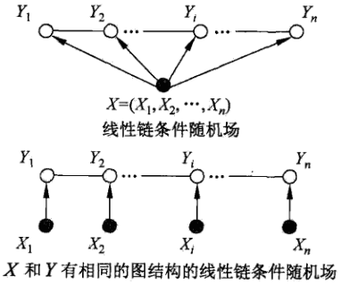
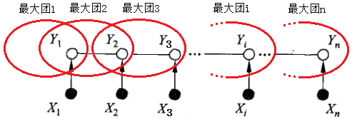
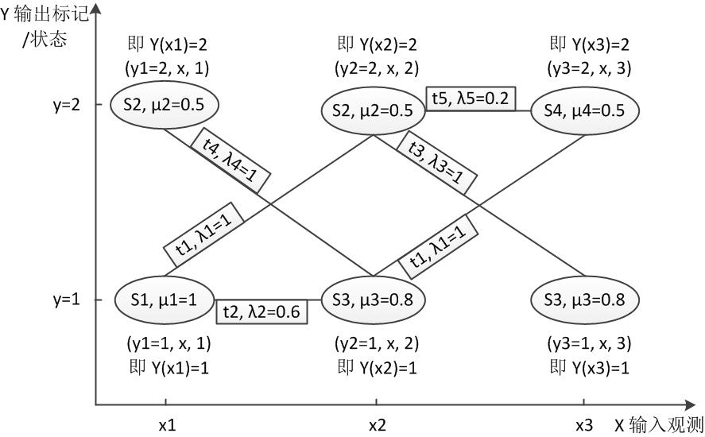
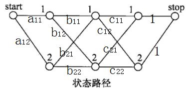

# CRF条件随机场

[返回上层目录](../machine-learning.md)

CRF的经典论文：     

[from  Sutton, Charles, and Andrew McCallum. “An introduction to conditional random fields.” Machine Learning 4.4 (2011): 267-373.](http://homepages.inf.ed.ac.uk/csutton/publications/crftut-fnt.pdf)

# 直观理解CRF条件随机场

理解条件随机场最好的办法就是用一个现实的例子来说明它。

假设你有许多小明同学一天内不同时段的照片，从小明提裤子起床到脱裤子睡觉各个时间段都有（小明是照片控！）。现在的任务是对这些照片进行分类。比如有的照片是吃饭，那就给它打上吃饭的标签；有的照片是跑步时拍的，那就打上跑步的标签；有的照片是开会时拍的，那就打上开会的标签。问题来了，你准备怎么干？

一个简单直观的办法就是，不管这些照片之间的时间顺序，想办法训练出一个多元分类器。就是用一些打好标签的照片作为训练数据，训练出一个模型，直接根据照片的特征来分类。例如，如果照片是早上6:00拍的，且画面是黑暗的，那就给它打上睡觉的标签;如果照片上有车，那就给它打上开车的标签。

这样可行吗？

乍一看可以！但实际上，由于我们忽略了这些照片之间的时间顺序这一重要信息，我们的分类器会有缺陷的。举个例子，假如有一张小明闭着嘴的照片，怎么分类？显然难以直接判断，需要参考闭嘴之前的照片，如果之前的照片显示小明在吃饭，那这个闭嘴的照片很可能是小明在咀嚼食物准备下咽，可以给它打上吃饭的标签；如果之前的照片显示小明在唱歌，那这个闭嘴的照片很可能是小明唱歌瞬间的抓拍，可以给它打上唱歌的标签。

所以，为了让我们的分类器能够有更好的表现，在为一张照片分类时，我们必须将与它相邻的照片的标签信息考虑进来。这——就是条件随机场(CRF)大显身手的地方！

## 从例子说起——词性标注问题

啥是词性标注问题？

非常简单的，就是给一个句子中的每个单词注明词性。比如这句话：“Bob drank coffee at Starbucks”，注明每个单词的词性后是这样的：“Bob (名词)  drank(动词)   coffee(名词)   at(介词)    Starbucks(名词)”。

下面，就用条件随机场来解决这个问题。

以上面的话为例，有5个单词，我们将：**(名词，动词，名词，介词，名词)**作为一个标注序列，称为l，可选的标注序列有很多种，比如l还可以是这样：**（名词，动词，动词，介词，名词）**，我们要在这么多的可选标注序列中，挑选出一个**最靠谱**的作为我们对这句话的标注。

怎么判断一个标注序列靠谱不靠谱呢？

就我们上面展示的两个标注序列来说，第二个显然不如第一个靠谱，因为它把第二、第三个单词都标注成了动词，动词后面接动词，这在一个句子中通常是说不通的。

假如我们给每一个标注序列打分，打分越高代表这个标注序列越靠谱，我们至少可以说，凡是标注中出现了**动词后面还是动词**的标注序列，要给它**负分！！**

上面所说的**动词后面还是动词**就是一个特征函数，我们可以定义一个特征函数集合，用这个特征函数集合来为一个标注序列打分，并据此选出最靠谱的标注序列。也就是说，**每一个特征函数都可以用来为一个标注序列评分，把集合中所有特征函数对同一个标注序列的评分综合起来，就是这个标注序列最终的评分值**。

## 定义CRF中的特征函数

现在，我们正式地定义一下什么是CRF中的特征函数，所谓特征函数，就是这样的函数，它接受四个参数：

- 句子s（就是我们要标注词性的句子）
- i，用来表示句子s中第i个单词
- l_i，表示要评分的标注序列给第i个单词标注的词性
- l_(i-1)，表示要评分的标注序列给第i-1个单词标注的词性

它的输出值是0或者1，0表示要评分的标注序列不符合这个特征，1表示要评分的标注序列符合这个特征。

注意：这里，我们的特征函数仅仅依靠当前单词的标签和它前面的单词的标签对标注序列进行评判，这样建立的CRF也叫作**线性链CRF**，这是CRF中的一种简单情况。为简单起见，本文中我们仅考虑线性链CRF。

## 从特征函数到概率

定义好一组特征函数后，我们要给每个特征函数fj赋予一个权重λj。现在，只要有一个句子s，有一个标注序列l，我们就可以利用前面定义的特征函数集来对l评分。
$$
\text{score}(l|s)=\sum_{j=1}^m\sum_{i=1}^n\lambda_jf_j(s,i,l_i,l_{i-1})
$$
上式中有两个求和，外面的求和用来求每一个特征函数fj评分值的和，里面的求和用来求句子中每个位置的单词的的特征值的和。

对这个分数进行**指数化和标准化**，我们就可以得到标注序列l的概率值**p(l|s)**，如下所示：
$$
\begin{aligned}
p(l|s)&=\frac{\text{exp}[\text{score}(l|s)]}{\sum_{l'}\text{exp}[\text{score}(l'|s)]}\\
&=\frac{\text{exp}[\sum_{j=1}^m\sum_{i=1}^n\lambda_jf_j(s,i,l_i,l_{i-1})]}{\sum_{l'}\text{exp}[\sum_{j=1}^m\sum_{i=1}^n\lambda_jf_j(s,i,l'_i,l'_{i-1})]}\\
\end{aligned}
$$
有没有似曾相识的感觉？这个过程像不像逻辑回归？

## 几个特征函数的例子

前面我们已经举过特征函数的例子，下面我们再看几个具体的例子，帮助增强大家的感性认识。
$$
f_1(s,i,l_i,l_{i-1})=1
$$
当l_i是“副词”并且第i个单词以“ly”结尾时，我们就让f1 = 1，其他情况f1为0。不难想到，f1特征函数的权重λ1应当是正的。而且λ1越大，表示我们越倾向于采用那些把以“ly”结尾的单词标注为“副词”的标注序列。
$$
f_2(s,i,l_i,l_{i-1})=1
$$
如果i=1，l_i是动词，并且距离s是以"？"结尾时，f2=1，其他情况f2=0。同样，λ2应当是正的，并且λ2越大，表示我们越倾向于采用那些把问句的第一个单词标注为“动词”的标注序列。
$$
f_3(s,i,l_i,l_{i-1})=1
$$
当l_(i-1)是介词，l_i是名词时，f3=1，其他情况f3=0。λ3也应当是正的，并且λ3越大，说明我们越认为介词后面应当跟一个名词。
$$
f_4(s,i,l_i,l_{i-1})=1
$$
如果I_i和l_(i-1)都是介词，那么f4=1，其他情况f4=0。这里，我们应当可以想到λ4是负的，并且λ4的绝对值越大，表示我们越不认可介词后面还是介词的标注序列。

好了，一个条件随机场就这样建立起来了，让我们总结一下：

**为了建一个条件随机场，我们首先要定义一个特征函数集，每个特征函数都以整个句子s，当前位置i，位置i和i-1的标签为输入。然后为每一个特征函数赋予一个权重，然后针对每一个标注序列l，对所有的特征函数加权求和，必要的话，可以把求和的值转化为一个概率值**。

## CRF与逻辑回归的比较

观察公式：
$$
\begin{aligned}
p(l|s)&=\frac{\text{exp}[\text{score}(l|s)]}{\sum_{l'}\text{exp}[\text{score}(l'|s)]}\\
&=\frac{\text{exp}[\sum_{j=1}^m\sum_{i=1}^n\lambda_jf_j(s,i,l_i,l_{i-1})]}{\sum_{l'}\text{exp}[\sum_{j=1}^m\sum_{i=1}^n\lambda_jf_j(s,i,l'_i,l'_{i-1})]}\\
\end{aligned}
$$
是不是有点逻辑回归的味道？

事实上，**条件随机场是逻辑回归的序列化版本**。逻辑回归是用于分类的对数线性模型，**条件随机场是用于序列化标注的对数线性模型**。

## CRF与HMM的比较

对于词性标注问题，HMM模型也可以解决。HMM的思路是用生成办法，就是说，在已知要标注的句子s的情况下，去判断生成标注序列l的概率，如下所示：
$$
p(l,s)=p(l_0)\prod_ip(l_i|l_{i-1})p(w_i|l_i)
$$
这里：

p(l_i|l_(i-1))是转移概率，比如，l_i-1是介词，l_i是名词，此时的p表示介词后面的词是名词的概率。

p(w_i|l_i)表示发射概率（emission probability），比如l_i是名词，w_i是单词“ball”，此时的p表示在是名词的状态下，是单词“ball”的概率。

那么，HMM和CRF怎么比较呢？

答案是：CRF比HMM要强大的多，它可以解决所有HMM能够解决的问题，并且还可以解决许多HMM解决不了的问题。事实上，我们可以对上面的HMM模型取对数，就变成下面这样：
$$
\text{log }p(l,s)=\text{log }p(l_0)+\sum_i\text{log }p(l_i|l_{i-1})+\sum_i\text{log }p(w_i|l_i)
$$
我们把这个式子与CRF的式子进行比较：
$$
\text{score}(l|s)=\sum_{j=1}^m\sum_{i=1}^n\lambda_jf_j(s,i,l_i,l_{i-1})
$$
不难发现，如果我们把HMM式子（上上式）中的log形式的概率看成是CRF式子（上式）中的特征函数的权值的话，我们会发现，CRF和HMM具有相同的形式。

换句话说，我们可以构造一个CRF，使它与HMM的对数形式相同。怎么构造呢？

对于HMM中的每一个转移概率p(l_i=y|l_(i-1)=x)，我们可以定义这样的一个特征函数：
$$
f_{x,y}(s,i,l_i,l_{i-1})=1
$$
该特征函数仅当l_i = y,l_(i-1)=x时才等于1。这个特征函数的权重如下：
$$
w_{x,y}=\text{log }p(l_i=y|l_{i-1}=x)
$$
同样的，对于HMM中的每一个发射概率，我们也都可以定义相应的特征函数，并让该特征函数的权重等于HMM中的log形式的发射概率。

用这些形式的特征函数和相应的权值计算出来的p(l|s)和对数形式的HMM模型几乎是一样的！

用一句话来说明HMM和CRF的关系就是这样：
**每一个HMM模型都等价于某个CRF**
**每一个HMM模型都等价于某个CRF**
**每一个HMM模型都等价于某个CRF**

但是，CRF要比HMM更加强大，原因主要有两点：

* **CRF可以定义数量更多，种类更丰富的特征函数**。HMM模型具有天然具有局部性，就是说，在HMM模型中，当前的单词只依赖于当前的标签，当前的标签只依赖于前一个标签。这样的局部性限制了HMM只能定义相应类型的特征函数，我们在上面也看到了。但是CRF却可以着眼于整个句子s定义更具有全局性的特征函数，如这个特征函数：

  >$
  >f_2(s,i,l_i,l_{i-1})=1
  >$
  >
  >如果i=1，l_i=动词，并且句子s是以“？”结尾时，f2=1，其他情况f2=0。

* **CRF可以使用任意的权重** 将对数HMM模型看做CRF时，特征函数的权重由于是log形式的概率，所以都是小于等于0的，而且概率还要满足相应的限制，如
  $
  0\leqslant p(w_i|l_i)\leqslant 1,\quad \sum_wp(w_i=w|l_1)=1
  $
  但在CRF中，每个特征函数的权重可以是任意值，没有这些限制。

# 条件随机场的定义与形式

## 条件随机场的定义

条件随机场是给定随机变量X条件下，随机变量Y的马尔科夫随机场。这里主要介绍定义在线性链上的特殊的条件随机场，称为线性链条件随机场。线性链条件随机场可以用于标注等问题。这时，在条件概率模型P(Y|X)中，Y是输出变量，表示标记序列，X是输入变狼，表示需要标注的观测序列。也把标记序列称为状态序列（参见隐马尔科夫模型）。学习时，利用训练数据集通过极大似然估计或正则化的极大似然估计得到条件概率模型hat(P)(Y|X)；预测时，对于给定的输入序列x，求出条件概率hat(x)(y|x)最大的输出序列hat(y)。

首先定义一般的条件随机场，然后定义线性链条件随机场。

**条件随机场定义：**设X与Y是随机变量，P(Y|X)是在给定X的条件下Y的条件概率分布。若随机变量Y构成一个由无向图G=(V, E)表示的马尔科夫随机场，即
$$
P(Y_v|X,Y_w,w\neq v)=P(Y_v|X,Y_w,w\sim v)
$$
对任意结点v成立，则称条件概率分布P(Y|X)为**条件随机场**。上式中，w~v表示在图G=(V, E)中与结点v有边连接的所有结点w，而w≠v表示结点v以外的所有结点，Yv与Yw为结点v, u与w对应的随机变量。也就是说，上式表明**一个结点仅与它直接相连的结点相关**。

在定义中，并没有要求X和Y具有相同的结构。现实中，一般假设X和Y有相同的结构。本书主要考虑无向图为如下两图所示的线性链的情况，即
$$
G=(V=\{ 1,2,...,n \},\ E=\{ (i,\ i+1) \}),\quad i=1,2,...,n-1
$$
在此情况下，X=(X1, X2, ... ,Xn)，Y=(Y1, Y2, ... , Yn)，最大团是相邻两个结点的集合。

线性链条件随机场有下面的定义：

**线性链条件随机场定义：**设X=(X1, X2, ... ,Xn)，Y=(Y1, Y2, ... , Yn)均为线性链表示的随机变量序列，若在给定随机变量序列X的条件下，随机变量序列Y的条件概率分布P(Y|X)构成条件随机场，即满足马尔科夫性。
$$
\begin{aligned}
P(Y_i|X,Y_1,...,Y_{i-1},Y_{i+1},...,Y_n)&=P(Y_i|X,Y_{i-1},Y_{i+1})\\
i=1,2,...,n\quad \text{(在}i=1\text{和}n&\text{时只考虑单边)}
\end{aligned}
$$
则称P(Y|X)为线性链条件随机场（只与前后相关）。在标注问题中，X表示输入观测序列，Y表示对应的输出标记序列或状态序列。

---

我们再回顾下马尔可夫随机场(MRF)，即概率无向图模型。

马尔可夫随机场对应一个无向图。这个无向图上的每个节点对应一个随机变量，节点之间的边表示节点对应的随机变量之间有概率依赖关系。因此，MRF的结构其本质反映了我们的先验知识：哪些变量之间有依赖关系需要考虑，哪些可以忽略。

然后我们再看看什么是条件随机场(CRF)。

其实弄懂了MRF之后，CRF就很好理解了，因为如果给定的MRF中每个随机变量下面还有观察值，那么我们的目标就是要确定给定观察集合下的MRF分布，也就是条件分布，而这种条件分布就是条件随机场。

简单的说，条件随机场(CRF)类似于MRF，只不过CRF比MRF多了一个观察集合，或者说，**CRF本质上就是给定了观察值集合的MRF**。

## 条件随机场的参数化形式

根据Hammersley-Clifford定理：
$$
\begin{aligned}
&P(Y)=\frac{1}{Z}\prod_C\Psi_C(Y_C)\\
&Z=\sum_Y\prod_C\Psi_C(Y_C)
\end{aligned}
$$
其中，C是无向图的最大团，Y_C是C的结点对应的随机变量。乘积是在无向图上的所有最大团上进行的。

可以给出线性链条件随机场P(Y|X)的因子分解式，各因子是定义在所有相邻两个结点（最大团C）上的函数。

**条件随机场的参数化形式：**设P(Y|X)为线性链条件随机场，则在随机变量X取值为x的条件下，随机变量Y取值为y的条件概率具有如下形式：
$$
P(y|x)=\frac{1}{Z(x)}\text{exp}\left( \sum_{i,k}\lambda_kt_k(y_{i-1},y_i,x,i)+\sum_{i,l}\mu_ls_l(y_i,x,i) \right)
$$
其中，
$$
Z(x)=\sum_y\text{exp}\left( \sum_{i,k}\lambda_kt_k(y_{i-1},y_i,x,i)+\sum_{i,l}\mu_ls_l(y_i,x,i) \right)
$$
式中，t\_k和s\_l是特征函数，λ\_k和μ\_l是对应的权值。Z(x)是规范化因子，求和是在所有可能的输出序列上进行的。

上面两式是线性链条件概率的基本形式，表示给定输入序列x，对输出序列y预测的条件概率。上两式中，

* t\_k是定义在**边**上的特征函数，称为转移特征，依赖于当前和前一个位置
* s\_t是定义在**结点**上的特征函数，称为状态特征，依赖于当前位置

t\_k和s\_t都依赖于位置，是局部特征函数。通常，特征函数t\_k和s\_t取值为1或0；当满足特征条件时取值为1，否则取值为0。**条件随机场完全由特征函数t\_k，s\_t和对应的权值λ\_k，μ\_l确定**。

**线性链条件随机场也是对数线性模型，本质其实就是逻辑回归的序列化**。

下面看一个简单的例子：

设有一标注问题：输入观测序列为X=(X1, X2, X3)，输出标记序列为Y=(Y1， Y2， Y3)，Y1, Y2, Y3取值于y=\{ 1, 2\}。

假设特征t\_k，s\_t和对应的权值λ\_k，μ\_l如下：
$$
t_1=t_!(y_{i-1}=1,y_i=2,x,i),\quad i=2,3,\quad \lambda_1=1
$$
这里只注明特征取值为1的条件，取值为0的条件省略，即
$$
\begin{aligned}
t_1(y_{i-1},y_i,x,i)=
\left\{\begin{matrix}
&1,&\quad y_{i-1}=1,y_i=2,x,i,(i=2,3)\\ 
&0,&\text{其他}
\end{matrix}\right.
\end{aligned}
$$
下同。
$$
\begin{aligned}
&t_2=t_2(y_1=1,y_2=1,x,2)&\lambda_2=0.6\\
&t_3=t_3(y_2=2,y_3=1,x,3)&\lambda_3=1\\
&t_3=t_3(y_2=2,y_3=1,x,3)&\lambda_3=1\\
&t_4=t_4(y_1=2,y_2=1,x,2)&\lambda_4=1\\
&t_5=t_5(y_2=2,y_3=2,x,3)&\lambda_5=0.2\\
&s_1=s_1(y_1=1,x,1)&\mu_1=1\\
&s_2=s_2(y_i=2,x,i),i=1,2&\mu_2=0.5\\
&s_3=s_3(y_i=1,x,i),i=2,3&\mu_3=0.8\\
&s_4=s_4(y_3=2,x,3)&\mu_4=0.5\\
\end{aligned}
$$
对给定的观测序列x，求标记序列为y=(y1, y2, y3)=(1, 2, 2)的非规范化条件概率（即没有除以规范化因子的条件概率）。

解：由前面的条件随机场的参数化形式的公式，线性链条件随机场模型为
$$
P(y|x)\propto \text{exp}\left[ \sum_{k=1}^5\lambda_k\sum_{i=2}^3t_k(y_{i-1},y_i,x,i)+\sum_{k=1}^4\mu_k\sum_{i=1}^3s_k(y_i,x,i) \right]
$$
对给定的观测序列x，标记序列y=(1,2,2)的非规范化条件概率为
$$
P(y_1=1,y_2=2,y_3=2|x)\propto \text{exp}(3.2)
$$
这个示例来自于《统计学习方法》，作者没有给出这个条件随机场的参数化形式 对应的状态路径图。看着这个参数形式t和s理解其对应的条件随机场，是不太形象的，也不好理解。

所以下面特意画出了此条件随机场的**参数化形式对应的状态路径图**，看着此图会发现，it's so easy~，有木有，详见下图：

上图中给出了对t和s函数的理解，如果仔细看，应该很容易清楚其含义，然后就很容易地画出条件随机场的参数化形式对应的状态路径图。

## 条件随机场的简化形式

条件随机场还可以由简化形式表示。注意到条件随机场的参数化形式的定义公式中统一特征在各个位置都有定义，可以对同一个特征在各个位置求和，将局部特征函数转化为一个全局特征函数，这样就可以将条件随机场写成权值向量和特征向量的内积形式，即条件随机场的简化形式。

为简便起见，首先将转移特征和状态特征及其权值用统一的符号表示。设有K1个转移特征，K2个状态特征，K=K1+K2，记
$$
\begin{aligned}
f_k(y_{i-1},y_i,x,i)=
\left\{\begin{matrix}
&t_k(y_{i-1},y_i,x,i)&\quad k=1,2,...,K_1\\ 
&s_l(y_i,x,i),&\quad k=K_1+l;l=1,2,...,K_2\\
\end{matrix}\right.
\end{aligned}
$$
然后，对转移与状态特征在各个位置i求和，记作
$$
f_k(y,x)=\sum_{i=1}^nf_k(y_{i-1},y_i,x,i),\quad k=1,2,...,K
$$
用w_k表示特征f_k(y, x)的权值，即
$$
\begin{aligned}
w_k=
\left\{\begin{matrix}
&\lambda_k&\quad k=1,2,...,K_1\\ 
&\mu_l,&\quad k=K_1+l;\ l=1,2,...,K_2\\
\end{matrix}\right.
\end{aligned}
$$
于是，条件随机场可以表示为
$$
\begin{aligned}
P(y|x)=\frac{1}{Z(x)}\text{exp}\sum_{k=1}^Kw_kf_k(y,x)\\
Z(x)=\sum_y\text{exp}\sum_{k=1}^Kw_kf_k(y,x)
\end{aligned}
$$
若以w表示权值向量，即
$$
w=(w_1,w_2,...,w_K)^T
$$
以F(y, x)表示全局特征向量，即
$$
F(y,x)=(f_1(y,x),f_2(y,x),...,f_K(y, x))^T
$$
则条件随机场可以写成向量w与F(y, x)的内积的形式：
$$
P_w(y|x)=\frac{\text{exp}(w\cdot F(y,x))}{Z_w(x)}
$$
其中，
$$
Z_w(x)=\sum_y\text{exp}(w\cdot F(y,x))
$$

## 条件随机场的矩阵形式

条件随机场还可由矩阵表示，假设Pw(y|x)是由上面的简化形式的公式给出的线性链条件随机场，表示对给定观测序列x，相应的标记序列y的条件概率。引进特殊的起点和终点标记y\_0=start, y\_(n+1)=stop，这时Pw(y|x)可以通过矩阵形式表示。

对观测序列x的每一个位置i=1, 2, ... , n+1，定义一个m阶矩阵（m是标记yi取值的个数）
$$
\begin{aligned}
M_i(x)&=[M_i(y_{i-1}, y_i|x)]\\
M_i(y_{i-1},y_i|x)&=\text{exp}(W_i(y_{i-1},y_i|x))\\
W_i(y_{i-1},y_i|x)&=\sum_{k=1}^Kw_kf_k(y_{i-1},y_i,x,i)\\
\end{aligned}
$$

这样，给定观测序列x，相应标记序列y的非规范化概率可以通过该序列n+1个矩阵适当元素的乘积
$$
\prod_{i=1}^{n+1}M_i(y_{i-1},y_i|x)
$$
表示。于是，条件概率Pw(y|x)是
$$
P_w(y|x)=\frac{1}{Z_w(x)}\prod_{i=1}^{n+1}M_i(y_{i-1},y_i|x)
$$
其中，Zw(x)为规范化因子，是n+1个矩阵的乘积的**(start, stop)**元素：
$$
Z(x)=\left( M_1(x),M_2(x),...,M_{n+1}(x) \right)_{\text{start, stop}}
$$
注意：start和stop分别表示开始状态和终止状态为第几个状态，是数字，所以才能用(start, stop)来表示矩阵的不坐标。y0=start和y_(n+1)=stop表示开始状态与终止状态；规范化因子Zw(x)是以start为起点，stop为终点通过状态的所有路径y1y2...yn的非规范化概率
$$
\prod_{i=1}^{n+1}M_i(y_{i-1},y_i|x)
$$
之和。下面的例子说明了这一事实。

**这里补充下如何理解矩阵形式：**
$$
\begin{aligned}
&\prod_{i=1}^{n+1}M_i(y_{i-1},y_i|x)\\
=&\prod_{i=1}^{n}M_i(y_{i-1},y_i|x)\cdot 1\\
=&\prod_{i=1}^{n}\text{exp}(W_i(y_{i-1},y_i|x))\\
=&\text{exp}\sum_{i=1}^n(W_i(y_{i-1},y_i|x))\\
=&\text{exp}\sum_{i=1}^n\left( \sum_{k=1}^Kw_kf_k(y_{i-1},y_i,x,i) \right)\\
=&\text{exp}\sum_{k=1}^Kw_k\left( \sum_{i=1}^nf_k(y_{i-1},y_i,x,i) \right)\\
=&\text{exp}\sum_{k=1}^Kw_kf_k(y,x)\\
\end{aligned}
$$
**所以，条件随机场的矩阵形式和其简化形式是完全一样的**。

**例子：**给定一个有下图所示的线性链条件随机场，观测序列x，状态序列y，i=1,2,3，n=3，标记yi∈\{ 1,2 \}，假设**y0=start=1**，**y4=stop=1**，各个位置的随机矩阵M1(x), M2(x), M3(x), M4(x)分别是
$$
\begin{aligned}
&M_1(x)=\begin{bmatrix}
a_{11} & a_{12}\\ 
0 & 0
\end{bmatrix},\quad
M_2(x)=\begin{bmatrix}
b_{11} & b_{12}\\ 
b_{21} & b_{22}
\end{bmatrix}\\
&M_3(x)=\begin{bmatrix}
c_{11} & c_{12}\\ 
c_{21} & c_{22}
\end{bmatrix},\quad\ 
M_4(x)=\begin{bmatrix}
1 & 0\\ 
1 & 0
\end{bmatrix}
\end{aligned}
$$
试求状态序列y以start为起点stop为终点的所有路径的非规范化概率和规范化概率因子。

解：首先计算上图中从start到stop对应于y=(1,1,1), y=(1,1,2), ... , y=(2,2,2)各路径的费规范化概率分别是
$$
\begin{aligned}
a_{11}b_{11}c_{11},\quad a_{11}b_{11}c_{12},\quad a_{11}b_{12}c_{21},\quad a_{11}b_{12}c_{22},\quad \\
a_{12}b_{21}c_{11},\quad a_{12}b_{21}c_{12},\quad a_{12}b_{22}c_{21},\quad a_{12}b_{22}c_{22},\quad 
\end{aligned}
$$
然后按上面的求Zw(x)规范化因子的公式来求规范化因子。通过计算矩阵乘积M1(x)M2(x)M3(x)M4(x)可知，其第1(start=1)行第1(stop=1)列的元素为
$$
\begin{aligned}
&a_{11}b_{11}c_{11}+a_{11}b_{11}c_{12}+a_{11}b_{12}c_{21}+a_{11}b_{12}c_{22}\\
+&a_{12}b_{21}c_{11}+a_{12}b_{21}c_{12}+a_{12}b_{22}c_{21}+a_{12}b_{22}c_{22}
\end{aligned}
$$
恰好等于从start到stop的所有路径的非规范化概率之和，即规范化因子Z(x)。

# 条件随机场的概率计算问题

条件随机场的概率计算问题是给定条件随机场P(Y|X)，输入序列x和输出序列y，计算条件概率
$$
P(Y_i=y_i|x), P(Y_{i-1}=y_{i-1},Y_i=y_i|x)
$$
以及相应的数学期望的问题。为了方便起见，像隐马尔科夫模型那样，引进前向-后向向量，递归地计算以上概率及期望值。这样的算法称为前向-后向算法。

## 前向-后向算法

对每个指标i=0, 1, ... , n+1，定义**前向向量**αi(x)：
$$
\begin{aligned}
\alpha_0(y|x)=
\left\{\begin{matrix}
&1,&\quad y=\text{start}\\ 
&0,&\quad \text{否则}
\end{matrix}\right.
\end{aligned}
$$
递推公式为
$$
\alpha_i^T(y_i|x)=\alpha_{i-1}^T(y_{i-1}|x)[M_i(y_{i-1},y_i|x)],\quad i=1,2,...,n+1
$$
又可以表示为
$$
\alpha_i^T(x)=\alpha_{i-1}^T(x)M_i(x)
$$
αi(yi|x)表示在位置i的标记是yi，并且到位置i的前部分标记序列的非规范化概率。yi的取值可以有m个，所以αi(x)是m维向量。

同样，对每个指标i=0, 1, ... , n+1，定义**后向向量**βi(x)：
$$
\begin{aligned}
\beta_{n+1}(y_{n+1}|x)=
\left\{\begin{matrix}
&1,&\quad y_{n+1}=\text{stop}\\ 
&0,&\quad \text{否则}
\end{matrix}\right.
\end{aligned}
$$

$$
\beta_i(y_i|x)=[M_i(y_i,y_{i+1}|x)]\beta_{i+1}(y_{i+1}|x)
$$

又可以表示为
$$
\beta_i(x)=M_{i+1}(x)\beta_{i+1}(x)
$$
βi(yi|x)表示在位置i的标记是yi，并且从i+1到n的后部分标记序列的非规范化概率。

由前向-后向向量不难得到：
$$
Z(x)=\alpha_n^T(x)\cdot 1= 1^T\cdot \beta_i(x)
$$
这里，**1**是元素均为1的m维列向量。

## 概率计算

按照前向-后向向量的定义，很容易计算

标记序列在位置i是标记yi的条件概率：
$$
P(Y_i=y_i|x)=\frac{\alpha_i^T(y_i|x)\beta_i(y_i|x)}{Z(x)}
$$
在位置i-1与i是标记y(i-1)和yi的条件概率：
$$
P(Y_{i-1}=y_{i-1},Y_i=y_i|x)=\frac{\alpha_{i-1}^T(y_{i-1}|x)M_i(y_{i-1},y_i|x)\beta_i(y_i|x)}{Z(x)}
$$
其中，
$$
Z(x)=\alpha_n^T(x)\cdot 1
$$

## 期望值的计算

利用前向-后向向量，可以计算特征函数关于联合分布P(X,Y)和条件分布P(Y|X)的数学期望。

特征函数fk关于**条件分布P(Y|X)**的数学期望是
$$
\begin{aligned}
E_{P(Y|X)}[f_k]&=\sum_{y}P(y|x)f_k(y,x)\\
&=\sum_y\left( P(y|x)\sum_{i=1}^{n+1}f_k(y_{i-1},y_i,x,i) \right)\\
&=\sum_y\left( \sum_{i=1}^{n+1}f_k(y_{i-1},y_i,x,i)P(y|x) \right)\\
&=\sum_{i=1}^{n+1}\left( \sum_yf_k(y_{i-1},y_i,x,i)P(y|x) \right)\\
&=\sum_{i=1}^{n+1}\left( \sum_{y_{i-1}y_i}f_k(y_{i-1},y_i,x,i)P(Y_{i-1}=y_{i-1},Y_i=y_i|x) \right)\\
&=\sum_{i=1}^{n+1}\left( \sum_{y_{i-1}y_i}f_k(y_{i-1},y_i,x,i)\frac{\alpha_{i-1}^T(y_{i-1}|x)M_i(y_{i-1},y_i|x)\beta_i(y_i|x)}{Z(x)} \right)\\
&k=1,2,...,K
\end{aligned}
$$
其中，
$$
Z(x)=\alpha_n^T(x)\cdot 1
$$
假设经验分布为
$$
\tilde{P}(x)
$$
，特征函数fk关于**联合分布P(X,Y)**的数学期望是
$$
\begin{aligned}
E_{P(X,Y)}[f_k]&=\sum_{x,y}P(x,y)f_k(y,x)\\
&=\sum_{x}\tilde{P}(x)\left(\sum_yP(y|x)f_k(y,x)\right)\\
&=\sum_{x}\tilde{P}(x)E_{P(Y|X)}[f_k]\\
&=\sum_{x}\tilde{P}(x)\sum_{i=1}^{n+1}\left( \sum_{y_{i-1}y_i}f_k(y_{i-1},y_i,x,i)\frac{\alpha_{i-1}^T(y_{i-1}|x)M_i(y_{i-1},y_i|x)\beta_i(y_i|x)}{Z(x)} \right)\\
&k=1,2,...,K
\end{aligned}
$$
其中，
$$
Z(x)=\alpha_n^T(x)\cdot 1
$$
上两式是特征函数数学期望的一般计算公式。

* 对于转移特征
  $
  t_k(y_{i-1},y_i,x,i), \quad k=1,2,...,K_1
  $
  ，可以将上两式中的fk换成tk

* 对于状态特征，可以将上两式中的fk换成sl，表示为

* $
  s_l(y_i,x,i),\quad k=K_1+l,\quad l=1,2,...,K_2
  $

有了上面概率和期望值的计算公式，对于给定的观测序列x与标记序列y，可以通过一次前向扫描计算αi及Z(x)，通过一次后向扫描计算βi，从而计算所有的概率和特征的期望。

# 条件随机场的学习算法

本节讨论给定训练数据集**估计**条件随机场**模型参数**的问题，即随机条件场的学习问题。**条件随机场模型实际是定义在时序数据上的对数线性模型，即序列化的逻辑回归**，其学习方法包括极大似然估计和正则化的极大似然估计。具体的优化实现算法有改进的迭代尺度算法IIS、梯度下降法以及拟牛顿法。

## 改进的迭代尺度法

改进的迭代尺度法（Improved Iterative Scaling），在很多模型求解中用到，比如最大熵、CRFs等，对模型是对数线性模型的似然都适用。这个算法的思想也很简单，通俗的理解就是通过两个不等式变形优化下界，从而迭代到收敛的算法。

已知训练数据集，由此可知经验概率分布
$$
\tilde{P}(X,Y)
$$
。可以通过极大化训练数据的对数似然函数来求解模型参数。

训练数据的对数似然函数为
$$
\begin{aligned}
L(w)&=L_{\tilde{P}}(P_w)\\
&=\text{log}\prod_{x,y}P_w(y|x)^{\tilde{P}(x,y)}\\
&=\sum_{x,y}\tilde{P}(x,y)\text{log}P_w(y|x)\\
\end{aligned}
$$
当Pw是一个由下式
$$
\begin{aligned}
P(y|x)=\frac{1}{Z(x)}\text{exp}\sum_{k=1}^Kw_kf_k(y,x)\\
Z(x)=\sum_y\text{exp}\sum_{k=1}^Kw_kf_k(y,x)
\end{aligned}
$$
给出的条件随机场时，对数似然函数为
$$
\begin{aligned}
L(w)&=\sum_{x,y}\tilde{P}(x,y)\text{log}P_w(y|x)\\
&=\sum_{x,y}\left[ \tilde{P}(x,y)\sum_{k=1}^Kw_kf_k(y,x)-\tilde{P}(x,y)\text{log}Z_w(x) \right]\\
&=\sum_{j=1}^N\sum_{k=1}^Kw_kf_k(y_j,x_i)-\sum_{j=1}^N\text{log}Z_w(x_j)
\end{aligned}
$$
改进的迭代尺度法通过迭代的方法不断优化对数似然函数该变量的下界，达到极大化对数似然函数的目的。假设模型的当前参数向量为w=(w1, w2, ... , wK)^T，向量的增量为δ=(δ1, δ2, ... , δK)^T，更新参数向量为w+δ=(w1+δ, w2+δ, ... , wn+δ)^T。在每步迭代过程中，改进的迭代尺度法通过依次求解下两式，得到δ=(δ1, δ2, ... , δK)^T。推导可参考《线性模型》一章中的《最大熵模型》的“最大熵模型学习算法：IIS”一小节。

关于**转移特征**tk的更新方程为
$$
\begin{aligned}
E_{\tilde{P}}[t_k]&=\sum_{x,y}\tilde{P}(x,y)\sum_{i=1}^{n+1}t_k(y_{i-1},y_i,x,i)\\
&=\sum_{x,y}\tilde{P}(x)P(y|x)\sum_{i=1}^{n+1}t_k(y_{i+1},y_i,x,i)\text{exp}(\delta_kT(x,y))\\
k&=1,2,...,K_1
\end{aligned}
$$
关于**状态特征**sl的更新方程为
$$
\begin{aligned}
E_{\tilde{P}}[t_k]&=\sum_{x,y}\tilde{P}(x,y)\sum_{i=1}^{n+1}t_k(y_{i-1},y_i,x,i)\\
&=\sum_{x,y}\tilde{P}(x)P(y|x)\sum_{i=1}^{n+1}t_k(y_{i+1},y_i,x,i)\text{exp}(\delta_kT(x,y))\\
k&=1,2,...,K_1
\end{aligned}
$$
这里，T(x,y)是在数据(x,y)中出现所有特征的和数（因为特征fk是二值函数，所以T(x,y)表示所有特征在(x,y)出现的次数）：
$$
T(x,y)=\sum_kf_k(y,x)=\sum_{k=1}^K\sum_{i=1}^{n+1}f_k(y_{i-1},y_i,x,i)
$$
**条件随机场模型学习的改进的迭代尺度法**

输入：

* 特征函数
  $
  t_1, t_2, ... , t_{K1}, s_1, s_2 , ... , s_{K_2}
  $

* 经验分布
  $
  \tilde{P}(x,y)
  $

输出：

* 参数估计值
  $
  \hat{w}
  $

* 模型
  $
  P_{\hat{w}}
  $

（1）对所有k∈\{ 1,2,...,K \}，取初值wk=0

（2）对每一k∈\{ 1,2,...,K \}：

（a）当k=1,2,...,K1时，令δk是方程
$$
\sum_{x,y}\tilde{P}(x)P(y|x)\sum_{i=1}^{n+1}t_k(y_{i-1},y_i,x,i)\text{exp}(\delta_kT(x,y))=E_{\tilde{P}}[t_k]
$$
的解；

当k=K1+l. l=1,2,...,K2时，令δ(k1+l)是方程
$$
\sum_{x,y}\tilde{P}(x)P(y|x)\sum_{i=1}^{n+1}s_l(y_{i-1},y_i,x,i)\text{exp}(\delta_{K_1+l}T(x,y))=E_{\tilde{P}}[s_l]
$$
的解，式中T(x,y)上面已经给出。

（b）更新wk值：
$$
w_k\leftarrow w_k+\delta_k
$$
（3）如果不是所有wk都收敛，重复步骤（2）。

在上面还有T(x,y)的转移特征和状态特征的更新方程中，T(x, y)表示数据(x, y)中的特征总数，对不同的数据(x, y)取值可能不同，。为了处理这个问题，定义松弛特征
$$
s(x,y)=S-\sum_{i=1}^{n+1}\sum_{k=1}^Kf_k(y_{i-1},y_i,x,i)
$$
式中，S是一个常数。选择足够大的常数S使得对训练数据集的所有数据(x, y)，s(x,y)≥0成立。这时特征总数可取S。

由上面的转移特征tk的更新方程，对于转移特征tk，δk的更新方程是
$$
\sum_{x,y}\tilde{P}(x)P(y|x)\sum_{i=1}^{n+1}t_k(y_{i-1},y_i,x,i)\text{exp}(\delta_kS)=E_{\tilde{P}}[t_k]
$$
则
$$
\delta_k=\frac{1}{S}\text{log}\frac{E_{\tilde{P}}[t_k]}{E_P[t_k]}
$$
其中，
$$
\begin{aligned}
E_p(t_k)&=\sum_{x,y}\tilde{P}(x)P(y|x)\sum_{i=1}^{n+1}t_k(y_{i-1},y_i,x,i)\\
&=\sum_{x}\tilde{P}(x)\sum_{i=1}^{n+1}\sum_{y_{i-1},y_i}t_k(y_{i-1},y_i,x,i)\frac{\alpha_{i-1}^T(y_{i-1}|x)M_i(y_{i-1},y_i|x)\beta_i(y_i|x)}{Z(x)} \\
\end{aligned}
$$
同样由上面的状态特征sl的更新方程，对于状态特征sl，δk的更新方程是
$$
\sum_{x,y}\tilde{P}(x)P(y|x)\sum_{i=1}^{n+1}s_l(y_i,x,i)\text{exp}(\delta_{K_1+l}S)=E_{\tilde{P}}[s_l]
$$
则
$$
\delta_{K_1+l}=\frac{1}{S}\text{log}\frac{E_{\tilde{P}}[s_l]}{E_P[s_l]}
$$
其中，
$$
\begin{aligned}
E_p(s_l)&=\sum_{x,y}\tilde{P}(x)P(y|x)\sum_{i=1}^{n+1}s_l(y_i,x,i)\\
&=\sum_{x}\tilde{P}(x)\sum_{i=1}^{n+1}\sum_{y_i}s_l(y_i,x,i)\frac{\alpha_{i}^T(y_i|x)\beta_i(y_i|x)}{Z(x)} \\
\end{aligned}
$$
以上算法称为算法S。在算法S中需要使常数S取足够大，这样一来，每步迭代的增量向量就会变大（**？？？？？？？不理解，不应该是变小吗？？？**），算法收敛会变。算法T试图解决这个问题。算法T对每个观测序列x计算器特征总数最大值T(x)：
$$
T(x)=\mathop{\text{max}}_yT(x,y)
$$
利用前向-后向递推公式，可以很容易计算T(x)=t。

这时，关于转移特征参数的更新方程可以写成：
$$
\begin{aligned}
E_{\tilde{P}}[t_k]&=\sum_{x,y}\tilde{P}(x)P(y|x)\sum_{i=1}^{n+1}t_k(y_{i-1},y_i,x,i)\text{exp}(\delta_kT(x))\\
&=\sum_x\tilde{P}(x)\sum_yP(y|x)\sum_{i=1}^{n+1}t_k(y_{i-1},y_i,x,i)\text{exp}(\delta_kT(x))\\
&=\sum_x\tilde{P}(x)a_{k,t}\text{exp}(\delta_kT(x))\\
&=\sum_{t=0}^{T_{max}}a_{k,t}(\beta_k)^t\\
\end{aligned}
$$
这里，a(k,t)是特征tk的期待值，δk=log βk。βk是多项式方程（上式）唯一的实根，可以用牛顿法求得。从而求得相关的δk。

**注意：上式的倒数第二行到倒数第一行的推导我没看懂，而且βk是多项式的实根这一点也没看懂。。。**

同样，关于状态特征参数的更新方程可以写成：
$$
\begin{aligned}
E_{\tilde{P}}[s_l]&=\sum_{x,y}\tilde{P}(x)P(y|x)\sum_{i=1}^{n+1}s_l(y_i,x,i)\text{exp}(\delta_{K_1+l}T(x))\\
&=\sum_x\tilde{P}(x)\sum_yP(y|x)\sum_{i=1}^{n+1}s_l(y_i,x,i)\text{exp}(\delta_{K_1+l}T(x))\\
&=\sum_x\tilde{P}(x)b_{l,t}\text{exp}(\delta_k\cdot t)\\
&=\sum_{t=0}^{T_{max}}b_{l,t}(\gamma_l)^t\\
\end{aligned}
$$
这里，b(l,t)是特征sl的期待值，δl=log γl。γl是多项式方程（上式）唯一的实根，也可以用牛顿法求得。从而求得相关的δl。

**注意：上式的倒数第二行到倒数第一行的推导我没看懂，而且γl是多项式的实根这一点也没看懂。。。**

## 拟牛顿法

[条件随机场入门（四） 条件随机场的训练](https://www.cnblogs.com/ooon/p/5826757.html)

# 条件随机场的预测算法

# 和HMM的区别

如何用简单易懂的例子解释条件随机场（CRF）模型？它和HMM有什么区别？

https://blog.csdn.net/QFire/article/details/81065256

# CRF的代码实现CRF++

现在关于CRF的工具有很多，这里简单介绍一下CRF++。[CRF++](http://pan.baidu.com/s/1hsOE0LI)包含Windows、Linux版本，

关于具体的实现，这次发现CRF++与《统计学习方法》的契合度非常之高，所以请直接参考[《CRF++代码分析》](http://www.hankcs.com/ml/crf-code-analysis.html)。

目前Python阵营里并没有简单好懂的实现，反而不如直接切入CRF++的生产代码有效果，还可以顺便学到不少C++的小知识。

其拟牛顿法讲解可以直接与CRF++的代码对应，实为难得。这里有一篇[《CRF++代码分析》](http://www.hankcs.com/ml/crf-code-analysis.html)，与本文互为参考。

# 参考资料

* [如何轻松愉快地理解条件随机场（CRF）？](https://www.jianshu.com/p/55755fc649b1)

“直观理解CRF条件随机场”一节来源于此文。

* [条件随机场(CRF) - 2 - 定义和形式](https://blog.csdn.net/xueyingxue001/article/details/51498968?utm_source=copy)

"条件随机场的定义与"一节最后的部分参考了此博客。

* [条件随机场CRF-3】条件随机场的参数化形式详解 + 画出对应的状态路径图 + 给出对应的矩阵表示](https://blog.csdn.net/u012421852/article/details/80344965?utm_source=copy)

"条件随机场的参数化形式"一节中的状态路径图就是参考此博客画的。

* [线性链条件随机场中的矩阵形式推导](https://blog.csdn.net/qq_22408061/article/details/80524244)

"条件随机场的矩阵形式"小节中对矩阵形式的理解受此博客的启发。

* [条件随机场（CRF）](https://blog.csdn.net/a819825294/article/details/53893231)
* [百度网盘：CRF++工具包使用介绍.ppt](https://pan.baidu.com/s/1bYJSMa)
* [CRF++代码分析](http://www.hankcs.com/ml/crf-code-analysis.html)

"CRF的代码实现CRF++"小节参考上述资料。

===

[如何用简单易懂的例子解释条件随机场（CRF）模型？它和HMM有什么区别？](https://www.zhihu.com/question/35866596/answer/236886066)

[如何直观地理解条件随机场，并通过PyTorch简单地实现](https://mp.weixin.qq.com/s?__biz=MzA3MzI4MjgzMw==&mid=2650742297&idx=3&sn=7c0fa6f3468f3813e309d0bb274be849&chksm=871ada67b06d53711a2f9142b7fa39ab5e060298ce90233f78cee6c4d7ffca3f34fb540b288a&mpshare=1&scene=1&srcid=0515I9LFZDhoQjEUOxM255qV#rd)

条件随机场(CRF) - 1 - 简介（产生式模型和判别式模型）

https://blog.csdn.net/xueyingxue001/article/details/51498902

CRF模型族及其在语音识别中的应用（概率图模型讲得很好，可参考）

http://mi.eng.cam.ac.uk/~cz277/doc/Slides-CRFASR-CSLT.pdf

