# 决策树

* [返回上层目录](../machine-learning.md)
* [决策树直观介绍](#决策树直观介绍)
* [决策树模型与学习](#决策树模型与学习)
  * [决策树模型](#决策树模型)
  * [决策树与if-then规则](#决策树与if-then规则)
  * [决策树与条件概率分布](#决策树与条件概率分布)
  * [决策树学习算法](#决策树学习算法)
* [特征选择](#特征选择)
  * [特征选择问题](#特征选择问题)
  * [信息增益ID3](#信息增益ID3)
  * [信息增益率C4.5](#信息增益率C4.5)
  * [基尼不纯度CART](#基尼不纯度CART)
* [决策树的生成](#决策树的生成)
  * [ID3算法](#ID3算法)
  * [C4.5算法](#C4.5算法)
  * [CART算法](#CART算法)
    * [回归树的生成](#回归树的生成)
    * [分类树的生成](#分类树的生成)
  * [CHAID算法](#CHAID算法)
* [决策树的剪枝](#决策树的剪枝)
  * [预剪枝](#预剪枝)
  * [后剪枝](#后剪枝)
    * [后剪枝过程描述](#后剪枝过程描述)
    * [后剪枝算法](#后剪枝算法)
    * [CART剪枝](#CART剪枝)
* [连续与缺失值](#连续与缺失值)
  * [连续值处理](#连续值处理)
  * [缺失值处理](#缺失值处理)
* [多变量决策树](#多变量决策树)
* [决策树的优缺点](#决策树的优缺点)

这里讨论一种被广泛使用（并且建议优先使用）的分类算法——决策树（decision tree）。相比贝叶斯算法，决策树的优势在于构造过程不需要任何领域知识或参数设置，因此在实际应用中，对于探测式的知识发现，决策树更加适用。

当一条记录有若干不同的方式划分为目标类的一部分时，适合用单条线来发现类别之间边界的统计学方法是无力的。而决策树能够成功地达到这一目标。

决策树可以认为是if-then规则的集合，也可以认为是定义在特征空间与类空间上的条件概率分布。其主要优点是模型具有可读性，分类速度快。

决策树的学习与预测过程：学习时，利用训练数据，根据损失函数最小化的原则建立决策树模型；预测时，对新的数据，利用决策树模型进行分类。

决策树学习通常包括3个步骤：特征选择、决策树的生成、决策树的修剪。

这些决策树学习的思想主要来源于由Quinlan在1986年提出的ID3算法和1993年提出的C4.5算法，以及由Breiman等人在1984年提出的CART算法。

本章先介绍决策树的基本概念，在通过ID3、C4.5和CART介绍特征的选择。决策树的生成以及决策树的修剪。最后介绍连续与缺失值的处理和多变量决策树。

ID3（Iterative Dichotomiser迭代二分法）是C4.5的一个早期版本， 因此在后面说明中不会提及。 ID3不能处理连续值， 没有剪枝， 不能处理缺失（Missing）。但是ID3提出了很好的Information Gain的框架。

C4.5是Quinlan提出的一系列算法的流传最广的一个。前续版本有ID3， 后续还有C5.0， 但是C5.0是商业版本的。  C4.5在ID3的基础上做了很多重大改进， 其中一个就是ID3不能处理连续数值的情况， 而C4.5通过阈值自动把连续变量分成两部分来处理。

# 决策树直观介绍

通俗来说，决策树分类的思想类似于找对象。现想象一个女孩的母亲要给这个女孩介绍男朋友，于是有了下面的对话：

> **女儿**：多大年纪了？
>
> 母亲：26。
>
> **女儿**：长的帅不帅？
>
> 母亲：挺帅的。
>
> **女儿**：收入高不？
>
> 母亲：不算很高，中等情况。
>
> **女儿**：是公务员不？
>
> 母亲：是，在税务局上班呢。
>
> **女儿**：那好，我去见见。

这个女孩的决策过程就是典型的分类树决策。相当于通过年龄、长相、收入和是否公务员对将男人分为两个类别：见和不见。假设这个女孩对男人的要求是：30岁以下、长相中等以上并且是高收入者或中等以上收入的公务员，那么这个可以用下图表示女孩的决策逻辑：

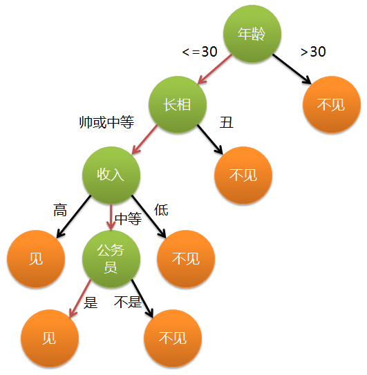

上图完整表达了这个女孩决定是否见一个约会对象的策略，其中绿色节点表示判断条件，橙色节点表示决策结果，箭头表示在一个判断条件在不同情况下的决策路径，图中红色箭头表示了上面例子中女孩的决策过程。

这幅图基本可以算是一颗决策树，说它“基本可以算”是因为图中的判定条件没有量化，如收入高中低等等，还不能算是严格意义上的决策树，如果将所有条件量化，则就变成真正的决策树了。

有了上面直观的认识，我们可以正式定义决策树了：

**决策树（decision tree）是一个树结构（可以是二叉树或非二叉树）。其每个非叶节点表示一个特征属性上的测试，每个分支代表这个特征属性在某个值域上的输出，而每个叶节点存放一个类别。使用决策树进行决策的过程就是从根节点开始，测试待分类项中相应的特征属性，并按照其值选择输出分支，直到到达叶子节点，将叶子节点存放的类别作为决策结果。**

可以看到，决策树的决策过程非常直观，容易被人理解。目前决策树已经成功运用于医学、制造产业、天文学、分支生物学以及商业等诸多领域。知道了决策树的定义以及其应用方法，下面介绍决策树的构造算法。

# 决策树模型与学习

## 决策树模型

**决策树定义：**

分类决策树是一种描述对实例进行分类的树形结构。决策树由结点和有向边组成。结点有两种类型：内部结点和叶节点，**内部结点表示一个特征或属性，叶节点表示一个类**。

用决策树分类，从根节点开始，对实例的某一特征进行测试，根据测试结果，将实例分配到其子结点；这时，每一个子结点对应着该特征的一个取值。如此递归地对实例进行测试并分配，直至达到叶节点。最后将实例分配到叶结点的类中。

下图是一个决策树的示意图。图中圆和方框分别表示内部结点和叶结点。

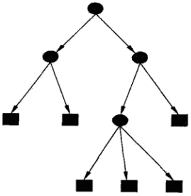

## 决策树与if-then规则

可以将决策树看成一个if-then规则的集合，将决策树转换成if-then规则的过程是这样的：**由决策树的根结点到叶结点的每一条路径构建一条规则**。

路径上的内部结点的规则对应着规则的条件，而叶结点的类对应着规则的结论。决策树的路径或其对应的if-then规则集合具有一个重要的性质：**互斥并且完备**。这就是说，每一条实例都被一条路径或者一条规则所覆盖，而且只被一条路或一条规则所覆盖。

## 决策树与条件概率分布

决策树还表示给定特征下类的条件概率分布。这一条件概率分布定义在特征空间的一个划分上。

将特征空间划分为互不相交的单元或者区域，并在每个单元定义一个类的概率分布，就构成了一个条件概率分布，所以决策树是判别模型而不是生成模型。

决策树的一条路径对应于划分中的一个单元。决策树所表示的条件概率分布由各个单元给定下类的条件概率分布组成。假设$X$为表示特征的随机变量，$Y$为表示类的随机变量，那么这个条件概率分布可以表示为$P(Y|X)$。$X$取值于给定划分单元的集合，$Y$取值于类的集合。

**各叶结点（单元）上的条件概率往往偏向于某一个类**，即属于某一类的条概率较大。决策树分类时将该结点的实例强行分到条件概率大的那一类中。

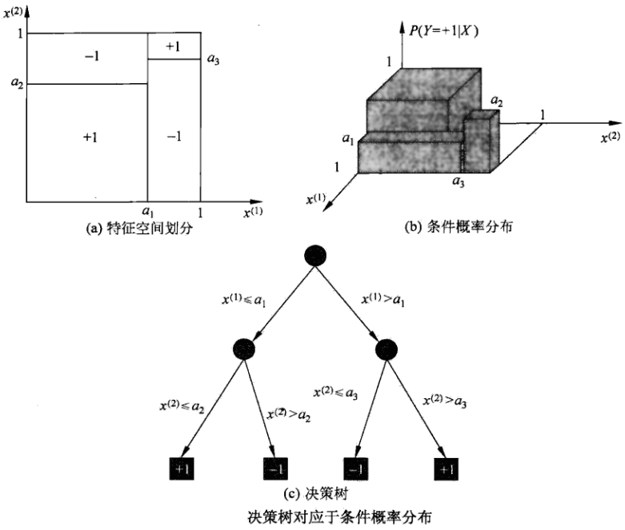

上图（a）示意地表示了特征空间的一个划分。图中的大正方形表示特征空间。这个大正方形被若干个小矩形分割，每个小矩形表示一个单元。特征空间划分上的单元构成了一个集合，$X$取值为单元的集合。为简单起见，假设只有两类：正类和负类，即$Y$取值为$+1$和$-1$。小矩形中的数字表示单元的类，上图（b）示意地表示特征空间划分确定时，特征（单元）给定条件下类的条件概率分布。上图（b）中条件概率分布对应于上图（a）的划分。当某个单元c的条件概率满足$P(Y=+1|X=c)>0.5$时，则认为这个单元属于正类，即落在这个单元的实例都被视为正例。上图（c）为对应于上图（b）中条件概率分布的决策树。

## 决策树学习算法

决策树学习，假设给定训练数据集
$$
D=\{(x_1,y_1),(x_2,y_2),...,(x_N,y_N)\}
$$
其中，$x_i=(x_i^{(1)},x_i^{(2)},...,x_i^{(n)})^T$为输入实例（特征向量），$n$为特征个数，$y_i\in\{1,2,...,K\}$为类标记，$i=1,2,...,N$，$N$为样本容量。学习的目标是根据给定的训练数据集，构建一个决策树模型，使它能够对实例进行正确的分类。

**决策树本质上是从训练数据集中归纳出一组分类规则**。从另一个角度看，决策树学习是由训练数据集估计条件概率模型，所以决策树是判别式模型。

决策树学习的**损失函数通常是正则化的极大似然函数**。决策树学习的策略是以损失函数为目标函数的最小化，正则化是为了产生一颗泛化能力强，即处理未见示例能力强的决策树，其基本的流程遵循简单且直观的“分而治之”策略。

但是，从所有可能的决策树中选择最优决策树是NP完全问题，通常采用启发式方法，近似求解这一最优化问题，这样得到的决策树是次最优的。

决策树学习的算法是一个递归地选择最优特征，并根据该特征对训练数据进行分割，使得对各个子数据集有一个最好的分类的过程，这本质上其实是贪心策略。这一过程对应着特征空间的划分，也对应着决策树的构建。

决策树基本的学习算法如下所示：

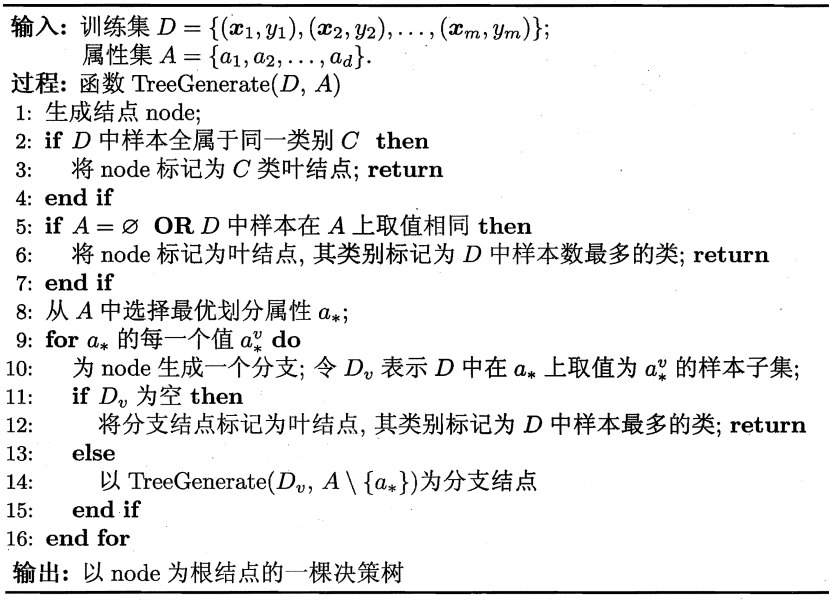

显然，决策树的生成是一个递归过程。在决策树的基本算法中，有三种情况会导致递归返回：

（1）当前结点包含的样本全属于同一类别，无需划分；

（2）当前属性集为空，或是所有样本在所有属性上取值相同，无法划分；

（3）当前结点包含的样本集为空，不能划分。

在第（2）种情况下，我们把当前结点标记为叶结点，但把其类别设定为该结点所含样本最多的类别；

在第（3）种情况下。同样把当前结点标记为叶结点，但将其类别设定为其**父结点**所含样本最多的类别。

注意，这两种情形的处理实质不同：情形（2）是利用当前结点的后验分布，而情形（3）是把父结点的样本分布作为当前结点的先验分布。

# 特征选择

## 特征选择问题

从上面的决策树学习算法可以看出，决策树学习的关键是第8行，即如何选择最优化分属性，随着划分过程不断进行，我们希望决策树的分支结点所包含的样本尽可能属于同一类别，即结点的“纯度”越来越高，这样可以提高决策树学习的效率。

## 信息增益ID3

特征$A$对训练数据集$D$的信息增益$g(D, A)$，定义为集合$D$的经验熵$H(D)$与特征$A$给定条件下$D$的条件经验熵$H(D|A)$之差，即
$$
g(D,A)=H(D)-H(D|A)
$$
熵$H(Y)$与条件熵$H(Y|X)$之差称为互信息。决策树学习中的信息增益等价于训练数据集中类与特征的互信息。

**信息增益表示得知特征$X$的信息而使类$Y$的信息的不确定性减少的程度**。一般而言，信息增益越大，意味着使用属性$a$来进行划分所获得的“纯度提升”越大，因此，我们可用信息增益来进行决策树的划分属性的选择。选择信息增益最大的属性，即在上图的决策树学习算法的第8行选择属性$a^*$
$$
a_*=\text{arg}\ \mathop{\text{max}}_{a\in A}\ \text{Gain}(D,a)
$$
著名的ID3算法就是以信息增益为准则来选择划分属性。

---

下面介绍计算信息增益的具体算法：

根据信息增益准则的特征选择方法是：训练数据集（或子集）$D$，计算其每个特征的信息增益，并比较它们的大小，选择信息增益最大的特征。

设训练数据集为$D$，$|D|$表示其样本容量，即样本个数。设有$K$个类$C_k$，$k=1, 2, ... ,K$，$|C_k|$为属于类$C_k$的样本个数，$\sum_{k=1}^K|C_k|=|D|$。

设特征$A$有$n$个不同的取值$\{a_1, a_2, ... , a_n\}$，根据特征$A$的取值将$D$划分为$n$个子集$D_1, D_2, ... , D_n$，$|D_i|$为$D_i$的样本个数，$\sum_{i=1}^n|D_i|=|D|$。

记子集$D_i$中属于类$C_k$的样本的集合为$D_{ik}$，即$D_{ik}=D_i\cap C_k$，$|D_{ik}|$为$D_{ik}$的样本个数，于是信息增益的算法如下：

**信息增益的算法：**

输入：训练数据集$D$和特征$A$；

输出：特征$A$对训练集$D$的信息增益$g(D,A)$。

（1）计算数据集$D$的经验熵$H(D)$
$$
H(D)=-\sum_{k=1}^K\frac{|C_k|}{|D|}\text{log}_2\frac{|C_k|}{|D|}
$$
（2）计算特征$A$对数据集$D$的经验条件熵$H(D|A)$
$$
H(D|A)=\sum_{i=1}^n\frac{|D_i|}{|D|}H(D_i)=-\sum_{i=1}^n\frac{|D_i|}{|D|}\sum_{k=1}^K\frac{|D_{ik}|}{|D_i|}log_2\frac{|D_{ik}|}{|D_i|}
$$
（3）计算信息增益
$$
g(D,A)=H(D)-H(D|A)
$$

## 信息增益率C4.5

以信息增益率作为划分训练数据集的特征，存在可能偏向于选择取值较多的特征的问题。使用信息增益率，可以对这一问题进行校正。这也是特征选择的另一准则，目的是防止过拟合。

**信息增益率的定义**

特征$A$对训练数据$D$的信息增益率$g_R(D,A)$定义为其信息增益$g(D,A)$与其训练数据集$D$关于特征$A$的值的熵$H_A(D)$之比，即
$$
g_R(D,A)=\frac{g(D,A)}{H_A(D)}
$$
其中，$H_A(D)=-\sum_{i=1}^n\frac{|D_i|}{|D|}\text{log}_2\frac{|D_i|}{|D|}$，$n$是特征$A$取值的个数。

上式表明，一个特征的取值越多，则其本身的熵越大。

C4.5算法使用信息增益率。

## 基尼不纯度CART

CART决策树使用“基尼不纯度”（Gini impurity）来选择划分属性。数据集$D$的纯度可以用基尼不纯度来度量：

分类问题中，假设有$K$个类，样本点属于第$k$类的概率为$p_k$，则概率分布的基尼不纯度定义为
$$
\begin{aligned}
\text{Gini}(D)&=\sum_{k=1}^{K}\sum_{k'\neq k}p_kp_{k'}\\
&=\sum_{k=1}^{K}p_k(1-p_k)\\
&=1-\sum_{k=1}^{K}p_k^2
\end{aligned}
$$
直观的来说，Gini(D)反映了**从数据集$D$中随机抽取两个样本，其类别标记不一致的概率**。因此，Gini(D)越小，则数据集$D$的纯度越高。

对于给定的样本集合$D$，其基尼不纯度为
$$
\text{Gini}(D)=1-\sum_{k=1}^K\left(\frac{|C_k|}{|D|}\right)^2
$$
这里，$C_k$是$D$中属于第$k$类的样本子集，$K$是类的个数。

如果样本集合$D$根据特征$A$是否取某一可能值$a$被分割成$D_1$和$D_2$两部分，则在特征$A$的条件下，集合$D$的基尼不纯度定义为
$$
\text{Gini}(D,A)=\frac{|D_1|}{|D|}\text{Gini}(D_1)+\frac{|D_2|}{|D|}\text{Gini}(D_2)
$$

基尼不纯度Gini(D)表示集合$D$的不确定性，基尼不纯度Gini(D,A)表示经$A=a$分割后，集合的不确定性。尼基指数越大，样本的集合不确定性越大，这一点与熵类似。

下图是二分类问题中基尼不纯度Gini(p)、熵之半（0.5H(p)）和分类误差率之间的关系。横坐标表示概率$p$，纵坐标表示损失，可以看出，基尼不纯度和熵之半的曲线很接近，都可以近似地代表分类误差率。

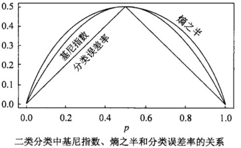

## 分类误差率、熵和基尼不纯度的区别

定义节点分裂时的不纯度函数（impurity）有三种（假设有*k*个类别）：

（1）**分类误差率**：把当前节点$n$下所有样本都划分为$c$类的误分率，也就是$1-\mathop{max}\limits_{c\in [1,k]}\frac{|c|}{|n|}$。

这个怎么理解呢，用二分类来说，二分类：某个叶子节点有$k$个样本落入，该叶子节点的prediction为$k$个样本中样本数最多的那一类。因此mis-classification err不可能高于0.5，比如说：一共有{A, B}2种class，叶子节点包含 10个样本，其中3个A样本，7个B样本，那么该节点的预测值为class = B;  err_rate = 3 / 10 = 0.3。反之一共有{A, B}2种class，叶子节点包含 10个样本，其中7个A样本，3个B样本，那么该节点的预测值为class = A;  err_rate = 3 / 10 = 0.3

**但在多分类中，err_rate是可以大于0.5的**。很简单啊，假设一共有{A, B, C}3种class, 叶子节点包含10个样本，其中4个A样本，3个B样本，3个C样本，那么该节点的预测值为class = A;  err_rate = 6 / 10 = 0.6

（2）**熵**：$E(a)=-\sum_{c=1}^k p_c(n)\cdot log\ p_c(n)$，$p_c(n)$代表了当前节点$n$中属于$c$类的比例。

（3）**基尼不纯度**：$Gini(a)=\sum_{c=1}^kp_c(n)\cdot (1-p_c(n))$

三个函数均为凸函数（convex function），只不过误分率（函数1）是分段线性函数（piece-wise linear），有时候节点分裂会无法降低不纯度。所以函数2和3一般是常采用的手段，它们的优势如下：  

1. 二者均为凸函数
2. 二者都可以微分所以便于数值计算
3. 二者都可以代表函数1的误差上界（upper bound） 

正因为它们都是光滑凸函数且为训练误分函数的错误上界，所以不仅保证了每次节点分裂整体的不纯度函数会下降且更适合运算。在绝大部分情况下，二者都是等价的，只有2%的情况下可能会有不同的分裂决策[3]。如果非要说不同的话，就是熵的计算会需要求log，所以可能预算开销更大。但是求log是防止计算溢出的利器，特别适合用于处理极小概率的情况，所以并非只有缺点。更加的详细的对比可以参考[Raileanu, L.E. and Stoffel, K., 2004. Theoretical comparison between the gini index and information gain criteria.Annals of Mathematics and Artificial Intelligence,41(1), pp.77-93.](https://www.unine.ch/files/live/sites/imi/files/shared/documents/papers/Gini_index_fulltext.pdf)。

基尼系数可以看做熵的近似，原理是将$log(p)$进行泰勒展开：
$$
ln(x)=(x-1)-\frac{(x-1)^2}{2}+\frac{(x-1)^3}{3}-...\quad 0<x\leqslant 2
$$
 p较小时，$log(p)\sim p-1$，于是$-p\ log(p)\sim -p(p-1)=p-p^2$，则$\sum-p\ log(p)=\sum{p}-\sum{p^2}=1-\sum{p^2}$。

这是数值计算里面常用的近似技巧。只见过用基尼系数代替熵的，没见过反过来算的。sklean里决策树的划分方法默认是基尼不纯度，可能从一定程度上说明它比熵应用的更多一些，因为基尼不纯度在计算时不像熵会计算log，所以使得建树过程更快了。要说基尼不纯度有什么缺点的话，就是在划分时会偏向多值属性，当类的数量大的时候计算很困难。

熵和基尼不纯度并不等价，熵是最大似然的等价形式，而基尼不纯度是加权最大差异的等价形式。后者对于样本的二分类整体占比高度敏感，而前者更加稳定。

# 决策树的生成

## ID3算法

ID3算法的核心是在决策树各个结点上应用**信息增益**准则选择特征，递归地构建决策树。

具体方法是：从根结点开始，对结点计算所有可能的特征的信息增益，选择信息增益最大的特征作为结点的特征，由该特征的不同取值建立子结点；再对子结点递归地调用以上方法，构建决策树；直到所有特征的信息增益均很小或者没有特征可以选择为止。最后得到一颗决策树。

ID3相当于用极大似然法进行概率模型的选择。

**ID3算法：**

输入：训练数据集$D$，特征集$A$，阈值$\epsilon$；

输出：决策树$T$。

（1）若$D$中所有实例属于同一类$C_k$，则$T$为单结点树，并将类$C_k$作为该结点的类标记，返回$T$；

（2）若$A=\varnothing $，则$T$为单结点树，并将$D$中实例数最大的类$C_k$作为该结点的类标记，返回$T$；

（3）否则，计算$A$中每个特征对$D$的信息增益，选择信息增益最大的特征$A_g$；

（4）如果特征$A_g$的信息增益小于阈值$\epsilon$，则置$T$为单结点树，并将$D$中实例数最大的类$C_k$作为该结点的类标记，返回$T$；

（5）否则，对$A_g$的每一可能值$a_i$，依$A_g=a_i$将$D$分割为若干非空子集$D_i$，将$D_i$中实例数最大的类作为标记，构建子结点，由结点及其子结点构成树$T$，返回$T$；

（6）对第$i$个子结点，以$D_i$为训练集，**以$A - A_g$为特征集**，递归地调用步（1）到步（5），得到子树$T_i$，返回$T_i$

注意：这里你会困惑（6）中为什么**以$A - A_g$为特征集**，这就是说，该特征在分裂时只能使用一次。为什么？因为这里是离散特征，离散特征用一次就不能再用了，因为它的每一个分支形成的子树里，该特征只有一种类别了，无法再分了。而后续的CART树，特征包含连续特征，那是可以多次在分裂节点中使用的。

> 需注意的是，与离散属性不同，若当前节点划分属性为连续属性，该属性还可作为其后代结点的划分属性。

——周志华《机器学习》P86

---

ID3算法只有树的生成，所以该算法生成的树容易产生过拟合。

## C4.5算法

C4.5算法与ID3算法相似，C4.5算法那对ID3算法进行了改进。C4.5在生成过程中，使用信息增益率来选择特征。

## CART算法

分类与回归树（**classification and regression tree**， CART）模型由Breiman等人在1984年提出，即可用于分类，也可用于回归。以下将分类与回归的树统称为决策树。

CART假设决策树是**二叉树**，内部结点特征的取值是”是“和”否“，左分支是取值为”是“的分支，右分支是取值为”否“的分支，这样的决策树等价于递归地二分每个特征，将特征空间划分为有限个单元，预测条件概率分布。

CART算法由以下两步组成：

（1）决策树生成：基于训练数据集生成决策树，生成的决策树要尽量大；

（2）决策树剪枝：用验证数据集对已生成的树进行剪枝并选择最优子树，这时用损失函数最小作为剪枝的标准。

**CART生成：**

决策树的生成就是递归地构建二叉决策树的过程。对**回归树用平方误差最小化**准则，对**分类树用基尼不纯度最小化**准则，进行特征选择，生成二叉树。

### 回归树的生成

**最小二乘回归树生成算法：**

输入：训练数据集$D$；

输出：回归树$f(x)$。

在训练数据集所在的输入空间中，递归地将每个区域划分为两个子区域并决定每个子区域上的输出值，构建二叉决策树：

（1）选择最优切分变量$j$与切分点$s$，求解
$$
\mathop{\text{min}}_{j,s}\left[ \mathop{\text{min}}_{c_1}\sum_{x_i\in R_1(j,s)}(y_i-c_1)^2 + \mathop{\text{min}}_{c_2}\sum_{x_i\in R_2(j,s)}(y_i-c_2)^2  \right]
$$
遍历变量$j$（个人理解，这里的$j$可能是第$j$个特征吧），对固定的切分变量$j$扫描切分点$s$，选择使上式达到最小值的对$(j,s)$。

（2）用选定的对$(j,s)$划分区域并决定相应的输出值：
$$
R_1(j,s)=\{x|x^{(j)}\leq s\},\quad R_2(j,s)=\{x|x^{(j)}> s\}
$$

$$
\hat{c}_m=\frac{1}{N_m}\sum_{x_i\in R_m(j,s)}y_i,\quad x\in R_m,\quad m=1,2
$$

（3）继续对两个子区域调用步骤（1），（2），直到满足停止条件。

（4）将输入空间划分为$M$个区域$R_1, R_2,  ... , R_M$，生成决策树：
$$
f(x)=\sum_{m=1}^M\hat{c}_mI(x\in R_m)
$$

### 分类树的生成

分类树用**基尼不纯度**选择最优特征，同时决定该特征的最优二值切分点。

**CART生成算法：**

输入：训练数据集$D$，停止计算的条件；

输出：CART决策树。

根据训练数据集，从根结点开始，递归地对每个结点进行以下操作，构建二叉决策树：

（1）设结点的训练数据集为$D$，计算现有特征对该数据集的基尼不纯度。即，对每一个特征$A$，对其可能取的每一个值$a$，根据样本点对$A=a$的测试为”是“或者”否“将$D$分割成$D_1$和$D_2$两部分，计算$A=a$时的基尼不纯度。

（2）在所有可能的特征$A$以及它们所有可能的切分点$a$中，选择基尼不纯度最小的特征及其对应的切分点作为最优特征与最优切分点。依最优特征与最优切分点，从现结点生成两个子结点，将训练数据集依特征分配到两个子结点中去。

（3）对两个子结点递归地调用（1）、（2），直到满足停止条件。

（4）生成CART决策树。

算法停止计算的条件是结点中的样本个数小于预定阈值，或样本集的基尼不纯度小于预定阈值（样本基本属于同一类），或者没有更多的特征。

## CHAID算法

使用**卡方检验**进行评估

# 决策树的剪枝

决策树生成算法递归地产生决策树，直到不能继续下去为止。这样产生的树往往对训练数据的分类很准确，但对未知的测试数据的分类却没有那么准确，即出现过拟合现象。解决这个问题的办法是考虑决策树的复杂度，对已经生成的决策树进行简化。

在决策树学习中将已经生成的树进行简化的过程称为剪枝。具体地，剪枝从已经生成的树上裁掉一些子树或者叶结点，并将其根结点或父结点作为新的叶结点，从而简化分类树模型。

决策树剪枝的基本策略有“预剪枝”和“后剪枝”两种：**预剪枝**(pre prune)：先设定好规则，一旦数据符合这个规则就被剪枝；**后剪枝**(post prune): 子树替换，子树提升。

* **预剪枝**是指在决策树生成过程中，对每个结点在划分前先进行估计，若当前结点的划分不能带来决策树泛化性能（验证集准确率）的提升，则停止划分并将当前结点标记为叶结点；
* **后剪枝**则是先从训练集生成一棵完整的决策树，然后自底向上地对非叶结点进行考察，若将该结点对应的子树替换为叶结点能带来决策树泛化性能提升，则将该子树替换为叶结点。

如何判断决策树泛化性能（验证集准确率）是否提升呢？这里采用留出法，即预留一部分数用作“验证集”进行性能评估。我们将西瓜书中的西瓜数据集2.0（这里就不写出了）随机划分成两部分，如下表所示，编号为\{1,2,3,6,7,10,14,15,16,17\}的样例组成训练集，编号为\{4,5,8,9,11,12,13\}的样例组成验证集。

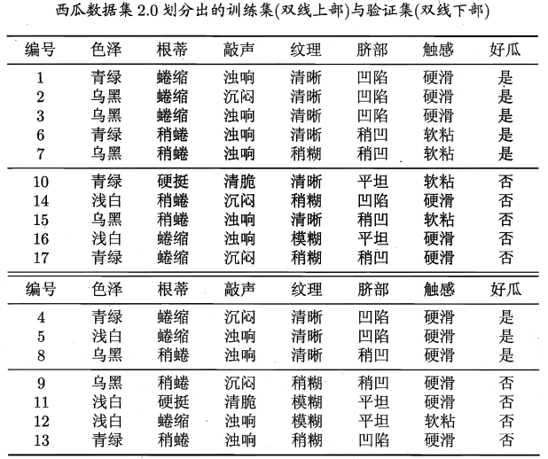

基于上表生成的未剪枝决策树：

## 预剪枝

预剪枝的方法：通过提前停止树的构建而对树剪枝，是目前解决过拟合的主要方法。常用的剪枝条件包括限制树的深度，限制叶节点最小样本数，限制叶节点的最小样本权重，限制叶节点的信息增益值的阈值等。

基于信息增益准则，我们会选取属性“脐部”来对训练集进行划分，并产生3个分支，如下图所示。

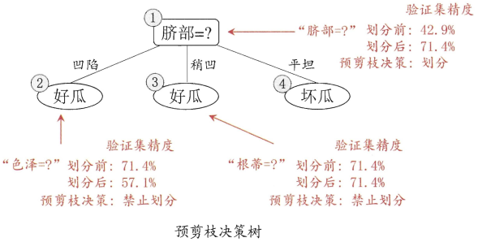

然而，是否应该进行这个划分呢？预剪枝要对划分前后的泛化性能进行估计。

在划分之前，所有样例集中在根结点。若不进行划分，则根据决策树学习算法的第6行，该结点被标记为叶结点，其类别标记为训练样例数目最多的类别，假设我们将这个叶结点标记为“好瓜”。用验证集对这个单结点决策树进行评估，则编号为\{4,5,8\}的样例被分类正确，另外4个样例分类错误，于是，，验证集经度为3/7=42.9%。

在用“脐部”进行划分以后，上图中的结点②、③、④分别包含编号为\{1,2,3,14\}、\{6,7,15,17\}、\{10,,16\}的训练样例，因此这3个结点分别被标记为叶结点"好瓜"、"好瓜"、"坏瓜"。此时，验证集中编号为\{4,5,8,11,12\}的样例被分类正确，验证集精度为5/7=71.4%>42.9%。于是，用“脐部”进行划分得以确定。

然后，决策树算法应该对结点②进行划分，基于信息增益准则将挑选出划分属性“色泽”。然而，在使用“色泽”划分后，编号为\{5\}的验证集样本分类结果会由正确转变为错误，使得验证集精度下降为57.1%，于是，预剪枝策略将禁止结点②被划分。

对结点③，最优化分属性为“根蒂”，划分后验证集精度仍为71.4%。这个划分不能提升验证集精度，于是，预剪枝策略禁止结点③被划分。

对结点④，其所含训练样例已经属于同一类，不再进行划分。

于是，基于预剪枝策略从上表的数据所生成的决策树如上图所示，其验证集精度为71.4%。这是一棵仅有一层划分的决策树。

对比上面的未剪枝决策树和上图（预剪枝决策树），可以看出，预剪枝决策树使得决策树的很多分支都没有“展开”，这不仅降低了过拟合的风险，还显著少了决策树的训练时间开销和测试时间开销。但另一方面，有些分支的当前划分虽不能提升泛化性能、甚至可能导致泛化性能暂时下降，但在其基础上进行的后续划分，却有可能导致性能显著提高；预剪枝基于**“贪心”本质**禁止这些分支展开，给预剪枝决策树带来了欠拟合的风险。

## 后剪枝

后剪枝的方法：首先构造完整的决策树，允许树过度拟合数据，然后应单个结点代替子树，节点的分类采用子树的主要分类。剪枝方法有错误率降低剪枝，悲观错误剪枝，代价复杂度剪枝。

后剪枝需要有验证集参与。

### 后剪枝过程描述

后剪枝先从训练集生成一棵完整决策树，例如基于上表的数据我们得到未剪枝的决策树，如下图所示。易知，该决策树的验证集精度为42.9%。

后剪枝首先考察未剪枝决策树中的结点⑥。若将其领衔的分支剪除，则相当于把⑥替换为叶结点。替换后的叶结点包含编号为\{7,15\}的训练样本，于是，该叶结点的类别标记为“好瓜”，此时决策树的验证集精度提高至57.1%。于是，后剪枝策略决定剪枝，如下图所示。

然后考察结点⑤，若将其领衔的子树替换为叶结点，则替换后的叶结点包含编号为\{6,7,15\}的训练样例，叶结点类别标记为“好瓜”，此时决策树验证集精度仍为57.1%。于是，可以不进行剪枝（20210401疑惑：剪枝了难道不行吗？还有利于过拟合）。

对结点②，若将其领衔的子树替换为叶结点，则替换后的叶结点包含编号为\{1,2,3,14\}的训练样例，叶结点标记为“好瓜”。此时决策树的验证集精度提高至71.4%.于是，后剪枝策略决定剪枝。

对结点③和①，若将其领衔的子树替换为叶结点，则所得决策树的验证集精度分别为71.4%与42.9%，均未得到提高.于是它们被保留。

最终，基于后剪枝策略上表数据所生成的决策树如下图所示，其验证集精度为71.4%。

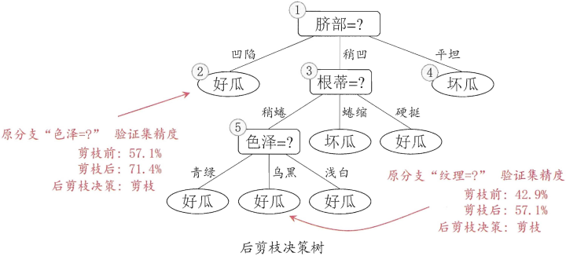

对比上图（后剪枝）和上上上图（预剪枝）可看出，后剪枝决策树通常比预剪枝决策树保留了更多的分支。一般情形下，后剪枝决策树的欠拟合风险很小，泛化性能往往优于预剪枝决策树。但后剪枝过程是在生成完全决策树之后进行的，并且要自底向上地对树中的所有非叶结点进行逐一考察，因此其训练时间开销比未剪枝决策树和预剪枝决策树都要大得多。

### 后剪枝算法

上面说得比较直觉化，下面用公式来较严格地说明后剪枝过程。

决策树的剪枝往往通过极小化决策树整体的损失函数或代价函数来实现。设树$T$的叶结点个数为$|T|$，$t$是树$T$的叶结点，该叶结点上有$N_t$个样本点，其中$k$类的样本点有$N_{tk}$个，$k=1,2,...,K$，$H_t(T)$为叶结点$t$上的经验熵，$\alpha \geqslant 0$为参数，则决策树学习的损失函数可以定义为
$$
C_{\alpha}(T)=\sum_{t=1}^{|T|}N_tH_t(T)+\alpha|T|
$$
其中经验熵为
$$
H_t(T)=-\sum_k\frac{N_{tK}}{N_t}\text{log}\frac{N_{tK}}{N_t}
$$
注意：$N_t$是这个节点中的样本的个数，可以看做这个节点的权重。节点中样本数越多，权重越大。所以，公式前面一项$\sum_{t=1}^{|T|}N_tH_t(T)$代表决策树所有叶子节点的熵值的加权和。每个节点的样本分类纯度越高，这个值就越小。举个例子，有两个叶节点$L_1$和$L_2$，这两个叶节点中都由两个类别的样本，分别是类别a和类别b。现在分到$L_1$的样本有100个，a类有80个，b类有20个；分到$L_2$的样本有10个，a类有8个，b类有2个。如果我们只考虑经验熵的话那这两个叶节点对损失的贡献是一样的，但这并不合理，因为$L_1$中的样本多于$L_2$中的样本。这是因为经验熵只与分布有关，也就是它只考虑叶节点内的分类比例。计算整个叶节点的损失还需要考虑该叶节点内的样本数因此需要加入$N_t$。

在损失函数中，将上上式右端的第1项记作
$$
C(T)=\sum_{t=1}^{|T|}N_tH_t(T)=-\sum_{t=1}^{|T|}\sum_{k=1}^KN_{tk}\text{log}\frac{N_{tk}}{N_t}
$$
这时有
$$
C_{\alpha}(T)=C(T)+\alpha|T|
$$
上式中，$C(T)$表示模型对训练数据的预测误差，即模型与训练数据的拟合程度，$|T|$表示模型复杂度，参数$\alpha \geqslant 0$控制两者之间的影响，较大的$\alpha$促使选择较简单的模型（树），较小的$\alpha$促使选择较复杂的模型（树）。$\alpha=0$意味着只考虑模型与训练数据的拟合程度，不考虑模型的复杂度。

剪枝，就是当$\alpha$确定时，选择损失函数最小的模型，即损失函数最小的子树。当$\alpha$值确定时，子树越大，往往与训练数据的拟合越好，但是模型的复杂度就越高；相反，子树越小，模型的复杂度就越低，但是往往与训练数据的拟合不好。损失函数正好表示了对两者的平衡。

可以看出，决策树生成只针对了通过提高信息增益（或者信息增益率）对训练数据进行了更好的拟合，而决策树剪枝通过优化函数损失函数还考虑了减小模型复杂度。**决策树生成学习局部的模型，而决策树剪枝学习整体的模型。**

上式定义的考虑了模型复杂度的损失函数的极小化等价于正则化的极大似然估计。所以，利用损失函数最小原则进行剪枝就是用正则化的极大似然估计进行模型选择。

决策树剪枝过程的示意图如下图所示：

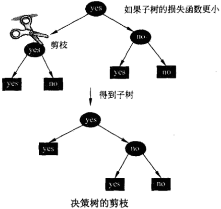

**树的剪枝算法：**

输入：生成算法产生的整个树$T$，参数$\alpha$

输出：修剪后的子树$T_{\alpha}$。

（1）计算每个结点的经验熵。

（2）递归地从树的叶结点向上回缩。

设一组叶结点回缩到其父结点之前与之后的整体树分别为$T_B$和$T_A$，其对应的损失函数值分别是$C_{\alpha}(T_B)$和$C_{\alpha}(T_A)$，如果
$$
C_{\alpha}(T_A)\leqslant C_{\alpha}(T_B)
$$
则进行剪枝，即将父结点变为新的叶结点。

（3）返回（2），直至不能继续为止，得到损失函数最小的子树$T_{\alpha}$。

注意，上式只需考虑两个数的损失函数的差，其计算可以在局部进行，所以，决策树的简直算法可以由一种动态规划的算法实现。

### CART后剪枝

CART剪枝算法从“完全生长”的决策树的底端剪去一些子树，使决策树变小（模型变简单），从而能够对未知数据有更准确的预测。

CART剪枝算法由两步组成：首先从生成算法产生的决策树$T_0$底端开始不断剪枝，直到$T_0$的根结点，形成一个子树序列$\{T_0, T_1, ... , T_n\}$；然后通过交叉验证法在独立的验证数据集上对子树序列进行测试，从中选择最优子树。

**1.剪枝，形成一个子树序列**

在剪枝过程中，计算子树的损失函数： 
$$
C_{\alpha}(T)=C(T)+\alpha|T|
$$
其中，$T$为任意子树，$C(T)$为对训练数据的预测误差（如基尼不纯度），$|T|$为子树的叶结点个数，$\alpha\geqslant  0$为超参数，$C_{\alpha}(T)$为参数是$\alpha$时的子树$T$的整体损失。参数$\alpha$权衡训练数据的拟合程度与模型的复杂度。  

对固定的$\alpha$，—定存在使损失函数$C_{\alpha}(T)$最小的子树，将其表示为$T_{\alpha}$。$T_{\alpha}$在损失函数$C_{\alpha}(T)$最小的意义下是最优的。容易验证这样的最优子树是唯一的。当$\alpha$大的时候，最优子树$T_{\alpha}$偏小；当$\alpha$小的时候，最优子树$T_{\alpha}$偏大。极端情况，当$\alpha = 0$时，整体树是最优的。当$\alpha \rightarrow \infty$时，根结点组成的单结点树是最优的。 

Breiman等人证明：可以用递归的方法对树进行剪枝。将$\alpha$从小增大，$0 = \alpha_0 < \alpha_1 < ... < \alpha_n < +\infty$，产生一系列的区间$[\alpha_i, \alpha_{i+1}), i=0,1,...,n$；剪枝得到的子树序列对应着区间$\alpha \in [\alpha_i, \alpha_{i+1}), i=0,1,...,n$的最优子树序列$\{T_0, T_1 ,... ,T_n\}$，序列中的子树是**嵌套**的。

具体地，从整体树$T_0$开始剪枝。对$T_0$的任意内部结点$t$，以$t$为单结点树的损失函数是
$$
C_{\alpha}(t)=C(t)+\alpha
$$
这里以$t$为单结点树的意思是：把以$t$为根结点的子树全部剪枝到$t$结点，那么这个树的叶结点个数$|t|=1$，因为$t$只有它一个结点嘛。

而以$t$为根结点的子树$T_t$的损失函数是
$$
C_{\alpha}(T_t)=C(T_t)+\alpha|T_t|
$$
当$\alpha=0$及$\alpha$充分小时，显然，有不等式
$$
C_{\alpha}(T_t)<C_{\alpha}(t)
$$
上式怎么理解呢？很好理解啊，如果不考虑树的复杂度，$T_t$子树是依据属性进行分类的嘛，显然会比全都混在一起更有秩序嘛。

当$\alpha$增大时，在某一$\alpha$有
$$
C_{\alpha}(T_t)=C_{\alpha}(t)
$$
当$\alpha$再增大时，上上式的不等式反向。

由上式可得，只要
$$
\alpha=\frac{C(t)-C(T_t)}{|T_t|-1}
$$
，$T_t$与$t$有相同的损失函数值，而$t$的结点少（只有一个结点），因此$t$比$T_t$更有效，对$T_t$进行剪枝。

为此，对$T_0$中每一内部结点$t$，计算
$$
g(t)=\frac{C(t)-C(T_t)}{|T_t|-1}
$$
它表示剪枝后整体损失函数减少的程度。在$T_0$中剪去$g(t)$最小的$T_t$，将得到的子树作为$T_1$，同时将最小的$g(t)$设为$\alpha_1$。$T_1$为区间$[\alpha_1,\alpha_2)$的最优子树。

如此剪枝下去，直至得到根结点。在这一过程中，不断地增加$\alpha$的值，产生新的区间。

**2.在剪枝得到的子树序列$T_0, T_1, ..., T_n$中通过交叉验证选取最优子树$T_{\alpha}$**

具体地，利用独立的验证数据集，测试子树序列$T_0, T_1, ..., T_n$中各棵子树的平方误差或基尼不纯度。平方误差或基尼不纯度最小的决策树被认为是最优的决策树。在子树序列中，每棵子树$T_1, T_2,  ..., T_n$都对应于一个参数$\alpha_1, \alpha_2, ..., \alpha_n$。所以，当最优子树$T_k$确定时，对应的$\alpha_k$也确定了，即得到最优决策树$T_{\alpha}$。

现在写出CART剪枝算法。

**CART剪枝算法：**

输入：CART算法生成的决策树；

输出：最优决策树$T_{\alpha}$。

（1）设$k=0, T=T_0$。

（2）设$\alpha=+\infty$。

（3）自下而上地对各内部结点$t$计算$C(T_t)$，$|T_t|$以及
$$
\begin{aligned}
g(t)&=\frac{C(t)-C(T_t)}{|T_t|-1}\\
\alpha&=\text{min}(\alpha,g(t))\\
\end{aligned}
$$
这里，$T_t$表示以$t$为根结点的子树，$C(T_t)$是对训练数据的预测误差，$|T_t|$是$T_t$的叶结点的个数。

（4）对$g(t)=\alpha$的内部结点$t$进行剪枝，并对叶结点$t$以多数表决确定其类，得到树$T$。

（5）设$k=k+1, \alpha_k=\alpha, T_k=T$。

（6）如果$T_k$不是由根结点及两个叶结点构成的树，则回到步骤（2）（**这里尚存疑问，是在剪枝之前只计算一次所有子树的$g(t)$呢，还是每次循环都算一遍所有子树的$g(t)$？**）；否则令$T_k=T_n$。

（7）采用交叉验证法，在子树序列$T_0, T_1, ..., T_n$中选取最优子树$T_{\alpha}$。

# 连续与缺失值

## 连续值处理

到目前为止我们仅讨论了基于离散属性来生成决策树。现实学习任务中常会遇到连续属性，有必要讨论如何在决策树学习中使用连续属性。

由于连续属性的可取值数目不再有限，因此，不能直接根据连续属性的可取值来对结点进行划分。此时，**连续属性离散化技术**可派上用场。最简单的策略是采用二分法(bi-partition)对连续属性进行处理，这正是C4.5决策树算法中采用的机制。

给定样本集$D$和连续属性$A$，假定$A$在$D$上出现了$n$个不同的取值，将这些值从小到大进行排序，记为$\{a^1,a^2,...,a^n\}$。基于划分点$t$可将$D$分为子集$D_t^-$和$D_t^+$，其中$D_t^-$包含那些在属性$a$上取值不大于$t$的样本，而$D_t^+$则包含那些在属性$a$上取值大于$t$的样本。显然，对相邻的属性取值$a^i$与$a^{i+1}$来说，$t$在区间$[a^i,a^{i+1})$中取任意值所产生的划分结果相同。因此，对连续属性$A$，我们可考察包括$n-1$个元素的候选划分点集合
$$
T_a=\left\{\frac{a^i+a^{i+1}}{2}|1\leqslant i \leqslant n-1\right\}
$$
，即把区间的中位点
$$
\frac{a^i+a^{i+1}}{2}
$$
作为候选点划分。然后，我们就可以像离散属性值一样来考察这些划分点，选取最优的划分点进行样本集合的划分。

用公式表达如下式：
$$
\begin{aligned}
H(D,A)&=\mathop{\text{max}}_{t\in T_a}\ H(D,A,t)\\
&=\mathop{\text{max}}_{t\in T_a}\ H(D)-\sum_{\lambda\in \{-,+\}}\frac{|D_t^{\lambda}|}{|D|}H(D_t^{\lambda})\\
\end{aligned}
$$
其中，$H(D,A,t)$是样本集$D$基于划分点$t$二分后的信息增益。于是，我们就选择使$H(D,A,t)$最大的划分点。

举例说明，我们可以在上面的西瓜数据集2.0上增加两个连续属性“密度”和“含糖率”，然后用这个数据集来生成一棵决策树。

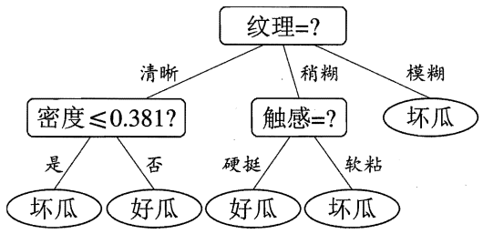

需注意的是，与离散属性不同，**若当前结点划分属性为连续属性，该属性还可作为其后代结点的划分属性**。例如在父结点上使用了“密度≤0.381”，不会禁止在子结点上使用“密度≤0.294”。

## 缺失值处理

现实任务中常会遇到不完整样本，即样本的某些属性值缺失。例如由于诊测成本、隐私保护等因素，患者的医疗数据在某些属性上的取值（如HIV测试结果）未知；尤其是在属性数目较多的情况下，往往会由大量样本出现缺失值。如果简单地放弃不完整样本，仅使用无缺失值的样本来进行学习，显然是对数据信息极大的浪费。下表是西瓜数据集2.0出现缺失值的版本，如果放弃不完整的样本，则仅有编号\{4,7,14,16\}的4个样本能够被使用。显然，有必要考虑利用有缺失值的训练样例来进行学习。

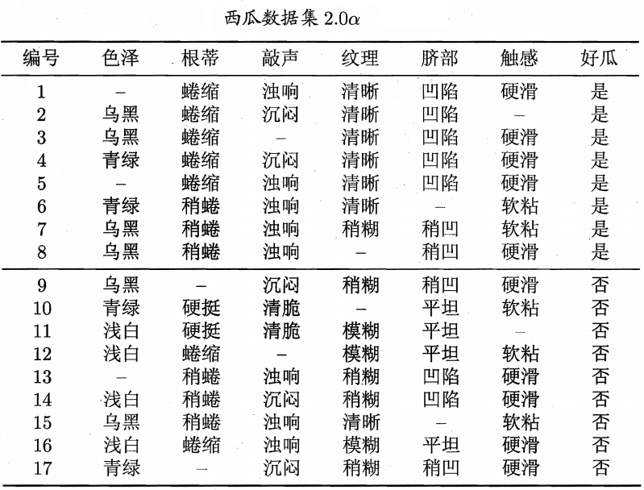

我们需解决两个问题：

（1）如何在属性值缺失的情况进行划分属性选择？

（2）给定划分属性，若样本在该属性上的值缺失，如何对样本进行划分？

给定训练集$D$和属性$A$，令$\tilde{D}$表示$D$中在属性$A$上没有缺失值的样本子集。

对问题（1），显然我们仅可根据$\tilde{D}$来判断属性$a$的优劣，假定属性$A$有$V$个可取值$\{a^1,a^2,...,a^V\}$，令$\tilde{D}^v$表示$\tilde{D}$中在属性$a$上取值为$a^v$的样本子集，$\tilde{D}_k$表示$\tilde{D}$中属于第$k$类($k=1,2,...,|y|$)的样本子集，则显然有
$$
\begin{aligned}
\tilde{D}&=\cup_{k=1}^{|y|}\tilde{D}_k\\
\tilde{D}&=\cup_{v=1}^{V}\tilde{D}^v\\
\end{aligned}
$$
。假定我们为每一个样本$x$赋予一个权重$w_x$，并定义
$$
\begin{aligned}
\rho&=\frac{\sum_{x\in \tilde{D}}w_x}{\sum_{x\in D}w_x}\\
\tilde p_k&=\frac{\sum_{x\in \tilde{D}_k}w_x}{\sum_{x\in \tilde{D}}w_x}\quad (1\leqslant k\leqslant|y|)\\
\tilde r_v&=\frac{\sum_{x\in \tilde{D}^v}w_x}{\sum_{x\in \tilde{D}}w_x}\quad (1\leqslant v \leqslant V)\\
\end{aligned}
$$
直观地看，对属性$A$，$\rho$表示无缺失值样本所占的比例；$\tilde{p}_k$表示无缺失值样本中第$k$类所占的比例；$\tilde{r}_v$则表示无缺失值样本中在属性$A$上取值$a^v$的样本所占的比例。显然，

$$
\sum_{k=1}^{|y|}\tilde{p}_k=1,\quad \sum_{v=1}^V \tilde{r}_v=1
$$
基于上述定义，我们可将信息增益的计算式推广为
$$
\begin{aligned}
H(D,A)&=\rho\times H(\tilde{D},A)\\
&=\rho \times \left( H(\tilde{D})-\sum_{v=1}^V \tilde{r}_vH(\tilde{D}^v)  \right)
\end{aligned}
$$
其中，
$$
H(\tilde{D})=-\sum_{k=1}^{|y|}\tilde{p}_k\text{log}_2\tilde{p}_k
$$
对于问题（2），若样本$x$在划分属性$A$上的取值已知，则将$x$划入与其取值对应的子结点，且样本权值在子节点中保持为$w_x$。若样本$x$在划分属性$A$上的取值未知，则将$x$同时划入所有子结点，且样本权值在与属性值$a^v$对应的子结点中调整为$\tilde{r}_vw_x$；**直观地看，这就是让同一个样本以不同的概率划入到不同的子结点中去**。

# 多变量决策树

若我们把每个属性视为坐标空间中的一个坐标轴，则$d$个属性描述的样本就对应了$d$维空间中的一个数据点，对样本分类则意味着在这个坐标空间中寻找不同类样本之间的分类边界。决策树所形成的分类边界有一个明显的特点：**轴平行**(axis-paralld)，即它的分类边界由若干个与坐标轴平行的分段组成。

举例说明，以下图所示的决策树为例：

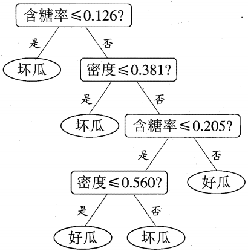

这棵树所对应的分类边界如下图所示：

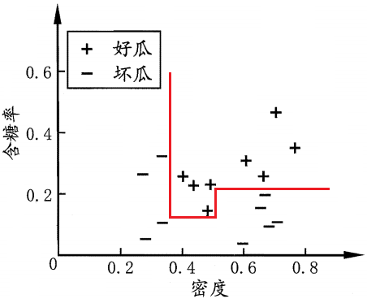

显然，分类边界的每一段都是与坐标轴平行的。这样的分类边界使得学习结果有较好的可解释性，因为每一段划分都直接对应了某个属性取值。但在学习任务的真实分类边界比较复杂时，必须使用很多段划分才能获得较好的近似，如下图所示；此时的决策树会相当复杂，由于要进行大量的属性测试，预测时间开销会很大。

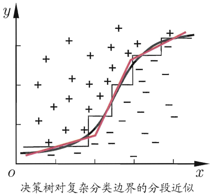

若能使用斜的划分边界，如上图所示的红色线段，则决策树模型将大为简化。“多变量决策树”就是能实现这样的"斜划分"甚至更复杂划分的决策树。

以实现斜划分的多变量决策树为例，在此列决策树中，非叶结点不再是仅仅针对某一个属性，而是对属性的线性组合进行测试；换言之，每个非叶结点是一个形如
$$
\sum_{i=1}^d w_ia_i=t
$$
的线性分类器，其中$w_i$是属性$a_i$的权重，$w_i$和$t$可在该结点所含的样本集和属性集上学得。

于是，与传统的“单变量决策树”不同，在多变量决策树的学习过程中，不是为每个非叶结点寻找一个最优化分属性，而是试图建立一个合适的线性分类器。例如，我们可以学得这样一个多变量决策树，其分类边界如下图所示。

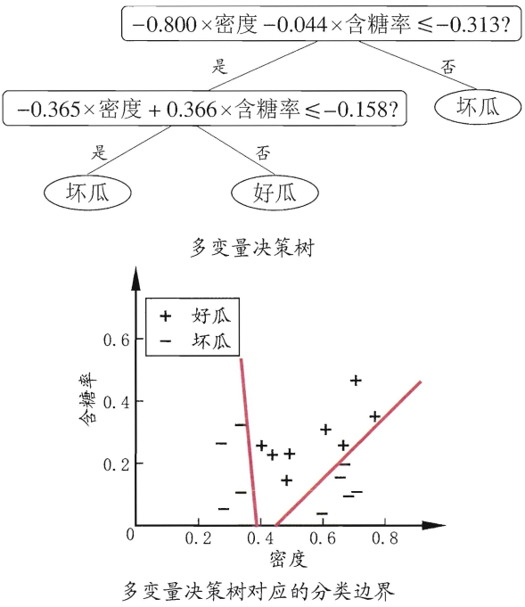

# 决策树的优缺点

* 优点
  * 可解释性强
  * 可处理混合类型特征
  * 具体伸缩不变性（不用归一化特征）
  * 有特征组合的作用
  * 可自然地处理缺失值
  * 对异常点鲁棒
  * 有特征选择作用
  * 可扩展性强， 容易并行
* 缺点
  * 缺乏平滑性（回归预测时输出值只能输出有限的若干种数值）
  * 不适合处理高维稀疏数据 

## 高维稀疏特征下为什么lr效果比gbdt好

- 这个问题我也是思考了好久，在平时的项目中也遇到了不少case，确实高维稀疏特征的时候，使用gbdt很容易过拟合。
- 但是还是不知道为啥，后来深入思考了一下模型的特点，发现了一些有趣的地方。
- 假设有1w个样本，$y$类别0和1，100维特征，其中10个样本都是类别1，而特征$f_1$的值为0，1，且刚好这10个样本的$f_1$特征值都为1，其余9990样本都为0(在高维稀疏的情况下这种情况很常见)，我们都知道这种情况在树模型的时候，很容易优化出含一个使用$f_1$为分裂节点的树直接将数据划分的很好，但是当测试的时候，却会发现效果很差，因为这个特征只是刚好偶然间跟$y$拟合到了这个规律，这也是我们常说的过拟合。但是当时我还是不太懂为什么线性模型就能对这种case处理的好？照理说线性模型在优化之后不也会产生这样一个式子：$y=W_1\cdot f_1+...+W_i\cdot f_i+...$，其中$W_1$特别大以拟合这十个样本，因为反正$f_1$的值只有0和1，$W_1$过大对其他9990样本不会有任何影响。
- 后来思考后发现原因是因为现在的模型普遍都会带着正则项，而lr等线性模型的正则项是对权重的惩罚，也就是$W_1$一旦过大，惩罚就会很大，进一步压缩$W_1$的值，使他不至于过大，而树模型则不一样，树模型的惩罚项通常为叶子节点数和深度等，而我们都知道，对于上面这种case，树只需要一个节点就可以完美分割9990和10个样本，惩罚项极其之小.
- 这也就是为什么在高维稀疏特征的时候，线性模型会比非线性模型好的原因了：**带正则化的线性模型比较不容易对稀疏特征过拟合**。

# 参考文献

* [算法杂货铺——分类算法之决策树(Decision tree)](http://www.cnblogs.com/leoo2sk/archive/2010/09/19/decision-tree.html)

“决策树直观介绍”很大部分参考了此文章。

* 《统计学习方法》李航
* 《机器学习》周志华

本文将此两本书的相关内容进行了整合，基本就参照的这两本书的对应章节。

======

* [决策树(decisionTree)](https://www.jianshu.com/p/da5d7a4d38dd)

这里面有ID3算法的python实现。

* [决策树剪枝算法](https://blog.csdn.net/yujianmin1990/article/details/49864813)

