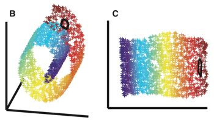

# 流形学习

* [返回上层目录](../dimensionality-reduction.md)
* [流形学习概述](#流形学习概述)

# 流形学习概述

流形学习（manifold learning）是机器学习、模式识别中的一种方法，在维数约简方面具有广泛的应用。它的主要思想是将高维的数据映射到低维，使该低维的数据能够反映原高维数据的某些本质结构特征。流形学习的前提是有一种假设，即某些高维数据，实际是一种低维的流形结构嵌入在高维空间中。流形学习的目的是将其映射回低维空间中，揭示其本质。

以下图为例，左边是一个三维数据的分布，右边是降低到二维后的结果。我们可以发现二维的数据更能直观地表示其流形结构。

通过流形学习来实现降维的方法有很多，其基本思想也类似：假设数据在高维具有某种结构特征，希望降到低维后，仍能保持该结构。

比较常见的有

* 局部改线嵌入（Local Linear Embedding, LLE）

  假设数据中每个点可以由其近邻的几个点重构出来。降到低维，使样本仍能保持原来的重构关系，且重构系数也一样。

* 拉普拉斯特征映射（Laplacian Eigenmaps, LE）

  将数据映射到低维，且保持点之间的（相似度）距离关系。即在原空间中相距较远的点，投影到低维空间中，希望它们之间仍相距较远。反之亦然。

* 局部保持投影（LPP）

* 等距映射（Isomap）

等等。。。

浙江大学何晓飞老师有个关于流形学习的报告，有兴趣可以看下。
[http://www.cad.zju.edu.cn/reports/%C1%F7%D0%CE%D1%A7%CF%B0.pdf](https://link.zhihu.com/?target=http%3A//www.cad.zju.edu.cn/reports/%25C1%25F7%25D0%25CE%25D1%25A7%25CF%25B0.pdf)

# 参考文献

* [求简要介绍一下流形学习的基本思想？](https://www.zhihu.com/question/24015486)

“流形学习概述”一节参考这篇知乎问题。

