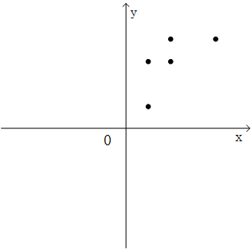
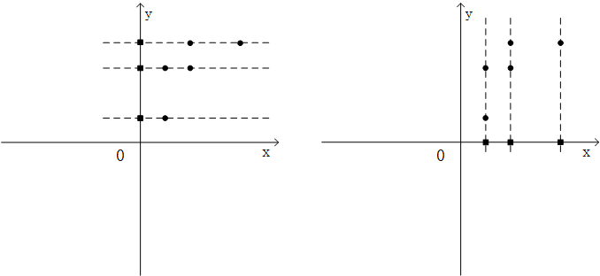
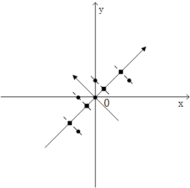

# PCA主成分分析

* [返回上层目录](../dimensionality-reduction.md)
* [理论推导](#理论推导)
  * [直觉分析](#直觉分析)
  * [期望与方差](#期望与方差)
  * [协方差与协方差矩阵](#协方差与协方差矩阵)
  * [数据降维的需求背景](#数据降维的需求背景)
  * [目标：特征减少，损失要小](#目标：特征减少，损失要小)
  * [主成分分析法降维的思路](#主成分分析法降维的思路)
    * [直接去掉特征？太盲目了](#直接去掉特征？太盲目了)
    * [从解除特征之间的相关性入手](#从解除特征之间的相关性入手)
  * [剖析主成分分析的细节](#剖析主成分分析的细节)
    * [构造彼此无关的新特征](#构造彼此无关的新特征)
    * [PCA的严谨证明](#PCA的严谨证明)
    * [新得到的特征该如何取舍](#新得到的特征该如何取舍)
    * [衡量信息的损失](#衡量信息的损失)
  * [推广到n个特征的降维](#推广到n个特征的降维)
* [实例分析](#实例分析)
  * [原始数据零均值化，求协方差](#原始数据零均值化，求协方差)
  * [对样本的协方差矩阵求特征值和特征向量](#对样本的协方差矩阵求特征值和特征向量)
  * [在新坐标系上降维](#在新坐标系上降维)
  * [主成分贡献率](#主成分贡献率)
* [PCA的优缺点](#PCA的优缺点)
* [PCA的python代码](#PCA的python代码)

在实际生产生活中，我们所获得的数据集在特征上往往具有很高的维度，对高维度的数据进行处理时消耗的时间很大，并且过多的特征变量也会妨碍查找规律的建立。**如何在最大程度上保留数据集的信息量的前提下进行数据维度的降低**，是我们需要解决的问题。

对数据进行降维有以下**优点**：

* 使得数据集更易使用
* 降低很多算法的计算开销
* 去除噪声
* 使得结果易懂

降维技术作为数据预处理的一部分，即可使用在监督学习中也能够使用在非监督学习中。其中**主成分分析PCA**应用最为广泛，本文也将详细介绍PCA。

主成分分析（Principal Component Analysis）：一种统计方法，它对多变量表示数据点集合寻找尽可能少的正交矢量表征数据信息特征。

PCA既是一种压缩数据的方式，也是一种学习数据表示的无监督学习方法。

# 理论推导

## 直觉分析

直观上而言，思路应该聚焦在这两方面：  

一是，要考虑去除掉特征之间的相关性，想法是创造另一组新的特征来描述样本，并且新的特征必须彼此之间不相关。  

二是，在新的彼此无关的特征集中，舍弃掉不重要的特征，保留较少的特征，实现数据的特征维度降维，保持尽量少的信息损失。

## 期望与方差

看到这个小标题，读者也许会想，这里不是在讲线性代数么，怎么感觉像是误入了概率统计的课堂？

这里我专门说明一下，在这里，我们的最终目标是分析如何提取数据的主成分，如何对手头的数据进行降维，以便后续的进一步分析。往往问题的切入点就是数据各个维度之间的关系以及数据的整体分布。因此，我们有必要先花点功夫，来梳理一下如何对数据的整体分布情况进行描述。

首先大家知道，期望衡量的是一组变量$X$取值分布的平均值，我们一般记作：$E[X]$，反映的是不同数据集的整体水平。比如，在一次期末考试中，一班的平均成绩是90分，二班的平均成绩是85分，那么从这两个班级成绩的均值来看，就反映出一班的成绩在总体上要优于二班。

方差这个概念大家也不陌生，方差的定义是$V[X]=E[(X-\mu)]$，其中，$\mu=E[X]$，它反映的是一组数据的离散程度。通俗的说就是：对于一组数据，其方差越大，数据的分布就越发散，方差越小，数据的分布就越集中。在一组样本集的方差计算中，我们采用$\frac{1}{n-1}\sum_{1}^n(x_i-\mu)^2$作为样本$X$的方差估计。

## 协方差与协方差矩阵

大多数人都会有这样一种感觉，一般而言一个人如果数学成绩好，他的物理成绩大概率也会不错，反之亦然。但是数学成绩与英语成绩的却没有那么相关，至少说不像是数学成绩和物理成绩关联那样密切。

我们为了具体量化这种现象，引入协方差这个概念，对于随机变量$X$和$Y$，二者的协方差定义如下：
$$
Cov[X,Y]=E[(X-\mu)(Y-\nu)]
$$
其中，$\mu$和$\nu$分别是$X$和$Y$的期望。其实，我们可以对比观察一下上面讲过的方差的公式：
$$
V[X]=E[(X-\mu)^2]=E[(X-\mu)(X-\mu)]
$$
不难发现可以将方差看做是协方差的一种特殊形式。

通过上面协方差的定义式，我们可以用通俗的话来概况这里面的含义：

当$X$和$Y$的协方差为正的时候，表示当$X$增大的时候，$Y$也倾向于随之增大；协方差为负的时候，表示当$X$增大，$Y$倾向于减小；当协方差为0的时候，表示当$X$增大时，$Y$没有明显的增大或减小的倾向，二者是相互独立的。

我们可以引入一个协方差矩阵，将一组变量$X_1,X_2,X_3$两两之间的协方差用矩阵的形式统一进行表达：
$$
\begin{bmatrix}
V[X_1] &Cov[X_1,X_2]  &Cov[X_1,X_3] \\ 
\\
Cov[X_2,X_1] &V[X_2]  &Cov[X_2,X_3] \\
\\
Cov[X_3,X_1] &Cov[X_3,X_2] &V[X_3]
\end{bmatrix}
$$
协方差矩阵的第$i$行，第$j$列表示$X_i$和$X_j$之间的协方差，而对角线上表示随机变量自身的方差。我们从定义中可以看出，$Cov[X_i,X_j]$和$Cov[X_j,X_i]$显然是相等的。因此，协方差矩阵是一个对称矩阵，结合上一讲关于对称矩阵的介绍，我们知道协方差矩阵拥有很多优良的性质，后面的应用中会派上大用场。

## 数据降维的需求背景

铺垫完前面的知识后，我们下面正式进入到数据降维的内容中来。

在研究工作中，我们常常针对我们关注的研究对象，收集大量有关他的特征属性，从而对其进行观测和分析。比如，对一组城市进行研究的时候，我们可以从人口、GDP、面积、年降水量、年平均温度、人均寿命、人均工资、人均受教育年份、性别比例、宗教人口、汽车保有量、人均住房面积等等收集相关数据。这里随手一列就是十几个特征属性，其实就算列出一百个来，也不足为奇。我们收集越多的特征属性就越方便我们全方面的对事物进行细致的研究，对深层次的规律进行探寻。

但是问题来了，随着样本特征属性数量的增多，我们需要分析处理的数据量也是直线上升的，在进行样本聚类、回归等数据分析的过程中，样本的数据维度过大，无疑会使得问题的研究变得愈加复杂。同时，大家很容易能发现一个现象，就是样本的特征属性之间还存在着相关性：比如GDP与汽车保有量之间，人均工资与人均受教育年份、人均寿命之间，都是存在着某种关联的，其实这也增加了问题处理的复杂性。

因此这种现状让我们感觉到，用这么多彼此相关的特征属性去描述一件事物，一方面很复杂，另一方面似乎也显得不是那么有必要。我们希望能在原有基础上减少特征属性的数量。

## 目标：特征减少，损失要小

那么，我们现在就视图来探究这个问题：如何对样本的特征属性进行降维。目标是什么？归结起来有两点：  

第一个目标当然是特征维度要变小，不能用那么多的特征属性了。

第二个是描述样本的信息损失要尽量少。数据降维，一定伴随着信息的损失，但是如果损失的太多了，自然也就失去了意义。

## 主成分分析法降维的思路

### 直接去掉特征？太盲目了

有读者可能会想了，能不能直接挑选一个特征属性，然后将其去掉，通过这种方法简单的实现数据降维？直觉告诉我们，似乎是不行的。这种方法最为关键的一点就是没有考虑到特征属性之间彼此紧密耦合的相关关系。这样独立的对各个特征属性进行分析，是很盲目的。

那么具体该如何做？我们还是举一个非常直观的例子来说明：

假设我们研究的对象有两个特征属性$X$和$Y$，对5个样本进行数据采样的结果如下：

| 取值 | 样本1 | 样本2 | 样本3 | 样本4 | 样本5 |
| ---- | ----- | ----- | ----- | ----- | ----- |
| $X$  | 2     | 2     | 4     | 8     | 4     |
| $Y$  | 2     | 6     | 6     | 8     | 8     |

我们的目标是对其降维，只用一维特征来表示每个样本。我们首先将其绘制在二维平面图中进行整体观察，如下图所示：



在5个样本的特征数据分布图中，我们能挖掘出几个重要的规律：

首先，我们来探究这两个特征属性的数据分布和数据相关情况，该数据的协方差矩阵为：
$$
\begin{bmatrix}
6 &4 \\
4 &6
\end{bmatrix}
$$
结合特征变量$X$和$Y$的图像分布以及我们的观察发现，5个样本的特征$X$和特征$Y$呈现出正相关性，数据彼此之间存在着影响。

其次，我们如果真要硬来，直接去掉特征$X$或特征$Y$来实现特征降维，可行吗？显然是不行的，如图3所示，如果我们直接去掉特征$X$，那么样本2和样本3，以及样本4和样本5，就变得无法区分了。但是实质上，在降维前的原始数据中，他们显然是有明显区别的。直接去掉特征$Y$也是一样，这种简单粗暴的降维方法显然是不可取的，他忽视了数据中的内在结构关系，并且带来了非常明显的信息损失。



### 从解除特征之间的相关性入手

我们应该如何调整我们的降维策略？基于上面的现象，直观上而言，思路应该聚焦在这两方面：

一是，要考虑去除掉特征之间的相关性，想法是创造另一组新的特征来描述样本，并且新的特征必须彼此之间不相关。

二是，在新的彼此无关的特征集中，舍弃掉不重要的特征，保留较少的特征，实现数据的特征维度降维，保持尽量少的信息损失。

## 剖析主成分分析的细节

### 构造彼此无关的新特征

首先我们来看第一点，我们尝试用2个新的特征来对样本进行描述，那么为了让这两个新特征满足彼此无关的要求，就得**让这两个新特征的协方差为0**，构成的协方差矩阵是一个对角矩阵。

而目前我们所使用的原始特征$X$和$Y$的协方差不为0，其协方差矩阵是一个普通的对称矩阵。

看到这里，你是不是突然觉得眼前一亮，我们的工作不就是要将当前的对称矩阵变换到对角矩阵么？大的方向的确如此，我们就沿着这个方向，一步一步从头到尾来实施一遍主成分分析(PCA)的具体方法。

我们首先回顾一下协方差的定义公式：
$$
Cov(X,Y)=\frac{1}{n-1}\sum_1^n(x_i-\mu)(y_i-\nu)
$$
感觉公式还不够简练，我们发现如果变量$X$和变量$Y$的均值为0，那么协方差的式子就会变得更加简单。

这个其实好办，我们将$X$中的每一个变量都减去他们的均值$\mu$，同样将$Y$中的每一个变量都减去他们的均值$\nu$，这样经过零均值化处理后，特征$X$和特征$Y$的平均值都变为了0。很显然，这样的处理并不会改变方差与协方差的值，因为数据的离散程度并未发生改变，同时，从公式的表达上来看也非常清楚。

经过零均值处理后，$X$和$Y$的协方差矩阵就可以写作：
$$
\begin{bmatrix}
V[X] &Cov[X,Y] \\ 
Cov[Y,X] &V[Y]
\end{bmatrix}\\
=\begin{bmatrix}
\frac{1}{n-1}\sum_1^nx_i^2 &\frac{1}{n-1}\sum_1^nx_iy_i \\ 
\frac{1}{n-1}\sum_1^ny_ix_i &\frac{1}{n-1}\sum_1^ny_i^2
\end{bmatrix}\\
=\frac{1}{n-1}\begin{bmatrix}
\sum_1^nx_i^2 &\sum_1^nx_iy_i \\ 
\sum_1^ny_ix_i &\sum_1^ny_i^2
\end{bmatrix}
$$
我们看一下
$$
\begin{bmatrix}
\sum_1^nx_i^2 &\sum_1^nx_iy_i \\ 
\sum_1^ny_ix_i &\sum_1^ny_i^2
\end{bmatrix}
$$
这个矩阵，不难发现它就是零均值化后的样本矩阵 
$$
A=\begin{bmatrix}
x_1 &x_2 &x_3 &... &x_n \\ 
y_1 &y_2 &y_3 &... &y_n
\end{bmatrix}
$$
与自身转置矩阵$A^T$相乘的结果，即：协方差矩阵
$$
C=AA^T=
\begin{bmatrix}
\sum_1^nx_i^2 &\sum_1^nx_iy_i \\ 
\sum_1^ny_ix_i &\sum_1^ny_i^2
\end{bmatrix}\\
=\begin{bmatrix}
x_1 &x_2 &x_3 &... &x_n \\ 
y_1 &y_2 &y_3 &... &y_n
\end{bmatrix}
\begin{bmatrix}
x_1 &y_1 \\
x_2 &y_2 \\
x_3 &y_3 \\
. &.\\
x_n &y_n
\end{bmatrix}
$$
一般而言，$X$和$Y$满足线性无关，所以依据我们之前介绍的知识，协方差矩阵是对称的、正定的满秩方阵。

接下来，我们就想**把各样本的特征$X$和特征$Y$的取值用另外一组基来表示，由于要求在新的基下表示的新特征彼此无关（即新特征的协方差矩阵是对角化的，非对角线的协方差元素为零）**，那么必然的，新选择的两个基必须彼此正交。

我们选择一组新的基，$p_1$和$p_2$，他们的模长为1，彼此之间满足标准正交，前面我们学过，在此条件下，向量$a=\begin{bmatrix}x_1\\ y_1\end{bmatrix}$与向量$p_i$的点积就表示向量$a$在$p_i$方向上的投影，同时由于$p_i$是单位向量，那么点积的结果$p_i^Ta$就代表了向量$a$在基向量$p_i$上的投影坐标值。

那么向量$a$在由标准正交向量$p_1$和$p_2$构成的新基底上的坐标即为$\begin{bmatrix}p_1^Ta\\ p_2^Ta\end{bmatrix}$，如果我们令$P=\begin{bmatrix}p_1 &p_2\end{bmatrix}$，那么可以进一步将其表示为：$P^Ta$。

梳理一下这里所做的工作：
$$
A=\begin{bmatrix}
x_1 &x_2 &x_3 &... &x_n \\ 
y_1 &y_2 &y_3 &... &y_n
\end{bmatrix}
$$
，就是$n$个样本的特征$X$和特征$Y$的原始采样值。而
$$
P^TA=\begin{bmatrix}
p_1^Ta_1 &p_1^Ta_2 &p_1^Ta_3 &... &p_1^Ta_n \\ 
p_2^Ta_1 &p_2^Ta_2 &p_2^Ta_3 &... &p_2^Ta_n
\end{bmatrix}
$$
（其中$a_i=\begin{bmatrix}x_i\\ y_i\end{bmatrix}$）。描述的就是这$n$个样本在新构建的特征下的取值。

此时，我们来实现第一个目标：

即，试图让第一个新特征$\left[p_1^Ta_1, p_1^Ta_2, ... ,p_1^Ta_n\right]$和第二个新特征$\left[p_2^Ta_1,p_2^Ta_2,...,p_2^Ta_n\right]$满足线性无关。换句话说，就是**要求这两个特征的协方差为0，即让协方差矩阵为一个对角矩阵**。
$$
\begin{aligned}
D&=\frac{1}{n-1}P^TA(P^TA)^T\\
&=\frac{1}{n-1}P^TAA^TP\\
&=\frac{1}{n-1}P^TCP\\
&=\frac{1}{n-1}\Lambda
\end{aligned}
$$
，这就转化成了我们再熟悉不过的问题了：**去寻找让矩阵$C$对角化的$P$矩阵，而$D=\frac{1}{n-1}\Lambda=\frac{1}{n-1}P^TC P$，所以当$P$是$C$矩阵的特征向量时，采用新特征值的样本矩阵$P^TA$的协方差矩阵$D$为单位阵，即不同新特征之间的协方差为零，新特征之间线性无关**。这里还有一个好的前提条件：$C$是对称矩阵、正定矩阵，它保证了矩阵一定能够对角化，且特征值全都为正。这里需要理解的是，让协方差为0是为了投射后的空间的基之间线性无关，方差保留前几个最大的值是为了保留原始数据所在空间的最大信息。

**上一段是关键，需要仔细理解**。

**上一段是关键，需要仔细理解**。

**上一段是关键，需要仔细理解**。

因为线性代数中有这么一个定理：对称矩阵$C$一定可以得到由一组标准正交特征向量构成的特征矩阵$P$，即$\Lambda=P^TCP$（其中，$P=[p_1,p_2,...,p_n]$，$q_1$到$q_n$就是协方差矩阵$C$的$n$个标准正交特征向量）。由此，我们再通过$P^TA$就能计算得出彼此线性无关的新特征。

### PCA的严谨证明

上述的过程可能会让人有点莫名其妙，凭什么正交矩阵的基向量上的方差就一定最大了？没道理呀，那现在就证明一下。

PCA的推导有两种出发点：

* 基于最小投影距离（具体证明见[PCA两种推导方式](https://www.cnblogs.com/wry789/p/12939755.html)）

* 基于最大投影方差？

但这两种的推导最后都是殊途同归。为了方便起见，选第二种思路最大投影方差来证明：

样本在新坐标系中的投影为$P^TA$，其协方差矩阵为
$$
\begin{aligned}
D&=\frac{1}{n-1}P^TA(P^TA)^T\\
&=\frac{1}{n-1}P^TAA^TP\\
&=\frac{1}{n-1}P^TCP\\
\end{aligned}
$$
使投影方差和最大，就是最大化协方差矩阵的迹：
$$
\begin{aligned}
\mathop{\text{argmax}}_P\quad&tr(P^TCP)\\
s.t.\quad&P^TP=I
\end{aligned}
$$
利用拉格朗日乘子法:
$$
J(W)=tr(P^TCP)+\lambda(I-P^TP)
$$
对$P$求导，结果即为
$$
CP+C^TP-2\lambda P=0\quad(C=C^T)
$$
可得
$$
CP=\lambda P
$$
则矩阵$P$为矩阵$C$的特征向量。

### 新得到的特征该如何取舍

在上面的一系列操作中，我们构造了两个新特征。原始特征的方向分别是$x$轴正方向和$y$轴的正方向，两个原始特征彼此相关。而新构造的两个特征，方向垂直，在这两个方向上构造的新特征，协方差为0，线性无关。

那么，我们将原始特征的采样值变换到两个新选取的投影基上，就得到新的一组特征取值。

我们在此基础上再进行特征维度的降维，让二维数据变成一维。由于这两个新的特征彼此无关，我们可以放心大胆的保留一个，去掉一个。

具体保留哪一个，我们的判定标准是方差，方差越大，表明这个特征里数据分布的离散程度就越大，特征所包含的信息量就越大；反之，如果特征里数据的方差小，分布集中，则表明其包含的信息量就小。那么，我们自然选择保留信息量大的那个特征了。

这里，主特征值对应的特征向量方向上的特征对应的方差最大（即$\sigma_1^2=\frac{1}{n-1}\lambda_1$），而次特征值对应的特征向量方向上的特征对应的方差是$\sigma_2^2=\frac{1}{n-1}\lambda_2$。我们决定保留主特征值对应的特征向量方向上的特征取值。注意，这里方差和特征值的关系是比例关系，即$\sigma^2=\frac{1}{n-1}\lambda$，这是因为
$$
D=
\frac{1}{n-1}\begin{bmatrix}
\sum_1^nx_i^2 &\sum_1^nx_iy_i \\ 
\sum_1^ny_ix_i &\sum_1^ny_i^2
\end{bmatrix}
=\frac{1}{n-1}P^TCP=\frac{1}{n-1}\Lambda
$$
此时，我们完成了主成分的提取，样本如果用一维数据来描述，最终的取值就是$p_1^TA$，从而实现了数据的降维。

最终所保留的就是以$p_1$为基向量的坐标值，如下图所示：



### 衡量信息的损失

那么，我们怎么衡量数据降维过程中的信息损失？或者反过来说，我们保留下了多少信息？这里介绍主成分贡献率的概念，上面的例子里，原本一共有两个特征，我们保留第一个作为主成分，我们用方差来衡量主成分贡献率：

主成分贡献率为： $\frac{\lambda_1}{\lambda_1+\lambda_2}$。

曾经在项目中做过一个尝试，对于512维度进行不同维度压缩后保留的信息：

```
512->256: 0.9998875105696291
512->128: 0.8964985919468982
512->64 : 0.6758438520261455
```

由此可见，我们在数据降维的过程中，如果将512维度变为256维度，数据压缩率为50%，但保留了99.99%的信息，效果还是不错的。

## 推广到n个特征的降维

这里我们推广到一般情况，如果我们有$n$个特征，如何进行数据降维。

这里的思路是完全一样的。

第一步：针对采样得到的$m$个样本，我们得到了一个$n\times m$的样本数据矩阵$A$；

第二步：对每一个特征的取值，进行零均值化处理，如果这些特征不在一个数量级上，我们还应该将其除以标准差$\sigma$。

第三步：利用预处理后的矩阵$A$，求$n$个特征的协方差矩阵：$C=\frac{1}{n-1}AA^T$

第四步：对协方差矩阵进行对角化处理，求得矩阵$C$的$n$个标准正交特征向量，并按照对应的特征值的大小依次排列。

第五步：按照事先规定的主成分贡献度，提取满足该数值要求的前$k$个新构造的特征作为主成分，构造成数据压缩矩阵：$P=[p_1, p_2, ..., p_k]$。

第六步：通过矩阵相乘$P^TA$实现前$k$个主成分的提取，将$n$维特征压缩到$k$维。

# 实例分析

## 原始数据零均值化，求协方差

原始数据为
$$
\begin{aligned}
X &= 
\begin{bmatrix}
2 &2 &4 &8 &4
\end{bmatrix}
\\
Y &= 
\begin{bmatrix}
2 &6 &6 &8 &8
\end{bmatrix}
\end{aligned}
$$
即
$$
A=\begin{bmatrix}
2 &2 &4 &8 &4 \\ 
2 &6 &6 &8 &8
\end{bmatrix}
$$
零均值化为
$$
A=\begin{bmatrix}
-2 &-2 &0 &4 &0 \\ 
-4 &0 &0 &2 &2
\end{bmatrix}
$$
其协方差矩阵为（注：$A$零均值化了）
$$
\begin{aligned}
C&=
\frac{1}{n-1}
\begin{bmatrix}
\sum_1^nx_i^2 &\sum_1^nx_iy_i \\ 
\sum_1^ny_ix_i &\sum_1^ny_i^2
\end{bmatrix}\\
&=
\frac{1}{n-1}
\begin{bmatrix}
x_1 &x_2 &x_3 &... &x_n \\ 
y_1 &y_2 &y_3 &... &y_n
\end{bmatrix}
\begin{bmatrix}
x_1 &y_1 \\
x_2 &y_2 \\
x_3 &y_3 \\
. &.\\
x_n &y_n
\end{bmatrix}\\
&=\frac{1}{n-1}AA^T\\
&=\begin{bmatrix}
6 &4 \\
4 &6
\end{bmatrix}
\end{aligned}
$$
用代码表示为

```python
import numpy as np
import matplotlib.pyplot as plt

# 原始数据
x = [2, 2, 4, 8, 4]
y = [2, 6, 6, 8, 8]

x = x - np.mean(x)
y = y - np.mean(y)

# 零均值化
S = np.vstack((x, y))
print(S)
# [[-2. -2.  0.  4.  0.]
#  [-4.  0.  0.  2.  2.]]

# 协方差
print(np.cov(S))
# [[ 6.  4.]
#  [ 4.  6.]]
# 原始数据的协方差
print(np.cov(np.vstack((x, y))))
# [[6. 4.]
#  [4. 6.]]
```

在上面的过程中，我们对原始数据两个特征的采样值进行了零均值化处理，同时也验证了：零均值化的处理后，协方差矩阵确实不变。

## 对样本的协方差矩阵求特征值和特征向量

对于协方差矩阵$C$，其特征值$\Lambda$和特征向量$P$满足
$$
\Lambda=P^TC P
$$
带入数据，得
$$
\begin{bmatrix}
10 &0 \\
0 &2
\end{bmatrix}
=
\begin{bmatrix}
0.707 &-0.707 \\
0.707 &0.707
\end{bmatrix}^T
\begin{aligned}
\begin{bmatrix}
6 &4 \\
4 &6
\end{bmatrix}
\begin{bmatrix}
0.707 &-0.707 \\
0.707 &0.707
\end{bmatrix}
\end{aligned}
$$
即特征值为$[10, 2]$，对应的特征向量分别为$\begin{bmatrix}0.707\\0.707
\end{bmatrix}$和$\begin{bmatrix}-0.707\\0.707
\end{bmatrix}$。

用代码表示为

```python
import numpy as np
from scipy import linalg

C = np.array([[6, 4],
              [4, 6]])

evalue, evector = linalg.eig(C)
print(evalue) # 特征值
# [ 10.+0.j   2.+0.j]
print(evector)  # 特征向量
#[[ 0.70710678 -0.70710678]
# [ 0.70710678  0.70710678]]
```

## 在新坐标系上降维

在上面的一系列操作中，我们构造了两个新特征。原始特征的方向分别是$x$轴正方向和$y$轴的正方向，两个原始特征彼此相关。而新构造的两个特征，方向分别是$\begin{bmatrix}0.707\\ 0.707\end{bmatrix}$和$\begin{bmatrix}-0.707\\ 0.707\end{bmatrix}$，在这两个方向上构造的新特征，协方差为0，线性无关。  那么，我们将原始特征的采样值变换到两个新选取的投影基上，就得到新的一组特征取值$P^TA$：
$$
\begin{aligned}
P^TA&=\begin{bmatrix}0.707 &-0.707\\ 0.707 &0.707\end{bmatrix}^T
\begin{bmatrix}
-2 &-2 &0 &4 &0 \\ 
-4 &0 &0 &2 &2
\end{bmatrix}\\
&=\begin{bmatrix}
-4.242 &-1.414 &0 &4.242 &1.414 \\ 
-1.414 &1.414 &0 &-1.414 &1.414
\end{bmatrix}
\end{aligned}
$$
我们得到的两个结果，就是在原始特征和新构建特征上分别得到的值。  我们在此基础上再进行特征维度的降维，让二维数据变成一维。由于这两个新的特征彼此无关，我们可以放心大胆的保留一个，去掉一个。

具体保留哪一个，我们的判定标准是方差，方差越大，表明这个特征里数据分布的离散程度就越大，特征所包含的信息量就越大；反之，如果特征里数据的方差小，分布集中，则表明其包含的信息量就小。那么，我们自然选择保留信息量大的那个特征了。

这里，$\begin{bmatrix}0.707\\ 0.707\end{bmatrix}$方向上的特征对应的方差是2.5，而$\begin{bmatrix}-0.707\\ 0.707\end{bmatrix}$方向上的特征对应的方差是0.5。我们决定保留$\begin{bmatrix}0.707\\ 0.707\end{bmatrix}$方向上的特征取值。


用代码表示为

```python
import numpy as np

x = [2,2,4,8,4]
y = [2,6,6,8,8]

x = x - np.mean(x)
y = y - np.mean(y)

A = np.vstack((x,y))

p_1 = [0.707, 0.707]
p_2 = [-0.707, 0.707]

P = np.vstack((p_1,p_2))

# 零均值化后的A
print(A)
# [[-2. -2.  0.  4.  0.]
#  [-4.  0.  0.  2.  2.]]
# 新坐标系P^T下的数据特征P^TA
print(np.dot(P,A))
# [[-4.242 -1.414  0.     4.242  1.414]
#  [-1.414  1.414  0.    -1.414  1.414]]
```

## 主成分贡献率

上面的例子里，原本一共有两个特征，我们保留第一个作为主成分，我们用方差来衡量主成分贡献率：  主成分贡献率为：
$$
\frac{\lambda_1}{\lambda_1+\lambda_2}=\frac{2.5}{2.5+0.5}=83.3%
$$
。由此可见，我们在数据降维的过程中，数据压缩率为50%，但保留了83.3%的信息，感觉效果还是不错的。

# PCA的优缺点

作为一个非监督学习的降维方法，它只需要特征值分解，就可以对数据进行压缩，去噪。因此在实际场景应用很广泛。

PCA算法的主要优点有：

* 仅仅需要以方差衡量信息量，不受数据集以外的因素影响。　

* 各主成分之间正交，可消除原始数据成分间的相互影响的因素。

* 计算方法简单，主要运算是特征值分解，易于实现。

PCA算法的主要缺点有：

* 主成分各个特征维度的含义具有一定的模糊性，不如原始样本特征的解释性强。
* 方差小的非主成分也可能含有对样本差异的重要信息，因降维丢弃可能对后续数据处理有影响。
* PCA只能对数据进行线性变换，这对于一些线性不可分的数据是不利的。为了解决PCA只能进行线性变换的问题，Schölkopf, Bernhard在1998年提出了Kernel PCA，能够对数据进行非线性变换。
* PCA的结果容易受到每一维数据的大小的影响，如果我们对每一维数据乘以一个不同的权重因子之后再进行PCA降维，得到的结果可能与直接进行PCA降维得到的结果相差比较大。
* PCA要求数据每一维的均值都是0，在将原始数据的每一维的均值都变成0时可能会丢失掉一些信息。

# PCA的python代码

这是python代码，把PCA写成了一个类。然后用shell调用这个python程序即可。

`pca.py`

```python
#!/usr/bin/bash
# -*-coding:utf-8 -*-
import os, sys, time, argparse
import numpy as np
from sklearn.decomposition import PCA


class PCA_Emb:
    def __init__(self, args):
        print("begin init", flush=True)
        self._emb_file = args.emb_file
        self._X = np.loadtxt(self._emb_file)
        self._pca = PCA(n_components=int(args.reduce_dim))
        self._X_new = type(None)()
        self._reduce_emb_file = args.reduce_emb_file

        print("self._emb_file =", self._emb_file)
        print("self._emb_file num =", self._X.shape[0])
        print("self._emb_file dim =", self._X.shape[1])
        print("reduce_dim =", args.reduce_dim)

        self.fit()
        self.transform()
        self.show_result()
        self.save_result()

    def fit(self):
        print("begin fit", flush=True)
        self._pca.fit(self._X)

    def transform(self):
        print("begin transform", flush=True)
        self._X_new = self._pca.transform(self._X)

    def show_result(self):
        print("begin show_result", flush=True)
        # 返回所保留的n个成分各自的方差百分比
        print("self._pca.explained_variance_ratio_ = ", flush=True)
        print(self._pca.explained_variance_ratio_, flush=True)
        print("total variance_ratio =", sum(self._pca.explained_variance_ratio_), flush=True)
        print("self._pca.explained_variance_ = ")
        print(self._pca.explained_variance_)
        # 特征值
        print("self._pca.singular_values_ = ", flush=True)
        print(self._pca.singular_values_, flush=True)

    def save_result(self):
        print("begin save_result", flush=True)
        #np.savetxt(fname=self._reduce_emb_file, X=self._X_new, fmt="%.6f")


def main():
    arg_parser = argparse.ArgumentParser()
    arg_parser.add_argument("-emb_file", help="emb file")
    arg_parser.add_argument("-reduce_dim", help="reduce dim")
    arg_parser.add_argument("-reduce_emb_file", help="reduce emb file")
    args = arg_parser.parse_args()
    print(args)

    pca_emb = PCA_Emb(args)


if __name__ == "__main__":
    main()
```

使用如下的shell调用上述python代码：

```shell
#!/bin/bash
#-*-coding:utf-8 -*-

data_path="../20200524"

emb_file="$data_path/emb_file"
reduce_emb_file="$data_path/reduce_emb_file"
reduce_dim=512

python pca.py -emb_file ${emb_file} \
              -reduce_dim ${reduce_dim} \
              -reduce_emb_file ${reduce_emb_file}
```

# 参考资料

* [如何通俗易懂地讲解什么是 PCA 主成分分析？石溪的回答](https://www.zhihu.com/question/41120789/answer/1304023183)

本文主要参考此知乎回答。

* [PCA两种推导方式](https://www.cnblogs.com/wry789/p/12939755.html)
* [PCA主成分分析学习总结](https://zhuanlan.zhihu.com/p/32412043)

* [The Matrix Cookbook page13](http://www2.imm.dtu.dk/pubdb/edoc/imm3274.pdf)

“PCA的严谨证明”参考此博客。

* [理解主成分分析 (PCA)](https://mp.weixin.qq.com/s?__biz=MzU4MjQ3MDkwNA==&mid=2247484754&idx=1&sn=b2c0d6798f44e13956bb42373e51d18c&chksm=fdb698c5cac111d3e3dca24c50aafbfb61e5b05c5df5b603067bb7edec8db049370b73046b24&mpshare=1&scene=1&srcid=06081PBJlyXnPpa3Clj5AOCM#rd)

“PCA的优缺点”参考此公众号。

===

[hinton对pca的理解](https://www.zhihu.com/question/30094611/answer/275172932)

深入理解PCA请看这个。看看人家hinton大神的层次境界。

[Dimensionality Reduction——PCA原理篇](https://zhuanlan.zhihu.com/p/28317712)

[Dimensionality Reduction——PCA实现篇](https://zhuanlan.zhihu.com/p/28327257)

手动用python实现PCA请看这个。

[A Tutorial on Principal Component Analysis](https://www.cc.gatech.edu/~lsong/teaching/CX4240spring16/pca_schlens.pdf)

这是一个讲PCA的pdf，不过好像也没啥用。


需要搞清楚数据的特征在降维之前是否需要标准归一化，及其影响。