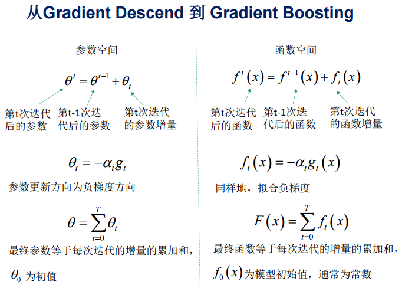
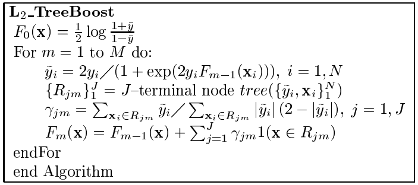

# GBDT

* [返回上层目录](../gradient-boosting.md)
* [GBDT概述](#GBDT概述)
  * [DT：回归树RegressionDecisionTree](#DT：回归树RegressionDecisionTree)
  * [GB：梯度迭代GradientBoosting](#GB：梯度迭代GradientBoosting)
  * [GBDT工作过程实例](#GBDT工作过程实例)
  * [Shrinkage（缩减）](#Shrinkage（缩减）)
  * [GBDT的适用范围](#GBDT的适用范围)
* [GBDT模型](#GBDT模型)
* [GBDT算法](#GBDT算法)
  * [GBDT残差回归算法](#GBDT残差回归算法)
    * [GBDT残差回归算法例子](#GBDT残差回归算法例子)
  * [GBDT梯度回归算法](#GBDT梯度回归算法)
  * [GBDT分类算法](#GBDT分类算法)
    * [二分类](#二分类)
    * [多分类](#多分类)
* [GBDT常用损失函数及其一阶导](#GBDT常用损失函数及其一阶导)
* [GBDT的正则化](#GBDT的正则化)
* [GBDT的优缺点](#GBDT的优缺点)

GBDT：**梯度迭代**（GB）的**回归决策树**（DT）。

GBDT本质只过不就是函数空间上的梯度下降法，使用了损失函数的一阶导数。

GBDT中采用的梯度下降是通过学习新的决策树减小残差实现的。

Gradient Boosting是一种广泛被用于回归、分类和排序任务的集成方法，于2001年被Friedman提出。

该类算法通过以上一轮基学习器的误差的负梯度为训练目标训练本轮的基学习器，不断降低集成模型在训练集上的偏差，实现高精度的集成 。

基于Gradient Boosting算法的学习器被称为Gradient Boosting Machine（GBM），如果说AdaBoost是boosting方法的开山之作，那么GBM就是boosting方法的集大成者。GBM几乎刷新了各个领域众多数据集的精度记录，有人认为GBM是性能最好的机器学习方法，这种说法有点激进，但通常各类数据竞赛赢家的策略里也确实都会有这类算法的方法或者思想。

GBDT在传统机器学习算法里面是对真实分布拟合的最好的几种算法之一，在前几年深度学习还没有大行其道之前，GBDT在各种竞赛是大放异彩。原因大概有几个

* 效果确实挺不错
* 既可以用于分类也可以用于回归
* 可以筛选特征

这三点实在是太吸引人了，导致在面试的时候大家也非常喜欢问这个算法。GBDT是通过采用加法模型（即基函数的线性组合），以及不断减小训练过程产生的残差来达到将数据分类或者回归的算法。GBDT通过多轮迭代，每轮迭代产生一个弱分类器，每个分类器在上一轮分类器的**残差**基础上进行训练。对弱分类器的要求一般是足够简单，并且是**低方差和高偏差（曲线平滑，但偏差大）**的。因为训练的过程是通过降低偏差来不断提高最终分类器的精度。

# GBDT概述

GBDT（Gradient Boosting Decision Tree：梯度提升决策树) 又叫MART（Multiple Additive Regression Tree：多重累计回归树），是一种迭代的决策树算法，该算法由多棵**决策树**组成，所有树的结论累加起来做最终答案。它在被提出之初就和SVM一起被认为是泛化能力（generalization）较强的算法。近些年更因为被用于**搜索排序**的机器学习模型而引起大家关注。

**第1~4节：GBDT算法内部究竟是如何工作的？**

**第5节：它可以用于解决哪些问题？**

****

在此先给出我比较推荐的两篇英文文献，喜欢英文原版的同学可直接阅读：

[[1]Boosting Decision Tree入门教程](http://www.schonlau.net/publication/05stata_boosting.pdf)

[[2]LambdaMART用于搜索排序入门教程 ](http://research.microsoft.com/pubs/132652/MSR-TR-2010-82.pdf)

GBDT主要由三个概念组成：Regression Decistion Tree（即DT)，Gradient Boosting（即GB)，Shrinkage（算法的一个重要演进分枝，目前大部分源码都按该版本实现）。搞定这三个概念后就能明白GBDT是如何工作的，要继续理解它如何用于搜索排序则需要额外理解RankNet概念，之后便功德圆满。下文将逐个碎片介绍，最终把整张图拼出来。

## DT：回归树RegressionDecisionTree

提起决策树（DT, Decision Tree）绝大部分人首先想到的就是C4.5分类决策树。但如果一开始就把GBDT中的树想成分类树，那就是一条歪路走到黑，一路各种坑，最终摔得都要咯血了还是一头雾水说的就是LZ自己啊有木有。咳嗯，所以说千万不要以为GBDT是很多棵分类树。决策树分为两大类，回归树和分类树。前者用于预测实数值，如明天的温度、用户的年龄、网页的相关程度；后者用于分类标签值，如晴天/阴天/雾/雨、用户性别、网页是否是垃圾页面。这里要强调的是，前者的结果加减是有意义的，如10岁+5岁-3岁=12岁，后者则无意义，如男+男+女=到底是男是女？ **GBDT的核心在于累加所有树的结果作为最终结果**，就像前面对年龄的累加（-3是加负3），而分类树的结果显然是没办法累加的，所以**GBDT中的树都是回归树，不是分类树，**这点对理解GBDT相当重要（尽管GBDT调整后也可用于分类但不代表GBDT的树是分类树）。那么回归树是如何工作的呢？

下面我们以对人的性别判别/年龄预测为例来说明，每个instance都是一个我们已知性别/年龄的人，而feature则包括这个人上网的时长、上网的时段、网购所花的金额等。

作为对比，先说分类树，我们知道C4.5分类树在每次分枝时，是穷举每一个feature的每一个阈值，找到使得按照feature<=阈值，和feature>阈值分成的两个分枝的熵最大的feature和阈值（熵最大的概念可理解成尽可能每个分枝的男女比例都远离1:1），按照该标准分枝得到两个新节点，用同样方法继续分枝直到所有人都被分入性别唯一的叶子节点，或达到预设的终止条件，若最终叶子节点中的性别不唯一，则以多数人的性别作为该叶子节点的性别。

回归树总体流程也是类似，不过在每个节点（不一定是叶子节点）都会得一个预测值，以年龄为例，该预测值等于属于这个节点的所有人年龄的平均值。分枝时穷举每一个feature的每个阈值找最好的分割点，但衡量最好的标准不再是最大熵，而是最小化均方差，即`(每个人的年龄-预测年龄)^2的总和` / `N`，或者说是每个人的预测误差平方和除以N。这很好理解，被预测出错的人数越多，错的越离谱，均方差就越大，通过最小化均方差能够找到最靠谱的分枝依据。分枝直到每个叶子节点上人的年龄都唯一（这太难了）或者达到预设的终止条件（如叶子个数上限），若最终叶子节点上人的年龄不唯一，则以该节点上所有人的平均年龄做为该叶子节点的预测年龄。若还不明白可以Google "Regression Tree"，或阅读本文的第一篇论文中Regression Tree部分。

## GB：梯度迭代GradientBoosting

好吧，我起了一个很大的标题，但事实上我并不想多讲Gradient Boosting的原理，因为不明白原理并无碍于理解GBDT中的Gradient Boosting。喜欢打破砂锅问到底的同学可以阅读这篇英文[wiki:Gradient_tree_boosting](http://en.wikipedia.org/wiki/Gradient_boosted_trees#Gradient_tree_boosting)。

Boosting，迭代，即通过迭代多棵树来共同决策。这怎么实现呢？难道是每棵树独立训练一遍，比如A这个人，第一棵树认为是10岁，第二棵树认为是0岁，第三棵树认为是20岁，我们就取平均值10岁做最终结论？--当然不是！且不说这是投票方法并不是GBDT，只要训练集不变，独立训练三次的三棵树必定完全相同，这样做完全没有意义。之前说过，GBDT是把所有树的结论累加起来做最终结论的，所以可以想到每棵树的结论并不是年龄本身，而是年龄的一个累加量。**GBDT的核心就在于，每一棵树学的是之前所有树结论和的残差**，这个**残差就是一个加预测值后能得真实值的累加量，这其实就是平方误差的一阶导数！**比如A的真实年龄是18岁，但第一棵树的预测年龄是12岁，差了6岁，即残差为6岁。那么在第二棵树里我们把A的年龄设为6岁去学习，如果第二棵树真的能把A分到6岁的叶子节点，那累加两棵树的结论就是A的真实年龄；如果第二棵树的结论是5岁，则A仍然存在1岁的残差，第三棵树里A的年龄就变成1岁，继续学。这就是Gradient Boosting在GBDT中的意义，简单吧。

## GBDT工作过程实例

还是年龄预测，简单起见训练集只有4个人，A、B、C、D，他们的年龄分别是14、16、24、26。其中A、B分别是高一和高三学生；C、D分别是应届毕业生和工作两年的员工。如果是用一棵传统的回归决策树来训练，会得到如下图1所示结果：

现在我们使用GBDT来做这件事，由于数据太少，我们限定叶子节点最多有两个，即每棵树都只有一个分枝，并且限定只学两棵树。我们会得到如下图2所示结果：

在第一棵树分枝和图1一样，由于A，B年龄较为相近，C,D年龄较为相近，他们被分为两拨，每拨用平均年龄作为预测值。此时计算残差（**残差的意思就是：A的预测值+A的残差=A的实际值**），所以A的残差就是14-15=-1（注意，A的预测值是指前面所有树累加的和，这里前面只有一棵树所以直接是15，如果还有树则需要都累加起来作为A的预测值）。进而得到A，B，C，D的残差分别为-1，1，-1，1。然后我们拿残差替代A、B、C、D的原值，到第二棵树去学习，如果我们的预测值和它们的残差相等，则只需把第二棵树的结论累加到第一棵树上就能得到真实年龄了。这里的数据显然是我可以做的，第二棵树只有两个值1和-1，直接分成两个节点。此时所有人的残差都是0，即每个人都得到了真实的预测值。

换句话说，现在A，B，C，D的预测值都和真实年龄一致了。Perfect!

A: 14岁高一学生，购物较少，经常问学长问题；预测年龄A = 15 – 1 = 14

B: 16岁高三学生；购物较少，经常被学弟问问题；预测年龄B = 15 + 1 = 16

C: 24岁应届毕业生；购物较多，经常问师兄问题；预测年龄C = 25 – 1 = 24

D: 26岁工作两年员工；购物较多，经常被师弟问问题；预测年龄D = 25 + 1 = 26 

那么**哪里体现了Gradient呢**？其实回到第一棵树结束时想一想，无论此时的cost function是什么，是均方差还是均差，只要它以误差作为衡量标准，残差向量(-1，1，-1，1)都是它的全局最优方向，这就是Gradient。

讲到这里我们已经把GBDT最核心的概念、运算过程讲完了！没错就是这么简单。不过讲到这里很容易发现三个问题：

**1）既然图1和图2 最终效果相同，为何还需要GBDT呢？**

答案是过拟合。过拟合是指为了让训练集精度更高，学到了很多”仅在训练集上成立的规律“，导致换一个数据集当前规律就不适用了。其实只要允许一棵树的叶子节点足够多，训练集总是能训练到100%准确率的（大不了最后一个叶子上只有一个instance)。在训练精度和实际精度（或测试精度）之间，后者才是我们想要真正得到的。

我们发现图1为了达到100%精度使用了3个feature（上网时长、时段、网购金额），其中分枝“上网时长>1.1h” 很显然已经过拟合了，这个数据集上A、B也许恰好A每天上网1.09h、B上网1.05小时，但用上网时间是不是>1.1小时来判断所有人的年龄很显然是有悖常识的；

相对来说图2的boosting虽然用了两棵树 ，但其实只用了2个feature就搞定了，后一个feature是问答比例，显然图2的依据更靠谱。（当然，这里是LZ故意做的数据，所以才能靠谱得如此狗血。实际中靠谱不靠谱总是相对的） **Boosting的最大好处在于，每一步的残差计算其实变相地增大了分错instance的权重，而已经分对的instance则都趋向于0。这样后面的树就能越来越专注那些前面被分错的instance**。就像我们做互联网，总是先解决60%用户的需求凑合着，再解决35%用户的需求，最后才关注那5%人的需求，这样就能逐渐把产品做好，因为不同类型用户需求可能完全不同，需要分别独立分析。如果反过来做，或者刚上来就一定要做到尽善尽美，往往最终会竹篮打水一场空。

**2）Gradient呢？不是“G”BDT么？**

到目前为止，从表面上看，我们的确没有用到求导的Gradient。在当前版本GBDT描述中，的确没有用到Gradient，该版本用残差作为全局最优的绝对方向，并不需要Gradient求解。

**但是，其实是用到了梯度的，是平方误差的一阶导数！**

**3）这不是boosting吧？Adaboost可不是这么定义的。**

这是boosting，但不是Adaboost。**GBDT不是Adaboost Decistion Tree。**就像提到决策树大家会想起C4.5，提到boost多数人也会想到Adaboost。Adaboost是另一种boost方法，它按分类对错，分配不同的weight，计算cost function时使用这些weight，从而让“错分的样本权重越来越大，使它们更被重视”。Bootstrap也有类似思想，它在每一步迭代时不改变模型本身，也不计算残差，而是从N个instance训练集中按一定概率重新抽取N个instance出来（单个instance可以被重复sample），对着这N个新的instance再训练一轮。由于数据集变了迭代模型训练结果也不一样，而一个instance被前面分错的越厉害，它的概率就被设的越高，这样就能同样达到逐步关注被分错的instance，逐步完善的效果。Adaboost的方法被实践证明是一种很好的防止过拟合的方法，但至于为什么则至今没从理论上被证明。GBDT也可以在使用残差的同时引入Bootstrap re-sampling，GBDT多数实现版本中也增加的这个选项，但是否一定使用则有不同看法。re-sampling一个缺点是它的随机性，即同样的数据集合训练两遍结果是不一样的，也就是模型不可稳定复现，这对评估是很大挑战，比如很难说一个模型变好是因为你选用了更好的feature，还是由于这次sample的随机因素。

## Shrinkage（缩减）

Shrinkage（缩减）的思想认为，每次走一小步逐渐逼近结果的效果，要比每次迈一大步很快逼近结果的方式更容易避免过拟合。即它不完全信任每一个棵残差树，它认为每棵树只学到了真理的一小部分，累加的时候只累加一小部分，通过多学几棵树弥补不足。用方程来看更清晰，即

没用Shrinkage时：（$y_i$表示第$i$棵树上$y$的预测值，$y_{(1~i)}$表示前$i$棵树$y$的综合预测值）

$$
y_{(i+1)}=\text{残差}(y_1\sim y_i)
$$
 其中： $\text{残差}(y_1\sim y_i) =  y_{\text{真实值}} - y_{(1\sim i)}$
$$
y_{(1\sim i)} = \sum(y_1, ..., y_i)
$$
Shrinkage不改变第一个方程，只把第二个方程改为： 

$$
y_{(1\sim i)} = y_{(1\sim i-1)} + \text{step} \times y_i
$$
即Shrinkage仍然以残差作为学习目标，但对于残差学习出来的结果，只累加一小部分（step x 残差）逐步逼近目标，step一般都比较小，如0.01~0.001（注意该step非gradient的step），导致各个树的残差是渐变的而不是陡变的。直觉上这也很好理解，不像直接用残差一步修复误差，而是只修复一点点，其实就是把大步切成了很多小步。**本质上，Shrinkage为每棵树设置了一个weight，累加时要乘以这个weight，但和Gradient并没有关系。**这个weight就是step。就像Adaboost一样，Shrinkage能减少过拟合发生也是经验证明的，目前还没有看到从理论的证明。

## GBDT的适用范围

该版本GBDT几乎可用于所有回归问题（线性/非线性），相对logistic regression仅能用于线性回归，GBDT的适用面非常广。亦可用于二分类问题（设定阈值，大于阈值为正例，反之为负例）。

# GBDT的经典论文

[《Greedy Function Approximation：A Gradient Boosting Machine》 Friedman](http://statweb.stanford.edu/~jhf/ftp/trebst.pdf)

Function approximation是从function space方面进行梯度下降，其将stagewise additive expansions和steepest-descent minimization结合起来。而由此而来的Gradient Boosting Decision Tree（GBDT）可以适用于回归和分类，都具有完整的，鲁棒性高，解释性好的优点。

# GBDT模型

提升方法实际采用**加法模型**（即**基函数的线性组合**）与前向分步算法。以**决策树**为基函数的提升方法称为提升树（boosting tree），以**决策树**为基函数，使用损失函数的一阶导数的提升方法称为梯度提升树（gradient boosting decision tree）。对分类问题决策树是二叉分类树，对回归问题决策树是二叉回归树。提升树模型可以表示为决策树的加法模型：
$$
f_M(x)=\sum_{m=1}^MT(x; \Theta_m)
$$
其中，$T(x; \Theta_m)$表示决策树；$\Theta_m$为决策树的参数；$M$为树的个数。

# GBDT算法

提升树算法采用前向分步算法。首先确定初始提升树$f_0(x) = 0$，第$m$歩的模型是
$$
f_m(x)=f_{m-1}(x)+T(x;\Theta_m)
$$
其中，$f_{m-1}(x)$为当前模型，通过经验风险极小化确定下一棵决策树的参数$\Theta_m$，
$$
\hat{\Theta}_m=\text{arg }\mathop{\text{min}}_{\Theta_m}\sum_{i=1}^NL(y_i, f_{m-1}(x_i)+T(x;\Theta_m))
$$
**由于树的线性组合可以很好地拟合训练数据，即使数据中的输入与输出之间的关系很复杂也是如此，所以提升树是一个高功能的学习算法**.

下面讨论针对不同问题的提升树学习算法，其主要区别在于使用的损失函数不同。包括用平方误差损失函数的回归问题，用指数损失函数的分类问题，以及用一般损失函数的一般决策问题。

目前GBDT有两个不同的描述版本，网上写GBDT的大都没有说清楚自己说的是哪个版本，以及不同版本之间的不同是什么，读者看不同的介绍会得到不同的算法描述，实在让人很头痛。

* 残差版本把GBDT说成一个残差迭代树，认为每一棵回归树都在学习前N-1棵树的残差，前面所说的主要在描述这一版本。**其实残差版本就是损失函数为平方误差的梯度版本**。
* Gradient版本把GBDT说成一个梯度迭代树，使用梯度下降法求解，认为每一棵回归树在学习前N-1棵树的梯度下降值。

GBDT的分类和回归算法其实本质是一样的，只是损失函数不同，但是分成两篇可以帮助更好的对比理解。

## GBDT残差回归算法

下面叙述回归问题的提升树。

己知一个训练数据集$T = \{ (x_1, y_1), (x_2, y_2), ... , (x_N, y_N) \}$，$x_i\in X\subseteq R^n$，$X$为输入空间，$y_i\in Y\subseteq R$，$Y$为输出空间。在决策树章节中已经讨论了回归树问题。如果将输入空间$X$划分为$J$个互不相交的区域$R_1, R_2, ... , R_J$，并且在每个区域上确定输出的常量，那么树可表示为
$$
T(x; \Theta)=\sum_{j=1}^Jc_jI(x\in R_j)
$$
其中，参数$\Theta = \{ (R_1, c_1), (R_2, c_2), ... , (R_J, c_J) \}$表示树的区域划分和各区域上的常数，$J$是回归树的复杂度即叶节点的个数。

回归问题提升树使用以下前向分步算法：
$$
\begin{aligned}
&f_0(x)=0\\
&f_m(x)=f_{m-1}(x)+T(x;\Theta_m),\quad m=1,2,...,M\\
&f_M(x)=\sum_{m=1}^MT(x;\Theta_m)\\
\end{aligned}
$$
在前向分步算法的第$m$步，给定当前模型$f_{m-1}(x)$，需求解
$$
\hat{\Theta}_m=\text{arg }\mathop{\text{min}}_{\Theta_m}\sum_{i=1}^NL(y_i,f_{m-1}(x_i)+T(x_i;\Theta_m))
$$
得到$\hat{\Theta}_m$，即第$m$颗决策树的参数。

当采用平方误差损失函数时，
$$
L(y,f(x))=(y-f(x))^2
$$
其损失变为：
$$
\begin{aligned}
&L(y,f_{m-1}(x)+T(x;\Theta_m))\\
=&[y-f_{m-1}(x)-T(x;\Theta_m)]^2\\
=&[r-T(x;\Theta_m)]^2
\end{aligned}
$$
这里，$r=y-f_{m-1}(x)$是当前模型拟合数据的残差。

为了使损失函数$L$的值最小，对$L$关于其中唯一的未知变量$T(x; \Theta_m)$求偏导（$f_{m-1}(x)$已经是已知的定值了），并令其等于0，即可得使得损失函数$L$最小的回归树$T(x; \Theta_m)$。具体步骤如下：
$$
\begin{aligned}
&\frac{\partial L(y,f_{m-1}(x)+T(x;\Theta_m))}{\partial T(x;\Theta)}\\
=&\frac{\partial [r-T(x;\Theta_m)]^2}{\partial T(x;\Theta)}\\
=&2[T(x;\Theta_m)-r]\\
=&0
\end{aligned}
$$
可得$T(x;\Theta_m)=r$。所以，对于回归问题的梯度提升算法来说，**只需要简单地拟合当前模型的残差**。这样，算法是相当简单的。

现将回归问题的提升算法叙述如下。

**回归问题的提升树（GBDT）算法**

输入：训练数据集$T= \{ (x_1,y_1), (x_2,y_2), ... , (x_N,y_N) \}$，$x_i \in X\subseteq R^n$，$y_i\in Y\subseteq R$；

输出：提升树$f_M(x)$。

（1）初始化$f_0(x)=0$

（2）对$m=1,2,...,M$：

（a）计算残差
$$
r_{mi}=y_i-f_{m-1}(x_i),\ i=1,2,...,N
$$
（b）拟合残差$r_{mi}$学习一个回归树，得到$T(x; \Theta_m)$

（c）更新
$$
f_m(x)=f_{m-1}(x)+T(x;\Theta_m)
$$
（3）得到回归问题提升树
$$
f_M(x)=\sum_{m=1}^MT(x;\Theta_m)
$$

### GBDT残差回归算法例子

预先说明：在本例中看到的基本分类器$x<v$或$x>v$，可以看作是由一个根结点直接连接两个叶结点的简单决策树，即所谓的决策树桩（decision stump）。

已知如下边所示的训练数据，$x$的取值范围为区间$[0.5, 10.5]$，$y$的取值范围为区间$[0.5, 10.0]$，学习这个回归问题的提升树模型，考虑只用树桩作为基函数。

| $x_i$ |  1   |  2   |  3   |  4   |  5   |  6   |  7   |  8   |  9   |  10  |
| :---: | :--: | :--: | :--: | :--: | :--: | :--: | :--: | :--: | :--: | :--: |
| $y_i$ | 5.56 | 5.70 | 5.91 | 6.40 | 6.80 | 7.05 | 8.90 | 8.70 | 9.00 | 9.05 |

解：按照上述GBDT算法，第1步求$f_1(x)$即回归树$T_1(x)$。

首先通过以下优化问题：
$$
\mathop{\text{min}}_{s}\left[ \mathop{\text{min}}_{c_1}\sum_{x_i\in R_1}(y_i-c_1)^2+\mathop{\text{min}}_{c_2}\sum_{x_i\in R_2}(y_i-c_2)^2 \right]
$$
求解训练数据的切分点$s$：
$$
R_1=\{ x| x\leqslant s \}, \quad R_2=\{ x| x > s \}
$$
容易求得在$R_1, R_2$内部使平方损失达到最小值的$c_1, c2$为
$$
c_1=\frac{1}{N_1}\sum_{x_i\in R_1}y_i,\quad c_2=\frac{1}{N_2}\sum_{x_i\in R_2}y_i
$$
这里，$N_1, N_2$是$R_1, R_2$的样本点数。

求训练数据的切分点。根据所给数据，考虑如下切分点：

1.5, 2.5, 3.5, 4.5, 5.5, 6.5, 7.5, 8.5, 9.5

对各切分点，不难求出相应的$R_1, R_2, c_1, c_2$及
$$
m(s)=\mathop{\text{min}}_{c_1}\sum_{x_i\in R_1}(y_i-c_1)^2+\mathop{\text{min}}_{c_2}\sum_{x_i\in R_2}(y_i-c_2)^2
$$
例如：当$s=1.5$时，$R_1=\{1\}, R_2=\{2, 3, ... , 10\}, c_1=5.56, c_2=7.50$，
$$
m(s)=\mathop{\text{min}}_{c_1}\sum_{x_i\in R_1}(y_i-c_1)^2+\mathop{\text{min}}_{c_2}\sum_{x_i\in R_2}(y_i-c_2)^2=0+15.72=15.72
$$
现将$s$及$m(s)$的计算结果列表如下

|  $s$   |  1.5  |  2.5  | 3.5  | 4.5  | 5.5  | 6.5  | 7.5  |  8.5  |  9.5  |
| :----: | :---: | :---: | :--: | :--: | :--: | :--: | :--: | :---: | :---: |
| $m(s)$ | 15.72 | 12.07 | 8.36 | 5.78 | 3.91 | 1.93 | 8.01 | 11.73 | 15.74 |

由上表可知，当$s=6.5$时，$m(s)$达到最小值，此时$R_1=\{ 1,2,...,6 \}$，$R_2=\{ 7,8,9,...,10 \}$，$c1=6.24$，$c2=8.91$，所以回归树$T_1(x)$为
$$
\begin{aligned}
&T_1(x)=
\left\{\begin{matrix}
&6.24,\quad x<6.5\\ 
&8.91,\quad x\geqslant 6.5
\end{matrix}\right.\\
&f_1(x)=T_1(x)
\end{aligned}
$$
用$f_1(x)$拟合训练数据的残差见下表，表中$r_{2i}=y_i - f_1(x), i = 1,2,...,10$。

|  $x_i$   |   1   |   2   |   3   |  4   |  5   |  6   |   7   |   8   |  9   |  10  |
| :--------: | :---: | :---: | :---: | :--: | :--: | :--: | :---: | :---: | :--: | :--: |
| $r_{2i}$ | -0.68 | -0.54 | -0.33 | 0.16 | 0.56 | 0.81 | -0.01 | -0.21 | 0.09 | 0.14 |

用$f_1(x)$拟合训练数据的平方损失误差：
$$
L(y,f_1(x))=\sum_{i=1}^{10}(y_i-f_1(x_i))^2=1.93
$$
第2步求$T_2(x)$。方法与求$T_1(x)$一样，只是拟合的数据是上表的残差。可以得到：
$$
\begin{aligned}
&T_2(x)=
\left\{\begin{matrix}
&-0.52,\quad x<3.5\\ 
&0.22,\quad x\geqslant 3.5
\end{matrix}\right.\\
&f_2(x)=T_1(x)+T_2(x)=
\left\{\begin{matrix}
&5.72,\quad &x<3.5\\ 
&6.46,\quad &3.5\leqslant x< 6.5\\
&9.13,\quad &x\geqslant 6.5\\
\end{matrix}\right.\\
\end{aligned}
$$
用$f_2(x)$拟合训练数据的平方损失误差是
$$
L(y,f_2(x))=\sum_{i=1}^{10}(y_i-f_2(x_i))^2=0.79
$$
继续求得
$$
\begin{aligned}
&T_3(x)=
\left\{\begin{matrix}
&0.15,\quad x<6.5\\ 
&-0.22,\quad x\geqslant 6.5
\end{matrix}\right.
\quad L(y,f_3(x))=0.47\\
&T_4(x)=
\left\{\begin{matrix}
&-0.16,\quad x<4.5\\ 
&0.11,\quad x\geqslant 4.5
\end{matrix}\right.
\quad L(y,f_4(x))=0.30\\
&T_5(x)=
\left\{\begin{matrix}
&0.07,\quad x<6.5\\ 
&-0.11,\quad x\geqslant 6.5
\end{matrix}\right.
\quad L(y,f_5(x))=0.23\\
&T_6(x)=
\left\{\begin{matrix}
&-0.15,\quad x<2.5\\ 
&0.04,\quad x\geqslant 2.5
\end{matrix}\right.\\
\end{aligned}
$$

$$
\begin{aligned}
&f_6(x)=f_5(x)+T_6(x)=T_1(x)+T_2(x)+...+T_5(x)+T_6(x)\\
=&\left\{\begin{matrix}
&5.63,\quad& x<2.5\\ 
&5.82,\quad& 2.5\leqslant x< 3.5\\
&6.56,\quad& 3.5\leqslant x< 4.5\\
&6.83,\quad& 4.5\leqslant x< 6.5\\
&8.95,\quad& x\geqslant 6.5\\
\end{matrix}\right.\\
\end{aligned}
$$

用$f_6(x)$拟合训练数据的平方损失误差是
$$
L(y,f_6(x))=\sum_{i=1}^{10}(y_i-f_6(x_i))^2=0.17
$$
**假设此时已满足误差要求**，那么$f(x)=f_6(x)$即为所求提升树。

## GBDT梯度回归算法

梯度提升本质只过不就是函数空间上的梯度下降法，使用了损失函数的一阶导数。

提升树利用加法模型与前向分步算法实现学习的优化过程。当损失函数是平方损失和指数损失时，每一步优化是很简单的。但对于一般损失函数而言，往往每一步优化并不那么容易。针对这一问题，Freidman提出了梯度提升（gradient boosting）算法。这是利用**最速下降法**的近似方法，其关键是利用损失函数的负梯度在当前模型的值
$$
-\left[ \frac{\partial L(y,f(x_i))}{\partial f(x_i)} \right]_{f(x)=f_{m-1}(x)}
$$
作为回归问题提升算法中的残差的近似值，拟合一个回归树。

**可以这么理解：这是一个泛函问题，把决策树$f(x)$看成是自变量$\theta$，则我们要求的是使损失函数$L(y, \theta)$达到最小时的$\theta$，通过梯度下降求，即如下式**
$$
\theta_{i+1}=\theta_i-\alpha\frac{\partial L(y,\theta_i)}{\partial \theta_i}
$$
**最终参数$\theta$等于历次迭代的增量的累加和：**
$$
\theta=\sum_{t=0}^T-\alpha\frac{\partial L(y,\theta_t)}{\partial \theta_t}
$$

注：上图来源[GBDT算法原理与系统设计简介](http://wepon.me/files/gbdt.pdf)

**GBDT梯度提升算法：**

输入：训练数据集$T= \{ (x_1,y_1), (x_2,y_2), ... , (x_N,y_N) \}$, $x_i\in X\subseteq  R^n$，$y_i\in Y\subseteq R$；

输出：回归树$\hat{f}(x)$。

**（1）**初始化
$$
f_0(x)=\text{arg }\mathop{\text{min}}_c\sum_{i=1}^NL(y_i,c)
$$
**（2）**对$m=1,2,...,M$

（a）对$i=1,2,...,N$，计算
$$
r_{mi}=-\left[ \frac{\partial L(y,f(x_i))}{\partial f(x_i)} \right]_{f(x)=f_{m-1}(x)}
$$
（b）对$r_{mi}$拟合一个回归树，得到第$m$棵树的叶子节点区域$R_{mj}, j=1,2,...,J$

（c）对$j=1,2,...,J$，计算
$$
c_{mj}=\text{arg }\mathop{\text{min}}_c\sum_{x_i\in R_{mj}}L(y_i,f_{m-1}(x_i)+c)
$$
（d）更新
$$
f_m=f_{m-1}(x)+\sum_{j=1}^Jc_{mj}I(x\in R_{mj})
$$
**（3）**得到回归树
$$
\hat{f}(x)=f_M(x)=\sum_{m=1}^M\sum_{j=1}^Jc_{mj}I(x\in R_{mj})
$$
算法解释：

- 算法第1步初始化，估计使损失函数极小化的常数，它是只有一个根节点的树
- 第2（a）步计算损失函数的负梯度在当前模型的值，将它作为残差的估计。对于平方损失函数，它就是通常所说的残差；**对于一般损失函数（二阶导及以上不为零），它就是残差的近似值（泰勒展开，只取一阶导近似）**
- 第2（b）步估计回归树叶节点区域，以拟合残差的近似值
- 第2（c）步利用线性搜索估计叶节点区域的值，使损失函数极小化
- 第2（d）步更新回归树
- 第3步得到输出的最终模型$\hat{f}(x)$

## GBDT分类算法

接下来介绍GBDT分类算法，GBDT的分类算法从思想上和GBDT的回归算法没有区别，但是由于样本输出不是连续的值，而是离散的类别，导致无法直接从输出类别去拟合类别输出的误差。

要解决这个问题有两种方法：

一种是用指数损失函数，此时GBDT退化为Adaboost算法，只需将AdaBoost算法中的基本分类器限制为二类分类树即可，可以说这时的提升树算法是AdaBoost算法的特殊情况，这里不再讨论；

另一种是使用类似于Logistic回归的对数似然损失函数的方法。也就是说，我们用的是类别的预测概率值和真实概率值的差来拟合损失。本文仅讨论使用对数似然损失函数的GBDT分类算法。对于对数似然损失函数，又有二元分类和多元分类的区别。

大家将可以看到，对于回归和分类，其实GBDT过程简直就是一模一样的。如果说最大的不同的话，那就是在于由于loss function不同而引起的初始化不同、叶子节点取值不同。

### 二分类

这里是根据Friedman的GBDT经典论文[《Greedy Function Approximation：A Gradient Boosting Machine》 Friedman](http://statweb.stanford.edu/~jhf/ftp/trebst.pdf)写的。

采用负二项对数似然损失函数（negative binomial log-likelihood）作为学习器的损失函数：
$$
L(y,F)=\text{log}(1+\text{exp}(-2yF)),\quad y\in \{-1,1\}
$$
其中，
$$
F(x)=\frac{1}{2}\text{log}\left[ \frac{\text{Pr}(y=1|x)}{\text{Pr}(y=-1|x)} \right]
$$
这里的$P_r(y=1|x)$我理解为分类器预测样本$x$为1的概率，$P_r(y=-1|x)$为分类器预测样本$x$为-1的概率。

计算损失函数的负梯度有
$$
\tilde{y}_i=-\left[ \frac{\partial L(y_i,F(x_i))}{\partial F(x_i)} \right]_{F(x)=F_{m-1}(x)}=\frac{2y_i}{1+\text{exp}(2y_iF_{m-1}(x_i))}
$$
当回归树作为基分类器，每一个叶子节点的估计值在该损失函数下的计算公式为
$$
\gamma_{jm}=\text{arg }\mathop{\text{min}}_{\gamma}\sum_{x_i\in R_{jm}}\text{log}(1+\text{exp}(-2y_i(F_{m-1}(x_i)+\gamma)))
$$
然而上式没有一个解析解。我们通过Newton-Raphson迭代公式来近似求解，估计结果为
$$
\gamma_{jm}=\frac{\sum_{x_i\in R_{jm}}\tilde{y}_i}{\sum_{x_i\in R_{jm}}|\tilde{y}_i|(2-|\tilde{y}_i|)}
$$
则可得出如下的基于回归树的似然梯度提升算法：

最终近似得出的$F_M(x)$与对数几率有关。则可反推出概率估计：
$$
\begin{aligned}
p_+(x)=\hat{\text{Pr}}(y=1|x)=\frac{1}{1+e^{-2F_M(x)}}\\
p_-(x)=\hat{\text{Pr}}(y=-1|x)=\frac{1}{1+e^{2F_M(x)}}
\end{aligned}
$$
有了概率，就可以反过来用于分类：
$$
\hat{y}(x)=2\cdot I[c(-1,1)p_+(x)>c(1,-1)p_-(x)]-1
$$
其中，$c(\hat{y}, y)$是真实值为$y$而预测值为$\hat{y}$时的损失函数值。

注：

上述算法就是GBDT用于分类任务时，loss funcion选用logloss的算法流程。 可以看到，和回归任务是一样的，并没有什么特殊的处理环节。 

其实在sklearn源码里面，虽然回归任务的模型定义是GradientBoostingRegressor()而分类任务是GradientBoostingClassifier()，但是这两者区分开来是为了方便用户使用，最终两者都是共同继承BaseGradientBoosting()，上述算法这些流程都是在BaseGradientBoosting()完成的，GradientBoostingRegressor()、GradientBoostingClassifier()只是完成一些学习器参数配置的任务。

### 多分类

GBDT采用多类逻辑损失函数（muti-class log-loss）作为损失函数： 
$$
L(\{ y_k,F_k(x) \}^K_1)=-\sum_{k=1}^Ky_k\text{log}\ p_k(x)
$$
这里的$y_k\in [0,1]$，使用softmax来计算最后的类别概率：
$$
p_k(x)=\text{exp}(F_k(x))/\sum_{l=1}^K\text{exp}(F_l(x))
$$
从上式中我们可以得出，对于多分类问题，我们需要为每个类别创建一棵回归树$F_l(x) = 1, 2, ... , k$，每一棵树用来预测一类的概率。

根据损失函数计算负梯度为
$$
\tilde{y}_{ik}=-\left[ \frac{\partial L(\{ y_{il},F_l(x_i) \}^K_{l=1})}{\partial F_K(x_i)} \right]_{\{F_l(x)=F_{l,m-1}(x)\}_1^K}=y_{ik}-p_{k,m-1}(x_i)
$$
叶子节点的估计公式为
$$
\{ \gamma_{jkm} \}=\text{arg }\mathop{\text{min}}_{\gamma_{jk}}\sum_{i=1}^N\sum_{k=1}^K\phi\left( y_{ik},F_{k,m-1}(x_i)+\sum_{j=1}^J\gamma_{jk}I(x_i\in R_{jm}) \right)
$$
同样的通过Newton-Raphson公式来近似求解，估计结果为
$$
\gamma_{jkm}=\frac{K-1}{K}\frac{\sum_{x_i\in R_{jkm}}\tilde{y}_{ik}}{\sum_{x_i\in R_{jkm}}|\tilde{y}_{ik}|(1-|\tilde{y}_{ik}|)}
$$
得到分类器的输出结果以后即可通过softmax计算得到最后的类别概率。

这篇文章里有多分类的简单例子讲解：[GBDT原理与实践-多分类篇](https://blog.csdn.net/qq_22238533/article/details/79199605)，然而限于我时间的关系，这里就不展开了。

# GBDT常用损失函数及其一阶导

这里我们再对常用的GBDT损失函数做一个总结。

* 对于**分类**算法，其损失函数一般有对数损失函数和指数损失函数两种：

  * 如果是指数损失函数，则损失函数表达式为
    $
    L(y,f(x))=\text{exp}(-yf(x))
    $
    其负梯度计算和叶子节点的最佳残差拟合参见Adaboost章节。

  * 如果是对数损失函数，分为二元分类和多元分类两种，参见上面的“GBDT分类算法”的“二分类”和“多分类”两小节。

* 对于**回归**算法，常用损失函数有如下4种：

  * 均方差，这个是最常见的回归损失函数了
    $
    L(y,f(x))=(y-f(x))^2
    $

  * 绝对损失，这个损失函数也很常见
    $
    L(y,f(x))=|y-f(x)|
    $
    对应负梯度误差为：
    $
    \text{sign}(y_i-f(x_i))
    $

  * Huber损失，它是均方差和绝对损失的折衷产物，对于远离中心的异常点，采用绝对损失，而中心附近的点采用均方差。这个界限一般用分位数点度量。损失函数如下：
    $
    \begin{aligned}
    L(y,f(x))=\left\{\begin{matrix}
    &\frac{1}{2}(y-f(x))^2\quad &|y-f(x)|\leqslant \delta\\ 
    &\delta(|y-f(x)|-\frac{\delta}{2})\quad &|y-f(x)|> \delta\\ 
    \end{matrix}\right.
    \end{aligned}
    $
    对应的负梯度误差为：
    $
    \begin{aligned}
    r(y_i,f(x_i))=\left\{\begin{matrix}
    &y_i-f(x_i)\quad &|y-f(x)|\leqslant \delta\\ 
    &\delta\  \text{sign}(y_i-f(x_i))\quad &|y-f(x)|> \delta\\ 
    \end{matrix}\right.
    \end{aligned}
    $

  * 分位数损失。它对应的是分位数回归的损失函数，表达式为
    $
    L(y,f(x))=\sum_{y\geqslant f(x)}\theta|y-f(x)|+\sum_{y< f(x)}(1-\theta)|y-f(x)|
    $
    其中θ为分位数，需要我们在回归前指定。对应的负梯度误差为：
    $
    \begin{aligned}
    r(y_i,f(x_i))=\left\{\begin{matrix}
    &\theta\quad &y_i\geqslant f(x_i)\\ 
    &\theta-1\quad &y_i< f(x_i)\\ 
    \end{matrix}\right.
    \end{aligned}
    $
    对于Huber损失和分位数损失，主要用于健壮回归，也就是减少异常点对损失函数的影响。

# GBDT的正则化

和Adaboost一样，我们也需要对GBDT进行正则化，防止过拟合。GBDT的正则化主要有三种方式。

（1）第一种是和Adaboost类似的正则化项，即**步长**（learning rate）。定义为$ν$，对于前面的弱学习器的迭代
$$
f_k(x)=f_{k-1}(x)+h_k(x)
$$
如果我们加上了正则化项，则有
$$
f_k(x)=f_{k-1}(x)+v\cdot h_k(x)
$$
ν的取值范围为$0<ν\leqslant 10$。对于同样的训练集学习效果，较小的$v$意味着我们需要更多的弱学习器的迭代次数。通常我们用步长和迭代最大次数一起来决定算法的拟合效果。

（2）第二种正则化的方式是通过**子采样比例**（subsample）。取值为(0,1]。注意这里的子采样和随机森林不一样，随机森林使用的是放回抽样，而这里是不放回抽样。如果取值为1，则全部样本都使用，等于没有使用子采样。如果取值小于1，则只有一部分样本会去做GBDT的决策树拟合。选择小于1的比例可以减少方差，即防止过拟合，但是会增加样本拟合的偏差，因此取值不能太低。推荐在[0.5, 0.8]之间。

使用了子采样的GBDT有时也称作随机梯度提升树(Stochastic Gradient Boosting Tree, SGBT)。由于使用了子采样，程序可以通过采样分发到不同的任务去做boosting的迭代过程，最后形成新树，从而减少弱学习器难以并行学习的弱点。（注：这一点没明白。。） 

（3）第三种是对于弱学习器即CART回归树进行正则化**剪枝**。在决策树章节里我们已经讲过，这里就不重复了。

# GBDT的优缺点

GBDT终于讲完了，GDBT本身并不复杂，不过要吃透的话需要对集成学习的原理，决策树原理和各种损失函树有一定的了解。由于GBDT的卓越性能，只要是研究机器学习都应该掌握这个算法，包括背后的原理和应用调参方法。目前GBDT的算法比较好的库是xgboost。当然scikit-learn也可以。

最后总结下GBDT的优缺点。

GBDT主要的**优点**有：

* GBDT是拿Decision Tree作为GBM里的弱分类器，GBDT的优势首先得益于Decision Tree本身的一些良好特性，具体可以列举如下：
  * Decision Tree可以很好的处理missing feature，这是他的天然特性，因为决策树的每个节点只依赖一个feature，如果某个feature不存在，这颗树依然可以拿来做决策，只是少一些路径。像逻辑回归，SVM就没这个好处
  * Decision Tree可以很好的处理各种类型的feature，也是天然特性，很好理解，同样逻辑回归和SVM没这样的天然特性
  * 对特征空间的outlier有鲁棒性，因为每个节点都是$x < T$的形式，至于大多少，小多少没有区别，outlier不会有什么大的影响，同样逻辑回归和SVM没有这样的天然特性
  * 如果有不相关的feature，没什么干扰，如果数据中有不相关的feature，顶多这个feature不出现在树的节点里。逻辑回归和SVM没有这样的天然特性（但是有相应的补救措施，比如逻辑回归里的L1正则化）
  * 数据规模影响不大，因为我们对弱分类器的要求不高，作为弱分类器的决策树的深度一般设的比较小，即使是大数据量，也可以方便处理。像SVM这种数据规模大的时候训练会比较麻烦

* 可以灵活处理各种类型的数据，包括连续值和离散值

* 在相对少的调参时间情况下，预测的准确率也可以比较高。这个是相对SVM来说的
* GBM 在损失函数的选择上有更大的灵活性
* 使用一些健壮的损失函数，对异常值的鲁棒性非常强。比如Huber损失函数和Quantile损失函数

GBDT的主要**缺点**有：

* 决策树本身带来的缺陷。Decision Tree通常在给定的不带噪音的问题上，它能达到的最佳分类效果还是不如SVM，逻辑回归之类的。但是，我们实际面对的问题中，往往有很大的噪音，使得Decision Tree这个弱势就不那么明显了。而且，GBDT通过不断的叠加组合多个小的Decision Tree，他在不带噪音的问题上也能达到很好的分类效果。换句话说，通过GBDT训练组合多个小的Decision Tree往往要比一次性训练一个很大的Decision Tree的效果好很多。因此不能把GBDT理解为一颗大的决策树，几颗小树经过叠加后就不再是颗大树了，它比一颗大树更强。 

* 由于弱学习器之间存在依赖关系，难以并行训练数据。不过可以通过自采样的SGBT来达到部分并行。

# 参考资料

- 《统计学习方法》李航

本文框架主要参考此书对应章节内容。

* [GBDT（MART） 迭代决策树入门教程 | 简介](http://blog.csdn.net/w28971023/article/details/8240756)

"GBDT概述"这一小节主要参考的就是此文章。

* [机器学习教程 之 梯度提升方法：GBDT处理分类问题](https://blog.csdn.net/Liangjun_Feng/article/details/80668461)

“GBDT分类算法”这一小节参考了此文章。

* [梯度提升树(GBDT)原理小结](https://www.cnblogs.com/pinard/p/6140514.html)

“GBDT常用损失函数及其一阶导”这一小节参考了此文章。

* [梯度提升树(GBDT)原理小结](https://www.cnblogs.com/pinard/p/6140514.html)

“GBDT的正则化”和“GBDT的优缺点”一节参考此博客。

* [GBDT理论知识总结](https://www.cnblogs.com/bentuwuying/p/6667267.html)

“GBDT的优缺点”一节参考此博客。

===

[从一道数学题到GBDT原理的部分推导](https://zhuanlan.zhihu.com/p/76002032)

[面试官如何判断面试者的机器学习水平？](https://www.zhihu.com/question/62482926/answer/781604373)

