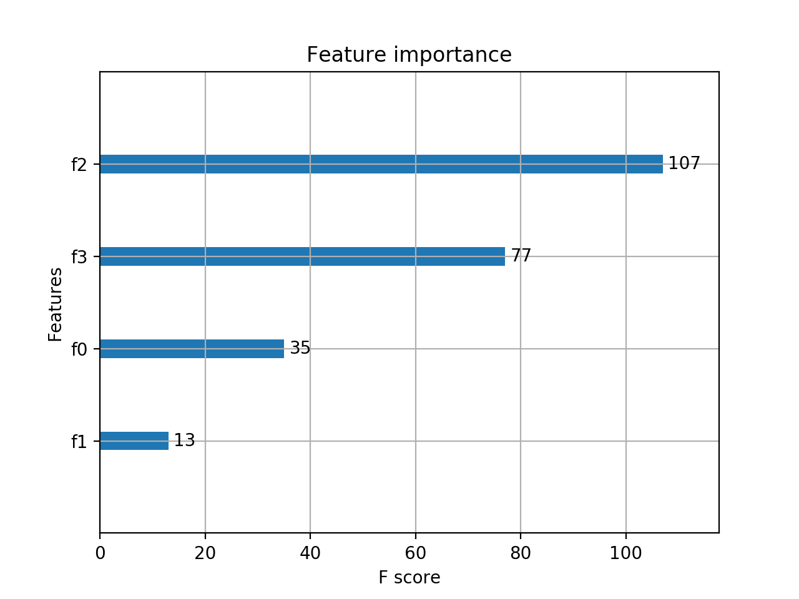
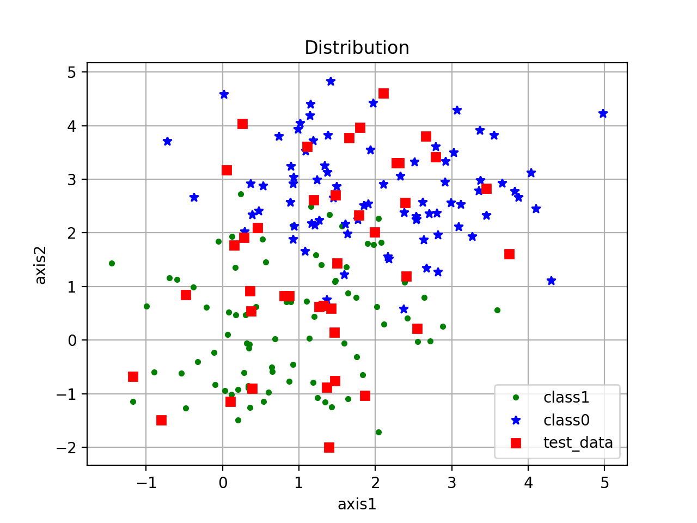
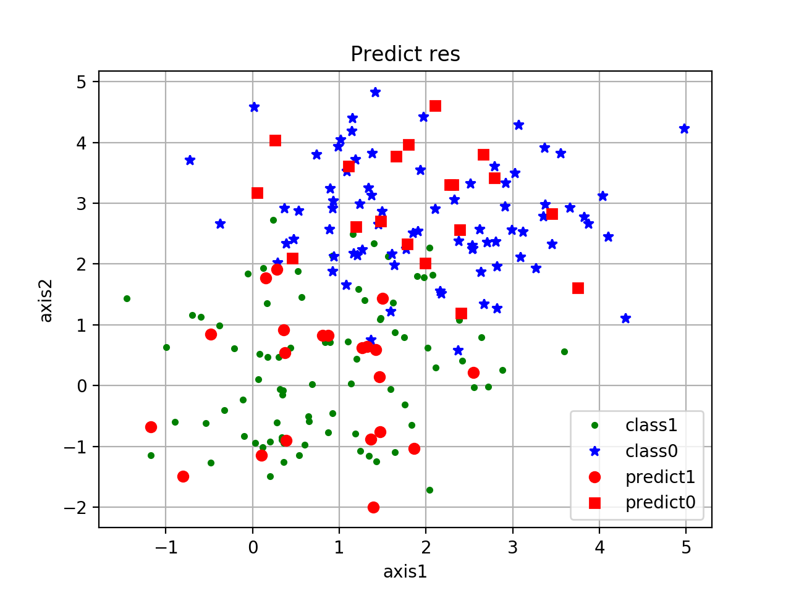
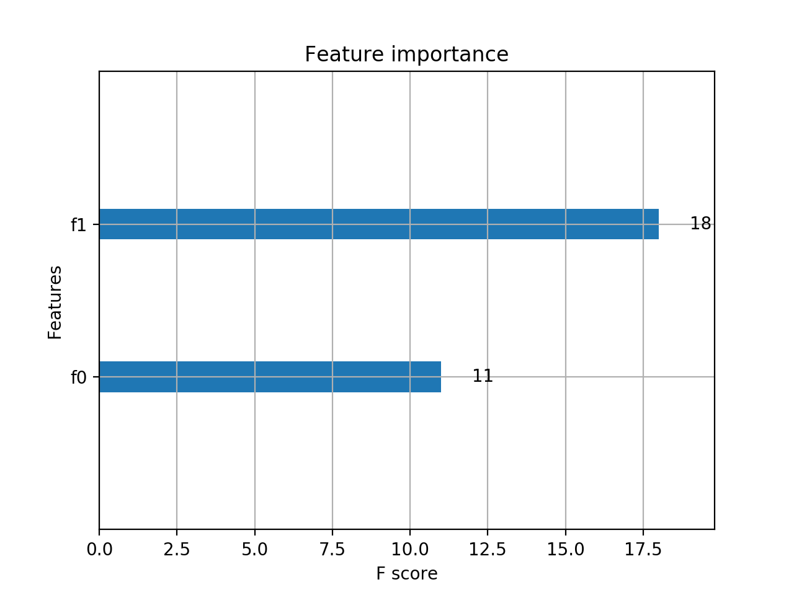
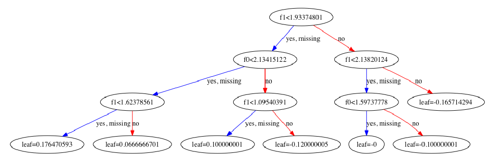
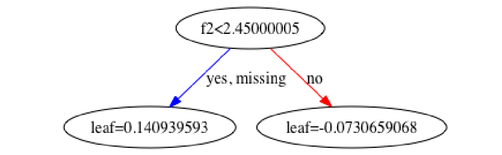
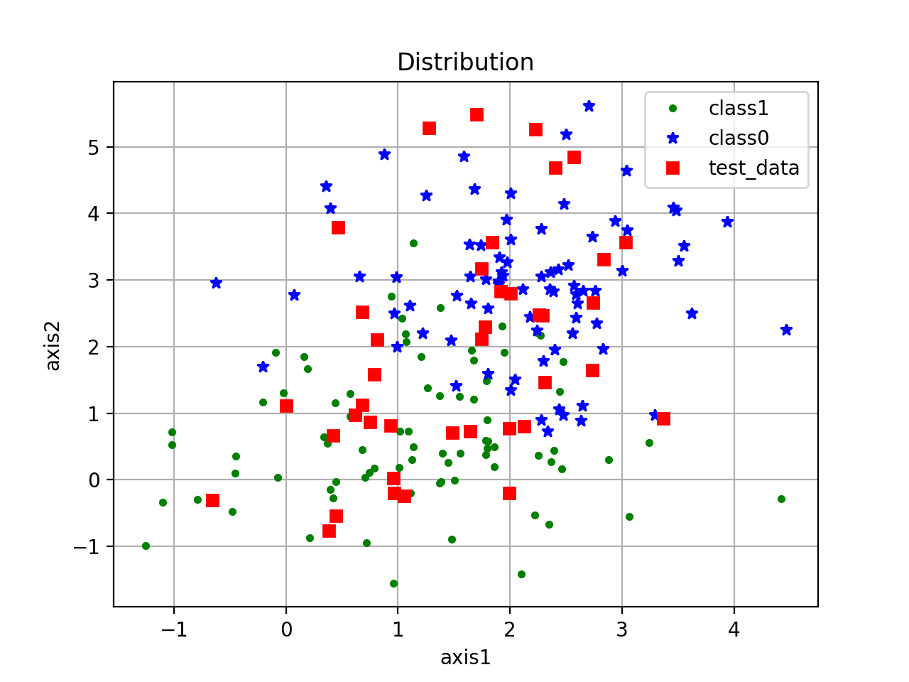
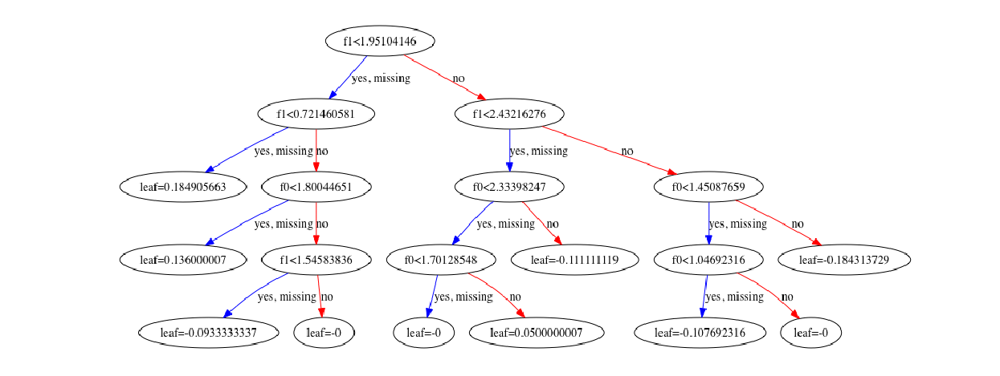

# XGBoost实践

* [返回上层目录](../xgboost.md)
* [XGBoost常见面试题](#XGBoost常见面试题)
  * [简单介绍一下XGBoost ](#简单介绍一下XGBoost )
  * [XGBoost与GBDT有什么不同](#XGBoost与GBDT有什么不同)
  * [XGBoost为什么使用泰勒二阶展开](#XGBoost为什么使用泰勒二阶展开)
  * [XGBoost为什么可以并行训练](#XGBoost为什么可以并行训练)
  * [XGBoost为什么快](#XGBoost为什么快)
  * [XGBoost防止过拟合的方法](#XGBoost防止过拟合的方法)
  * [XGBoost如何处理缺失值](#XGBoost如何处理缺失值)
  * [XGBoost中叶子结点的权重如何计算出来](#XGBoost中叶子结点的权重如何计算出来)
  * [XGBoost中的一棵树的停止生长条件](#XGBoost中的一棵树的停止生长条件)
  * [RF和GBDT的区别](#RF和GBDT的区别)
  * [XGBoost如何处理不平衡数据](#XGBoost如何处理不平衡数据)
  * [比较LR和GBDT，说说什么情景下GBDT不如LR](#比较LR和GBDT，说说什么情景下GBDT不如LR)
  * [XGBoost中如何对树进行剪枝](#XGBoost中如何对树进行剪枝)
  * [XGBoost如何选择最佳分裂点](#XGBoost如何选择最佳分裂点)
  * [XGBoost的Scalable性如何体现](#XGBoost的Scalable性如何体现)
  * [XGBoost如何评价特征的重要性](#XGBoost如何评价特征的重要性)
  * [XGBooost参数调优的一般步骤](#XGBooost参数调优的一般步骤)
  * [XGBoost模型如果过拟合了怎么解决](#XGBoost模型如果过拟合了怎么解决)
  * [为什么XGBoost相比某些模型对缺失值不敏感](#为什么XGBoost相比某些模型对缺失值不敏感)
* [XGBoost代码实践](#XGBoost代码实践)
  * [XGBoost运行环境搭建](#XGBoost运行环境搭建)
    * [通过pip安装](#通过pip安装)
    * [通过源码编译安装](#通过源码编译安装)
  * [XGBoost参数详解](#XGBoost参数详解)
    * [常规参数](#常规参数)
    * [模型参数Tree Booster](#模型参数Tree Booster)
    * [模型参数Linear Booster](#模型参数Linear Booster)
    * [学习任务参数](#学习任务参数)
    * [min_child_weight参数详解](#min_child_weight参数详解)
    * [正常调参方法](#正常调参方法)
  * [XGBoost实战](#XGBoost实战)
    * [数据格式](#数据格式)
    * [代码简单实践：毒蘑菇判定](#代码简单实践：毒蘑菇判定)
    * [基于XGBoost原生接口的分类](#基于XGBoost原生接口的分类)
    * [基于XGBoost原生接口的回归](#基于XGBoost原生接口的回归)
    * [基于Scikit-learn接口的分类](#基于Scikit-learn接口的分类)
    * [基于Scikit-learn接口的回归](#基于Scikit-learn接口的回归)


# XGBoost常见面试题

## 简单介绍一下XGBoost 

首先需要说一说GBDT，它是一种基于boosting增强策略的加法模型，训练的时候采用前向分布算法进行贪婪的学习，每次迭代都学习一棵CART树来拟合之前 t-1 棵树的预测结果与训练样本真实值的残差。

XGBoost对GBDT进行了一系列优化，比如损失函数进行了二阶泰勒展开、目标函数加入正则项、支持并行和默认缺失值处理等，在可扩展性和训练速度上有了巨大的提升，但其核心思想没有大的变化。

## XGBoost与GBDT有什么不同

- **基分类器**：XGBoost的基分类器不仅支持CART决策树，还支持线性分类器，此时XGBoost相当于带L1和L2正则化项的Logistic回归（分类问题）或者线性回归（回归问题）。
- **导数信息**：XGBoost对损失函数做了二阶泰勒展开，GBDT只用了一阶导数信息，并且XGBoost还支持自定义损失函数，只要损失函数一阶、二阶可导。
- **正则项**：XGBoost的目标函数加了正则项， 相当于预剪枝，使得学习出来的模型更加不容易过拟合。
- **列抽样**：XGBoost支持列采样，与随机森林类似，用于防止过拟合。
- **缺失值处理**：对树中的每个非叶子结点，XGBoost可以自动学习出它的默认分裂方向。如果某个样本该特征值缺失，会将其划入默认分支。
- **并行化**：注意不是tree维度的并行，而是特征维度的并行。XGBoost预先将每个特征按特征值排好序，存储为块结构，分裂结点时可以采用多线程并行查找每个特征的最佳分割点，极大提升训练速度。

## XGBoost为什么使用泰勒二阶展开

- **精准性**：相对于GBDT的一阶泰勒展开，XGBoost采用二阶泰勒展开，可以更为精准的逼近真实的损失函数
- **可扩展性**：损失函数支持自定义，只需要新的损失函数二阶可导。

## XGBoost为什么可以并行训练

- XGBoost的并行，并不是说每棵树可以并行训练，XGB本质上仍然采用boosting思想，每棵树训练前需要等前面的树训练完成才能开始训练。
- XGBoost的并行，指的是特征维度的并行：在训练之前，每个特征按特征值对样本进行预排序，并存储为Block结构，在后面查找特征分割点时可以重复使用，而且特征已经被存储为一个个block结构，那么在寻找每个特征的最佳分割点时，可以利用多线程对每个block并行计算。

## XGBoost为什么快

- **分块并行**：训练前每个特征按特征值进行排序并存储为Block结构，后面查找特征分割点时重复使用，并且支持并行查找每个特征的分割点
- **候选分位点**：每个特征采用常数个分位点作为候选分割点
- **CPU cache 命中优化**： 使用缓存预取的方法，对每个线程分配一个连续的buffer，读取每个block中样本的梯度信息并存入连续的Buffer中。
- **Block 处理优化**：Block预先放入内存；Block按列进行解压缩；将Block划分到不同硬盘来提高吞吐

## XGBoost防止过拟合的方法

XGBoost在设计时，为了防止过拟合做了很多优化，具体如下：

- **目标函数添加正则项**：叶子节点个数+叶子节点权重的L2正则化
- **列抽样**：训练的时候只用一部分特征（不考虑剩余的block块即可）
- **子采样**：每轮计算可以不使用全部样本，使算法更加保守
- **shrinkage**: 可以叫学习率或步长，为了给后面的训练留出更多的学习空间

## XGBoost如何处理缺失值

XGBoost模型的一个优点就是允许特征存在缺失值。对缺失值的处理方式如下：

- 在特征k上寻找最佳split point时，不会对该列特征missing的样本进行遍历，而只对该列特征值为non-missing的样本上对应的特征值进行遍历，通过这个技巧来减少了为稀疏离散特征寻找split point的时间开销。
- 在逻辑实现上，为了保证完备性，会将该特征值missing的样本分别分配到左叶子结点和右叶子结点，两种情形都计算一遍后，选择分裂后增益最大的那个方向（左分支或是右分支），作为预测时特征值缺失样本的默认分支方向。
- 如果在训练中没有缺失值而在预测中出现缺失，那么会自动将缺失值的划分方向放到右子结点。

## XGBoost中叶子结点的权重如何计算出来

XGBoost目标函数最终推导形式如下：
$$
\begin{aligned}
\tilde{L}^{(t)}&=\sum_{i=1}^n\left[ g_iw_{q(x_i)}+\frac{1}{2}h_iw_{q(x_i)}^2 \right]+\gamma T +\lambda\frac{1}{2}\sum_{j=1}^Tw_j^2\\
&=\sum_{j=1}^T\left[ \left(\sum_{i\in I_j}g_i\right)w_j+\frac{1}{2}\left(\sum_{i\in I_j}h_i+\lambda\right)w^2_j \right]+\gamma T\\
&=\sum_{j=1}^T\left[ G_jw_j+\frac{1}{2}\left(H_j+\lambda\right)w^2_j \right]+\gamma T\\
\end{aligned}
$$
利用一元二次函数求最值的知识，当目标函数达到最小值$Obj^{*}$时，每个叶子结点的权重为$w^{*}_j$。

具体公式如下：


## XGBoost中的一棵树的停止生长条件

- 当新引入的一次分裂所带来的增益Gain<0时，放弃当前的分裂。这是训练损失和模型结构复杂度的博弈过程。
- 当树达到最大深度时，停止建树，因为树的深度太深容易出现过拟合，这里需要设置一个超参数max_depth。
- 当引入一次分裂后，重新计算新生成的左、右两个叶子结点的样本权重和。如果任一个叶子结点的样本权重低于某一个阈值，也会放弃此次分裂。这涉及到一个超参数:最小样本权重和，是指如果一个叶子节点包含的样本数量太少也会放弃分裂，防止树分的太细。

## RF和GBDT的区别

**相同点：**

- 都是由多棵树组成，最终的结果都是由多棵树一起决定。

**不同点：**

- **集成学习**：RF属于bagging思想，而GBDT是boosting思想
- **偏差-方差权衡**：RF不断的降低模型的方差，而GBDT不断的降低模型的偏差
- **训练样本**：RF每次迭代的样本是从全部训练集中有放回抽样形成的，而GBDT每次使用全部样本
- **并行性**：RF的树可以并行生成，而GBDT只能顺序生成(需要等上一棵树完全生成)
- **最终结果**：RF最终是多棵树进行多数表决（回归问题是取平均），而GBDT是加权融合
- **数据敏感性**：RF对异常值不敏感，而GBDT对异常值比较敏感
- **泛化能力**：RF不易过拟合，而GBDT容易过拟合

## XGBoost如何处理不平衡数据

对于不平衡的数据集，例如用户的购买行为，肯定是极其不平衡的，这对XGBoost的训练有很大的影响，XGBoost有两种自带的方法来解决：

第一种，如果你在意AUC，采用AUC来评估模型的性能，那你可以通过设置scale_pos_weight来平衡正样本和负样本的权重。例如，当正负样本比例为1:10时，scale_pos_weight可以取10；

第二种，如果你在意概率(预测得分的合理性)，你不能重新平衡数据集(会破坏数据的真实分布)，应该设置max_delta_step为一个有限数字来帮助收敛（基模型为LR时有效）。

原话是这么说的：

>```
>For common cases such as ads clickthrough log, the dataset is extremely imbalanced. This can affect the training of xgboost model, and there are two ways to improve it.
>
>If you care only about the ranking order (AUC) of your prediction        Balance the positive and negative weights, via scale_pos_weight        Use AUC for evaluation
>
>If you care about predicting the right probability
>	In such a case, you cannot re-balance the dataset  
>	In such a case, set parameter max_delta_step to a finite number (say 1) will help convergence
>```

那么，源码到底是怎么利用**scale_pos_weight**来平衡样本的呢，是调节权重还是过采样呢？请看源码：

```c++
if (info.labels[i] == 1.0f)  w *= param_.scale_pos_weight
```

可以看出，应该是增大了少数样本的权重。

除此之外，还可以通过上采样、下采样、SMOTE算法或者自定义代价函数的方式解决正负样本不平衡的问题。

## 比较LR和GBDT，说说什么情景下GBDT不如LR

先说说LR和GBDT的区别：

- LR是线性模型，可解释性强，很容易并行化，但学习能力有限，需要大量的人工特征工程
- GBDT是非线性模型，具有天然的特征组合优势，特征表达能力强，但是树与树之间无法并行训练，而且树模型很容易过拟合；

当在高维稀疏特征的场景下，LR的效果一般会比GBDT好。原因如下：

先看一个例子：

> 假设一个二分类问题，label为0和1，特征有100维，如果有1w个样本，但其中只有10个正样本1，而这些样本的特征$f_1$的值为全为1，而其余9990条样本的$f_1$特征都为0(在高维稀疏的情况下这种情况很常见)。
>
> 我们都知道在这种情况下，树模型很容易优化出一个使用$f_1$特征作为重要分裂节点的树，因为这个结点直接能够将训练数据划分的很好，但是当测试的时候，却会发现效果很差，因为这个特征$f_1$只是刚好偶然间跟$y$拟合到了这个规律，这也是我们常说的过拟合。

那么这种情况下，如果采用LR的话，应该也会出现类似过拟合的情况呀：
$$
y = W_1*f_1 + W_i*f_i+\ ...
$$
，其中$W_1$特别大以拟合这10个样本。为什么此时树模型就过拟合的更严重呢？

仔细想想发现，因为现在的模型普遍都会带着正则项，而LR等线性模型的正则项是对权重的惩罚，也就是$W_1$一旦过大，惩罚就会很大，进一步压缩$W_1$的值，使他不至于过大。但是，树模型则不一样，树模型的惩罚项通常为叶子节点数和深度等，而我们都知道，对于上面这种case，**树只需要一个节点就可以完美分割9990和10个样本，一个结点，最终产生的惩罚项极其之小**。

这也就是为什么在高维稀疏特征的时候，线性模型会比非线性模型好的原因了：**带正则化的线性模型比较不容易对稀疏特征过拟合。**

## XGBoost中如何对树进行剪枝

- 在目标函数中增加了正则项：使用叶子结点的数目和叶子结点权重的L2模的平方，控制树的复杂度。
- 在结点分裂时，定义了一个阈值，如果分裂后目标函数的增益小于该阈值，则不分裂。
- 当引入一次分裂后，重新计算新生成的左、右两个叶子结点的样本权重和。如果任一个叶子结点的样本权重低于某一个阈值（最小样本权重和），也会放弃此次分裂。
- XGBoost 先从顶到底建立树直到最大深度，再从底到顶反向检查是否有不满足分裂条件的结点，进行剪枝。

## XGBoost如何选择最佳分裂点

XGBoost在训练前预先将特征按照特征值进行了排序，并存储为block结构，以后在结点分裂时可以重复使用该结构。

因此，可以采用特征并行的方法利用多个线程分别计算每个特征的最佳分割点，根据每次分裂后产生的增益，最终选择增益最大的那个特征的特征值作为最佳分裂点。

如果在计算每个特征的最佳分割点时，对每个样本都进行遍历，计算复杂度会很大，这种全局扫描的方法并不适用大数据的场景。XGBoost还提供了一种直方图近似算法，对特征排序后仅选择常数个候选分裂位置作为候选分裂点，极大提升了结点分裂时的计算效率。

## XGBoost的Scalable性如何体现

- **基分类器的scalability**：弱分类器可以支持CART决策树，也可以支持LR和Linear。
- **目标函数的scalability**：支持自定义loss function，只需要其一阶、二阶可导。有这个特性是因为泰勒二阶展开，得到通用的目标函数形式。
- **学习方法的scalability**：Block结构支持并行化，支持Out-of-core计算。

## XGBoost如何评价特征的重要性

我们采用三种方法来评判XGBoost模型中特征的重要程度：

> ```
> 官方文档：
> （1）weight - the number of times a feature is used to split the data across all trees. 
> （2）gain - the average gain of the feature when it is used in trees. 
> （3）cover - the average coverage of the feature when it is used in trees.
> ```

- **weight** ：该特征在所有树中被用作分割样本的特征的总次数。
- **gain** ：该特征在其出现过的所有树中产生的平均增益。
- **cover** ：该特征在其出现过的所有树中的平均覆盖范围。

注意：覆盖范围这里指的是一个特征用作分割点后，其影响的样本数量，即有多少样本经过该特征分割到两个子节点。

## XGBooost参数调优的一般步骤

首先需要初始化一些基本变量，例如：

- max_depth = 5
- min_child_weight = 1
- gamma = 0
- subsample, colsample_bytree = 0.8
- scale_pos_weight = 1

**(1) 确定learning rate和estimator的数量**

learning rate可以先用0.1，用cv来寻找最优的estimators

**(2) max_depth和 min_child_weight**

我们调整这两个参数是因为，这两个参数对输出结果的影响很大。我们首先将这两个参数设置为较大的数，然后通过迭代的方式不断修正，缩小范围。

max_depth，每棵子树的最大深度，check from range(3,10,2)。

min_child_weight，子节点的权重阈值，check from range(1,6,2)。

如果一个结点分裂后，它的所有子节点的权重之和都大于该阈值，该叶子节点才可以划分。

**(3) gamma**

也称作最小划分损失`min_split_loss`，check from 0.1 to 0.5，指的是，对于一个叶子节点，当对它采取划分之后，损失函数的降低值的阈值。

- 如果大于该阈值，则该叶子节点值得继续划分
- 如果小于该阈值，则该叶子节点不值得继续划分

**(4) subsample, colsample_bytree**

subsample是对训练的采样比例

colsample_bytree是对特征的采样比例

both check from 0.6 to 0.9

**(5) 正则化参数**

alpha 是L1正则化系数，try 1e-5, 1e-2, 0.1, 1, 100

lambda 是L2正则化系数

**(6) 降低学习率**

降低学习率的同时增加树的数量，通常最后设置学习率为0.01~0.1

## XGBoost模型如果过拟合了怎么解决

当出现过拟合时，有两类参数可以缓解：

第一类参数：用于直接控制模型的复杂度。包括`max_depth,min_child_weight,gamma` 等参数

第二类参数：用于增加随机性，从而使得模型在训练时对于噪音不敏感。包括`subsample,colsample_bytree`

还有就是直接减小`learning rate`，但需要同时增加`estimator` 参数。

## 为什么XGBoost相比某些模型对缺失值不敏感

对存在缺失值的特征，一般的解决方法是：

- 离散型变量：用出现次数最多的特征值填充；
- 连续型变量：用中位数或均值填充；

一些模型如SVM和KNN，其模型原理中涉及到了对样本距离的度量，如果缺失值处理不当，最终会导致模型预测效果很差。

而树模型对缺失值的敏感度低，大部分时候可以在数据缺失时时使用。原因就是，一棵树中每个结点在分裂时，寻找的是某个特征的最佳分裂点（特征值），完全可以不考虑存在特征值缺失的样本，也就是说，如果某些样本缺失的特征值缺失，对寻找最佳分割点的影响不是很大。

XGBoost对缺失数据有特定的处理方法，[详情参考上篇文章第7题](http://mp.weixin.qq.com/s?__biz=Mzg2MjI5Mzk0MA==&mid=2247484181&idx=1&sn=8d0e51fb0cb974f042e66659e1daf447&chksm=ce0b59cef97cd0d8cf7f9ae1e91e41017ff6d4c4b43a4c19b476c0b6d37f15769f954c2965ef&scene=21#wechat_redirect)。

因此，对于有缺失值的数据在经过缺失处理后：

- 当数据量很小时，优先用朴素贝叶斯
- 数据量适中或者较大，用树模型，优先XGBoost
- 数据量较大，也可以用神经网络
- 避免使用距离度量相关的模型，如KNN和SVM

# XGBoost代码实践

## XGBoost运行环境搭建

XGBoost安装分为两种方式，一种是直接通过pip安装（适用于Ptyhon），另一种是直接编译源码安装。

### 通过pip安装

通过pip安装Python包既简单又方便。 如果读者准备在Python环境下使用XGBoost，即可以采用此方法。只需执行如下命令：

```shell
pip install xgboost
```

若Python版本为3.X，则执行命令为pip3 install xgboost。安装完毕后，即可在Python里直接引用XGBoost包，如下：

```python
import xgboost as xgb
```

### 通过源码编译安装

虽然通过pip安装XGBoost虽然方便，但其安装的XGBoost可能并非最新版本。源码编译安装XGBoost主要分为两个步骤：① 通过C++代码构建共享库；② 安装相应语言包。

**（1）构建共享库**

Linux下首先通过Git将XGBoost项目从github上克隆下来。因为XGBoost使用了Git submodules来管理依赖，因此在执行克隆时需加上--recursive选项，然后通过make对源码直接编译，如下：

```shell
git clone --recursive https://github.com/dmlc/xgboost
cd xgboost
make
```

但是如果你是Mac系统，你可能会遇到下面的[问题](https://stackoverflow.com/questions/36211018/clang-error-errorunsupported-option-fopenmp-on-mac-osx-el-capitan-buildin)：

```shell
clang: error: : errorunsupported option '-fopenmp' on Mac OSX El Capitan building XGBoost
```

你需要下载完git之后，

```shell
brew uninstall gcc
brew install gcc
cd xgboost
cp make/config.mk ./config.mk;
```

首先

```shell
ls /usr/local/bin/*
```

里面可能会有

```shell
/usr/local/bin/gcc-9
/usr/local/bin/g++-9
```

找到其中的gcc g++,然后

将./config.mk中的CC和CXX改成自己的路径

```shell
export CC=/usr/local/bin/gcc-9  #自己的安装路经
export CXX=/usr/local/bin/g++-9 #自己的安装路径
```

之后，再

```shell
make -j4
```

即可。

但是又会出现

```shell
ld: symbol(s) not found for architecture x86_64
```

我也是醉了。

算了，还是直接`pip install xgboost`。

**（2）Python包安装**

共享库编译完成之后，即可安装相应的语言包，此处以Python包为例。XGBoost使用Distutils来实现Python环境中的构建和安装，对于用户来讲安装过程十分简单。XGBoost的Python包在python-package中，用户只需进入该目录然后执行安装命令即可，如下：

```shell
cd python-package
sudo python setup.py install
```

## XGBoost参数详解

xgboost的python版本有原生版本和为了与sklearn相适应的sklearn接口版本
原生版本更灵活，而sklearn版本能够使用sklearn的Gridsearch，二者互有优缺。

对比预测结果，原生xgb与sklearn接口的训练过程相同，结果也相同。
不同之处在于：

1. 原生采用xgb.train()训练，sklearn接口采用model.fit() 。
2. sklearn接口中的参数n_estimators在原生xgb中定义在xgb.train()的num_boost_round
3. sklearnwatchlist为[(xtrain,ytrain),(xtest,ytest)]形式，而原生则是(dtrain,'train'),(dtest,'test')],在数据和标签都在DMatrix中，元组里可以定位输出时的名字。

下面的参数以原生版本为例。

在运行XGboost之前，必须设置三种类型成熟：general parameters，booster parameters和task parameters：

- **General parameters** 
  该参数参数控制在提升(boosting)过程中使用哪种booster，常用的booster有树模型(tree)和线性模型(linear model)
- **Booster parameters** 
  这取决于使用哪种booster
- **Task parameters** 
  控制学习的场景，例如在回归问题中会使用不同的参数控制排序

这是一个字典，里面包含着训练中的参数关键字和对应的值，形式如下：

### 常规参数
* booster [default=gbtree]：有两种模型可以选择gbtree和gblinear。gbtree使用基于树的模型进行提升计算，gblinear使用线性模型进行提升计算。缺省值为gbtree。
* silent [default=0]：取0时表示打印出运行时信息，取1时表示以缄默方式运行，不打印运行时信息。缺省值为0。（True、False也可以）
* nthread ：XGBoost运行时的线程数。缺省值是当前系统可以获得的最大线程数
* num_pbuffer：无需自己手动设置。预测缓冲区的大小，通常设置为训练实例数。缓冲区用于保存上一个树生长的预测结果。
* num_feature：特征数量，无需自己手动设置。

### 模型参数Tree Booster

* eta [default=0.3]：为了防止过拟合，更新过程中用到的收缩步长。在每次提升计算之后，算法会直接获得新特征的权重。 eta通过缩减特征的权重使提升计算过程更加保守。缺省值为0.3，取值范围为：[0,1]。
* gamma [default=0]：分裂节点时，损失函数减小值只有大于等于gamma节点才分裂，gamma值越大，算法越保守，越不容易过拟合，但性能就不一定能保证，需要平衡，取值范围为：[0,∞]。
* max_depth [default=6]：数的最大深度。缺省值为6，取值范围为：[1,∞]。值越大，树越大，模型越复杂，可以用来防止过拟合，典型值是3-10。
* min_child_weight [default=1]：一个子集的所有观察值的最小权重和。如果新分裂的节点的样本权重和小于min_child_weight则停止分裂 。这个可以用来减少过拟合，但是也不能太高，会导致欠拟合。该指数越大越大算法越保守，取值范围为: [0,∞]。
* max_delta_step [default=0]：每棵树所被允许的权重估计为最大增量。如果该值设置为0，则表示没有约束。如果将其设置为正值，则有助于使更新步骤更加保守。通常不需要这个参数，但当类极不平衡时，它可能有助于logistic回归。将其设置为1-10可能有助于控制更新，取值范围为：[0,∞]。
* subsample [default=1]：构建每棵树对样本的采样率，用于训练模型的子样本占整个样本集合的比例。如果设置为0.5则意味着XGBoost将随机的冲整个样本集合中随机的抽取出50%的子样本建立树模型，这能够防止过拟合。取值范围为：(0,1]。
* colsample_bytree [default=1]：列采样率，也就是特征采样率。在建立树时对特征采样的比例。缺省值为1，取值范围：(0,1]。
* colsample_bylevel [default=1]：构建每一层时，列采样率。
* lambda [default=1, alias: reg_lambda]：L2正则化，这个参数是用来控制XGBoost的正则化部分的。虽然大部分数据科学家很少用到这个参数，但是这个参数在减少过拟合上还是可以挖掘出更多用处的。
* alpha [default=0, alias: reg_alpha]：L1正则化，增加该值会让模型更加收敛
* scale_pos_weight, [default=1]：在类别高度不平衡的情况下，将参数设置大于0，可以加快收敛。

### 模型参数Linear Booster

- lambda [default=0]：L2 正则的惩罚系数
- alpha [default=0]：L1 正则的惩罚系数
- lambda_bias：在偏置上的L2正则。缺省值为0（在L1上没有偏置项的正则，因为L1时偏置不重要）

### 学习任务参数

* objective [default=reg:linear]：定义学习任务及相应的学习目标，可选的目标函数如下：

  ```python
  “reg:linear” –线性回归。
  “reg:logistic” –逻辑回归。
  “binary:logistic”–二分类的逻辑回归问题，输出为概率。
  “binary:logitraw”–二分类逻辑回归，输出是逻辑为0/1的前一步的分数。
  “count:poisson”–计数问题的poisson回归，输出结果为poisson分布。在poisson回归中，max_delta_step的缺省值为0.7。
  “multi:softmax” –让XGBoost采用softmax目标函数处理多分类问题，同时需要设置参数num_class（类别个数）
  “multi:softprob” –和softmax一样，但是输出的是ndata * nclass的向量，可以将该向量reshape成ndata行nclass列的矩阵。每个数据属于各个类别的概率。
  “rank:pairwise”–让Xgboost 做排名任务，通过最小化(Learn to rank的一种方法)
  ```

* base_score [default=0.5]：所有实例的初始预测得分，全局偏差；为了足够的迭代次数，改变这个值将不会有太大的影响。

* eval_metric [**默认值取决于objective参数的取值**]：校验数据所需要的评价指标，不同的目标函数将会有缺省的评价指标（回归：rmse，分类：误差，排序：平均精度）。用户可以添加多种评价指标，对于Python用户要以list传递参数对给程序，而不是map参数，list参数不会覆盖’eval_metric’。

  对于有效数据的度量方法。对于回归问题，默认值是rmse，对于分类问题，默认值是error。典型值有：

  ```python
  rmse：均方根误差
  mae：平均绝对误差
  logloss：负对数似然函数值
  error：二分类错误率(阈值为0.5)
  merror：多分类错误率
  mlogloss：多分类logloss损失函数
  auc：曲线下面积
  ```

* seed[ default=0 ]：随机数的种子。缺省值为0

* dtrain：训练的数据

* num_boost_round：这是指提升迭代的次数，也就是生成多少基模型。即树的棵树。

* evals：这是一个列表，用于对训练过程中进行评估列表中的元素。形式是evals = [(dtrain,'train'),(dval,'val')]或者是evals = [(dtrain,'train')]，对于第一种情况，它使得我们可以在训练过程中观察验证集的效果

* obj：自定义目的函数

* feval：自定义评估函数

* maximize：是否对评估函数进行最大化

* early_stopping_rounds：早期停止次数 ，假设为100，验证集的误差迭代到一定程度在100次内不能再继续降低，就停止迭代。这要求evals 里至少有一个元素，如果有多个，按最后一个去执行。返回的是最后的迭代次数（不是最好的）。如果early_stopping_rounds存在，则模型会生成三个属性，bst.best_score，bst.best_iteration和bst.best_ntree_limit

* evals_result：字典，存储在watchlist中的元素的评估结果。

* verbose_eval ：(可以输入布尔型或数值型)，也要求evals里至少有 一个元素。如果为True,则对evals中元素的评估结果会输出在结果中；如果输入数字，假设为5，则每隔5个迭代输出一次。

* learning_rates：每一次提升的学习率的列表，

* xgb_model：在训练之前用于加载的xgb model。

### min_child_weight参数详解

The [definition](http://xgboost.readthedocs.io/en/latest/parameter.html) of the min_child_weight parameter in xgboost is given as the:

> minimum sum of instance weight (hessian) needed in a child. If the tree partition step results in a leaf node with the sum of instance weight less than min_child_weight, then the building process **will give up further partitioning**. In linear regression mode, this simply corresponds to minimum number of instances needed to be in each node. The larger, the more conservative the algorithm will be.

min_child_weight，意思是，当一个节点进行分裂后，发现子节点中至少有一个节点的二阶导之和如果小于min_child_weight，就不再进行下一次分裂（本次分裂则保留，不会回退停止）。

1、对于回归问题，假设损失函数是均方误差函数，每个样本的二阶导数是一个常数，这个时候 min_child_weight就是这个叶子结点中样本的数目。如果这个值设置的太小，那么会出现单个样本成一个叶子结点的情况，这很容易过拟合。

2、对于分类问题，假设为二分类问题，损失函数为交叉熵，则每个样本的二阶导数可以写成几个因子相乘的形式，其中一项为$sigmoid(\hat{y})\cdot (1-sigmoid(\hat{y}))$。对分类问题，我们考虑叶子结点的纯度。假设某个叶子节点只包含一类，$y = 1$，那个这个节点有很大的可能是：该节点包含的$\hat{y}$非常正，也就是我们给这个节点打分非常正，这个时候$sigmoid(\hat{y})$非常接近1，上面的式子接近0；反之，假设某个叶子节点只包含$y=0$，情况也是类似的。从分析中可知，如果某个叶子结点的二阶导之和越小，或者越接近0，这个节点就越纯，这种情况下容易过拟合。

而二阶导数恰巧就是
$$
\begin{aligned}
h_i&=\frac{\partial^2 l(y_i, \hat{y}^{(t-1)})}{\partial^2 \hat{y}^{(t-1)}}\\
&=\frac{\text{exp}(-\hat{y}_i^{(t-1)})}{\left( 1+\text{exp}(-\hat{y}_i^{(t-1)}) \right)^2}\\
&=\text{Pred}\cdot (1-\text{Pred})\\
\end{aligned}
$$

### 正常调参方法

1. 确定学习速率和提升参数调优的初始值
2. max_depth 和 min_child_weight 参数调优
3. gamma参数调优
4. subsample 和 colsample_bytree 参数优
5. 正则化参数alpha调优
6. 降低学习速率和使用更多的决策树

## XGBoost实战

XGBoost有两大类接口：**XGBoost原生接口** 和 **scikit-learn接口** ，并且XGBoost能够实现 **分类** 和 **回归** 两种任务。因此，本章节分四个小块来介绍！

### 数据格式

XGBoost可以加载多种数据格式的训练数据：　　

1. **libsvm** 格式的文本数据；
2. **Numpy** 的二维数组；
3. **XGBoost** 的二进制的缓存文件。加载的数据存储在对象 **DMatrix** 中。

下面一一列举：

- 加载libsvm格式的数据

```python
dtrain1 = xgb.DMatrix('train.svm.txt')
```

- 加载二进制的缓存文件

```python
dtrain2 = xgb.DMatrix('train.svm.buffer')
```

- 加载numpy的数组

```python
data = np.random.rand(5,10) # 5 entities, each contains 10 features
label = np.random.randint(2, size=5) # binary target
dtrain = xgb.DMatrix( data, label=label)
```

- 将scipy.sparse格式的数据转化为 **DMatrix** 格式

```python
csr = scipy.sparse.csr_matrix( (dat, (row,col)) )
dtrain = xgb.DMatrix( csr ) 
```

- 将 DMatrix 格式的数据保存成XGBoost的二进制格式，在下次加载时可以提高加载速度，使用方式如下

```python
dtrain = xgb.DMatrix('train.svm.txt')
dtrain.save_binary("train.buffer")
```

- 可以用如下方式处理 DMatrix中的缺失值：

```python
dtrain = xgb.DMatrix( data, label=label, missing = -999.0)
```

- 当需要给样本设置权重时，可以用如下方式

```python
w = np.random.rand(5,1)
dtrain = xgb.DMatrix( data, label=label, missing = -999.0, weight=w)
```

### 代码简单实践：毒蘑菇判定

XGBoost安装完成后，本节通过一个简单的示例，介绍如何使用XGBoost解决机器学习问题。该示例使用的是XGBoost自带的数据集（位于/demo/data文件夹下），该数据集描述的是不同蘑菇的相关特征，比如大小、颜色等，并且每一种蘑菇都会被标记为可食用的（标记为0）或有毒的（标记为1）。

**我们的任务是对蘑菇特征数据进行学习，训练相关模型，然后利用训练好的模型预测未知的蘑菇样本是否具有毒性。**下面用XGBoost解决该问题，如下：

```python
import xgboost as xgb

# 数据读取
XGBOOST_PATH="/Users/momo/xgboost"
xgb_train = xgb.DMatrix(XGBOOST_PATH + '/demo/data/agaricus.txt.train')
xgb_test = xgb.DMatrix(XGBOOST_PATH + '/demo/data/agaricus.txt.test')
print(type(xgb_train))
print(xgb_train.num_col())
print(xgb_train.num_row())
print(xgb_train.feature_names)

# 定义模型训练参数
params = {
    "objective": "binary:logistic",
    "booster": "gbtree",
    "max_depth": 3
         }
# 训练轮数
num_round = 5

# 训练过程中实时输出评估结果
watchlist = [(xgb_train, 'train'), (xgb_test, 'test')]

# 模型训练
model = xgb.train(params, xgb_train, num_round, watchlist)
```

**首先读取训练集和测试集数据**，XGBoost会将数据加载为自定义的矩阵DMatrix。**数据加载完毕后，定义模型训练参数，然后对模型进行训练**，训练过程的输出如下图所示。

```s
[0]	train-error:0.01443	test-error:0.01614
[1]	train-error:0.01443	test-error:0.01614
[2]	train-error:0.01443	test-error:0.01614
[3]	train-error:0.00860	test-error:0.00993
[4]	train-error:0.00123	test-error:0.00000
```

由上图中可以看到，XGBoost训练过程中实时输出了训练集和测试集的错误率评估结果。随着训练的进行，训练集和测试集的错误率均在不断下降，说明模型对于特征数据的学习是十分有效的。**最后，模型训练完毕后，即可通过训练好的模型对测试集数据进行预测。**预测代码如下：

```python
# 模型预测
preds = model.predict(xgb_test)
print(preds)
```

输出：

```
[0.10455427 0.8036663  0.10455427 ... 0.10285233 0.89609396]
```

可以看到，预测结果为一个浮点数的数组，其数组大小和测试集的样本数量是一致的。数组中的值均在0~1的区间内，每个值对应一个样本。该值可以看作是模型对于该样本的预测概率，即模型认为该蘑菇是有毒蘑菇的概率。

### 基于XGBoost原生接口的分类

以鸢尾花分类为例：

```python
from sklearn.datasets import load_iris
import xgboost as xgb
from xgboost import plot_importance
from matplotlib import pyplot as plt
from sklearn.model_selection import train_test_split

# read in the iris data
iris = load_iris()

X = iris.data
y = iris.target

X_train, X_test, y_train, y_test = train_test_split(X, y, test_size=0.2, random_state=1234565)
dtrain = xgb.DMatrix(X_train, y_train)
dtest = xgb.DMatrix(X_test, y_test)

params = {
    'booster': 'gbtree',
    'objective': 'multi:softmax',
    'num_class': 3,
    'gamma': 0.1,
    'max_depth': 6,  # 每棵树的深度
    'lambda': 2,
    'subsample': 0.7,
    'colsample_bytree': 0.7,
    'min_child_weight': 3,
    'silent': 1,
    'eta': 0.1,
    'seed': 1000,
    'nthread': 4
}
# 树的棵数
num_boost_round = 50
# 训练过程中实时输出评估结果
watchlist = [(dtrain, 'train'), (dtest, 'test')]

model = xgb.train(params, dtrain, num_boost_round=num_boost_round, evals=watchlist)

# 对测试集进行预测
dtest = xgb.DMatrix(X_test)
py_test = model.predict(dtest)

# 计算准确率
accuracy = (sum(py_test[i] == y_test[i] for i in range(len(y_test))) / len(y_test))
print("Train Accuracy: %.2f%%" % (100 * accuracy))
# 另一种计算准确率的方法
#from sklearn.metrics import accuracy_score
#py01_test = [round(value) for value in py_test]  # 进行四舍五入的操作--变成0.1(算是设定阈值的符号函数)
#train_accuracy = accuracy_score(y_test, py01_test)  # 使用sklearn进行比较正确率
#print("Train Accuracy: %.2f%%" % (train_accuracy * 100.0))

# 显示重要特征
plot_importance(model)
plt.show()

# 画出第i棵树
xgb.plot_tree(model, num_trees=0)
plt.show()
```

输出预测正确率：`Train Accuracy: 96.67%`

特征重要性：



第1棵树的图：


### 基于XGBoost原生接口的回归

回归的例子没找到，我就造了一个逻辑回归的，但其实还是二分类，但实际应用中，二分类用的比较多，那就用这个例子吧。当然你可以自己造一个回归的例子。



```python
# -*- coding=utf-8 -*-
import numpy as np
import matplotlib.pyplot as plt
import xgboost as xgb
from xgboost import plot_importance
from sklearn.model_selection import train_test_split


# train data
def get_train_data(data_size=100):
    data_label = np.zeros((2*data_size, 1))
    # class 1
    x1 = np.reshape(np.random.normal(2, 1, data_size), (data_size, 1))
    y1 = np.reshape(np.random.normal(3, 1, data_size), (data_size, 1))
    data_train = np.concatenate((x1, y1), axis=1)
    data_label[0:data_size, :] = 0
    # class 2
    x2 = np.reshape(np.random.normal(1, 1, data_size), (data_size, 1))
    y2 = np.reshape(np.random.normal(0.5, 1, data_size), (data_size, 1))
    data_train = np.concatenate((data_train, np.concatenate((x2, y2), axis=1)), axis=0)
    data_label[data_size:2*data_size, :] = 1

    return data_train, data_label


# show data distribution
def plot_data(X_train, y_train, X_test):
    index_y01_train = (y_train >= 0.5)[:, 0]
    plt.figure()
    plt.plot(X_train[index_y01_train, 0], X_train[index_y01_train, 1], 'g.',
             X_train[~index_y01_train, 0], X_train[~index_y01_train, 1], 'b*',
             X_test[:, 0], X_test[:, 1], 'rs')
    plt.legend(['class1', 'class0', 'test_data'])
    plt.title('Distribution')
    plt.grid(True)
    plt.xlabel('axis1')
    plt.ylabel('axis2')
    plt.show()


# plot predict res
def plot_predict_data(X_train_py1, X_train_py0, X_test_py1, X_test_py0):
    plt.figure()

    plt.plot(X_train_py1[:, 0], X_train_py1[:, 1], 'g.',
             X_train_py0[:, 0], X_train_py0[:, 1], 'b*',
             X_test_py1[:, 0], X_test_py1[:, 1], 'ro',
             X_test_py0[:, 0], X_test_py0[:, 1], 'rs')
    plt.legend(['class1', 'class0', 'predict1', 'predict0'])
    plt.title('Predict res')
    plt.grid(True)
    plt.xlabel('axis1')
    plt.ylabel('axis2')
    plt.show()


# main function
if __name__ == '__main__':
    data_size = 100
    X, y = get_train_data(data_size)  # train data generate

    X_train, X_test, y_train, y_test = train_test_split(X, y, test_size=0.2, random_state=1234565)
    print(X_train.shape)
    print(X_test.shape)
    print(y_train.shape)
    print(y_test.shape)
    plot_data(X_train, y_train, X_test)  # plot

    dtrain = xgb.DMatrix(X_train, y_train)
    dtest = xgb.DMatrix(X_test, y_test)

    # data training
    param = {'booster': 'gbtree',
             'eta': 0.1,
             'max_depth': 3,
             'objective': 'binary:logistic'}
    num_boost_round = 5

    # 训练过程中实时输出评估结果
    watchlist = [(dtrain, 'train'), (dtest, 'test')]
    model = xgb.train(param, dtrain, num_boost_round=num_boost_round, evals=watchlist)

    # make prediction
    dtest = xgb.DMatrix(X_test)
    py_test = model.predict(dtest)

    # 计算准确率
    py_test[py_test >= 0.5] = 1
    py_test[py_test < 0.5] = 0
    accuracy = (sum(py_test[i] == y_test[i] for i in range(len(y_test))) / len(y_test))
    print("Train Accuracy: %.2f%%" % (100 * accuracy))

    # plot prediction result
    index_py01_train = (y_train >= 0.5)[:, 0]
    X_train_py1 = X_train[index_py01_train, :]
    X_train_py0 = X_train[~index_py01_train, :]

    index_py01_test = py_test >= 0.5
    X_test_py1 = X_test[index_py01_test, :]
    X_test_py0 = X_test[~index_py01_test, :]

    plot_predict_data(X_train_py1, X_train_py0, X_test_py1, X_test_py0)

    # 显示重要特征
    plot_importance(model)
    plt.show()

    # 画出第i棵树
    for i in range(num_boost_round):
        xgb.plot_tree(model, num_trees=i)
        plt.show()

```

输出预测正确率：`Train Accuracy: 90.00%`



特征重要性：



第一棵树的图：



### 基于Scikit-learn接口的分类

还是以鸢尾花分类为例：

```python
# 基于XGBoost原生接口的分类
from sklearn.datasets import load_iris
import xgboost as xgb
from xgboost import plot_importance
from matplotlib import pyplot as plt
from sklearn.model_selection import train_test_split

# read in the iris data
iris = load_iris()

X = iris.data
y = iris.target

X_train, X_test, y_train, y_test = train_test_split(X, y, test_size=0.2, random_state=1234565)

# 训练模型
model = xgb.XGBClassifier(max_depth=5, learning_rate=0.1, n_estimators=160, silent=True, objective='multi:softmax')
model.fit(X_train, y_train)

# 对测试集进行预测
py_test = model.predict(X_test)

# 计算准确率
accuracy = (sum(py_test[i] == y_test[i] for i in range(len(y_test))) / len(y_test))
print("Train Accuracy: %.2f%%" % (100 * accuracy))

# 显示重要特征
plot_importance(model)
plt.show()

# 画出第i棵树
xgb.plot_tree(model, num_trees=0)
plt.show()
```

输出预测正确率：`Train Accuracy: 96.67%`

特征重要性：


第1棵树的图：




### 基于Scikit-learn接口的回归

回归的例子没找到，我就造了一个逻辑回归的，但其实还是二分类，但实际应用中，二分类用的比较多，那就用这个例子吧。当然你可以自己造一个回归的例子。



```python
# -*- coding=utf-8 -*-
import numpy as np
import matplotlib.pyplot as plt
import xgboost as xgb
from xgboost import plot_importance
from sklearn.model_selection import train_test_split


# train data
def get_train_data(data_size=100):
    data_label = np.zeros((2*data_size, 1))
    # class 1
    x1 = np.reshape(np.random.normal(2, 1, data_size), (data_size, 1))
    y1 = np.reshape(np.random.normal(3, 1, data_size), (data_size, 1))
    data_train = np.concatenate((x1, y1), axis=1)
    data_label[0:data_size, :] = 0
    # class 2
    x2 = np.reshape(np.random.normal(1, 1, data_size), (data_size, 1))
    y2 = np.reshape(np.random.normal(0.5, 1, data_size), (data_size, 1))
    data_train = np.concatenate((data_train, np.concatenate((x2, y2), axis=1)), axis=0)
    data_label[data_size:2*data_size, :] = 1

    return data_train, data_label


# show data distribution
def plot_data(X_train, y_train, X_test):
    index_y01_train = (y_train >= 0.5)[:, 0]
    plt.figure()
    plt.plot(X_train[index_y01_train, 0], X_train[index_y01_train, 1], 'g.',
             X_train[~index_y01_train, 0], X_train[~index_y01_train, 1], 'b*',
             X_test[:, 0], X_test[:, 1], 'rs')
    plt.legend(['class1', 'class0', 'test_data'])
    plt.title('Distribution')
    plt.grid(True)
    plt.xlabel('axis1')
    plt.ylabel('axis2')
    plt.show()


# plot predict res
def plot_predict_data(X_train_py1, X_train_py0, X_test_py1, X_test_py0):
    plt.figure()

    plt.plot(X_train_py1[:, 0], X_train_py1[:, 1], 'g.',
             X_train_py0[:, 0], X_train_py0[:, 1], 'b*',
             X_test_py1[:, 0], X_test_py1[:, 1], 'ro',
             X_test_py0[:, 0], X_test_py0[:, 1], 'rs')
    plt.legend(['class1', 'class0', 'predict1', 'predict0'])
    plt.title('Predict res')
    plt.grid(True)
    plt.xlabel('axis1')
    plt.ylabel('axis2')
    plt.show()


# main function
if __name__ == '__main__':
    data_size = 100
    X, y = get_train_data(data_size)  # train data generate

    X_train, X_test, y_train, y_test = train_test_split(X, y, test_size=0.2, random_state=1234565)
    print(X_train.shape)
    print(X_test.shape)
    print(y_train.shape)
    print(y_test.shape)
    plot_data(X_train, y_train, X_test)  # plot

    model = xgb.XGBRegressor(max_depth=5, learning_rate=0.1, n_estimators=160, silent=True, objective='binary:logistic')
    model.fit(X_train, y_train)

    # 对测试集进行预测
    py_test = model.predict(X_test)

    # 计算准确率
    py_test[py_test >= 0.5] = 1
    py_test[py_test < 0.5] = 0
    accuracy = (sum(py_test[i] == y_test[i] for i in range(len(y_test))) / len(y_test))
    print("Train Accuracy: %.2f%%" % (100 * accuracy))

    # plot prediction result
    index_py01_train = (y_train >= 0.5)[:, 0]
    X_train_py1 = X_train[index_py01_train, :]
    X_train_py0 = X_train[~index_py01_train, :]

    index_py01_test = py_test >= 0.5
    X_test_py1 = X_test[index_py01_test, :]
    X_test_py0 = X_test[~index_py01_test, :]

    plot_predict_data(X_train_py1, X_train_py0, X_test_py1, X_test_py0)

    # 显示重要特征
    plot_importance(model)
    plt.show()

    # 画出第i棵树
    xgb.plot_tree(model, num_trees=0)
    plt.show()
```

输出预测正确率：`Train Accuracy: 80.00%`


特征重要性：


第一棵树的图：



# 参考资料

* [数据竞赛利器XGBoost常见面试题集锦](https://mp.weixin.qq.com/s/_NCKAon-megJbxzV6w3aYg)
* [珍藏版 | 20道XGBoost面试题](https://mp.weixin.qq.com/s?__biz=MzI1MzY0MzE4Mg==&mid=2247485159&idx=1&sn=d429aac8370ca5127e1e786995d4e8ec&chksm=e9d01626dea79f30043ab80652c4a859760c1ebc0d602e58e13490bf525ad7608a9610495b3d&scene=21#wechat_redirect)

“XGBoost常见面试题”参考了此博客。

* [机器学习算法中 GBDT 和 XGBOOST 的区别有哪些？](https://www.zhihu.com/question/41354392/answer/124274741)

介绍了xgboost的单机多线程和分布式的代码架构。

* [集成模型Xgboost！机器学习最热研究方向入门，附学习路线图](https://mp.weixin.qq.com/s/uvUN4JiqSb-bS4HAVCDTIQ)

* [史上最详细的XGBoost实战](https://zhuanlan.zhihu.com/p/31182879)

* [xgboost的原生版本与sklearn 接口版本对比](https://blog.csdn.net/PIPIXIU/article/details/80463565)

* [XGBOOST——原生参数解释](https://www.jianshu.com/p/926d1417b72e)
* [xgboost中的min_child_weight是什么意思?](https://www.zhihu.com/question/68621766)
* [Explanation of min_child_weight in xgboost algorithm](https://stats.stackexchange.com/questions/317073/explanation-of-min-child-weight-in-xgboost-algorithm)

* [python机器学习库xgboost的使用](https://www.jb51.net/article/178952.htm)
* [Xgboost如何画出树？](https://blog.csdn.net/anshuai_aw1/article/details/82988494)
* [如何画XGBoost里面的决策树](https://zhuanlan.zhihu.com/p/32943164)

* [Mac安装graphviz环境变量配置](https://blog.csdn.net/w1573007/article/details/80117725?depth_1-utm_source=distribute.pc_relevant.none-task&utm_source=distribute.pc_relevant.none-task)
* [Python中Gradient Boosting Machine(GBM）调参方法详解](https://blog.csdn.net/han_xiaoyang/article/details/52663170)
* [XGBoost参数调优完全指南（附Python代码）](https://blog.csdn.net/han_xiaoyang/article/details/52665396)
* [XGBoost数据训练小例子](https://blog.csdn.net/m_buddy/article/details/79341058)

“XGBoost代码实践”参考上述资料。

