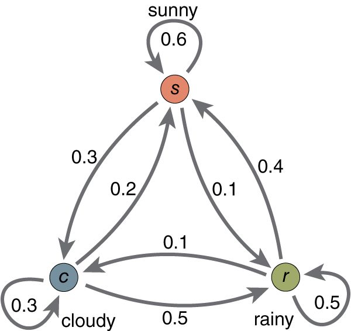
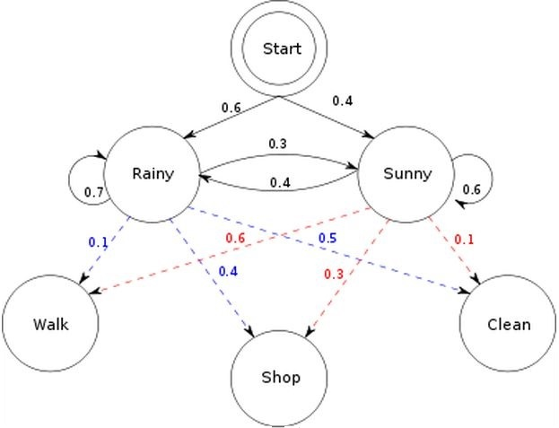
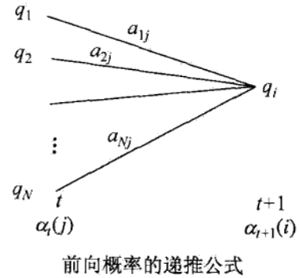
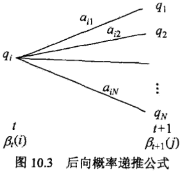
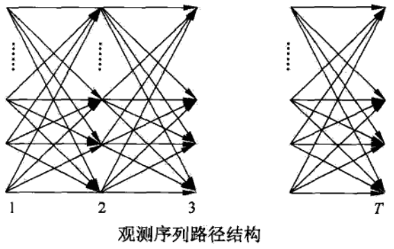
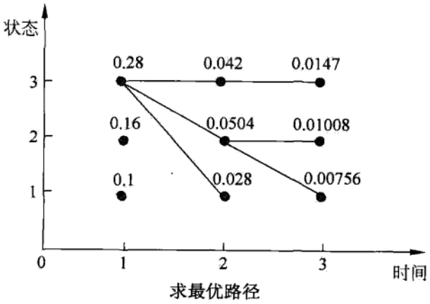

# HMM隐马尔科夫模型

* [返回上层目录](../machine-learning.md)
* [隐马尔科夫模型的基本概念](#隐马尔科夫模型的基本概念)
  * [通过简单例子理解HMM](#通过简单例子理解HMM)
    * [打游戏](#打游戏)
    * [女朋友](#女朋友)
  * [隐马尔科夫模型的定义](#隐马尔科夫模型的定义)
  * [观测序列的生成过程](#观测序列的生成过程)
  * [隐马尔科夫模型的3个基本问题](#隐马尔科夫模型的3个基本问题)
* [概率计算算法](#概率计算算法)
  * [直接计算法](#直接计算法)
  * [前向算法](#前向算法)
  * [后向算法](#后向算法)
  * [一些概率与期望值的计算](#一些概率与期望值的计算)
* [学习算法](#学习算法)
  * [监督学习算法](#监督学习算法)
  * [Baum-Welch算法](#Baum-Welch算法)
  * [Baum-Welch模型参数估计公式](#Baum-Welch模型参数估计公式)
* [预测算法](#预测算法)
  * [近似算法](#近似算法)
  * [维特比算法](#维特比算法)

隐马尔可夫模型（hidden Markov model，HMM）是可用于标注问题的统计学习模型，描述由隐藏的马尔可夫链随机生成观测序列的过程，属于**生成模型**。本章首先介绍隐马尔可夫模型的基本概念，然后分别叙述隐马尔可夫模型的概率计算算法、学习算法以及预测算法。隐马尔可夫模型在语音识别、自然语言处理、生物信息、模式识别等领域有着广泛的应用。

隐马尔科夫模型是生成模型，表示状态序列和观测序列的联和分布，但状态序列是隐藏的，不可观测的。隐马尔科夫模型可以用于标注，这是状态对应着标记。标注问题是给定观测序列预测其对应的标记序列。

# 隐马尔科夫模型的基本概念

HMM模型就是这样一个系统：它有一个会随时间改变的隐藏的状态，在持续地影响它的外在表现。

## 通过简单例子理解HMM

本节是给零基础人士看的。目标是让普通初中生以及只有初中基础人士无障碍理解HMM框架。追求数学严谨性人士、追求用简洁符号表达模型的同学以及数理基础良好的大神请自行移步参阅文献。

讲这种东西就得先搞清HMM到底干了什么，初学者很容易对“模型在干嘛”这个问题上犯晕。我个人特别讨厌跟初学者上来就讲state space/transition matrix/emission probability云云的讲法(注：比如《统计学习方法》李航博士那种讲法。虽然用来准备面试很方便，但初学者肯定会被符号和几个概念绕晕了；另外，私以为他换掉符号和前人文献不保持一致的做法又会让初学者又多了一道坎去翻。总之，不太厚道)。因为初学时，对大多非理科出身的人而言，用抽象的名词与符号描述的“语言系统”还没固化在脑袋里。用抽象符号在那儿讲就好比“一群人还没学会走，就逼着他们快点跑”。这是不太现实的。

综上，用复杂抽象的语言描述不合适的，这个学习曲线过于陡峭，别人需要时间消化。基于此原因，我发现，对零基础小伙伴们用游戏的例子去类比地解释往往比较容易降低学习难度，比如这样讲：

### 打游戏

我是一战士，修炼出了三种战斗形态，分别为**暴怒态**，**正常状态**和**防御态**。同时我也会三个被动技能，分别是普通平A，爆击(攻击伤害翻倍)，吸血(生命汲取)。

* 我在暴怒状态下打出暴击的概率是80%,打出吸血概率为5%；
* 在正常状态下，打出暴击的比率为30%，打出吸血的概率是20%；
* 在防御形态下，暴击成功概率为5%，吸血概率为60%。

总结一下，**战士在不同状态下能打出技能的概率不一样**。

本来，战士这个职业在暴怒态时，身边会有一圈红光环；防御态时，会有一圈蓝光环。但是，现在我正在玩游戏，游戏突然出了个bug：有个傻x程序员改了游戏的代码，他给写崩了，从此战士身边光环都看不见了。那我没法通过看脚下的光环知道战士在爆什么状态了。

话说，现在问题来了：由于看不到脚下光环，我只能估计“战士”在爆什么状态；但我现在打一boss，砍10次，发现8次都是暴击，血哗哗地翻倍在掉，你觉得我这战士最可能是爆了什么状态？

(每次用这个不规范的例子和新手讲，他们立刻就懂了；而且他们接下来还会问："’暴怒状态’不能总持续吧？这不科学，应该限定个一段时间后，暴怒状态消失的概率为50%...."你瞧瞧连状态转换的transition prob自己都能假设出来了，都会抢答了都lol...“HMM的在干什么”的问题很容易地让他们就理解了)

综上，一个战士的状态会不断随时间变化；然后他的被动技能发动概率会因为所处不同状态而不同。这就是HMM想表达的东西。并且我们还可以通过它回答一些有趣的问题：通过战士发动的技能来推测战士所出的状态。

这个例子只是个感性认识，**它其实只是告诉了我们hmm比较“像什么东西”。**显然，我们还需要更规范更严谨地去介绍什么是HMM，去规范化这个模型。这个例子里的“战士”可以换成其它答案里的天气，换成硬币等等。但无论用什么说法，我们已经能通过这个例子抓住**核心问题**了：

> HMM模型就是这样一个系统——它有一个能不断改变的**隐藏的状态**（在这个例子里就是战士爆的状态。**它会变**，而且由于一个码农的缘故，**状态变得不可见**）在持续地影响它的**外在表现**（在这个例子里就是战士打出的技能是暴击、平a、还是吸血的概率）。再重复一遍：**HMM模型就是这样一个系统——它有一个会随时间改变的隐藏的状态，在持续地影响它的外在表现。**

现在我们再继续规范一下这个例子，让它更贴近那种严谨描述。

因为我们知道战士打人总爆击，角色特别bug，这没法玩啊。所以我们要限制一下战士爆状态。

我们在游戏里做了个限制：

我们设定，战士一开始进入游戏世界时是**正常状态**的。而且，每过一段时间（比如1分钟），战士就会自动爆一次状态。最后，每一次爆发还和上一次状态爆的状态是什么有关：

* 上一次如果是**正常状态，**那下次变为**暴怒**的概率比较大**。**下次转换成**暴怒状态**，**平衡状态**或**防御状态**的概率我们假设分别为**60%，30%,10%**。这保证了战士职业下次能有较大的概率能打出暴击！
* 同理，若当我们上次在**暴怒态时**，下次继续保持**暴怒态**的概率就得限制一下。下次继续保持**暴怒**的概率就设为10%，而转换成**正常状态**的概率是60%，转换成**防御态**的概率是30%；
* 如果上次是**防御态**，那么我们也让它下次也尽量变正常。（不然总吸血啊）那他下次转成其它三态的概率(三态和以上对应书写顺序一致)分别为为10%，60，30%。

这样服务器就能限制战士的爆**暴怒态**的次数，让它不那么不平衡。

顺便提一下，其实以上的这种限定——让战士下一次爆不同状态的概率只和上次处在什么状态有关系——叫马尔可夫性质（markov property）。

经过这样的设定后，不仅仅战士这个职业不会那么不平衡，而且，我们可以靠以上这些数字来计算之前只能感性理解的问题了。比如：**我这个战士在第一分钟的时候是正常状态，那么我第二分钟赶去死亡谷打一个boss能暴击的概率是多少？（**这个当作思考题**，提示：想想两个问题，上一状态和下一状态间转换的概率是多少？不同状态下发不同技能的概率是多少？）**

最后总结一下。以上例子中讲明了HMM的五样“要素”：

* 状态和状态间转换的概率
* .不同状态下，有着不同的外在表现的概率。
* 最开始设置的初始状态
* 能转换的所有状态的集合
* 能观察到外在表现的结合

**Hidden 说明的是状态的不可见性；Markov说明的是状态和状态间是markov chain。这就是为什么叫Hidden Markov Model。**

我相信你们再去看其它答案里写的就明白多了。

ps:懂了是什么之后再去看paper就好多了。没记错的话去，看[《A tutorial on Hidden Markov Models and selected applications in Speech recognition》](http://www.cs.cmu.edu/~cga/behavior/rabiner1.pdf)。另外，HMM除了上文提到的“五要素”，还有“三个基本问题”。这文章将hmm的三个基本问题讲得很清楚。

### 女朋友

既是马尔可夫模型，就一定存在马尔可夫链，该马尔可夫链服从**马尔可夫性质**：即无记忆性。也就是说，这一时刻的状态，受且只受前一时刻的影响，而不受更往前时刻的状态的影响。

在这里我们仍然使用非常简单的天气模型来做说明马尔可夫性质。

在这个马尔可夫模型中，存在三个状态，Sunny， Rainy， Cloudy，同时图片上标的是各个状态间的转移概率（如果不明白什么是转移概率，那建议先去学习什么是马尔可夫再来看HMM）。

现在我们要说明什么是HMM。既是隐形，说明这些状态是观测不到的，相应的，我们可以通过其他方式来『猜测』或是『推断』这些状态，这也是HMM需要解决的问题之一。

举个例子，我女朋友现在在北京工作，而我还在法国读书。每天下班之后，她会根据天气情况有相应的活动：或是去商场购物，或是去公园散步，或是回家收拾房间。我们有时候会通电话，她会告诉我她这几天做了什么，而闲着没事的我呢，则要通过她的行为猜测这几天对应的天气最有可能是什么样子的。

以上就是一个简单的 HMM，天气状况属于状态序列，而她的行为则属于观测序列。天气状况的转换是一个马尔可夫序列。而根据天气的不同，有相对应的概率产生不同的行为。在这里，为了简化，把天气情况简单归结为晴天和雨天两种情况。雨天，她选择去**散步，购物，收拾**的概率分别是0.1，0.4，0.5， 而如果是晴天，她选择去散步，购物，收拾的概率分别是0.6，0.3，0.1。而天气的转换情况如下：这一天下雨，则下一天依然下雨的概率是0.7，而转换成晴天的概率是0.3；这一天是晴天，则下一天依然是晴天的概率是0.6，而转换成雨天的概率是0.4。同时还存在一个初始概率，也就是第一天下雨的概率是0.6， 晴天的概率是0.4。

根据以上的信息，我们得到了 HMM的一些基本要素：初始概率分布 π，状态转移矩阵 A，观测量的概率分布 B，同时有两个状态，三种可能的观测值。

现在，重点是要了解并解决HMM 的三个问题。

问题1(**解码**)，已知整个模型，我女朋友告诉我，连续三天，她下班后做的事情分别是：散步，购物，收拾。那么，根据模型，计算产生这些行为的概率是多少。

问题2(**学习**)，最复杂的，我女朋友只告诉我这三天她分别做了这三件事，而其他什么信息我都没有。她要我建立一个模型，晴雨转换概率，第一天天气情况的概率分布，根据天气情况她选择做某事的概率分布。（惨绝人寰）

问题3(**估计**)，同样知晓这个模型，同样是这三件事，我女朋友要我猜，这三天她下班后北京的天气是怎么样的。这三天怎么样的天气才最有可能让她做这样的事情。

而要解决这些问题，伟大的大师们分别找出了对应的算法。问题一，Forward算法(向前算法)，或者Backward算法(向后算法)。 问题二，Baum-Welch算法(鲍姆-韦尔奇算法)（中文好绕口），用的是最大似然估计方法，当然，由于其含隐变量，得采用EM算法，EM算法就是求含有隐变量的MLE，现在知道为什么要学习EM算法了吧。问题三，Viterbi算法，维特比算法。

尽管例子有些荒谬（天气情况要复杂的多，而且不太可能满足马尔可夫性质；同时，女朋友要做什么往往由心情决定而不由天气决定。而从问题一来看，一定是天数越多，这个概率就会越低；从问题三来看，观察到的行为越多，模型才能更准确一些），但是应该已经简单却又详尽地解释了什么是 HMM。如果只是想了解个大概，到此为止。

****

具体如何解决这三大问题。需要数学基础，概率基础。

问题1(**解码**)，已知整个模型，我女朋友告诉我，连续三天，她下班后做的事情分别是：散步，购物，收拾。那么，根据模型，计算产生这些行为的概率是多少。

**问题1的解决1：遍历算法。**

要计算产生这一系列行为的概率，那我们把每一种天气情况下产生这些行为都罗列出来，那每种情况的和就是这个概率。有三天，每天有两种可能的天气情况，则总共有 2的三次=8种 情况.
举例其中一种情况 ： P（下雨，下雨，下雨，散步，购物，收拾）=P（第一天下雨）P（第一天下雨去散步）P（第二天接着下雨）P（下雨去购物）P（第三天还下雨）P（下雨回家收拾）=0.6X0.1X0.7X0.4X0.7X0.5=0.00588
当然，这里面的 P（第二天接着下雨）当然是已知第一天下雨的情况下，第二天下雨的概率，为0.7.
将八种情况相加可得，三天的行为为{散步，购物，收拾}的可能性为0.033612. 看似简单易计算，但是一旦观察序列变长，计算量就会非常庞大（$N^T$的复杂度，T为观测序列的长度）。

**问题1 的解决2：向前算法。**

先计算t=1时刻，发生『散步』一行为的概率，如果下雨，则为P(散步，下雨)=P（第一天下雨）X P（散步 | 下雨）=0.6X0.1=0.06；如果晴天，P（散步，晴天）=0.4X0.6=0.24

t=2时刻，发生『购物』的概率，当然，这个概率可以从t=1时刻计算而来。

如果t=2下雨，则P（第一天散步，第二天购物， 第二天下雨）= 【P（第一天散步，第一天下雨）X P（第二天下雨 | 第一天下雨）+P（第一天散步，第一天晴天）X P(第二天下雨 | 第一天晴天)】X P（第二天购物 | 第二天下雨）=【0.06X0.7+0.24X0.4】X0.4=0.0552

如果t=2晴天，则P（第一天散步，第二天购物，第二天晴天）=0.0486 （同理可得，请自行推理）。

如果t=3，下雨，则P（第一天散步，第二天购物，第三天收拾，第三天下雨）=【P（第一天散步，第二天购物，第二天下雨）X P（第三天下雨 | 第二天下雨）+ P（第一天散步，第二天购物，第二天天晴）X P（第三天下雨 | 第二天天晴）】X P（第三天收拾 | 第三天下雨）=【0.0552X0.7+0.0486X0.4】X0.5= 0.02904

如果t=3，晴天，则P（第一天散步，第二天购物，第三天收拾，第三天晴天）= 0.004572

那么P（第一天散步，第二天购物，第三天收拾），这一概率则是第三天，下雨和晴天两种情况的概率和。0.02904+0.004572=0.033612.

以上例子可以看出，向前算法计算了每个时间点时，每个状态的发生观测序列的概率，看似繁杂，但在T变大时，复杂度会大大降低。

**问题1的解决3：向后算法**

顾名思义，向前算法是在时间t=1的时候，一步一步往前计算。而相反的，向后算法则是倒退着，从最后一个状态开始，慢慢往后推。

初始化后向变量：
$$
\begin{aligned}
\beta_3(\text{Rainy})=1\\
\beta_3(\text{Sunny})=1
\end{aligned}
$$
递推后向变量：
$$
\begin{aligned}
\beta_2(\text{Rainy})&=\alpha_{\text{Rainy}\rightarrow \text{Rainy}}b_{\text{Rainy}\rightarrow (O_3=\text{Clean})}\beta_3(\text{Rainy})+\alpha_{\text{Rainy}\rightarrow \text{Sunny}}b_{\text{Sunny}\rightarrow (O_3=\text{Clean})}\beta_3(\text{Sunny})\\
&=0.7\times 0.5\times1+0.3\times0.1\times1=0.38\\
\beta_2(\text{Sunny})&=\alpha_{\text{Sunny}\rightarrow \text{Rainy}}b_{\text{Rainy}\rightarrow (O_3=\text{Clean})}\beta_3(\text{Rainy})+\alpha_{\text{Sunny}\rightarrow \text{Sunny}}b_{\text{Sunny}\rightarrow (O_3=\text{Clean})}\beta_3(\text{Sunny})\\
&=0.4\times0.5\times1+0.6\times0.1\times1=0.26
\end{aligned}
$$
同理，继续递推后向变量：
$$
\begin{aligned}
\beta_1(\text{Rainy})&=\alpha_{\text{Rainy}\rightarrow \text{Rainy}}b_{\text{Rainy}\rightarrow (O_2=\text{Shop})}\beta_2(\text{Rainy})+\alpha_{\text{Rainy}\rightarrow \text{Sunny}}b_{\text{Sunny}\rightarrow (O_2=\text{Shop})}\beta_2(\text{Sunny})\\
&=0.7\times 0.4\times0.38+0.3\times0.3\times0.26=0.1298\\
\beta_1(\text{Sunny})&=\alpha_{\text{Sunny}\rightarrow \text{Rainy}}b_{\text{Rainy}\rightarrow (O_2=\text{Shop})}\beta_2(\text{Rainy})+\alpha_{\text{Sunny}\rightarrow \text{Sunny}}b_{\text{Sunny}\rightarrow (O_2=\text{Shop})}\beta_2(\text{Sunny})\\
&=0.4\times0.4\times0.38+0.6\times0.3\times0.26=0.1076
\end{aligned}
$$
最终结果：P(散步，购物，收拾)=
$$
\begin{aligned}
&\pi_{\text{Rainy}}\times b_{\text{Rainy}\rightarrow(O_1=\text{Walk})}\beta_1(\text{Rainy})+\pi_{\text{Sunny}}\times b_{\text{Sunny}\rightarrow(O_1=\text{Walk})}\beta_1(\text{Sunny})\\
=&0.6\times0.1\times0.1298+0.4\times0.6\times0.1076\\
=&0.033612
\end{aligned}
$$

三种算法的答案是一致的。

问题2(**学习**)，最复杂的，我女朋友只告诉我这三天她分别做了这三件事，而其他什么信息我都没有。她要我建立一个模型，晴雨转换概率，第一天天气情况的概率分布，根据天气情况她选择做某事的概率分布。（惨绝人寰）

问题3的解决：Baum-Welch算法（鲍姆-韦尔奇算法）。
此问题的复杂度要远远高于前两种算法，不是简单解释就能说的清楚的了。若有兴趣，继续看下面的理论部分。

问题3(**估计**)，同样知晓这个模型，同样是这三件事，我女朋友要我猜，这三天她下班后北京的天气是怎么样的。这三天怎么样的天气才最有可能让她做这样的事情。

**问题3的解决：维特比算法**

维特比算法致力于寻找一条最佳路径，以便能最好地解释观测到的序列。

初始化：
$$
\begin{aligned}
&\delta_1(\text{Sunny})=\pi_{\text{Sunny}}\times b_{\text{Sunny}\rightarrow(O_1=\text{Walk})}=0.4\times0.6=0.24\\
&\delta_1(\text{Rainy})=\pi_{\text{Rainy}}\times b_{\text{Rainy}\rightarrow(O_1=\text{Walk})}=0.6\times0.1=0.06
\end{aligned}
$$
初始路径：
$$
\begin{aligned}
&\phi_1(\text{Sunny})=X\\
&\phi_1(\text{Rainy})=X
\end{aligned}
$$
递推，当然是要找出概率最大的那条路径。
$$
\begin{aligned}
&\delta_2(\text{Rainy})\\
=&\text{max}[\delta_1(\text{Rainy})\times \alpha_{\text{Rainy}\rightarrow \text{Rainy}},\delta_1(\text{Sunny})\times \alpha_{\text{Sunny}\rightarrow \text{Rainy}}]\times b_{\text{Rainy}\rightarrow(O_2=\text{Shop})}\\
=&\text{max}[0.06\times0.7,\ 0.24\times0.4]\times0.4\\
=&0.0384
\end{aligned}
$$

$$
\begin{aligned}
&\delta_2(\text{Sunny})\\
=&\text{max}[\delta_1(\text{Sunny})\times \alpha_{\text{Sunny}\rightarrow \text{Sunny}},\delta_1(\text{Rainy})\times \alpha_{\text{Rainy}\rightarrow \text{Sunny}}]\times b_{\text{Sunny}\rightarrow(O_2=\text{Shop})}\\
=&\text{max}[0.24\times0.6,\ 0.06\times0.3]\times0.3\\
=&0.0432
\end{aligned}
$$

那么，到达第二天下雨这一状态的最佳路径，应该是：
$$
\begin{aligned}
&\phi_2(\text{Rainy})\\
=&\text{arg}\ \text{max}[\delta_1(\text{Rainy})\times \alpha_{\text{Rainy}\rightarrow \text{Rainy}},\delta_1(\text{Sunny})\times \alpha_{\text{Sunny}\rightarrow \text{Rainy}}]\\
=&\text{arg}\ \text{max}[0.06\times0.7,\ 0.24\times0.4]\\
=&\text{arg}\ \text{max}[0.042,\ 0.096]\\
=&\text{Sunny}
\end{aligned}
$$

也就是说，第一天是晴天的可能性更大，即到达第二天下雨这一状态的最大可能路径是“第一天天晴->第二天下雨”。

同样地，到达第二天天晴这一状态的最佳路径，应该是：
$$
\begin{aligned}
&\phi_2(\text{Sunny})\\
=&\text{arg}\ \text{max}[\delta_1(\text{Rainy})\times \alpha_{\text{Rainy}\rightarrow \text{Sunny}},\delta_1(\text{Sunny})\times \alpha_{\text{Sunny}\rightarrow \text{Sunny}}]\\
=&\text{arg}\ \text{max}[0.06\times0.3,\ 0.24\times0.6]\\
=&\text{arg}\ \text{max}[0.018,\ 0.144]\\
=&\text{Sunny}
\end{aligned}
$$
也就是说，第一天是晴天的可能性更大，即到达第二天天晴这一状态的最大可能路径是“第一天天晴->第二天天晴”。

同样的，可以推得第三天，
$$
\begin{aligned}
&\delta_3(\text{Rainy})\\
=&\text{max}[\delta_2(\text{Rainy})\times \alpha_{\text{Rainy}\rightarrow \text{Rainy}},\delta_2(\text{Sunny})\times \alpha_{\text{Sunny}\rightarrow \text{Rainy}}]\times b_{\text{Rainy}\rightarrow(O_3=\text{Clean})}\\
=&\text{max}[0.0384\times0.7,\ 0.0432\times0.4]\times0.5\\
=&0.01344
\end{aligned}
$$

$$
\begin{aligned}
&\delta_3(\text{Sunny})\\
=&\text{max}[\delta_2(\text{Rainy})\times \alpha_{\text{Rainy}\rightarrow \text{Sunny}},\delta_2(\text{Sunny})\times \alpha_{\text{Sunny}\rightarrow \text{Sunny}}]\times b_{\text{Sunny}\rightarrow(O_3=\text{Clean})}\\
=&\text{max}[0.0384\times0.3,\ 0.0432\times0.6]\times0.1\\
=&0.002592
\end{aligned}
$$

那么，到达第三天下雨这一状态的最佳路径，应该是：
$$
\begin{aligned}
&\phi_2(\text{Rainy})\\
=&\text{arg}\ \text{max}[\delta_1(\text{Rainy})\times \alpha_{\text{Rainy}\rightarrow \text{Rainy}},\delta_1(\text{Sunny})\times \alpha_{\text{Sunny}\rightarrow \text{Rainy}}]\\
=&\text{arg}\ \text{max}[0.06\times0.7,\ 0.24\times0.4]\\
=&\text{arg}\ \text{max}[0.042,\ 0.096]\\
=&\text{Sunny}
\end{aligned}
$$
也就是说，第一天是晴天的可能性更大，即到达第二天下雨这一状态的最大可能路径是“第一天天晴->第二天下雨”。

同样地，到达第二天天晴这一状态的最佳路径，应该是：
$$
\begin{aligned}
&\phi_2(\text{Sunny})\\
=&\text{arg}\ \text{max}[\delta_1(\text{Rainy})\times \alpha_{\text{Rainy}\rightarrow \text{Sunny}},\delta_1(\text{Sunny})\times \alpha_{\text{Sunny}\rightarrow \text{Sunny}}]\\
=&\text{arg}\ \text{max}[0.06\times0.3,\ 0.24\times0.6]\\
=&\text{arg}\ \text{max}[0.018,\ 0.144]\\
=&\text{Sunny}
\end{aligned}
$$
也就是说，第一天是晴天的可能性更大，即到达第二天天晴这一状态的最大可能路径是“第一天天晴->第二天天晴”。

## 隐马尔科夫模型的定义

 **隐马尔可夫模型定义**：隐马尔可夫模型是关于时序的概率模型，描述由一个隐藏的马尔可夫链随机生成不可观测的状态随机序列，再由各个状态生成一个观测而产生观测随机序列的过程。隐藏的马尔可夫链随机生成的状态的序列，称为状态序列（state sequence）；每个状态生成一个观测，而由此产生的观测的随机序列，称为观测序列（observation sequence）序列的每一个位置又可以看作是一个时刻。

隐马尔可夫模型由初始概率分布、状态转移概率分布以及观测概率分布确定。隐马尔可夫模型的形式定义如下：

设Q是所有可能的状态的集合，V是所有可能的观测的集合。
$$
Q=\{ q_1,q_2,...,q_N \},\quad V=\{ v_1,v_2,...,v_M \}
$$
其中，N是可能的状态数，M是可能的观测数。

I是长度为T的状态序列，O是对应的观测序列。
$$
I=(i_1,i_2,...,i_T)\quad O=\{ o_1,o_2,...,o_T \}
$$
A是状态转移概率矩阵：
$$
A=\left[ \alpha_{ij} \right]_{N\times N}
$$
其中，
$$
\alpha_{ij}=P(i_{i+1}=q_j|i_t=q_i),\quad i=1,2,...,N;\ j=1,2,...,N
$$
是在时刻t处于状态qi的条件下，在时刻t+1处转移到状态qj的概率。

B是观测概率矩阵：
$$
B=\left[ b_{j}(k) \right]_{N\times M}
$$
其中，
$$
b_j(k)=P(o_t=v_k|i_t=q_j),\quad k=1,2,...,M;\ j=1,2,...,N
$$
是在时刻t处与状态qj的条件下生成观测vk的概率。

π是初始状态概率**向量**：
$$
\pi=(\pi_i)
$$
其中，
$$
\pi_i=P(i_1=q_i),\quad i=1,2,...,N
$$
是时刻t=1处于状态qi的概率。

隐马尔可夫模型由初始状态概率向量π、状态转移概率矩阵A和观测概率矩阵B决定。π和A决定状态序列，B决定观测序列。因此，隐马尔可夫模型λ可以用三元符号表示，即
$$
\lambda=(A,B,\pi)
$$
A，B，π称为隐马尔可夫模型的三要素。

状态转移概率矩阵A与初始状态概率向量π确定了隐藏的马尔可夫链，生成不可观测的状态序列。观测概率矩阵B确定了如何从状态生成观测，与状态序列综合确定了如何产生观测序列。
从定义可知，隐马尔可夫模型作了两个基本假设：

* 齐次马尔可夫性假设

  即假设隐藏的马尔可夫链在任意时刻/的状态只依赖于其前一时刻的状态，与其他时刻的状态及观测无关，也与时刻/无关
  $
  P(i_t|i_{t-1},o_{t-1},...,i_1,o_1)=P(i_t|i_{t-1})
  $

* 观测独立性假设

  即假设任意时刻的观测只依赖于该时刻的马尔可夫链的状态，与其他观测及状态无关
  $
  P(o_t|i_T,o_T,i_{T-1},o_{T-1},...,i_{t+1},o_{t+1},i_t,i_{t-1},o_{t-1},...,i_1,o_1)=P(o_t|i_t)
  $

隐马尔可夫模型可以用于标注，这时状态对应着标记。标注问题是给定观测的序列预测其对应的标记序列。可以假设标注问题的数据是由隐马尔可夫模型生成的。这样我们可以利用隐马尔可夫模型的学习与预测算法进行标注。
下面看一个隐马尔可夫模型的例子。

**盒子和球模型**：假设有4个盒子，每个盒子里都装有红白两种颜色的球，盒子里的红白球由下表列出。

|  盒子  |  1   |  2   |  3   |  4   |
| :--: | :--: | :--: | :--: | :--: |
| 红球数  |  5   |  3   |  6   |  8   |
| 白球数  |  5   |  7   |  4   |  2   |

按照下面的方法抽球，产生一个球的颜色的观测序列：开始，从4个盒子里以等概率随机选取1个盒子，从这个盒子里随机抽出1个球，记录其颜色后，放回；然后，从当前盒子随机转移到下一个盒子。

规则是：如果当前盒子是盒子1,那么下一盒子一定是盒子2，如果当前是盒子2或3，那么分别以概率0.4和0.6转移到左边或右边的盒子，如果当前是盒子4,那么各以0.5的概率停留在盒子4或转移到盒子3；确定转移的盒子后，再从这个盒子里随机抽出1个球，记录其颜色，放回；如此下去，重复进行5次，得到一个球的颜色的观测序列：
$$
O = \{\text{红},\text{红},\text{白},\text{白},\text{红}\}
$$
在这个过程中，观察者只能观测到球的颜色的序列，观测不到球是从哪个盒子取出的，即观测不到盒子的序列.

在这个例子中有两个随机序列，一个是盒子的序列（**状态序列**），一个是球的颜色的观测序列（**观测序列**）。前者是隐藏的，只有后者是可观测的。这是一个隐马尔可夫模型的例子，根据所给条件，可以明确状态集合、观测集合、序列长度以及模型的三要素。
盒子对应状态，状态的集合是
$$
Q = \{\text{盒子1},\text{盒子2},\text{盒子3},\text{盒子4}\},\quad N=4
$$
球的颜色对应观测.观测的集合是
$$
V = \{\text{红},\text{白}\},\quad M=2
$$
状态序列和观测序列长度T = 5。

初始概率分布为
$$
\pi= (0.25,0.25,0.25, 0.25)^T
$$
状态转移概率分布为
$$
\begin{aligned}
A=
\begin{bmatrix}
0 & 1 & 0 & 0\\ 
0.4 & 0 & 0.6 & 0\\ 
0 & 0.4 & 0 & 0.6\\ 
0 & 0 & 0.5 & 0.5
\end{bmatrix}
\end{aligned}
$$
观测概率分布为
$$
\begin{aligned}
B=
\begin{bmatrix}
0.5 & 0.5\\ 
0.3 & 0.7\\ 
0.6 & 0.4\\ 
0.8 & 0.2
\end{bmatrix}
\end{aligned}
$$

## 观测序列的生成过程

根据隐马尔可夫模型定义，可以将一个长度为T的观测序列
$$
O = (o_1,o_2,...,o_T)
$$
的生成过程描述如下：

**观测序列的生成算法**：

输入：隐马尔可夫模型λ=(A,B,π)，观测序列长度T；

输出：观测序列
$$
O = (o_1,o_2,...,o_T)
$$
（1）按照初始状态分布π产生状态i\_1

（2）令t = 1

（3）按照状态i\_t的观测概率分布b\_it(k)生成o\_t

（4）按照状i\_t的状态转移概率分布\{ α\_\{i, i\_(t+1)\} \}产生状态i\_\{t+1\}，i\_\{t+1\}=1,2, ... ,N

（5）令t = t + 1；如果t < T，转步（3）；否则，终止 

## 隐马尔科夫模型的3个基本问题

隐马尔可夫模型有3个基本问题：

* **概率计算问题**

  给定模型λ = (A, B, π)和观测序列O = (o1, o2, ... , oT)，计算在模型λ下观测序列O出现的概率P(O | λ)。

* **学习问题**

  己知观测序列O = (o1, o2, ... , oT)，估计模型λ = (A, B, π)参数，使得在该模型下观测序列概率P(O | λ)最大。即用极大似然估计的方法估计参数。

* **预测问题**，也称为解码（decoding）问题

  已知模型λ = (A, B, π)和观测序列O = (o1, o2, ... , oT)，求对给定观测序列条件概率P(I | O)最大的状态序列I= \{i\_1, i\_2, ..., i\_T \}。即给定观测序列，求最有可能的对应的状态序列。

下面各节将逐一介绍这些基本问题的解法。

# 概率计算算法

本节介绍计算观测序列概率P(O | λ)的前向（forward）与后向（backward）算法。先介绍概念上可行但计算上不可行的直接计算法。

## 直接计算法

给定模型λ = (A, B, π)和观测序列O = (o1, o2, ... , oT)，计算观测序列O出现的槪率P(O | λ)。最直接的方法是按概率公式直接计算。通过列举所有可能的长度为T的状态序列I= \{i\_1, i\_2, ..., i\_T \}，求各个状态序列I与观测序列O = (o1, o2, ... , oT)的联合概率P(O,I | λ)，然后对所有可能的状态序列求和，得到P(O | λ)。

状态序列I= \{i\_1, i\_2, ..., i\_T \}的概率是
$$
P(I|\lambda)=\pi_{i_1}\alpha_{i_1i_2}\alpha_{i_2i_3}...\alpha_{i_{T-1}i_T}
$$
对固定的状态序列I = \{i\_1, i\_2, ..., i\_T \}，观测序列O = (o1, o2, ... , oT)的概率是P(O | I, λ)
$$
P(O|I,\lambda)=b_{i_1}(o_1)b_{i_2}(o_2)...b_{i_T}(o_T)
$$
O和I同时出现的联合概率为
$$
\begin{aligned}
P(O, I | \lambda)&=P(O|I,\lambda)P(I|\lambda)\\
&=\pi_{i_1}b_{i_1}(o_1)\alpha_{i_1i_2}b_{i_2}(o_2)...\alpha_{i_{T-1}i_T}b_{i_T}(o_T)\\
\end{aligned}
$$
然后，对所有可能的状态序列I求和，得到观测序列O的概率P(O | λ)，即
$$
\begin{aligned}
P(O|\lambda)&=\sum_IP(O|I,\lambda)P(I|\lambda)\\
&=\sum_{i_1,i_2,...,i_T}\pi_{i_1}b_{i_1}(o_1)\alpha_{i_1i_2}b_{i_2}(o_2)...\alpha_{i_{T-1}i_T}b_{i_T}(o_T)\\
\end{aligned}
$$
但是，利用上式计算的计算量很大，是O(TN^T)阶的，这种算法不可行。

下面介绍计算观测序列概率P(O | λ)的有效算法：前向-后向算法（forward-backward algorithm）。

## 前向算法

首先定义前向概率。

**前向槪率：**给定隐马尔可夫模型λ，定义到时刻t部分观测序列为o1,o2,...,ot且状态为qi的概率为前向概率，记作
$$
\alpha_t(i)=P(o_1,o_2,...,o_t,i_t=q_t|\lambda)
$$
可以递推地求得前向概率αt(i)及观测序列概率P(O | λ)。

**观测序列概率的前向算法**

输入：隐马尔可夫模型λ，观测序列O；

输出：观测序列概率P(O | λ)。

（1）初值
$$
\alpha_1(i)=\pi_ib_i(o_1),\quad i=1,2,...,N
$$
（2）递推，对t = 1,2,...,T-1
$$
\alpha_{t+1}(i)=\left[ \sum_{j=1}^N\alpha_t(j)\alpha_{ji} \right]b_i(o_{t+1}),\quad i=1,2,...,N
$$
（3）终止
$$
P(O|\lambda)=\sum_{i=1}^N\alpha_T(i)
$$
前向算法，

步骤（1）初始化前向概率，是初始时刻的状态i1=qi和观测o1的联合概率。

步骤（2）是前向概率的递推公式，计算到时刻t+1部分观测序列为o1,o2,...,ot,o(t+1)且在时刻t+1处于状态qi的前向概率，如下图所示。在上上式的方括弧里，既然αt(j)是到时刻t观测到o1,o2,...,ot并在时刻t处于状态qj的前向概率，那么乘积αt(j)αji就是到时刻t观测到o1,o2,...,ot并在时刻t处于状态qj而在时刻t+1到达状态qi的联合概率。对这个乘积在时刻t的所有可能的N个状态qj求和，其结果就是到时刻t观测为o1,o2,...,ot并在时刻t+1处于状态qi的联合概率。方括弧里的值与观测概率bi(o(t+1))的乘积恰好是到时刻t+1观测到o1,o2,...,ot,o(t+1)并在时刻t+1处于状态qi的前向概率α_(t+1)(i)。

步骤（3）给出P(O | λ)的计算公式。因为
$$
\alpha_T(i)=P(o_1,o_2,...,o_T,i_T=q_i|\lambda)
$$
所以
$$
P(O|\lambda)=\sum_{i=1}^N\alpha_T(i)
$$

如下图所示，前向算法实际是基于“**状态序列的路径结构**”递推计算P(O | λ)的算法。前向算法高效的关键是**其局部计算前向概率，然后利用路径结构将前向概率“递推”到全局，得到P(O | λ)**。具体地，在时刻t=1，计算α1(i)的N个值（i=1,2,...,N）；在各个时刻t=1,2,...,T-1，计算α\_(t+1)(i)的N个值（i=1,2,...,N），而且每个α\_(t+1)(i)的计算量直接引用前一个时刻的计算结果，避免重复计算。这样，利用前向概率计算P(O | λ)的计算量是O(N^2T)阶的，而不是直接计算的O(TN^T)阶。

**例子**：考虑盒子和球模型λ = (A, B, π)，状态集合Q = \{ 1,2,3 \}，观测集合V = \{ 红, 白 \}，
$$
\begin{aligned}
A=\begin{bmatrix}
0.5 & 0.2 & 0.3\\ 
0.3 & 0.5 & 0.2\\ 
0.2 & 0.3 & 0.5
\end{bmatrix}
,\ B=\begin{bmatrix}
0.5 & 0.5\\ 
0.4 & 0.6\\ 
0.7 & 0.3
\end{bmatrix}
,\ \pi=(0.2, 0.4, 0.4)^T
\end{aligned}
$$
设T=3，O=(红，白，红)，试用前向算法计算P(O | λ)。

解：按照前向算法

（1）计算初值
$$
\begin{aligned}
\alpha_1(1)=\pi_1b_1(o_1)=0.2\times 0.5=0.10\ \text{(状态1, 观测红)}\\
\alpha_1(2)=\pi_2b_2(o_1)=0.4\times 0.4=0.16\ \text{(状态2, 观测红)}\\
\alpha_1(3)=\pi_3b_3(o_1)=0.4\times 0.7=0.28\ \text{(状态3, 观测红)}\\
\end{aligned}
$$
（2）递推计算
$$
\begin{aligned}
&\alpha_2(1)=\left[ \sum_{i=1}^3\alpha_1(i)\alpha_{i1} \right]b_1(o_2)=0.154\times 0.5=0.077\\
&\alpha_2(2)=\left[ \sum_{i=1}^3\alpha_1(i)\alpha_{i2} \right]b_2(o_2)=0.184\times 0.6=0.1104\\
&\alpha_2(3)=\left[ \sum_{i=1}^3\alpha_1(i)\alpha_{i3} \right]b_3(o_2)=0.202\times 0.3=0.0606\\
&\alpha_3(1)=\left[ \sum_{i=1}^3\alpha_2(i)\alpha_{i1} \right]b_1(o_3)=0.04187\\
&\alpha_3(2)=\left[ \sum_{i=1}^3\alpha_2(i)\alpha_{i2} \right]b_2(o_3)=0.03551\\
&\alpha_3(3)=\left[ \sum_{i=1}^3\alpha_2(i)\alpha_{i3} \right]b_3(o_3)=0.05284\\
\end{aligned}
$$
（3）终止
$$
P(O|\lambda)=\sum_{i=1}^3\alpha_3(i)=0.13022
$$

## 后向算法

首先定义后向概率

**后向概率**：给定隐马尔科夫模型λ，定义在时刻t状态为qi的条件下，从t+1到T的部分观测序列为
$$
o_{t+1},o_{t+2},...,o_T
$$
的概率为后向概率，记作
$$
\beta_t(i)=P(o_{t+1},o_{t+2},...,o_T|i_t=q_i,\lambda)
$$
可以用递推的方法求得后向概率βt(i)及观测序列概率P(O | λ)。

**观测序列概率的后向算法**

输入：隐马尔科夫模型λ，观测序列O；

输出：观测序列概率P(O | λ)。

（1）
$$
\beta_T(i)=1,\quad i=1,2,...,N
$$
（2）对t=T-1, T-2, ... , 1
$$
\beta_t(i)=\sum_{j=1}^N\alpha_{ij}b_j(o_{t+1})\beta_{t+1}(j),\quad =1,2,...,N
$$
（3）
$$
P(O|\lambda)=\sum_{i=1}^N\pi_ib_i(o_1)\beta_1(i)
$$
步骤（1）初始化后向概率，对最终时刻的所有状态qi规定βT(i)=1。步骤（2）是后向概率的递推公式。如下图所示，为了计算在时刻t状态为qi条件下时刻t+1之后的观测序列为o(t+1), o(t+2), ... , o(T)的后向概率βt(i)，只需要考虑在时刻t+1所有可能的N个状态qj的转移概率（即αij项），以及在此状态下的观测o(i+1)的观测概率（即bj(o(t+1))项），然后考虑状态qj之后的观测序列的后向概率（即β(t+1)(i)项）。步骤（3）求P(O | λ)的思路与步骤（2）一致，只是初始概率πi代替转移概率。

利用前向概率和后向概率的定义可以将观测序列概率P(O | λ)统一写成
$$
P(O|\lambda)=\sum_{i=1}^N\sum_{j=1}^N\alpha_t(i)\alpha_{ij}b_j(o_{t+1})\beta_{t+1}(j),\quad t=1,2,...,T-1
$$
此式当t=1和t=T-1时分别为后向算法的P(O | λ)和前向算法的P(O | λ)。

## 一些概率与期望值的计算

利用前向概率和后向概率，可以得到关于单个状态和两个状态概率的计算公式。

**1.给定模型λ和观测O，在时刻t处于状态qi的概率**。记
$$
\gamma_t(i)=P(i_t=q_i|O,\lambda)
$$
可以通过前向后向概率计算。事实上，
$$
\gamma_t(i)=P(i_t=q_i|O,\lambda)=\frac{P(i_t=q_i,O|\lambda)}{P(O|\lambda)}
$$
由前向概率αt(i)和后向概率βt(i)定义可知：
$$
\alpha_t(i)\beta_t(i)=P(i_t=q_i,O|\lambda)
$$
于是得到：
$$
\gamma_t(i)=\frac{\alpha_t(i)\beta_t(i)}{P(O|\lambda)}=\frac{\alpha_t(i)\beta_t(i)}{\sum_{j=1}^N\alpha_t(i)\beta_t(i)}
$$
**2.给定模型λ和观测O，在时刻t处于状态qi，且在时刻t+1处于状态qj的概率**。记
$$
\xi_t(i,j)=P(i_t=q_i,i_{t+1}=q_j|O,\lambda)
$$
可以通过前向后向概率计算:
$$
\begin{aligned}
\xi_t(i,j)&=\frac{P(i_t=q_i,i_{t+1}=q_j,O|\lambda)}{P(O|\lambda)}\\
&=\frac{P(i_t=q_i,i_{t+1}=q_j,O|\lambda)}{\sum_{i=1}^N\sum_{j=1}^NP(i_t=q_i,i_{t+1}=q_j,O|\lambda)}\\
\end{aligned}
$$
而
$$
P(i_t=q_i,i_{t+1}=q_j,O|\lambda)=\alpha_t(i)\alpha_{ij}b_j(o_{t+1})\beta_{t+1}(j)
$$
所以
$$
\xi_t(i,j)=\frac{\alpha_t(i)\alpha_{ij}b_j(o_{t+1})\beta_{t+1}(j)}{\sum_{i=1}^N\sum_{j=1}^N\alpha_t(i)\alpha_{ij}b_j(o_{t+1})\beta_{t+1}(j)}
$$
3.将γt(i)和ξt(i,j)对各个时刻t求和，可以得到一些有用的期望值：

（1）在观测O下状态i出现次数的期望值
$$
\sum_{t=1}^T\gamma_t(i)
$$
（2）在观测O下由状态i转移次数的期望值
$$
\sum_{t=1}^{T-1}\gamma_t(i)
$$
（3）在观测O下由状态i转移到状态j的次数的期望值
$$
\sum_{t=1}^{T-1}\xi_t(i,j)
$$

# 学习算法

隐马尔科夫的学习，根据训练数据是包括观测序列和对应的状态序列，还是只有观测序列，可以分为由监督学习与非监督学习实现。本节首先介绍监督学习算法，而后介绍非监督学习算法——Baum-Welch算法（也就是EM算法）。

## 监督学习算法

假设已给训练数据包含S个长度相同的观测序列和对应的状态序列
$$
\{ (O_1,I_1), (O_2,I_2), ... , (O_S,I_S) \}
$$
，那么可以利用极大似然估计法来估计隐马尔科夫模型的参数。具体方法如下。

* 转移概率αij的估计

  社样本中时刻t处于状态i，时刻t+1转移到状态j的频数为Aij，那么状态转移概率αij的估计是
  $
  \hat{\alpha}_{ij}=\frac{A_{ij}}{\sum_{j=1}^NA_{ij}},\quad i=1,2,...,N;\ j=1,2,...,N
  $

* 观测概率bj(k)的估计

  设样本中状态为j并观测为k的频数是Bjk，那么状态为j观测为k的概率bj(k)的估计是
  $
  \hat{b}_j(k)=\frac{B_{jk}}{\sum_{k=1}^MB_{jk}},\quad j=1,2,...,N;\ j=1,2,...,M
  $

* 初始状态概率πi的估计hat(πi)为S个样本中初始状态为qi的频率

由于监督学习需要使用训练数据，而人工标注训练数据往往代价很高，有时就会利用非监督学习的方法。

## Baum-Welch算法

假设给定徐念数据只包含S个长度为T的观测序列\{ O1, O2, ... , OS \}而没有对应的状态序列，目标是学习隐马尔科夫模型λ = (A, B, π)的参数。我们将观测虚了数据看做观测数据O，状态序列数据看做不可观测的隐数据I，那么隐马尔科夫模型实际上是一个含有隐变量的概率模型。
$$
P(O|\lambda)=\sum_IP(O|I,\lambda)P(I|\lambda)
$$
它的参数学习可以由EM算法来实现。

**1.确定完全数据的对数似然函数**

所有观测数据写成O=(o1,o2,...,oT)，所有隐数据写成I=(i1,i2,...,iT)，完全数据是(O,I)=(o1,o2,...,oT,i1,i2,...,iT)。完全数据的对数似然函数是log P(O,I | λ)。

**2.EM算法的E步：**求Q函数
$$
Q(\lambda,\bar{\lambda})=\sum_{I}\text{log}P(O,I|\lambda)P(O,I|\bar{\lambda})
$$
其中，bar(λ)是隐马尔科夫模型参数的当前估计值，λ是要极大化的隐马尔科夫模型参数。
$$
P(O,I|\lambda)=\pi_{i_1}b_{i_1(o_1)}\alpha_{i_1i_2}b_{i_2}(o_2)...\alpha_{i_{T-1}i_T}b_{i_T}(o_T)
$$
**这里需要解释一下，你可能会疑惑，按照EM的参数的定义明明是下式啊：**
$$
\begin{aligned}
Q(\lambda,\bar{\lambda})&=E_I[\text{log}P(O,I|\lambda)|O,\bar{\lambda}]\\
&=\sum_I\text{log}P(O,I|\lambda)P(I|O,\bar{\lambda})
\end{aligned}
$$
而其中，
$$
P(I|O,\bar{\lambda})=\frac{P(I,O|\bar{\lambda})}{P(O|\bar{\lambda})}
$$
**而上式中的分母，对于λ而言，就是常数因子，因为Q函数是下一步求λ的极值的，没有这个常数项不影响极值结果，所以就可以将上式中的分母略去。所以Q函数才写为了：**
$$
Q(\lambda,\bar{\lambda})=\sum_{I}\text{log}P(O,I|\lambda)P(O,I|\bar{\lambda})
$$

于是函数Q(λ, bar(λ))可以写成：
$$
\begin{aligned}
Q(\lambda, \hat{\lambda})=&\sum_{I}\text{log}\pi_{i_1}P(O, I|\bar{\lambda})\\
+&\sum_I\left( \sum_{t=1}^{T-1}\text{log }\alpha_{i,i+1} \right)P(O,I|\bar{\lambda})\\
+&\sum_I\left( \sum_{t=1}^{T-1}\text{log }b_{i_t}(o_t) \right)P(O,I|\bar{\lambda})\\
\end{aligned}
$$
式中求和都是对所有训练数据的序列总长度T进行的。

**3.EM算法的M步**：极大化Q函数Q(λ, bar(λ))求模型参数A,B,π

由于要极大化的参数在上式中单独地出现在3个项中，所以只需对各项分别极大化。

（1）上式Q(λ, bar(λ))的第一项可以写成：
$$
\sum_{I}\text{log}\pi_{i_1}P(O, I|\bar{\lambda})=\sum_{i=1}^N\text{log}\pi_iP(O,i_1-i|\bar{\lambda})
$$
注意到πi满足约束条件
$$
\sum_{i=1}^N\pi_i=1
$$
，利用拉格朗日乘子法，写出拉格朗日函数：
$$
\sum_{i=1}^N\text{log}\pi_iP(O,i_1=i|\bar{\lambda})+\gamma\left( \sum_{i=1}^N\pi_i-1 \right)
$$
对其求偏导，并令结果为0
$$
\frac{\partial}{\partial \pi_i}\left[ \sum_{i=1}^N\text{log}\pi_iP(O,i_1=i|\bar{\lambda})+\gamma\left( \sum_{i=1}^N\pi_i-1 \right) \right]=0
$$
得
$$
P(O,i_1=i|\bar{\lambda})+\gamma\pi_i=0
$$
对i求和得到γ
$$
\gamma=-P(O|\bar{\lambda})
$$
带入上上式中得到
$$
\pi_i=\frac{P(O,i_1=i|\bar{\lambda})}{P(O|\bar{\lambda})}
$$
（2）Q(λ, bar(λ))的第2项可以写成
$$
\sum_I\left( \sum_{t=1}^{T-1}\text{log}\alpha_{i_ti_{t+1}} \right)P(O,I|\bar{\lambda})=\sum_{i=1}^N\sum_{j=1}^N\sum_{t=1}^{T-1}\text{log}\alpha_{ij}P(O,i_t=i,i_{t+1}=j|\bar{\lambda})
$$
类似第1项，应用具有约束条件
$$
\sum_{i=1}^N\pi_i=1
$$
的拉格朗日乘子法可以求出
$$
\alpha_{ij}=\frac{\sum_{t=1}^{T-1}P(O,i_t=i,i_{t+1}=j|\bar{\lambda})}{\sum_{t=1}^{T-1}P(O,i_t=i|\bar{\lambda})}
$$
（3）Q(λ, bar(λ))的第3项为
$$
\sum_I\left( \sum_{t=1}^T\text{log}b_{i_t}(o_t) \right)P(O,I|\bar{\lambda})=\sum_{j=1}^N\sum_{t=1}^T\text{log}b_j(o_t)P(O,i_t=j|\bar{\lambda})
$$
同样用拉格朗日乘子法，约束条件是
$$
\sum_{k=1}^Mb_j(k)=1
$$
。注意，只有在ot=vk时bj(ot)对bj(k)的偏导数才不为0，以I(ot=vk)表示。求得
$$
b_j(k)=\frac{\sum_{t=1}^TP(O,i_t=j|\bar{\lambda})I(o_t=v_k)}{\sum_{t=1}^TP(O,i_t=j|\bar{\lambda})}
$$

## Baum-Welch模型参数估计公式

将上三式中的各概率分别用γt(i)，ξt(i,j)表示，则可将相应的公式写成：
$$
\begin{aligned}
\alpha_{ij}&=\frac{\sum_{t=1}^{T-1}\xi_t(i,j)}{\sum_{t=1}^{T-1}\gamma_t(i)}\\
b_j(k)&=\frac{\sum_{t=1,o_t=v_k}^{T}\gamma_t(i,j)}{\sum_{t=1}^{T}\gamma_t(i)}\\
\pi_i&=\gamma_1(i)
\end{aligned}
$$
其中，γt(i)，ξt(i,j)分别由上一小节已经给出。上面三式就是Baum-Welch算法，它是EM算法在隐马尔科夫模型学习中的具体实现，由Baum和Welch提出。

**Baum-Welch算法：**

输入：观测数据O=(o1,o2,...,oT)；

输出：隐马尔科夫模型参数

（1）初始化

对n=0，选取
$$
\alpha_{ij}^{(0)},b_j(k)^{(0)},\pi_i^{(0)}
$$
，得到模型
$$
\lambda^{(0)}=(A^{(0)},B^{(0)},\pi^{(0)})
$$
（2）递推。对n=1,2,...,
$$
\begin{aligned}
\alpha_{ij}&=\frac{\sum_{t=1}^{T-1}\xi_t(i,j)}{\sum_{t=1}^{T-1}\gamma_t(i)}\\
b_j(k)&=\frac{\sum_{t=1,o_t=v_k}^{T}\gamma_t(i,j)}{\sum_{t=1}^{T}\gamma_t(i)}\\
\pi_i&=\gamma_1(i)
\end{aligned}
$$
右端各值按观测O=(o1,o2,...,oT)和模型λ(n) = (A(n), B(n), π(n))计算。式中γt(i)，ξt(i,j)由上一小节给出。

（3）终止。得到模型参数
$$
\lambda^{(n+1)}=(A^{(n+1)},B^{(n+1)},\pi^{(n+1)})
$$

# 预测算法

下面介绍隐马尔可夫模型预测的两种算法：近似算法与维特比算法（Viterbi algorithm）。

## 近似算法

近似算法的想法是，在每个时刻t选择在该时刻最有可能出现的状态i\*\_t，从而得到一个状态序列
$$
I^*=(i_1^*,i_2^*,,...,i_T^*)
$$
，将它作为预测的结果。

给定隐马尔可夫模型λ和观测序列O，在时刻t处于状态qi的概率γt(i)是
$$
\gamma_t(i)=\frac{\alpha_t(i)\beta_t(i)}{P(O|\lambda)}=\frac{\alpha_t(i)\beta_t(i)}{\sum_{j=1}^N\alpha_t(j)\beta_t(j)}
$$
在每一刻t最有可能的状态i\*_t是
$$
i^*_t=\text{arg }\mathop{\text{max}}_{1\leqslant i \leqslant N}\left[ \gamma_t(i) \right],\quad t=1,2,...,T
$$
从而得到状态序列
$$
I^*=(i_1^*,i_2^*,...,i_T^*)
$$
近似算法的优点是计算简单，其缺点是不能保证预测的状态序列整体是最有可能的状态序列，因为预测的状态序列可能有实际不发生的部分。事实上，上述方法得到的状态序列中有可能存在转移概率为0的相邻状态，即对某些i,j,αij=0时。尽管如此，近似算法仍然是有用的。

## 维特比算法

维特比算法实际是用动态规划解隐马尔可夫模型预测问题，即用动态规划（dynamic programming）求概率最大路径（最优路径）。这时一条路径对应着一个状态序列。

根据动态规划原理，最优路径具有这样的特性：如果最优路径在时刻t通过结点i\*\_t，那么这一路径从结点i\*\_t到终点i\*\_T的部分路径，对于从i\*\_t到i\*\_T的所有可能的部分路径来说，必须是最优的。因为假如不是这样，那么从i\*\_t到i\*\_T就有另一条更好的部分路径存在，如果把它和从i\*\_1到i\*\_t的部分路径连接起来，就会形成一条比原来的路径更优的路径，这是矛盾的。依据这一原理，我们只需从时刻t=1开始，递推地计算在时刻t状态为i的各条部分路径的最大概率，直至得到时刻t=T状态为i的各条路径的最大概率。时刻t=T的最大概率即为最优路径的概率P\*，最优路径的终结点i\*\_T也同时得到。之后，为了找出最优路径的各个结点，从终结点i\*\_T开始，由后向前逐步求得结点i\*\_(T-1),...,i\*\_1，得到最优路径
$$
I^*=(i_1^*,i_2^*,...,i_T^*)
$$
这就是维特比算法。

首先导入两个变量δ和ψ。定义在时刻t状态为i的所有单个路径(i1, i2, ... , it)中概率最大值为
$$
\delta_t(i)=\mathop{\text{max}}_{i_1,i_2,...,i_{t-1}}P(i_t=i,i_{t-1},...,i_1,o_t,...,o_1|\lambda),\quad i=1,2,...,N
$$
由定义可得变量δ的递推公式：
$$
\begin{aligned}
\delta_{t+1}(i)&=\mathop{\text{max}}_{i_1,i_2,...,i_{t-1}}P(i_{t+1}=i,i_t,...,i_1,o_{t+1},...,o_1|\lambda)\\
&=\mathop{\text{max}}_{1\leqslant j\leqslant N}\left[ \delta_t(j)\alpha_{ji} \right]b_i(o_{t+1})\quad i=1,2,...,N;t=1,2,...,T-1
\end{aligned}
$$
定义在时刻t状态为i的所有单个路径(i1, i2, ... , i(t-1), i)中概率最大化的路径的第t-1个节点为
$$
\psi_t(i)=\text{arg }\mathop{\text{max}}_{1\leqslant j \leqslant N}\left[ \delta_{t-1}(j)\alpha_{ji} \right],\quad i=1,2,...,N
$$
下面介绍维特比算法。

**维特比算法：**

输入：模型λ = (A, B, π)和观测O=(o1,o2,...,oT)；

输出：最优路径
$$
I^*=(i_1^*,i_2^*,...,i_T^*)
$$
（1）初始化
$$
\begin{aligned}
&\delta_1(i)=\pi_ib_i(o_1),\quad i=1,2,...,N\\
&\psi_1(i)=0,\quad i=1,2,...,N
\end{aligned}
$$
（2）递推。对t=2,3, ... ,T
$$
\begin{aligned}
&\delta_t(i)=\mathop{\text{max}}_{1\leqslant j\leqslant N}\left[ \delta_{t-1}(j)\alpha_{ji} \right]b_i(o_t),\quad i=1,2,...,N\\
&\psi_t(i)=\text{arg }\mathop{\text{max}}_{1\leqslant j\leqslant N}\left[ \delta_{t-1}(j)\alpha_{ji} \right],\quad i=1,2,...,N\\
\end{aligned}
$$
（3）终止
$$
\begin{aligned}
&P^*=\mathop{\text{max}}_{1\leqslant i \leqslant N}\delta_T(i)\\
&i_T^*=\text{arg }\mathop{\text{max}}_{1\leqslant i \leqslant N}\left[ \delta_T(i) \right]\\
\end{aligned}
$$
（4）最优路径回溯。对t=T-1, T-2, ... , 1
$$
i_t^*=\psi_{t+1}(i_{t+1}^*)
$$
求得最优路径
$$
I^*=(i_1^*,i_2^*,...,i_T^*)
$$
下面通过一个例子来说明维特比算法。

上个例子的模型λ = (A, B, π)，
$$
\begin{aligned}
A=\begin{bmatrix}
0.5 & 0.2 & 0.3\\ 
0.3 & 0.5 & 0.2\\ 
0.2 & 0.3 & 0.5
\end{bmatrix}
,\ B=\begin{bmatrix}
0.5 & 0.5\\ 
0.4 & 0.6\\ 
0.7 & 0.3
\end{bmatrix}
,\ \pi=(0.2, 0.4, 0.4)^T
\end{aligned}
$$
已知观测序列O=\{ 红, 白, 红 \}，试求最优状态序列，即最优路径
$$
I^*=(i_1^*,i_2^*,...,i_T^*)
$$
解：如下图所示，要在所有可能的路径中选择一条最优路径，按照以下步骤处理：

（1）初始化。在t=1时，对每个状态i, i=1,2,3，求状态为i观测o1为红的概率，记此概率为δ1(i)，则
$$
\delta_i(i)=\pi_ib_i(o_1)=\pi_ib_i(\text{红}),\quad i=1,2,3
$$
代入实际数据
$$
\delta_1(1)=0.10,\quad \delta_1(2)=0.16,\quad \delta_1(3)=0.28
$$
记ψ1(i)=0, i=1,2,3。

（2）在t=2时，对每个状态i，i=1,2,3，求在t=1时状态为j观测o1为红并在t=2时状态为i观测o2为白的路径的最大概率，记此最大概率为δ2(i)，则
$$
\delta_2(i)=\mathop{\text{max}}_{1\leqslant j \leqslant 2}\left[ \delta_1(j)\alpha_{ji} \right]b_i(o_2)
$$
同时，对每个状态i, i=1,2,3，记录概率最大路径的前一个状态j：
$$
\begin{aligned}
&\delta_2(1)=\mathop{\text{max}}_{1\leqslant j\leqslant 3}[\delta_1(j)\alpha_{j1}]b_1(o_2)\\
&\quad\quad\ \ =\mathop{\text{max}}_{j}\{ 0.10\times 0.5,0.16\times 0.3,0.28\times 0.2 \}\times 0.5\\
&\quad\quad\ \ =0.028\\
&\psi_2(1)=3\\
&\delta_2(2)=0.054,\quad \psi_2(2)=3\\
&\delta_2(3)=0.042,\quad \psi_2(3)=3\\
\end{aligned}
$$
同样，在t=3时，
$$
\begin{aligned}
&\delta_3(i)=\mathop{\text{max}}_{1\leqslant j\leqslant 3}[\delta_1(j)\alpha_{ji}]b_i(o_3)\\
&\psi_3(i)=\text{arg }\mathop{\text{max}}_{1\leqslant j\leqslant 3}[\delta_1(j)\alpha_{ji}]\\
&\delta_3(1)=0.00756,\quad \psi_3(1)=2\\
&\delta_3(2)=0.01008,\quad \psi_3(2)=2\\
&\delta_3(3)=0.0147,\quad \psi_3(3)=3\\
\end{aligned}
$$
（3）以P\*表示最优路径的概率，则
$$
P^*=\mathop{\text{max}}_{i\leqslant i \leqslant 3}\delta_3(i)=0.0147
$$
最优路径的终点是i\*\_3：
$$
i_3^*=\text{arg }\mathop{\text{max}}_{i}[\delta_3(i)]=3
$$
（4）由最优路径的终点i\*\_3，逆向找到i\*\_2, i\*\_1：

在t=2时，
$$
i_2^*=\psi_3(i_3^*)=\psi_3(3)=3
$$
在t=1时，
$$
i_1^*=\psi_2(i_2^*)=\psi_2(3)=3
$$
于是求得最优路径，即最优状态序列
$$
I^*=(i_1^*,i_2^*,i_3^*)=(3,3,3)
$$

# 参考资料

* 《统计学习方法》李航

本文主要参考此书的对应章节。

* [如何用简单易懂的例子解释隐马尔可夫模型](https://www.zhihu.com/question/20962240)

“通过简单例子理解HMM”一节就是复制的这个回答里的例子。
