# k近邻法

* [返回上层目录](../machine-learning.md)
* [k近邻简介](#k近邻简介)
* [k近邻算法](#k近邻算法)
* [k近邻模型](#k近邻模型)
  * [模型](#模型)
  * [距离度量](#距离度量)
  * [k值的选择](#k值的选择)
  * [分类决策规则](#分类决策规则)
* [k近邻法的实现：kd树](#k近邻法的实现：kd树)
  * [构造kd树](#构造kd树)
    * [kd树构造过程](#kd树构造过程)
    * [直观理解kd树的构造](#直观理解kd树的构造)
  * [搜索kd树](#搜索kd树)
    * [直观理解kd树搜索算法](#直观理解kd树搜索算法)
    * [scikit-learn的搜索kd树](#scikit-learnd的搜索kd树)
* [项目实践](#项目实践)
  * [scikit-learn中的kNN分类介绍](#scikit-learn中的kNN分类介绍)
  * [sk-learn实践1](#sk-learn实践1)


商业哲学家Jim Rohn说过一句话，“你，就是你最常接触的五个人的平均。”那么，在分析一个人时，我们不妨观察和他最亲密的几个人。同理的，在判定一个未知事物时，可以观察离它最近的几个样本，这就是kNN（k最近邻）的方法。

# k近邻简介

kNN（k-Nearest Neighbours）是机器学习中最简单易懂的算法，它的适用面很广，并且在样本量足够大的情况下准确度很高，多年来得到了很多的关注和研究。kNN可以用来进行分类或者回归，大致方法基本相同，本篇文章将主要介绍使用kNN进行分类。

# k近邻算法

k近邻算法简单、直观：给定一个训练数据集，对新的输入实例，在训练数据集中找到与该实例最邻近的k个实例，这k个实例的多数属于某个类，就把该输入实例分为这个类。

**输入**：训练数据集
$$
T=\{(x_1,y_1),(x_2,y_2),...,(x_N,y_N)\}
$$
其中，$x_i\in R^n$为实例的特征向量，$y_i\in \{c_1,c_2,...,c_K\}$为实例的类别；实例特征向量$x$；

**输出**：实例$x$所属的类$y$。

（1）根据给定的距离度量，在训练集$T$中找出与$x$最临近的几个点，涵盖这$k$个点的$x$的邻域记作$N_k(x)$；

（2）在$N_k(x)$中根据分类决策规则（如多数表决）决定$x$的类别$y$：
$$
y=\text{arg}\ \mathop{\text{max}}_{c_j}\ \sum_{x_i\in N_k(x)}I(y_i=c_j),\ i=1,2,...,N;\ j=1,2,...,K
$$
上式中的$I$为指示函数，即当$y_i=c_j$时$I$为1，否则$I$为0。

k近邻法**没有显式的学习过程**，它实际上利用训练数据集对特征向量空间进行划分，并作为其分类的“模型”。

# k近邻模型

k近邻使用的**模型实际上对应于对特征空间的划分**。模型由三个基本要素—距离度量、k值的选择和分类决策规则决定。

## 模型

k近邻算法中，当训练集、距离度量（如欧氏距离）、k值即分类决策规则（如多数表决）确定后，对于任何一个新的输入实例，它所属的类唯一地确定。

这相当于根据上述要素，**将特征空间划分为一些子空间，确定子空间的每个点所属的类**。

特征空间中，对每个训练实例点$x_i$，距离该点比其他点更近的所有点组成一个区域，叫做单元（cell）。每个训练实例点拥有一个单元，所有训练实例点的单元构成对特征空间的一个划分。最近邻法将实例$x_i$的类$y_i$作为其单元中所有的点的类标记。这样，每个单元的实例点的类别都是确定的。

下图是二维特征空间划分的一个例子，形象说明了k近邻法的模型对应特征空间的一个划分。

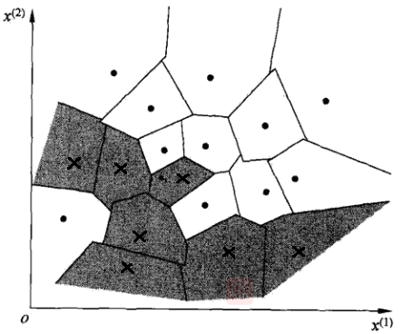

## 距离度量

特征空间中两个实例点的距离是两个实例点相似程度的。k近邻模型的特征空间一般是$n$维实数向量空间$R^n$。使用的距离是欧氏距离，但也可以是其他距离，如更一般的$L_p$距离也即闵可夫斯基距离（Minkowski Distance）。

这里说一句，**距离本质其实是相似度的度量**，所以，两个向量的夹角也是一种距离，交叉熵也是一种距离。具体的各种距离的定义，请看本笔记中的“线性代数”一章中的“范数与距离”小节，这里就不再重复叙述了。

不同的距离度量所确定的最近邻点是不同的。

**数据归一化：**

由于数据的各个特征的量纲不同，可能会导致某个特征的重要性远远大于其他特征，这是不客观的，所以我们应该让每个特征都是同等重要的！这也是我们在计算距离时要对数据进行归一化的原因。归一化公式如下：

一般来说，假设进行kNN分类使用的样本特征（$n$维）是
$$
{(x_i^{(1)},x_i^{(2)},...,x_i^{(n)})},\ i=1,2,...,m
$$
，取每一轴上的最大值最小值
$$
M_j=\mathop{\text{max}}_{i=1,...,m}x_{ij}-\mathop{\text{min}}_{i=1,...,m}x_{ij}
$$
，并且在计算距离时将每一个坐标轴除以相应的$M_j$进行归一化，即
$$
d((y_1,...,y_n),(z_1,...,z_n))=\sqrt{\sum_{j=1}^n(\frac{y_j}{M_j}-\frac{z_j}{M_j})^2}
$$

## k值的选择

k值的选择会对k近邻的结果产生较大的影响。

如果选择较小的k值，就相当于用较小的邻域中的训练实例进行预测，“学习”的近似误差会减小，只有与输入实例较近的（相似的）训练实例才会对预测结果起作用。但缺点是“学习”的估计误差会增大，预测结果会对近邻的实例点非常敏感。如果邻近的实例点恰巧是噪声，预测就会出错。换句话说，k值的减小，就意味着整体模型变得复杂，容易发生**过拟合**。

如果选取较大的k值，就相当于用较大邻域的训练实例进行预测。其优点是可以减小学习的估计误差。但缺点是学习的近似误差会非常大。这时与输入实例较远的（不相似的）训练实例也会对预测起作用，使预测发生错误。k值的增大就意味着整体的模型变得简单。

如果k=N，那么无论输入实例是什么，都将会简单地预测它属于在训练实例中最多的类。这时，模型过于简单，完全忽略了实例中的大量有用的信息，是不可取的。

在应用中，k值一般选取一个比较小的值。通常采用交叉验证法来选取最优的k值。

## 分类决策规则

k近邻法中的分类决策规则往往是多数表决，即由输入实例的k个邻近的训练实例中的多数类决定输入实例的类。

多数表决规则有如下解释：如果分类的损失函数为0-1损失函数，分类函数为
$$
f:R^n\rightarrow\{c_1,c_2,...,c_k\}
$$
那么误分类的概率是
$$
P(Y\neq f(X))=1-P(Y=f(X))
$$
对给定的实例$x$，其最近邻的k个训练实例点构成集合$N_k(x)$。如果涵盖$N_k(x)$的区域的类别是$c_j$，那么误分类率是
$$
\frac{1}{k}\sum_{x_i\in N_k(x)}I(y_i\neq c_j)=1-\frac{1}{k}\sum_{x_i\in N_k(x)}I(y_i=c_j)
$$

要使误分类率最小即经验风险最小，就要使
$$
\frac{1}{k}\sum_{x_i\in N_k(x)}I(y_i=c_j)
$$
最大，所以多数表决规则等价于经验风险的最小化。


讲到这里，k近邻算法基本内容我们已经讲完了。除去之后为了提高查找效率提出的kd树外，算法的原理，应用等方面已经讲解完毕。

# k近邻法的实现：kd树

## kd树

k-d tree即k-dimensional tree，常用来作空间划分及近邻搜索，是二叉空间划分树的一个特例。通常，对于维度为k，数据点数为N的数据集，k-d tree适用于$N>>2^k$的情形。

k-d tree是每个节点均为k维数值点的二叉树，其上的每个节点代表一个超平面，该超平面垂直于当前划分维度的坐标轴，并在该维度上将空间划分为两部分，一部分在其左子树，另一部分在其右子树。即若当前节点的划分维度为d，其左子树上所有点在d维的坐标值均小于当前值，右子树上所有点在d维的坐标值均大于等于当前值，本定义对其任意子节点均成立。

## 构造kd树

### kd树构造过程

一个平衡的k-d tree，其所有叶子节点到根节点的距离近似相等。但一个平衡的k-d tree对最近邻搜索、空间搜索等应用场景并非是最优的。
常规的k-d tree的构建过程为：循环依序取数据点的各维度来作为切分维度，取数据点在该维度的中值作为切分超平面，将中值左侧的数据点挂在其左子树，将中值右侧的数据点挂在其右子树。递归处理其子树，直至所有数据点挂载完毕。
**a）切分维度选择优化**
构建开始前，对比数据点在各维度的分布情况，数据点在某一维度坐标值的方差越大分布越分散，方差越小分布越集中。从方差大的维度开始切分可以取得很好的切分效果及平衡性。
**b）中值选择优化**
第一种，算法开始前，对原始数据点在所有维度进行一次排序，存储下来，然后在后续的中值选择中，无须每次都对其子集进行排序，提升了性能。
第二种，从原始数据点中随机选择固定数目的点，然后对其进行排序，每次从这些样本点中取中值，来作为分割超平面。该方式在实践中被证明可以取得很好性能及很好的平衡性。
本文采用常规的构建方式，以二维平面点(x,y)的集合(2,3)，(5,4)，(9,6)，(4,7)，(8,1)，(7,2)为例结合下图来说明k-d tree的构建过程。
**a）**构建根节点时，此时的切分维度为x，如上点集合在x维从小到大排序为(2,3)，(4,7)，(5,4)，(7,2)，(8,1)，(9,6)；其中值为(7,2)。（注：2,4,5,7,8,9在数学中的中值为(5 + 7)/2=6，但因该算法的中值需在点集合之内，所以本文中值计算用的是len(points)/2=3, points[3]=(7,2)）
**b）**(2,3)，(4,7)，(5,4)挂在(7,2)节点的左子树，(8,1)，(9,6)挂在(7,2)节点的右子树。
**c）**构建(7,2)节点的左子树时，点集合(2,3)，(4,7)，(5,4)此时的切分维度为y，中值为(5,4)作为分割平面，(2,3)挂在其左子树，(4,7)挂在其右子树。
**d）**构建(7,2)节点的右子树时，点集合(8,1)，(9,6)此时的切分维度也为y，中值为(9,6)作为分割平面，(8,1)挂在其左子树。至此k-d tree构建完成。

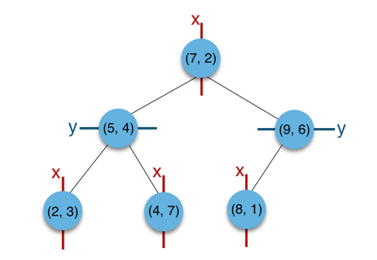

上述的构建过程结合下图可以看出，构建一个k-d tree即是将一个二维平面逐步划分的过程。

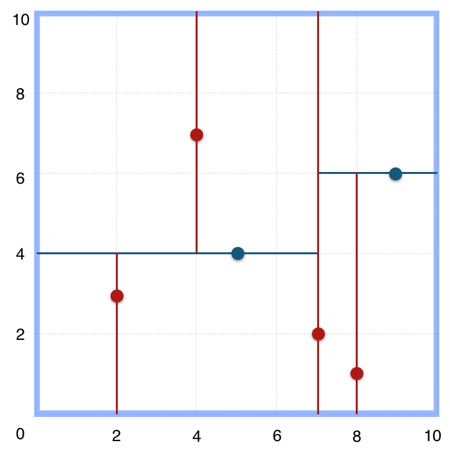

我们还可以结合下图（该图引自[维基百科](https://en.wikipedia.org/wiki/K-d_tree)），从三维空间来看一下k-d tree的构建及空间划分过程。
首先，边框为红色的竖直平面将整个空间划分为两部分，此两部分又分别被边框为绿色的水平平面划分为上下两部分。最后此4个子空间又分别被边框为蓝色的竖直平面分割为两部分，变为8个子空间，此8个子空间即为叶子节点。

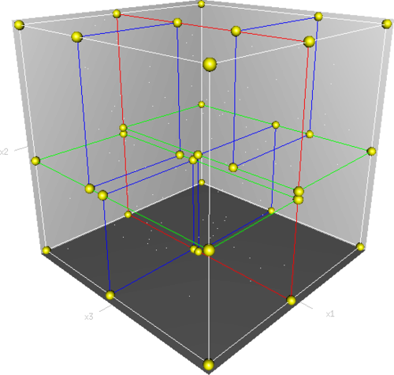

### 直观理解kd树的构造

kd树是一个二叉树结构，它的每一个节点记载了【特征坐标，切分轴，指向左枝的指针，指向右枝的指针】。

其中，特征坐标是线性空间$R^n$中的一个点(x1,x2,...,xn)。

切分轴由一个整数r表示，这里1≤r≤n，是我们在n维空间中沿第r维进行一次分割。

节点的左枝和右枝分别都是kd树，并且满足：如果y是左枝的一个特征坐标，那么yr≤xr，并且如果z是右枝的一个特征坐标，那么zr≥xr。

给定一个数据样本集S∈R^n和切分轴r，以下递归算法将构建一个基于该数据集的kd树，每一次循环制作一个节点：

* 如果|S|=1，记录S中唯一的一个点为当前节点的特征数据，并且不设左枝和右枝。（|S|指集合S中元素的数量）
* 如果|S|>1：
  * 将S内所有点按照第r个坐标的大小进行排序；
  * 选出该排列后的中位元素（如果一共有偶数个元素，则选择中位左边或右边的元素，左或右并无影响），作为当前节点的特征坐标，并且记录切分轴r；
  * 将$S_L$设为在S中所有排列在中位元素之前的元素；$S_R$设为在S中所有排列在中位元素后的元素；
  * 当前节点的左枝设为以$S_L$为数据集并且r为切分轴制作出的kd树；当前节点的右枝设为以$S_R$为数据集并且r为切分轴制作出的kd树。再设r←(r+1)mod n。（这里，我们想轮流沿着每一个维度进行分割；mod n是因为一共有n个维度，在沿着最后一个维度进行分割之后再重新回到第一个维度。）

**构造 kd 树的例子**

上面抽象的定义和算法确实是很不好理解，举一个例子会清楚很多。首先随机在$R^2$空间中随机生成13个点作为我们的数据集。起始的切分轴r=0；这里r=0对应x轴，而r=1对应y轴。

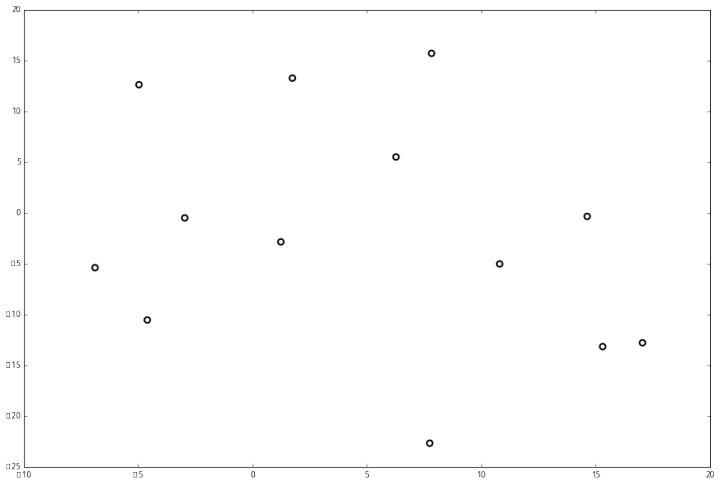

首先先沿x坐标进行切分，我们选出x坐标的中位点，获取最根部节点的坐标

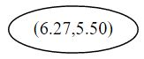

并且按照该点的x坐标将空间进行切分，所有x坐标小于6.27的数据用于构建左枝，x坐标大于6.27的点用于构建右枝。


在下一步中r = 0+1 = 1mod2 = 1对应y轴，左右两边再按照y轴的排序进行切分，中位点记载于左右枝的节点。得到下面的树，左边的x是指这该层的节点都是沿x轴进行分割的。

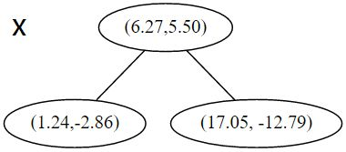

空间的切分如下

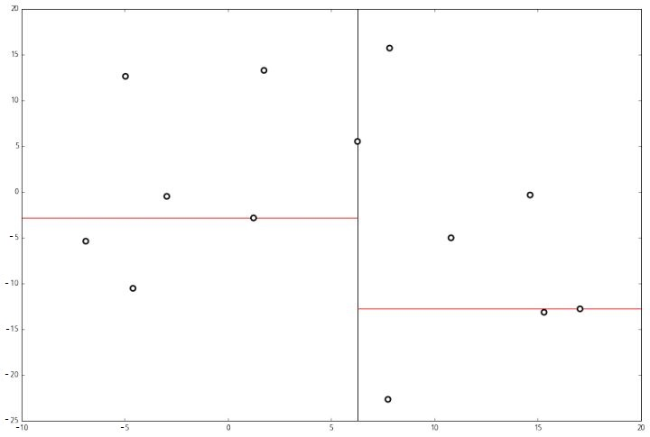

下一步中r = 1+1 = 2 mod 2 = 0，对应x轴，所以下面再按照x坐标进行排序和切分，有

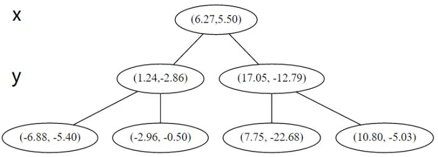

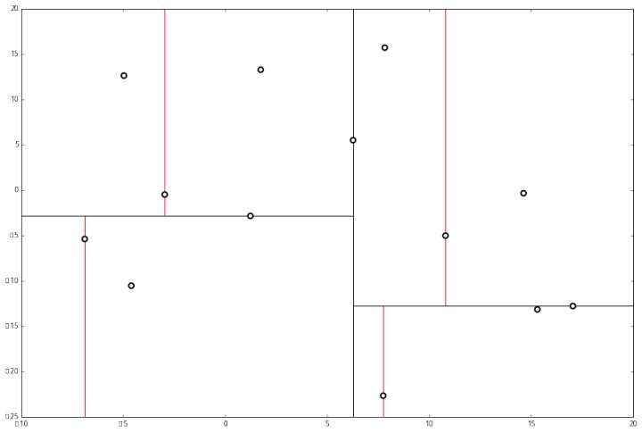

最后每一部分都只剩一个点，将他们记在最底部的节点中。因为不再有未被记录的点，所以不再进行切分。

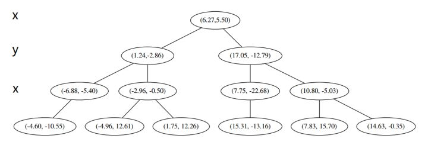

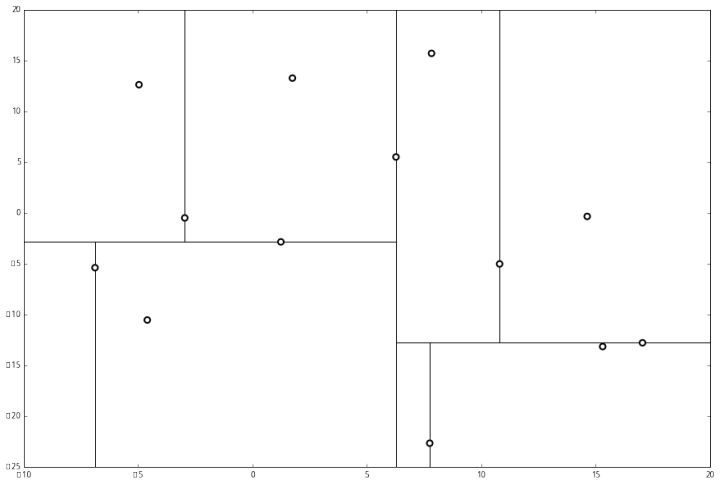

就此完成了 kd 树的构造。

## 搜索kd树

### 直观理解kd树搜索算法

kd树是一种二叉树数据结构，可以用来进行高效的kNN计算。kNN很简单，但是所用到的kd树算法偏于复杂，本篇将先介绍以二叉树的形式来记录和索引空间的思路，以便读者更轻松地理解kd树。

**前言**

kd树（k-dimensional tree）是一个包含空间信息的二项树数据结构，它是用来计算kNN的一个非常常用的工具。如果特征的维度是D，样本的数量是N，那么一般来讲kd树算法的复杂度是O(D log(N))，相比于穷算的O(DN)省去了非常多的计算量。

因为kd树的概念和算法较为复杂，故将本教程分为“思路篇”和“详细篇”。 两篇的内容在一定程度上是重叠的，但是本篇注重于讲解kd树背后的思想和直觉，告诉读者一颗二项树是如何承载空间概念的，我们又该如何从树中读取这些信息；而之后的详细篇则详细讲解kd树的定义，如何构造它并且如何计算kNN。出于教学起见，本文讲的例子和算法与严格的kd树有一些差异。

关于在学习编程和算法时有没有必要自己制作轮子的问题，一直存在着很多的争议。作者认为，做不做轮子暂且不论，但是有必要去了解轮子是怎么做出来 的。Python的scikit-learn机器学习包提供了蛮算、kd树和ball树三种kNN算法，学完本篇的读者若无兴趣自撰算法，可以非常轻松地使用该包。

**直觉**

给定一堆已有的样本数据，和一个被询问的数据点（红色五角星），我们如何找到离五角星最近的15个点？

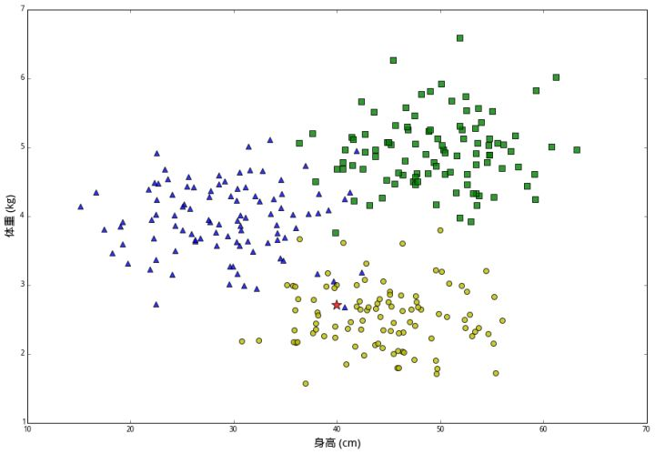

先忽略在编程上的实现，想一想一个人如何主观地执行。嗯，他一定会把在五角附近的一些点中，分别计算每一个的距离，然后选最近的15个。这样可能只需要进行二三十次距离计算，而不是300次。

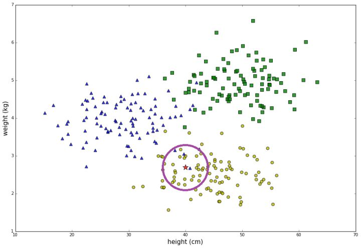

如图，只对紫圈里的点进行计算。

啊哈！问题来了。我们讲到的“附近”已经包含了距离的概念，如果不经过计算我们怎么知道哪个点是在五角星的“附近”？为什么我们一下就认出了“附近”而计算机做不到？那是因为我们在观看这张图片时，得到的输入是已经带有距离概念的影像，然而计算机在进行计算时得到的则是没有距离概念的坐标数据。如 果要让一个人人为地从300组坐标里选出最近的15个，而不给他图像，那么他也省不了功夫，必须要把300个全部计算一遍才行。

这样来说，我们要做的就是在干巴巴的坐标数据上进行加工，将空间分割成小块，并以合理地方法将信息进行储存，这样方便我们读取“附近”的点。

也就是说，对计算机来说，kd树将数据结构化，能让计算机看到数据的结构，如果计算机有眼睛的话，它看kd树相当于人眼看图片一样，这样就大大简化了搜索的复杂度，很快就能找到临近的点，就像人眼能很快找到临近的点一样，因为看到的数据已经被结构化了。图片对人眼就是结构化的数据，kd树对计算机就是结构化的数据。

**切割**

这只危险的兔子，它又回来了！它今天上了四个纹身，爱心、月牙、星星和眼泪，下面是它的照片。


我们来回答一个简单的问题：在这幅照片上，距离爱心最近的纹身是什么？对于这个问题，如果进行蛮算的办法我们需要计算 3 次距离（分别和月亮、眼泪和星星算一次）。下面我们要做的是把整个空间按照左右和上下进行等分，并且把分割后的小空间以二叉树形式进行记录，这样可以很快地读取邻近的点而省去计算量。

好，我们先竖向沿中间把这个兔子切成两半

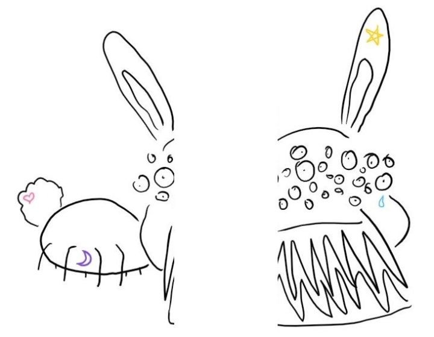

再沿横向从中间切成四份


再沿着竖向平分八份

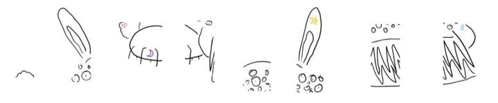

最后再沿横向切一次。这次有些区域是完全空白的，我们就把它舍弃不要了，得到 14 份：

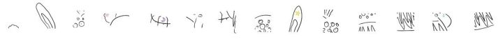

我们再按照上下左右的关系把切开的图片做成一个二叉树，树的每一个节点是一幅图，它的两个枝是这幅图平分出来的子图。

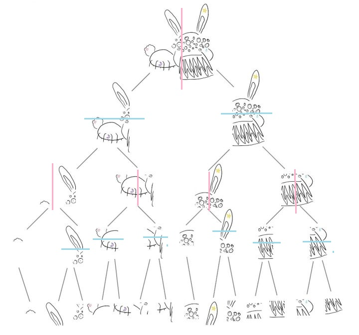

可以看出这个树状结构包含了很多局部性的信息，因为它的每一个节点都是按照上下或者左右进行平分的，因此如果两个点在树中的距离较近，那么它们的实际距离就是比较近的。

用平面图表示切分结果为


**搜寻**

接下来我们要通过这棵二叉树找到离爱心最近的纹身。

首先从树的最顶端开始，向下搜寻找到最底部包含爱心的节点。这个操作非常简单，因为每一次分割要么是沿着某纵线X=a要么是沿着横线Y=a，因此只需要判断爱心的x或y轴坐标是大于a还是小于a，便知道是向左还是右边选择树枝。

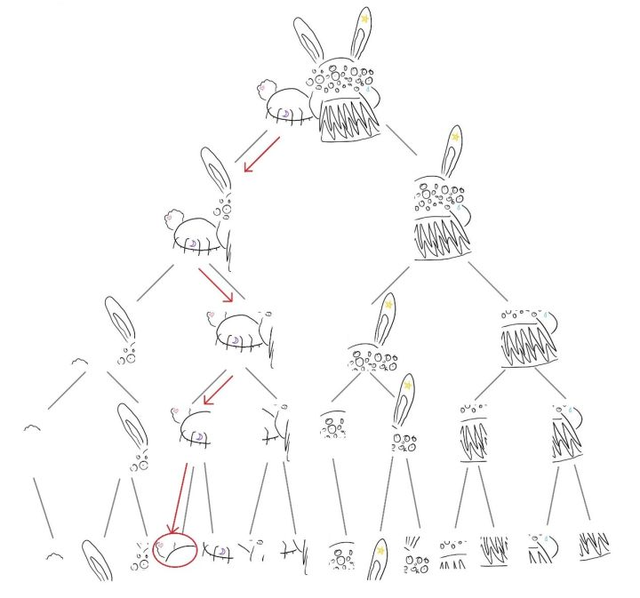

在找到了爱心之后，我们沿着相同的路径向上攀爬。只爬了一节就发现了屁股上的两个纹身：


这里看出，在8平分的情况下，爱心和月亮是在同一个区域的。在某种意义上来讲它们是“近”的，但是我们还不能确定它们是最近的，因此还要继续向上攀爬寻找。再继续向上爬两个节点，都没有出现爱心和月亮以外的纹身。在下面这个节点中

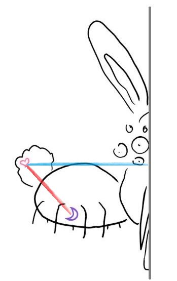

我们发现爱心和月亮之间的距离（红线）要小于爱心和分割线的距离（蓝线），也就是说，不论分割线的右边是什么情况，那边的纹身都不可能离爱心更近。因此可以判断，离爱心最近的图形是月亮。

这样，我们只计算了一次爱心和月亮之间的距离和一次爱心和分割线之间的距离，而不是分别计算爱心和其他三个纹身的距离。并且，要知道，爱心和分割线之间距离的计算非常简单，就是爱心的x坐标和分割线的x坐标的差（的绝对值），相比于计算两点之间的距离：
$$
\sqrt{(x_1-y_1)^2+(x_2-y_2)^2}
$$
要省下很多计算量。

**麻烦**

啊，但也有可能这个搜寻最近点的过程没那么顺利。在上面的计算中，在找到了离爱心比较近的月亮之后，我们发现爱心距离分割线的距离比较远，因此确定月亮的确就是最近的。但是，在分割线的另一边有一个更近的纹身，那么情况就稍微复杂了。

就说这个兔子，又去加了两个纹身，一片叶子和一个圆圈。


二叉树分割上也相应地多出这两个纹身。我们想找到离爱心最近的纹身，所以依旧向下搜寻先找到爱心。


我们找来一张纸，记下在已访问节点中距离爱心最近的纹身和所对应的距离。现在这张纸还是空的。

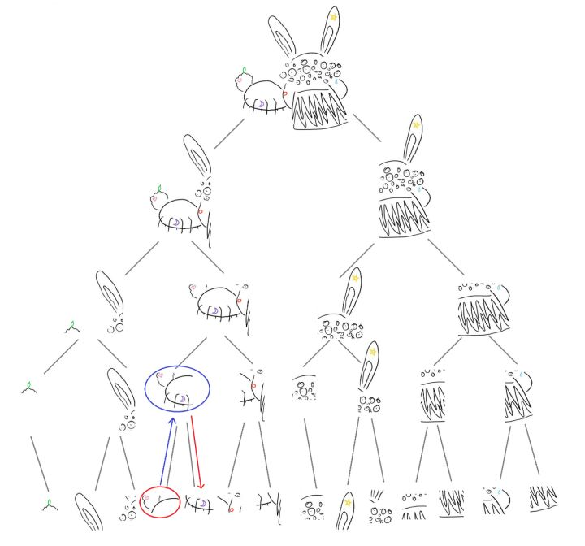

向上爬了一节，发现那一节的另一个枝里有月亮，于是跑下去查看月亮的坐标，计算爱心和月亮的距离，并在纸上记录 (图形=月亮，距离=d1)。

再回到蓝圈的节点向上爬，继续向上爬。我们发现，d1（红线）大于爱心和分割线的距离（蓝线）。

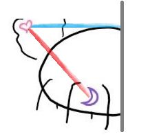

也就是说分割线的另一边可能有更近的点，所以从另一个分枝开始向下搜，找到…

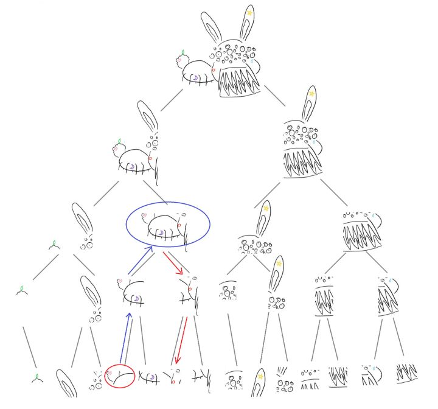

在另一个分枝中我们追溯到圆圈，并计算它与爱心的距离 d2，发现 d2>d1，比月亮远，所以丢弃不要。

再向上爬一个节，我们发现 d1（红线）大于爱心和切分线之间的距离（蓝线）

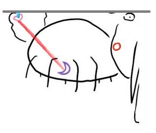

因此，切分线的另一端可能有更近的纹身，因此我们从另一个树枝向下搜索…

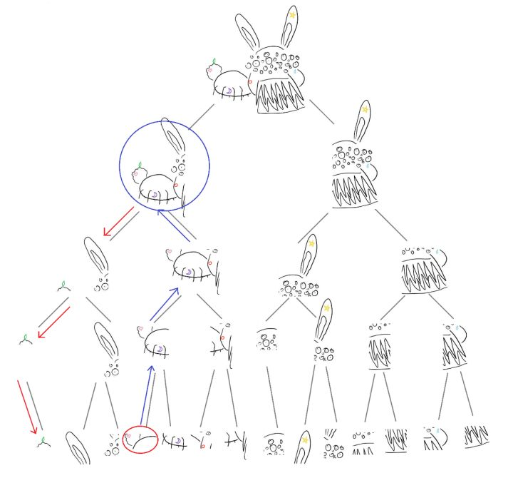

找到了叶子。（所幸在这个分枝里只搜索到了叶子，如果有更多的图形的话，还需要进行多层的递归。具体的过程会在后面的详细篇中讲解。）计算叶子和爱心之间的距离，得 d3，并发现 d3<d1，比月亮更近，于是更新纸上的记录为 (纹身=叶子，距离=d3)。

再向上攀登一节，我们发现 d3小于爱心和切分线的距离，因此另一边的数据就不用考虑了。

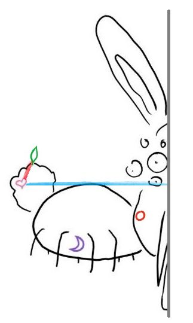

然后再向向上攀登一节，这次我们发现已经爬到了树的最顶端，则完成了搜索，纸上记载的 (叶子，d3)就是最近的纹身和对应的距离。

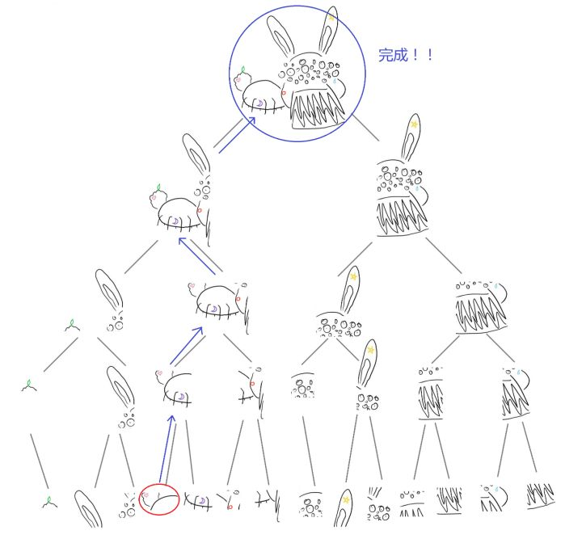

**结语**

在以上的算法中，当我们已经找到了比切分线更近的点时，就不需要继续搜索切分线另一边的点了，因为那些只会更远。于是，通过把整个空间进行分割并以树状结构进行记录，我们只需要在问题点附近的一些区域进行搜寻便可以找到最近的数据点，节省了大量的计算。

到此为止，本篇文章友好地介绍了如何使用二叉树的形式记录距离信息并快速地进行搜索，但文中所讲的还不是 kd树。下一篇文章，详细篇，将系统性地介绍kd树的定义和在kd树上的kNN算法。

**kd树上的kNN算法**

上面部分我们介绍了如何用二叉树格式记录空间内的距离，并以其为依据进行高效的索引。在本篇文章中，我们将详细介绍kd树上的kNN算法。

给定一个构建于一个样本集的kd树，下面的算法可以寻找距离某个点p最近的k个样本。

* **零**：设L为一个有k个空位的列表，用于保存已搜寻到的最近点。
* **一**：根据p的坐标值和每个节点的切分向下搜索（也就是说，如果树的节点是照xr进行切分，并且p的r坐标小于a，则向左枝进行搜索；反之则走右枝）。
* **二**：当达到一个底部节点时，将其标记为访问过。如果L里不足k个点，则将当前节点的特征坐标加入L ；如果L不为空并且当前节点的特征与p的距离小于L里最长的距离，则用当前特征替换掉L中离p最远的点。
* **三**：如果当前节点不是整棵树最顶端节点，执行(a)；反之，输出L，算法完成。
  * **a**. 向上爬一个节点。如果当前（向上爬之后的）节点未曾被访问过，将其标记为被访问过，然后执行(1) 和(2)；如果当前节点被访问过，再次执行(a)。
  * **1**.如果此时L里不足k个点，则将节点特征加入L；如果L中已满k个点，且当前节点与p的距离小于L里最长的距离，则用节点特征替换掉L中离最远的点。
  * **2**.计算p和当前节点切分线的距离。如果该距离大于等于L中距离p最远的距离并且L中已有k个点，则在切分线另一边不会有更近的点，执行(三)；如果该距离小于L中最远的距离或者L中不足k个点，则切分线另一边可能有更近的点，因此在当前节点的另一个枝从(一)开始执行。

**啊呃… 被这算法噎住了，赶紧喝一口下面的例子**

设我们想查询的点为p=(−1,−5)，设距离函数是普通的L2距离，我们想找距离问题点最近的k=3个点。如下：

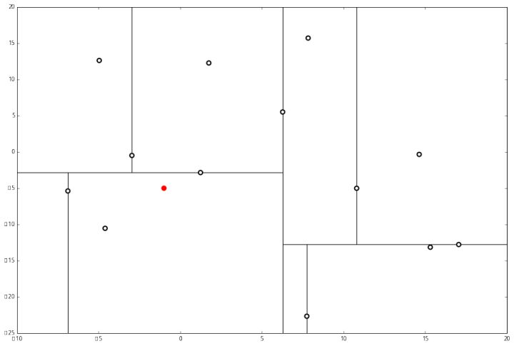

首先执行(一)，我们按照切分找到最底部节点。首先，我们在顶部开始

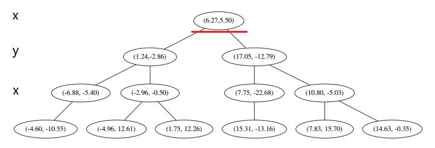

和这个节点的x轴比较一下，

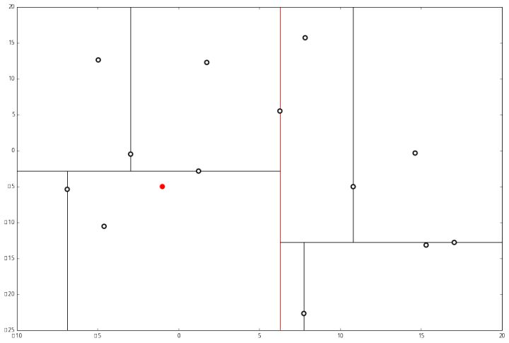

p的x轴更小。因此我们向左枝进行搜索：

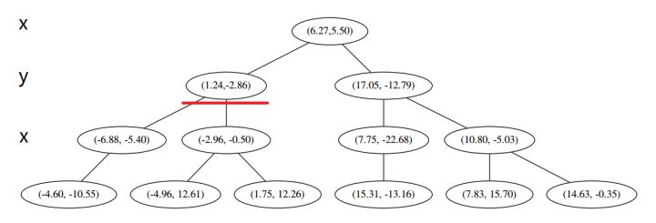

这次对比y轴，

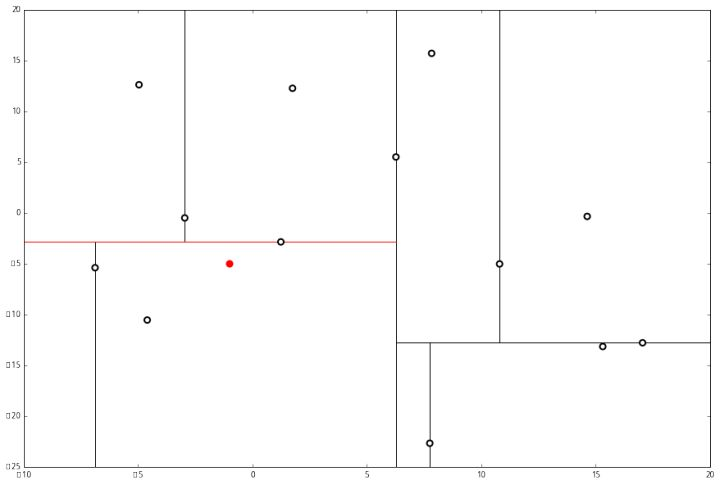

p的y值更小，因此向左枝进行搜索：

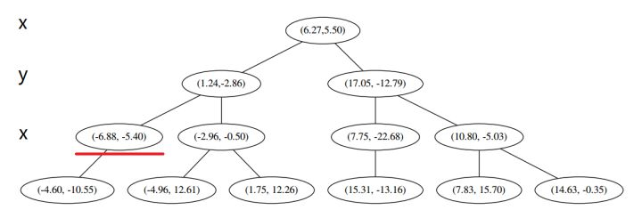

这个节点只有一个子枝，就不需要对比了。由此找到了最底部的节点(−4.6,−10.55)。

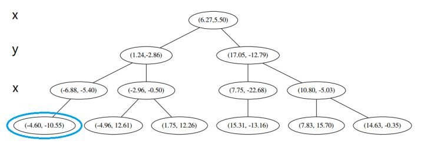

在二维图上是

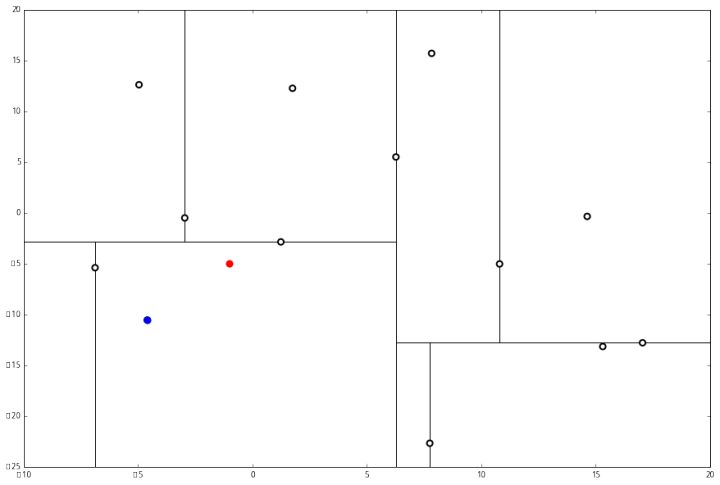

此时我们执行(二)。将当前结点标记为访问过，并记录下L=[(−4.6,−10.55)]。啊，访问过的节点就在二叉树上显示为被划掉的好了。

然后执行(三)，嗯，不是最顶端节点。好，执行(a)，我爬。上面的是(−6.88,−5.4)。

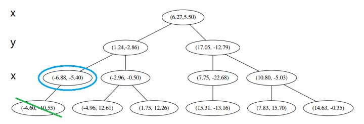

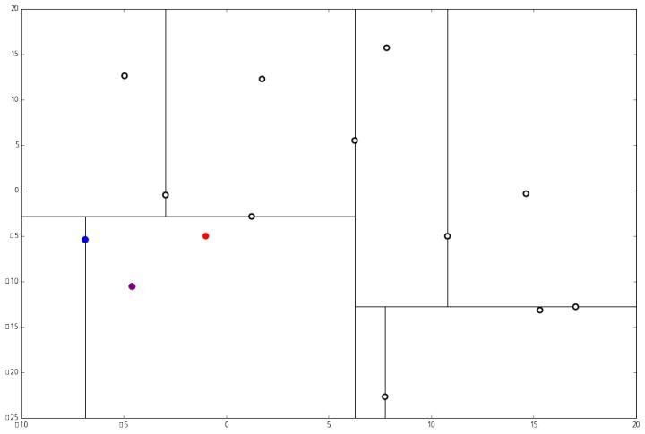

执行(1)，因为我们记录下的点只有一个，小于k=3，所以也将当前节点记录下，有L=[(−4.6,−10.55),(−6.88,−5.4)].再执行(2)，因为当前节点的左枝是空的，不用计算p和当前切分线的距离了，所以直接跳过，回到步骤(三)。(三)看了一眼，好，不是顶部，交给你了，(a)。于是乎(a)又往上爬了一节。

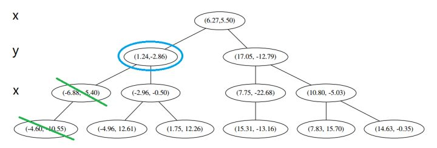

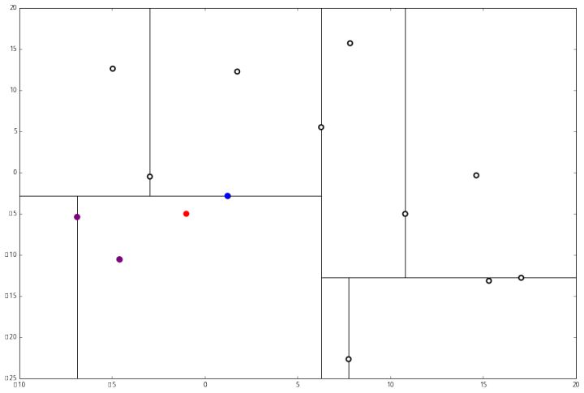

当前节点还未被访问过，所以，将当前节点标记为访问过的。

(1) 说，由于还是不够三个点，于是将当前点也记录下，有L=[(−4.6,−10.55),(−6.88,−5.4),(1.24,−2.86)]。

(2) 又发现，当前节点有其他的分枝，并且经计算得出p点和L中的三个点的距离分别是6.62,5.89,3.10，但是p和当前节点的分割线的距离只有2.14，小于与L的最大距离：

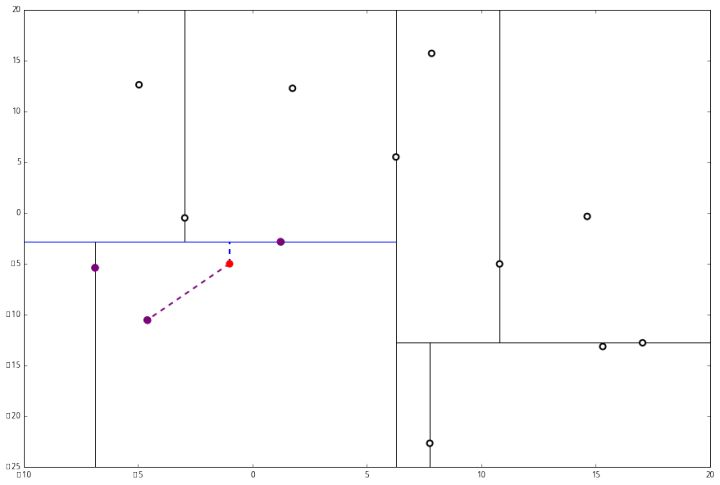

因此，这说明在分割线的另一端可能有更近的点。于是我们在当前结点的另一个分枝从头执行(一)。好，我们在红线这里：

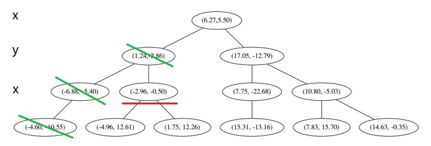

要用p和这个节点比较x坐标：


p的x坐标更大，因此探索右枝(1.75,12.26)，并且发现右枝已经是最底部节点，因此启动(二)。

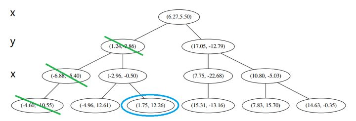

经计算，(1.75,12.26) 与p的距离是17.48，要大于p与L的距离，因此我们不将其放入记录中。

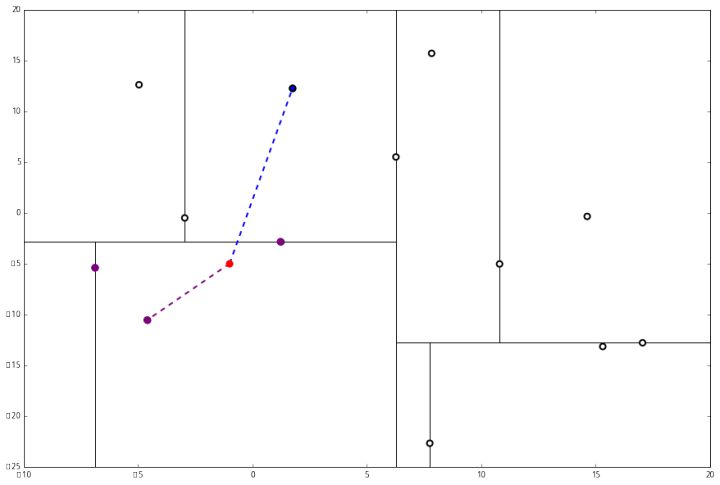

然后(三)判断出不是顶端节点，呼出(a)，往上爬一个节点。

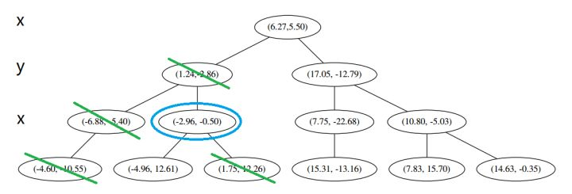

该节点未被访问过，所以标记为已访问。执行(1)。

(1)出来一算，这个节点与p的距离是4.91，要小于p与L的最大距离6.62。

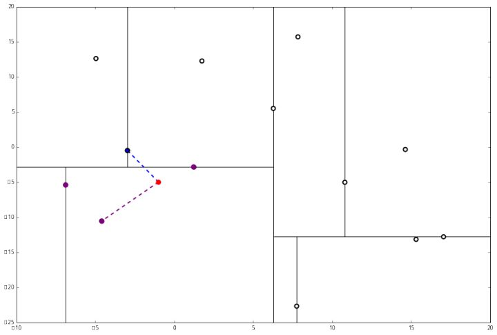

因此，我们用这个新的节点替代L中离p最远的(−4.6,−10.55)。

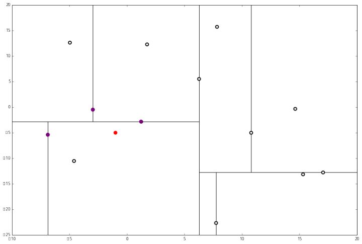

然后(2)又来了，我们比对p和当前节点的分割线的距离

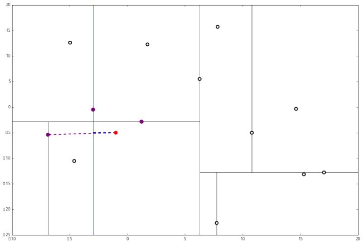

这个距离小于L与p的最小距离，因此我们要到当前节点的另一个枝执行 (一)。当然，那个枝只有一个点，直接到 (二)。

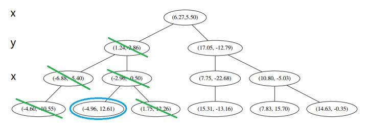

将此节点标记为已访问过，计算距离发现这个点离p比L更远，因此不进行替代。

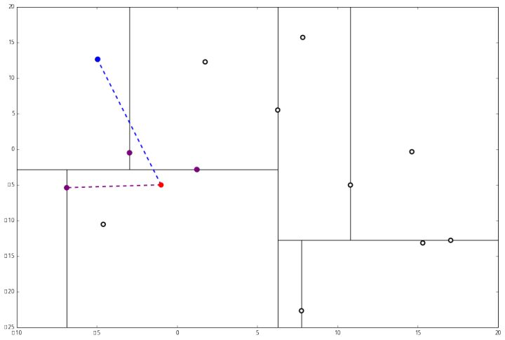

(三)发现不是顶点，所以呼出(a)。我们向上爬，

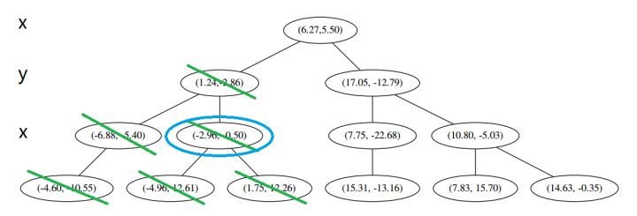

这个是已经访问过的了，所以再来（a），

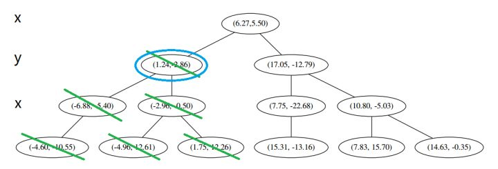

好，（a）再爬，

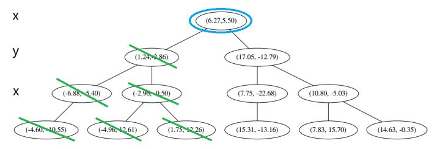

啊！到顶点了。所以完了吗？当然不，还没轮到(三) 呢。现在是 (1) 的回合。

我们进行计算比对发现顶端节点与p的距离比L还要更远，因此不进行更新。

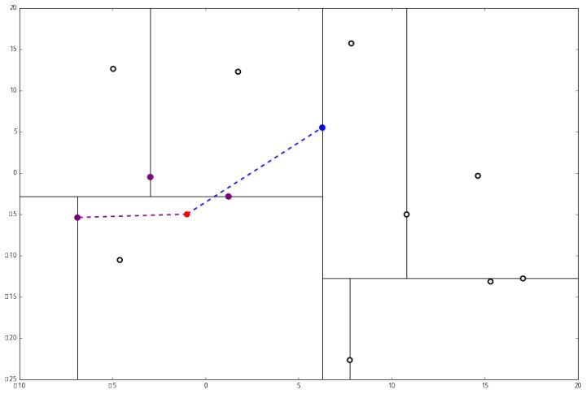

然后是(2)，计算p和分割线的距离发现也是更远。

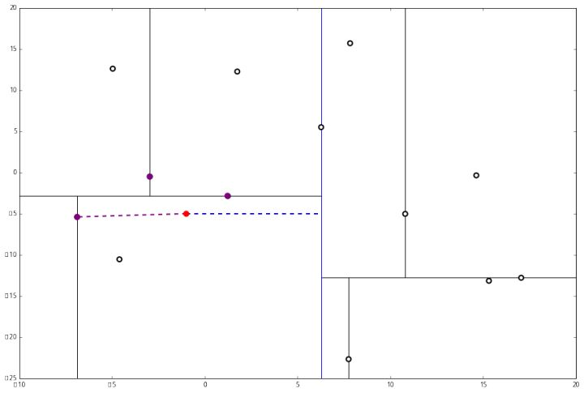

因此也不需要检查另一个分枝。

然后执行(三)，判断当前节点是顶点，因此计算完成！输出距离p最近的三个样本是L=[(−6.88,−5.4),(1.24,−2.86),(−2.96,−2.5)]。

卧槽，终于完了！写死我了！

**结语**

kd树的kNN算法节约了很大的计算量（虽然这点在少量数据上很难体现），但在理解上偏于复杂，希望本篇中的实例可以让读者清晰地理解这个算法。喜欢动手的读者可以尝试自己用代码实现kd树算法，但也可以用现成的机器学习包scikit-learn来进行计算。

### scikit-learn的搜索kd树

Python的scikit-learn机器学习包提供了蛮算、kd树和ball树三种kNN算法，这里使用kd树。

scikit-learn是一个实用的机器学习类库，其有KDTree的实现。如下例子为直观展示，仅构建了一个二维空间的k-d tree，然后对其作k近邻搜索及指定半径的范围搜索。多维空间的检索，调用方式与此例相差无多。

~~~python
#!/usr/bin/python
# -*- coding: UTF-8 -*-
import numpy as np
from matplotlib import pyplot as plt
from matplotlib.patches import Circle
from sklearn.neighbors import KDTree

np.random.seed(0)
points = np.random.random((100, 2))
tree = KDTree(points)
point = points[0]

# kNN 搜索与point最近的三个点
dists, indices1 = tree.query([point], k=3)
print(dists, indices1)

# query radius 指定半径搜索
indices2 = tree.query_radius([point], r=0.2)
print(indices2)

fig = plt.figure()
ax = fig.add_subplot(111, aspect='equal')
ax.add_patch(Circle(point, 0.2, color='r', fill=False))
X, Y = [p[0] for p in points], [p[1] for p in points]
plt.scatter(X, Y)
plt.scatter([point[0]], [point[1]], c='r')
# 距离指定点point最近的三个点（这里画出除了自身的其他两个点）
plt.scatter(points[indices1[0,1]][0], points[indices1[0,1]][1], c='y')
plt.scatter(points[indices1[0,2]][0], points[indices1[0,2]][1], c='y')
plt.show()
~~~

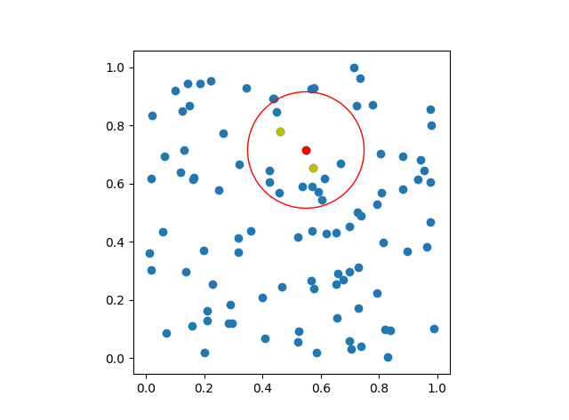

# KNN的优缺点

## 优点

1）算法简单，理论成熟，既可以用来做分类也可以用来做回归。

2）可用于非线性分类。

3）没有明显的训练过程，而是在程序开始运行时，把数据集加载到内存后，不需要进行训练，直接进行预测，所以训练时间复杂度为0。

4）由于KNN方法主要靠周围有限的邻近的样本，而不是靠判别类域的方法来确定所属的类别，因此对于类域的交叉或重叠较多的待分类样本集来说，KNN方法较其他方法更为适合。

5）该算法比较适用于样本容量比较大的类域的自动分类，而那些样本容量比较小的类域采用这种算法比较容易产生误分类情况。

## 缺点

1）需要算每个测试点与训练集的距离，当训练集较大时，计算量相当大，时间复杂度高，特别是特征数量比较大的时候。

2）需要大量的内存，空间复杂度高。

3）样本不平衡问题（即有些类别的样本数量很多，而其它样本的数量很少），对稀有类别的预测准确度低。

4）是lazy learning方法，基本上不学习，导致预测时速度比起逻辑回归之类的算法慢。

注意，为了克服降低样本不平衡对预测准确度的影响，我们可以对类别进行加权，例如对样本数量多的类别用较小的权重，而对样本数量少的类别，我们使用较大的权重。 另外，作为KNN算法唯一的一个超参数k,它的设定也会算法产生重要影响。因此，为了降低k值设定的影响，可以对距离加权。为每个点的距离增加一个权重，使得距离近的点可以得到更大的权重。

# 项目实践

## scikit-learn中的kNN分类介绍

不费话，

~~~python
from sklearn import neighbors
~~~

开始吧。

**k 最近邻分类器详解**

本篇中，我们讲解的是scikit-learn库中的neighbors.KNeighborsClassifier，翻译为k最近邻分类器，也就是我们常说的kNN，k-nearest neighbors。首先进行这个类初始化：

```python
neighbors.KNeighborsClassifier(n_neighbors=5, weights=’uniform’, algorithm=’auto’, leaf_size=30, p=2, metric=’minkowski’, metric_params=None, n-jobs=1)
```

好多啊参数呀，真是的。来，一个一个讲。

**n_neighbors**就是kNN里的k，就是在做分类时，我们选取问题点最近的多少个最近邻。

**weights**是在进行分类判断时给最近邻附上的加权，默认的'uniform'是等权加权，还有'distance'选项是按照距离的倒数进行加权，也可以使用用户自己设置的其他加权方法。举个例子：假如距离询问点最近的三个数据点中，有1个A类和2个B类，并且假设A类离询问点非常近，而两个B类距离则稍远。在等权加权中，kNN会判断问题点为B类；而如果使用距离加权，那么A类有更高的权重（因为更近），如果它的权重高于两个B类的权重的总和，那么算法会判断问题点为A类。权重功能的选项应该视应用的场景而定。

**algorithm**是kNN所采用的算法，有ball_tree、kd_tree、brute（暴力求解）、auto四种，auto会基于fit的数据来自动采取最合适的算法。

**leaf_size**是kd_tree或ball_tree生成的树的树叶（树叶就是二叉树中没有分枝的节点）的大小。在kd树文章中我们所有的二叉树的叶子中都只有一个数据点，但实际上树叶中可以有多于一个的数据点，算法在达到叶子时在其中执行蛮力计算即可。对于很多使用场景来说，叶子的大小并不是很重要，我们设leaf_size=1就好。

**metric**和**p**，是距离函数的选项，如果metric ='minkowski' 并且p=p的话，计算两点之间的距离就是
$$
d((x_1,...,x_n),(y_1,...,y_n))=(\sum_{i=1}^{n}\left | x_i-y_i \right |^p)^{1/p}
$$
一般来讲，默认的metric='minkowski'（默认）和p=2（默认）就可以满足大部分需求。其他的metric选项可见[说明文档](http://scikit-learn.org/stable/modules/generated/sklearn.neighbors.DistanceMetric.html)。metric_params是一些特殊metric选项需要的特定参数，默认是None。

**n_jobs**是并行计算的线程数量，默认是1，输入-1则设为CPU的内核数。

在创建了一个KNeighborsClassifier类之后，我们需要喂给它数据来进行学习。这时需要使用fit()拟合功能。

~~~python
neighbors.KNeighborsClassifier.fit(X,y)
~~~

在这里：

**X**是一个list或array的数据，每一组数据可以是tuple也可以是list或者一维array，但要注意所有数据的长度必须一样（等同于特征的数量）。当然，也可以把X理解为一个矩阵，其中每一横行是一个样本的特征数据。

**y**是一个和X长度相同的list或array，其中每个元素是X中相对应的数据的分类标签。

KNeighborsClassifier类**在对训练数据执行fit()后会根据原先algorithm的选项，依据训练数据生成一个kd_tree或者ball_tree**。如果输入是algorithm='brute'，则什么都不做。这些信息都会被保存在一个类中，我们可以用它进行预测和计算。几个常用的功能有：

**k 最近邻**

~~~python
neighbors.KNeighborsClassifier.kneighbors(X=None, n_neighbors=None, return_distance= True)
~~~

找到某点距离最近的那个点及最近距离。

这里X是一个list或array的坐标，如果不提供，则默认输入训练时的样本数据。

n_neighbors是指定搜寻最近的样本数据的数量，如果不提供，则以初始化KNeighborsClassifier时的n_neighbors为准。

这个功能输出的结果是 (dist=array[array[float]], index=array[array[int]])。index的长度和X相同，index[i]是长度为n_neighbors的一array的整数；假设训练数据是 fit(X_train, y_train)，那么X_train(index\[i][j]) 是在训练数据（X_train）中离X[i]第j近的元素，并且dist\[i][j]是它们之间的距离。

输入的return_distance是是否输出距离，如果选择False，那么功能的输出会只有index而没有dist。

**预测**

~~~python
y = neighbors.kNeighborsClassifier.predict(X)
~~~

也许是最常用的预测功能。输入X是一list或array的坐标，输出y是一个长度相同的array，y[i]是通过kNN分类对X[i]所预测的分类标签。

**概率预测**

~~~python
neighbors.kNeighborsClassifier.predict_proba(X)
~~~

输入和上面的相同，输出p是array[array[float]]，p[i][j]是通过概率kNN判断X[i]属于第j类的概率。这里类别的排序是按照词典排序；举例来说，如果训练用的分类标签里有 (1,'1','a')三种，那么1就是第0类，'1' 是第1类，'a' 是第2类，因为在Python中1<'1'<'a'。

**正确率打分**

~~~python
neighbors.KNeighborsClassifier.score(X, y, sample_weight=None)
~~~

这是用来评估一次kNN学习的准确率的方法。很多可能会因为样本特征的选择不当或者k值得选择不当而出现过拟合或者偏差过大的问题。为了保证训练方法的准确性，一般我们会将已经带有分类标签的样本数据分成两组，一组进行学习，一组进行测试。这个score()就是在学习之后进行测试的功能。同fit()一样，这里的X是特征坐标，y是样本的分类标签；sample_weight是对样本的加权，长度等于sample的数量。返回的是正确率的百分比。

## sk-learn实践1

看完上面的介绍，好，举例子了。

除了sklearn.neighbors，还需要导入numpy和matplotlib画图。

~~~python
from sklearn import neighbors
import numpy as np
import matplotlib.pyplot as plt
from matplotlib.colors import ListedColormap
~~~

我们随机生成6组200个的正态分布

~~~python
x1 = np.random.normal(50, 6, 200)
y1 = np.random.normal(5, 0.5, 200)

x2 = np.random.normal(30,6,200)
y2 = np.random.normal(4,0.5,200)

x3 = np.random.normal(45,6,200)
y3 = np.random.normal(2.5, 0.5, 200)
~~~

x1、x2、x3作为x坐标，y1、y2、y3作为y坐标，两两配对。(x1,y1) 标为1类，(x2, y2) 标为2类，(x3, y3)是3类。将它们画出得到下图，1类是蓝色，2类红色，3类绿色。

~~~python
fig1 = plt.figure('fig1')
plt.scatter(x1,y1,c='b',marker='s',s=50,alpha=0.8)
plt.scatter(x2,y2,c='r', marker='^', s=50, alpha=0.8)
plt.scatter(x3,y3, c='g', s=50, alpha=0.8)
fig1.show()
~~~

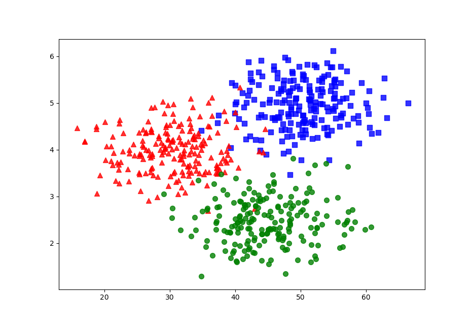

我们把所有的x坐标和y坐标连接在一起

```python
x_val = np.concatenate((x1,x2,x3))
y_val = np.concatenate((y1,y2,y3))
```

记得计算距离的归一化问题吗？我们求出x值的最大差还有y值的最大差。

~~~python
x_diff = max(x_val)-min(x_val)
y_diff = max(y_val)-min(y_val)
~~~

将坐标除以这个差以归一化，再将x和y值两两配对。

```python
x_normalized = [x/(x_diff) for x in x_val]
y_normalized = [y/(y_diff) for y in y_val]
xy_normalized = zip(x_normalized,y_normalized)
```

训练使用的特征数据已经准备好了，还需要生成相应的分类标签。生成一个长度600的list，前200个是1，中间200个是2，最后200个是3，对应三种标签。

~~~python
# 将对象中对应的元素打包成一个个元组
labels = [1]*200+[2]*200+[3]*200
~~~

然后，就要生成sk-learn的最近k邻分类功能了。参数中，n_neighbors设为30，其他的都使用默认值即可。

~~~python
clf = neighbors.KNeighborsClassifier(30)
~~~

（注意我们是从sklearn里导入了neighbors。如果是直接导入了sklearn，应该输入sklearn.neighbors.KNeighborsClassifier()）

下面就要进行拟合了。归一化的数据是xy_normalized，分类标签是labels，

~~~python
clf.fit(xy_normalized, labels)
~~~

就这么简单。下面我们来实现一些功能。

**k最近邻**

首先，我们想知道(50,5)和(30,3)两个点附近最近的5个样本分别都是什么。啊，坐标别忘了除以x_diff和y_diff来归一化。

~~~python
nearests = clf.kneighbors([(50/x_diff, 5/y_diff),(30/x_diff, 3/y_diff)], 5, False)
print(nearests)
~~~

得到

~~~python
[[141 155  93 179  30]
 [291 597 365 274 331]]
~~~

也就是说训练数据中的第141、155、93 、179、30个离(50,5)最近，第291、597、365、274、331个离(30,3)最近。

**预测**

还是上面那两个点，我们通过30NN（k=30）来判断它们属于什么类别。

```python
prediction = clf.predict([(50/x_diff, 5/y_diff),(30/x_diff, 3/y_diff)])
print(prediction)
```

得到

~~~python
[1 2]
~~~

也就是说(50,5)判断为1类，而(30,3)是2类。

**概率预测**

那么这两个点的分类的概率都是多少呢？

```python
prediction_proba = clf.predict_proba([(50/x_diff, 5/y_diff),(30/x_diff, 3/y_diff)])
prediction_proba
```

得到

~~~python
[[ 1.   0.   0. ]
 [ 0.   0.7  0.3]]
~~~

告诉我们，(50, 5)有100%的可能性是1类，而(30,3)有70%是2类，30%是3类。

**准确率打分**

我们再用同样的均值和标准差生成一些正态分布点，以此检测预测的准确性。

```python
x1_test = np.random.normal(50, 6, 100)
y1_test = np.random.normal(5, 0.5, 100)

x2_test = np.random.normal(30,6,100)
y2_test = np.random.normal(4,0.5,100)

x3_test = np.random.normal(45,6,100)
y3_test = np.random.normal(2.5, 0.5, 100)

xy_test_normalized = zip(np.concatenate((x1_test,x2_test,x3_test))/x_diff,\
                         np.concatenate((y1_test,y2_test,y3_test))/y_diff)
labels_test = [1]*100+[2]*100+[3]*100
```

测试数据生成完毕，下面进行测试

~~~python
score = clf.score(xy_test_normalized, labels_test)
print(score)
~~~

得到预测的正确率是97%还是很不错的。

再看一下，如果使用1NN分类，会出现过拟合的现象，那么准确率的评分就变为…

~~~python
clf1 = neighbors.KNeighborsClassifier(1)
clf1.fit(xy_normalized, labels)
score = clf1.score(xy_test_normalized, labels_test)
print(score)
~~~

95%，的确是降低了。我们还应该注意，这里的预测准确率很高是因为训练和测试的数据都是人为按照正态分布生成的，在实际使用的很多场景中（比如，涨跌预测）是很难达到这个精度的。

**生成些漂亮的图**

说到kNN那当然离不开分类图，不过这一般是为了教学用的，毕竟只能展示两个维度的数据，超过三个特征的话就画不出来了。所以这部分内容只是本篇的附加部分，有兴趣的读者可以向下阅读。

首先我们需要生成一个区域里大量的坐标点。这要用到np.meshgrid()函数。给定两个array，比如x=[1,2,3]和y=[4,5]，np.meshgrid(x,y)会输出两个矩阵
$$
\begin{bmatrix}
 1 &2 &3\\ 
 1 &2 &3
\end{bmatrix}
$$
和
$$
\begin{bmatrix}
 4 &4 &4\\ 
 5 &5 &5
\end{bmatrix}
$$
这两个叠加到一起得到六个坐标，
$$
\begin{bmatrix}
 (1,4) &(2,4) &(3,4)\\ 
 (1,5) &(2,5) &(3,5)
\end{bmatrix}
$$
就是以[1,2,3]为横轴，[4,5]为竖轴所得到的长方形区间内的所有坐标点。

好，我们现在要生成[1,70]x[1,7]的区间里的坐标点，横轴要每0.1一跳，竖轴每0.01一跳。于是

~~~python
xx,yy = np.meshgrid(np.arange(1,70.1,0.1), np.arange(1,7.01,0.01))
~~~

于是xx和yy都是601乘691的矩阵。还有，不要忘了除以x_diff和y_diff来将坐标归一化。

~~~python
xx_normalized = xx/x_diff
yy_normalized = yy/y_diff
~~~

下面，np.ndarray.ravel()功能可以把一个矩阵抻直成一个一维array，把
$$
\begin{bmatrix}
 1 &2 &3\\ 
 1 &2 &3
\end{bmatrix}
$$
变成
$$
\begin{bmatrix}
 1 &2 &3 &1 &2 &3
\end{bmatrix}
$$
np.c_( )又把两个array粘起来（类似于zip），输入
$$
\begin{bmatrix}
 1 &2 &3 &1 &2 &3
\end{bmatrix}
$$
和
$$
\begin{bmatrix}
 4 &4 &4 &5 &5 &5
\end{bmatrix}
$$
输出
$$
\begin{bmatrix}
 1 &2 &3 &1 &2 &3\\
  4 &4 &4 &5 &5 &5
\end{bmatrix}
$$
或者理解为
$$
\{(1,4),(2,4),(3,4),(1,5),(2,5),(3,5)\}
$$
于是

~~~python
coords = np.c_[xx_normalized.ravel(), yy_normalized.ravel()]
~~~

得到一个array的坐标。下面就可以进行预测

~~~python
Z = clf.predict(coords)
~~~

当然，Z是一个一维array，为了和xx还有yy相对应，要把Z的形状再转换回矩阵

~~~python
Z = Z.reshape(xx.shape)
~~~

下面用pcolormesh画出背景颜色。这里，ListedColormap是自己生成colormap的功能，#rrggbb颜色的rgb代码。pcolormesh会根据Z的值（1、2、3）选择colormap里相对应的颜色。pcolormesh和ListedColormap的具体使用方法会在关于画图的文章中细讲。

~~~python
fig2 = plt.figure('fig2')
light_rgb = ListedColormap([ '#AAAAFF', '#FFAAAA','#AAFFAA'])
plt.pcolormesh(xx, yy, Z, cmap=light_rgb)
plt.scatter(x1,y1,c='b',marker='s',s=50,alpha=0.8)
plt.scatter(x2,y2,c='r', marker='^', s=50, alpha=0.8)
plt.scatter(x3,y3, c='g', s=50, alpha=0.8)
plt.axis((10, 70, 1, 7))
fig2.show()
~~~

运行结果如下图所示

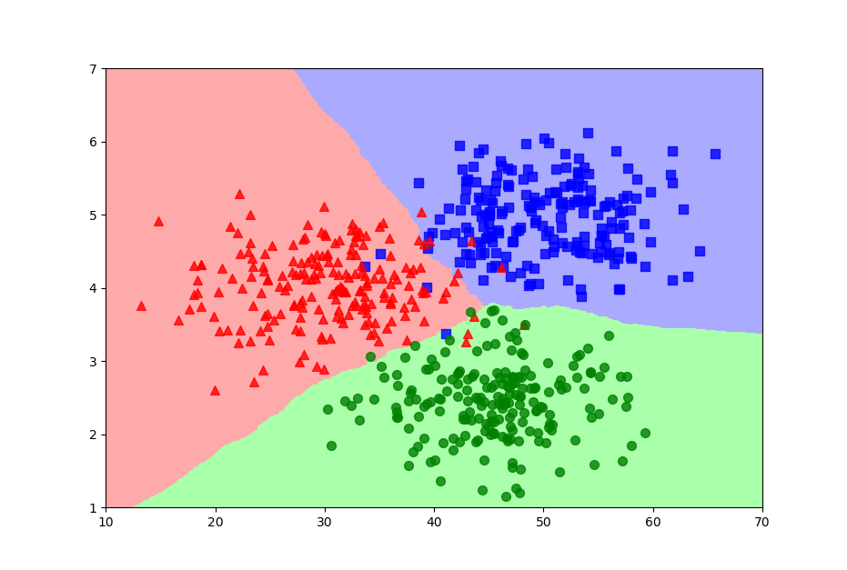

下面再进行概率预测，使用

~~~python
Z_proba = clf.predict_proba(coords)
~~~

得到每个坐标点的分类概率值。假设我们想画出红色的概率，那么提取所有坐标的2类概率，转换成矩阵形状

~~~python
Z_proba_reds = Z_proba[:,1].reshape(xx.shape)
~~~

再选一个预设好的红色调cmap画出来

~~~python
fig3 = plt.figure('fig3')
plt.pcolormesh(xx, yy,Z_proba_reds, cmap='Reds')
plt.scatter(x1,y1,c='b',marker='s',s=50,alpha=0.8)
plt.scatter(x2,y2,c='r', marker='^', s=50, alpha=0.8)
plt.scatter(x3,y3, c='g', s=50, alpha=0.8)
plt.axis((10, 70, 1, 7))
fig3.show()
~~~

得到结果如下图：

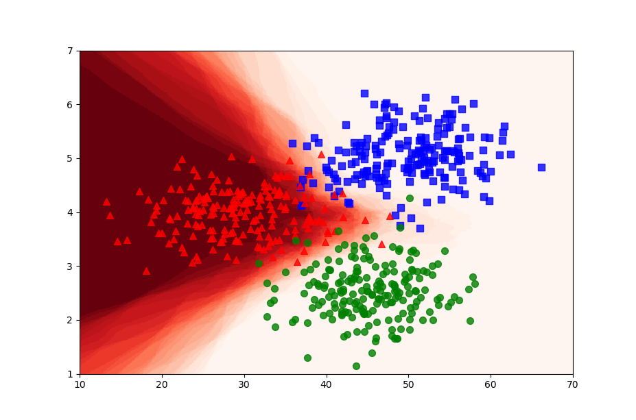

**结语**

scikit-learn包的功能非常齐全，使用kNN分类进行预测也简单易懂。使用的难点在于将数据整理成函数可以处理的格式的过程偏于繁琐，从输出中读取结论可能也有些麻烦。本文细致地讲解了包中函数的输入、输出以及处理方法，希望读者可以轻松地将这些功能运用在实际应用中。

**本例的完整代码**

~~~python
from sklearn import neighbors
import numpy as np
import matplotlib.pyplot as plt
from matplotlib.colors import ListedColormap

x1 = np.random.normal(50, 6, 200)
y1 = np.random.normal(5, 0.5, 200)

x2 = np.random.normal(30,6,200)
y2 = np.random.normal(4,0.5,200)

x3 = np.random.normal(45,6,200)
y3 = np.random.normal(2.5, 0.5, 200)

fig1 = plt.figure('fig1')
plt.scatter(x1,y1,c='b',marker='s',s=50,alpha=0.8)
plt.scatter(x2,y2,c='r', marker='^', s=50, alpha=0.8)
plt.scatter(x3,y3, c='g', s=50, alpha=0.8)
fig1.show()

x_val = np.concatenate((x1,x2,x3))
y_val = np.concatenate((y1,y2,y3))

x_diff = max(x_val)-min(x_val)
y_diff = max(y_val)-min(y_val)

x_normalized = [x/(x_diff) for x in x_val]
y_normalized = [y/(y_diff) for y in y_val]
xy_normalized = zip(x_normalized,y_normalized)

# 将对象中对应的元素打包成一个个元组
labels = [1]*200+[2]*200+[3]*200

clf = neighbors.KNeighborsClassifier(30)

clf.fit(xy_normalized, labels)

# -------------------------------------------

# k近邻
nearests = clf.kneighbors([(50/x_diff, 5/y_diff),(30/x_diff, 3/y_diff)], 5, False)
print(nearests)

# 预测
prediction = clf.predict([(50/x_diff, 5/y_diff),(30/x_diff, 3/y_diff)])
print(prediction)

# 概率预测
prediction_proba = clf.predict_proba([(50/x_diff, 5/y_diff),(30/x_diff, 3/y_diff)])
print(prediction_proba)

# 准确率打分
x1_test = np.random.normal(50, 6, 100)
y1_test = np.random.normal(5, 0.5, 100)

x2_test = np.random.normal(30,6,100)
y2_test = np.random.normal(4,0.5,100)

x3_test = np.random.normal(45,6,100)
y3_test = np.random.normal(2.5, 0.5, 100)

xy_test_normalized = zip(np.concatenate((x1_test,x2_test,x3_test))/x_diff,\
                         np.concatenate((y1_test,y2_test,y3_test))/y_diff)
labels_test = [1]*100+[2]*100+[3]*100

score = clf.score(xy_test_normalized, labels_test)
print(score)

# 1nn
clf1 = neighbors.KNeighborsClassifier(1)
clf1.fit(xy_normalized, labels)
score = clf1.score(xy_test_normalized, labels_test)
print(score)

# ------------------------------------------------

# 分类图
xx,yy = np.meshgrid(np.arange(1,70.1,0.1), np.arange(1,7.01,0.01))

xx_normalized = xx/x_diff
yy_normalized = yy/y_diff

coords = np.c_[xx_normalized.ravel(), yy_normalized.ravel()]

Z = clf.predict(coords)
Z = Z.reshape(xx.shape)

fig2 = plt.figure('fig2')
light_rgb = ListedColormap([ '#AAAAFF', '#FFAAAA','#AAFFAA'])
plt.pcolormesh(xx, yy,Z, cmap=light_rgb)
plt.scatter(x1,y1,c='b',marker='s',s=50,alpha=0.8)
plt.scatter(x2,y2,c='r', marker='^', s=50, alpha=0.8)
plt.scatter(x3,y3, c='g', s=50, alpha=0.8)
plt.axis((10, 70, 1, 7))
fig2.show()

# 概率预测
Z_proba = clf.predict_proba(coords)
Z_proba_reds = Z_proba[:,1].reshape(xx.shape)

fig3 = plt.figure('fig3')
plt.pcolormesh(xx, yy,Z_proba_reds, cmap='Reds')
plt.scatter(x1,y1,c='b',marker='s',s=50,alpha=0.8)
plt.scatter(x2,y2,c='r', marker='^', s=50, alpha=0.8)
plt.scatter(x3,y3, c='g', s=50, alpha=0.8)
plt.axis((10, 70, 1, 7))
fig3.show()
~~~

# 参考文献

* 《统计学习方法》李航，第三章：k近邻法

“k近邻算法”和“k近邻模型”参考了李航书中的第三章：k近邻法。

* [【量化课堂】一只兔子帮你理解 kNN](https://www.joinquant.com/post/2227?f=study&m=math)

导语和简介部分来自于此文章，这篇文章适合小白入门kNN，但是这里就不放上来了，因为太简单了。

* [【数学】kd 树算法之思路篇](https://zhuanlan.zhihu.com/p/22557068)

"直观理解kd树搜索算法"一节部分参考此文章。

* [【数学】kd 树算法之详细篇](https://zhuanlan.zhihu.com/p/23966698)

"直观理解kd树搜索算法"一节部分参考此文章。

* [K-D TREE算法原理及实现](https://leileiluoluo.com/posts/kdtree-algorithm-and-implementation.html)

"kd树","构造kd树","scikit-learn搜索kd树"部分参考此文章。

* [【量化课堂】scikit-learn 之 kNN 分类](https://www.joinquant.com/post/3227?f=study&m=math)

"用scikit-learn进行kNN分类"和“例子1”参考此文章。

* [KNN算法介绍](https://zhuanlan.zhihu.com/p/53084915)

“KNN的优缺点”参考此知乎博客。