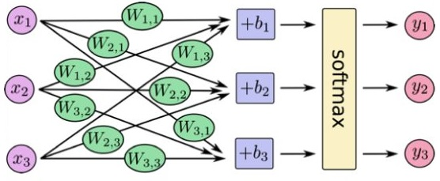

# 指数族分布与广义线性模型

* [返回上层目录](../linear-model.md)
* [指数族分布](#指数族分布)
  * [指数族分布的一般形式](#指数族分布的一般形式)
  * [指数族分布的推导](#指数族分布的推导)
    * [为什么需要指数族分布](#为什么需要指数族分布)
    * [指数族分布的推导](#指数族分布的推导)
    * [使用指数族分布](#使用指数族分布)
    * [指数族分布与贝叶斯学派](#指数族分布与贝叶斯学派)
      * [构造共轭先验分布](#构造共轭先验分布)
    * [指数族分布在机器学习中的作用](#指数族分布在机器学习中的作用)
  * [概率密度函数为指数族的分布](#概率密度函数为指数族的分布)
    * [伯努利分布表示为指数分布族形式](#伯努利分布表示为指数分布族形式)
    * [高斯分布表示为指数分布族形式](#高斯分布表示为指数分布族形式)
* [广义线性模型](#广义线性模型)
  * [广义线性模型的概念](#广义线性模型的概念)
  * [广义线性模型的两个成分](#广义线性模型的两个成分)
    * [条件平均数](#条件平均数)
    * [方差](#方差)
  * [广义线性模型中连接函数的作用](#广义线性模型中连接函数的作用)
  * [广义线性模型满足的三条性质](#广义线性模型满足的三条性质)
* [根据GLM由高斯分布推导线性回归](#根据GLM由高斯分布推导线性回归)
  * [基于最大熵推导Logistic回归](#基于最大熵推导Logistic回归)
  * [基于连结函数推导Logistic回归](#基于连结函数推导Logistic回归)
  * [基于高斯朴素贝叶斯推导Logistic回归](#基于高斯朴素贝叶斯推导Logistic回归)
* [根据GLM由多项分布推导SoftMax回归](#根据GLM由多项分布推导SoftMax回归)
  * [基于最大熵推导SoftMax回归](#基于最大熵推导SoftMax回归)
  * [基于GLM推导SoftMax回归](#基于GLM推导SoftMax回归)
* [线性回归和Logistic回归和GLM的深入思考](#线性回归和Logistic回归和GLM的深入思考)

# 指数族分布

## 指数族分布的一般形式

$$
P(x|\eta)=\frac{1}{Z(\eta)}h(x)\text{exp}\left\{\eta^TT(x)\right\}
$$
其中，
$$
Z(\eta)=\int h(x)\text{exp}\left\{\eta^TT(x)\right\}dx
$$
是正则化项。
$$
P(x|\eta)=h(x)\text{exp}\left\{\eta^TT(x)-\text{ln}Z(\eta)\right\}
$$
令
$$
\text{ln}Z(\eta)=A(\eta)
$$
则有
$$
P(x|\eta)=h(x)\text{exp}\left\{\eta^TT(x)-A(\eta)\right\}
$$
其中，

* T(x)：x->R^K，充分统计(sufficient statistic)函数，通常T(x)=x；
* η：自然参数或标准参数(natural parameter/canonical parameter)；
* h：x->R^+，参考测量独立参数
* z：正则因子或者统计和(0<Z(η)<∞)
* A(η)是log partition function，exp[−A(η)]是一个规范化常数，使得分布p(y;η)的和为1。 

## 指数族分布的推导

在本章的《最大熵模型》一节中我们发现，均匀分布的特征函数是零阶矩，指数分布的特征函数是一阶矩，正态分布的特征函数是一阶矩和二阶矩。

那么，当给定更高的矩时，也许会出现一族相似的概率分布。那现在我们就来严格推导一下吧。

------

先给一个简略但说明本质的推导：

给定观测数据X=x1,...,Xn，计算经验矩（可以理解为均值方差这些统计量）：
$$
\mu_{\alpha}=\frac{1}{n}\sum_{i=1}^n\phi_{\alpha}(X_i)
$$
比如
$$
\begin{aligned}
&\phi_1(x)=x\\
&\phi_2(x)=x^2\\
\end{aligned}
$$
如果我们选择一个分布p去对x建模，要保证数据在这个p下的矩和经验矩相同。

但这样满足条件有无限个p，怎么选呢？一个好主意是选取uncertainty最大的，或者说熵最大的p。

所以我们有了一个优化问题：
$$
p^*=\text{arg}\ \mathop{\text{max}}_{p\in P}H(p)\ \ \text{subject to}\ E_p[\phi_{\alpha}(X)]=\mu_{\alpha}
$$
一系列的泛函求导后发现这个p有这样的形成：
$$
p_{\theta}(x)\propto \text{exp}(\sum_{\alpha\in I}\theta_{\alpha}\phi_{\alpha}(x))
$$
就是指数族分布的形式了。

---

更详细的推导：

### 为什么需要指数族分布

机器学习经常要做这样一件事：给定一组训练数据D，我们希望通过D得到我们研究的空间的概率分布。这样，给出一个测试数据，我们就可以找出条件概率中概率最大的那个点，将其作为答案输出。

但是在没有任何假设的情况下，直接学习概率分布是不现实的。直接学习概率分布最简单的方法，就是把空间分成很多很多小的单元，然后统计样本落在每个单元的频率，作为每个单元的概率分布。但是这种方法会面临着数据不足、有噪音、存储能力受限等问题。单元分隔得越细，学习到得概率分布就越准确，但是我们就需要越多的数据来训练，也需要越多的存储空间来存储（一维的时候存储n个单元，二维就要n^2，三维就要n^3...），这样的方法对于高维数据来说是绝对不可行的。

所以在大多数情况下，我们都会人为指定某种概率分布的形式（例如指定为高斯分布或伯努利分布等）。这样，对概率函数的学习就转化为了函数参数的学习，减小了学习的难度；我们也只需要存储我们感兴趣的统计量（例如对于高斯分布，我们只需要存储均值和方差；对于伯努利分布，我们只需要存储取正类的概率），减小了对存储空间的需求。当然，由于人为限定了概率分布形式，我们就需要根据不同的问题选择不同的分布，就像对不同问题选择不同的机器学习模型一样。

指数族分布就是一类常用的分布模型，它有很多优良的性质。接下来我们介绍指数族分布的推导和性质。

### 指数族分布的推导

我们用离散模型介绍指数族分布的推导，连续模型的推导也类似。

设X^(i)表示第i条训练数据，Φ(X^(i))表示从第i条训练数据中我们感兴趣的统计量（是一个向量，这样我们就可以表示两个或者更多我们感兴趣的统计量）。我们希望我们的概率模型p能满足以下性质
$$
\mathbb{E}_p[\phi(X)] = \hat{\mu}
$$
其中
$$
\hat{\mu} = \frac{1}{n}\sum_{i=1}^m\phi(X^{(i)})
$$
。简单来说，就是概率模型的期望等于所有训练数据的均值，这个希望应该是非常合理的。

但满足这个条件的概率模型有很多种，我们再加一条限制：**这个概率模型要有最大的信息熵，也就是有最大的不确定性。我们认为这样的概率模型能够涵盖更多的可能性**。

根据信息熵的定义，我们写出以下式子
$$
\begin{aligned}
&p^*(x) = \text{arg}\ \mathop{\text{max}}_{p(x)}\ -\sum_x p(x)\log p(x)\\
&\text{s.t.}\ \ \sum\limits_x p(x)\phi(x) = \hat{\mu}\ \ \  \text{注:}\phi(x)\text{和}\hat{\mu}\text{是向量}\\
&\quad \quad \sum\limits_x p(x) = 1\\
\end{aligned}
$$
转为最优化问题：
$$
\begin{aligned}
&\text{min}\ -H(p)=\sum_x p(x)\log p(x)\\
&\text{s.t.}\ \ \sum\limits_x p(x)\phi(x) = \hat{\mu}\ \ \  \text{注:}\phi(x)\text{和}\hat{\mu}\text{是向量}\\
&\quad \quad \sum\limits_x p(x) = 1\\
\end{aligned}
$$
这是一个有等式限制的优化问题，用拉格朗日乘子法改写为
$$
\begin{aligned}
L &= \sum_x p(x)\log p(x) + \theta^T(\hat{\mu}-\sum_x p(x)\phi(x)) + \lambda(1-\sum_x p(x))\\
&= \sum_x \left(p(x)\log p(x) - \theta^Tp(x)\phi(x) - \lambda p(x)\right) + \theta^T\hat{\mu} + \lambda
\end{aligned}
$$
对x取每一个特定值时的p(x)分别求导，并令其等于零，我们有
$$
\frac{\partial L}{\partial p(x)}=1 + \log p(x) - \theta^T\phi(x) - \lambda = 0
$$
移项后有
$$
p(x) = \exp(\theta^T\phi(x) + \lambda - 1) = \exp(\theta^T\phi(x) - A)
$$
式子两边关于x求和有
$$
\sum_x p(x) = 1 = \sum_x \exp(\theta^T\phi(x) - A)
$$
移项后就有
$$
A(\theta) = \log\sum_x \exp(\theta^T\phi(x))
$$
要注意的是，A是一个关于θ的函数，和x的取值无关。其实这里的A就是最大熵模型里的规范化因子Zw(x)。

### 使用指数族分布

根据上面的推导，我们就得到了指数族分布的模型：
$$
p(x) = \exp(\theta^T\phi(x) - A(\theta))
$$
这个模型虽然看起来和之前的博客中介绍的指数族模型：
$$
p(x) = b(x)\exp(\theta^T\phi(x) - A(\theta))
$$
不太一样，但我们可以让 $\theta'\ ^T = \begin{bmatrix} \theta^T & 1 \end{bmatrix}$ 以及$\phi'(x) = \begin{bmatrix} \phi(x) & \log b(x) \end{bmatrix}^T$ 将它变化为这本节中介绍的形式，只不过有的时候把 b(x) 单独提出来更方便。

我们看到的大部分分布都能满足指数族分布的形式。

比如令
$$
\theta^T = \begin{bmatrix} \log\phi & \log(1-\phi) \end{bmatrix},\phi(x) = \begin{bmatrix} x & 1-x \end{bmatrix}^T,A(\theta) = 0
$$
就有伯努利分布 $p(x) = \phi^x(1-\phi)^{1-x}$；

比如令
$$
b(x) = 1 / \sqrt{(2\pi)^k|\Sigma|},\theta^T = \begin{bmatrix} -\frac{1}{2}\mu^T\Sigma^{-1} & \Sigma^{-1} \end{bmatrix},\phi(x) = \begin{bmatrix} x & xx^T \end{bmatrix}^T,A(\theta) = 0\ ???\text{貌似不对啊...}
$$
就有多维高斯分布（这时候把b(x)单独提出来就比较方便）。

我们还有θ的值没有确定。理论上，我们应该根据拉格朗日乘子法求出θ的值，但这样求是比较困难的。我们可以通过极大似然估计法计算θ的值。而且我们可以证明，用极大似然估计法算出的θ，可以满足下式的要求：
$$
\mathbb{E}_p[\phi(X)] = \hat{\mu}
$$
对训练数据集D使用极大似然估计法，其实就是解如下优化问题
$$
\begin{aligned}
\text{arg}\ \mathop{\text{max}}_{\theta} \ L &= \text{arg}\ \mathop{\text{max}}_{\theta} \ \text{log}\prod_{i=1}^mp(D|\theta) \\ 
&= \text{arg}\ \mathop{\text{max}}_{\theta} \ \sum_{i=1}^m \left[\theta^T\phi(X^{(i)}) - A(\theta)\right]
\end{aligned}
$$
 关于θ求偏导有
$$
\frac{\partial L}{\partial \theta} = \sum_{i=1}^m \phi(X^{(i)}) - m\frac{\partial A(\theta)}{\partial \theta} = 0
$$
求得
$$
\frac{\partial A(\theta)}{\partial \theta} = \hat{\mu}
$$
根据之前的推导我们有
$$
A(\theta) = \log\sum_x\exp(\theta^T\phi(x))
$$
所以
$$
\frac{\partial A(\theta)}{\partial \theta} = \frac{\sum\limits_x \exp(\theta^T\phi(x))\phi(x)}{\sum\limits_x \exp(\theta^T \phi(x))} = \frac{\sum\limits_x \exp(\theta^T\phi(x))\phi(x)}{\exp A(\theta)} \ = \sum_x \exp(\theta^T\phi(x) - A(\theta))\phi(x) = \mathbb{E}_p[\phi(x)]
$$
所以下式的条件是满足的。
$$
\mathbb{E}_p[\phi(X)] = \hat{\mu}
$$
所以验证了我们可以通过极大似然估计法计算θ的值。

### 指数族分布与贝叶斯学派

我们知道，机器学习可以分为频率学派和贝叶斯学派。频率学派认为概率分布的θ是一个已知的确定值（只是我们还不知道），尝试通过各种方法直接建立概率分布模型并优化θ的值；而贝叶斯学派认为，θ的值并不是固定的，而是和“人”的认知是有关的。

贝叶斯学派认为θ也是随机变量，一个人一开始对θ分布的认知就是先验概率分布，在他观察过训练数据之后，他对θ的认知会发生改变，这时的概率分布就是后验概率分布。

贝叶斯学派最重要的公式之一就是贝叶斯公式
$$
p(\theta|D) = \frac{p(D|\theta)p(\theta)}{p(D)}
$$
其中p(θ)就是观察训练数据之前对θ原始的认知，就是先验概率；而p(θ|D)则是观察训练数据之后对θ的认知，就是后验概率。而p(D|θ和p(D)就是训练数据带给“人”的信息。式子两边取对数，公式可以变化为
$$
\log p(\theta|D) = \log p(D|\theta) + \log p(\theta) + \text{const}
$$
常数的大小无关紧要，因为最后我们只需要选择让p(θ|D)最大的θ即可，而对于所有θ来说，这个常数是一样大的，不影响比较。这个公式告诉我们，**后验知识 = 先验知识 + 数据认识**，也可以说，数据帮助“人”修正认知。

#### 构造共轭先验分布

如果假设测试数据服从和θ有关的指数族分布，那么我们有
$$
\log p(D|\theta) = \theta^T\sum_{i=1}^m\phi(X^{(i)}) - mA(\theta) = \begin{bmatrix} \sum_{i=1}^m\phi(X^{(i)}) \\ -m \end{bmatrix}^T \begin{bmatrix} \theta \\ A(\theta) \end{bmatrix}
$$
可是先验概率分布是怎么样的呢？现在贝叶斯学派的研究，大多都会构造一个先验概率分布。这个构造的分布在复杂情况下主要用于消除log p(D|θ)中一些比较麻烦的项。的确，应该要按问题的性质构造先验概率分布比较合理，但是这样概率分布的式子可能会变得很复杂，无法在有限时间内计算。这种不按问题性质而构造先验概率分布的方法也是当前贝叶斯学派比较受诟病的一点。

既然数据认识是一个指数族分布，我们也构造一个指数族分布的先验概率分布，便于计算。我们构造
$$
\log p(\theta) = \eta^T \begin{bmatrix} \theta \\ A(\theta) \end{bmatrix} + \text{const}
$$
，将log p(θ)与log p(D|θ)代入式子后，我们有
$$
\log p(\theta|D) = {\eta'}^T \begin{bmatrix} \theta \\ A(\theta) \end{bmatrix} + \text{const}
$$
，其中
$$
\eta' = \eta + \begin{bmatrix} \sum_{i=1}^m \phi(X^{(i)}) \\ -m \end{bmatrix}
$$
**也就是说，我们关注的统计量是θ和A(θ)，而每看到一组训练样本，我们只要更新η就能将先验分布改为后验分布。这是我们先验分布选择了一个方便计算的形式的结果。**

来举一个例子：现在有一枚硬币，投掷了若干次，其中g次正面朝上，h次反面朝上。希望拟合出一个参数为θ的伯努利分布，作为投硬币的概率模型。

根据之前的推导，我们有
$$
\log p(D|\theta) = \sum_{i=1}^m(X^{(i)}\log\theta + (1-X^{(i)})\log(1-\theta))
$$
。现在我们想获得的是θ的概率分布，所以我们关注的统计量应该是
$$
\begin{bmatrix} \log\theta & \log(1-\theta) \end{bmatrix}^T
$$
，那么构造先验分布
$$
\log p(\theta) = \begin{bmatrix} a & b \end{bmatrix}\begin{bmatrix} \log\theta \\ \log(1-\theta) \end{bmatrix} + \text{const}
$$
（因为A(θ) = 0，所以我们这里就省略了这一维）。这样，先验分布就是
$$
p(\theta) = C\theta^a(1-\theta)^b
$$
，后验分布就是
$$
p(\theta|D) = C\theta^{a+g}(1-\theta)^{b+h}
$$
，是两个beta分布。

非常恰好的是，这两个分布具有很高的可解释性。我们画出几个beta分布的图像。

beta(0, 0)可以看作训练最开始的先验概率，没有见过任何训练数据，所以认为所有的θ都是等概率的；beta(3, 7) 可以看作抛硬币10次后的后验概率，可以看到beta分布的峰值出现在0.3处，但是方差较大，没有那么肯定；beta(30, 70)可以看作抛硬币100次后的后验概率，可以看到beta分布的峰值出现在0.3处，而且方法很小，说明此时我们非常肯定θ=0.3是最佳的参数。

上图中，绿色线为beta(0,0)，红色线为beta(3,7)，蓝色线为beta(30,70)。显然，虽然beta(3,7)和beta(30,70)的均值一样都是0.3，但是beta(30,70)的方差要小得多，因为实验数据更多啊。

当然，这种可解释性是非常**凑巧**的。**在比较复杂的问题中，这种构造出来的先验分布基本是没有解释性的**。而且如果训练数据量太小，最后的后验概率受先验概率的影响会很大，可能会出现变形的结果。**一个又符合问题特征，又便于计算的先验分布是非常难获得的，所以现在的贝叶斯学派只能暂时以可计算性为重**。

### 指数族分布在机器学习中的作用

* 实践层面

  **化成指数族分布后，很容易给出它的共轭分布——这几乎是贝叶斯学派的思维套路基础**。

* 应用层面

  可以**从Bernoulli分布的指数族分布得到Sigmoid函数，从而利于后面Logistic回归（广义线性回归）的引入**。而Bernoulli分布和Gauss分布都属于指数族分布的事实，说明这两个分布必然有一定的相关性，其实上，Bernoulli分布对应Logistic回归，Gauss分布对应线性回归。

## 概率密度函数为指数族的分布

$$
P(x|\eta)=h(x)\text{exp}\left\{\eta^TT(x)-A(\eta)\right\}
$$

概率密度函数是指数族的分布有：

- 伯努利分布(Bernouli)：对0、1问题进行建模
- 多项式分布(Multinomial)：对有K个离散结果的事件建模
- 泊松分布(Poisson)：对计数过程进行建模，比如网站访问量的计数问题，放射性衰变的数目，商店顾客数量等问题
- 伽马分布（gamma）与指数分布（exponential）：对有间隔的正数进行建模，比如公交车的到站时间问题。
- 贝塔分布（beta）：对小数建模
- 狄利克雷分布（Dirichlet）：对概率分布进行建模
- Wishart分布：协方差矩阵的分布
- 高斯分布(Gaussian)

### 伯努利分布表示为指数族分布形式

伯努利分布是对0,1问题进行建模的分布，它可以用如下形式表示：
$$
\begin{aligned}
&P(x|\theta)=\theta^x(1-\theta)^{1-x}\\
=&\text{exp}\left\{\text{ln}\left(\frac{\theta}{1-\theta}\right)x+\text{ln}(1-\theta)\right\}
\end{aligned}
$$
其中，
$$
\begin{aligned}
&\eta=\text{ln}\left(\frac{\theta}{1-\theta}\right)\Rightarrow \theta=\frac{e^{\eta}}{1+e^{\eta}}=\frac{1}{1+e^{-\eta}}\\
&T(x)=x\\
&A(\eta)=-\text{ln}(1-\theta)=\text{ln}(1+e^{\eta})\\
&h(x)=1\\
\end{aligned}
$$

### 高斯分布表示为指数族分布形式

$$
P(x|\mu,\sigma^2)=\frac{1}{\sqrt{2\pi}\sigma}\text{exp}\left\{-\frac{(x-\mu)^2}{2\sigma^2}\right\}
$$

其中，
$$
\begin{aligned}
&\eta=[\eta_1\ \ \eta_2]^T=\left[\frac{\mu}{\sigma^2}\ \ -\frac{1}{2\sigma^2}\right]^T\Rightarrow \mu=-\frac{\eta_1}{2\eta_2},\ \sigma^2=-\frac{1}{2\eta_2}\\
&T(x)=[x,\ x^2]^T\\
&A(\eta)=-\text{ln}\left(\sqrt{2\pi}\ \text{exp}\left\{\frac{\mu^2}{2\sigma^2}\right\}\right)=-\frac{1}{2}\text{ln}(2\pi)-\frac{1}{2}\text{ln}(-2\eta_2)-\frac{\eta_1^2}{4\eta_2}\\
&h(x)=1\\
\end{aligned}
$$

其实，上面的形式是不严格的，因为σ对模型参数的选择没有影响。正确的指数族分布的形式为：
$$
\begin{aligned}
P(x|\mu)&=\frac{1}{\sqrt{2\pi}\sigma}\text{exp}\left\{-\frac{(x-\mu)^2}{2\sigma^2}\right\}\\
&=\frac{1}{\sqrt{2\pi}\sigma}\text{exp}\left\{-\frac{x^2-2x\mu+\mu^2}{2\sigma^2}\right\}\\
&=\frac{1}{\sqrt{2\pi}\sigma}\text{exp}\left\{-\frac{x^2}{2\sigma^2}\right\}\text{exp}\left\{\frac{\mu}{\sigma^2}\cdot y-\frac{\mu^2}{2\sigma^2}\right\}\\
\end{aligned}
$$
其中，
$$
\begin{aligned}
&\eta=\frac{\mu}{\sigma^2}\\
&T(x)=x\\
&A(\eta)=\frac{\mu^2}{2\sigma^2}\\
&h(x)=\frac{1}{\sqrt{2\pi}\sigma}\text{exp}\left\{-\frac{x^2}{2\sigma^2}\right\}\\
\end{aligned}
$$

# 广义线性模型

## 广义线性模型的概念

广义线性模型，顾名思义就是经典线性回归模型的一般化。在经典线性回归模型中，总是假定因变量的数学期望为一组自变量的线性组合，而且要求因变量为连续的且服从正态分布，有固定的方差，也就是对于误差项的要求。其中，自变量则可以是连续的、离散的或者是两者的组合。其具有的形式为**E(y|x)=x的线性组合**。

回归分析的目的就是在寻找一组具有高度解释力的自变量，使得我们能够通过这些变量的线性组合来解释因变量大部分的变异。经典线性回归模型至今都有着十分广泛的应用，不仅因为其形式上的简便使得使用起来十分方便，而且其在高斯—马尔科夫条件下的优良性质使得其无论是对于方程还是对于变量的检验都变得有据可依。

但是，它也存在着很大的局限性，例如很多情况下，因变量可能是只取两个数值(0、1变量)或者是计数的因变量。而这类因变量显然不能满足对于因变量服从正态分布的假设，这就会给经典回归模型带来很大的问题，例如因变量的条件期望与自变量的线性组合之间存在着取值的荒谬性等问题。此时需要对于经典的线性模型进行改进，即推广出应用范围更加广泛的广义线性回归模型。

广义线性模型是通过对于自变量的线性组合或者是因变量的条件期望采取一定的函数变换g，使得其能够克服之前存在的某些缺陷。改变后的形式为**g(E(y|x))=x的线性组合**。我们就成这种形式的模型为广义线性模型，其中g为已知的函数，称为**连接函数**。

以上就是广义线性模型由经典线性回归模型发展的概述，在此基础上通过对函数g的不同变换得到了一系列的广义线性模型，对这类模型的研究由于**摆脱了正态的假设**，因此研究方法也发生了较大的改变，这就是广义线性模型所研究的重点。即**在非正态假设下进行模型的建立、估计和假设检验**。

## 广义线性模型的两个成分

### 条件平均数

广义线性模型可以处理 因变量的条件平均数为回归参数的非线性函数 和 因变量为非正态分布 的数据。**广义线性模型假设因变量分布是指数家族中的一员**。

当分布以指数形式表示时，每个指数家族中的分布都有以其自己的标准参数θ为其平均数的函数（连接函数），也就是说，**广义线性模型需要以指数族分布为基础，不然连接函数得不到广义线性的形式**。

广义线性模型假设因变量分布是指数族家族中的一员。当分布以指数形式表示时，每个指数家族中的分布都有其自己的标准参数θ为其平均数的函数。

GLM 是通过**连接函数**，把**自变量线性组合和因变量的概率分布连起来**，该概率分布可以是高斯分布、二项分布、多项式分布、泊松分布、伽马分布、指数分布、贝塔分布和 Dirichlet 分布等指数族分布，所以被称作广义线性模型。

### 方差

广义线性模型的因变量的方差为其平均值的一个函数，并不是一成不变的（除了正态分布），这是指数族成员的一个分布特性，也是广义线性模型背后的响应分布。泊松分布的方差为Var(y)=μ，而二元分布的方差为Var(y)=μ(1-μ)。对正态分布而言，方差是固定的，即Var(y)=σ^2

## 广义线性模型中连接函数的作用

https://www.zhihu.com/question/28469421

正巧问到我的专业领域了，之前在做的课题就是estimation methods for generalized linear mixed models，就是glm的变种，对这方面应该说有比较系统的了解。

一句话解释起来就是：

link function的作用是把Y与X间的非线性关系转换成线性关系。

举例：Y和X本来成指数关系则给Y取对数得到log Y和X成线性关系，才可以建立对应的线形模型，是为glm，其中的log就是link function。

这个并不复杂，我尤其想指出的其实是题主这里好像有一个小误解：

Y的所谓“正态分布”其实是来源于误差项，link function为identity时一般我们默认假设误差服从正态分布，而对glm来说很多情况下假设误差服从正态分布其实是是不合理的，link function对误差项分布的影响其实非常复杂，但很遗憾的是即便你显性地解出了这种关系并带入正确的误差分布，最后算出来的结果在绝大多数应用场景下和直接用正态分布算出来的区别不大，所以计算简便在准确度允许的范围内，或者说只要不是写统计论文，或者绝大多数自带的R-packages都是假设误差仍然符合正态分布。

但是不要本末倒置，link function绝对没有把Y转变成正态分布，一定程度上甚至可以理解为link function是把原本服从正态分布的误差项给变成了其他非常复杂的分布，用笔写写会发现远不是像取了log就变log normal这么简单。我们是用正态假设基本上都是出于计算量小的目的。

## 广义线性模型满足的三条性质

* 给定特征属性x和参数θ后，y的条件概率P(y|x;θ)服从指数族分布；

* 预测T(y)的期望，即计算E[T(y)|x]。我们的目标是通过给定x，来预测T(y)期望(E[T(y)|x]，即让学习算法输出h(x) = E[T(y)|x]

* η与x之间是线性的
  $
  \eta=\theta^Tx
  $

前两条性质能理解，现在证明第三条性质。

我们现在知道，指数族分布的形式为
$$
P(x|\eta)=h(x)\text{exp}\left\{\eta^TT(x)-\text{ln}Z(\eta)\right\}
$$
其中，
$$
\text{ln}Z(\eta)=A(\eta)
$$
当T(x)=x时，则指数族分布称为标准(canonical)分布，η称为标准参数(canonical parameter)或者自然参数(natural parameter)。

不是所有的指数族分布都满足T(x)=x，满足T(x)=x的分布有：高斯分布，伯努利分布，多项分布，泊松分布等等。

我们知道（这里为了避免干扰整体结构，具体推导放在下面的分割线后）
$$
\begin{aligned}
&E(x)=\frac{\partial}{\partial \eta}A(\eta)=u\\
&Var(x)=\frac{\partial^2}{\partial \eta^2}A(\eta)=\sigma^2\\
\end{aligned}
$$
我们也知道，对于广义线性模型，其连接函数(link function)为
$$
g(u_i)=\beta \cdot x_i=\beta_0+\beta_1x_{i1}+...+\beta_nx_{iN}
$$
所以，综上，对于指数族分布的广义线性模型，
$$
g(u_i)=g(\frac{\partial}{\partial \eta_i}A(\eta))=g(A'(\eta_i))=\beta \cdot x_i=\beta_0+\beta_1x_{i1}+...+\beta_nx_{iN}
$$
而**标准连接函数**(canonical link function)定义为
$$
g=(A'(x))^{-1}
$$
则可得
$$
g(u_i)=\eta_i=\beta \cdot x_i=\beta_0+\beta_1x_{i1}+...+\beta_nx_{iN}
$$
这就是广义线性模型的第三个性质，即
$$
\eta=\theta^Tx
$$
我们已知伯努利分布的η项为： 
$$
\eta=\text{ln}\left(\frac{\theta}{1-\theta}\right)=\beta \cdot x=g(u)
$$
所以数据为伯努利分布的logistic回归的表达式为
$$
\pi=\theta=\frac{1}{1+e^{-\eta}}=\frac{1}{1+e^{-\beta \cdot x}}
$$
我们已知高斯分布的η项为：
$$
\eta=\mu=\beta \cdot x=g(u)
$$
所以数据为高斯分布的线性回归的表达式为
$$
\mu=\beta \cdot x
$$
这里可以看出，高斯分布的标准连接函数其实没有任何对均值的变换。

---

具体推导：

这里我们来详细推导上面的公式，如下式所示：
$$
\begin{aligned}
&E(x)=\frac{\partial}{\partial \eta}A(\eta)=u\\
&\text{Var}(x)=\frac{\partial^2}{\partial \eta^2}A(\eta)=\sigma^2\\
\end{aligned}
$$

已知
$$
\begin{aligned}
A(\eta)&=\text{ln}Z(\eta)\\
Z(\eta)&=\int h(x)\text{exp}\{\eta^TT(x)\}dx
\end{aligned}
$$
则有
$$
\begin{aligned}
\triangledown_{\eta}A(\eta)&=\frac{\triangledown_{\eta}Z(\eta)}{Z(\eta)}\\
&=\frac{\int h(x)T(x)\text{exp}\{\eta^TT(x)\}dx}{Z(\eta)}\\
&=\int T(x)\frac{h(x)\text{exp}\{\eta^TT(x)\}dx}{Z(\eta)}\\
&=E_{P(x|\eta)}[T(x)]
\end{aligned}
$$
即**A(η)的一阶导为充分统计量的平均数。**
$$
\begin{aligned}
\triangledown^2_{\eta}A(\eta)&=E_{\eta}[T(x)T(x)^T]-E_{\eta}[T(x)]E_{\eta}[T(x)]^T\\
&=\text{Cov}_{\eta}[T(x)]
\end{aligned}
$$
即**A(η)的二阶导为充分统计量的方差。**

**A(η)的n阶导为充分统计量的n阶中心矩。**

# 根据GLM由高斯分布推导线性回归

我们上面已经知道，高斯分布的形式为：
$$
\begin{aligned}
P(x|\mu)&=\frac{1}{\sqrt{2\pi}\sigma}\text{exp}\left\{-\frac{(x-\mu)^2}{2\sigma^2}\right\}\\
&=\frac{1}{\sqrt{2\pi}\sigma}\text{exp}\left\{-\frac{x^2-2x\mu+\mu^2}{2\sigma^2}\right\}\\
&=\frac{1}{\sqrt{2\pi}\sigma}\text{exp}\left\{-\frac{x^2}{2\sigma^2}\right\}\text{exp}\left\{\frac{\mu}{\sigma^2}\cdot x-\frac{\mu^2}{2\sigma^2}\right\}\\
\end{aligned}
$$
其中，
$$
\begin{aligned}
&\eta=\frac{\mu}{\sigma^2}\\
&T(x)=x\\
&A(\eta)=\frac{\mu^2}{2\sigma^2}\\
&h(x)=\frac{1}{\sqrt{2\pi}\sigma}\text{exp}\left\{-\frac{x^2}{2\sigma^2}\right\}\\
\end{aligned}
$$
已知广义线性模型的第三条：
$$
\eta=\frac{\mu}{\sigma^2}=\theta^Tx
$$
根据极大似然估计，
$$
L(\theta)=\prod_{i=1}^n\frac{1}{\sqrt{2\pi}\sigma}\text{exp}\left[-\frac{(y_i-\mu)^2}{2\sigma^2}\right]
$$
因为σ对模型参数的选择没有影响，这里假设σ^2=1，则
$$
L(\theta)=\prod_{i=1}^n\frac{1}{\sqrt{2\pi}}\left\{\text{exp}\left[y_i-\theta^Tx)^2\right]\right\}^{-\frac{1}{2}}
$$
对上式取log，则对数似然的极大值，就等于下式的极小值：
$$
J(\theta)=\frac{1}{2}\sum_{i=1}^{m}\left(y(i)-\theta^Tx(i)\right)^2
$$
上式其实就是最小二乘法的损失函数啊。所以我们能够看到，线性回归其实暗含了**数据是方差不变的高斯分布的这个假设**。

上式对θ求偏导数并令其为零，
$$
(x^Tx)\theta-x^Ty=0
$$
则可得数据误差为高斯分布的满足最大似然的θ为
$$
\theta=(x^Tx)^{-1}x^Ty
$$
而这也正是最小二乘法的形式，所以最小二乘法和数据误差为高斯分布的最大似然法是等价的。但是高斯提出最小二乘法，推倒的过程并不是利用广义线性模型，这里我们看到了一种融合的趋势。

# 根据GLM由伯努利分布推导Logistic回归

## 基于最大熵推导Logistic回归

已经有一篇论文[《the equivalence of logistic regression and maximum entropymodels》](http://www.win-vector.com/dfiles/LogisticRegressionMaxEnt.pdf)从最大熵原理推导出了logistic回归，这里仅仅复制一下，再加上我自己的一些理解，如下所示。

最新的理解：指数族分布的最大熵等价于其指数形式的最大似然。二项式的最大熵解等价于二项式指数形式(sigmoid)的最大似然，多项式分布的最大熵等价于多项式分布指数形式(softmax)的最大似然，因此为什么用sigmoid函数，那是因为指数族分布最大熵的特性的必然性。假设分布求解最大熵，引入拉格朗日函数，求偏导数等于0，直接求出就是sigmoid函数形式。还有很多指数族分布都有对应的最大似然。而且，单个指数族分布往往表达能力有限，就引入了多个指数族分布的混合模型，比如高斯混合，引出了EM算法。像LDA就是多项式分布的混合模型。一下子豁然开朗了好多。

### 符号约定

1. x(1)...x(m)表示输入数据，每一个x(i)都是R^n空间的n维向量，x(i)\_j表示我们正在处理的是第i个数据的第j维。

2. y(1)...y(m)表示已知训练数据的输出。y(i)的取值为{1,...,k}这k个分类。

   标准的二分类逻辑回归的k值为2。类别之间没有顺序关系。我们使用变量u和v来表示当前正在处理的输出类别。

3. π()为模型或者学习到的概率函数，将n维的x(i)映射为输出类别的向量。即有π(x)\_u表示将输入x归类为类别u的概率。

4. A(u,v)表示指示函数，即有如果u=v，则A(u,v)=1，否则为0。例如A(u,y(i))用来表示已知的输出y(i)是否被分配到了类别u。

我们的目标是从训练数据中学到分类函数f(x(i))≈y(i)，而且会进一步得到一个估计概率的函数π()，从R^n到R^k，即
$$
\pi(x(i))_v
$$
**是y(i)=v的概率的模型估计**。

所以，π()应当有如下的性质：

1. 下式恒成立
   $
   \pi(x)_v\geqslant 0
   $

2. 下式恒成立
   $
   \sum_{v=1}^k\pi(x)_v=1
   $

3. 模型的分类估计要足够好，即能解释已发生的训练数据。即
   $
   \pi(x(i))_{y(i)}
   $
   要趋向于最大。

### 认识逻辑回归的本质约束

本小节的目的是，假设我们已知逻辑回归的形式，通过最大似然来看看到底逻辑回归应当满足什么样的约束，即找到最本质的约束，然后我们就把这个必须要满足的约束，作为最大熵模型的约束条件，来重新推导出逻辑回归。所以，本小节是帮助我们来理解逻辑回归所要满足的约束条件的。

这里假设我们幸运，有人已经告诉我们逻辑回归的公式是：

在标准的逻辑回归中，常取k=2，则π()的形式为
$$
\begin{aligned}
&\pi(x)_1=\frac{e^{\lambda\cdot x}}{e^{\lambda\cdot x}+1}=\frac{1}{1+e^{-\lambda\cdot x}}\\
&\pi(x)_2=1-\pi(x)_1\\
\end{aligned}
$$
其中，λ和x均为R^n空间的n维向量。模型完全由λ确定，因此可通过寻找λ来给出最佳估计。

实际上，更建议一种更对称且更通用的表达方式
$$
\pi(x)_v=\frac{e^{\lambda_v\cdot x}}{\sum_{u=1}^ke^{\lambda_u\cdot x}}
$$
这里，λ是一个[kxn]的矩阵，一个类别对应一行向量。

由上式，可推导出两个有用的性质：
$$
\begin{aligned}
&\frac{\partial}{\partial \lambda_{v,j}}\pi(x)_v=x_j\pi(x)_v(1-\pi(x)_v)\\
&\frac{\partial}{\partial \lambda_{u,j}}\pi(x)_v=-x_j\pi(x)_v\pi(x)_u\quad(u\neq v)\\
\end{aligned}
$$
现在回想一下，我们在上节（符号约定）中要求
$$
\pi(x)_{y(i)}
$$
要足够用大，这样才能充分解释已知数据，表达成公式就是让下面的连乘表达式最大：
$$
\prod_{i=1}^{m}\pi(x(i))_{y(i)}
$$
这就是最大似然估计，**模型不应认为已知数据是不可能发生的，因为它已经发生了**。

对数似然为
$$
f(\lambda)=\sum_{i=1}^m\text{log}\left[\pi(x(i))_{y(i)}\right]
$$
希望求使得f()能取最大值的λ。将f()对所有的λ\_(u,j)求偏导，然后让偏导等于0求极值。
$$
\begin{aligned}
\frac{\partial}{\partial \lambda_{u,j}}f(\lambda)&=\frac{\partial}{\partial \lambda_{u,j}}\sum_{i=1}^m\text{log}\left[\pi(x(i))_{y(i)}\right]\\
&=\sum_{i=1}^m\frac{1}{\pi(x(i))_{y(i)}}\frac{\partial}{\partial \lambda_{u,j}}\pi(x(i))_{y(i)}\\
&=\sum_{i=1,y(i)=u}^m\frac{1}{\pi(x(i))_{u}}\frac{\partial}{\partial \lambda_{u,j}}\pi(x(i))_{y(i)}\\
&\ \ \ \ \ \ +\sum_{i=1,y(i)\neq u}^m\frac{1}{\pi(x(i))_{y(i)}}\frac{\partial}{\partial \lambda_{u,j}}\pi(x(i))_{y(i)}\\
&=\sum_{i=1,y(i)=u}^m\frac{1}{\pi(x(i))_{u}}x(i)_j\pi(x(i))_u(1-\pi(x(i))_u)\\
&\ \ \ \ \ \ -\sum_{i=1,y(i)\neq u}^m\frac{1}{\pi(x(i))_{y(i)}}x(i)_j\pi(x(i))_{y(i)}\pi(x(i))_u\\
&=\sum_{i=1,y(i)=u}^mx(i)_j(1-\pi(x(i))_u)\\
&\ \ \ \ \ \ -\sum_{i=1,y(i)\neq u}^mx(i)_j\pi(x(i))_u\\
&=\sum_{i=1,y(i)=u}^mx(i)_j-\sum_{i=1}^mx(i)_j\pi(x(i))_u\\
\end{aligned}
$$
令偏导等于零，得
$$
\sum_{i=1}^m\pi(x(i))_ux(i)_j=\sum_{i=1,y(i)=u}^mx(i)_j\quad (\text{ for all u, j })
$$
这个怎么理解呢？就是
$$
\pi(x(i))_u
$$
可以看作是x(i)\_j的体内有多少属于类别u。这下就很好理解了吧。

这个结论非常重要，表明**所有训练数据中指定的u类别，其属性的第j个特征的和，等于所有训练数据的第j个特征乘以其判别为类别u的概率**。

使用指示函数A(u,y(i))重写上式
$$
\sum_{i=1}^m\pi(x(i))_ux(i)_j=\sum_{i=1}^mA(u,y(i))x(i)_j\quad (\text{ for all u, j })
$$
这说明**最佳的参数λ确定的概率函数模型π(x(i))，其行为和指示函数A(u,y(i))十分相似**。上式称为“平衡方程”。

上式中，参数λ并没有显式地出现，它们隐含在中π()，而没有像x(i)那样显式地出现在平衡方程中。这意味着某种程度上的“特征自由”，即结果只取决于要测量或者建模的变量，而并非取决于怎样用λ表示π()。

上面的一些推导就是为了让我们认识到**Logistic回归的最本质的约束原来就是平衡方程**，那好了，现在我们就用最大熵原理来推出数据为二项分布或者多项分布时的最大熵模型。

### 最大熵模型

用最大熵推导时不需要费力猜测sigmod函数的形式是什么，只需要满足平衡方程的约束，就能推导出π()的公式。

我们这里假设π()需要满足下面的约束：
$$
\begin{aligned}
\pi(x)_v\ &\geq\ 0\ \text{always}\\
\sum_{v=1}^k\pi(x)_v\ &=\ 1\ \text{always}\\
\sum_{i=1}^m\pi(x(i))_ux(i)_j\ &=\ \sum_{i=1}^mA(u,y(i))x(i)_j\ \text{(for all u, j)}\\
\end{aligned}
$$
如何理解上面的三个约束条件呢？前两个约束条件是说，π()要符合概率的性质。第三个约束条件我们可以认为是在说，在训练数据集上，π(x(i))\_u应当接近示性函数A(u, y(i))。

到目前我们还没有限制π()的复杂度，我们一般要确保π()不能是那种复杂到可怕的函数，否则这种复杂到无用的函数形式不仅几乎不能应用，并且还会对训练数据过拟合。

这里我们希望π()是连续的、平滑的、描述长度最小，低复杂度的表示，即要符合**奥卡姆剃刀**原则。在信息论中，我们的这种愿望就是要使π()的熵最大（减小过拟合），即最大熵。π()的熵可表示为：
$$
H(\pi(x))=-\sum_{v=1}^k\sum_{i=1}^m\pi(x(i))_v\text{log}(\pi(x(i))_v)
$$
所以我们的问题就成了带约束下的最优化问题：
$$
\begin{aligned}
&\text{min}\ &-H(\pi(x))&=\sum_{v=1}^k\sum_{i=1}^m\pi(x(i))_v\text{log}(\pi(x(i))_v)\\
&\text{s.t.}\ &\pi(x(i))_v\ &\geqslant\ 0\quad \text{(for all v, i)}\\
&\ &\sum_{v=1}^k\pi(x(i))_v\ &=\ 1\quad \text{(for all i)}\\
&\ &\sum_{i=1}^m\pi(x(i))_vx(i)_j\ &=\ \sum_{i=1}^mA(v,y(i))x(i)_j\quad \text{(for all v, j)}\\
\end{aligned}
$$
这里我们求解π()的时候，并没有假设任何形式，所以我们是在搜索所有的函数空间，而不是仅仅限于某一类函数的子空间。所以，我们并没有在猜测函数的形式，而是在一步步推导函数的形式。

引入拉格朗日函数：
$$
\begin{aligned}
L=&\sum_{v=1}^k\sum_{i=1}^m\pi(x(i))_v\text{log}(\pi(x(i))_v)\\
&+\sum_{j=1}^n\sum_{v=1}^k\lambda_{v,j}\left(\sum_{i=1}^mA(v,y(i))x(i)_j-\sum_{i=1}^m\pi(x(i))_ux(i)_j\right)\\
&+\sum_{i=1}^m\beta_i(1-\sum_{v=1}^k\pi(x(i))_v)
\end{aligned}
$$
对L求偏导并令其为零：
$$
\frac{\partial}{\partial\pi(x(i))_u}L=\text{log}(\pi(x(i))_u)+1-\lambda_u\cdot x(i)-\beta_i=0
$$
可得
$$
\pi(x(i))_u=e^{\lambda_u\cdot x(i)+\beta_i-1}
$$
现在就有意思了。我们看到，上式是大于零的，因为指数函数恒大于零，所以第一条约束满足。现在来求解参数βj，根据约束2，各类别的概率之和为1，可得
$$
\sum_{v=1}^k\pi(x(i))_v=\sum_{v=1}^ke^{\lambda_v\cdot x(i)+\beta_i-1}=1
$$
所以，
$$
e^{\beta_i}=1/\sum_{v=1}^ke^{\lambda_v\cdot x(i)-1}
$$
所以，
$$
\pi(x(i))_u=\frac{e^{\lambda_u\cdot x(i)}}{\sum_{v=1}^ke^{\lambda_v\cdot x(i)}}
$$
这就是sigmod函数的多分类形式，2分类只是其中一个而已。

我们看看怎么从多分类变为二分类
$$
\begin{aligned}
\pi(x(i))_1&=\frac{e^{\lambda_1\cdot x(i)}}{e^{\lambda_0\cdot x(i)}+e^{\lambda_1\cdot x(i)}}\\
&=\frac{1}{1+e^{-(\lambda_1-\lambda_0)\cdot x(i)}}\\
&=\frac{1}{1+e^{-w\cdot x(i)}}\\
\end{aligned}
$$
这里的系数w其实是1分类比0分类的系数多出来的值。

## 基于连结函数推导Logistic回归

我们现在知道，指数族分布的形式为
$$
P(x|\eta)=h(x)\text{exp}\left\{\eta^TT(x)-\text{ln}Z(\eta)\right\}
$$
其中，
$$
\text{ln}Z(\eta)=A(\eta)
$$
当T(x)=x时，则指数族分布称为标准(canonical)分布，η称为标准参数（canonical parameter）或者自然参数（natural parameter）。

不是所有的指数族分布都满足T(x)=x，满足T(x)=x的分布有：高斯分布，伯努利分布，多项分布，泊松分布等等。

我们知道
$$
\begin{aligned}
&E(x)=\frac{\partial}{\partial \eta}A(\eta)=u\\
&Var(x)=\frac{\partial^2}{\partial \eta^2}A(\eta)=\sigma^2\\
\end{aligned}
$$
具体的，对于伯努利分布，
$$
A(\eta)=-\text{ln}(1-\theta)=\text{ln}(1+e^{\eta})
$$

$$
u=E(x)=\pi=\frac{\partial}{\partial \eta}A(\eta)=\frac{\partial}{\partial \eta}\text{ln}(1+e^{\eta})=\frac{e^{\eta}}{1+e^{\eta}}=\frac{1}{1+e^{-\eta}}
$$

我们也知道，对于广义线性模型，其连接函数(link function)为
$$
g(u_i)=\beta \cdot x_i=\beta_0+\beta_1x_{i1}+...+\beta_nx_{in}
$$
所以，综上，对于指数族分布的广义线性模型，
$$
g(u_i)=g(\frac{\partial}{\partial \eta_i}A(\eta))=g(A'(\eta_i))=\beta \cdot x_i=\beta_0+\beta_1x_{i1}+...+\beta_nx_{in}
$$
而**标准连接函数**(canonical link)定义为
$$
g=(A'(\eta))^{-1}
$$
则可得
$$
g(u_i)=\eta_i=\beta \cdot x_i=\beta_0+\beta_1x_{i1}+...+\beta_nx_{in}
$$
所以数据为伯努利分布的logistic回归的表达式为
$$
\pi=\frac{1}{1+e^{-\eta}}=\frac{1}{1+e^{-\beta \cdot x}}
$$

## 基于高斯朴素贝叶斯推导Logistic回归

假设数据服从高斯分布，就可以通过和朴素贝叶斯一样的推导方式将Logistic回归推导出来，虽然Logistic并没有要求数据服从高斯分布，所以这里的推导只是Logistic的一种更加强化的假设下的情况。其实，当样本服从泊松分布时，也有相同的结果。

现在我们基于高斯朴素贝叶斯的假设来推导P(Y|X)的形式，而这正是Logistic回归的形式。特别的，高斯朴素贝叶斯基于如下的模型假设：

* Y是布尔值，服从伯努利分布，参数为π=P(Y=1)

* X=(X1, X2, ...)，这里每一个Xi是一个连续的随机变量

* 对于每一个Xi，P(Xi|Y=yk)都服从如下形式的高斯分布：
  $
  N(\mu_{ik},\sigma_i)
  $

* 对于所有的i和j≠i，给定Y时，Xi和Xj是条件独立的。

注意这里我们假设不同的属性Xi有不同的标准差σi，但是并不依赖于Y，即不论Y是0还是1，同一属性的标准差σi都不变。

我们现在推导基于高斯朴素贝叶斯假设的P(Y|X)参数形式，一般地，贝叶斯公式可写为
$$
P(Y=1|X)=\frac{P(Y=1)P(X|Y=1)}{P(Y=1)P(X|Y=1)+P(Y=0)P(X|Y=0)}
$$
给上式的分子分母同除以分子，可得：
$$
\begin{aligned}
P(Y=1|X)&=\frac{1}{1+\frac{P(Y=0)P(X|Y=0)}{P(Y=1)P(X|Y=1)}}\\
&=\frac{1}{1+\text{exp}\left(\text{ln}\frac{P(Y=0)P(X|Y=0)}{P(Y=1)P(X|Y=1)}\right)}
\end{aligned}
$$
由于我们的条件独立假设（也即朴素贝叶斯假设），上式可写为：
$$
\begin{aligned}
P(Y=1|X)&=\frac{1}{1+\text{exp}\left(\text{ln}\frac{P(Y=0)}{P(Y=1)}+\sum_i\text{ln}\frac{P(X_i|Y=0)}{P(X_i|Y=1)}\right)}\\
&=\frac{1}{1+\text{exp}\left(\text{ln}\frac{1-\pi}{\pi}+\sum_i\text{ln}\frac{P(X_i|Y=0)}{P(X_i|Y=1)}\right)}
\end{aligned}
$$
现在我们只考虑上式分母中的求和项。已知假设$P(X_i|Y=y_k)$是高斯分布，我们可将上式中的求和项展开如下：
$$
\begin{aligned}
\sum_i\text{ln}\frac{P(X_i|Y=0)}{P(X_i|Y=1)}
&=\sum_i\text{ln}\frac{\frac{1}{\sqrt{2\pi\sigma^2_i}}\text{exp}\left(\frac{-(X_i-\mu_{i0})^2}{2\sigma_i^2}\right)}{\frac{1}{\sqrt{2\pi\sigma^2_i}}\text{exp}\left(\frac{-(X_i-\mu_{i1})^2}{2\sigma_i^2}\right)}\\
&=\sum_i\text{ln exp}\left(\frac{(X_i-\mu_{i1})^2-(X_i-\mu_{i0})^2}{2\sigma^2_i}\right)\\
&=\sum_i\left(\frac{(X_i-\mu_{i1})^2-(X_i-\mu_{i0})^2}{2\sigma^2_i}\right)\\
&=\sum_i\left(\frac{(X_i^2-2X_i\mu_{i1}+\mu_{i1}^2)-(X_i^2-2X_i\mu_{i0}+\mu_{i0}^2)}{2\sigma^2_i}\right)\\
&=\sum_i\left(\frac{2(\mu_{i0}-\mu_{i1})}{\sigma^2_i}X_i+\frac{\mu_{i1}^2-\mu_{i0}^2}{2\sigma_i^2}\right)\\
\end{aligned}
$$
注意到上式是Xi的线性加权的和，将上式带入上上式，我们有
$$
\begin{aligned}
P(Y=1|X)&=\frac{1}{1+\text{exp}\left(\text{ln}\frac{1-\pi}{\pi}+\sum_{i}\left(\frac{\mu_{i0}-\mu_{i1}}{\sigma_i^2}X_i+\frac{\mu_{i1}^2-\mu_{i0}^2}{2\sigma^2_i}\right)\right)}\\
&=\frac{1}{1+\text{exp}\left(w_0+\sum_{i=1}^nw_iX_i\right)}\\
\end{aligned}
$$
其中，权重w1,w2,...,wn为
$$
w_i=\frac{\mu_{i0}-\mu_{i0}}{\sigma_i^2}
$$
w0为
$$
w_0=\text{ln}\frac{1-\pi}{\pi}+\sum_i\frac{\mu_{i1}^2-\mu_{i0}^2}{2\sigma_i^2}
$$
同样的，我们有
$$
P(Y=0|X)=\frac{\text{exp}\left(w_0+\sum_{i=1}^nw_iX_i\right)}{1+\text{exp}\left(w_0+\sum_{i=1}^nw_iX_i\right)}
$$

# 根据GLM由多项分布推导SoftMax回归

## 基于最大熵推导SoftMax回归

这一推导已经在“基于最大熵推导logistic回归”小节中实现。

## 基于GLM推导SoftMax回归

数据为多项式分布，SoftMax属于多类别分类问题。如数字的识别，0~9，10种可能性。

 

假设有k个分类，y∈{1,2,...,k}，可以用一个k维的向量来表示分类结果，当y=i时，向量的第i个元素为1，其它均为0。这样表示是存在冗余的，因为如果我们知道了前k-1个元素，那么第k个其实就已经确定了，因此我们可以只用k-1维向量来表示。

每种分类对应的概率是
$$
\phi_1,\ \phi_2,\ ...,\ \phi_k\quad \phi_i=P(y=i,\phi)
$$
，由全概率公式得
$$
\sum_{i=1}^k\phi_i=1
$$
，则
$$
\phi_k=1-\sum_{i=1}^{k-1}\phi_{k-1}
$$
构建广义线性模型：

引入T(y)，它是**k-1**维度的向量，因为第k维可以用前面k-1维表示出，如下：
$$
T(1)=\begin{bmatrix}
1\\ 0\\ 0\\...\\0
\end{bmatrix},
T(2)=\begin{bmatrix}
0\\ 1\\ 0\\...\\0
\end{bmatrix},...,
T(k-1)=\begin{bmatrix}
0\\ 0\\ 0\\...\\1
\end{bmatrix},
T(k)=\begin{bmatrix}
0\\ 0\\ 0\\...\\0
\end{bmatrix}
$$
注意，这里就和前面的T(y)=y不同了，这里的T(y)是一个向量，所以用T(y)i表示T(y)的第i个元素。这里引入指示函数：μ{.}，用μ{y=i}=1表示属于i分类，同样μ{y=i}=0表示不属于i分类。所以T(y)与y的关系可以写成：
$$
T(y)_i=\mu(y=i)
$$
构建概率密度函数为：
$$
\begin{aligned}
P(y;\phi)&=\phi_1^{\mu(y=1)}\cdot\phi_2^{\mu(y=2)}...\phi_k^{\mu(y=k)}\\
&=\phi_1^{\mu(y=1)}\cdot\phi_2^{\mu(y=2)}...\phi_k^{1-\sum_{i=1}^{k-1}\mu(y=i)}\\
&=\phi_1^{T(y)_1}\cdot\phi_2^{T(y)_2}...\phi_k^{1-\sum_{i=1}^{k-1}T(y)_i}\\
&=\text{exp}\left[T(y)_1\cdot \text{ln}\phi_1+T(y)_2\cdot \text{ln}\phi_2+...+\left(1-\sum_{i=1}^{k-1}T(y)_i\right)\cdot \text{ln}\phi_k\right]\\
&=\text{exp}\left[T(y)_1\cdot \text{ln}\frac{\phi_1}{\phi_k}+T(y)_2\cdot \text{ln}\frac{\phi_2}{\phi_k}+...+T(y)_{k-1}\cdot \text{ln}\frac{\phi_{k-1}}{\phi_k}+\text{ln}\phi_k\right]\\
&=b(y)\text{exp}\left(\eta^TT(y)-a(\eta)\right)
\end{aligned}
$$
可得：
$$
\begin{aligned}
&\eta=\left[\text{log}\left(\frac{\phi_1}{\phi_k}\right),\text{log}\left(\frac{\phi_2}{\phi_k}\right),...,\text{log}\left(\frac{\phi_{k-1}}{\phi_k}\right)\right]\\
&a(\eta)=-\text{log}(\phi_k)\\
&b(y)=1\\
\end{aligned}
$$
连接函数为
$$
\eta_i=\text{log}\frac{\phi_i}{\phi_k},\quad i=1,...,k-1
$$
,注意，这里η是(k-1)维，为了简化，我们令
$$
\eta_k=\text{log}\frac{\phi_k}{\phi_k}=0
$$
，现在η是k维了。可得响应函数：
$$
\begin{aligned}
&e^{\eta_i}=\frac{\phi_i}{\phi_k}\\
\Rightarrow&\phi_k e^{\eta_i}=\frac{\phi_i}{\phi_k}\\
\Rightarrow&\phi_k\sum_{i=1}^k e^{\eta_i}=\sum_{i=1}^k\phi_i=1\\
\end{aligned}
$$
所以，有
$$
\phi_k=\frac{1}{\sum_{j=1}^ke^{\eta_j}}=\frac{e^{\eta_k}}{\sum_{j=1}^ke^{\eta_j}}
$$
对于i∈[1,k-1]，则通过把上式带入上上式的第一项中，有
$$
\phi_i=\phi_ke^{\eta_i}=\frac{e^{\eta_k}}{\sum_{j=1}^ke^{\eta_j}}
$$
注意到上式和上上式的形式是相同的，则上式为i的通用表达式，被称为从η到φ的**SoftMax**函数。

根据广义线性模型的性质3，并且令
$$
\theta_k=0,\text{  则  }\eta_k=\theta_k^Tx=0
$$
，得到**SoftMax**回归模型，它是Logistic回归的推广，或者说，Logistic回归是SoftMax回归的特例。则有：
$$
P(y=i|x;\theta)=\phi_i=\frac{e^{\eta_k}}{\sum_{j=1}^ke^{\eta_j}}=\frac{e^{\theta_i^Tx}}{\sum_{j=1}^ke^{\theta_i^Tx}}
$$
所以函数的输出为：
$$
\begin{aligned}
h_{\theta}(x)&=E[T(y)|x;\theta]
=E\begin{bmatrix}
\mu(y=1)\\ 
\mu(y=2)\\ 
...\\
\mu(y=k-1)\\ 
\end{bmatrix}
=\begin{bmatrix}
\phi_1\\ 
\phi_2\\ 
...\\
\phi_{k-1}\\ 
\end{bmatrix}
=\begin{bmatrix}
\frac{e^{\theta_1^Tx}}{\sum_{j=1}^ke^{\theta_j^Tx}}\\ 
\frac{e^{\theta_2^Tx}}{\sum_{j=1}^ke^{\theta_j^Tx}}\\ 
...\\
\frac{e^{\theta_{k-1}^Tx}}{\sum_{j=1}^ke^{\theta_j^Tx}}\\ 
\end{bmatrix}
\end{aligned}
$$

# 线性回归和Logistic回归和GLM的深入思考

regression本质上是一种model fitting的方法，而linear，curve，logistic则是model，使用什么model取决于你的问题，先搞清楚你要解决的问题，再搞清楚这些model都是解决什么问题的，linear，curve分别对应因变量和自变量是线性的和curve的，logistic是用来解决分类问题的。

# 参考资料

* [指数族分布是如何被构造的或怎样被发现？为什么将伯努利分布写成指数族分布后可以导出logistic函数？](https://www.zhihu.com/question/52240493/answer/282469915)
- 《Graphical models, exponential families and variations inference》

"指数族分布"一节部分参考此知乎回答。

* [最大熵与逻辑回归的等价性](https://blog.csdn.net/buring_/article/details/43342341)

"基于最大熵推导logistic回归"参考此资料。

* [Introduction to Pattern Recognition](http://ce.sharif.edu/courses/95-96/2/ce768-1/resources/root/slides/Exponential%20family.pdf)
* [GLM course](http://statmath.wu.ac.at/courses/heather_turner/glmCourse_001.pdf)
* andrew ng 斯坦福cs229机器学习课的lecture notes 1

“广义线性模型”和“基于连结函数推导logistic回归”两节参考了此三门课程的课件ppt。

* [GENERATIVE AND DISCRIMINATIVE CLASSIFIERS: NAIVE BAYES AND LOGISTIC REGRESSION](http://www.cs.cmu.edu/~tom/mlbook/NBayesLogReg.pdf)
* [生成式和判别式分类器：朴素贝叶斯与逻辑回归](https://www.cnblogs.com/rocketfan/archive/2010/09/11/1824035.html)

"基于高斯朴素贝叶斯推导Logistic回归"小节参考了这门课程的课件及其翻译，还有PRML的第四章。

* [[笔记]牛顿方法·指数族·GLMs](https://blog.csdn.net/TRillionZxY1/article/details/77140539)

”基于GLM推导SoftMax回归“一节参考了此博客。

