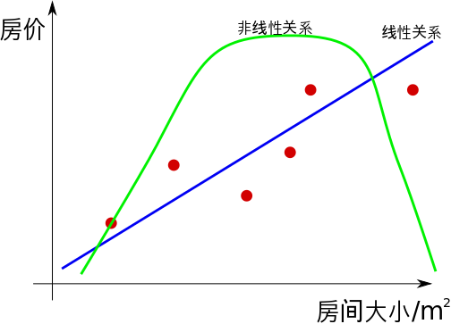
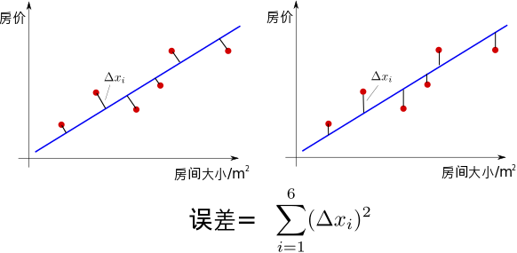
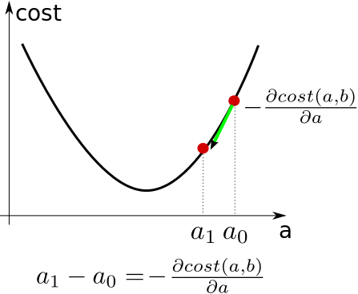
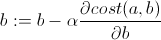
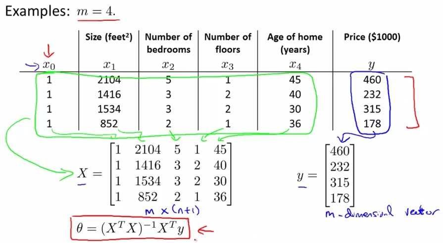
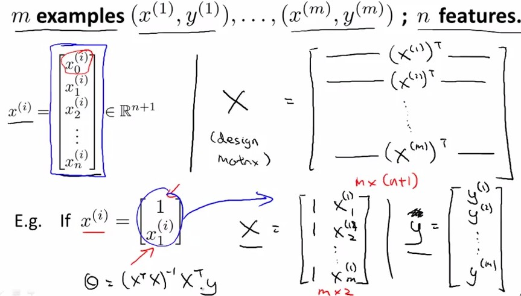
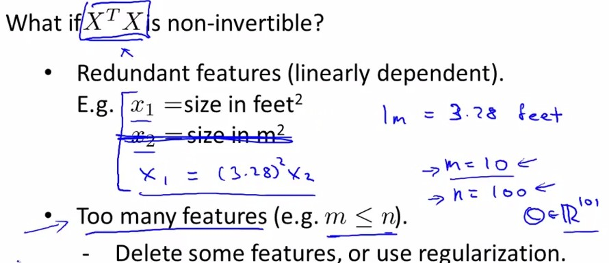

# 线性回归

* [返回上层目录](../linear-model.md)

* [分类与回归的概念和区别](#分类与回归的概念和区别)
  * [回归的由来](#回归的由来)
  * [回归问题的应用场景](#回归问题的应用场景)
  * [分类问题的应用场景](#分类问题的应用场景)
  * [分类和回归的区别](#分类和回归的区别)
  * [如何选择模型](#如何选择模型)
* [线性回归解法思路](#线性回归解法思路)
  * [选择线性模型](#选择线性模型)
  * [模型如何匹配数据(损失函数)](#模型如何匹配数据(损失函数))
  * [求损失函数参数](#求损失函数参数)
    * [梯度下降法求损失函数参数](#梯度下降法求损失函数参数)
    * [最小二乘法求损失函数参数](#最小二乘法求损失函数参数)
    * [梯度下降法和最小二乘法的区别](#梯度下降法和最小二乘法的区别)
  * [总结](#总结)
* [Ridge回归（岭回归）](#Ridge回归（岭回归）)
* [Lasso回归](#Lasso回归)

# 分类与回归的概念和区别

## 回归的含义与由来

回归（regression)，单词分解re(不断的）+gress（走）。世界 能够产生万事万物，其背后有一条不变的规律，而这个规律我们是看不到的，只能通过观察到数据样本去推测这个规律，这个过程就叫做回归，从数据不断的向规则走：regress。

“回归”一词最初是在1886年由英国人类学家高尔顿(Francis Galton)在论文《Regression towards mediocrity in hereditary stature》中使用的，他仅仅使用“回归”来说明：相比于父代身高，子代身高会**回归**趋向平均身高。之后该术语之后被其他人所采用，含义和最初的已有出入，现在作为一个通常的统计方法。

“回归”最初的具体含义请点击下面的链接查看：

[Why are regression problems called “regression” problems?](https://stats.stackexchange.com/questions/11087/why-are-regression-problems-called-regression-problems)

[So Why Is It Called "Regression," Anyway?](http://blog.minitab.com/blog/statistics-and-quality-data-analysis/so-why-is-it-called-regression-anyway)

## 回归问题的应用场景 

回归问题通常是用来预测一个值，如预测房价、未来的天气情况等等，例如一个产品的实际价格为500元，通过回归分析预测值为499元，我们认为这是一个比较好的回归分析。一个比较常见的回归算法是线性回归算法（LR）。另外，回归分析用在神经网络上，其最上层是不需要加上softmax函数的，而是直接对前一层累加即可。回归是对真实值的一种逼近预测。 

## 分类问题的应用场景 

分类问题是用于将事物打上一个标签，通常结果为离散值。例如判断一幅图片上的动物是一只猫还是一只狗，**分类通常是建立在回归之上**，分类的最后一层通常要使用softmax函数进行判断其所属类别。分类并没有逼近的概念，最终正确结果只有一个，错误的就是错误的，不会有相近的概念。最常见的分类方法是逻辑回归，或者叫逻辑分类。 

## 分类和回归的区别

一句话概括：输出是离散还是连续，离散即为分类，连续即为回归。

****

> 若我们欲预测的是离散值，例如"好瓜"、"坏瓜"，此类学习任务称为 "分类"。
>
> 若欲预测的是连续值，例如西瓜的成熟度0.95 ,0.37,此类学习任务称为"回归"。
>
> ——周志华所著的《机器学习》

****

在说分类与回归的区别之前，先说下分类与回归的相同之处：都属于“监督学习（supervised learning）”，从数学的角度来说，监督学习是一个映射，它存在输入空间和输出空间，分别对应机器学习里常说的样本和标记。

说到这来，就可以开始说分类和回归的区别了：如果标记是离散值，则你面对的是一个分类问题，而如果标记是连续值，则你面对的是一个回归问题。

这就是分类问题和回归问题的区别所在，仅仅通过判断输出值是离散的还是连续的就可以确定；

一个简单的例子就是：

-   通过人物照片来判断一个人是不是胖子？（这是一个**分类**问题：是胖子或不是胖子）
-   通过人物照片来判断一个人有多重？（这是一个**回归**问题：杨幂看起来是42.5Kg）

****

因为不能把分类标签当回归问题的输出来解决，所以分类和回归的**损失函数**也不一样，分类的损失函数一般用交叉熵这种，而回归的损失函数一般用类似平方误差这种。

****

总的来说两个问题本质上都是一致的，就是模型的拟合（匹配）。 但是分类问题的y值(也称为label), 更离散化一些. 而且，同一个y值可能对应着一大批的x，这些x是具有一定范围的。 

所以分类问题更多的是 (一定区域的一些x) 对应着 (一个y)。而回归问题的模型更倾向于(很小区域内的x，或者一般是一个x) 对应着 (一个y)。

分类问题与回归问题是监督学习问题，区别在于学习函数的预测输出是类别还是值。但是分类基本上都是用“回归模型”解决的，只是假设的模型不同(损失函数不一样)，因为不能把分类标签当回归问题的输出来解决。分类和回归的区别在于输出变量的类型。定量输出称为回归，或者说是连续变量预测；定性输出称为分类，或者说是离散变量预测。

## 如何选择模型 

 下面一幅图可以告诉实际应用中我们如何选择合适的模型。

# 线性回归解法思路

回归分析常用于分析两个变量X和Y 之间的关系。 比如`X＝房子大小`和`Y＝房价`之间的关系，`X=(公园人流量，公园门票票价)`与`Y=(公园收入)`之间的关系等等。

那么你的数据点在图上可以这么看：

## 选择线性模型

现在你想找到 房子大小和房价的关系， 也就是一个函数$f(x) = y$. 能够很好的表示这两个变量之间的关系。

于是你需要**大概评估**一下这个房子大小和房价大概是一个什么关系.

是**线性**的关系吗，还是**非线性**的关系？

当然在这个问题里面，线性的关系更符合这两者的关系。于是我们选择一个合适的**线性模型**, 最常用的是
$$
f(x) = ax+b
$$
然后用这个线性的模型去**匹配**这些数据点。

## 模型如何匹配数据(损失函数)

有了数据点和你臆想出来的线性模型，怎么进行匹配，也就是怎么用这根线**最好地**描述些数据点的关系？

需要最好地描述点，我们又需要一个关于“好”的定义。你也可以想出很多关于**“好”的定义**。下面有两个：

这两个定义都是将模型与数据点之间的距离差之和做为**衡量匹配好坏的标准**。 误差越小,  匹配程度越大。

但是总的来说，我们想要找到的模型，最后是想要使$f(x)$最大程度地与$y$相似，所以我们想要尽量地减少$f(x)$与$y$之间的差值。所以在这里用第二个图的“好的定义” 来评估这根线的匹配程度是很合理的。于是我们有了**误差公式**!!!!!
$$
cost(a, b)=\sum_{i=1}^{N}(ax_i+b-y_i)^2
$$
这个公式，说的是，可以通过调整不同的a和b的值，就能使误差不断变化，而当你找到这个公式的**最小值**时，你就能得到**最好的a,b**。而这对$(a,b)$就是能最好描述你数据关系的**模型参数**。

##求损失函数参数

### 梯度下降法求损失函数参数

怎么找cost(a,b)的最小？cost(a,b)的图像其实像一个碗 一样，有一个最低点。 找这个最低点的办法就是，先随便找一个点(e.g. a=3, b = 2)， 然后沿着这个碗下降的方向找，最后就能找到碗的最低点。

怎么找(某一点)碗下降的方向？答案是，找那一点导数的反方向。拿参数a举个例子，a与cost关系如下图：

只要将任意一个a，沿着使cost**导数的反方向**慢慢移动，那么最终有一天a值就会到达使cost最小的那一点。于是你可以不断地移动a、b向着最低点前进。

当然在进行移动的时候也需要考虑，每次移动的速度，也就是α的值，这个值也叫做"**学习率**"。学习率的**增大**可以加速参数逼近最优的情况，但是如果在快要到达函数的底端的时候，需要减小学习率，以免出现cost不断增大或者不停摆动的情况(如下图, J(a,b)就是cost(a,b))。 所以说，当出现以上两种情况时候，我们应该果断**选取一个较小的学习率**，以保证cost能减少到一个稳定的值(我们称为收敛converge). 

### 最小二乘法求损失函数参数

这时候，有的人会问，为什么要让$a$不停地往下跑呢？而且还需要设定学习率，多麻烦，直接让找导数为0点(最小极值)，不就可以了吗？嗯。。。也可以。。。但是各有优缺。

与梯度下降法(gradient descent)平行的一种方法为正规方程(Normal Equation，也即最小二乘法)，它采用线性代数中非迭代的方法，见下图：

我们想要找到使cost function最小的θ，就是找到使得导数取0时的参数θ：
该参数可由图中红框公式获得：

具体来说：X是m×(n+1)的矩阵，y是m×1的矩阵。

上图中为什么x要加上一列1呢？因为经常设置$X^{(i)}_0=1$；

我们已知，对于有m个样本，每个拥有n个feature的一个训练集，有X是m×(n+1)的矩阵，$X^TX$是(n+1)×(n+1)的方阵，那么对于参数θ的计算就出现了一个问题，如果$|X^TX|=0$,即$X^TX$不可求逆矩阵怎么办？这时可以进行冗余feature的删除（m<=n的情况，feature过多）：

### 梯度下降法和最小二乘法的区别

下面比较一下Gradient Descent与Normal Equation求损失函数的区别：

## 总结

总结一下，回归问题的解决方法是：

1. 假定一个模型；
2. 定义什么叫做最好的匹配(构造误差函数)；
3. 用这个模型去匹配**已有的数据点**(训练集)。

需要进一步讨论的问题：

- 如果参数(a,b)更多了该怎么办?
- 如果最合适的匹配模型并不是线性的怎么办？——选用一个非线性模型，比如$y = ax^2 + bx + c$。
- 如果误差(cost)与a,b（模型参数）的关系不是像碗一样的，而是凹凸不平的该怎么办? ——这时候你就得注意你得到的cost的最低点(局部的最低)可能因初始点的不同而不同。而这些最低点你需要进行比较，以确定是不是全局的最低。

这篇文章大概的意图是能想让大家了解， 机器学习中最基本的两类问题（线性回归和分类）中的之一：线性回归。 能让大家有个清晰的思想，对于这两类问题都有以下几个步骤,

- 如何选取一个 **合理的模型**(线性的，or 非线性的(e.g. 阶跃函数， 高斯函数))
- 制造一个"美好"的 **误差函数 **(可以评估拟合程度，而且还是convex函数)
- 采取一切可能的**技术**(e.g. 导数下降法，解极值方程法) 求出最好的模型参数

**谈谈回归和分类的区别：**

总的来说两个问题本质上都是一致的，就是模型的拟合（匹配）。 但是分类问题的y值(也称为label), 更离散化一些. 而且，同一个y值可能对应着一大批的x，这些x是具有一定范围的。 

所以分类问题更多的是 (一定区域的一些x) 对应着 (一个y)。而回归问题的模型更倾向于(很小区域内的x，或者一般是一个x) 对应着 (一个y)。

分类问题与回归问题是监督学习问题，区别在于学习函数的预测输出是类别还是值。但是分类基本上都是用“回归模型”解决的，只是假设的模型不同(损失函数不一样)，因为不能把分类标签当回归问题的输出来解决。分类和回归的区别在于输出变量的类型。定量输出称为回归，或者说是连续变量预测；定性输出称为分类，或者说是离散变量预测。                                                                                                                        

在把一个问题建模的时候一定要考虑好需求，让你的模型更好的与现实问题相对应。

# Ridge回归（岭回归）

岭回归本质上是针对线性回归问题引入了L2范数正则，通过缩减回归系数避免过拟合问题，最先用来处理特征数多于样本数的情况(高维小样本问题)，现在也用于在估计中加入偏差，从而得到更好的估计，加了正则化后的代价函数如下：
$$
\hat{\beta}^{Ridge}=\text{arg }\mathop{min}_{\beta}\left\{\sum_{i=1}^n(y_i-\beta_0-\sum_{j=1}^dx_{ij}\beta_j)^2+\lambda\sum_{j=1}^d\beta_j^2\right\}
$$
其中，$\hat\beta$表示估计的回归系数，n表示样本个数，d表示回归系数个数，$y_i$表示第i个样本实际输出值，$\beta_j$表示第j个回归系数，λ为正则化参数。当λ=0，表示不添加正则，则很容易导致原来代价函数为0，预测值与实际值完全贴合即出现了所谓的过你和问题，当λ过大，会导致$\beta_j$系数变小，但不会为0，减小了模型复杂度，原代价函数值较大，出现欠拟合。在实际开发中，通常使用交叉验证集多次循环迭代确定最佳λ值。
$$
\hat{\beta}^{Ridge}=\left(X^Tx+\lambda I\right)^{-1}X^Ty
$$
带正则化的代价函数采用最小二乘法或者正规方程可以得到上述回归结果，可以发现：经过L2范数罚项后，不仅仅压缩了系数，而且可使得原先不可能逆的矩阵一定可逆(XTX+λI一定可逆，这叫伪逆)，这也是L2正则的好处之一。

# Lasso回归

[历史的角度来看，Robert Tibshirani的Lasso到底是不是革命性的创新？](https://www.zhihu.com/question/275196908/answer/378776895)

Lasso回归本质上是针对线性回归问题引入了L1范数正则，通过缩减回归系数避免过拟合问题，其不同于L2范数，其可以将某些系数缩减为0即所谓的具备稀疏性(稀疏性的好处是简化计算、容易理解模型、减少存储空间、不容易出现过拟合等等)，加了正则化后的代价函数如下：
$$
\hat{\beta}^{lasso}=\text{arg }\mathop{min}_{\beta}\left\{\sum_{i=1}^n(y_i-\beta_0-\sum_{j=1}^dx_{ij}\beta_j)^2+\lambda\sum_{j=1}^d|\beta_j|\right\}
$$
其中，参数函数和岭回归中相同。L1范数罚有一个问题：由于|x|函数在0处不可导，故而直接使用最小二乘法、梯度下降法等方法均失效，但是由于其为第一类间断点中的可去间断点，可以通过补充该点的定义解决，通常，对于线性回归中的lasso回归可以采用近似的前向逐步回归替代。

# Linear least squares, Lasso,ridge regression有何本质区别？

https://www.zhihu.com/question/38121173/answer/403986652

https://www.zhihu.com/question/38121173/answer/75158776

https://www.zhihu.com/question/38121173/answer/166238142

# 参考资料

* [分类与回归区别是什么？](https://www.zhihu.com/question/21329754)

"分类与回归的概念和区别"这一节开头少部分参考了此知乎问答。

* [机器学习 --- 1. 线性回归与分类, 解决与区别](http://blog.csdn.net/ppn029012/article/details/8775597)

"分类与回归的概念和区别"这一节主要参考这个资料。

* [Stanford机器学习---第二讲. 多变量线性回归 Linear Regression with multiple variable](http://blog.csdn.net/abcjennifer/article/details/7700772)

"最小二乘法求损失函数参数"这一小节参考了此资料。

* [史上最全面的正则化技术总结与分析--part2](https://zhuanlan.zhihu.com/p/35432128)

"Ridge回归（岭回归）"和“Lasso回归”这两个小节参考了此资料。

