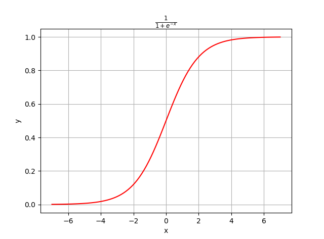
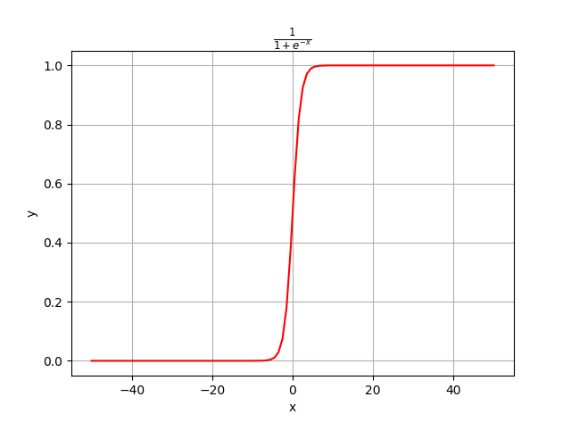
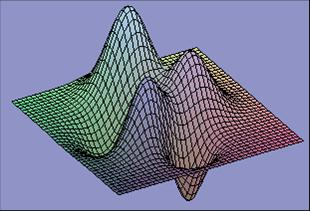
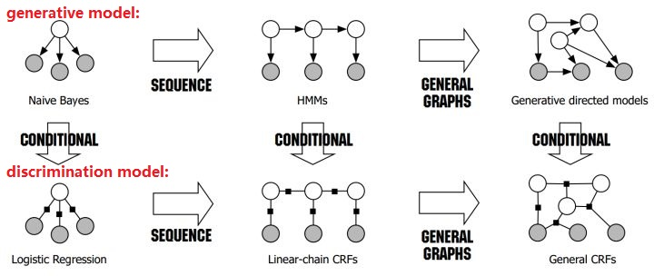

# Logistic回归

* [返回上层目录](../linear-model.md)
* [对Logistic回归的直观认识](#对Logistic回归的直观认识)
* [Logistic回归介绍](#Logistic回归介绍)
* [Logistic回归损失函数](#Logistic回归损失函数)
* [Logistic回归模型参数求解](#Logistic回归模型参数求解)


* [多分类Softmax回归](#多分类Softmax回归)
* [由多类Softmax降为二分类Logistic](#由多类Softmax降为二分类Logistic)
* [线性回归和逻辑回归的关系](#线性回归和逻辑回归的关系)
* [朴素贝叶斯和逻辑回归的区别](#朴素贝叶斯和逻辑回归的区别)
* [项目实践](#项目实践)
  * [鸢尾花分类](#鸢尾花分类)
* [Sigmoid求导性质](#Sigmoid求导性质)


**Logistic回归是分类，不是回归！**

**Logistic回归是分类，不是回归！**

**Logistic回归是分类，不是回归！**

重要的话说三遍！！！


# 对Logistic回归的直观认识

Logistic 回归为什么会是分类算法？

这里要理解回归的含义。这里的回归并不是回归到具体的1或0值，而是伯努利实验的成功概率$p$，这个$p$会随着数据集的训练而回归到真正的值。

对于不同的$x$，因变量$y$的期望$p$也不一样。

也可以认为，回归是到自变量线性组合$\theta T_x$的参数$\theta$，我们假定$\theta$是一个未知常向量，随着训练数据集不断校正$\theta$，最终$\theta$会回归到定值。

逻辑回归并不是回归1,0,其实逻辑回归中的回归其实是在找决策边界$\theta T_x$，和感知机一样。

# Logistic回归介绍

相比回归，分类问题也是一类很常见的问题。 比如说，怎么判定一个人是高富帅还是吊丝？ 假如我是中央电视台的记者，采访了N个人, 拿到了第一手资料。资料如下：


我们想要根据一个人的口袋钱数量，来预测一个人是(富帅) 还是 （吊丝）。我们能不能用回归的方法做呢？显然是可以的， 我们只要找到一个模型，然后再进行匹配就可以了。

但是因为分类问题的y值常常是一些离散的数字，(比如， 富帅为1，吊丝为0)，所以我们已经不能用一个**简单的线性函数**来拟合这些数据了。我们需要一个更逼真的模型。 

于是我们引入了一个更适合处理分类问题的函数--- 一个**非线性函数**， 类似阶跃函数，叫Sigmoid函数，也就是S型函数。

小范围看长这样(像是S型曲线)：



大范围看长这样(更加类似于阶跃函数)：



上图的python代码这里也顺便提供：

```python
import numpy as np
import matplotlib.pyplot as plt

x = np.linspace(-7,7,100)
y = 1/(1+np.exp(-x))
plt.plot(x,y,'r-')
plt.xlabel('x')
plt.ylabel('y')
plt.title(r'$\frac{1}{1+e^{-x}}$')
plt.grid(True)
plt.show()
```

这个函数的形状更像我们分类问题的数据分布，所以，用它来拟合分类问题的数据将**更适合**！

所以我们有了一个新的模型，
$$
\frac{1}{1+e^{-(wx+b)}}
$$

# Logistic回归模型推导

对数几率为
$$
\text{log}\ \frac{p_1}{p_0}=w\cdot x
$$
令对数几率为特征$x$的线性组合函数，则有：
$$
\begin{aligned}
&\text{log}\ \frac{p_1}{p_0}=w\cdot x\\
\Rightarrow&\text{log}\ \frac{p_1}{1-p_1}=w\cdot x\\
\Rightarrow&\frac{p_1}{1-p_1}=\text{exp}(w\cdot x)\\
\Rightarrow&p_1=\text{exp}(w\cdot x)-p_1\text{exp}(w\cdot x)\\
\Rightarrow&p_1(1+\text{exp}(w\cdot x))=\text{exp}(w\cdot x)\\
\Rightarrow&p_1=\frac{\text{exp}(w\cdot x)}{1+\text{exp}(w\cdot x)}\\
\Rightarrow&p_1=\frac{1}{1+\text{exp}(-w\cdot x)}\\
\end{aligned}
$$

# Logistic回归损失函数

通过调整$w$、$b$的值，可以让模型不断改变以匹配数据点。

接下来要做的就是根据给定的训练集，把参数$w$给求出来了。要找参数$w$，首先就得把代价函数（Cost Function）给定义出来，也就是目标函数。

我们第一个想到的自然是模仿线性回归的做法，利用误差平方和来当代价函数：
$$
cost(w,b)=\frac{1}{2}\sum^{N}_{i=1}(\phi(z^{(i)}-y_i)^2=\sum^{N}_{i=1}(\frac{1}{1+e^{-(wx^{(i)}-b)}}-y_i)^2
$$
其中，$z^{(i)}=wx^{(i)}+b_i$表示第$i$个样本点，$y^{(i)}$表示第$i$个样本的真实值。

于是我们急切地想要把它用我们之前的gradient descent的方法求解出使cost最小的两个$w$、$b$值。但是很遗憾的是，这个cost函数关于$w$、$b$是**非凸**(non-convex)的，这就意味着代价函数有着许多的局部最小值，这不利于我们的求解。就像下面那张图那样坑坑洼洼。。。



所以你**没有办法**通过像线性回归求cost极小值时采用的两种方法(梯度下降法和)求出这个cost函数的**全局最小值**。

所以你需要构造一个更好的cost函数， 在可以**衡量拟合程度**的同时 又是**一个关于$w$, $b$的凸函数**(像回归问题的cost一样，和一个碗一样，只有一个极小值)。

这怎么构造啊....

幸好我们还有各种伟大的数学家，他们夜以继日，终于赶制出了一个形状和碗一样(convex)的cost函数。也就是最大似然估计。(Maximum Likelihoods Estimation 更具体的介绍请看http://www.holehouse.org/mlclass/06_Logistic_Regression.html)

接下来我们就要用极大似然估计来根据给定的训练集估计出参数w：
$$
L(w)=\prod_{i=1}^np(y^{(i)}|x^{(i)};w)=\prod_{i=1}^n(\phi(z^{i}))^{y^{(i)}}(1-\phi(z^{(i)})^{1-y^{(i)}}
$$
为了简化运算，我们对上面这个等式的两边都取一个对数：
$$
l(w)=\text{ln}L(w)=\sum_{i=1}^n\left(y^{(i)}\ \text{ln}(\phi(z^{(i)}))+(1-y^{(i)})\text{ln}(1-\phi(z^{(i)}))\right)
$$
我们现在要求的是使得l(w)最大的w。没错，我们的代价函数出现了，我们在l(w)前面加个负号不就变成就最小了吗？不就变成我们代价函数了吗？这不就是**交叉熵**（ cross-entropy）误差函数吗？
$$
J(w)=-l(w)=-\sum_{i=1}^n\left(y^{(i)}\ \text{ln}(\phi(z^{(i)}))+(1-y^{(i)})\text{ln}(1-\phi(z^{(i)}))\right)
$$
为什么上式长得和线性回归用的损失函数不一样呢？因为不能把分类标签当回归问题的输出来解决。

# Logistic回归模型参数求解

现在我们又可以用我们熟悉的导数方向下降法(gradient descent) 移动w, b的值，使cost 降低到最小。
$$
\begin{aligned}
&w:=w-\alpha\frac{\partial cost}{\partial w}=w-\alpha \sum_{i=1}^{N}(\phi(x_i)-y_i)x_i\\
&b:=b-\alpha \sum_{i=1}^{N}(\phi(x_i)-y_i)
\end{aligned}
$$
最后，分类的问题就这样被解决了。

---

下面是具体的推导过程：

[Logistic Regression 的前世今生（理论篇）](https://blog.csdn.net/cyh_24/article/details/50359055)

在开始梯度下降之前，要这里插一句，Sigmoid function有一个很好的性质就是 ：
$$
\phi'(z)=\phi(z)(1-\phi(z))
$$
先记住这个性质，后续会用到。

我们要开始进行梯度下降求解模型参数了。
$$
w:=w+\Delta w, \ \ \Delta w=-\eta\bigtriangledown J(w)
$$
没错，就是这么下降。没反应过来？那我再写详细一些：
$$
w_j:=w_j+\Delta w_j, \ \ \Delta w_j=-\eta\frac{\partial J(w)}{\partial w_j}
$$
其中，wj表示第j个特征的权重；η为学习率，用来控制步长。 重点来了:
$$
\begin{aligned}
\frac{\partial J(w)}{\partial w_j}&=-\sum_{i=1}^n\left(y^{(i)}\frac{1}{\phi(z^{(i)})}-(1-y^{(i)})\frac{1}{1-\phi(z^{(i)})}\right)\frac{\partial \phi(z^{(i)})}{\partial w_j}\\
&=-\sum_{i=1}^n\left(y^{(i)}\frac{1}{\phi(z^{(i)})}-(1-y^{(i)})\frac{1}{1-\phi(z^{(i)})}\right)\phi(z^{(i)})(1-\phi(z^{(i)}))\frac{\phi(z^{(i)})}{\partial w_j}\\
&=-\sum_{i=1}^n\left(y^{(i)}(1-\phi(z^{(i)}))-(1-y^{(i)})\phi(z^{(i)})\right)x_j^{(i)}\\
&=-\sum_{i=1}^n\left(y^{(i)}-\phi(z^{(i)})\right)x_j^{(i)}\\
\end{aligned}
$$
所以，在使用梯度下降法更新权重时，只要根据下式即可：
$$
w_j:=w_j+\eta\sum_{i=1}^n(y^{(i)}-\phi(z^{(i)}))x_j^{(i)}
$$
此式与线性回归时更新权重用的式子极为相似。当然，在样本量极大的时候，每次更新权重会非常耗费时间，这时可以采用随机梯度下降法，这时每次迭代时需要将样本重新打乱，然后用下式不断更新权重：
$$
w_j:=w_j+\eta(y^{(i)}-\phi(z^{(i)}))x_j^{(i)},\quad \text{for i in range(n)}
$$
也就是去掉了求和，而是针对每个样本点都进行更新。

# 多分类Softmax回归

当然，更复杂的问题可能有：

现在是分成两类，如果数据需要分成三类或者更多该怎么办？

假如有A、B、C三类，把其中A类做为1，BC做为0，然后做Logistic regression，得到模型a，同理将B类做为1，AC作为0，得到模型b，再同理得到模型c。最后测试的时候，对任意一个数据点$x$， 我们能够得到$x$分别属于A、B、C三类的概率值 
$$
f_a(y=A|x,\theta_a),f_b(y=B|x,\theta_b),f_c(y=C|x,\theta_c)
$$
最后比较大小，哪个大，这个x就属于哪一类。

具体可看, <http://blog.csdn.net/abcjennifer/article/details/7716281> (七)

更好的方法是**softmax回归**，其实Logstic回归就是softmax回归的二分类情况。这两个分类（Logstic回归和softmax回归）本质是一样的，都是一个全连接的单层**神经网络**。


**softmax回归**：看名字就知道了，就是如果某一个$z_j$大过其他$z$，那这个映射的分量就逼近于1,其他就逼近于0，主要应用就是多分类，sigmoid函数只能分两类，而softmax能分多类，softmax是sigmoid的扩展。

**softmax用于多分类过程中**，它将多个神经元的输出，映射到（0,1）区间内，可以看成概率来理解，从而来进行多分类！假设我们有一个数组$V$，$V_i$表示$V$中的第$i$个元素，那么这个元素的softmax值就是
$$
softmax(z)_i=\frac{exp(z_i)}{\sum_jexp(z_j)}
$$


图来自《一天搞懂深度学习》 。疑问：其实这个归一话方法N多，为什么这里就要采用$\text{exp}(x)$呢？

和logistic sigmod一样，当使用最大化对数似然训练softmax来输出目标值$y$时，使用指数函数工作地非常好。这种情况下，我们想要最大化
$$
\text{log}\ P(y=i;z)=\text{log softmax}(z)_i
$$
。将softmax定义成指数的形式是很自然的，因为对数似然中的log可以抵消softmax中的exp指数：
$$
\text{log softmax}(z)_i=\text{log}\frac{\text{exp}(z_i)}{\sum_j\text{exp}(z_j)}=z_i-\text{log}\sum_j\text{exp}(z_j)
$$
上式右边的第一项表示输入$z_i$总是对代价函数有直接的贡献。因为这一项不会饱和，所以即使$z_i$对上式右边的第二项贡献很小，学习依然可以进行。当最大化对数似然时，上式右边第一项鼓励$z_i$被推高，而第二项则鼓励所有的$z$被压低。为了对上式右边第二项$\text{log}\sum_j\text{exp}(z_j)$有一个直观的理解，注意到这一项可以大致近似为$\mathop{\text{max}}_jz_j$。这种近似是基于对任何明显小于$\mathop{\text{max}}_jz_j$的$z_k$，$exp(z_k)$都是不重要的。我们能从这种近似中得到的**直觉**是，负对数似然代价函数总是强烈的惩罚最活跃的不正确预测。如果正确答案已经具有了softmax的最大输入，那么$-z_i$项和
$$
\text{log}\sum_j\text{exp}(z_j)\approx \mathop{\text{max}}_jz_j=z_i
$$
项将大致抵消。这个样本对于整体训练代价贡献很小，这个代价主要由其他未被分类的样本产生。

从神经科学的角度看，认为softmax是一种在参与其中的单元之间形成竞争的方式：softmax输出总是和为1，所以一个单元的值的增加，必然对应着其他单元值的减少。这与被认为存在与皮质中相邻神经元之间的侧抑制类似。在极端情况下（当最大值和其他值的大小差异很大时），它变成了赢者通吃的形式（其中一个输出接近1，其他的接近0）。

《深度学习》6.2节，p115

# 由多类Softmax降为二分类Logistic

最大熵可以解释指数的由来，更本质。而这里只是在承认指数形式的前提下，讲讲怎么由多类化归为两类，对为什么要用指数的解释并不充分。指数模型（Exponential model）的形式是这样的：

假设第$i$个特征对第$k$类的贡献是$w_{ki}$，则数据点$(x_1,...,x_n)$属于第$k$类的概率正比于：（省略bias）
$$
\text{exp}(w_{k1}x_1+...+w_{kn}x_n)
$$
因为一个数据点属于各类的概率之和为1，所以可以得到
$$
P(y=k)=\frac{\text{exp}(\sum^{n}_{i=1}w_{ki}x_i)}{\sum_{k^{'}}\text{exp}(\sum^n_{i=1}w_{k^{'}i}x_i)}
$$
现在回到两类$(0,1)$的情况，此时分母上只有两项：
$$
P(y=1)=\frac{\text{exp}(\sum^{n}_{i=1}w_{1i}x_i)}{exp(\sum^{n}_{i=1}w_{1i}x_i)+\text{exp}(\sum^{n}_{i=1}w_{0i}x_i)}
$$
分子、分母同除以分子，并设$w_i=w_{1i}-w_{0i}$，则有
$$
P(y=1)=\frac{1}{1+\text{exp}(-\sum^{n}_{i=1}w_{i}x_i)}
$$
瞧，这就是logistic函数。其中**参数$w_i$表示第$i$个特征对1类的贡献比对0类的贡献多多少**。

# 线性回归和逻辑回归的关系

逻辑回归的最大似然值的梯度，和线性回归的最大似然值的梯度，从形式上是一样的。

线性回归的最大似然值的梯度：
$$
\bigtriangledown\text{ln}\ p(t|w)=\sum_{n=1}^N(t_n-w^T\phi(x_n))\phi(x_n)
$$
逻辑回归的最大似然值的梯度：
$$
\bigtriangledown E(w)=\sum_{n=1}^N(y_n-t_n)\phi_n
$$
都是数据点$n$对梯度的贡献为目标值和模型预测值之间的“误差”$y_n - t_n$与基函数向量$\phi_n$相乘。 

只是这到底是个巧合，还是背后隐藏着某种必然性，PRML里面再也没有细说了，有时间了需要好好研究一下这个问题。

---

线性回归的损失函数是平方和误差，是基于最大似然求解出来的；

分类的逻辑回归的损失函数是交叉熵误差，也是基于最大似然求解出来的。

也就是说，不管是平方和误差还是交叉熵误差，其本质都是最大似然值。

# 朴素贝叶斯和逻辑回归的区别

先把这张概率图模型放上来：



**朴素贝叶斯分类：**

在二分类问题的最终目的就是要判断
$$
\frac{P(Y|X_1,X_2,X_3)}{P(\bar{Y}|X_1,X_2,X_3)}>1
$$
就够了，便可以说明"是好瓜"的概率比"不是好瓜"的概率大。所以我们将两个概率相除，得到：
$$
\frac{P(Y|X_1,X_2,X_3)}{P(\bar{Y}|X_1,X_2,X_3)}=
\frac{P(X_1,X_2,X_3|Y)P(Y)}{P(X_!,X_2,X_3|\bar{Y})P(\bar{Y})}
$$
但是实际上除法并不好，容易产生过小的数值，发生underflow，所以我们两边同时取对数log函数，得到：
$$
log\frac{P(Y|X_1,X_2,X_3)}{P(\bar{Y}|X_1,X_2,X_3)}=
log\frac{P(X_1,X_2,X_3|Y)}{P(X_1,X_2,X_3|\bar{Y})}+
log\frac{P(Y)}{P(\bar{Y})}
$$
公式左边是西瓜“是好瓜”的**逻辑发生比**，又称作logit，逻辑发生比大于0就说明是好瓜的概率较大。

接下来，在朴素贝叶斯里有一个很强的假设，就是**条件独立假设**。条件独立假设特征之间都是相互独立的，没有耦合的，互不干扰的。挑西瓜的例子里，“青绿色”，“根蒂坚挺”和“敲击声清脆”几个特征好像的确是独立的，不相互影响，貌似没什么问题。于是有：
$$
P(X_1,X_2,X_3|Y)=P(X_1|Y)\times P(X_2|Y)\times P(X_3|Y)
$$

$$
P(X_1,X_2,X_3|\bar{Y})=P(X_1|\bar{Y})\times P(X_2|\bar{Y})\times P(X_3|\bar{Y})
$$

将它们带入逻辑发生比公式：
$$
log\frac{P(Y|X_1,X_2,X_3)}{P(\bar{Y}|X_1,X_2,X_3)}=
log\frac{P(X_1|Y)}{P(X_1|\bar{Y})}+
log\frac{P(X_2|Y)}{P(X_2|\bar{Y})}+
log\frac{P(X_3|Y)}{P(X_3|\bar{Y})}+
log\frac{P(Y)}{P(\bar{Y})}
$$
此时，我们输入特征，计算概率，根据
$$
log\frac{P(Y|X_1,X_2,X_3)}{P(\bar{Y}|X_1,X_2,X_3)}
$$
**是否大于0则来判断是否是好瓜**，这就完成完成了分类任务。这就是朴素贝叶斯分类，简而言之：

```
贝叶斯公式 + 条件独立假设 = 朴素贝叶斯方法
```

**逻辑回归分类：**

逻辑回归实际上是用线性回归模型的预测结果去逼近后验概率的逻辑发生比，直接写出来就是：
$$
log\frac{P(Y|X_1,X_2,X_3)}{P(\bar{Y}|X_1,X_2,X_3)}=w_1x_1+w_2x_2+w_3x_3+...+b
$$
此处w为特征权重，x为特征值，x可以是连续变量，也可以是离散变量。

**引申—逻辑回归与朴素贝叶斯的区别和联系？**

我们看到朴素贝叶斯里有求和项，逻辑回归中也有求和项。我们如果采用二元离散特征$x\in \{0,1\}$带入到逻辑回归中：
$$
log\frac{P(Y|X_1,X_2,X_3)}{P(\bar{Y}|X_1,X_2,X_3)}=w_1x_1+w_2x_2+w_3x_3+...+b
$$
逻辑回归和朴素贝叶斯的表达式惊人地相似！$log\frac{P(X_i|Y)}{P(X_i|\bar{Y})}+$与$w_i$对应，$log\frac{P(Y)}{P(\bar{Y})}$与$b$对应。但二者还是有区别的，用两种方法求出来的权重是不一样。产生差别的原因在于朴素贝叶斯方法的条件独立假设。因为条件独立假设，朴素贝叶斯可以不使用梯度下降，而直接通过统计每个特征的逻辑发生比来当做权重。

而逻辑回归，条件独立假设并不成立，通过梯度下降法，可以得到特征之间的耦合信息，从而得到相应的权重。当特征量独立，且特征量趋近无穷多时，朴素贝叶斯逼近逻辑回归。两者优化目标不同，逻辑回归优化的后验likelihood：ln p(y|x)，朴素贝叶斯优化的是联合likelihood：ln p(x,y)。

最后引用UIUC韩家炜教授的一句话来做总结：

> **”贝叶斯分类还可以用来为不直接使用贝叶斯定理的其他分类法提供理论判定。例如，在某种假定下，可以证明：与朴素贝叶斯分类法一样，许多神经网络和曲线拟合算法输出最大的后验假定。”**——韩家炜：《数据挖掘：概念与技术（第3版）》, p.228

---

**相同点**

* Logistic regression和Naive bayes都是对特征的线性表达$\sum_j\theta_jx_j$


* Logistic regression和Naive bayes建模的都是条件概率P(y=k|x)，对所最终求得的不同类的结果有很好的解释性。而不像SVM，神经网络这样解释性不高。

**不同点**

* 朴素贝叶斯和LR模型最大区别在于前者是生成模型，后者是判别模型。可以认为两者有相同的假设空间，在这种意义下，任何LR分类器和一个朴素贝叶斯分类器可以在相同的决策界下相互转换。朴素贝叶斯可以转化为有向图模型，LR模型可以转换为无向图模型。

  Naive Bayes是一个生成模型，在计算P(y|x)之前，先要从训练数据中计算P(x|y)和P(y)的概率，从而利用贝叶斯公式计算P(y|x)。

  Logistic Regression是一个判别模型，它通过在训练数据集上最大化判别函数P(y|x)学习得到，不需要知道P(x|y)和P(y)。


* Naive Bayes是建立在条件独立假设基础之上的，设特征X含有n个特征属性（X1，X2，...Xn），那么在给定Y的情况下，X1，X2，...Xn是条件独立的。

  Logistic Regression的限制则要宽松很多，如果数据满徐条件独立假设，Logistic Regression能够取得非常好的效果；当数据不满度条件独立假设时，Logistic Regression仍然能够通过调整参数让模型最大化的符合数据的分布，从而训练得到在现有数据集下的一个最优模型。


* 当数据集比较小的时候，应该选用Naive Bayes，为了能够取得很好的效果，数据的需求量为O(log n)

  当数据集比较大的时候，应该选用Logistic Regression，为了能够取得很好的效果，数据的需求量为O( n)

  Naive Bayes运用了比较严格的条件独立假设，为了计算P(y|x)，我们可以利用统计的方法统计数据集中P(x|y)和P(y)出现的次数，从而求得P(x|y)和P(y)。因而其所需的数据量要小一些，为O(log n).

  Logistic Regression在计算时，是在整个参数空间进行线性搜索的，需要的数据集就更大，为O( n)

* Logistic regression在有相关性feature上面学习得到的模型在测试数据的performance更好。也就是说，logistic regression在训练时，不管特征之间有没有相关性，它都能找到最优的参数。而在Naive bayes中，由于我们给定特征直接相互独立的严格设定，在有相关性的feature上面学习到的权重同时变大或变小，它们之间的权重不会相互影响。从这方面来说，如果能够在对参数较好地控制，在损失项方面处理的很好的话，Logistic regression相对Naive bayes在应用时更不会限制在特征工程（feature engineering）上面。

  Naive bayes的好处是我没有优化参数这一步，通过训练数据我直接得到一个counting table，这些有助于并行化。

* Andrew Ng和Michael Jordan在2001年发了一篇NIPS短文《 [On Discriminative vs. Generative classifiers: A comparison of logistic regression and naive Bayes](http://ai.stanford.edu/~ang/papers/nips01-discriminativegenerative.pdf) 》，他们把这两个模型用在各种数据集上面进行测试，最后得到在小数据上面Naive bayes可以取得更好的效果，随着数据的增多、特征维度的增大，Logistic regression的效果更好。这也是因为Naive bayes是生成模型，在有prior的情况下模型能够把数据fit的更好，而Logistic regression属于生成模型，目标驱动化，不去建模联合概率，通过训练数据直接预测输出，因此在数据足够多的情况下能够得到更好一些的效果。

# 项目实践

## 鸢尾花分类

本次算法实践我们依然是以Scikit-learn算法包为基础。同时我们以iris（鸢尾花）数据集作为训练和预测的数据集。

```python
# -*- coding: utf-8 -*-

from sklearn.linear_model import LogisticRegression
from sklearn.model_selection import train_test_split
from sklearn import datasets

# 加载sklearn内置的iris鸢尾花数据集
iris = datasets.load_iris()

X = iris.data
y = iris.target

print('Sample num: ', len(y))#150

# 将原始数据集随机切分成两部分，作为训练集和测试集，其中测试集占总样本30%。
X_train, X_test, y_train, y_test = train_test_split(X, y, test_size=0.3, random_state=42)

# 设置模型参数并使用训练集训练模型。
clf = LogisticRegression(C=1.0, penalty='l1', tol=1e-6)

# 训练模型
clf.fit(X_train, y_train)

# 使用测试集预测结果
ans = clf.predict(X_test)

# 计算准确率
cnt = 0
for i in range(len(y_test)):
    if ans[i] - y_test[i] < 1e-1:
        cnt += 1

print("Accuracy:", (cnt*100.0 / len(y_test)), "%")
# 100%
```

# Sigmoid求导性质

$$
\begin{aligned}
f'(z)&=\left(\frac{1}{1+e^{-z}}\right)'\\
&=\frac{e^{-z}}{\left(1+e^{-z}\right)^2}\\
&=\frac{1+e^{-z}-1}{\left(1+e^{-z}\right)^2}\\
&=\frac{1}{1+e^{-z}}\left(1-\frac{1}{1+e^{-z}}\right)\\
&=f(z)(1-f(z))
\end{aligned}
$$

# 参考资料

* [广义线性模型（GLM）中的Binomial分布的连接函数为什么是logit？](https://www.zhihu.com/question/41301951/answer/91929918)

"对Logistic回归的直观认识"参考了知乎回答。

* [机器学习——1. 分类和回归的解决与区别](http://lib.csdn.net/article/machinelearning/3000)

"Logistic回归解法思路"这一节就是参考的这个文章。

* [为什么 LR 模型要使用 sigmoid 函数，背后的数学原理是什么？](https://www.zhihu.com/question/35322351/answer/67193153)

"多分类Softmax回归"这一章大部分参考此回答。

* [朴素贝叶斯 VS 逻辑回归 区别](https://blog.csdn.net/cjneo/article/details/45167223)

"朴素贝叶斯和逻辑回归的区别"一节参考了此博客。

* [深度学习：Sigmoid函数与损失函数求导](https://blog.csdn.net/zhishengqianjun/article/details/75303820)

"Sigmoid求导性质"参考了此博客。

