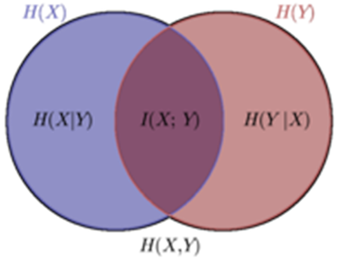
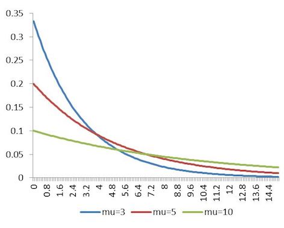
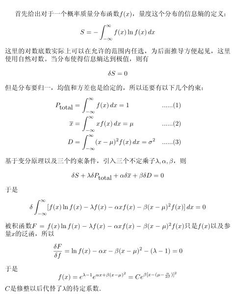

# 最大熵模型

* [返回上层目录](../linear-model.md)
* [直观理解最大熵](#直观理解最大熵)
* [最大熵模型的数学推导](#最大熵模型的数学推导)
  * [最大熵原理](#最大熵原理)
  * [最大熵模型的定义](#最大熵模型的定义)
  * [最大熵模型的学习](#最大熵模型的学习)
* [满足最大熵原理的连续分布推导](#满足最大熵原理的连续分布推导)
  * [已知分布区间推导出均匀分布](#已知分布区间推导出均匀分布)
  * [已知均值推导出指数分布](#已知均值推导出指数分布)
  * [已知均值和标准差推导出正态分布](#已知均值和标准差推导出正态分布)
  * [矩约束下的满足最大熵原理的分布是指数族分布](#矩约束下的满足最大熵原理的分布是指数族分布)
* [如何理解最大熵模型里面的特征](#如何理解最大熵模型里面的特征)
* [最大熵模型的极大似然估计](#最大熵模型的极大似然估计)
* [最大熵模型学习算法：IIS](#最大熵模型学习算法：IIS)
* [最大熵模型与svm的关系](#最大熵模型与svm的关系)
* [最大熵模型的进一步探索](#最大熵模型的进一步探索)
* [参考资料](#参考资料)

# 直观理解最大熵

最大熵模型的**原则**：

* 承认已知事物（知识）
* 对未知事物不做任何假设，没有任何偏见

最大熵原理其实讲述了我们小学学过的一句话：

> 知之为知之，不知为不知，是知也。

也就是说，在没有更多信息时，不擅自做假设。也即在满足已知约束的基础上，保留尽可能多的不确定性。也就是说，既然没有掌握模型的任何信息，那么就让模型的熵最大，否则意味着你通过某种途径掌握了模型的先验知识，然而你并没有，那就不要乱做假设。为什么熵要最大？因为宇宙万物本来就是趋于无序的啊。所以满足已知条件的熵最大模型就是最符合实际的模型了。可以从物理学的角度来理解最大熵模型：根据热力学第二定理，如果没有外力干扰，系统的熵值是趋于不断增加的。由此，在没有其它额外参考信息的情况下，选择熵值最大的模型是最可靠的，因为没有外在动力时，宇宙本来就是趋于无序的啊。

可从两个方面来理解:

1. 对于可以确定的部分（已知的部分），要尽可能地确定（贴近）
2. 对于未知的部分，不作任何假设，保留其最大的不确定性（随机性）

满足这两个条件，就是我们的最大熵估计。

也就是还是一句俗话：

>不要把鸡蛋放在同一个篮子里。

如果告诉你不知道各个篮子会出问题的可能性，面对未知，追求稳妥的情况下，大家都会选择把鸡蛋平均放到各个篮子里。

现在总结一下：

最大熵原理是1957年由E.T.Jaynes提出的，其主要思想是，在只掌握关于未知分布的部分知识时，应该选取符合这些知识但熵值最大的概率分布。其实质就是，在已知部分知识的前提下，关于未知分布最合理的推断就是符合已知知识最不确定或最随机的推断，这是我们可以作出的唯一不偏不倚的选择，任何其它的选择都意味着我们增加了其它的约束和假设，这些约束和假设根据我们掌握的信息无法作出。

也就是说，在保证拟合已有数据的前提下，避免过拟合到任何一种数据分布。

# 最大熵模型的数学推导

最大熵模型由最大熵原理推导实现。这里首先叙述一般的最大熵原理，然后讲解最大熵模型的推导，最后给出最大熵魔性学习的形式。

## 最大熵原理

最大熵原理是概率模型学习的一个准则。最大熵原理认为，学习概率模型时，在所有可能的概率模型（分布）中，熵最大的模型是最好的模型。通常用约束条件来确定概率模型的集合，所以，最大熵原理也可以表述为在满足约束条件的模型集合中选取熵最大的模型。

假设离散随机变量X的概率分布是P(X)，则其熵是
$$
H(P)=-\sum_xP(x)\text{log}P(x)
$$
熵满足下列不等式：
$$
0\leqslant H(P)\leqslant \text{log}|X|
$$
式中，|X|是X的取值个数，当且仅当X的分布是均匀分布时右边的等号成立。这就是说，当X服从均匀分布时，熵最大。

直观地，最大熵原理认为要选择的概率模型首先必须满足已有的事实，即约束条件。在没有更多信息的情况下，那些不确定的部分都是“等可能的”。最大熵原理通过熵的最大化来表示等可能性。“等可能”不容易操作，而熵则是一个可优化的数值指标。

## 最大熵模型的定义

最大熵原理是统计学习的一般原理，将它应用到分类得到最大熵模型。假设分类模型是一个条件概率分布P(Y|X)，X ∈ x ⊆ R^n表示输入，Y ∈ y表示输出，x和y分别是输入和输出的集合。这个模型表示的是对于给定的输入X，以条件概率P(Y|X)输出Y。

给定一个训练数据集
$$
T={(x_1,y_1),(x_2,y_2),...(x_N,y_N)}
$$
学习的目的是用最大熵原理选择最好的分类模型。

首先考虑模型应该满足的条件，给定训练数据集，可以确定联合分布P(X,Y)的经验分布和边缘分布的经验分布，分别以$\tilde P(X,Y)$和$\tilde P(X)$表示。这里，
$$
\begin{aligned}
&\tilde P(X=x,Y=y)=\frac{v(X=x,Y=y)}{N}\\
&\tilde P(X=x)=\frac{v(X=x)}{N}\\
\end{aligned}
$$
其中，v(X=x,Y=y)表示训练数据中样本(x,y)出现的频数，v(X=x)表示训练数据中输入x出现的频数，N表示训练样本容童。

用特征函数（feature function）f(x,y)描述输入x和输出y之间的某一个事实。其定义是
$$
f(x,y)=
\left\{\begin{matrix}
&1,&\quad \text{x与y满足某一事实}\\ 
&0,&\quad \text{否则}\\ 
\end{matrix}\right.
$$
它是一个二值函数（一般地，特征函数可以是任意实值函数。），当x和y满足这个事实时取值为1，否则取值为0。

特征函数f(x,y)关于经验分布$\tilde P(X,Y)$的期望值，用$E_{\tilde P}(f)$表示。
$$
E_{\tilde P}(f)=\sum_{x,y}\tilde P(x,y)f(x,y)
$$
特征函数f(x,y)关于模型P(Y|X)与经验分布$\tilde P(X)$的期望值，用$E_{P}(f)$表示。
$$
E_P(f)=\sum_{x,y}\tilde P(x)P(y|x)f(x,y)
$$
如果**模型能够获取训练数据中的信息**，那么就可以假设这两个期望值相等，即
$$
E_p(f)=E_{\tilde P}(f)
$$
或
$$
\sum_{x,y}\tilde P(x)P(y|x)f(x,y)=\sum_{x,y}\tilde P(x,y)f(x,y)
$$
我们将上式作为模型学习的约束条件。假如有n个特征函数fi(x,y), i=1,2,...,n，那么就有n个约束条件。

**最大熵模型**

假设满足所有约束条件的模型集合为
$$
\mathbb{C}\equiv\{P\in\mathbb{P}|E_{P}(f_i)=E_{\tilde P}(f_i), i=1,2,...,n\}
$$
定义在条件概率分布P(Y|X)上的条件熵为
$$
H(P)=-\sum_{x,y}\tilde P(x)P(y|x)logP(y|x)
$$
则模型集合C中条件熵H(P)最大的模型成为最大熵模型，式中的对数为自然对数。

[**最大熵模型，为什么最大的是条件熵？**](https://www.zhihu.com/question/35295907)

1. 最大熵属于discriminant model，所有的discriminant model需要求解的问题都是P(Y|X)，此为一；

2. 最大熵基于经验风险最小化，假设样本的联合分布反映了实际分布，这样经验分布P(X)与P(Y|X)的乘积即等于P(X,Y)，此为二；

3. 最大熵模型的定义中，对于条件概率分布P(Y|X)，条件熵H(Y|X)最大，意思是在已知样本X的情况下，对不确定事件Y|X，让所有的事件都是“等可能”，也是熵最大。既然H(Y|X)最大，那么互信息I(X;Y)最小，表示X,Y之间相互透露的信息量最少，也就是让X,Y之间额外的假设最少。此为三；

   

综合上述三点，最大熵采用最大化条件熵为优化目标，满足从样本中抽取出来的特征的经验期望与期望一致的约束，也就很自然了。

## 最大熵模型的学习

最大熵模型的学习过程就是求解最大熵模型的过程.最大熵模型的学习可以形式化为约束最优化问题。

对于给定的训练数据集T=\{ (x1, y1), (x2, y2), ... , (xN, yN) \}以及特征函数fi(x,y), i=1,2,...,n，最大熵模型的学习等价于约束最优化问题：
$$
\begin{aligned}
\mathop{\text{max}}_{P\in C}\quad &H(P)=-\sum_{x,y}\tilde P(x)P(y|x)\text{log}\ P(y|x)\\
\text{s.t.}\quad &E_P(f_i)=E_{\tilde P}(f_i),\ i=1,2,3...,n\\
&\sum_yP(y|x)=1\\
\end{aligned}
$$
按照最优化问题的习惯，将求最大值问题改写为等价的求最小值问题：
$$
\begin{aligned}
\mathop{\text{min}}_{P\in C}\quad &-H(P)=\sum_{x,y}\tilde P(x)P(y|x)\text{log}\ P(y|x)\\
\text{s.t.}\quad &E_P(f_i)-E_{\tilde P}(f_i)=0,\ i=1,2,3...,n\\
&\sum_yP(y|x)=1\\
\end{aligned}
$$
求解如上式所示的约束最优化问题，所得出的解，就是最大熵模型学习的解。下面给出具体推导。

这里，将约束最优化的原始问题转换为无约束最优化的对偶问题。通过求解对偶问题求解原始问题。

首先，引进拉格朗日乘子w0, w1, w2, ... , wn，定义拉格朗日函数L(P, w)：
$$
\begin{aligned}
L(P,w)\equiv&-H(P)+w_0\left[1-\sum_yP(y|x)\right]+\sum_{i=1}^nw_i(E_{\tilde P}(f_i)-E_P(f_i))\\
=&\sum_{x,y}\tilde P(x)P(y|x)\text{log}\ P(y|x)+w_0\left[1-\sum_yP(y|x)\right]\\
&+\sum_{i=1}^nw_i\left(\sum_{x,y}\tilde P(x,y)f_i(x,y)-\sum_{x,y}\tilde P(x)P(y|x)f_i(x,y)\right)
\end{aligned}
$$
最优化的原始问题是
$$
\mathop{\text{min}}_{P\in C}\ \mathop{\text{max}}_w\ L(P,w)
$$
对偶问题是
$$
\mathop{\text{max}}_w\ \mathop{\text{min}}_{P\in C}\ L(P,w)
$$
由于拉格朗日函数L(P,w)是P的凸函数，原始问题的解与对偶问题的解是等价的。这样，可以通过求解对偶问题来求解原始问题。

首先，求解对偶问题内部的极小化问题min L(P,w)，min L(P,w)是w的函数，将其记作
$$
\Psi(w)=\mathop{\text{min}}_{P\in C}L(P,w)=L(P_w,w)
$$
Ψ(w)称为对偶函数。同时，将其解记作 
$$
P_w=\text{arg}\mathop{\text{min}}_{P\in C}L(P,w)=P_w(y|x)
$$
具体地，求L(P, w)对P(y|x)的偏导数
$$
\begin{aligned}
\frac{\partial L(P,w)}{\partial P(y|x)}
&=\sum_{x,y}\tilde P(x)\left[logP(y|x)+1\right]-\sum_yw_0-\sum_{x,y}\left[\tilde P(x)\sum_{i=1}^nw_if_i(x,y)\right]\\
&=\sum_{x,y}\tilde P(x)\left[logP(y|x)+1-w_0-\sum_{i=1}^nw_if_i(x,y)\right]\\
\end{aligned}
$$
令偏导数等于0，在$\tilde P(x)>0$的情况下，解得
$$
P(y|x)=\text{exp}\left(\sum_{i=1}^nw_if_i(x,y)+w_0-1\right)=\frac{\text{exp}\left(\sum_{i=1}^nw_if_i(x,y)\right)}{\text{exp}(1-w_0)}
$$
由于
$$
\sum_yP(y|x)=1
$$
，得
$$
P_w(y|x)=\frac{1}{Z_w(x)}\text{exp}\left(\sum_{i=1}^nw_if_i(x,y)\right)
$$
其中，
$$
Z_w(x)=\sum_y\text{exp}\left(\sum_{i=1}^nw_if_i(x,y)\right)
$$
Zw(x)称为规范化因子；fi(x,y)是特征函数；wi是特征的权值。由上两式表示的模型Pw=Pw(y|x)就是最大熵模型。这里，w是最大熵模型中的参数向量。

之后，求解对偶问题外部的极大化问题
$$
\mathop{\text{max}}_w\ \Psi(w)
$$
将其解记为w\*，即
$$
w^*=\text{arg}\ \mathop{\text{max}}_w\ \Psi
$$
这就是说，可以应用最优化算法求对偶函数Ψ(w)的极大化，得到w\*，用来表示P\*∈C，这里，
$$
P^*=P_{w^*}=P_{w^*}(y|x)=\frac{1}{Z_{w^*}(x)}\text{exp}\left(\sum_{i=1}^nw_i^*f_i(x,y)\right)
$$
是学习到的最有模型（最大熵模型）。也就是说，最大熵模型的学习归结为对偶函数Ψ(w)的极大化。

# 满足最大熵原理的连续分布推导

最大熵的连续分布：

- 已知区间 → 均匀分布
- 已知均值 → 指数分布
- 已知均值和标准差（方差） → 正态分布

即：

在分布区间已知的情况下，均匀分布是最大熵分布；

在均值已知的情况下，指数分布是最大熵分布；

**在均值和标准差已知的情况下，正态分布是最大熵分布。**

下面我们根据最大熵原理来推导不同约束条件下的最大熵分布。

## 已知分布区间推导出均匀分布

已知概率的区间分布为[a,b]，则最大熵模型学习的最优化问题是
$$
\begin{aligned}
&min\ &-H(P)&=\sum_{i=1}^nP(x_i)\text{log}\ P(x_i)\\
&s.t.\ &\sum_{i=1}^nP(x_i)&=\sum_{i=1}^n\tilde{P}(x_i)=1\\
&\ &\text{min}(x_i)&=a\\
&\ &\text{max}(x_i)&=b\\
\end{aligned}
$$
引进拉格朗日乘子w0，w1，w2定义拉格朗日函数
$$
L(P,w)=\sum_{i=1}^nP(x_i)\text{log}\ P(x_i)+w_0(\sum_{i=1}^nP(x_i)-1)+w_1[min(x_i)-a]+w_2[max(x_i)-b]
$$
根据拉格朗日对偶性，可以通过求解对偶最优化问题得到原始最优化问题的解，所以求解
$$
\mathop{\text{max}}_{w}\mathop{\text{min}}_{P}L(P,w)
$$
首先求解L(P, w)关于P的极小化问题。为此，固定w0，w1，w2求偏导数：
$$
\frac{\partial L(P,w)}{\partial P(x_i)}=1+\text{log}\ P(x_i)+w_0
$$
令每个偏导数为0，解得
$$
P_w(x_i)=e^{-1-w_0}
$$
于是，
$$
\begin{aligned}
&\mathop{\text{min}}_{P}L(P,w)=L(P_w,w)\\
=&\sum_{i=1}^n(-1-w_0)e^{-1-w_0}+w_0(\sum_{i=1}^ne^{-1-w_0}-1)+w_1[\text{min}(x_i)-a]+w_2[\text{max}(x_i)-b]\\
=&-\sum_{i=1}^ne^{-1-w_0}-w_0+w_1[\text{min}(x_i)-a]+w_2[\text{max}(x_i)-b]\\
\end{aligned}
$$
然后再求解L(pw, w)关于w的极大化问题：
$$
\mathop{\text{max}}_wL(p_w,w)=\mathop{\text{max}}_w\{-\sum_{i=1}^ne^{-1-w_0}-w_0+w_1[\text{min}(x_i)-a]+w_2[\text{max}(x_i)-b]\}
$$
分别求L(pw, w)对w0，w1，w2的偏导数并令其为0，得到
$$
\begin{aligned}
&\frac{\partial L(P_w,w)}{\partial w_0}=\sum_{i=1}^ne^{-1-w_0}-1=0 \Rightarrow \sum_{i=1}^ne^{-1-w_0}=1\\
&\frac{\partial L(P_w,w)}{\partial w_1}=min(x_i)-a=0 \Rightarrow min(x_i)=a\\
&\frac{\partial L(P_w,w)}{\partial w_2}=max(x_i)-b=0 \Rightarrow max(x_i)=b\\
\end{aligned}
$$
因为前面已知
$$
P_w(x_i)=e^{-1-w_0}
$$
所以
$$
\sum_{i=1}^ne^{-1-w_0}=e^{-1-w_0}\sum_{i=1}^n1=P_w(x_i)\sum_a^b1=P_w(x_i)(b-a)=1
$$
则有
$$
P_w(x_i)=\frac{1}{b-a}
$$

## 已知均值推导出指数分布

已知概率分布的均值为μ，则最大熵模型学习的最优化问题是
$$
\begin{aligned}
&\text{min}\ &-H(P)&=\sum_{i=1}^nP(x_i)\text{log}\ P(x_i)\\
&s.t.\ &\sum_{i=1}^nP(x_i)&=\sum_{i=1}^n\tilde{P}(x_i)=1\\
&&\sum_{i=1}^nP(x_i)x_i&=\mu\\
\end{aligned}
$$
引进拉格朗日乘子w0，w1定义拉格朗日函数
$$
L(P,w)=\sum_{i=1}^nP(x_i)\text{log}\ P(x_i)+w_0(\sum_{i=1}^nP(x_i)-1)+w_1(\sum_{i=1}^nP(x_i)x_i-\mu)
$$
根据拉格朗日对偶性，可以通过求解对偶最优化问题得到原始最优化问题的解，所以求解
$$
\mathop{max}_{w}\mathop{min}_{P}L(P,w)
$$
首先求解$L(P,w)$关于P的极小化问题。为此，固定$w_0$，$w_1$，求偏导数：
$$
\frac{\partial L(P,w)}{\partial P(x_i)}=1+\text{log}\ P(x_i)+w_0+w_1x_i
$$
令每个偏导数为0，解得
$$
P_w(x_i)=e^{-1-w_0-w_1x_i}=\frac{exp(-w_1x_i)}{exp(1+w_0)}
$$
由于
$$
\begin{aligned}
&\sum_{x_i}P_w(x_i)=1\\
\Rightarrow&\frac{1}{exp(1+w_0)}\sum_{i=1}^nexp(-w_1x_i)=1\\
\Rightarrow&exp(1+w_0)=Z_w(x)=\sum_{i=1}^nexp(-w_1x_i)\\
\end{aligned}
$$
可得
$$
\begin{aligned}
P_w(x_i)=&e^{-1-w_0-w_1x_i}\\
=&\frac{exp(-w_1x_i)}{exp(1+w_0)}\\
=&\frac{1}{Z_w(x)}exp(-w_1x_i)\\
\end{aligned}
$$
其中，
$$
Z_w(x)=\sum_{y}exp(-w_1x_i)
$$
Zw(x)被称为规范化因子，-xi是特征函数，wi是特征的权值。上面的Pw(xi)就是最大熵模型。

于是，
$$
\begin{aligned}
&\mathop{min}_{P}L(P,w)=L(P_w,w)\\
=&\sum_{i=1}^n(-1-w_0-w_1x_i)e^{-1-w_0-w_1x_i}+w_0(\sum_{i=1}^ne^{-1-w_0-w_1x_i}-1)+w_1(\sum_{i=1}^nx_ie^{-1-w_0-w_1x_i}-\mu)\\
=&-\sum_{i=1}^ne^{-1-w_0-w_1x_i}-w_0-w_1\mu\\
\end{aligned}
$$
然后再求解$L(p_w,w)$关于w的极大化问题：
$$
\mathop{max}_wL(p_w,w)=\mathop{max}_w\{-\sum_{i=1}^ne^{-1-w_0-w_1x_i}-w_0-w_1\mu\}
$$
分别求$L(P_w,w)$对$w_0$，$w_1$的偏导数并令其为0，得到
$$
\begin{aligned}
&\frac{\partial L(P_w,w)}{\partial w_0}=\sum_{i=1}^ne^{-1-w_0-w_1x_i}-1=0 \Rightarrow \sum_{i=1}^ne^{-1-w_0-w_1x_i}=1\ \ &(1)\\
&\frac{\partial L(P_w,w)}{\partial w_1}=\sum_{i=1}^nx_ie^{-1-w_0-w_1x_i}-\mu=0 \Rightarrow \sum_{i=1}^nx_ie^{-1-w_0-w_1x_i}=\mu\ \ &(2)\\
\end{aligned}
$$
因为前面已知
$$
P_w(x_i)=e^{-1-w_0-w_1x_i}=\frac{1}{Z_w(x)}exp(-w_1x_i)\ \ (3)
$$
所以将上式(3)带入(1)式中，为了方便计算，将求和改为积分，并且为了让计算有意义，选择积分范围从0到正无穷。

则有
$$
\begin{aligned}
\int_0^{\infty}\frac{1}{Z_w(x)}exp(-w_1x)dx=1\\
\end{aligned}
$$
可得
$$
\begin{aligned}
Z_w(x)&=\int_0^{\infty}exp(-w_1x)dx\\
&=-\frac{1}{w_1exp(w_1x)}|^{infty}_0\\
&=-(0-\frac{1}{w_1})\\
&=\frac{1}{w_1}
\end{aligned}
$$
将上式带入(3)式中，可得
$$
P_w(x_i)=e^{-1-w_0-w_1x_i}=\frac{1}{Z_w(x)}exp(-w_1x_i)=w_1exp(-w_1x_i)
$$
将上式带入(2)式中，可得
$$
\begin{aligned}
&\sum_{i=1}^nx_ie^{-1-w_0-w_1x_i}=\int_0^{\infty}xw_1e^{-w_1x}dx=\mu\\
\Rightarrow&\int_0^{\infty}xe^{-w_1x}dx=\frac{\mu}{w_1}\\
\Rightarrow&\int_0^{\infty}x(-\frac{1}{w_1})d(e^{-w_1x})=\frac{\mu}{w_1}\\
\Rightarrow&\int_0^{\infty}xd(e^{-w_1x})=-\mu\\
\Rightarrow&xe^{-w_1x}|^{\infty}_0-\int_0^{\infty}e^{-w_1x}dx=-\mu\\
\Rightarrow&0-\frac{1}{w_1}=-\mu\\
\Rightarrow&w_1=\frac{1}{\mu}
\end{aligned}
$$
好了，现在我们就能得到
$$
P_w(x_i)=e^{-1-w_0-w_1x_i}=\frac{1}{Z_w(x)}exp(-w_1x_i)=\frac{1}{\mu}exp(-\frac{x_i}{\mu})
$$
即
$$
P(x)=\frac{1}{\mu}exp(-\frac{x}{\mu})
$$
而这就是指数分布，参数μ代表均值：

## 已知均值和标准差推导出正态分布

已知概率分布的均值为μ，方差为σ^2，则最大熵模型学习的最优化问题是
$$
\begin{aligned}
&\text{min}\ -H(P)=\sum_{i=1}^nP(x_i)\text{log}\ P(x_i)\\
&\text{s.t.}\quad \sum_{i=1}^nP(x_i)=1\\
&\quad\quad\ \ \sum_{i=1}^nP(x_i)x_i=\mu \\
&\quad\quad\ \ \sum_{i=1}^nP(x_i)(x_i-\mu)^2=\sigma^2\\
\end{aligned}
$$
引进拉格朗日乘子w0，w1，w2定义拉格朗日函数
$$
L(P,w)=\sum_{i=1}^nP(x_i)\text{log}\ P(x_i)+w_0(1-\sum_{i=1}^nP(x_i))+w_1(\mu-\sum_{i=1}^nP(x_i)x_i)+w_2(\sigma^2-\sum_{i=1}^nP(x_i)(x_i-\mu)^2)
$$
根据拉格朗日对偶性，可以通过求解对偶最优化问题得到原始最优化问题的解，所以求解对偶问题
$$
\mathop{\text{max}}_{w}\mathop{\text{min}}_{P}L(P,w)
$$
首先求解L(P,w)关于P的极小化问题。为此，固定w0，w1，求偏导数：
$$
\frac{\partial L(P,w)}{\partial P(x_i)}=1+\text{log}\ P(x_i)-w_0-w_1x_i-w_2(x_i-\mu)^2
$$
令每个偏导数为0，解得
$$
P_w(x_i)=\text{exp}\left(-1+w_0+w_1x_i+w_2(x_i-\mu)^2\right)=\frac{\text{exp}(w_1x_i+w_2(x_i-\mu)^2)}{\text{exp}(1-w_0)}
$$
由于
$$
\begin{aligned}
&\sum_{y}P_w(x_i)=1\\
\Rightarrow&\frac{1}{\text{exp}(1-w_0)}\sum_{y}\text{exp}(w_1x_i+w_2(x_i-u)^2)=1\\
\Rightarrow&\text{exp}(1-w_0)=Z_w(x)=\sum_{y}\text{exp}(w_1x_i+w_2(x_i-u)^2)\\
\end{aligned}
$$
可得
$$
\begin{aligned}
P_w(x_i)=&\text{exp}(-1+w_0+w_1x_i+w_2(x_i-\mu)^2)\\
=&\frac{\text{exp}(w_1x_i+w_2(x_i-\mu)^2)}{\text{exp}(1-w_0)}\\
=&\frac{1}{Z_w(x)}\text{exp}(w_1x_i+w_2(x_i-\mu)^2)\\
\end{aligned}
$$
如果我们令
$$
\begin{aligned}
&w=[w_1, w_2]^T\\
&f(x,y)=[x_i,(x_i-\mu)^2]^T\\
\end{aligned}
$$
则上上式可改写为更清楚的结构：
$$
P_w(x_i)=\frac{1}{Z_w(x)}\text{exp}(w_1x_i+w_2(x_i-\mu)^2)=\frac{1}{Z_w(x)}\text{exp}(w^T\cdot f(x,y))
$$
其中，
$$
Z_w(x)=\sum_{y}\text{exp}(w_1x_i+w_2(x_i-u)^2)=\sum_{y}\text{exp}(w^T\cdot f(x,y))
$$
Zw(x)被称为规范化因子，f(x,y)是特征函数，w是特征的权值。上面的Pw(x_i)就是最大熵模型。

于是，
$$
\begin{aligned}
&\mathop{\text{min}}_{P}L(P,w)=L(P_w,w)\\
=&\sum_{i=1}^n(-1+w_0+w_1x_i+w_2(x_i-\mu)^2)e^{-1+w_0+w_1x_i+w_2(x_i-\mu)^2}\\
&+w_0(1-\sum_{i=1}^ne^{-1+w_0+w_1x_i+w_2(x_i-\mu)^2})\\
&+w_1(\mu-\sum_{i=1}^nx_ie^{-1+w_0+w_1x_i+w_2(x_i-\mu)^2})\\
&+w_2(\sigma^2-\sum_{i=1}^n(x_i-\mu)^2e^{-1+w_0+w_1x_i+w_2(x_i-\mu)^2})\\
=&-\sum_{i=1}^ne^{-1+w_0+w_1x_i+w_2(x_i-\mu)^2}+w_0+w_1\mu+w_2\sigma^2\\
\end{aligned}
$$
然后再求解L(p_w , w)关于w的极大化问题：
$$
\mathop{\text{max}}_wL(p_w,w)=\mathop{\text{max}}_w\{-\sum_{i=1}^ne^{-1+w_0+w_1x_i+w_2(x_i-\mu)^2}+w_0+w_1\mu+w_2\sigma^2\}
$$
分别求L(Pw , w)对w0，w1，w2的偏导数并令其为0，得到
$$
\begin{aligned}
&\frac{\partial L(P_w,w)}{\partial w_0}=-\sum_{i=1}^ne^{-1+w_0+w_1x_i+w_2(x_i-\mu)^2}+1=0 \\
\Rightarrow &\sum_{i=1}^ne^{-1+w_0+w_1x_i+w_2(x_i-\mu)^2}=1&(1)\\
&\frac{\partial L(P_w,w)}{\partial w_1}=-\sum_{i=1}^nx_ie^{-1+w_0+w_1x_i+w_2(x_i-\mu)^2}+\mu=0\\
\Rightarrow &\sum_{i=1}^nx_ie^{-1+w_0+w_1x_i+w_2(x_i-\mu)^2}=\mu&(2)\\
&\frac{\partial L(P_w,w)}{\partial w_2}=-\sum_{i=1}^n(x_i-\mu)^2e^{-1+w_0+w_1x_i+w_2(x_i-\mu)^2}+\sigma^2=0\\
\Rightarrow &\sum_{i=1}^n(x_i-\mu)^2e^{-1+w_0+w_1x_i+w_2(x_i-\mu)^2}=\sigma^2&(3)\\
\end{aligned}
$$
这其实就是那三个约束条件嘛。。

因为前面已知
$$
P_w(x_i)=\text{exp}\left(-1+w_0+w_1x_i+w_2(x_i-\mu)^2\right)
$$
我们对上式做一些变换，方便下面的积分计算。上式可改写为
$$
\begin{aligned}
P_w(x_i)&=\text{exp}\left(-1+w_0+w_1x_i+w_2(x_i-\mu)^2\right)\\
&=\text{exp}(w_0-1)\ \text{exp}\left(w_1x_i+w_2(x_i-\mu)^2\right)\\
&=C\ \text{exp}\left\{w_2\left[x_i-\left(\mu-\frac{w_1}{2w_2}\right)\right]^2\right\}
\end{aligned}
$$
其中，C是修正以后代替了w0的待定系数。

下面开始应用上面的三个约束条件，为了计算方便，我们将累加求和变为积分，利用约束(1)，令
$$
y=x-\left(\mu-\frac{w_1}{2w_2}\right)
$$
，又由概率密度函数Pw(x)在整个实数域上可积，有
$$
\int_{-\infty}^{\infty}P_w(x)dx=\int_{-\infty}^{\infty}P'_w(y)dy=C\sqrt{\frac{\pi}{-w_2}}=1\Rightarrow C=\sqrt{-\frac{w_2}{\pi}}
$$
利用约束(2)，又有
$$
\begin{aligned}
&\int_{-\infty}^{\infty}xP_w(x)dx=\int_{-\infty}^{\infty}\left(y+\left(\mu-\frac{w_1}{2w_2}\right)\right)p'_w(y)dy=\mu\\
\Rightarrow &\int_{-\infty}^{\infty}yP'_w(y)dy=\frac{w_1}{2w_2}
\end{aligned}
$$
由于yP'w(y)是个奇函数，故
$$
\begin{aligned}
&w_1=0\\
&y=x-\mu\\
&P_w(x)=C\ e^{w_2[x_i-(\mu-\frac{w_1}{2w_2})^2]}=\sqrt{-\frac{w_2}{\pi}}e^{w_2(x-\mu)^2}
\end{aligned}
$$
再利用约束(3)，有
$$
\begin{aligned}
&\int_{-\infty}^{\infty}y^2P'_w(y)dy=\sqrt{-\frac{w_2}{\pi}}\frac{\sqrt{\pi}}{2(-w_2)^{\frac{3}{2}}}=-\frac{1}{2w_2}=\sigma^2\\
\Rightarrow&w_2=-\frac{1}{2\sigma^2}
\end{aligned}
$$
至此，可得
$$
P(x)=P_w(x)=\sqrt{-\frac{w_2}{\pi}}e^{w_2(x-\mu)^2}=\frac{1}{\sqrt{2\pi}\sigma}e^{-\frac{(x-\mu)^2}{2\sigma^2}}
$$
这是什么分布？这就是正态分布啊，所以，正态分布其实就是满足均值和方差约束的熵最大的分布。就是说，当你只知道一堆数据的均值和方差时，你最好的假设模型就是正态分布了。

---

下面的方法是用变分法和拉格朗日乘子法来求解，这个才是最正规和严谨的解法，之前不正规的地方在哪里呢？就是把求和累加变为积分，为什么不能直接一开始就是积分呢？因为对概率函数的积分求概率函数的偏导涉及到了泛函。

[Lagrange乘子法与变分法小练习：以最大熵推导正态分](http://tieba.baidu.com/p/1481898870)

---

下面单独讲讲最大熵原理和正态分布的关系及其理解：

确定均值和方差下，正态分布就是熵最大，最混乱，最无序的分布。当我们不知道其他信息时，就认为正态分布是最佳的选择。

具体来说：我们在实践中为何总是选择使用正态分布呢，正态分布在自然界中的频繁出现只是原因之一。Jaynes认为还有一个重要的原因是正态分布的最大熵性质。**在很多时候我们并不知道数据的真实分布是什么，但是一个分布的均值和方差往往是相对稳定的。因此我们能从数据中获取到的比较好的知识就是均值和方差，除此之外没有其它更加有用的信息量**。因此按照最大熵原理，我们应该选择在给定的知识的限制下，选择熵最大的概率分布，而这就恰好是正态分布。因此按照最大熵的原理，即便数据的真实分布不是正态分布，由于我们对真实分布一无所知，如果数据不能有效提供除了均值和方差之外的更多的知识，那这时候正态分布就是最佳的选择。

平时因为我们测量时候最容易得到的数据也就是关于均值和协方差（关联）的有关信息，与这些有关的约束加上最大熵要求，不考虑更高阶的关联，一般都是得到正态分布。但是如果涉及到高阶矩，或者约束条件有些奇怪，则不能得到正态分布。

## 矩约束下的满足最大熵原理的分布是指数族分布

其实，上面三个都可以归结为，在0阶矩、1阶矩、2阶矩等矩的约束下，满足最大熵原理的分布。而这些分布其实都是指数族分布。匈牙利数学家Csiszar曾经证明，**对任何一组不自相矛盾的信息，最大熵模型不仅存在，而且是唯一的。而且它们都有同一个非常简单的形式 -- 指数函数**。

均匀分布、指数分布、正态分布等分布都属于指数族分布。还有下面的分布都是满足约束的最大熵推导出来的指数族分布。

指数族分布具体在“指数族分布”章节中讲解。

# 如何理解最大熵模型里面的特征

1. 一般的最大熵模型中，特征不一定是0/1的，所以求和不一定是计数。当然，如果在一本教材中，最大熵模型的主要应用场合里特征是0/1的，那么还是点明求和就是计数比较好。
2. 一组数据(x,y)一般情况下并不只触发一个特征。特征除了“x取特定值，y取特定值”的形式以外，还可以是“x取某类值，y取某类值”的形式，更一般的是“x和y的取值满足某种关系”的形式。正是这些一般形式的特征才让最大熵模型有足够的泛化能力。当一组数据不只触发一个特征的时候，exp内就不止一个权重求和，就求不出解析解了。

对数线性模型对特征的表达fi(x,y)描述的是x与y的相关性，而“等于”只是相关性的一种。同一个(x,y)可以满足不同的相关性，从而贡献到不同的fi(x,y)上去；同一个fi(x,y)也可能被不同的(x,y)激活。

拿情感分类举个栗子：
$$
x=\{'\text{I}','\text{am}','\text{not}','\text{happy}'\},y=-1
$$
如果“关系”仅仅是“相等”，只能建立这样的特征：
$$
f_1(x,y)=
\left\{\begin{matrix}
1&,\ \text{if}\ x=\{'\text{I}','\text{am}','\text{not}','\text{happy}'\}\ \text{and}\ y=-1\\ 
0&,\ \text{others}\\
\end{matrix}\right.
$$
很显然，把一个句子固定死了，特征的泛化能力不行啊

但事实上我们可以：
$$
f_2(x,y)=
\left\{\begin{matrix}
1&,\ \text{if}\ x[2]='\text{not}'\ \text{and}\ x[3]='\text{happy}'\ \text{and}\ y=-1\\ 
0&,\ \text{others}\\
\end{matrix}\right.
$$
也可以：
$$
f_3(x,y)=
\left\{\begin{matrix}
1&,\ \text{if}\ x[2]='\text{not}'\ \text{and}\ x[3]\in \text{PositiveWords}\ \ \text{and}\ y=-1\\ 
0&,\ \text{others}\\
\end{matrix}\right.
$$
相比f1(x,y)，更好的特征应该是f3(x,y)。

你也可以把上面的特征都用上。让大量特征参与进来，也正是对数线性模型的妙处。这时就需要数值计算了。

事实上，解法的选取影响到特征的定义。早先的[Darroch-Ratcliff过程](Darroch J N, Ratcliff D. Generalized Iterative Scaling for Log-Linear Models[J]. Annals of Mathematical Statistics, 1972, 43(5):1470-1480.)，要求
$$
\sum_if_i(x,y)=1\ \ \text{for all x,y}
$$
，后来改进的[Improved Iterative Scaling](Berger A L, Pietra V J D, Pietra S A D. A maximum entropy approach to natural language processing[J]. Computational Linguistics, 2002, 22(1):39-71.)在此基础上融入了牛顿方法处理
$$
f^{\text{+}}(x,y)=\sum_if_i(x,y)
$$
非常数的情况，只需fi(x,y)≥0即可。

# 最大熵模型的极大似然估计

最大熵就是下式表示的条件概率分布。
$$
P_w(y|x)=\frac{1}{Z_w(x)}\text{exp}(w^T\cdot f(x,y))
$$
其中，
$$
\begin{aligned}
&Z_w(x)=\sum_{y}\text{exp}(w^T\cdot f(x,y))\\
&w=[w_1, w_2,...,w_n]^T\\
&f(x,y)=[f_1(x,y),f_2(x,y),...,f_n(x,y)]^T\\
\end{aligned}
$$
下面证明对偶函数的极大化等价于最大熵模型的极大斯然估计。

已知训练数据的经验概率分布$\tilde P(X,Y)$，条件概率分布P(Y|X)的对数似然函数表示为(如果你看不懂这里的对数似然函数为什么是指数形式，请看本小节的最后的解释)
$$
L_{\tilde P}(P_w)=\text{log}\prod P(y|x)^{\tilde P(x,y)}=\sum_{x,y}\tilde P(x,y)\text{log} P(y|x)
$$

当条件概率分布P(y|x)是最大熵模型时，对数似然函数
$$
\begin{aligned}
L_{\tilde P}(P_w)&=\sum_{x,y}\tilde P(x,y)log P(y|x)\\
&=\sum_{x,y}\tilde P(x,y)[w^T\cdot f(x,y)]-\sum_{x,y}\tilde P(x,y)logZ_w(x)\\
&=\sum_{x,y}\tilde P(x,y)[w^T\cdot f(x,y)]-\sum_{x}\tilde P(x)logZ_w(x)\\
\end{aligned}
$$
再看对偶函数Ψ(w)，
$$
\begin{aligned}
\Psi(w)=&L(P_w,w)\\
=&\sum_{x,y}\tilde P(x)P_w(y|x)\text{log}P_w(y|x)\\
&+\sum_{i=1}^nw_i\left[\sum_{x,y}\tilde P(x,y)f_i(x,y)-\sum_{x,y}\tilde P(x)P(y|x)f_i(x,y)\right]\\
=&\sum_{x,y}\tilde P(x,y)\sum_{i=1}^nw_if_i(x,y)+\sum_{x,y}\tilde P(x)P_w(y|x)\left[\text{log}P_w(y|x)-\sum_{i=1}^nw_if_i(x,y)\right]\\
=&\sum_{x,y}\tilde P(x,y)\left[w^T\cdot f(x,y)\right]+\sum_{x,y}\tilde P(x)P_w(y|x)\left[\text{log}P_w(y|x)-w^T\cdot f(x,y)\right]\\
=&\sum_{x,y}\tilde P(x,y)\left[w^T\cdot f(x,y)\right]+\sum_{x,y}\tilde P(x)P_w(y|x)\left[\text{log}P_w(y|x)-\text{log}e^{w^T\cdot f(x,y)}\right]\\
=&\sum_{x,y}\tilde P(x,y)\left[w^T\cdot f(x,y)\right]-\sum_{x,y}\tilde P(x)P_w(y|x)\text{log}Z_w(x)\\
=&\sum_{x,y}\tilde P(x,y)\left[w^T\cdot f(x,y)\right]-\sum_{x}\tilde P(x)\text{log}Z_w(x)\quad \text{since} \sum P(y|x)=1\\
\end{aligned}
$$
比较上两式，我们发现，对偶函数Ψ(w)等价于对数似然函数$L_{\tilde P}(P_w)$，即
$$
\Psi(w)=L_{\tilde P}(P_w)
$$
于是证明了最大熵模型学习中的对偶函数佳大化等价于最大声模型的极大斯然估计这一事实。

这样，最大熵模型的学习问题就转换为具体求解对数似然函数极大化或对偶函数极大化的问题。

且根据MLE的正确性，可以断定：**最大熵的解（无偏的对待不确定性）同时是最符合样本数据分布的解，进一步证明了最大熵模型的合理性**。两相对比，**熵是表示不确定性的度量，而似然表示的是与知识的吻合程度**，进一步，**最大熵模型是对不确定度的无偏分配，最大似然估计则是对知识的无偏理解**。

最大熵模型与Logistic回归模型有类似的形式，他们又称为对数线性模型。模型学习就是在给定的训练数据条件下对模型进行极大似然估计或者正则化的极大似然估计。

---

**这里的对数似然函数为什么是指数形式？**

最近在学习最大熵模型，看到极大似然估计这部分，没有看明白条件概率分布p(y|x)的对数似然函数。上网查了很多资料都没有一个合理的解释。基本直接给出对数似然函数的一般形式: 
$$
L_{\tilde P}(P_w)=\text{log}\prod P(y|x)^{\tilde P(x,y)}=\sum_{x,y}\tilde P(x,y)log P(y|x)
$$
其实并没有解决问题。为了方便以后其他人的学习和理解，我结合自己的理解给出完整的解释。

其实第一眼之所以不理解，因为这是最大似然函数的另外一种形式。一般书上描述的最大似然函数的一般形式是各个样本集XX中各个样本的联合概率: 
$$
L(x_1,x_2,...,x_n;\theta)=\prod_{i=1}^np(x_i;\theta)
$$
其实这个公式和上式是等价的。x1,x2,...,xn是样本具体观测值。随机变量X是离散的，所以它的取值范围是一个集合，假设样本集的大小为n，X的取值有k个，分别是v1,v2,...,vk。用C(X=v_i)表示在观测值中样本vi出现的频数。所以L(x1,x2,...,xn;θ)可以表示为： 
$$
L(x1,x2,...,x_n;\theta)=\prod_{i=1}^kp(v_i;\theta)^{C(X=v_i)}
$$
对等式两边同时开n次方，可得 
$$
L(x_1,x_2,...,x_n;\theta)^{\frac{1}{n}}=\prod_{i=1}^kp(v_i;\theta)^{\frac{C(X=v_i)}{n}}
$$
因为经验概率
$$
\bar p(x)=\frac{C(X=v_i)}{n}
$$
，所以简写得到：
$$
L(x_1,x_2,...,x_n;\theta)^{\frac{1}{n}}=\prod_xp(x;\theta)^{\hat p(x)}
$$
很明显对L(x1,x2,...,xn;θ)求最大值和对L开n次方后求最大值的优化的结果是一样的。整理上式所以最终的最大似然函数可以表示为： 
$$
L(x;\theta)=\prod_xp(x;\theta)^{\hat p(x)}
$$
忽略θ，更一般的公式就是本文的第一个公式。而最大熵的对数似然函数为：
$$
\begin{aligned}
L_{\hat p}&=\text{log}\prod_{x,y}p(x,y)^{\hat p(x,y)}\\
&=\sum_{x,y}\hat p(x,y)\text{log}\ p(x,y)\\
&=\sum_{x,y}\hat p(x,y)\text{log}\ [\hat p(x)p(y|x)]\\
&=\sum_{x,y}\hat p(x,y)\text{log}\ p(y|x)+\sum_{x,y}\hat p(x,y)\text{log}\ \hat p(x)\\
\end{aligned}
$$
上述公式第二项是一个定值（都是样本的经验概率），一旦样本集确定，就是个常数，可以忽略。所以，最终的对数似然函数为：
$$
L_{\hat p}=\sum_{x,y}\hat p(x,y)\text{log}\ p(y|x)
$$
上式就是最大熵模型中用到的对数似然函数。

# 最大熵模型学习算法：IIS

改进的迭代尺度法(improved iterative scaling, IIS)是一种最大熵模型学习的最优化算法。

改进的迭代尺度法（Improved Iterative Scaling），在很多模型求解中用到，比如最大熵、CRFs等，对模型是对数线性模型的似然都适用。这个算法的思想也很简单，通俗的理解就是通过两个不等式变形优化下界，从而迭代到收敛的算法。

已知最大熵模型为
$$
P_w(y|x)=\frac{1}{Z_w(X)}\text{exp}\left( \sum_{i=1}^n w_if_i(x,y) \right)
$$
其中，
$$
Z_w(x)=\sum_y\text{exp}\left(\sum_{i=1}^nw_if_i(x,y)\right)
$$
对数似然函数为
$$
\begin{aligned}
L(w)&=\sum_{x,y}\tilde P(x,y)\left[w^T\cdot f(x,y)\right]-\sum_{x}\tilde P(x)\text{log}Z_w(x)\\
&=\sum_{x,y}\tilde P(x,y)\sum_{i=1}^nw_if_i(x,y)-\sum_{x}\tilde P(x)\text{log}Z_w(x)\\
\end{aligned}
$$
目标是通过极大似然估计学习模型参数，即求对数似然函数的极大值$\hat{w}$。

IIS的想法是：假设最大熵模型当前的参数向量是w=(w1, w2, ... , wn)^T，我们希望找到一个新的参数向量w+δ=(w1+δ1, w2+δ2, ... , wn+δn)^T，使得模型的对数似然函数值增大。如果能有这样一种参数向量更新的方法τ : w→w+δ，那么就可以重复使用这一方法，直至找到对数似然函数的最大值。

对于给定的经验分布$\tilde P(x,y)$，模型参数从w到w+δ，对数似然函数的改变量是
$$
\begin{aligned}
L(w+\delta)-L(w)&=\sum_{x,y}\tilde P(x,y)\text{log}P_{w+\delta}(y|x)-\sum_{x,y}\tilde P(x,y)\text{log}P_w(y|x)\\
&=\sum_{x,y}\tilde P(x,y)\left(\text{log}P_{w+\delta}(y|x)-\text{log}P_w(y|x)\right)\\
&=\sum_{x,y}\tilde P(x,y)\text{log}\left(\frac{P_{w+\delta}(y|x)}{P_w(y|x)}\right)\\
&=\sum_{x,y}\tilde{P}(x,y)\text{log}\left(\frac{\frac{1}{Z_{w+\delta}(x)}\text{exp}\left( \sum_{i=1}^n (w_i+\delta_i)f_i(x,y) \right)}{\frac{1}{Z_w(x)}\text{exp}\left( \sum_{i=1}^n w_if_i(x,y) \right)}\right)\\
&=\sum_{x,y}\tilde{P}(x,y)\text{log}\left(\text{exp}\left( \sum_{i=1}^n \delta_if_i(x,y)\right)\frac{Z_w(x)}{Z_{w+\delta}(x)} \right)\\
&=\sum_{x,y}\tilde{P}(x,y)\left( \sum_{i=1}^n \delta_if_i(x,y) + \text{log}\left(\frac{Z_w(x)}{Z_{w+\delta}(x)} \right) \right)\\
&=\sum_{x,y}\tilde P(x,y)\sum_{i=1}^n\delta_if_i(x,y)-\sum_{x,y}\tilde P(x,y)\text{log}\frac{Z_{w+\delta}(x)}{Z_w(x)}\\
&=\sum_{x,y}\tilde P(x,y)\sum_{i=1}^n\delta_if_i(x,y)-\sum_x\tilde P(x)\text{log}\frac{Z_{w+\delta}(x)}{Z_w(x)}\\
\end{aligned}
$$
利用不等式
$$
-\text{log}\alpha\geqslant 1-\alpha,\quad\alpha>0
$$
建立对数似然函数改变量的下界：
$$
\begin{aligned}
L(w+\delta)-L(w)&\geqslant\sum_{x,y}\tilde P(x,y)\sum_{i=1}^n\delta_if_i(x,y)+\left(1-\sum_x\tilde P(x)\text{log}\frac{Z_{w+\delta}(x)}{Z_w(x)}\right)\\
&=\sum_{x,y}\tilde P(x,y)\sum_{i=1}^n\delta_if_i(x,y)+1-\sum_x\tilde P(x)\text{exp}\sum_{i=1}^n\delta_if_i(x,y)\\
&=\sum_{x,y}\tilde P(x,y)\sum_{i=1}^n\delta_if_i(x,y)+1-\sum_x\tilde P(x)\sum_yP_w(y|x)\text{exp}\sum_{i=1}^n\delta_if_i(x,y)\\
\end{aligned}
$$
将右端标记为
$$
A(\delta|w)=\sum_{x,y}\tilde P(x,y)\sum_{i=1}^n\delta_if_i(x,y)+1-\sum_x\tilde P(x)\sum_yP_w(y|x)\text{exp}\sum_{i=1}^n\delta_if_i(x,y)
$$
于是有
$$
L(w+\delta)-L(w)\geqslant A(\delta|w)
$$
即$A(\delta|w)$是对数似然函数改变量的一个下界。

如果能找到适当的$\delta$使下界$A(\delta|w)$提高，那么似然函数也会提高。然而，函数$A(\delta|w)$中的$\delta$是一个向量，含有多个变量，不易同时优化。IIS试图一次只优化其中一个变量$\delta_i$，而固定其他变量$\delta_j$，$i\neq j$。

为了达到这一目的，IIS进一步降低下界$A(\delta|w)​$。具体地，IIS引进一个量$f^{\text{+}}(x,y)​$，
$$
f^{\text{+}}(x,y)=\sum_if_i(x,y)
$$
因为$f_i$是二值函数，故$f^{\text{+}}(x,y)$表示所有特征在(x,y)出现的次数。这样，$A(\delta|w)$可以改写为
$$
\begin{aligned}
A(\delta|w)&=\sum_{x,y}\tilde P(x,y)\sum_{i=1}^n\delta_if_i(x,y)+1-\sum_x\tilde P(x)\sum_yP_w(y|x)\text{exp}\sum_{i=1}^n\delta_if_i(x,y)\\
&=\sum_{x,y}\tilde P(x,y)\sum_{i=1}^n\delta_if_i(x,y)+1-\sum_x\tilde P(x)\sum_yP_w(y|x)\text{exp}\left[f^{\text{+}}(x,y)\sum_{i=1}^n\frac{\delta_if_i(x,y)}{f^{\text{+}}(x,y)}\right]\\
\end{aligned}
$$
利用指数函数的凸性以及对任意i，有
$$
\frac{f_i(x,y)}{f^{\text{+}}(x,y)}\geqslant0
$$
且
$$
\sum_{i=1}^n\frac{f_i(x,y)}{f^{\text{+}}(x,y)}=1
$$
这一事实，根据Jensen不等式，得到
$$
\text{exp}\left[\sum_{i=1}^n\frac{f_i(x,y)}{f^{\text{+}}(x,y)}\delta_if^{\text{+}}(x,y)\right]\leqslant \sum_{i=1}^n\frac{f_i(x,y)}{f^{\text{+}}(x,y)}\text{exp}[\delta_if^{\text{+}}(x,y)]
$$
于是$A(\delta|w)$可以改写为
$$
\begin{aligned}
A(\delta|w)&=\sum_{x,y}\tilde P(x,y)\sum_{i=1}^n\delta_if_i(x,y)+1-\sum_x\tilde P(x)\sum_yP_w(y|x)\text{exp}\left[f^{\text{+}}(x,y)\sum_{i=1}^n\frac{\delta_if_i(x,y)}{f^{\text{+}}(x,y)}\right]\\
&\geqslant\sum_{x,y}\tilde P(x,y)\sum_{i=1}^n\delta_if_i(x,y)+1-\sum_x\tilde P(x)\sum_yP_w(y|x)\sum_{i=1}^n\left[\frac{f_i(x,y)}{f^{\text{+}}(x,y)}\right]\text{exp}\left[\delta_if^{\text{+}}(x,y)\right]\\
\end{aligned}
$$
记上式右端为
$$
B(\delta|w)=\sum_{x,y}\tilde P(x,y)\sum_{i=1}^n\delta_if_i(x,y)+1-\sum_x\tilde P(x)\sum_yP_w(y|x)\sum_{i=1}^n\left[\frac{f_i(x,y)}{f^{\text{+}}(x,y)}\right]\text{exp}\left[\delta_if^{\text{+}}(x,y)\right]
$$
于是得到
$$
L(w+\delta)-L(w)\geqslant B(\delta|w)
$$
这里，$B(\delta|w)$是对数似然函数改变量的一个新的（相对不紧的）下界。

求$B(\delta|w)$对$\delta_i$的偏导数：
$$
\frac{\partial B(\delta|w)}{\partial\delta_i}=\sum_{x,y}\tilde P(x,y)f_i(x,y)-\sum_x\tilde P(x)\sum_yP_w(y|x)f_i(x,y)\text{exp}\left[\delta_if^{\text{+}}(x,y)\right]
$$
在上式中，除$\delta_i$外不含任何其他变量，令偏导数为0得到
$$
\sum_{x,y}\tilde P(x)P_w(y|x)f_i(x,y)\text{exp}\left[\delta_if^{\text{+}}(x,y)\right]=E_{\tilde P}(f_i)
$$
于是，依次对$\delta_i$求解上式就可以求出$\delta$。

值得一提的是，在求解$\delta$的过程中，如果$f^{\text{+}}(x,y)=M$为常数，则
$$
\delta_i=\frac{1}{M}\text{log}\frac{E_{\tilde P}(f_i)}{E_P(f_i)}
$$
否则用牛顿法解决：
$$
\delta^{(k+1)}_i=\delta^{(k)}_i-\frac{g(\delta^{(k)}_i)}{g'(\delta_i^{(k)})}
$$
求得了$\delta$，便相当于求得权值w，最终将w代回到下式中：
$$
P_w(y|x)=\frac{1}{Z_w(X)}exp\left( \sum_{i=1}^n w_if_i(x,y) \right)
$$
其中，
$$
Z_w(x)=\sum_yexp\left(\sum_{i=1}^nw_if_i(x,y)\right)
$$
即得到最大熵模型的最优估计。

这就给出了一种求w的最优解的迭代算法，即改进的迭代尺度算法IIS。

**输入**：特征函数$f_1$,$f_2$,...,$f_n$；经验分布$\tilde P(X,Y)$，模型$P_w(y|x)$

**输出**：最有参数值$w^*_i$；最优模型$P_{w^*}$。

- (1)对所有$i\in{1,2,...,n}$，取初值$w_i=0$

- (2)对每一$i\in{1,2,...,n}$：

  - (a)令$\delta_i$是方程

  $
  \sum_{x,y}\tilde P(x)P_w(y|x)f_i(x,y)\text{exp}\left[\delta_if^{\text{+}}(x,y)\right]=E_{\tilde P}(f_i)
  $

  的解，这里，
  $
  f^{\text{+}}(x,y)=\sum_{i=1}^nf_i(x,y)
  $

  - (b)更新$w_i$值：$w_i\leftarrow w_i\delta_i$

- (3)如果不是所有$w_i$都收敛，重复步骤(2)。

# 最大熵模型与svm的关系

最大熵模型定义的时候是从经验熵最大的角度去定义的，求解的过程中被形式化为一个约束条件下最优化的问题，然后求解的方法又是转化为无约束最优化的对偶问题，于是引入拉格朗日乘子，求偏导，置零，又根据原始约束条件的限制，就可以得到给定输入变量时，输出变量的条件分布的表达式了。（其实这整套思路，是和SVM那一套是一样的，SVM有KKT条件，直观表达了模型与数据之间的关系【支持向量】；而这里就是 条件分布的表达式了，都反映了建模分析的角度。）

# 最大熵模型的进一步探索

Jaynes的最大熵框架是一套很奇妙的数学框架，之所以说它奇妙是因为它具有简洁、实用之美。你会发现，让我们感到头痛的那些数学分支，例如概率论、统计物理、随机过程中很多重要的定理、公式全部可以用非常简单的步骤从最大化熵数学框架中推出来，糟糕的是，没有任何人能理解这套机制为什么能工作，包括那些曾经发明、使用这些工具的人，所以你在正统的概率论等课程中学不到它。之所以我们要关注这个数学框架，是因为它很有可能为我们的整个理论体系提供一套坚实的数学基础。例如Dewar就试图从最大化熵框架推导出最大熵产生原理。

阅读这方面的文献完全可以从一本科普读物读起，这就是 
1、《组成论》 
[http://www.douban.com/subject/1584327/?i=0](https://www.douban.com/link2/?url=http%3A%2F%2Fwww.douban.com%2Fsubject%2F1584327%2F%3Fi%3D0) 

这本书貌似有很多公式，但其实很通俗易懂。其中不乏很多实际的例子说明最大熵原理能工作的范围（在书中成为最复杂原理）。作者张学文教授是老一辈搞系统科学的科学家之一。他从广义集合、最复杂原理出发揭示出来这套框架的普适性。最精彩的是从最大化熵原理出发通过加入不同的约束条件可以推导出各种各样的概率分布，什么幂律分布、正态分布、伽玛分布，等等可以统一在最大化熵体系之下。要对他们的工作有进一步的了解，还可以参考他们的网站： 
<http://zxw.idm.cn/ZCL/index.htm> 

2、E.T. Jaynes的Information theory and Statistical Physics 
<http://www.swarmagents.com/thesis/detail.asp?id=229&type=0> 

中国有一个张学文，美国有一个E.T.Jaynes，他们都是在相对独立的条件下提出了最大化熵这样一条另类的思路。其实这套思路，包括熵的最现代的表述形式，S=-Sigma(pi Log pi)都可以追溯到统计物理学家Gibbs，只不过Gibbs并没有把这套思路明确指出来，我想原因之一就可能是Gibbs并不理解熵定义式的含义。Jaynes则赋予了一种含义，即我们对客观物理系统的无知程度。换句话说，Jaynes认为熵并不度量客观物理系统的某种属性，而度量的是我们观察者的一种状态。所以，我们可以把最大化熵作为一种出发点，来推导出整个统计物理体系！ 
这是一种看待统计物理的全新的野路子，即统计物理根本不是一套描述客观物理系统的学科，而是一种引起观察者心智状态变化的算法！推荐的这篇文章是一个开篇之作。 

更多Jaynes的文章请参看他的个人网站： 
<http://bayes.wustl.edu/etj/etj.html> 
里面有很多文章和书可以下载。 

3、系列论文集： 
Maximum entropy and Bayesian methods 
[http://www.douban.com/subject/2079359/?i=0](https://www.douban.com/link2/?url=http%3A%2F%2Fwww.douban.com%2Fsubject%2F2079359%2F%3Fi%3D0) 
这是一系列的会议论文集。我们看到最大熵和贝叶斯概率理论联系了起来，原因就在于有一种学派采纳了对概率的不同解释，即主观概率。这套东西向来是教科书很少介绍的，然而，按照观察者的思路来看，主观概率是一套很好的从研究客观世界到研究主观世界的转折点。 

4、The maximum entropy formalism and the idiosyncratic theory of biodiversity 
<http://www.swarmagents.com/thesis/detail.asp?id=239&type=0> 
关于最大化熵框架应用最多的是工程领域、计算机科学。然而，近年来一个新的趋势就是运用这套方法来解释自然科学现象，比如这篇文章就把它用到了物种分布曲线上。 

5、Dewar的《理论生物学》上面的一篇论文： 
Statistical mechanics unifies different ecological patterns 
<http://www.swarmagents.com/thesis/detail.asp?id=221> 
该文主要把最大化熵方法用到了生态学上，解释物种的统计分布。而更有意思的是，他这套最大化熵方法不是最大化传统的信息熵，而是一个比较怪的相对信息熵，得出了很好的结论。自然，我们会提出一个问题就是为什么要最大相对信息熵，我们如何选择优化指标？这些研究并没有给出好答案。 

就先推荐这么多吧，其实已经不少了。目前，我对这套框架的思路是，它的出发点很好，尤其是对主观概率的一系列看法是很不一样的。但感觉要把它用到我们感兴趣的最大熵产生原理上可能还没那么简单，也许我们需要对这套框架做一下扩展。 

# 参考资料

* [不觉得最大熵原理很奇怪吗？](https://www.zhihu.com/question/27812128)

”直观理解最大熵“一节就参考此知乎问答。

* [最大熵模型中的数学推导](https://blog.csdn.net/v_july_v/article/details/40508465)

"最大熵模型的数学推导"一节部分参考了此博客。

* [最大熵和正态分布的关系是什么？](https://www.zhihu.com/question/20807764)

”满足最大熵原理的连续分布“一节就参考此知乎问答。

* [标准正态分布的积分怎么求？](https://blog.csdn.net/libing_zeng/article/details/77531855)

"已知均值和标准差推导出正态分布"一节的求解公式参考了此博客。

* [关于最大熵模型的严重困惑：为什么没有解析解？](https://www.zhihu.com/question/49139674)

"如何理解最大熵模型里面的特征"一节参考了此知乎回答。

* [如何理解最大熵模型里面的特征？](https://www.zhihu.com/question/24094554/answer/108271031)

"如何理解最大熵模型里面的特征"一节参考了此知乎回答。

* [最大熵模型中的对数似然函数的解释](https://blog.csdn.net/wkebj/article/details/77965714)

"最大熵模型的极大似然估计"一节参考了此博客。

* [最大熵模型：读书笔记](http://blog.sina.com.cn/s/blog_afe2af380102v8qw.html)
* [The Improved Iterative Scaling Algorithm: A Gentle Introduction](https://x-algo.cn/wp-content/uploads/2016/02/berger-iis.pdf)
* 上文的翻译：[条件随机场（CRF）-IIS学习算法](https://www.cnblogs.com/xueyinzhe/p/7141838.html)

"最大熵模型学习算法：IIS"一节参考了此博客。

* [Jaynes的最大熵框架（Maximum Entropy）](https://www.douban.com/group/topic/4997088/)

“最大熵模型的进一步探索“一节参考此资料。

