# 机器学习概论

- [返回顶层目录](../../README.md)
- [机器学习的哲学思想](#机器学习的哲学思想)
  - [没有免费的午餐定理—教条主义的危害](#没有免费的午餐定理—教条主义的危害)
  - [奥卡姆剃刀定理—少即是多](#奥卡姆剃刀定理—少即是多)
  - [三个臭皮匠的智慧—初看集成学习](#三个臭皮匠的智慧—初看集成学习)
  - [民主自由与专制—再看集成学习](#民主自由与专制—再看集成学习)
  - [频率学派和贝叶斯学派—不可知论](#频率学派和贝叶斯学派—不可知论)
  - [后记：妥协、矛盾与独立思考](#后记：妥协、矛盾与独立思考)
- [机器学习三要素](#机器学习三要素)
  - [模型](#模型)
  - [策略](#策略)
    - [损失函数和风险函数](#损失函数和风险函数)
    - [经验风险最小化与结构风险最小化](#经验风险最小化与结构风险最小化)
  - [算法](#算法)
- [过拟合与模型复杂度](#过拟合与模型复杂度)
  - [直观理解过拟合与欠拟合](#直观理解过拟合与欠拟合)
  - [训练误差与测试误差](#训练误差与测试误差)
  - [过拟合与模型选择](#过拟合与模型选择)
  - [VC维](#VC维)
- [正则化](#正则化)
  - [正则化作用及其常见术语](#正则化作用及其常见术语)
  - [机器学习正则化技术基本概念](#机器学习正则化技术基本概念)
  - [正则化对应约束条件的最优化](#正则化对应约束条件的最优化)
    - [L2正则化直观理解](#L2正则化直观理解)
    - [L1正则化直观理解](#L1正则化直观理解)
    - [L1与L2解的稀疏性](#L1与L2解的稀疏性)
    - [正则化参数 λ](#正则化参数 λ)
    - [L2正则化理论分析](#L2正则化理论分析)
    - [L1正则化理论分析](#L1正则化理论分析)
    - [约束最优化观点总结](#约束最优化观点总结)
  - [贝叶斯观点：正则化对应模型先验概率](#贝叶斯观点：正则化对应模型先验概率)
    - [Linear Regression](#Linear Regression)
    - [Ridge Regression](#Ridge Regression)
    - [Lasso Regression](#Lasso Regression)
    - [Elastic Net Regression](#Elastic Net Regression)
    - [贝叶斯观点正则化总结](#贝叶斯观点正则化总结)
  - [L1和L2正则化的异同](#L1和L2正则化的异同)
  - [正则化技术总结](#正则化技术总结)
- [模型评估方法](#模型评估方法)
  - [留出法](#留出法)
  - [k折交叉验证法](#k折交叉验证法)
  - [Bootstrap有放回采样法](#Bootstrap有放回采样法)
  - [调参与最终模型](#调参与最终模型)
- [模型性能度量](#模型性能度量)
  - [错误率与精度](#错误率与精度)
  - [查准率P、查全率R与PR曲线](#查准率P、查全率R与PR曲线)
  - [ROC与AUC](#ROC与AUC)
  - [ROC曲线和PR曲线的关系](#ROC曲线和PR曲线的关系)
- [偏差与方差](#偏差与方差)
- [维数灾难](#维数灾难)
- [生成模型与判别模型](#生成模型与判别模型)
  - [简述](#简述)
  - [第一种定义](#第一种定义)
    - [生成模型](#生成模型)
    - [判别模型](#判别模型)
    - [非概率模型（也称为判别模型）](#非概率模型（也称为判别模型）)
  - [第二种定义](#第二种定义)
  - [生成模型与判别模型的特点](#生成模型与判别模型的特点)


- [机器学习模型分类](#机器学习模型分类)
  - [监督学习](#监督学习)
  - [非监督学习](#非监督学习)
  - [半监督学习](#半监督学习)
  - [强化学习](#强化学习)


# 机器学习的哲学思想

**不仅仅是机器学习，大部分理工科的思想都可以从文史学科的角度去理解。正所谓大道至简，很多道理是共通的**。本文的内容是从哲学角度看待机器学习。文章的结构如下：

1. 天下没有免费的午餐—教条主义的危害
2. 奥卡姆剃刀定理—少即是多
3. 三个臭皮匠的智慧—初看集成学习
4. 民主自由与专制—再看集成学习
5. 频率学派和贝叶斯学派—不可知论
6. 后记：妥协、矛盾与独立思考

## 没有免费的午餐定理—教条主义的危害

（No Free Lunch Theorem / NFL定理）

NFL定理由Wolpert在1996年提出，其应用领域原本为经济学。我们耳熟能详的“天下没有免费的午餐”最早是说，十九世纪初很多欧美酒吧和旅店为了提升销售额向顾客提供免费的三明治，而客人贪图免费的三明治却意外的买了很多杯酒，酒吧从而获利更多了，以此来教育大家不要贪小便宜吃大亏。和那句家喻户晓的"天下没有免费的午餐"有所不同， NFL讲的是**优化模型的评估问题**。

在机器学习领域，NFL的意义在于告诉机器学习从业者："假设所有数据的分布可能性相等，当我们用任一分类做法来预测未观测到的新数据时，对于误分的预期是相同的。" 简而言之，NFL的定律指明，**如果我们对要解决的问题一无所知且并假设其分布完全随机且平等，那么任何算法的预期性能都是相似的**。

**这个定理对于“盲目的算法崇拜”有毁灭性的打击**。例如，现在很多人沉迷“深度学习”不可自拔，那是不是深度学习就比其他任何算法都要好？在任何时候表现都更好呢？未必，我们必须要加深对于问题的理解，不能盲目的说某一个算法可以包打天下。然而，从另一个角度说，我们对于要解决的问题往往不是一无所知，因此大部分情况下我们的确知道什么算法可以得到较好的结果。举例，我们如果知道用于预测的特征之间有强烈的相关性，那么我们可以推测Naive Bayes（简单贝叶斯分类器）不会给出特别好的结果，因为其假设就是特征之间的独立性。

**在某个领域、特定假设下表现卓越的算法不一定在另一个领域也能是“最强者”。正因如此，我们才需要研究和发明更多的机器学习算法来处理不同的假设和数据**。George Box早在上世纪八十年代就说过一句很经典的话："**All models are wrong, but some are useful**（所有的模型的都是错的，但其中一部分是有用的）。" 这也可以理解为是NFL的另一种表述。周志华老师在《机器学习》一书中也简明扼要的总结：“NFL定理最重要的寓意，是让我们清楚的认识到，**脱离具体问题，空泛的谈‘什么学习算法更好’毫无意义**。”  

## 奥卡姆剃刀定理—少即是多

奥卡姆剃刀定理(Occam's Razor - Ockham定理）

奥卡姆剃刀是由十二世纪的英国教士及哲学家奥卡姆提出的：“ **如无必要，勿增实体**”。用通俗的语言来说，如果两个模型A和B对数据的解释能力完全相同，那么选择较为简单的那个模型。**在统计学和数学领域，我们偏好优先选择最简单的那个假设，如果与其他假设相比，其对于观察的描述度一致**。

奥卡姆剃刀定理对于机器学习的意义在于**它给出了一种模型选择的方法**，对待**过拟合**问题有一定的指导意义。就像我在其他文章中提到的过的，如果简单的线性回归和复杂的深度学习在某个问题上的表现相似(如相同的误分率)，那么我们应该选择较为简单的线性回归。

Murphy在MLAPP中用Tenenbaum的强抽样假设（strong sampling assumption）来类比奥卡姆剃刀原理。首先他给出了下面的公式，Pr(D|h)代表了我们重置抽样（sampling with replacement）N次后得到集合D时，某种假设h为真的概率。
$$
Pr(D|h)=\left[ \frac{1}{size(h)} \right]^N=\left[ \frac{1}{|h|} \right]^N
$$
举例，我们有0~99共100个数字，每次从其中随机抽出一个数字并放回，重复抽取N次。若随机抽了并放回了5次，我们抽出了\{ 2, 4, 8, 16, 32 \}，于是我们想要推断抽取到底遵循什么规则。我们有两种假设：

* h1：我们是从\{ 2, 4, 6, 8, ... ,98 \}中抽取的，即从偶数中抽取 : 
* h2：我们是从\{ 2^n \}中抽取的

根据上文给出的公式进行计算，我们发现Pr(D|h2)远大于Pr(D|h1)，即我们相信D = \{ 2, 4, 8, 16, 32 \}从h2：\{ 2^n \}中产生的可能更大，但是h1：\{ 2, 4, 6, 8, ... ,98 \}似乎也能解释我们的结果。这个时候我们就应选择概率更高的那个。  

从奥卡姆剃刀角度思考的话，h2：\{ 2^n \}在0~99中只有5个满足要求的元素，而h1：\{ 2, 4, 6, 8, ... ,98 \}却有50个满足要求的元素。那么**h2更加简单**，更加符合尝试，选择它:)  

提供这个例子的原因是为了提供一个量化方法来评估假设，其与奥卡姆剃刀有相同的哲学内涵。有兴趣的读者应该会发现奥卡姆剃刀的思想与贝叶斯推断是一致的，更细致的讨论可以看[刘未鹏 | Mind Hacks](http://mindhacks.cn/2008/09/21/the-magical-bayesian-method/)关于贝叶斯推断的介绍。 

**但读者应该注意，奥卡姆剃刀定理只是一种对于模型选择的指导方向，不同的选择方向如集成学习(Ensemble Learning)就给出了近似相反的选择标准。现实世界是非常复杂的，切勿滥用**。  

## 三个臭皮匠的智慧—初看集成学习

集成学习（Ensemble Learning）的哲学思想是“众人拾柴火焰高”，和其他机器学习模型不同，集成学习将多个较弱的机器学习（臭皮匠）模型合并起来来一起决策（诸葛亮）。比较常见的方法有多数投票法（majority vote），即少数服从多数。如果我们有10个"子分类器"通过一个人的疾病史来推断他能活多大，其中8个说他会活过200岁，其中2个说他在200岁前会死，那么我们相信他可以活过200岁。

集成学习的思想无处不在，比较著名的有随机森林等。从某种意义上说，**神经网络也是一种集成学习，每个单独的神经元都可以看做某种意义上的学习器**。

相信敏锐的读者已经发现，集成学习似乎和前面提到的奥卡姆剃刀定理相违背。明明一个分类模型就够麻烦了，现在为什么要做更多？这其实说到了一个很重要观点，就是**奥卡姆剃刀定理并非不可辩驳的真理，而只是一种选择方法。从事科学研究，切勿相信有普遍真理**。人大的周孝正教授曾说："**若一件事情不能证实，也不能证伪，就要存疑**。" 恰巧，**奥卡姆定理就是这样一种不能证实也不能证伪的定理**。

而集成学习的精髓在于假设“子分类器”的**错误相互独立**，随着集成中子分类器的数目上升，集成学习后的"母分类器"的误差将会以指数级别下降，直至为0。然而，这样的假设是过分乐观的，因为我们无法保证"子分类器"的错误是相互独立的。以最简单的Bagging为例，如果为了使k个子分类器的错误互相独立，那么我们将训练数据N分为k份。显然，随着k值上升，每个分类器用于训练的数据量都会降低，每个子训练器的准确性也随之下降。即使我们允许训练数据间有重采样，也还是无法避免子分类器数量和准确性之间的矛盾。周志华老师曾这样说："**个体学习的准确性和多样性本身就存在冲突，一般的，准确性很高后，想要增加多样性，就得要牺牲准确性**。事实上，**如何产生并结合好而不同个体学习器，恰是集合学习的研究核心**。"  

## 民主自由与专制—再看集成学习

细分集成学习的话，也有两种截然相反的设计思路：

* **思路1**：每个子学习器都是**弱**分类器，在融合后达成为一个强力的主体。代表算法：随机森林
* 每个子学习器都是**强**分类器，融合过程中可能：
  * **思路2**（强中取强）：选择最强的那一个。代表算法：dynamic classifier selection
  * **思路3**（公平选择）：一视同仁的对待每个子学习器，融合出一个更强的主体。代表算法：stacking

不难看出，思路1和3虽然期望的子学习器不同（弱vs.强），但都比较公平做到了一视同仁，和民主很像。而思路2不同，更加强调自由（或是专制），选出最强的那一个，让它说了算。

**让一堆子学习器集体做决定的缺陷在于低效，容易被平庸的子学习器拖了后腿。而信赖最强者的缺点在于缺乏稳定性，上限可以很高，下限也可以很低**。

试问集成学习到底该选择哪条路？没有答案，但实用主义告诉我们哪个好用用哪个，要结合具体情况进行分析。  

## 频率学派和贝叶斯学派—不可知论

很多统计学习领域的小伙伴们都知道从统计学角度出发，对于概率有两种不同的认知。对于不熟悉的读者来说，无论是机器学习还是统计学习都是一种寻找一种**映射**，或者更广义的说，进行**参数估计**。以线性回归为例，我们得到结果仅仅是一组权重。

如果我们的目标是参数估计，那么有一个无法回避的问题...**参数到底存不存在？**换句话说，茫茫宇宙中是否到处都是不确定性（Uncertainty），而因此并不存在真实的参数，而一切都是处于运动当中的。

**频率学派（Frequentism）相信参数是客观存在的，虽然未知，但不会改变。**因此频率学派的方法一直都是试图估计“哪个值最接近真实值”，相对应的我们使用最大似然估计（Maximum Likelihood Estimation），置信区间（Confidence Level），和p-value。因此这一切都是体现我们对于真实值估算的自信和可靠度。

**而贝叶斯学派（Bayesian）相信参数不是固定的，我们需要发生过的事情来推测参数**，这也是为什么总和先验（Prior）及后验（Posterior）过不去，才有了最大后验（Maximum a Posteriori）即MAP。贝叶斯学派最大的优势在于承认未知（Uncertainty）的存在，因此感觉更符合我们的常识“不可知论”。从此处说，前文提到的周孝正教授大概是贝叶斯学派的（周教授是社会学家而不是统计学家）。  

据我不权威观察，不少统计学出身的人倾向于频率学派而**机器学习出身的人更倾向于贝叶斯学派**。比如著名的机器学习书籍PRML就是一本贝叶斯学习，而Murphy在MLAPP中曾毫无保留的花了一个小节指明频率学派的牵强之处。  

就像豆腐脑是甜的还是咸的，这样的问题还是留给读者们去思考。需要注意的是，两种思想都在现实中都有广泛的应用，切勿以偏概全。更多的思考可以看这篇知乎讨论：[贝叶斯学派与频率学派有何不同？ - 知乎](https://www.zhihu.com/question/20587681)

从哲学角度来看，频率学派和贝叶斯学派间的区别更像是在讨论“**形而上学**”以及“**不可知论**”。和我们高中课本中提到的的“二分法”思想似乎也有一定的联系。 

## 后记：妥协、矛盾与独立思考

在接触机器学习的早期阶段，时间往往都花在了研究算法上。随着学习的深入，相信大家会慢慢发现其实算法思想的精髓是**无处不在的妥协**。本文只能涉及到几种“矛盾”和“妥协”，更多的留给大家慢慢发掘和思考:）比如，本文未敢涉及到“统计学习”和“机器学习”之间的区别，也是一种妥协：模型可解释性与有效性的妥协。无处不在的妥协还包含“模型精度”和“模型效率”的妥协，“欠拟合”和“过拟合”的平衡等。

大部分科学，比如数学还是物理，走到一定程度，都是妥协，都有妥协带来的美感。这给我们的指导是：当我们听到不同的想法的时候，反驳之前先想一想，不要急着捍卫自己的观点。而相反的两种观点，在实际情况下却往往都有不俗的效果，这看似矛盾但却是一种和谐。

**因此，当面对纷杂的信息，各种似是而非的解释与结论时。最重要的不是急着发表观点，而是静下来慢下来，不要放弃思考。只有独立的思考，才能最终帮助我们摆脱重重迷雾，达到所追寻的真理。**

# 机器学习三要素

统计学习方法都是由模型、策略和算法构成的，即统计学习方法由三要素构成，可以简单地表示为

**方法 = 模型 + 策略 + 算法**

下面论述机器学习三要素。可以说构建一种机器学习方法就是确定具体的统计学习三要素。

## 模型

统计学习首要考虑的问题是**学习什么样的模型**。在监督学习过程中，模型就是所要学习的条件概率分布或决策函数。

模型的假设空间包含所有可能的条件概率分布或决策函数。例如，假设决策函数是输入变量的线性函数，那么模型的假设空间就是所有这些线性函数构成的函数集合。假设空间中的模型一般有无穷多个。

假设空间用F表示。

假设空间可以定义为**决策函数的集合**
$$
F=\{ f|Y=f(X) \}
$$
其中，X和Y是定义在输入空间X和输出空间Y上的变量。这时通常是由一个参数向量决定的函数族：
$$
F=\{ f|Y=f_{\theta}(X),\theta\in R^n \}
$$
参数向量θ取值于n维欧氏空间R^n，称为参数空间。

假设空间也可以定义为**条件概率的集合**
$$
F=\{ P|P(y|X)\}
$$
其中，X和Y是定义在输入空间X和输出空间Y上的随机变量。这时F通常是由一个参数向量决定的条件概率分布族：
$$
F=\{ P|P_{\theta}(y|X) ,\theta\in R^n \}
$$
参数向最θ取值于n维欧氏空间R^n，称为参数空间。

本书中称由决策函数表示的模型为非概率模型，由条件概率表示的模型为概率模型.为了简便起见，当论及模型时，有时只用其中一种模型。

## 策略

有了模型的假设空间，统计学习接着需要考虑的是**按照什么样的准则学习或选择最优的模别**。机器学习的**目标在于从假设空间中选取最优模型**。

首先引入损失函数与风险函数的概念。损失函数度量模型一次预测的好坏，风险函数度量平均意义下模型预测的好坏.

### 损失函数和风险函数

监督学习问题是在假设空间F中选取模型f作为决策函数，对于给定的输入X，由f(X)给出相应的输出y，这个输出的预测值f(X)与真实值y可能一致也可能不一致，用一个损失函数或代价函数来度量预测错误的程度。损失函数记作L(Y, f(x))。

损失函数值越小，模型就越好。由于模型的输入、输出(X, Y)是随机变量，遵循联合分布P(X, Y)，所以损失函数的期望是
$$
R_{\text{exp}}(f)=E_P[L(Y, f(X))]=\int_{X\times Y}L(y,f(x))P(x,y)dxdy
$$
这是理论上模型f(X)关于联合分布P(X, Y)的平均意义下的损失，称为期望风险或**期望损失**。

**学习的目标就是选择期望风险最小的模型**。由于联合分布P(X, Y)是未知的，Rexp(f)不能直接计算。实际上，如果知道联合分布P(X, Y)，可以从联合分布直接求出条件概率分布P(Y|X)，也就不需要学习了。正因为不知道联合概率分布，所以才需要进行学习。这样一来，一方面根据期望风险最小学习模型要用到联合分布，另一方面联合分布又是未知的，所以监督学习就成为一个病态问题。

给定一个训练数据集
$$
T=\{ (x_1,y_1), (x_2,y_2), ... , (x_N,y_N) \}
$$
模型f(X)关于训练数据集的平均损失称为经验风险（empirical risk）或**经验损失**，记作Remp：
$$
R_{emp}(f)=\frac{1}{N}\sum_{i=1}^NL(y_i,f(x_i))
$$
期望风险Rexp(f)是模型关于联合分布的期望损失，经验风险Remp(f)是模型关于训练样本集的平均损失。根据大数定律，当样本容量N趋于无穷时，经验风险Remp(f)趋于期望风险Rexp(f)。所以—个很自然的想法是**用经验风险估计期望风险**。但是，由于现实中训练样本数目有限，甚至很小，所以用经验风险估计期望风险常常**并不理想**，要对经验风险进行一定的矫正。这就关系到监督学习的两个基本策略：经验风险最小化和结构风险最小化。

### 经验风险最小化与结构风险最小化

在假设空间、损失函数以及训练数据集确定的情况下，经验风险Remp(f)就可以确定。经验风险最小化的策略认为，经验风险最小的模型是最优的模型。根据这一策略，按照经验风险最小化求最优模型就是求解最优化问题：
$$
\mathop{\text{min}}_{f\in F}\frac{1}{N}L(y_i,f(x_i))
$$
其中，F是假设空间。

**当样本容量足够大时，经验风险最小化能保证有很好的学习效果**，在现实中被广泛采用。比如，极大似然估计就是经验风险最小化的一个例子。当模型是条件概率分布，损失函数是对数损失函数时，经验风险最小化就等价于极大似然估计。

但是，**当样本容量很小时**，经验风险最小化学习的效果就未必很好，**会产生过拟合现象**。

**结构风险最小化**是为了**防止过拟合**而提出来的策略。**结构风险最小化等价于正则化**。**结构风险在经验风险上加上表示模型复杂度的正则化项或罚项**。在假设空间、损失函数以及训练数据集确定的情况下，结构风险的定义是
$$
R_{\text{srm}}(f)=\frac{1}{N}L(y_i,f(x_i))+\lambda J(f)
$$
其中J(f)为模型的复杂度，是定义在假设空间F上的泛函。模型f越复杂，复杂度J(f)就越大；反之，模型f越简单，复杂度J(f)就越小。也就是说，**复杂度表示了对复杂模型的惩罚**。**λ≥0是系数，用以权衡经验风险和模型复杂度**。结
构风险小需要经验风险与模型复杂度同时小。结构风险小的模型往往对训练数据以及**未知的**测试数据都有较好的预测。
比如，贝叶斯估计中的最大后验概率估计（maximum posterior probability estimatkm，MAP）就是结构风险最小化的一个例子。当模型是条件概率分布、损失函数是对数损失函数、**模型复杂度由模型的先验概率表示时**，结构风险最小化就等价于最大后验概率估计。

结构风险最小化的策略认为结构风险最小的模型是最优的模型。所以求最优模型，就是求解最优化问题：
$$
\mathop{\text{min}}_{f\in F}\frac{1}{N}L(y_i,f(x_i))+\lambda J(f)
$$
这样，机器学习学习问题就变成了**经验风险或结构风险函数的最优化问题**。这时经验或结构风险函数是**最优化的目标函数**。

## 算法

算法是指机器学习模型的具体计算方法。

机器学习基于训练数据集，根据学习策略，从假设空间中选择最优模型，最后需要考虑用什么样的计算方法求解最优模型。

这时，**机器学习问题归结为最优化问题**，机器学习的算法成为求解最优化问题的算法。如果最优化问题有显式的解析解，这个最优化问题就比较简单。但通常解析解不存在，这就需要用数值计算的方法求解。如何保证找到全局最优解，并使求解的过程非常高效，就成为一个重要问题。机器学习可以利用已有的最优化算法，有时也需要开发独自的最优化算法。

机器学习方法之间的不同，主要来自其**模型、策略、算法**的不同。确定了模型、策略、算法，机器学习的方法也就确定了。这也就是将其称为机器学习三要素的原因。

# 过拟合与模型复杂度

## 直观理解过拟合与欠拟合

在正式讲这两个概念之前我们先来看一个故事：假设你想要习英语但之前对英语一无所知，不过曾听说过莎士比亚是一个位伟大的英国作家。你想要学英语的话，当然是将自己泡在一个图书馆中，背诵他的相关作品，用他的作品学习英语。一年的学习结束后，你走出图书馆，来到了纽约，并向你看到的第一个人打了声招呼：“嗨，愿光明与你同在！” 那人用奇怪的眼光看着你，嘴里嘟囔着“神经病”。你故作镇定地又试了一遍：“亲爱的夫人，今天是何等的优雅呢？” 你再次收获了失败，还把那个人吓跑了。当你三次尝试都失败后，你心烦意乱的说道：“啊，此乃何等之遗憾，何等之悲伤！”确实很遗憾，因为你犯下了一个建模当中最基础的错误之一：**对训练集的过度拟合。**

在数据科学学科中，**过拟合（overfit）模型被解释为一个从训练集（training set）中得到了高方差（variance）和低偏差（bias），导致其在测试数据中得到低泛化的模型**。为了更好地理解这个复杂的定义，我们试着将它理解为去尝试学习英语的过程。我们要构建的这一模型代表了如何用英语交流。把莎士比亚的所有作品作为训练数据，把在纽约的对话作为测试集(testing set)。如果我们把社会认可程度来衡量这一模型的表现的话，那么事实表明我们的模型将不能够有效推广到测试集上。但是，模型中的方差和偏差又是什么呢？

**方差**可以理解为为了响应训练集时模型所产生的变化。若我们只是单纯的去记忆训练集，我们的模型将具有高方差：它高度取决于训练集数据。如果我们读的所有作品来自J.K.罗琳，而不是莎士比亚，这个模型将变得完全不同。当这样一个具有高方差的模型应用到一个新的测试集上时，这个模型将无法获得很好的表现。因为在没有训练集数据的情况下模型将迷失方向。就好比一个学生只是单纯复习了教科书上列出的问题，但这却无法帮助他解决一些实际的问题。

**偏差**作为与方差相对的一个概念，表示了我们基于数据所做出的假设的强度（有效性）。在前文我们尝试学习英语的例子中，我们基于一个没有初始化的模型，并把作家的作品当作学习语言的教科书。低偏差看似是一个正向的东西，因为我们可能会有这样的想法：我们并不需要去带着倾向性思维看待我们的数据。然而我们却需要对数据表达的完整性持怀疑态度。因为任何自然处理流程都会生成噪点，并且我们无法自信地保证我们的训练数据涵盖了所有这些噪点。所以我们在开始学习英语之前需要明白，我们无法通过死记硬背莎士比亚的名著来熟练掌握英语。

总体来说，**偏差关系到数据被忽略的程度，而方差则关系到模型和数据的依赖程度**。在所有的建模过程中，偏差和方差之间永远存在着一个**权衡**问题，并且需要我们针对实际情况找到一个最佳的平衡点。偏差和方差这两个概念可应用于任何从简单到复杂的模型算法，对于数据科学家来说，它们至关重要。

刚才我们了解到了**过拟合的模型具有高方差、低偏差的特点**。那么相反的情况：**低方差、高偏差的模型被称作欠拟合**。相较于之前与训练数据紧密贴合的模型，一个欠拟合模型忽视了从训练数据中获得的信息，进而使其无法找到输入和输出数据之间的内在联系。让我们用之前尝试学习英语的例子来解释它，这一次我们试着去对之前我们用到的模型做出一些假设，并且我们改成使用《老友记》全集作为这一次学习英语的训练数据。为了避免我们之前犯过的错误，这次我们提前作出假设：只有那些以最常用的词：the, be, to, of, and, a为开头的句子才是重要的。当学习的时候，我们不去考虑别的句子，并且我们相信这能够构建更有效的模型。

经过了漫长的训练后，我们又再一次站在了纽约的大街上。这一次，我们的表现相对好了一点点，但是别人依然无法听懂我们，最后，我们还是以失败告终。尽管我们学习到了一些英语知识，并且能够组织一些数量有限的句子，由于从训练数据上造成的高偏差，我们无法从中学到英语的基础结构和语法。虽然这个模型没有受到高方差带来的影响，但是相对于之前的尝试来说，显得又太矫枉过正，拟合不充分！


对数据的过度关注会导致过度拟合，对数据的忽视又会导致欠拟合，那么我们到底该怎么办呢？一定有一个能找到最佳平衡点的办法！值得庆幸的是，在数据科学中，有一个很好的解决方案，叫作**“验证（Validation）”**。用上面的例子来说，我们只使用了一个训练集和一个测试集。这意味着我们无法在实战前知道我们的模型的好坏。最理想的情况是，我们能够用一个模拟测试集去对模型进行评估，并在真实测试之前对模型进行改进。这个模拟测试集被称作**验证集**（validation set），是模型研发工作中非常关键的部分。

两次失败的英语学习过后，我们学聪明了，这一次我们决定使用一个测试集。我们这次同时使用Shakespeare的作品和《老友记》，因为我们从过去的经验中认识到越多的数据总是能够改善这个模型。不同的是，在这次训练结束以后，我们不直接走到街上，我们先找到一群朋友，每周和他们相聚，并以用英语来和他们交谈的形式来评估我们的模型。刚开始的第一周，由于我们的英语水平还很差，我们很难融入到对话当中。然而这一切仅仅是被模拟成一个验证集，每当我们意识到错误后，就能够调整我们的模型。最后，当我们能够适应并掌控与朋友们的对话练习时，我们相信已经是准备好面对测试集的时候了。于是，我们再一次大胆的走了出去，这一次我们成功了！我们非常适应在真实的情况下和别人交谈，这得益于一个非常关键的因素：验证集，是它改善并优化了我们的模型。

英语学习只是一个相对简易的例子。在众多真实的数据科学模型中，考虑到在一个验证集上出现过拟合的可能性，通常会使用到非常多的验证集！这样的解决办法称之为交叉验证（corss-validation），这个方法要求我们将训练集拆分成多个不同的子集，或者在数据足够多的条件下来使用多个验证集。交叉验证法这一个概念涵盖着问题的方方面面。现在当你碰到一个和过度拟合vs欠拟合，偏差vs方差这几个概念有关的问题的时候，你脑海中将会浮现出一个概念框架，这个框架将有助于你去理解并且解决这个问题！

数据科学看似复杂，但它其实都是通过一系列基础的模块搭建而成的。其中的一些概念已经在这篇文章中提到过，它们是：

- 过拟合：过度依赖于训练数据
- 欠拟合：无法获取训练数据中的存在的关系
- 高方差：一个模型基于训练数据产生了剧烈的变化
- 高偏差：一个忽视了训练数据的模型假设
- 过度拟合和欠拟合造成对测试集的低泛化性
- 使用验证集对模型进行校正可以避免实际过程中造成的欠拟合和过度拟合

数据科学和其它科技领域其实与我们的日常生活息息相关。在一些与现实有关的例子的帮助下，我们可以很好地解释并理解这些概念。一旦我们了解了一个框架，我们就能够用技术来处理所有的细节，从而解决难题。

## 训练误差与测试误差

机器学习的目的是使学到的模型不仅对已知数据而且对**未知数据**都能有很好的预测能力。

不同的学习方法会给出不同的模型。当损失函数给定时，基于损失函数的模型的训练误差（training error）和模型的测试误差（testerror）就自然成为学习方法评估的标准。注意，统计学习方法具体采用的损失函数未必是评估时使用的损失函数。当然，让两者一致是比较理想的。

假设学习到的模型是Y=f(X)，**训练误差**是模型Y=f(X)关于训练数据集的平均损失：
$$
R_{\text{emp}}(f)=\frac{1}{N}\sum_{i=1}^NL(y_i,f(x_i))
$$
其中N是训练样本容量。

**测试误差**是模型关于测试数据集的平均损失：
$$
R_{\text{test}}(f)=\frac{1}{N'}\sum_{i=1}^{N'}L(y_i,f(x_i))
$$
其中N'是测试样本容量。

训练误差的大小，对判断给定的问题是不是一个容易学习的问题是有意义的，但**本质上不重要**。测试误差反映了学习方法对**未知**的测试数据集的预测能力，是学习中的重要概念。显然，给定两种学习方法，**测试误差小的方法具有更好的预测能力，是更有效的方法**。通常将学习方法对未知数据的预测能力称为**泛化**能力（generalization ability）。

## 过拟合与模型选择

当假设空间含有不同**复杂度**（例如，不同的参数个数，也称为**容量**）的模型时，就要面临模型选择（model selection）的问题。我们希望选择或学习一个合适的模型。如果在假设空间中存在“真”模型，那么所选择的模型应该逼近真模型。具体地，所选择的模型要与真模型的参数个数相同，所选择的模型的参数向量与真模型的参数向量相近。

如果一味追求提高对**训练数据**的预测能力，所选模型的**复杂度则往往会比真模型更高**。这种现象称为**过拟合**（over-fitting）。**过拟合是指学习时选择的模型所包含的参数过多，以致于出现这一模型对已知数据预测得很好，但对未知数据预测得很差的现象**。可以说模型选择旨在避免过拟合并提髙模型的预测能力。

下面，以多项式函数拟合问题为例，说明**过拟合与模型选择**。这是一个回归问题。

**例子**：假设给定一个训练数据集：
$$
T = \{ (x_1,y_1), (x_2,y_2), ... , (x_N,y_N) \}
$$
其中，xi∈R是输入x的观测值，yi∈R是相应的输出y的观测值，i = 1, 2, ... , N。多项式函数拟合的任务是假设给定数据由M次多项式函数生成，选择最有可能产生这些数据的M次多项式函数，即在M次多项式函数中，选择一个对已知数据以及未知数据都有很好预测能力的函数。

假设给定如下图所示的10个数据点，用0~9次多项式函数对数据进行拟合。图中画出了需要用多项式函数曲线拟合的数据。

设M次多项式为
$$
f_M(x|w)=w_0+w_1x+w_2x^2+...+w_Mx^M=\sum_{j=0}^Mw_jx^j
$$
式中x是单变量输入，w0, w1, ... , wM是M+1个参数。

解决这一问题的方法可以是这样：

首先确定模型的复杂度，即确定多项式的次数；然后在给定的模型复杂度下，按照经验风险最小化的策略，求解参数，即多项式的系数，具体地，求以下经验风险最小化：
$$
L(w)=\frac{1}{2}\sum_{i=1}^N(f(x_i,w)-y_i)^2
$$
这时，损失函数为平方损失，系数1/2是为了计算方便。

这是一个简单的最优化问题。将模型与训练数据代入上式中，有
$$
L(w)=\frac{1}{2}\sum_{i=1}^N\left(\sum_{j=0}^Mw_ix_i^j-y_i\right)^2
$$
这一问题可用最小二乘法求得你和多项式洗漱的唯一解，记作
$$
w_0^*,w_1^*,...,w_M^*
$$
，求解过程不予叙述，可参阅最小二乘法章节。

下图给出了M = 0，M = 1，M = 3及M = 9时多项式函数拟合的情况：


如果M = 0，多项式曲线是一个常数，数据拟合效果很差。

如果M = 1，多项式曲线是一条直线，数据拟合效果也很差。

相反，如果M = 9，多项式曲线通过每个数据点，训练误差为0。从对给定训练数据拟合的角度来说，效果是最好的。但是，因为训练数据本身存在噪声，这种拟合曲线对未知数据的预测能力往往并不是最好的，在实际学习中并不可取。这时**过拟合**现象就会发生。这就是说，**模型选择时，不仅要考虑对已知数据的预测能力，而且还要考虑对未知数据的预测能力**。

当M = 3时，多项式曲线对训练数据拟合效果足够好，模型也比较简单，是一个较好的选择。

在多项式函数拟合中可以看到，随着多项式次数（模型复杂度）的增加，训练误差会减小，直至趋向于0，但是测试误差却不如此，它会随着多项式次数（模型复杂度）的增加**先减小而后增大**。而最终的目的是使测试误差达到最小。这样，在多项式函数拟合中，就要选择合适的多项式次数，以达到这一目的。这一结论对一般的模型选择也是成立的。

下图描述了训练误差和测试误差与模型的复杂度之间的关系。当模型的复杂度增大时，训练误差会逐渐减小并趋向于0；而测试误差会先减小，达到最小值后又增大。当选择的模型复杂度过大时，过拟合现象就会发生。这样，在学习时就要防止过拟合，进行最优的模型选择，即选择复杂度适当的模型，以达到使测试误差最小的学习目的。

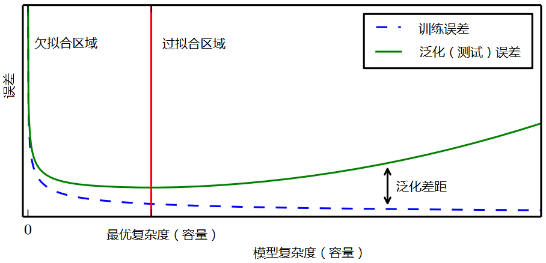

## VC维

建议看一下《机器学习基石》讲的比较清楚，只要点数学基础就行。

简单通俗的说。

VC维是模型的复杂程度，模型假设空间越大，VC维越高。

shatter和break point是VC维理论中的概念。shatter是指模型假设把数据打碎了，也就是区分开了。而break point是指当模型复杂度变的足够高了后，可以把数据打的足够散的一个数学临界点。

更重要的是，VC维的实践意义是给机器学习可学性提供了理论支撑。

* 测试集合的loss是否和训练集合的loss接近？VC维越小，理论越接近。
* 训练集合的loss是否足够小？VC维越大，loss理论越小。

一般工业实践中通过引入正则对模型复杂度(VC维)进行控制，平衡这两个问题的矛盾。

如果想深入理解，推荐看看腾讯广点通团队的这个技术博客：[VC维的来龙去脉 | 火光摇曳](http://www.flickering.cn/machine_learning/2015/04/vc%E7%BB%B4%E7%9A%84%E6%9D%A5%E9%BE%99%E5%8E%BB%E8%84%89/) 。个人认为总结的很好。

[如何通俗的理解机器学习中的VC维、shatter和break point？](https://www.zhihu.com/question/38607822)

[VC维的来龙去脉](http://www.flickering.cn/machine_learning/2015/04/vc%E7%BB%B4%E7%9A%84%E6%9D%A5%E9%BE%99%E5%8E%BB%E8%84%89/)

注：这里有待深入研究，暂时就懂这么多。

# 正则化

正则化是一种有效的控制模型复杂度、防止过拟合、提高模型泛化能力方法，在机器学习和深度学习算法中应用非常广泛，本文从机器学习正则化着手，首先阐述了正则化技术的一般作用和概念，然后针对L1和L2范数正则从4个方面深入理解，最后对常用的典型算法应用进行了分析和总结，后续文章将分析深度学习中的正则化技术。

最基本的正则化方法是在原目标（代价）函数中添加惩罚项，对复杂度高的模型进行“惩罚”。其数学表达形式为：
$$
\tilde{J}(w;X,y)=J(w;X,y)+\alpha\Omega(w)
$$
式中X、y为训练样本和相应标签，w为权重系数向量；J()为目标函数，即为惩罚项，可理解为模型“规模”的某种度量；参数α控制正则化强弱。不同的Ω函数对权重w的最优解有不同的偏好，因而会产生不同的正则化效果。最常用的Ω函数有两种，即L1范数和L2范数，相应称之为L1正则化和L2正则化。此时有：
$$
\begin{aligned}
L1:\Omega(w)=||w||_1=\sum_i|w_i|\\
L2:\Omega(w)=||w||_2^2=\sum_iw_i^2\\
\end{aligned}
$$
本文将从不同角度详细说明L1、L2正则化的推导、求解过程，并对L1范数产生稀疏性效果的本质予以解释。

## 正则化作用及其常见术语

正则化技术广泛应用在机器学习和深度学习算法中，其本质作用是**防止过拟合、提高模型泛化能力**。过拟合简单理解就是训练的算法模型太过复杂了，过分考虑了当前样本结构。其是防止过拟合的其中一种技术手段。在早期的机器学习领域一般只是将范数惩罚叫做正则化技术，而在深度学习领域认为：能够显著减少方差，而不过度增加偏差的策略都可以认为是正则化技术，故推广的正则化技术还有：扩增样本集、早停止、Dropout、集成学习、多任务学习、对抗训练、参数共享等(具体见“花书”)。

过拟合的时候，拟合函数的系数往往非常大，而正则化是通过约束参数的范数使其不要太大，所以可以在一定程度上减少过拟合情况。

为什么过拟合的时候系数会很大？
如下图所示，过拟合，就是**拟合函数需要顾忌每一个点，最终形成的拟合函数波动很大**。在某些很小的区间里，函数值的变化很剧烈。这就意味着函数在某些小区间里的导数值（绝对值）非常大，由于自变量值可大可小，所以只有系数足够大，才能保证导数值很大。

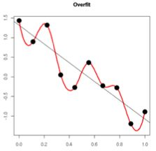

对于机器学习领域正则化技术可以从以下几个不同角度进行理解：

- **(1) 正则化等价于结构风险最小化，其是通过在经验风险项后加上表示模型复杂度的正则化项或惩罚项，达到选择经验风险和模型复杂度都较小的模型目的**。

**经验风险**：机器学习中的风险是指模型与真实解之间的误差的积累，经验风险是指使用训练出来的模型进行预测或者分类，存在多大的误差，可以简单理解为训练误差，经验风险最小化即为训练误差最小。

**结构风险**：结构风险定义为经验风险与置信风险(置信是指可信程度)的和，置信风险越大，模型推广能力越差。可以简单认为结构风险是经验风险后面多加了一项表示模型复杂度的函数项，从而可以同时控制模型训练误差和测试误差，结构风险最小化即为在保证模型分类精度(经验风险)的同时，降低模型复杂度，提高泛化能力。
$$
R(f)=\frac{1}{n}\sum_{i=1}^nL(y_i,f(x_i))+\lambda\Omega(f)
$$
其中， R(f)表示结构风险，L(yi,f(xi))表示第i个样本的经验风险， Ω(f)是表征模型复杂度的正则项，λ是正则化参数。根据奥卡姆剃刀定律，“如无必要，勿增实体”，即认为相对简单的模型泛化能力更好。而模型泛化能力强、泛化误差小，即表示模型推广能力强，通俗理解就是在训练集中训练得到的优秀模型能够很好的适用于实际测试数据，而不仅仅是减少训练误差或者测试误差。**泛化误差**定义如下：
$$
E=\text{Bias}^2(X)+\text{Var}(X)+\text{Noise}
$$
其中，E表示泛化误差，Bias代表偏差，Var代表方差，Noise代表噪声。

泛化误差与偏差和方差的关系如下图所示：

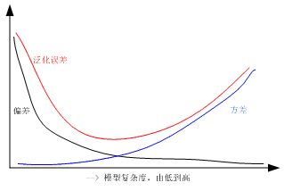

从上图可以看出，随着训练程度加深，模型复杂度会增加，偏差减少，方差增大，而泛化误差呈现U型变化，对于一个“好的系统”通常要求误差小，正则化的作用即为适当的控制模型复杂度，从而使得泛化误差曲线取最小值。

- **(2)正则化等价于带约束的目标函数中的约束项**

以平方误差损失函数和L2范数为例，优化问题的数学模型如下：
$$
\begin{aligned}
J(\theta)=\sum_{i=1}^n(y_i-\theta^Tx_i)^2\\
s.t.\quad ||\theta||^2_2\leq C
\end{aligned}
$$
针对上述带约束条件的优化问题，采用拉格朗日乘积算子法可以转化为无约束优化问题，即
$$
J(\theta)=\sum_{i=1}^n(y_i-w^Tx_i)^2+\lambda(||\theta||_2^2-C)
$$
由于参数C为常数，可以忽略，故上述公式和标准的正则化共识完全一致。

- **(3) 从贝叶斯角度考虑，正则项等价于引入参数的模型先验概率，可以简单理解为对最大似然估计引入先验概率，从而转化为最大后验估计，其中的先验概率即对于正则项**

这部分内容后面详细讲解。

## 机器学习正则化技术基本概念

正则化也可以称为规则化、权重衰减技术，不同的领域叫法不一样，数学上常称为范数，例如L1和L2范数，统计学领域叫做惩罚项、罚因子，以信号降噪为例：
$$
x(i)^*=\text{arg }\mathop{\text{min}}_{x(i)}\{F(x(i))=\frac{1}{2}||y(i)-x(i)||_2^2+\lambda R(x(i))\}
$$
其中，x(i)既可以是原始信号，也可以是小波或者傅立叶变换等的系数， R(x(i))是罚函数(范数罚)，λ是正则项(惩罚项)， y(i)是传感器采集到的含噪信号，I={0,...,n-1}，N为信号点数，x(i)*为降噪后输出，上述公式中的正则化技术作用和机器学习中的完全一样。

下面给出范数的数学公式，方便后面分析：

(1) P范数：
$$
Lp = (\sum_{i=1}^n \left| x_i \right|^p)^{\frac{1}{p}}
$$
(2) L0范数：0范数表示向量中非零元素的个数（即为其稀疏度）

(3) L1范数：即向量元素绝对值之和，p范数取1则为1范数
$$
\left| x \right|_1 = \sum_{i = 1}^n \left| {x_i } \right|
$$
(4) L2范数：即向量元素绝对值的平方和再开方，也称为欧几里得距离, \[ p \]  范数取2则为2范数
$$
\left| x \right|_2 = \sqrt {\sum_{i = 1}^n {\left| {x_i } \right|^2 } } 
$$
(5) ∞范数: 即所有向量元素绝对值中的最大值，p范数取∞则为∞范数
$$
\left| x \right|_\infty = \mathop {\max }_i \left| {x_i } \right| 
$$
(6) -∞范数：即所有向量元素绝对值中的最小值，p范数取-∞，则为-∞范数
$$
\left| x \right|_{ - \infty } = \mathop {\min }\limits_i \left| {x_i } \right|
$$
假设向量长度为2维，则有下列图形：

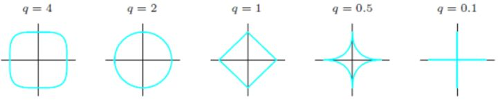

假设向量长度为3维，则有下列图形：


从上述各图可以看出：q(p)越小，曲线越贴近坐标轴，q(p)越大，曲线越远离坐标轴，并且棱角越明显，当q(p)取0时候，是完全和坐标轴贴合，当q(p)取∞时候，呈现正方体形状。同时也可以看出，采用不同的范数作为正则项，会得到完全不同的算法模型结果，故而对于不同要求的模型，应该采用不同的范数作为正则项。

可从带约束条件的优化求解和最大后验概率两种思路来推导L1、L2正则化，下面将予以详细分析。

## 正则化对应约束条件的最优化

对于模型权重系数w求解是通过最小化目标函数实现的，即求解：
$$
\begin{aligned}
\mathop{\text{min}}_w\ J(w;X,y)\\
s.t.\ ||w||_0\leq C
\end{aligned}
$$
L0范数表示向量中非零元素的个数。但由于该问题是一个NP问题，不易求解，为此我们需要稍微“放松”一下约束条件。为了达到近似效果，我们不严格要求某些权重w为0，而是要求权重应接近与0，即尽量小。从而可用L1、L2范数来近似L0范数，即：
$$
\begin{aligned}
\mathop{\text{min}}_w\ J(w;X,y)\\
s.t.\ ||w||_1\leq C
\end{aligned}
$$
或者
$$
\begin{aligned}
\mathop{\text{min}}_w\ J(w;X,y)\\
s.t.\ ||w||_2\leq C
\end{aligned}
$$
使用L2范数时，为方便后续处理，可对||w||_2进行平方，此时只需调整C的取值即可。利用拉格朗日算子法，我们可将上述带约束条件的最优化问题转换为不带约束项的优化问题，构造拉格朗日函数：
$$
\begin{aligned}
&L(w,\alpha)=J(w;X,y)+\alpha(||w||_1-C)\text{或}\\
&L(w,\alpha)=J(w;X,y)+\alpha(||w||_2^2-C)
\end{aligned}
$$
其中α>0，我们假设α的最优解为α\*，则对拉格朗日函数求最小化等价于：
$$
\begin{aligned}
&\mathop{\text{min}}_w\ J(w;X,y)+\alpha^*||w||_1\text{或}\\
&\mathop{\text{min}}_w\ J(w;X,y)+\alpha^*||w||_2^2
\end{aligned}
$$
为什么上式可以把C省略掉呢？是因为之所以α没有求出最优解α\*之前不能省略C，是因为C是随着α变化的，但是当最优的α\*一旦知道，那么C就是不变的了，那C就是常数了，那自然就在最小化时可以省略了。

可以看出，上式与
$$
\tilde{J}(w;X,y)=J(w;X,y)+\alpha\Omega(w)
$$
等价。

因此，我们得到对L1、L2正则化的第一种理解：

- L1正则化等价于在原优化目标函数中增加约束条件
  $
  ||w||_1\leq C   
  $

- L2正则化等价于在原优化目标函数中增加约束条件
  $
  ||w||_2^2\leq C
  $


下面将从直观分析和理论推导两个角度来说明L1、L2正则化的效果。

### L2正则化直观理解

考虑带约束条件的优化解释，对L2正则化为：
$$
\begin{aligned}
\mathop{\text{min}}_w\ J(w;X,y)\\
s.t.\ ||w||_2\leq C
\end{aligned}
$$
该问题的求解示意图如下所示：

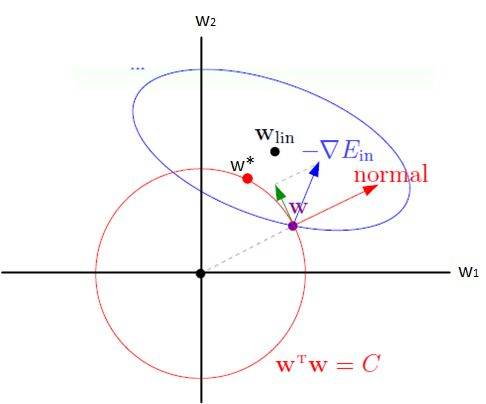

图中椭圆为原目标函数 J(w)的一条等高线，圆为半径$\sqrt{C}$的L2范数球。由于约束条件的限制，w必须位于L2范数球内。考虑边界上的一点w，图中蓝色箭头为J(w)在该处的梯度方向▽J(w)，红色箭头为L2范数球在该处的法线方向。由于w不能离开边界（否则违反约束条件），因而在使用梯度下降法更新w时，只能朝▽J(w)在范数球上w处的切线方向更新，即图中绿色箭头的方向。如此  将沿着边界移动，当▽J(w)与范数球上w处的法线平行时，此时▽J(w)在切线方向的分量为0，w将无法继续移动，从而达到最优解w\*（图中红色点所示）。

上面所说的，其实就是不等式约束的优化，即KKT条件。我们还应当要注意到，就是这个约束中的C并不是个常数，而是变化的，最终是选择一个使得损失函数最小的C。


C是不断变化的，假设当C取上图中的绿点的位置时，整个损失函数能取到最小值。也就是C取下图所示的值：


这个C的最终位置，其实还是取决于正则项的超参数λ。

### L1正则化直观理解

对于L1正则化：
$$
\begin{aligned}
\mathop{\text{min}}_w\ J(w;X,y)\\
s.t.\ ||w||_1\leq C
\end{aligned}
$$
同理，其求解示意图如下所示：

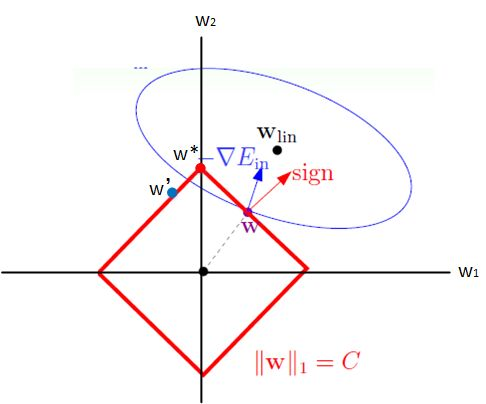

其主要差别在于L1、L2范数球的形状差异。由于此时每条边界上w的切线和法线方向保持不变，在图中w将一直朝着▽J(w)在切线方向的分量沿着边界向左上移动。当w跨过顶点到达w'时，▽J(w)在切线方向的分量变为右上方，因而w将朝右上方移动。最终，w将稳定在顶点处，达到最优解w\*。此时，可以看到w1=0，这也就是采用L1范数会使产生稀疏性的原因。  

以上分析虽是基于二维的情况，但不难将其推广到多维情况，其主要目的是为了直观地说明L1、L2正则化最优解的差异，以及L1范数为什么为产生稀疏性。

同上面L2正则化一样，上面所说的，其实就是不等式约束的优化，即KKT条件。我们还应当要注意到，就是这个约束中的C并不是个常数，而是变化的，最终是选择一个使得损失函数最小的C。

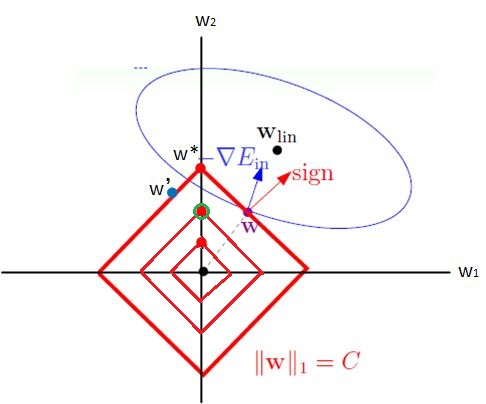

C是不断变化的，假设当C取上图中的绿点的位置时，整个损失函数能取到最小值。也就是C取下图所示的值：


这个C的最终位置，其实还是取决于正则项的超参数λ。

[从局部泰勒展开说说L1和L2正则化](https://zhuanlan.zhihu.com/p/26895929)

### L1与L2解的稀疏性

介绍完 L1 和 L2 正则化的物理解释和数学推导之后，我们再来看看它们解的分布性。


以二维情况讨论，上图左边是L2正则化，右边是L1正则化。从另一个方面来看，满足正则化条件，实际上是求解蓝色区域与黄色区域的交点，即同时满足限定条件和J(w)最小化。对于L2来说，限定区域是圆，这样，得到的解w1或w2为0的概率很小，很大概率是非零的。

对于L1来说，限定区域是正方形，方形与蓝色区域相交的交点是顶点的概率很大，这从视觉和常识上来看是很容易理解的。也就是说，方形的凸点会更接近J(w)最优解对应的w*位置，而凸点处必有w1或w2为0。这样，得到的解w1或w2为零的概率就很大了。所以，L1正则化的解具有稀疏性。

扩展到高维，同样的道理，L2的限定区域是平滑的，与中心点等距；而L1的限定区域是包含凸点的，尖锐的。这些凸点更接近J(w)的最优解位置，而在这些凸点上，很多wj为0。

---

关于L1更容易得到稀疏解的原因，有一个很棒的解释，请见下面的链接：

我们可以想象一下L0问题：正则化项非0参数，优化这个直接等于求稀疏解。当然这是一个组合优化问题。

L1 norm是包含L0的最小凸区域，也就是说我们既可以用凸优化来求解，同时它也保持了一定程度L0的稀疏性质。即L1是L0的近似。

而L2 norm的正则化有closed form解，但是相对来说距离L0就更远了一些。

（L2正则化的解相当于先对数据做主成分分析，然后对最后的回归系数分解在数据的主成分上，然后各自缩小，其中对于小的回归系数采取比较大的惩罚值）

---

或者比较直观的解释为：

假设费用函数L与某个参数x的关系如图所示：

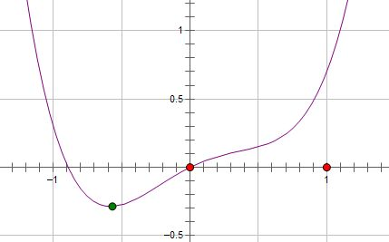

则最优的x在绿点处，x非零。

现在施加L2 regularization，新的费用函数（L+Cx^2）如图中蓝线所示：

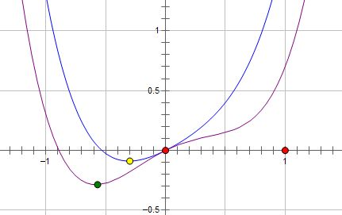

最优的x在黄点处，x的绝对值减小了，但依然非零。 而如果施加L1 regularization，则新的费用函数（L+C|x|）如图中粉线所示：

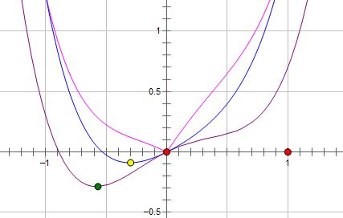

最优的x就变成了0。这里利用的就是绝对值函数的尖峰。两种regularization能不能把最优的x变成0，取决于原先的费用函数在0点处的导数。
如果本来导数不为0，那么施加L2 regularization后导数依然不为0，最优的x也不会变成0。
而施加L1 regularization时，只要regularization项的系数C大于原先费用函数在0点处的导数的绝对值，x = 0就会变成一个极小值点。上面只分析了一个参数x。事实上L1 regularization会使得许多参数的最优值变成0，这样模型就稀疏了。

### 正则化参数 λ

正则化是结构风险最小化的一种策略实现，能够有效降低过拟合。损失函数实际上包含了两个方面：一个是训练样本误差。一个是正则化项。其中，参数 λ 起到了权衡的作用。

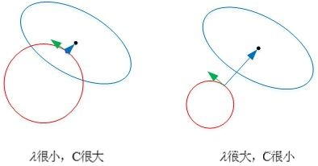

以L2为例，若λ很小，对应上文中的C值就很大。这时候，圆形区域很大，能够让w更接近J(w)最优解的位置。若λ近似为0，相当于圆形区域覆盖了最优解位置，这时候，正则化失效，容易造成过拟合。相反，若λ很大，对应上文中的C值就很小。这时候，圆形区域很小，w离J(w)最优解的位置较远。w被限制在一个很小的区域内变化，w普遍较小且接近0，起到了正则化的效果。但是，λ过大容易造成欠拟合。欠拟合和过拟合是两种对立的状态。

### L2正则化理论分析

PRML里的图虽然直观易懂但是却让人觉得缺乏实际的理论依据，最近看了[Deep Learning](www.deeplearningbook.org/)这本书发现里面L1和L2效果的推导十分有趣，结合自己的一些想法跟大家分享一下。

假设原目标函数 J(w)的最优解为w\*，并假设其为二阶可导，将J(w)在w\*处进行二阶泰勒展开有：
$$
\hat{J}(w)=J(w^*)+\frac{1}{2}(w-w^*)^TH(w-w^*)
$$
式中H为J(w)在w\*处的Hessian矩阵，注意w\*为J(w)的最优解，其一阶导数为0，因而式中无一阶导数项。$\hat{J}(w)$取得最小值时有：
$$
\bigtriangledown _w\hat{J}(w)=H(w-w^*)=0
$$
由于**L2正则化**的目标函数为在J(w)中添加
$$
\Omega(w)=\frac{1}{2}\alpha||w||_2^2=\frac{1}{2}\alpha w^Tw
$$
即
$$
\tilde{J}(w)=\tilde{J}(w)+\Omega(w)=J(w^*)+\frac{1}{2}(w-w^*)^TH(w-w^*)+\frac{1}{2}\alpha w^Tw
$$
，对上式求导，有：
$$
\bigtriangledown _w\tilde{J}(w)=\bigtriangledown _w\hat{J}(w)+\bigtriangledown _w\Omega(w)=H(w-w^*)+\alpha w
$$
设其最优解为$\tilde{w}$，则有：
$$
\begin{aligned}
H(\tilde{w}-w^*)+\alpha\tilde{w}=0\\
\tilde{w}=(H+\alpha I)^{-1}Hw^*
\end{aligned}
$$
由于H是对称矩阵，可对其做特征值分解，即
$$
H=Q\Lambda Q^T
$$
，其中Q为正交矩阵，且每一列为H的特征向量，带入上式有：
$$
\tilde{w}=(Q\Lambda Q^T+\alpha I)^{-1}Q\Lambda Q^Tw^*=[Q(\Lambda +\alpha I)Q^T]^{-1}Q\Lambda Q^Tw^*=Q(\Lambda+\alpha I)^{-1}\Lambda Q^T Hw^*
$$
∧为对角矩阵，且对角线元素为H的特征值λj。

w\*可在Q为正交基上作线性展开，由上式可知**$\tilde{w}$为w\*在H的每个特征向量上的分量以**
$$
\frac{\lambda_j}{\lambda_j+\alpha}
$$
**比例放缩得到**。若λj>>α，则$w_j^*$受正则化的影响较小；若λj<<α，则$w_j^*$受正则化的影响较大，将收缩到接近于0的值。同时，若$w_j^*\neq0$，则$\tilde{w}_j\neq0$，因而L2正则化不会产生稀疏性的效果。

也就是说：

L2正则化中，H的特征值较大的特征根对应的w分量受到的缩放较小，而特征值较小的特征根方向的w受到的缩放较大。对应到基于梯度的训练中来即，对整体函数减小贡献较大的w分量受到的scale较小，而那些很平缓的方向分量受到了较大的缩放。如图所示效果


图中实线为未正则化的曲线，虚线圆为L2正则化的圆。w\*为原始的未正则化的极小值，$\hat{w}$为正则化后的极小值。可以看到因为在水平w1方向函数变化较缓慢(等值线稀疏)，所以w1方向值受缩放较大，而相应的w2方向则受缩放较小。

同时我们观察到如果H是正定的，那么如果w不为0则正则化后的$\hat{w}$也不会为零。所以得到我们的结论

**L2正则化会使w缩小，缩小的倍数与Hessian矩阵的特征值有关，但是不会使得w变为0**

多说一句：L2正则化是神经网络训练中最常使用的正则化手段，观察单一一步的梯度更新有：
$$
w\leftarrow=w-\epsilon(\alpha w+\bigtriangledown_wJ(w;X,y))=(1-\epsilon \alpha)w-\epsilon\bigtriangledown_wJ(w;X,y)
$$
即每一步先对w进行了一个缩放再进行原始的梯度更新，这就是我们在训练时常需要设置的**weight decay**。

### L1正则化理论分析

对于**L1的正则化**，只需将Ω(w)替换为w的L1范数，同理可以得到：
$$
\tilde{J}(w)=\tilde{J}(w)+\Omega(w)=J(w^*)+\frac{1}{2}(w-w^*)^TH(w-w^*)+\alpha ||w||_1
$$
对上式求导，有
$$
\bigtriangledown _w\tilde{J}(w)=\bigtriangledown _w\hat{J}(w)+\bigtriangledown _w\Omega(w)=H(w-w^*)+\alpha \ \text{sign}(w)
$$
其最优解满足：
$$
H(\tilde{w}-w^*)+\alpha\text{sign}(\tilde{w})=0
$$
这里我们没有L2正则化时那么方便的求解了，可以看到是和w的符号有关的。为了简化讨论，我们做出进一步假设：Hessian矩阵H是对角矩阵，即
$$
H=diag[H_{11},H_{22},...,H_{nn}]
$$
，Hjj>0。这意味着此时w的不同分量之间没有相关性，该假设可通过对输入特征进行预处理（例如使用PCA）得到，现在我们可以解上式了，此时$\tilde{w}$的解为：
$$
\tilde{w}_j=\text{sign}(w_j^*)\ \text{max}\left\{ |w_j^*|-\frac{\alpha}{H_{jj}} \ ,0\right\}
$$
我们很容易得出结果：

* 当
  $
  |w^*_j|\leq\frac{\alpha}{H_{jj}}
  $
  时，可知$\tilde{w}_j=0$，因而L1正则化会使最优解的某些元素为0，从而产生稀疏性；

* 当
  $
  |w^*_j|>\frac{\alpha}{H_{jj}}
  $
  时，$\tilde{w}_j\neq 0$，$\tilde{w}_j$会在原有最优解上朝着0的方向平移了一个常数值
  $
  \frac{\alpha}{H_{jj}}
  $


这就是L1正则化的效果。

**L1正则化会使得一些w分量变为0，此时该分量对应的特征便不再有效了，造成的结果是特征空间的稀疏性。所以L1有的时候会被用来做特征选择。**

### 约束最优化观点总结

综上，

* L2是控制所有特征的权重，“简单的模型”，相当于在“复杂模型”的基础上人工地筛选掉一些特征，人工筛选的质量一般可比不上L1的自动筛选。

  L2正则化的效果是对原最优解的每一个元素进行不同比例的放缩；

* L1是舍弃掉一些不重要的特征。

  L1正则化则会使原最优解的元素产生不同的偏移，并使某些元素为0，从而产生稀疏性。

在传统线性模型中带L2正则化的线性回归通常叫做Ridge regression，而带L1正则化的则叫做LASSO。

一种通用的建议是，如果我们确定有的特征是冗余不必要的，要做特征选择，则使用L1正则化，否则一般用L2正则化。

## 贝叶斯观点：正则化对应模型先验概率

李航《统计学习方法》书中1.5节正则化与交叉验证中提到一句：

**从贝叶斯的角度来看，正则化项对应于模型的先验概率**

更详细的解释：

> **从贝叶斯的角度来看，正则化等价于对模型参数引入先验分布。**

### Linear Regression

我们先看下最原始的Linear Regression：

**Bayesian Regression and Graphical model**

The regression model:
$$
y = Xw + \epsilon
$$
can be see as the following model:
$$
p(y|X,w,\lambda)=N(Xw,\lambda)\ \ \ \ \text{with} \ \ p(\epsilon)=N(0,\lambda)
$$

$$
\begin{aligned}
p(\epsilon^{(i)})&=\frac{1}{\sqrt{2\pi}\delta}\text{exp}\left( -\frac{(\epsilon^{(i)})^2}{2\sigma^2}\right)\\
\Rightarrow p(y^{(i)}|x^{(i)};\theta)&=\frac{1}{\sqrt{2\pi}\delta}\text{exp}\left( -\frac{(y^{(i)}-w^Tx^{(i)})^2}{2\sigma^2}\right)
\end{aligned}
$$
由最大似然估计(MLE)：
$$
\begin{aligned}
L(w)&=p(\vec{y}|X;w)\\
&=\prod_{i=1}^{m}p(y^{(i)}|x^{(i)};\theta)\\
&=\prod_{i=1}^{m}\frac{1}{\sqrt{2\pi}\delta}\text{exp}\left( -\frac{(y^{(i)}-w^Tx^{(i)})^2}{2\sigma^2}\right)
\end{aligned}
$$
取对数：
$$
\begin{aligned}
l(w)&=\text{log}\ L(w)\\
&=\text{log}\ \prod_{i=1}^{m}\frac{1}{\sqrt{2\pi}\delta}\text{exp}\left( -\frac{(y^{(i)}-w^Tx^{(i)})^2}{2\sigma^2}\right)\\
&=\sum^m_{i=1}\text{log}\ \frac{1}{\sqrt{2\pi}\delta}\text{exp}\left( -\frac{(y^{(i)}-w^Tx^{(i)})^2}{2\sigma^2}\right)\\
&=m\ \text{log}\ \frac{1}{\sqrt{2\pi}\sigma}-\frac{1}{\sigma^2}\cdot \frac{1}{2}\sum_{i=1}^m\left( y^{(i)}-w^Tx^{(i)} \right)^2
\end{aligned}
$$
求对数似然的最大值，即求下式的最小值，同时最大似然估计的w参数为：
$$
w_{\text{MLE}}=\text{arg }\mathop{\text{min}}_w\frac{1}{2}\sum_{i=1}^m\left( y^{(i)}-w^Tx^{(i)} \right)^2
$$
这就导出了我们原始的least-squares损失函数，但是，但是，这是在我们对参数w没有加入任何**先验分布**的情况下。在数据维度很高的情况下，我们的模型参数很多，模型复杂度高，容易发生过拟合。

比如我们经常说的“少数据样本点n，高数据维度p”。当数据维度p远大于样本点个数n的时候，不做任何其他假设或限制的话，学习问题基本上是没法进行的。因为如果用上所有维度的话，维度越大，通常会导致模型越复杂，但是反过来样本点又很少，于是就会出现很严重的overfitting问题。

**”数据样本点数目p>数据维度n“问题以及维度选择 **

- p≈10000并且n<100。一个典型的“少数据样本点n，高数据维度p”问题(West et al. 2001)。

在这个时候，我们可以对参数w引入**先验分布**，降低模型复杂度。

### Ridge Regression

> **我们对参数w引入协方差为α的零均值高斯先验。**

$$
\begin{aligned}
L(w)&=p(\vec{y}|X;w)p(w)\\
&=\prod_{i=1}^{m}p(y^{(i)}|x^{(i)};\theta)p(w)\\
&=\prod_{i=1}^{m}\frac{1}{\sqrt{2\pi}\delta}\text{exp}\left( -\frac{(y^{(i)}-w^Tx^{(i)})^2}{2\sigma^2}\right)\prod_{j=1}^{n}\frac{1}{\sqrt{2\pi\alpha}}\text{exp}\left( -\frac{(w^{(i)})^2}{2\alpha}\right)\\
&=\prod_{i=1}^{m}\frac{1}{\sqrt{2\pi}\delta}\text{exp}\left( -\frac{(y^{(i)}-w^Tx^{(i)})^2}{2\sigma^2}\right)\frac{1}{(\sqrt{2\pi\alpha})^n}\text{exp}\left( -\frac{w^Tw}{2\alpha}\right)\\
\end{aligned}
$$

取对数：
$$
\begin{aligned}
l(w)&=\text{log} L(w)\\
&=m\ \text{log} \frac{1}{\sqrt{2\pi}\delta} + n\ \text{log}\frac{1}{\sqrt{2\pi\alpha}}-\frac{1}{\sigma^2}\cdot \frac{1}{2}\sum_{i=1}^m(y^{(i)}-w^Tx^{(i)})^2-\frac{1}{\alpha}\cdot \frac{1}{2}w^Tw\\
\Rightarrow w_{\text{MAP}_{\text{Laplace}}}&=\text{arg }\mathop{\text{min}}_w\left( \frac{1}{\sigma^2}\cdot \frac{1}{2}\sum_{i=1}^m(y^{(i)}-w^Tx^{(i)})^2+\frac{1}{\alpha}\cdot \frac{1}{2}w^Tw \right)
\end{aligned}
$$
等价于：
$$
J_R(w)=\frac{1}{n}\left \| y-w^TX \right \|_2 + \lambda\left \|w  \right \|_2
$$
这不就是Ridge Regression吗？


看我们得到的参数，在零附近是不是很密集，老实说，ridge regression并不具有产生**稀疏解**的能力，也就是说参数并不会真出现很多零。假设我们的预测结果与两个特征相关，L2正则倾向于综合两者的影响，给影响大的特征赋予**高的权重**；而L1正则倾向于选择影响较大的参数，而舍弃掉影响较小的那个。实际应用中L2正则表现往往会优于L1正则，但L1正则会大大降低我们的**计算量**。

> Typically ridge or ℓ2 penalties are **much better** for minimizing prediction error rather than ℓ1 penalties. The reason for this is that when two predictors are highly correlated, ℓ1 regularizer will simply pick one of the two predictors. In contrast, the ℓ2 regularizer will keep both of them and jointly shrink the corresponding coefficients a little bit. Thus, while the ℓ1 penalty can certainly reduce overfitting, you may also experience a loss in predictive power.

那现在我们知道了，对模型的参数引入零均值的**高斯先验**等价于L2正则化。

假设损失函数在二维上求解，则可以画出图像

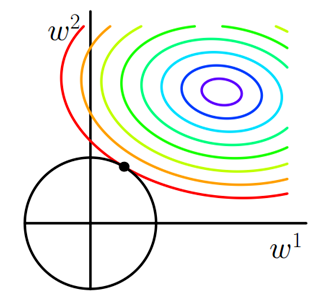

彩色实线是J0（不带罚函数的损失函数）的等值线，黑色实线是L2正则的等值线。二维空间（权重向量只有w1和w2）上，L2正则项的等值线是圆，与J0的等值线相交时w1或w2等于零的概率很小。所以**使用L2正则项的解不具有稀疏性**。在求解过程中，L2通常倾向让权值尽可能小，最后构造一个所有参数都比较小的模型。因为一般认为参数值小的模型比较简单，能适应不同的数据集，也在一定程度上避免了过拟合现象。参数足够小，数据偏移得多一点也不会对结果造成什么影响，可以说“抗扰动能力强”。

### Lasso Regression

上面我们对模型的参数w引入了高斯分布，那么**拉普拉斯分布**(Laplace distribution)呢？

注：LASSO是least absolute shrinkage and selection operator的简写。

**L1正则罚项（LASSO）等价于权重w的拉普拉斯先验**：
$$
w\sim C\text{ e}^{-\lambda|w|}
$$
我们看下拉普拉斯分布长啥样：
$$
f(x|\mu,b)=\frac{1}{2b}\text{exp}\left(-\frac{|x-\mu|}{b}\right)
$$
其中，其中，μ 是位置参数，b 是尺度参数。

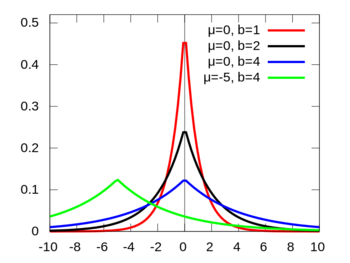

关于拉普拉斯和正态分布的渊源，大家可以参见正态分布的前世今生。
重复之前的推导过程我们很容易得到：
$$
w_{\text{MAP}_{\text{Laplace}}}=\text{arg }\mathop{\text{min}}_w\left( \frac{1}{\sigma^2}\cdot \frac{1}{2}\sum_{i=1}^m(y^{(i)}-w^Tx^{(i)})^2+\frac{1}{b}\left \| w \right \|_1 \right)
$$

> **我们对参数w引入尺度参数为b的零均值拉普拉斯先验。**

$$
\begin{aligned}
L(w)&=p(\vec{y}|X;w)p(w)\\
&=\prod_{i=1}^{m}p(y^{(i)}|x^{(i)};\theta)p(w)\\
&=\prod_{i=1}^{m}\frac{1}{\sqrt{2\pi}\delta}\text{exp}\left( -\frac{(y^{(i)}-w^Tx^{(i)})^2}{2\sigma^2}\right)\prod_{j=1}^{n}\frac{1}{2b}\text{exp}\left(-\frac{|w^{(j)}|}{b}\right)\\
&=\prod_{i=1}^{m}\frac{1}{\sqrt{2\pi}\delta}\text{exp}\left( -\frac{(y^{(i)}-w^Tx^{(i)})^2}{2\sigma^2}\right)\frac{1}{(2b)^n}\text{exp}\left(-\frac{\left \|w  \right \|_1}{b}\right)\\
\end{aligned}
$$

取对数：
$$
\begin{aligned}
l(w)&=\text{log} L(w)\\
&=m\ \text{log} \frac{1}{\sqrt{2\pi}\delta} + n\ \text{log}\frac{1}{2b}-\frac{1}{\sigma^2}\cdot \frac{1}{2}\sum_{i=1}^m(y^{(i)}-w^Tx^{(i)})^2-\frac{1}{b}\left \| w \right \|_1\\
\Rightarrow w_{\text{MAP}_{\text{Laplace}}}&=\text{arg }\mathop{\text{min}}_w\left( \frac{1}{\sigma^2}\cdot \frac{1}{2}\sum_{i=1}^m(y^{(i)}-w^Tx^{(i)})^2+\frac{1}{b}\left \| w \right \|_1 \right)
\end{aligned}
$$
等价于：
$$
J_R(w)=\frac{1}{n}\left \| y-w^TX \right \|_2 + \lambda\left \|w  \right \|_1
$$
这不就是Lasso Regression吗？

该问题通常被称为 LASSO (least absolute shrinkage and selection operator) 。LASSO 仍然是一个 convex optimization 问题，不具有解析解。它的优良性质是能产生**稀疏性**，导致 w 中许多项变成零。

> 再次总结下，对参数引入**拉普拉斯先验**等价于 L1正则化。

假设损失函数在二维上求解，则可以画出图像


彩色实线是J0（不带罚函数的损失函数）的等值线，黑色实线是L1正则的等值线。二维空间（权重向量只有w1和w2）上，L1正则项的等值线是方形，方形与J0的等值线相交时相交点为顶点的概率很大，所以w1或w2等于零的概率很大。所以**使用L1正则项的解具有稀疏性**。

推广到更大维度空间也是同样道理，L2正则项的等值线或等值面是比较平滑的，而L1正则项的等值线或等值面是比较尖锐的，所以这些突出的点与J0（不带罚函数的损失函数）接触的机会更大，而在这些突出的点上，会有很多权值等于0，所以，L1norm可以看成是L0norm的近似。

由L1正则化导出的稀疏性质已被广泛用于**特征选择**，特征选择可以从可用的特征子集中选择有意义的特征。

### Elastic Net Regression

可能有同学会想，既然L1和L2正则各自都有自己的优势，那我们能不能将他们结合起来？

可以，事实上，大牛早就这么玩过了。

**Elastic Net回归是权重w的综合先验**

同时将L1和L2正则作为罚项，等价于对权重w设置更综合的先验：
$$
w\sim C(\lambda,\alpha)\text{exp}^{-(\lambda|w|_1+\alpha|w|_2)}
$$
因为lasso在解决之前提到的“small n(样本), large p(特征) problem”存在一定缺陷。

> **The limitation of the lasso**
>
> - If p>n, the lasso selects at most n variables. The number of selected genes is bounded by the number of samples.
> - Grouped variables: the lasso fails to do grouped selection. It tends to select one variable from a group and ignore the others.

重复之前的推导过程我们很容易得到：
$$
\hat{\beta}=\text{arg }\mathop{\text{min}}_{\beta}||y-X\beta||_2+\lambda_2||\beta||_2+\lambda_1||\beta_1||_1
$$

- 罚项中的L1会产生一个稀疏模型
- 罚项中的L2
  - 解除了对所选变量的数目限制
  - 鼓励促进组效应（grouping effect）

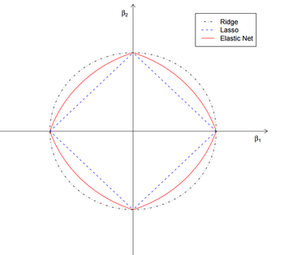

### 贝叶斯观点正则化总结

正则化参数等价于对参数引入**先验分布**，使得**模型复杂度**变小（缩小解空间），对于噪声以及异常值的鲁棒性（泛化能力）增强。整个最优化问题从贝叶斯观点来看是一种贝叶斯最大后验估计，其中正则化项对应后验估计中的**先验信息**，损失函数对应后验估计中的似然函数，两者的乘积即对应贝叶斯最大后验估计的形式。

这篇文章[《Lazy Sparse Stochastic Gradient Descent for Regularized Mutlinomial Logistic Regression》](http://citeseerx.ist.psu.edu/viewdoc/download;jsessionid=BFEF7AF6F95524A8DD0B8BBA565D4EDD?doi=10.1.1.177.3514&rep=rep1&type=pdf)还讲了线性回归正则化和数据先验分布的关系的理论推导到算法实现，除了高斯先验、拉普拉斯先验，还讲了其他先验。

## L1和L2正则化的异同

**1. L2 regularizer** ：使得模型的解偏向于norm较小的W，通过限制W的norm的大小实现了对模型空间的限制，从而在一定程度上避免了overfitting 。不过ridge regression并不具有产生稀疏解的能力，得到的系数仍然需要数据中的所有特征才能计算预测结果，从计算量上来说并没有得到改观。
**2. L1 regularizer** ： 它的优良性质是能产生稀疏性，导致W中许多项变成零。 稀疏的解除了计算量上的好处之外，更重要的是更具有“可解释性”。

这两种方法的**共同点**在于，将**解释变量的系数**加入到Cost Function中，并对其进行最小化，本质上是**对过多的参数实施了惩罚**。

而两种方法的**区别**在于**惩罚函数不同**。但这种微小的区别却使LASSO有很多优良的特质（可以同时选择和缩减参数）。

**岭回归的一个缺点**：在建模时，同时引入p个预测变量，罚约束项可以收缩这些预测变量的待估系数**接近0**,但并非恰好是0（除非lambda为无穷大）。这个缺点对于模型精度影响不大，但给模型的解释造成了困难。这个缺点可以由lasso来克服。(所以岭回归虽然减少了模型的复杂度，并没有真正解决变量选择的问题) 。

可以看到，L1-ball与L2-ball的不同就在于L1在和每个坐标轴相交的地方都有“角”出现，而目标函数的等高线除非位置摆得非常好，大部分时候都会在角的地方相交。注意到在角的位置就会产生稀疏性，例如图中的相交点就有w1=0，而更高维的时候（想象一下三维的L1-ball 是什么样的？）除了角点以外，还有很多边的轮廓也是既有很大的概率成为第一次相交的地方，又会产生稀疏性。

 L2正则项作用是限制权重W过大，且使得权重W分布均匀。而L1正则项倾向于得到离散的W，各W之间差距较大。

## 正则化技术总结

本文从各个角度深入的分析了机器学习算法中使用到的正则化技术，正则化技术是机器学习和深度学习中非常重要的内容，不管是在面试、笔试还是实际应用中都至关重要，通过本文您应该知道以下重要结论：

- **正则化的作用是防止过拟合、提高模型泛化能力**
- **正则化等价于结构风险最小化**
- **正则化等价于带约束的目标函数中的约束项**
- **正则项等价于引入参数的模型先验概率**
- **在误差符合均值为0的高斯分布，则最大似然估计和最小二乘法等价**
- **最大后验估计就是在最大似然估计函数上面乘上了一项先验分布而已**
- **L2范数相当于给模型参数θ设置一个零均值高斯先验分布，L1范数相当于给模型参数θ设置一个拉普拉斯先验分布**
- **L0和L1正则可以得到稀疏解，而L2不能，并且参数优化速度L1快于L2，但是L2更容易理解，计算更方便。**


# 模型评估方法

通常，我们可通过实验测试来对学习器的泛化误差进行评估并进而做出选择。为此，需使用一个"测试集"来测试学习器对新样本的判别能力，然后以测试集上的"测试误差"作为泛化误差的近似。通常我们假设测试样本也是从样本真实分布中独立同分布采样而得。但需注意的是，测试集应该尽可能与训练集互斥，即测试样本尽量不在训练集中出现、未在训练过程中使用过。

测试样本为什么要尽可能不出现在训练集中呢？为理解这一点，不妨考虑这样一个场景：老师出了10道习题供同学们练习，考试时老师又用同样的这10道题作为试题，这个考试成绩能否有效反映出同学们学得好不好呢？答案是否定的，可能有的同学只会做这10道题却能得高分。回到我们的问题上来，我们希望得到泛化性能强的模型，好比是希望同学们对课程学得很好、获得了对所学知识"举一反三"的能力；训练样本相当于给同学们练习的习题，测试过程则相当于考试。显然，若测试样本被用作训练了，则得到的将是过于"乐观"的估计结果。

可是，我们只有一个包含m个样例的数据集D = \{ (x1, y1),  (x2, y2), ... ,  (xm, ym) \}，既要训练，又要测试，怎样才能做到呢？答案是：**通过对D进行适当的处理，从中产生出训练集S和测试集T**。下面介绍几种常见的做法。

## 留出法

"留出法"（hold-out）直接将数据集D划分为两个互斥的集合，其中一个集合作为训练集S，另一个作为测试集T，即D=S∪T，S∩T=Ø。在S上训练出模型后，用T来评估其测试误差，作为对泛化误差的估计。

以二分类任务为例，假定D包含1000个样本，将其划分为S包含700个样本，T包含300个样本，用S进行训练后，如果模型在T上有90个样本分类错误，那么其错误率为(90/300) x 100% = 30%，相应的，精度为1- 30% = 70%。

需注意的是，训练/测试集的划分要尽可能保持数据分布的一致性，避免因数据划分过程引入额外的偏差而对最终结果产生影响，例如在分类任务中至少要保持样本的类别比例相似。如果从采样 的角度来看待数据集的划分过程，则保留类别比例的采样方式通常称为"**分层采样**" (stratified sampling).。例如通过对D进行分层采样而获得含70%样本的训练集S和含30%样本的测试集T，若D包含500个正例、500个反例，则分层采样得到的S应包含350个正例、350个反例，而T则包含150个正例和150个反例；若S、T中样本类别比例差别很大，则误差估计将由于训练/测试数据分布的差异而产生偏差。

另一个需注意的问题是，即使在给定训练/测试集的样本比例后，仍存在多种划分方式对初始数据集D进行分割。例如在上面的例子中，可以把D中的样本排序，然后把前350个正例放到训练集中，也可以把最后350个正例放到训练集中，……这些不同的划分将导致不同的训练/测试集，相应的，模型评估的结果也会有差别。因此，单次使用留出法得到的估计结果往往不够稳定可靠，在使用留出法时，一般要采用若干次随机划分、重复进行实验评估后取平均值作为留出法的评估结果。例如进行100次随机划分，每次产生一个训练/测试集用于实验评估，100次后就得到100个结果，而留出法返回的则是这100个结果的平均。

此外，我们希望评估的是用D训练出的模型的性能，但留出法需划分训练/测试集，这就会导致一个**窘境**：若令训练集S包含绝大多数样本，则训练出的模型可能更接近于用D训练出的模型，但由于T比较小，评估结果可能不够稳定准确；若令测试集T多包含一些样本，则训练集S与D差别更大了，被评估的模型与用D训练出的模型相比可能有较大差别，从而降低了评估结果的保真性。这个问题没有完美的解决方案，常见做法是将大约2/3 ~ 4/5的样本用于训练，剩余样本用于测试。

可从"偏差-方差" 的角度来理解：测试集小时，评估结果的方差较大，训练集小时，评估结果的偏差较大。一般而言，测试集至少应含30个样例[Mitchell, 1997]。

## k折交叉验证法

"交叉验证法"（cross validation）先将数据集D划分为k个大小相似的互斥子集，即D = D1 ∪ D2 ∪ ... ∪ Dk，Di ∩ Dj = Ø (i ≠ j)。每个子集Di都尽可能保持数据分布的一致性，即从D中通过分层采样得到。然后，每次用k-1个子集的并集作为训练集，余下的那个子集作为测试集；这样就可获得k组训练/测试集，从而可进行k次训练和测试，最终返回的是这k个测试结果的均值。显然，交叉验证法评估结果的稳定性和保真性在很大程度上取决于k的取值，为强调这一点，通常把交叉验证法称为"k折交叉验证"（k-fold cross validation）。k最常用的取值是10，此时称为10折交叉验证；其他常用的k值有5、20等。下图给出了10折交叉验证的示意图。

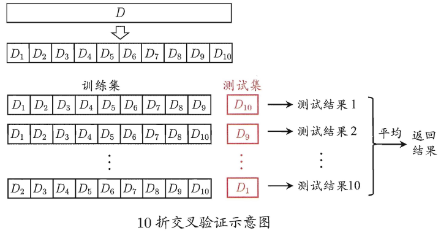

与留出法相似，将数据集D划分为k个子集同样存在多种划分方式。为减小因样本划分不同而引入的差别，k折交叉验证通常要随机使用不同的划分重复p次，最终的评估结果是这p次k折交叉验证结果的均值，例如常见的有“10次10折交叉验证”。“10次10折交又验证法”与"100次留出法"都是进行了100次训练/测试。

假定数据集D中包含m个样本，若令k=m，则得到了交叉验证法的一个特例：留一法（Leave-One-Out，简称LOO）。显然，留一法不受随机样本划分方式的影响，因为m个样本只有唯一的方式划分为m个子集一一每个子集包含一个样本；留一法使用的训练集与初始数据集相比只少了一个样本，这就使得在绝大多数情况下，留一法中被实际评估的模型与期望评估的用D训练出的模型很相似。因此，留一法的评估结果往往被认为比较准确。然而，留一法也有其缺陷：在数据集比较大时，训练m个模型的计算开销可能是难以忍受的（例如数据集包含1百万个样本，则需训练1百万个模型），而这还是在未考虑算法调参的情况下。另外，留一法的估计结果也未必永远比其他评估方法准确；"**没有免费的午餐**"定理对实验评估方法同样适用。

## Bootstrap有放回采样法

我们希望评估的是用D训练出的模型。但在留出法和交叉验证法中，由于保留了一部分样本用于测试，因此实际评估的模型所使用的训练集比D小，这必然会引入一些因训练样本规模不同而导致的估计偏差。留一法受训练样本规模变化的影响较小，但计算复杂度又太高了。有没有什么办法可以减少训练样本规模不同造成的影响，同时还能比较高效地进行实验估计呢? 

"有放回采样法"（bootstrapping）是一个比较好的解决方案，它直接以有放回采样法 (bootstrap sampling)为基础[Efron and Tibshirani, 1993]。给定包含m个样本的数据集D，我们对它进行采样产生数据集D'：每次随机从D中挑选一个样本，将其拷贝放入D'，然后再将该样本放回初始数据集D中，使得该样本在下次采样时仍有可能被采到；这个过程重复执行m次后，我们就得到了包含m个样本的数据集D’，这就是有放回采样的结果。显然，D中有一部分样本会在D'中多次出现，而另一部分样本不出现。可以做一个简单的估计，样本在m次采样中始终不被采到的概率是
$$
\mathop{\text{lim}}_{m\rightarrow \infty}\left( 1-\frac{1}{m} \right)^m\rightarrow \frac{1}{e}\approx 0.368
$$
即通过有放回采样，初始数据集D中约有36.8%的样本未出现在采样数据集D'中。于是我们可将D'用作训练集，D-D'用作测试集；这样，实际评估的模型与期望评估的模型都使用m个训练、样本，而我们仍有数据总量约1/3的、没在训练集中出现的样本用于测试。这样的测试结果，亦称"包外估计"（out-of-bag estimate）。

**有放回采样法在数据集较小、难以有效划分训练/测试集时很有用**；此外，**有放回采样法能从初始数据集中产生多个不同的训练集，这对集成学习等方法有很大的好处**。然而，有放回采样法产生的数据集**改变了初始数据集的分布，这会引入估计偏差**。因此，在初始数据量足够时，留出法和交叉验证法更常用一些。

## 调参与最终模型

大多数学习算法都有些参数需要设定，参数配置不同，学得模型的性能往往有显著差别。因此，在进行模型评估与选择时，除了要对适用学习算法进行选择，还需对算法参数进行设定，这就是通常所说的"参数调节"或简称"调参"。

读者可能马上想到，调参和算法选择没什么本质区别：对每种参数配置都训练出模型，然后把对应最好模型的参数作为结果。这样的考虑基本是正确的，但有一点需注意：学习算法的很多参数是在实数范围内取值，因此，对每种参数配置都训练出模型来是不可行的。现实中常用的做法，是对每个参数选定一个范围和变化步长，例如在[0, 0.2]范围内以0.05为步长，则实际要评估的候选参数值有5个，最终是从这5个候选值中产生选定值。显然，这样选定的参数值往往不是"最佳"值，但这是在计算开销和性能估计之间进行折中的结果，通过这个折中，学习过程才变得可行。事实上，即便在进行这样的折中后，调参往往仍很困难。可以简单估算一下：假定算法有3个参数，每个参数仅考虑5个候选值，这样对每一组训练/测试集就有5^3 = 125个模型需考察；很多强大的学习算法有大量参数需设定，这将导致极大的调参工程量，以至于在不少应用任务中， 参数调得好不好往往对最终模型性能有关键性影响。

给定包含m个样本的数据集D，在模型评估与选择过程中由于需要留出一部分数据进行评估测试，事实上我们只使用了一部分数据训练、模型。因此，在模型选择完成后，学习算法和参数配置己选定，此时应该用数据集D重新训练模型。这个模型在训练过程中使用了所有m个样本，这才是我们最终提交给用户的模型。

另外，需注意的是，我们通常把学得模型在实际使用中遇到的数据称为测试数据，为了加以区分，模型评估与选择中用于评估测试的数据集常称为"**验证集**"（validation set）。例如，在研究对比不同算法的泛化性能时，我们用**测试集**上的判别效果来估计模型在实际使用时的泛化能力，而把训练数据另外划分为**训练集和验证集**，**基于验证集上的性能来进行模型选择和调参**。

# 模型性能度量

对学习器的泛化性能进行评估，不仅需要有效可行的实验估计方法，还需要有衡量模型泛化能力的评价标准，这就是性能度量（performance measure）。

性能度量反映了任务需求，在对比不同模型的能力时，使用不同的性能度量往往会导致不同的评判结果。这意味着模型的"好坏"是相对的，什么样的模型是好的，不仅取决于算法和数据，还决定于任务需求。

在预测任务中，给定样例集$D=\{ (x_1, y_1),  (x_2, y_2), ... ,  (x_m, y_m) \}$，其中$y_i$是示例$x_i$的真实标记。要评估学习器f的性能，就要把学习器预测结果f(x)与真实标记y进行比较。

**回归任务**最常用的性能度量是"均方误差mse"（mean squared error）
$$
E(f; D)=\frac{1}{m}\sum_{i=1}^m(f(x_i)-y_i)^2
$$
更一般的，对于数据分布D和概率密度函数p(·)，均方误差可描述为
$$
E(f; D)=\int_{x\sim D}(f(x) - y)^2p(x)dx
$$
本节下面主要介绍**分类任务**中常用的性能度量。

## 错误率与精度

错误率和精度是分类任务中最常用的两种性能度量，既适用于二分类任务，也适用于多分类任务。错误率是分类错误的样本数占样本总数的比例，精度则是分类正确的样本数占样本总数的比例，对样例集D，分类错误率定义为
$$
E(f; D)=\frac{1}{m}\sum_{i=1}^mI(f(x_i)\neq y_i)
$$
精度则定义为
$$
\begin{aligned}
\text{acc}&=\frac{1}{m}\sum_{i=1}^mI(f(x_i)=y_i)\\
&=1-E(f; D)
\end{aligned}
$$
更一般的，对于数据分布D和概率密度函数p(·)，错误率与精度可分别描述为
$$
E(f; D)=\int_{x\sim D}I(f(x)\neq y)p(x)dx
$$

$$
\begin{aligned}
\text{acc}(f;D)=&\int_{x\sim D}I(f(x)\neq y)p(x)dx\\
=&1-E(f;D)
\end{aligned}
$$

## 查准率P、查全率R与PR曲线

错误率和精度虽常用，但并不能满足所有任务需求。以西瓜问题为例，假定瓜农拉来一车西瓜，我们用训练好的模型对这些西瓜进行判别，显然，错误率衡量了有多少比例的瓜被判别错误。但是若我们关心的是"**挑出的西瓜中有多少比例是好瓜**"，或者"**所有好瓜中有多少比例被挑了出来**”，那么错误率显然就不够用了，这时需要使用其他的性能度量。

类似的需求在信息检索、Web搜索等应用中经常出现，例如在信息检索中，我们经常会关心"检索出的信息中有多少比例是用户感兴趣的"，“用户感兴趣的信息中有多少被检索出来了”。“查准率（precision）”与“查全率（recall）"是更为适用于此类需求的性能度量。

对于二分类问题，可将样例根据其真实类别与学习器预测类别的组合划分为真正例（true positive）、假正例（false positive）、真反例（true negative）、假反例（false negative）四种情形，令TP、FP、TN、FN分别表示其对应的样例数，则显然有TP+FP+TN+FN=样例总数。分类结果的"混淆矩阵"（confusion matrix）如下表所示：

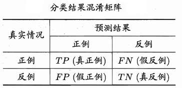


查准率P与查全率R分别定义为
$$
\begin{aligned}
&P=\frac{\text{TP}}{\text{TP}+\text{FP}}\\
&R=\frac{\text{TP}}{\text{TP}+\text{FN}}
\end{aligned}
$$
查准率亦称**准确率**，查全率亦称**召回率**。


**怎么理解查准率与查全率呢？**

**其实很简单，查准率是站在预测结果的角度来考虑正确率的，而查全率是站在数据本身的角度来考虑正确率的。**

如上图所示，

* 上图左图中
  * 对于预测结果来说，我预测的正例中全部都是实际的正例，所以我的查准率很高，100%
  * 对于数据本身来说，实际的正例中只有一小部分被预测为了正例，所以查全率很低，约7%
* 上图右图中
  * 对于预测结果来说，我预测的正例中有部分是实际的负例，所以我的查准率并不是100%，而是约75%
  * 对于数据本身来说，实际的正例中有大部分被预测为了正例，所以查全率很高，约80%

查准率和查全率是一对矛盾的度量。一般来说，查准率高时，查全率往往偏低；而查全率高时，查准率往往偏低。

例如，若希望将好瓜尽可能多地选出来（提高查全率），则可通过增加选瓜的数量来实现，如果将所有西瓜都选上，那么所有的好瓜也必然都被选上了，这样查全率就是100%了，但这样查准率就会较低；若希望选出的瓜中好瓜比例尽可能高（提高查准率），则可只挑选最有把握的瓜， 但这样就难免会漏掉不少好瓜，使得查全率较低。通常只有在一些简单任务中，才可能使查全率和查准率都很高.。

在很多情形下，我们可根据学习器的预测结果（为正例的概率）对样例进行排序，排在前面的是学习器认为"最可能 "是正例的样本，排在最后的则是学习器认为"最不可能"是正例的样本。按此顺序逐个把样本作为正例进行预测，则每次可以计算出当前的查全率、 查准率。以查准率为纵轴、查全率为横轴作图 ，就得到了查准率-查全率曲线，简称 " P-R曲线"，显示该曲线的图称为" P-R图"。下图给出了一个示意图。

那么**P-R曲线**是怎么来的呢？

算法对样本进行分类时（如逻辑回归），都会有置信度，即表示该样本是正样本的概率，比如99%的概率认为样本A是正例，1％的概率认为样本B是正例。通过选择合适的阈值，比如50%，对样本进行划分，概率大于50%的就认为是正例，小于50%的就是负例。这个大家已经很清楚了。

通过置信度就可以对所有样本进行排序，再逐个样本的选择阈值（阈值从100%到0%），在该样本之前的都属于正例，该样本之后的都属于负例。每一个样本作为划分阈值时，都可以计算对应的precision和recall，那么就可以以此绘制曲线。很多书上、博客上给出的P-R曲线，都长这样

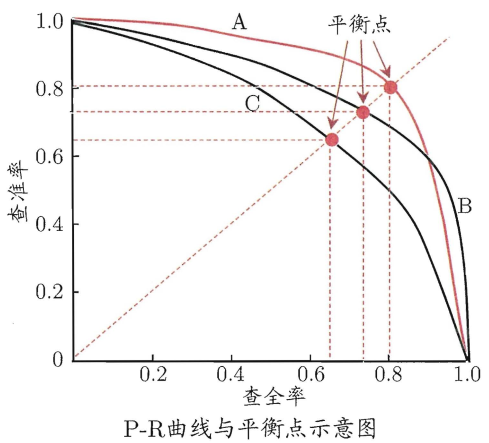

当然，这种曲线是有可能的。但是仔细琢磨就会发现一些规律和一些问题。

根据逐个样本作为阈值划分点的方法，可以推敲出，recall值是递增的（但并非严格递增），随着划分点左移，正例被判别为正例的越来越多，不会减少。而精确率precision并非递减，而是有可能振荡的，虽然正例被判为正例的变多，但负例被判为正例的也变多了，因此precision会振荡，但整体趋势是下降。

另外P-R曲线肯定会经过（0,0）点，比如讲所有的样本全部判为负例，则TP=0，那么P=R=0，因此会经过（0,0）点，但随着阈值点左移，precision初始很接近1，recall很接近0，因此有可能从（0,0）上升的线和坐标重合，不易区分。如果最前面几个点都是负例，那么曲线会从（0,0）点开始逐渐上升。

**曲线最终不会到（1,0）点**。很多P-R曲线的终点看着都是（1,0）点，这可能是因为负例远远多于正例。

最后一个点表示所有的样本都被判为正例，因此FN=0，所以recall = TP/(TP + FN) = 1, 而FP = 所有的负例样本数，因此precision = TP/(TP+FP) = 正例的占所有样本的比例，故除非负例数很多，否则precision不会为0。如果正例负例各占一半，则precision为0.5。

因此，较合理的P-R曲线应该是（曲线一开始被从（0，0）拉升到（0,1），并且前面的都预测对了，全是正例，因此precision一直是1,）

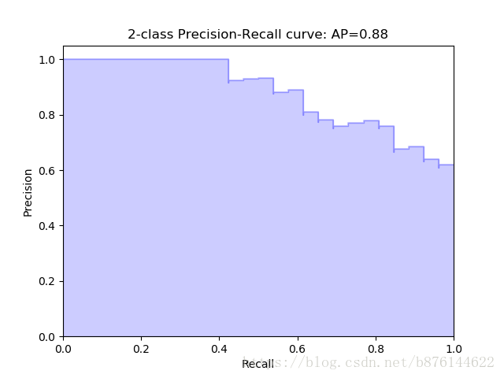

另外，如果有个划分点可以把正负样本完全区分开，那么P-R曲线就是整个1*1的面积。

总之，P-R曲线应该是从（0,0）开始画的一条曲线，切割1*1的正方形，得到一块区域。

**P-R图直观地显示出学习器在样本总体上的查全率、查准率**。在进行比较时，若一个学习器的P-R曲线被另一个学习器的曲线完全"包住"，则可断言后者的性能优于前者，例如上上图中学习器A的性能优于学习器C；如果两个学习器的P-R曲线发生了交叉，例如上上图中的A与B，则难以一般性地断言两者孰优孰劣，只能在具体的查准率或查全率条件下进行比较。然而，在很多情形下，人们往往仍希望把学习器A与B比出个高低。这时一个**比较合理的判据是比较P-R曲线下面积的大小，它在一定程度上表征了学习器在查准率和查全率上取得相对"双高"的比例**。但这个值不太容易估算，因此人们设计了一些综合考虑查准率、查全率的性能度量。

“**平衡点**”（Break-Even Point）就是这样一个度量，它是" 查准率=查全率"时的取值，例如上上图中学习器C的BEP是0.64，而基于BEP的比较，可认为学习器A优于B。

但BEP还是过于简化了些，更常用的是**F1度量**：
$$
F1=\frac{2\times P\times R}{P+R}=\frac{2\times TP}{\text{样例总数}+TP-TN}
$$
F1是基于查准率和查全率的调和平均定义的：
$$
\frac{1}{F1}=\frac{1}{2}\cdot \left\{ \frac{1}{P} + \frac{1}{R} \right\}
$$
与算术平均(P+R)/2和几何平均sqrt(PR)相比，调和平均更重视较小值。

在一些应用中，对查准率和查全率的重视程度有所不同。例如在商品推荐系统中，为了尽可能少打扰用户，更希望推荐内容确是用户感兴趣的，此时查准率更重要；而在逃犯信息检索系统中，更希望尽可能少漏掉逃犯，此时查全率更重要。F1 度量的一般形式——$F_{\beta}$，能让我们表达出对查准率/查全率的不同偏好，它定义为
$$
F_{\beta}=\frac{(1+\beta^2)\times P\times R}{(\beta^2\times P)+R}
$$
其中，β>0度量了查全率对查准率的相对重要性。β=1时退化为标准的F1；β>1时查全率有更大影响；β<1时查准率有更大影响。

Fβ则是计算调和平均：
$$
\frac{1}{F_{\beta}}=\frac{1}{1+\beta^2}\cdot \left\{ \frac{1}{P} + \frac{\beta^2}{R} \right\}
$$
与算术平均(P+R)/2和几何平均sqrt(PR)相比，调和平均更重视较小值。

## ROC与AUC

很多学习器是为测试样本产生一个实值或概率预测，然后将这个预测值与一个分类阈值进行比较，若大于阈值则分为正类，否则为反类。例如，神经网络在一般情形下是对每个测试样本预测出一个[0.0, 1.0]之间的实值，然后将这个值与0.5进行比较，大于0.5则判为正例，否则为反例。这个实值或概率预测结果的好坏，直接决定了学习器的泛化能。实际上根据这个实值或概率预测结果，我们可将测试样本进行排序，"最可能"是正例的排在最前面，"最不可能"是正例的排在最后面这样，分类过程就相当于在这个排序中以某个"截断点"将样本分为两部分，前一部分判作正例，后一部分则判作反例。

在不同的应用任务中，我们可根据任务需求来采用不同的截断点，例如若我们更重视"查准率"，则可选择排序中靠前的位置进行截断;若更重视"查全率"，则可选择靠后的位置进行截断。因此，**排序本身的质量好坏，体现了综合考虑学习器在不同任务下的"期望泛化性能"的好坏，或者说"一般情况下"泛化性能的好坏**。ROC曲线则是从这个角度出发来研究学习器泛化性能的有力工具。

ROC全称是"受试者工作特征"（Receiver Operating Characteristic）曲线，它源于"二战"中用于敌机检测的雷达信号分析技术，二十世纪六七十年代开始被用于一些心理学、医学检测应用中，此后被引入机器学习领域[Spackman, 1989]。与上节中介绍的P-R曲线相似。我们根据学习器的预测结果对样例进行排序，**按此顺序逐个把样本作为正例进行预测（正例阈值从100%到0%）**，每次计算出两个重要量的值，分别以它们为横、纵坐标作图，就得到了"ROC曲线”。与P-R曲线使用查准率、查全率为纵、横轴不同，ROC曲线的纵轴是"真正例率"（True Positive Rate，简称TPR），横轴是"假正例率"（False PositiveRate，简称FPR），基于前面的混淆矩阵中的符号，


两者分别定义为

* TPR（真正例率）：在所有实际为正例的样本中，被**正确地**判断为正例之比率

$$
\text{TPR}=\frac{\text{TP}}{\text{TP}+\text{FN}}
$$
* FPR（假正例率）：在所有实际为负例的样本中，被**错误地**判断为正例之比率
  $
  \text{FPR}=\frac{\text{FP}}{\text{FP}+\text{TN}}
  $


显示ROC曲线的图称为"ROC图”。下图（a）给出了一个示意图，显然 ，对角线对应于 "随机猜测" 模型，而点(0, 1)则对应于将所有正例排在所有反例之前的“理想模型”。


现实任务中通常是利用有限个测试样例来绘制ROC图，此时仅能获得有限个（真正例率，假正例率）坐标对，无法产生上图(a) 中的光滑ROC曲线，只能绘制出如上图(b)所示的近似ROC曲线。绘图过程很简单：给定 $m^+$个正例和$m^-$个反例，根据学习器预测结果对样例进行排序，然后把分类阔值设为最大，即把所有样例均预测为反例，此时真正例率和假正例率均为0，在坐标$(0, 0)$处标记一个点。然后，将分类阐值依次设为每个样例的预测值，即依次将每个样例划分为正例。设前一个标记点坐标为$(x, y)$，当前若为真正例，则对应标记点的坐标为$(x, y+1/m^+)$；当前若为假正例，则对应标记点的坐标为$(x+1/m^-, y)$，然后用线段连接相邻点即得。 

### AUC

#### AUC的定义

进行学习器的比较时， 与P-R图相似， 若一个学习器的ROC曲线被另一个学习器的曲线完全"包住"，则可断言后者的性能优于前者；若两个学习器的ROC曲线发生交叉，则难以一般性地断言两者孰优孰劣。此时如果一定要进行比较，则较为合理的判据是**比较ROC曲线下的面积，即AUC** (Area Under ROC Curve)，如上图所示。

从定义可知，AUC可通过对ROC曲线下各部分的面积求和而得。假定ROC曲线是由坐标为$\{ (x_1, y_1), (x_2, y_2), ... , (x_m, y_m) \}$的点按序连接而形成$(x_1 = 0, x_m = 1)$；参见上图(b)，则AUC可估算为
$$
\text{AUC}=\frac{1}{2}\sum_{i=1}^{m-1}(x_{i+1}-x_i)\cdot (y_i+y_{i+1})
$$
形式化地看，AUC考虑的是样本预测的排序质量，因此它与排序误差有紧密联系。给定$m^+$个正例和$m^-$个反例，令$D^+$和$D^-$分别表示正、反例集合，则排序"损失"(loss)定义为
$$
\text{loss}_{\text{rank}}=\frac{1}{m^+m^-}\sum_{x^+\in D^+}\sum_{x^-\in D^-}\left( I(f(x^+)\leqslant f(x^-))+\frac{1}{2}I(f(x^+) = f(x^-)) \right)
$$
即考虑每一对正、反例，若正例的预测值小于反例，则记一个“罚分”，若相等，则记0.5个“罚分”。容易看出，loss_rank对应的是ROC曲线之上的面积：若一个正例在ROC曲线上对应标记点的坐标为$(x, y)$，则$x$恰是排序在其之前的反例所占的比例，即假正例率。因此有  
$$
\text{AUC}=1-\text{loss}_{\text{rank}}
$$

#### AUC的直觉解释

AUC的另一种**直觉解释：随机取一对正负样本，正样本得分大于负样本的概率**。

概率解释的证明：[深入理解AUC](https://tracholar.github.io/machine-learning/2018/01/26/auc.html#%E6%A6%82%E7%8E%87%E8%A7%A3%E9%87%8A%E7%9A%84%E8%AF%81%E6%98%8E)

#### AUC的两个性质：

a、AUC的排序特性

根据上述概率解释，AUC实际上在说一个模型把正样本排在负样本前面的概率！ 所以，AUC常用在排序场景的模型评估，比如搜索和推荐等场景！ 这个解释还表明，如果将所有的样本的得分都加上一个额外的常数，并不改变这个概率，因此AUC不变！ 因此，在广告等需要绝对的点击率场景下，AUC并不适合作为评估指标，而是用logloss等指标。

b、AUC对正负样本比例不敏感

这个问题的本质原因，在于横轴FPR只关注负样本，与正样本无关；纵轴TPR只关注正样本，与负样本无关。所以横纵轴都不受正负样本比例影响，积分当然也不受其影响。

#### AUC的计算和sql代码

[深入理解AUC](https://tracholar.github.io/machine-learning/2018/01/26/auc.html#%E6%A6%82%E7%8E%87%E8%A7%A3%E9%87%8A%E7%9A%84%E8%AF%81%E6%98%8E)

===

[深入理解AUC](https://tracholar.github.io/machine-learning/2018/01/26/auc.html)

## ROC曲线和PR曲线的关系

在ROC空间，ROC曲线越凸向左上方向效果越好。与ROC曲线左上凸不同的是，PR曲线是右上凸效果越好。

ROC和PR曲线都被用于评估机器学习算法对一个给定数据集的分类性能，每个数据集都包含固定数目的正样本和负样本。而ROC曲线和PR曲线之间有着很深的关系。

* 定理1：对于一个给定的包含正负样本的数据集，ROC空间和PR空间存在一一对应的关系，也就是说，如果recall不等于0，二者包含完全一致的混淆矩阵。我们可以将ROC曲线转化为PR曲线，反之亦然。
* 定理2：对于一个给定数目的正负样本数据集，一条曲线在ROC空间中比另一条曲线有优势，当且仅当第一条曲线在PR空间中也比第二条曲线有优势。（这里的“一条曲线比其他曲线有优势”是指其他曲线的所有部分与这条曲线重合或在这条曲线之下。）

证明过程见文章《[The Relationship Between Precision-Recall and ROC Curves](http://pages.cs.wisc.edu/~jdavis/davisgoadrichcamera2.pdf)》

当正负样本差距不大的情况下，ROC和PR的趋势是差不多的，但是当负样本很多的时候，两者就截然不同了，ROC效果依然看似很好，但是PR上反映效果一般。解释起来也简单，假设就1个正例，100个负例，那么基本上TPR可能一直维持在100左右，然后突然降到0。如图，

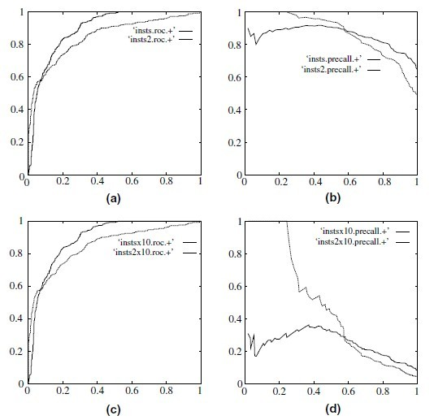

(a)(b)分别为正负样本1:1时的ROC曲线和PR曲线，二者比较接近。而(c)(d)的正负样本比例为1:1，这时ROC曲线效果依然很好，但是PR曲线则表现的比较差。这就说明PR曲线在正负样本比例悬殊较大时更能反映分类的性能。

两者都要看光不光滑，如果不光滑说明有很大问题是过拟合。


# 偏差与方差

对学习算法除了通过实验估计其泛化性能，人们往往还希望了解它"为什么"具有这样的性能"偏差方差分解" (bias-variance decomposition)是解释学习算法泛化性能的一种重要工具。

偏差方差分解试图对学习算法的期望泛化错误率进行拆解。我们知道，算法在不同训练集上学得的结果很可能不同，即便这些训练集是来自同一个分布。对测试样本x，令$y_D$为x在数据集中的标记，y为x的真实标记，有可能出现噪声，使得$y\neq y_D$，f(x; D)为训练集D上学得模型f在x上的预测输出。以回归任务为例，学习算法的期望预测为
$$
\bar{f}(x)=\mathbb{E}_D[f(x; D)]
$$
使用样本数相同的不同训练集产生的方差为
$$
var(x)=\mathbb{E}_D\left[ \left( f(x;D)-\bar{f}(x) \right)^2 \right]
$$
噪声为
$$
\epsilon^2=\mathbb{E}_D\left[ (y_D-y)^2 \right]
$$
期望输出与真实标记的差别称为偏差（bias），即
$$
bias^2(x)=\left( \bar{f}(x)-y \right)^2
$$
为便于讨论，假定噪声期望为零，即
$$
E_D[y_D - y] = 0
$$
。通过简单的多项式展开合并，可对算法的期望泛化误差进行分解：

$$
\begin{aligned}
E(f;D)=&\mathbb{E}_D\left[ \left( f(x;D)-y_D \right)^2 \right]\\
=&\mathbb{E}_D\left[ \left( f(x;D)-\bar{f}(x)+\bar{f}(x)-y_D \right)^2 \right]\\
=&\mathbb{E}_D\left[ \left( f(x;D)-\bar{f}(x) \right)^2 \right]+\mathbb{E}_D\left[ \left( \bar{f}(x)-y_D \right)^2 \right]\\
&+\mathbb{E}_D\left[ 2\left( f(x;D)-\bar{f}(x) \right)\left( \bar{f}(x)-y_D \right) \right]\\
=&\mathbb{E}_D\left[ \left( f(x;D)-\bar{f}(x) \right)^2 \right]+\mathbb{E}_D\left[ \left( \bar{f}(x)-y_D \right)^2 \right]\\
=&\mathbb{E}_D\left[ \left( f(x;D)-\bar{f}(x) \right)^2 \right]+\mathbb{E}_D\left[ \left( \bar{f}(x)-y+y-y_D \right)^2 \right]\\
=&\mathbb{E}_D\left[ \left( f(x;D)-\bar{f}(x) \right)^2 \right]+\mathbb{E}_D\left[ \left( \bar{f}(x)-y \right)^2 \right]+\mathbb{E}_D\left[ \left( y-y_D \right)^2 \right]\\
&+2\mathbb{E}_D\left[ \left( \bar{f}(x)-y \right)\left( y-y_D \right) \right]\quad\text{噪声期望为0}\\
=&\mathbb{E}_D\left[ \left( f(x;D)-\bar{f}(x) \right)^2 \right]+\left( \bar{f}(x)-y \right)^2+\mathbb{E}_D\left[ \left( y_D-y \right)^2 \right]\\
\end{aligned}
$$
于是，

$$
E(f;D)=bias^2(x)+var(x)+\epsilon^2
$$
也就是说，泛化误差可分解为偏差、方差与噪声之和。

回顾偏差、方差、噪声的含义：

* **偏差**度量了学习算法的期望预测与真实结果的偏离程度，即刻画了学习算法本身的拟合能力
* **方差**度量了同样大小的训练集的变动所导致的学习性能的变化，即刻画了数据扰动所造成的影响
* **噪声**则表达了在当前任务上任何学习算法所能达到的期望泛化误差的下界，即刻画了学习问题本身的难度。

**偏差—方差分解**说明，泛化性能是由学习算法的能力、数据的充分性以及学习任务本身的难度所共同决定的。给定学习任务，为了取得好的泛化性能，则需使偏差较小，即能够充分拟合数据，并且使方差较小，即使得数据扰动产生的影响小。

一般来说，偏差与方差是有冲突的，这称为偏差一方差窘境（bias-variance dilemma）。下图给出了一个示意图给定学习任务，假定我们能控制学习算法的训练程度，则在**训练不足时**，学习器的拟合能力不够强，训练数据的扰动不足以便学习器产生显著变化，此时**偏差**主导了泛化错误率；随着**训练程度的加深**，学习器的拟合能力逐渐增强，训练数据发生的扰动渐渐能被学习器学到，**方差**逐渐主导了泛化错误率；在训练程度充足后，学习器的拟合能力已非常强，训练数据发生的轻微扰动都会导致学习器发生显著变化，若训练数据自身的、非全局的特性被学习器学到了，则将发生过拟合。


# 维数灾难

当数据的维度很高时，很多机器学习的问题变得相当困难。这种现象被称为维数灾难。

维度增多会使得x的可能分布位置数目远大于训练样本的数目。

为了充分理解这个问题，假设空间被分成网格。

低维时，用少量划分的网格就可以描述这个空间。当泛化到新数据点时，可通过检测与这个新数据点在相同网格中的训练样本，来判断如何处理新数据点。

但是，如果该网格中没有样本，是不是就傻眼了？在高维空间中，**参数的分布位置数目远大于样本数目，大部分分布位置是没有样本的**。

那如何预测新的分布位置的输出呢？很多传统的机器学习算法仅仅假设新的位置点的输出应约等于最邻近的样本点的输出。


比如每个维度分成十份，一共十个训练数据点，一维的情况下，十个训练数据最多可以占据十个网格，即100%的覆盖率，而在二维空间，十个数据最多占据10%的网格(10/10^2=10%)，即10%的覆盖率，在三维空间，十个数据最多占据1%的网格(10/10^3=1%)，即1%的覆盖率。即随着维度的增加，样本的可能分布位置远大于样本数目。

------

对于大多数数据，在一维空间或者说是低维空间都是很难完全分割的，但是在高纬空间间往往可以找到一个超平面，将其完美分割。

引用[The Curse of Dimensionality in Classification](http://www.visiondummy.com/2014/04/curse-dimensionality-affect-classification/)的例子来说明：

想象下我们有一系列图片，每张图描述的不是猫就是狗。现在我们想利用这些图片来做一个可以判断猫狗的分类器。首先，我们需要找到一些描述猫狗特征，利用这些特征，分类器能够识别猫狗。比如可以通过颜色来区分它们，一种分类方法是将红、绿、蓝三种颜色作为识别特征。以简单的线性分类器为例，将这三种特征结合起来的分类算法为：

```python
If 0.5*red + 0.3*green + 0.2*blue > 0.6 : 
	return cat;
else 
	return dog;
```

然而，将这三种颜色作为特征来区分猫狗明显是不够的。为此，我们决定增加一些特征，比如x、y轴方向上的梯度dx、dy，那么现在就有5个特征了。

为了得到更精确的分类器，基于颜色和、纹理、统计动差等，我们还需要更多的特征。通过将特征增加到好几百，我们能得到一个完美的分类器吗？回答可能会出乎你们的意料：不能！事实上，过了某个临界点，如果还持续的增加特征，那么分类器的性能会下降。看图1，这就是我们经常说的“**维度灾难(curse of dimension)**”。

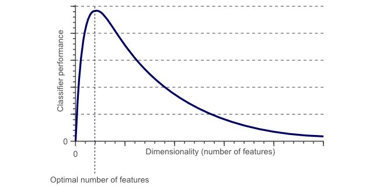

维度灾难和过拟合的关系：

假设在地球上有无数只猫和狗，但由于种种原因，我们总共只有10张描述猫狗的图片。我们的最终目的是利用这10张图片训练出一个很牛的分类器，它能准确的识别我们没见过的各种无数的猫、狗。

如果只使用一维特征，例如红色进行训练，在一维特征轴上展开

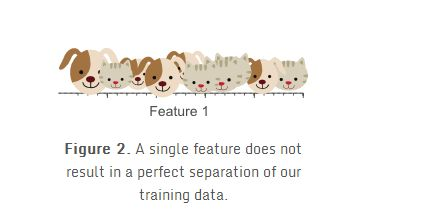

我们可以发现，分类效果并不好，因此我们准备再加入一个图像平均绿色的特征。


在红绿构成的二维特征空间中，我们发现还是没法找到一条线将他们分开。我们准备再加一个特征，把空间拓展到3维。

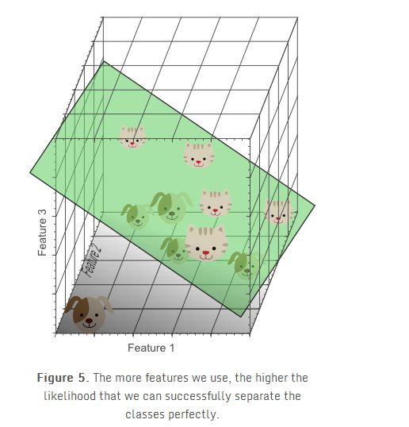

终于我们找到了一个平面可以将10个样本完美的分开。
从这个例子我们好像可以看出，分类器的效果随着特征维度的增加变得更好了，我们应该不停的增加特征维度直到分类器获得最好的结果为止，但是我们在上文论述过，从图1可以看出，实际上这是有问题的。

在1特征空间为1维时（如图2），10个训练实例覆盖在一维轴上，假设轴长为5，那么每个样本平均每个单位有2个样本。特征空间为2维时（如图3），我们仍然用10个实例进行训练，此时二维空间的面积是5x5=25，样本密度是10/25=0.4，即每个单位面积有0.4个样本。在特征空间为3维时，10个样本的密度是10/(5x5x5)=0.08，即每个单位体积有0.08个样本。

如果我们不断的增加特征，特征维度就会不断变大，同时变得越来越稀疏。**由于稀疏的原因，随着特征维度的不断变大，我们很容易的就找到一个能将样本按类别完美分开的超平面**，因为训练样本落到该空间的最优超平面错误一边的概率会随着维度增加无限变小。然而，如果将高维分类映射回低维，我们能很容易发现一个严重的问题：


使用太多的特征导致了过拟合。分类器学习了很多异常特征（如噪声等），因此对于新的数据泛化性能不好。

上图展示了3D分类结果投影到2D空间中的情景，我们可以看不像高维空间中，在低维空间中，数据并没有显示出可分性。而实际上，通过增加第三维度来获得最优分类效果等价于在低维空间使用复杂的非线性分类器，而往往复杂的模型结构也是导致过拟合的原因之一。结果就是分类器学习到了很多数据集中的特例，因此对于现实数据往往会效果较差，因为现实数据是没有这些噪声以及异常特性的。
因此说，**过拟合是维度灾难带来的最直接结果**。


展示了使用2个特征的线性分类器的训练结果，尽管这个分类边界看起来不如图5中的分类器，但是简单的分类器对于未知的数据具有更好的泛化性能，因为其不会学习到训练集中偶然出现的特例。换句话说，维度灾难可以通过使用更少的特征来避免，同时这样分类器就不会对训练数据过拟合。

下面从另一个角度来阐述，我们假设每个特征的范围是从0-1，同时每个猫和狗都具有不同的特征。如果我们想使用全数据的20%的数据来训练模型，那么在一维的情况下，我们的特征范围只需要取20%的范围，也就是0.2就够了。当上升到2维的情况下，我们需要45%的每维特征（0.45*0.45=0.2）才可以覆盖特征空间中的20%，当上升到3维空间时，我们则需要每维58%的特征范围（0.58^3 = 0.2）。

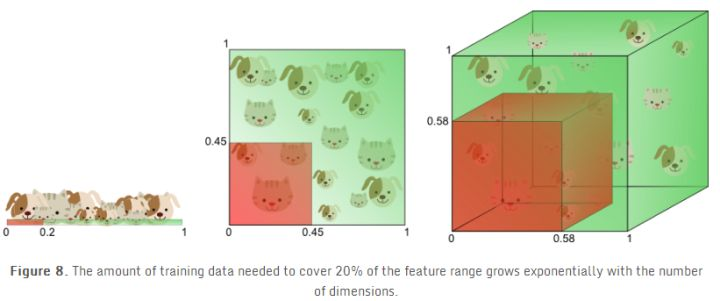

换句话说，如果特征数目一定，那么随着维度增加过拟合就会出现。另一方面，如果持续增加维度，那么训练数据需要指数级的增加才能保持同样的距离分布来避免过拟合。

举个例子：例如在一维空间中，样本密度是1000个/单位，那么我们在任意测试样本0.001的单位距离都可以找到一个样本。但是如果到2维空间，那么我们需要1000^2个样本才能保证，任意样本的0.001单位距离内都有一个样本。

换个角度来看，如果我们吧100个点丢到0-1的区间内，并且吧0-1分成每个0.1一共10个区间，那么极有可能每个区间都会有点存在，但是如果还是100个点丢到2维空间内，那么边长为0.1的单位单元就有100个，几乎不可能每个单元都有一个点。当拓展到3维就有1000个单元。所以当在更高维的空间内，数据会变得非常系数，会丢失在高维空间内。这就是数据的稀疏性。

 在上面的例子中，我们通过演示数据的稀疏性展示了维数灾难，即：在分类中我们使用的特征数量越多，那么由于高维下数据的稀疏性我们不得不需要更多的训练数据来对分类器的参数进行估计(高维数下分类器参数的估计将变得更加困难)。维数灾难造成的另外一个影响是：数据的稀疏性致使数据的分布在空间上不同(实际上，数据在高维空间的中心比在边缘区域具备更大的稀疏性，**数据更倾向于分布在空间的边缘区域**)。举个栗子更好理解：

假设一个二维的单位正方形代表了2维空间，特征的平均值作为特征空间的中点，所有距离特征空间单位距离内的点都在一个特征空间的内接圆内，而在内接圆外的点则分布在空间的角落，他们相对来说更难被区分，因为他们的特征差距很大(不同角落的样本如果同类别会很难区分)。因此单位圆内的样本越多，那么分类任务就越简单：


在这里一个有趣的问题就是随着维度的增长，超球体所占的空间和超立方体的空间的相对比例是如何变化的。超立方体的体积在维度d的情况下永远是1^d=1，超球题的体积在半径为0.5的情况下可以由以下公式计算：
$$
V(d)=\frac{\pi^{d/2}}{\Gamma(d/2+1)}0.5^d
$$
其体积-维度图画出来大概是这样的：

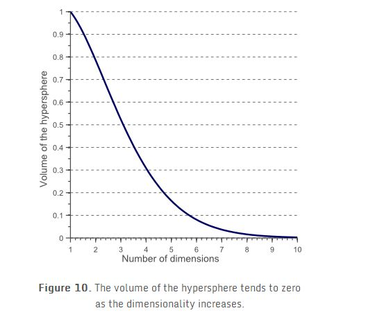

我们可以明显的发现，当维度不断增大，内接球的体积会趋于0，而超立方体的体积还是1，这种反直觉的发现解释了分类器维度灾难的相关问题：在高维空间中，大部分训练数据都位于定义的特征空间立方体的拐角处。正如前面提到的，样例在拐角处比样例在内接球体内是更难分类的，下图更明显的展示了这一点：


对于8维的超立方体，大概有98%的数据位于它的256个拐角处。当维度趋近于无穷大时，样本点到中心点的欧式距离的最大值和最小值的差值与最小值的比例趋近于0：
$$
\mathop{\text{lim}}_{d\rightarrow \infty}\frac{\text{dist}_{max}-\text{dist}_{min}}{\text{dist}_{min}}\rightarrow0
$$
因此，在某种意义上，几乎所有的高维空间都远离其中心，**或者从另一个角度来看，高维单元空间可以说是几乎完全由超立方体的“边角”所组成的，没有“中部”**，这对于理解卡方分布是很重要的直觉理解。 给定一个单一分布，由于其最小值和最大值与最小值相比收敛于0，因此，其最小值和最大值的距离变得不可辨别。 

因此，在高维空间用距离来衡量样本相似性的方法已经渐渐失效。所以以距离为标准的分类算法（欧氏距离，曼哈顿距离，马氏距离）在低维空间会有更好的表现。类似的，高斯分布在高维空间会变得更加平坦，而且尾巴也会更长。

对于使用距离测度的机器学习算法的影响：

由于维度灾难的影响，正如前面所说的在高维空间中，欧式距离的测度会失去意义，当维度趋于无穷时，数据集中任意两点的距离会趋向收敛，意思是任意两点的最大距离和最小距离会变为相同。

因此基于欧式距离的k-means算法，会无法进行聚类（因为距离会趋于收敛）。而K-NN会的临近K个点中，会出现更多非同类的点（远多于低维度的情况）。

参考网页：
[Curse of dimensionality](https://en.wikipedia.org/wiki/Curse_of_dimensionality)
[The Curse of Dimensionality in Classification](http://www.visiondummy.com/2014/04/curse-dimensionality-affect-classification/)

# 生成模型与判别模型

## 简述

监督学习的任务就是学习一个模型，应用这一模型，对给定的输入预测相应的输出。这个模型的一般形式为决策函数：
$$
Y=f(X)
$$
或者条件概率分布：
$$
P(Y|X)
$$
监督学习方法又可以分为生成方法（generative approach）和判别方法（discriminative approach）。所学到的模型分别称为**生成模型（generative model）**和**判别模型（discriminative model）**。

（1）**生成模型**

**生成方法**由数据学习联合概率分布P(X, Y)，然后求出条件概率分布P(Y|X)作为预测的模型，即生成模型：
$$
P(Y|X)=\frac{P(X,Y)}{P(X)}
$$
这样的方法之所以称为生成方法，是因为**模型表示了给定输入X产生输出Y的生成关系**。典型的生成模型有：朴素贝叶斯法和隐马尔可夫模型，将在后面章节进行相关讲述。

（2）**判别模型**

**判别方法**由数据直接学习决策函数f(X)或者条件概率分布P(Y|X)作为预测的模型，即判别模型。判别方法关心的是对给定的输入X，应该预测什么样的输出Y。典型的判别模塑包括：k近邻法、感知机、决策树、逻辑斯谛回归模型、最大熵模型、支持向量机、提升方法和条件随机场等，将在后面章节讲述。

---

我们都知道，对于有监督的机器学习中的分类问题，求解问题的算法可以分为生成模型与判别模型两种类型。但是，究竟什么是生成模型，什么是判别模型？不少书籍和技术文章对这对概念的解释是含糊的。在今天这篇文章中，我们将准确、清晰的解释这一组概念。

## 第一种定义

对于判别模型和生成模型有两种定义，第一种定义针对的是有监督学习的分类问题。

该问题的目标是给定一个样本的向量x（可以是原始数据如图像，声音，也可以是提取出来的特征向量），在这里我们将它称为输入变量，目标是预测出这个样本的类别y即标签值，一般是一个离散的标量，即类别编号。因此算法要解决的核心问题是根据训练样本建立下面这样的映射函数：
$$
y=f(x)
$$
对于这个问题，有3种求解思路，下面我们分别介绍。

### 生成模型

第一种做法称为生成模型。已知输入变量x和目标变量y，先对它们的联合概率分布p(x, y)建模，然后计算样本属于每一个类的条件概率p(y|x)即类后验概率，按照这个值来完成分类，如将样本分到概率p(y|x)最大的那个类。根据概率论的知识，有：
$$
p(y|x)=\frac{p(x,y)}{p(x)}
$$
在这里，p(x, y)为联合概率密度函数，p(x)为样本输入向量x的边缘密度函数。对上面这种做法的直观解释是：**我们已知某一个样本具有某种特征x，现在要确定它输入哪个类，而自然的因果关系是，样本之所以具有这种特征x，是因为它属于某一类**。例如，我们要根据体重，脚的尺寸这两个特征x来判断一个人是男性还是女性，我们都知道，男性的体重总体来说比女性大，脚的尺寸也更大，因此从逻辑上来说，是因为一个人是男性，因此才有这种大的体重和脚尺寸。而在分类任务中要做的却相反，是给了你这样个特征的样本，让你反推这人是男性还是女性。

联合概率密度函数等于类概率p(y)与类条件概率p(x|y)即先验概率的乘积，即：
$$
p(x,y)=p(x|y)p(y)
$$
将上面两个公式合并起来，有：
$$
p(y|x)=\frac{p(x|y)p(y)}{p(x)}
$$
这就是贝叶斯公式。它完成了**因果转换**，我们要完成的是**由果推断因**，而在训练时我们建立的是**因到果**的模型及p(x|y)，即男性和女性的体重、脚尺寸分别服从的概率分布。

总结起来，生成模型对联合概率p(x, y)建模，根据它，我们可以得到类后验概率p(y|x)。事实上，这种做法不仅仅局限于分类问题，如果将x看做可以观测的变量，y看做不可观测到的变量，只要具有这种特征的问题，我们都可以建立生成模型。

生成模型的典型代表是贝叶斯分类器，它对类条件概率p(x|y)建模，而p(x|y)p(y)就是联合概率p(x, y)。通过贝叶斯公式，根据联合概率又可以得到类后验概率：
$$
p(y|x)=\frac{p(x|y)p(y)}{p(x)}
$$
如果只用于分类而不需要给出具体的概率值，则分母p(x)对所有类型y都是一样的，只需要计算分子p(x|y)p(y)。如果我们假设每个类y的样本的特征向量x的每个分量相互独立，则可以得到朴素贝叶斯分类器，如果假设每个类的样本服从正态分布，则p(x|y)为正态分布，此时为正态贝叶斯分类器。

生成模型的另外一个典型代表是受限玻尔兹曼机（RBM），这是一种随机性的神经网络，由两类神经元组成（每一类为一个层），两个层之间有连接关系，第一种神经元为可见变量，即可以直接观测到的值v，如图像的每个像素。第二类为隐含变量h，是不能直接观测到的变量，如图像的特征。v和h的联合概率服从玻尔兹曼分布：
$$
p(v,h)=\frac{1}{Z_{\theta}}\text{exp}\left(-E_{\theta}(v,h)\right)\frac{1}{Z_{\theta}}\text{exp}\left( v^TWh+b^Tv+d^Th \right)
$$
根据这个联合概率，我们可以很容易得到条件概率p(x|y)和p(y|x)。例如为了得到p(y|x)，可以先求边缘概率p(x)，对于离散型随机变量，对y的概率求和，对于连续型随机变量，则为求积分，然后有：
$$
p(y|x)=\frac{p(x,y)}{p(x)}
$$
生成模型最显著的一个特征是假设样本向量x服从何种概率分布，如正态分布，均匀分布。

### 判别模型

第二种做法称为判别模型。已知输入变量x，它直接对目标变量y的条件概率p(y|x)建模。即计算样本x属于 每一类的概率。注意，这里和生成模型有一个本质的区别，那就是每一假设x服从何种概率分布，而是直接估计出条件概率p(y|x)。

这类模型的典型代表是logistic回归和softmax回归，它们直接对p(y|x)建模，而不对p(x, y)建模，即每一假设x服从何种概率分布。logistic回归用于二分类问题，它直接根据样本x估计出它是正样本的概率：
$$
p(y=1|x)=\frac{1}{1+\text{exp}\left( -w^Tx+b \right)}
$$
注意，这里只是直接猜测出了这个概率，而没有假设每个类的样本服从何种概率分布，即没有对p(x|y)或者p(x, y)建模。

softmax回归是logistic回归的多分类版本，它直接估计出一个样本向量x属于k个类中每一个类的概率：
$$
\begin{aligned}
h_{\theta}(x)=\frac{1}{\sum_{i=1}^ke^{\theta_i^Tx}}
\begin{bmatrix}
e^{\theta_1^Tx}\\ 
...\\
e^{\theta_k^Tx}
\end{bmatrix}
\end{aligned}
$$
这里预测出的是一个向量，每个分量为样本属于每个类的概率。和logistic回归一样，它是直接预测出了这个条件概率，而没有假设每个类的样本x所服从的概率分布。

### 非概率模型（也称为判别模型）

第三种做法最直接，分类器根本就不建立概率模型，而是直接得到分类结果，这种是非概率模型，也称为判别模型。它直接根据样本向量x预测出类别编号y：
$$
y=f(x)
$$
这类模型的典型代表是决策树，支持向量机，随机森林，kNN算法，AdaBoost算法，xgboost，标准的人工神经网络（包括全连接神经网络，卷积神经网络，循环神经网络等）。如果神经网络的最后一层是softmax变换，即softmax回归，则可以归到第二种情况里，如果没有使用，则是这第三种情况。

支持向量机的预测函数是：
$$
\text{sign}\left( \sum_{i=1}^l\alpha_iy_iK(x_i^Tx)+b \right)
$$
它自始至终没有假设样本向量x服从何种分布，也没有估计类后验概率p(y|x)。这可以看成是一种几何划分的思想，把空间划分成多个部分。

类似的，决策树的预测函数时分段常数函数，直接实现从向量x到类别标签y的映射，没有计算任何概率值。其他的算法如随机森林，kNN，也是如此。

这类模型没有使用概率的观点进行建模，而是用几何或者分析（函数）的手段建模，如找出分类超平面或者曲面，直接得到映射函数。

一般来说，我们把使用第一种模型的分类器称为生成式分类器，把使用第二种和第三种模型的分类器称为判别式分类器。

## 第二种定义

除此之外，对生成模型和判别模型还有另外一种定义。生成模型是已知样本的标签值y，对样本的特征向量x的条件概率进行建模，即对条件概率p(x|y)建模，它研究的是每种样本服从何种概率分布。判别模型则刚好相反，已知样本的特征向量x，对样本的标签值y的概率进行建模，即对条件概率p(y|x)建模，这种一般用于分量，即给定样本x，计算它属于每个类的概率。

根据这种定义，生成模型可以用来根据标签值y生成随机的样本数据x。生成对抗网络（GAN）就是典型的例子，它可以生成服从某种概率分布的随机变量，即拟合类条件概率密度函数p(x|y)，而此时它的目的不是分类，而是生成样本。事实上，如果我们知道了p(x|y)或者p(x, y)，无论是用来做分类，还是用来做数据生成，都是可以的。

而判别模型以及不使用概率模型的判别型分类器则根据样本特征向量x的值判断它的标签值y，即用于判断样本的标签值y。

## 生成模型与判别模型的特点

在监督学习中，生成方法和判别方法各有优缺点，适合于不同条件下的学习问题。

**生成方法的特点**：

* 生成方法可以还原出联合概率分布P(X, Y)，而判别方法则不能
* 生成方法的学习收敛速度更快，即当样本容量增加的时候，学到的模型可以更快地收敛于真实模型
* 当存在隐变量时，仍可以用生成方法学习，此时判别方法就不能用

**判别方法的特点**：

* 判别方法直接学习的是条件概率P(Y|X)或决策函数f(X)，直接面对预测，往往学习的准确率更高；
* 由于直接学习P(Y|X)或f(X)，可以对数据进行各种程度上的抽象、定义特征并使用特征，因此可以简化学习问题

# 机器学习模型分类

注意：没有把神经网络体系加进来。因为NNs的范式很灵活，不太适用这套分法。

## 监督学习

- **分类算法(线性和非线性)**

  - 感知机

  - KNN

  - 概率

    - 朴素贝叶斯（NB）
    - Logistic Regression（LR）
    - 最大熵MEM（与LR同属于对数线性分类模型）

  - 支持向量机(SVM)

  - 决策树(ID3、CART、C4.5)

  - assembly learning

    - Boosting

      - Gradient Boosting

        - GBDT

        - xgboost

          传统GBDT以CART作为基分类器，xgboost还支持线性分类器，这个时候xgboost相当于带L1和L2正则化项的逻辑斯蒂回归（分类问题）或者线性回归（回归问题）；

          xgboost是Gradient Boosting的一种高效系统实现，并不是一种单一算法。

      - AdaBoost

    - Bagging

      - 随机森林

    - Stacking


- ……


- 概率图模型（标注）
  - HMM
  - MEMM（最大熵马尔科夫）
  - CRF
  - ……
- 回归预测
  - 线性回归
  - 树回归
  - Ridge岭回归
  - Lasso回归
  - ……
- ……  

## 非监督学习

- 聚类
  - 基础聚类
    - K-mean
    - 二分k-mean
    - K中值聚类
    - GMM聚类


- 层次聚类
- 密度聚类
- 谱聚类
- 主题模型
  - pLSA
  - LDA隐含狄利克雷分析
- 关联分析
  - Apriori算法
  - FP-growth算法
- 降维
  - PCA算法
  - SVD算法
  - LDA线性判别分析
  - LLE局部线性嵌入
- 异常检测：
- ……

## 半监督学习

空

## 强化学习

空

# 参考资料

* [机器学习包含哪些学习思想？](https://www.zhihu.com/question/267135168/answer/329318812)

“机器学习的哲学思想”一节来自这篇知乎回答。

- [一文区分什么是「过拟合」和「欠拟合」？](https://mp.weixin.qq.com/s?__biz=MzI4MDYzNzg4Mw==&mid=2247486990&idx=1&sn=31536229da8b403924de67da070f0d0e&chksm=ebb436dadcc3bfcc30230d64341ea60296e48db3d24a9802c4508593ea55ab40712bbde3b89e&scene=0#rd)

“直观理解过拟合与欠拟合”一节参考了此微信文章。

- [史上最全面的正则化技术总结与分析--part1](https://zhuanlan.zhihu.com/p/35429054)


- [史上最全面的正则化技术总结与分析--part2](https://zhuanlan.zhihu.com/p/35432128)
- [深入理解L1、L2正则化](https://zhuanlan.zhihu.com/p/29360425)

* [l1 相比于 l2 为什么容易获得稀疏解？](https://www.zhihu.com/question/37096933/answer/70507353)
* [机器学习中 L1 和 L2 正则化的直观解释](https://zhuanlan.zhihu.com/p/38309692)
* [从局部泰勒展开说说L1和L2正则化](https://zhuanlan.zhihu.com/p/26895929)

"正则化"一节参考了此知乎专栏和回答。

- [LR正则化与数据先验分布的关系？](https://www.zhihu.com/question/23536142/answer/90135994)

“贝叶斯观点：正则化对应模型先验概率”一节参考了此知乎回答。

* 《机器学习》周志华

”性能度量“参考了此书对应章节。

* [P-R曲线深入理解](https://blog.csdn.net/b876144622/article/details/80009867)

”查准率P、查全率R与PR曲线“一节参考了此博客。

* [ROC曲线和PR(Precision-Recall)曲线的联系](https://blog.csdn.net/iamzhangzhuping/article/details/50716207)

”ROC曲线和PR曲线的关系“一节参考了此博客。

- [维度灾难](https://zhuanlan.zhihu.com/p/27488363)

"维数灾难"一节参考了此知乎专栏。

* [理解生成模型与判别模型](https://mp.weixin.qq.com/s?__biz=MzU4MjQ3MDkwNA==&mid=2247486873&idx=1&sn=f7701e13b29cd8db3dc4de15bfadd0ff&chksm=fdb6900ecac1191855b5f43ebc3c12f3eff808b4fa7d4c48275ff8c8819a0e7f8567466c7d8c&mpshare=1&scene=1&srcid=1010HYNCE9Q9XvHOPgIo8J6N#rd)

"生成模型与判别模型"一节参考此微信文章。

- [如何用简单易懂的例子解释条件随机场（CRF）模型？它和HMM有什么区别？](https://www.zhihu.com/question/35866596/answer/236886066)

"机器学习模型分类"一节参照了此知乎回答。

===

* [在机器学习中，L2正则化为什么能够缓过拟合？](https://www.zhihu.com/question/389848505/answer/1179908586)
* [在机器学习中，L2正则化为什么能够缓过拟合？](https://www.zhihu.com/question/389848505/answer/1179829995)


