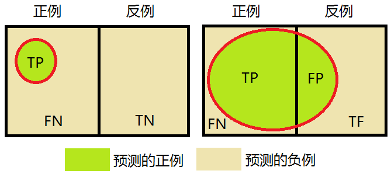
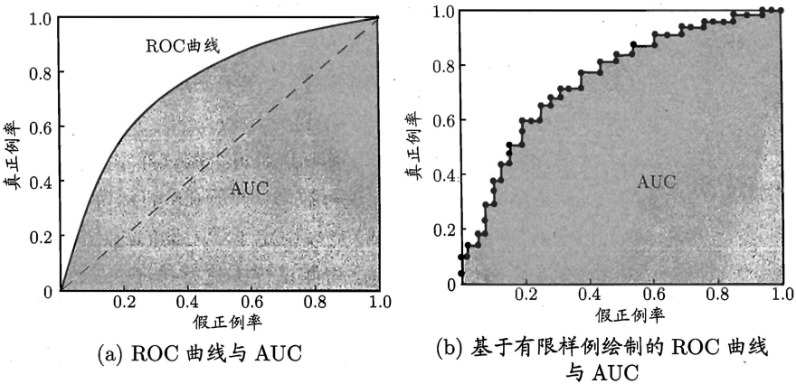

# 模型评估方法与性能度量

* [返回上层目录](../machine-learning-introduction.md)
* [模型评估方法](#模型评估方法)
  * [留出法](#留出法)
  * [k折交叉验证法](#k折交叉验证法)
  * [Bootstrap有放回采样法](#Bootstrap有放回采样法)
  * [调参与最终模型](#调参与最终模型)
* [模型性能度量](#模型性能度量)
  * [错误率与精度](#错误率与精度)
  * [查准率P、查全率R与PR曲线](#查准率P、查全率R与PR曲线)
  * [ROC](#ROC)
  * [AUC](#AUC)
    * [AUC的定义](AUC的定义)
    * [AUC的直觉解释](#AUC的直觉解释)
    * [AUC的两个性质](#AUC的两个性质)
    * [AUC计算代码](#AUC计算代码)
  * [ROC曲线和PR曲线的关系](#ROC曲线和PR曲线的关系)

# 模型评估方法

通常，我们可通过实验测试来对学习器的泛化误差进行评估并进而做出选择。为此，需使用一个"测试集"来测试学习器对新样本的判别能力，然后以测试集上的"测试误差"作为泛化误差的近似。通常我们假设测试样本也是从样本真实分布中独立同分布采样而得。但需注意的是，测试集应该尽可能与训练集互斥，即测试样本尽量不在训练集中出现、未在训练过程中使用过。

测试样本为什么要尽可能不出现在训练集中呢？为理解这一点，不妨考虑这样一个场景：老师出了10道习题供同学们练习，考试时老师又用同样的这10道题作为试题，这个考试成绩能否有效反映出同学们学得好不好呢？答案是否定的，可能有的同学只会做这10道题却能得高分。回到我们的问题上来，我们希望得到泛化性能强的模型，好比是希望同学们对课程学得很好、获得了对所学知识"举一反三"的能力；训练样本相当于给同学们练习的习题，测试过程则相当于考试。显然，若测试样本被用作训练了，则得到的将是过于"乐观"的估计结果。

可是，我们只有一个包含m个样例的数据集D = \{ (x1, y1),  (x2, y2), ... ,  (xm, ym) \}，既要训练，又要测试，怎样才能做到呢？答案是：**通过对D进行适当的处理，从中产生出训练集S和测试集T**。下面介绍几种常见的做法。

## 留出法

"留出法"（hold-out）直接将数据集D划分为两个互斥的集合，其中一个集合作为训练集S，另一个作为测试集T，即D=S∪T，S∩T=Ø。在S上训练出模型后，用T来评估其测试误差，作为对泛化误差的估计。

以二分类任务为例，假定D包含1000个样本，将其划分为S包含700个样本，T包含300个样本，用S进行训练后，如果模型在T上有90个样本分类错误，那么其错误率为(90/300) x 100% = 30%，相应的，精度为1- 30% = 70%。

需注意的是，训练/测试集的划分要尽可能保持数据分布的一致性，避免因数据划分过程引入额外的偏差而对最终结果产生影响，例如在分类任务中至少要保持样本的类别比例相似。如果从采样 的角度来看待数据集的划分过程，则保留类别比例的采样方式通常称为"**分层采样**" (stratified sampling).。例如通过对D进行分层采样而获得含70%样本的训练集S和含30%样本的测试集T，若D包含500个正例、500个反例，则分层采样得到的S应包含350个正例、350个反例，而T则包含150个正例和150个反例；若S、T中样本类别比例差别很大，则误差估计将由于训练/测试数据分布的差异而产生偏差。

另一个需注意的问题是，即使在给定训练/测试集的样本比例后，仍存在多种划分方式对初始数据集D进行分割。例如在上面的例子中，可以把D中的样本排序，然后把前350个正例放到训练集中，也可以把最后350个正例放到训练集中，……这些不同的划分将导致不同的训练/测试集，相应的，模型评估的结果也会有差别。因此，单次使用留出法得到的估计结果往往不够稳定可靠，在使用留出法时，一般要采用若干次随机划分、重复进行实验评估后取平均值作为留出法的评估结果。例如进行100次随机划分，每次产生一个训练/测试集用于实验评估，100次后就得到100个结果，而留出法返回的则是这100个结果的平均。

此外，我们希望评估的是用D训练出的模型的性能，但留出法需划分训练/测试集，这就会导致一个**窘境**：若令训练集S包含绝大多数样本，则训练出的模型可能更接近于用D训练出的模型，但由于T比较小，评估结果可能不够稳定准确；若令测试集T多包含一些样本，则训练集S与D差别更大了，被评估的模型与用D训练出的模型相比可能有较大差别，从而降低了评估结果的保真性。这个问题没有完美的解决方案，常见做法是将大约2/3 ~ 4/5的样本用于训练，剩余样本用于测试。

可从"偏差-方差" 的角度来理解：测试集小时，评估结果的方差较大，训练集小时，评估结果的偏差较大。一般而言，测试集至少应含30个样例[Mitchell, 1997]。

## k折交叉验证法

"交叉验证法"（cross validation）先将数据集D划分为k个大小相似的互斥子集，即D = D1 ∪ D2 ∪ ... ∪ Dk，Di ∩ Dj = Ø (i ≠ j)。每个子集Di都尽可能保持数据分布的一致性，即从D中通过分层采样得到。然后，每次用k-1个子集的并集作为训练集，余下的那个子集作为测试集；这样就可获得k组训练/测试集，从而可进行k次训练和测试，最终返回的是这k个测试结果的均值。显然，交叉验证法评估结果的稳定性和保真性在很大程度上取决于k的取值，为强调这一点，通常把交叉验证法称为"k折交叉验证"（k-fold cross validation）。k最常用的取值是10，此时称为10折交叉验证；其他常用的k值有5、20等。下图给出了10折交叉验证的示意图。


与留出法相似，将数据集D划分为k个子集同样存在多种划分方式。为减小因样本划分不同而引入的差别，k折交叉验证通常要随机使用不同的划分重复p次，最终的评估结果是这p次k折交叉验证结果的均值，例如常见的有“10次10折交叉验证”。“10次10折交又验证法”与"100次留出法"都是进行了100次训练/测试。

假定数据集D中包含m个样本，若令k=m，则得到了交叉验证法的一个特例：留一法（Leave-One-Out，简称LOO）。显然，留一法不受随机样本划分方式的影响，因为m个样本只有唯一的方式划分为m个子集一一每个子集包含一个样本；留一法使用的训练集与初始数据集相比只少了一个样本，这就使得在绝大多数情况下，留一法中被实际评估的模型与期望评估的用D训练出的模型很相似。因此，留一法的评估结果往往被认为比较准确。然而，留一法也有其缺陷：在数据集比较大时，训练m个模型的计算开销可能是难以忍受的（例如数据集包含1百万个样本，则需训练1百万个模型），而这还是在未考虑算法调参的情况下。另外，留一法的估计结果也未必永远比其他评估方法准确；"**没有免费的午餐**"定理对实验评估方法同样适用。

## Bootstrap有放回采样法

我们希望评估的是用D训练出的模型。但在留出法和交叉验证法中，由于保留了一部分样本用于测试，因此实际评估的模型所使用的训练集比D小，这必然会引入一些因训练样本规模不同而导致的估计偏差。留一法受训练样本规模变化的影响较小，但计算复杂度又太高了。有没有什么办法可以减少训练样本规模不同造成的影响，同时还能比较高效地进行实验估计呢? 

"有放回采样法"（bootstrapping）是一个比较好的解决方案，它直接以有放回采样法 (bootstrap sampling)为基础[Efron and Tibshirani, 1993]。给定包含m个样本的数据集D，我们对它进行采样产生数据集D'：每次随机从D中挑选一个样本，将其拷贝放入D'，然后再将该样本放回初始数据集D中，使得该样本在下次采样时仍有可能被采到；这个过程重复执行m次后，我们就得到了包含m个样本的数据集D’，这就是有放回采样的结果。显然，D中有一部分样本会在D'中多次出现，而另一部分样本不出现。可以做一个简单的估计，样本在m次采样中始终不被采到的概率是
$$
\mathop{\text{lim}}_{m\rightarrow \infty}\left( 1-\frac{1}{m} \right)^m\rightarrow \frac{1}{e}\approx 0.368
$$
即通过有放回采样，初始数据集D中约有36.8%的样本未出现在采样数据集D'中。于是我们可将D'用作训练集，D-D'用作测试集；这样，实际评估的模型与期望评估的模型都使用m个训练、样本，而我们仍有数据总量约1/3的、没在训练集中出现的样本用于测试。这样的测试结果，亦称"包外估计"（out-of-bag estimate）。

**有放回采样法在数据集较小、难以有效划分训练/测试集时很有用**；此外，**有放回采样法能从初始数据集中产生多个不同的训练集，这对集成学习等方法有很大的好处**。然而，有放回采样法产生的数据集**改变了初始数据集的分布，这会引入估计偏差**。因此，在初始数据量足够时，留出法和交叉验证法更常用一些。

## 调参与最终模型

大多数学习算法都有些参数需要设定，参数配置不同，学得模型的性能往往有显著差别。因此，在进行模型评估与选择时，除了要对适用学习算法进行选择，还需对算法参数进行设定，这就是通常所说的"参数调节"或简称"调参"。

读者可能马上想到，调参和算法选择没什么本质区别：对每种参数配置都训练出模型，然后把对应最好模型的参数作为结果。这样的考虑基本是正确的，但有一点需注意：学习算法的很多参数是在实数范围内取值，因此，对每种参数配置都训练出模型来是不可行的。现实中常用的做法，是对每个参数选定一个范围和变化步长，例如在[0, 0.2]范围内以0.05为步长，则实际要评估的候选参数值有5个，最终是从这5个候选值中产生选定值。显然，这样选定的参数值往往不是"最佳"值，但这是在计算开销和性能估计之间进行折中的结果，通过这个折中，学习过程才变得可行。事实上，即便在进行这样的折中后，调参往往仍很困难。可以简单估算一下：假定算法有3个参数，每个参数仅考虑5个候选值，这样对每一组训练/测试集就有5^3 = 125个模型需考察；很多强大的学习算法有大量参数需设定，这将导致极大的调参工程量，以至于在不少应用任务中， 参数调得好不好往往对最终模型性能有关键性影响。

给定包含m个样本的数据集D，在模型评估与选择过程中由于需要留出一部分数据进行评估测试，事实上我们只使用了一部分数据训练、模型。因此，在模型选择完成后，学习算法和参数配置己选定，此时应该用数据集D重新训练模型。这个模型在训练过程中使用了所有m个样本，这才是我们最终提交给用户的模型。

另外，需注意的是，我们通常把学得模型在实际使用中遇到的数据称为测试数据，为了加以区分，模型评估与选择中用于评估测试的数据集常称为"**验证集**"（validation set）。例如，在研究对比不同算法的泛化性能时，我们用**测试集**上的判别效果来估计模型在实际使用时的泛化能力，而把训练数据另外划分为**训练集和验证集**，**基于验证集上的性能来进行模型选择和调参**。

# 模型性能度量

对学习器的泛化性能进行评估，不仅需要有效可行的实验估计方法，还需要有衡量模型泛化能力的评价标准，这就是性能度量（performance measure）。

性能度量反映了任务需求，在对比不同模型的能力时，使用不同的性能度量往往会导致不同的评判结果。这意味着模型的"好坏"是相对的，什么样的模型是好的，不仅取决于算法和数据，还决定于任务需求。

在预测任务中，给定样例集$D=\{ (x_1, y_1),  (x_2, y_2), ... ,  (x_m, y_m) \}$，其中$y_i$是示例$x_i$的真实标记。要评估学习器f的性能，就要把学习器预测结果f(x)与真实标记y进行比较。

**回归任务**最常用的性能度量是"均方误差mse"（mean squared error）
$$
E(f; D)=\frac{1}{m}\sum_{i=1}^m(f(x_i)-y_i)^2
$$
更一般的，对于数据分布D和概率密度函数p(·)，均方误差可描述为
$$
E(f; D)=\int_{x\sim D}(f(x) - y)^2p(x)dx
$$
本节下面主要介绍**分类任务**中常用的性能度量。

## 错误率与精度

错误率和精度是分类任务中最常用的两种性能度量，既适用于二分类任务，也适用于多分类任务。错误率是分类错误的样本数占样本总数的比例，精度则是分类正确的样本数占样本总数的比例，对样例集D，分类错误率定义为
$$
E(f; D)=\frac{1}{m}\sum_{i=1}^mI(f(x_i)\neq y_i)
$$
精度则定义为
$$
\begin{aligned}
\text{acc}&=\frac{1}{m}\sum_{i=1}^mI(f(x_i)=y_i)\\
&=1-E(f; D)
\end{aligned}
$$
更一般的，对于数据分布D和概率密度函数$p(\cdot)$，错误率与精度可分别描述为
$$
E(f; D)=\int_{x\sim D}I(f(x)\neq y)p(x)dx
$$

$$
\begin{aligned}
\text{acc}(f;D)=&\int_{x\sim D}I(f(x)\neq y)p(x)dx\\
=&1-E(f;D)
\end{aligned}
$$

## 查准率P、查全率R与PR曲线

错误率和精度虽常用，但并不能满足所有任务需求。以西瓜问题为例，假定瓜农拉来一车西瓜，我们用训练好的模型对这些西瓜进行判别，显然，错误率衡量了有多少比例的瓜被判别错误。但是若我们关心的是"**挑出的西瓜中有多少比例是好瓜**"，或者"**所有好瓜中有多少比例被挑了出来**”，那么错误率显然就不够用了，这时需要使用其他的性能度量。

类似的需求在信息检索、Web搜索等应用中经常出现，例如在信息检索中，我们经常会关心"检索出的信息中有多少比例是用户感兴趣的"，“用户感兴趣的信息中有多少被检索出来了”。“查准率（precision）”与“查全率（recall）"是更为适用于此类需求的性能度量。

对于二分类问题，可将样例根据其真实类别与学习器预测类别的组合划分为真正例（true positive）、假正例（false positive）、真反例（true negative）、假反例（false negative）四种情形，令TP、FP、TN、FN分别表示其对应的样例数，则显然有TP+FP+TN+FN=样例总数。分类结果的"混淆矩阵"（confusion matrix）如下表所示：


查准率P与查全率R分别定义为
$$
\begin{aligned}
&P=\frac{\text{TP}}{\text{TP}+\text{FP}}\\
&R=\frac{\text{TP}}{\text{TP}+\text{FN}}
\end{aligned}
$$
查准率亦称**准确率**，查全率亦称**召回率**。



**怎么理解查准率与查全率呢？**

**其实很简单，查准率是站在预测结果的角度来考虑正确率的，而查全率是站在数据本身的角度来考虑正确率的。**

如上图所示，

- 上图左图中
  - 对于预测结果来说，我预测的正例中全部都是实际的正例，所以我的查准率很高，100%
  - 对于数据本身来说，实际的正例中只有一小部分被预测为了正例，所以查全率很低，约7%
- 上图右图中
  - 对于预测结果来说，我预测的正例中有部分是实际的负例，所以我的查准率并不是100%，而是约75%
  - 对于数据本身来说，实际的正例中有大部分被预测为了正例，所以查全率很高，约80%

查准率和查全率是一对矛盾的度量。一般来说，查准率高时，查全率往往偏低；而查全率高时，查准率往往偏低。

例如，若希望将好瓜尽可能多地选出来（提高查全率），则可通过增加选瓜的数量来实现，如果将所有西瓜都选上，那么所有的好瓜也必然都被选上了，这样查全率就是100%了，但这样查准率就会较低；若希望选出的瓜中好瓜比例尽可能高（提高查准率），则可只挑选最有把握的瓜， 但这样就难免会漏掉不少好瓜，使得查全率较低。通常只有在一些简单任务中，才可能使查全率和查准率都很高。

在很多情形下，我们可根据学习器的预测结果（为正例的概率）对样例进行排序，排在前面的是学习器认为"最可能 "是正例的样本，排在最后的则是学习器认为"最不可能"是正例的样本。按此顺序逐个把样本作为正例进行预测，则每次可以计算出当前的查全率、 查准率。以查准率为纵轴、查全率为横轴作图 ，就得到了查准率-查全率曲线，简称 " P-R曲线"，显示该曲线的图称为" P-R图"。下图给出了一个示意图。

那么**P-R曲线**是怎么来的呢？

算法对样本进行分类时（如逻辑回归），都会有置信度，即表示该样本是正样本的概率，比如99%的概率认为样本A是正例，1％的概率认为样本B是正例。通过选择合适的阈值，比如50%，对样本进行划分，概率大于50%的就认为是正例，小于50%的就是负例。这个大家已经很清楚了。

通过置信度就可以对所有样本进行排序，再逐个样本的选择阈值（阈值从100%到0%），在该样本之前的都属于正例，该样本之后的都属于负例。每一个样本作为划分阈值时，都可以计算对应的precision和recall，那么就可以以此绘制曲线。很多书上、博客上给出的P-R曲线，都长这样


当然，这种曲线是有可能的。但是仔细琢磨就会发现一些规律和一些问题。

根据逐个样本作为阈值划分点的方法，可以推敲出，recall值是递增的（但并非严格递增），随着划分点左移，正例被判别为正例的越来越多，不会减少。而精确率precision并非递减，而是有可能振荡的，虽然正例被判为正例的变多，但负例被判为正例的也变多了，因此precision会振荡，但整体趋势是下降。

另外P-R曲线肯定会经过（0,0）点，比如讲所有的样本全部判为负例，则TP=0，那么P=R=0，因此会经过（0,0）点，但随着阈值点左移，precision初始很接近1，recall很接近0，因此有可能从（0,0）上升的线和坐标重合，不易区分。如果最前面几个点都是负例，那么曲线会从（0,0）点开始逐渐上升。

**曲线最终不会到（1,0）点**。很多P-R曲线的终点看着都是（1,0）点，这可能是因为负例远远多于正例。

最后一个点表示所有的样本都被判为正例，因此FN=0，所以recall = TP/(TP + FN) = 1, 而FP = 所有的负例样本数，因此precision = TP/(TP+FP) = 正例的占所有样本的比例，故除非负例数很多，否则precision不会为0。如果正例负例各占一半，则precision为0.5。

因此，较合理的P-R曲线应该是（曲线一开始被从（0，0）拉升到（0,1），并且前面的都预测对了，全是正例，因此precision一直是1,）


另外，如果有个划分点可以把正负样本完全区分开，那么P-R曲线就是整个1*1的面积。

总之，P-R曲线应该是从（0,0）开始画的一条曲线，切割1*1的正方形，得到一块区域。

假设有10个数据被判定且排序如下，则P和R的值为：

| 判定排序 | P     | R    |
| -------- | ----- | ---- |
| 真       | 100%  | 20%  |
| 真       | 100%  | 40%  |
| 真       | 100%  | 60%  |
| 假       | 75%   | 60%  |
| 真       | 80%   | 80%  |
| 真       | 83.4% | 100% |
| 假       | 57.1% | 100% |
| 假       | 62.5% | 100% |
| 假       | 55.5% | 100% |
| 假       | 50%   | 100% |

可以看着上表来体会一下前面的话。

**P-R图直观地显示出学习器在样本总体上的查全率、查准率**。在进行比较时，若一个学习器的P-R曲线被另一个学习器的曲线完全"包住"，则可断言后者的性能优于前者，例如上上图中学习器A的性能优于学习器C；如果两个学习器的P-R曲线发生了交叉，例如上上图中的A与B，则难以一般性地断言两者孰优孰劣，只能在具体的查准率或查全率条件下进行比较。然而，在很多情形下，人们往往仍希望把学习器A与B比出个高低。这时一个**比较合理的判据是比较P-R曲线下面积的大小，它在一定程度上表征了学习器在查准率和查全率上取得相对"双高"的比例**。但这个值不太容易估算，因此人们设计了一些综合考虑查准率、查全率的性能度量。

“**平衡点**”（Break-Even Point）就是这样一个度量，它是" 查准率=查全率"时的取值，例如上上图中学习器C的BEP是0.64，而基于BEP的比较，可认为学习器A优于B。

但BEP还是过于简化了些，更常用的是**F1度量**：
$$
F1=\frac{2\times P\times R}{P+R}=\frac{2\times TP}{\text{样例总数}+TP-TN}
$$
F1是基于查准率和查全率的调和平均定义的：
$$
\frac{1}{F1}=\frac{1}{2}\cdot \left\{ \frac{1}{P} + \frac{1}{R} \right\}
$$
与算术平均$(P+R)/2$和几何平均$\sqrt{PR}$相比，调和平均更重视较小值。

在一些应用中，对查准率和查全率的重视程度有所不同。例如在商品推荐系统中，为了尽可能少打扰用户，更希望推荐内容确是用户感兴趣的，此时查准率更重要；而在逃犯信息检索系统中，更希望尽可能少漏掉逃犯，此时查全率更重要。$F1$度量的一般形式——$F_{\beta}$，能让我们表达出对查准率/查全率的不同偏好，它定义为
$$
F_{\beta}=\frac{(1+\beta^2)\times P\times R}{(\beta^2\times P)+R}
$$
其中，$\beta>0$度量了查全率对查准率的相对重要性。$\beta=1$时退化为标准的$F1$；$\beta>1$时查全率有更大影响；$\beta<1$时查准率有更大影响。

$F_{\beta}$则是计算调和平均：
$$
\frac{1}{F_{\beta}}=\frac{1}{1+\beta^2}\cdot \left\{ \frac{1}{P} + \frac{\beta^2}{R} \right\}
$$
与算术平均$(P+R)/2$和几何平均$\sqrt{PR}$相比，调和平均更重视较小值。

## ROC

很多学习器是为测试样本产生一个实值或概率预测，然后将这个预测值与一个分类阈值进行比较，若大于阈值则分为正类，否则为反类。例如，神经网络在一般情形下是对每个测试样本预测出一个[0.0, 1.0]之间的实值，然后将这个值与0.5进行比较，大于0.5则判为正例，否则为反例。这个实值或概率预测结果的好坏，直接决定了学习器的泛化能。实际上根据这个实值或概率预测结果，我们可将测试样本进行排序，"最可能"是正例的排在最前面，"最不可能"是正例的排在最后面这样，分类过程就相当于在这个排序中以某个"截断点"将样本分为两部分，前一部分判作正例，后一部分则判作反例。

在不同的应用任务中，我们可根据任务需求来采用不同的截断点，例如若我们更重视"查准率"，则可选择排序中靠前的位置进行截断;若更重视"查全率"，则可选择靠后的位置进行截断。因此，**排序本身的质量好坏，体现了综合考虑学习器在不同任务下的"期望泛化性能"的好坏，或者说"一般情况下"泛化性能的好坏**。ROC曲线则是从这个角度出发来研究学习器泛化性能的有力工具。

ROC全称是"受试者工作特征"（Receiver Operating Characteristic）曲线，它源于"二战"中用于敌机检测的雷达信号分析技术，二十世纪六七十年代开始被用于一些心理学、医学检测应用中，此后被引入机器学习领域[Spackman, 1989]。与上节中介绍的P-R曲线相似。我们根据学习器的预测结果对样例进行排序，**按此顺序逐个把样本作为正例进行预测（正例阈值从100%到0%）**，每次计算出两个重要量的值，分别以它们为横、纵坐标作图，就得到了"ROC曲线”。与P-R曲线使用查准率、查全率为纵、横轴不同，ROC曲线的纵轴是"真正例率"（True Positive Rate，简称TPR），横轴是"假正例率"（False PositiveRate，简称FPR），基于前面的混淆矩阵中的符号，


两者分别定义为

- TPR（真正例率）：在所有实际为正例的样本中，被**正确地**判断为正例之比率

$$
\text{TPR}=\frac{\text{TP}}{\text{TP}+\text{FN}}
$$

- FPR（假正例率）：在所有实际为负例的样本中，被**错误地**判断为正例之比率

$$
\text{FPR}=\frac{\text{FP}}{\text{FP}+\text{TN}}
$$

显示ROC曲线的图称为"ROC图”。下图（a）给出了一个示意图，显然 ，对角线对应于"随机猜测"模型，而点(0, 1)则对应于将所有正例排在所有反例之前的“理想模型”。



现实任务中通常是利用有限个测试样例来绘制ROC图，此时仅能获得有限个（真正例率，假正例率）坐标对，无法产生上图(a) 中的光滑ROC曲线，只能绘制出如上图(b)所示的近似ROC曲线。绘图过程很简单：给定 $m^+$个正例和$m^-$个反例，根据学习器预测结果对样例进行排序，然后把分类阔值设为最大，即把所有样例均预测为反例，此时真正例率和假正例率均为0，在坐标$(0, 0)$处标记一个点。然后，将分类阐值依次设为每个样例的预测值，即依次将每个样例划分为正例。设前一个标记点坐标为$(x, y)$，当前若为真正例，则对应标记点的坐标为$(x, y+1/m^+)$；当前若为假正例，则对应标记点的坐标为$(x+1/m^-, y)$，然后用线段连接相邻点即得。 

## AUC

### AUC的定义

进行学习器的比较时， 与P-R图相似， 若一个学习器的ROC曲线被另一个学习器的曲线完全"包住"，则可断言后者的性能优于前者；若两个学习器的ROC曲线发生交叉，则难以一般性地断言两者孰优孰劣。此时如果一定要进行比较，则较为合理的判据是**比较ROC曲线下的面积，即AUC** (Area Under ROC Curve)，如上图所示。

从定义可知，AUC可通过对ROC曲线下各部分的面积求和而得。假定ROC曲线是由坐标为$\{ (x_1, y_1), (x_2, y_2), ... , (x_m, y_m) \}$的点按序连接而形成$(x_1 = 0, x_m = 1)$；参见上图(b)，则AUC可估算为
$$
\text{AUC}=\frac{1}{2}\sum_{i=1}^{m-1}(x_{i+1}-x_i)\cdot (y_i+y_{i+1})
$$
形式化地看，AUC考虑的是样本预测的排序质量，因此它与排序误差有紧密联系。给定$m^+$个正例和$m^-$个反例，令$D^+$和$D^-$分别表示正、反例集合，则排序"损失"(loss)定义为
$$
\text{loss}_{\text{rank}}=\frac{1}{m^+m^-}\sum_{x^+\in D^+}\sum_{x^-\in D^-}\left( I(f(x^+)\leqslant f(x^-))+\frac{1}{2}I(f(x^+) = f(x^-)) \right)
$$
即考虑每一对正、反例，若正例的预测值小于反例，则记一个“罚分”，若相等，则记0.5个“罚分”。容易看出，loss_rank对应的是ROC曲线之上的面积：若一个正例在ROC曲线上对应标记点的坐标为$(x, y)$，则$x$恰是排序在其之前的反例所占的比例，即假正例率。因此有  
$$
\text{AUC}=1-\text{loss}_{\text{rank}}
$$

### AUC的直觉解释

AUC的另一种**直觉解释：随机取一对正负样本，正样本得分大于负样本的概率**。

怎么理解：我们都知道AUC是ROC曲线下方的面积，ROC曲线的横轴是真正例率，纵轴是假正例率。我们可以按照如下的方式理解一下：首先偷换一下概念，意思还是一样的，任意给定一个负样本，所有正样本的score中有多大比例是大于该负类样本的score？那么对每个负样本来说，有多少的正样本的score比它的score大呢？是不是就是当结果按照score排序，阈值恰好为该负样本score时的真正例率TPR？理解到这一层，二者等价的关系也就豁然开朗了。ROC曲线下的面积或者说AUC的值 与 测试任意给一个正类样本和一个负类样本，正类样本的score有多大的概率大于负类样本的score是等价的。

概率解释的证明：[深入理解AUC](https://tracholar.github.io/machine-learning/2018/01/26/auc.html#%E6%A6%82%E7%8E%87%E8%A7%A3%E9%87%8A%E7%9A%84%E8%AF%81%E6%98%8E)

### AUC的两个性质

a、AUC的排序特性

根据上述概率解释，AUC实际上在说一个模型把正样本排在负样本前面的概率！ 所以，AUC常用在排序场景的模型评估，比如搜索和推荐等场景！ 这个解释还表明，如果将所有的样本的得分都加上一个额外的常数，并不改变这个概率，因此AUC不变！ 因此，在广告等需要绝对的点击率场景下，AUC并不适合作为评估指标，而是用logloss等指标。

b、AUC对正负样本比例不敏感

这个问题的本质原因，在于横轴FPR只关注负样本，与正样本无关；纵轴TPR只关注正样本，与负样本无关。所以横纵轴都不受正负样本比例影响，积分当然也不受其影响。

### AUC计算代码

```python
# 本代码的目的：预测值为离散标签和连续概率，auc值是否有区别及原因
from sklearn import metrics
import matplotlib.pyplot as plt

# 实际的label
label = [1, 1, 1, 1, 0, 0, 0, 0]
# 预测的label（离散）
pred = [1, 1, 1, 0, 0, 0, 1, 1]
# 预测的为正类的概率值（连续）
pred_prob = [0.9999, 0.9, 0.95, 0.01, 0.02, 0.1, 0.79, 0.89]  # 0.75
pred_prob = [0.9999, 0.9, 0.95, 0.01, 0.02, 0.1, 0.79, 0.99989]  # 0.625
pred_prob = [0.9999, 0.9, 0.95, 0.01, 0.02, 0.1, 0.79, 0.9999989]  # 0.5625

# 计算两种auc
auc1 = metrics.roc_auc_score(label, pred)
auc2 = metrics.roc_auc_score(label, pred_prob)
print(auc1)  # 0.625
print(auc2)  # 0.75 和 0.625 和 0.5625

# 画roc曲线
tp_rate_y = []
fp_rate_x = []
for rate in [1.0] + sorted(pred_prob, reverse=True) + [0.0]:
    pred_label = [1 if i >= rate else 0 for i in pred_prob]
    tp, fn, fp, tn = (0, 0, 0, 0)
    for index in range(len(label)):
        if label[index] == 1:
            if pred_label[index] == 1:
                tp += 1
            else:
                fn += 1
        else:
            if pred_label[index] == 1:
                fp += 1
            else:
                tn += 1
    tp_rate_y.append(tp / (tp + fn))
    fp_rate_x.append(fp / (fp + tn))
# 画roc曲线图
plt.figure(figsize=(3.5, 3))
# 预测值为连续概率的roc曲线图
plt.plot(fp_rate_x, tp_rate_y, '-o')
# 预测值为离散标签的roc曲线图，可直接计算画出
plt.plot([0.0] + [0.5] + [1.0], [0.0] + [0.75] + [1.0], '--x')
plt.show()
```

如下图所示，可以看出，`预测值为离散标签`的auc只是`预测值为连续概率`的auc的化简，并不能精确反映出模型的排序能力，而`预测值为连续概率`的auc并不一定就比`预测值为离散标签`的auc高，但可以精确反应出模型的排序能力。


#### AUC的计算和sql代码

[深入理解AUC](https://tracholar.github.io/machine-learning/2018/01/26/auc.html#%E6%A6%82%E7%8E%87%E8%A7%A3%E9%87%8A%E7%9A%84%E8%AF%81%E6%98%8E)

===

[深入理解AUC](https://tracholar.github.io/machine-learning/2018/01/26/auc.html)

## ROC曲线和PR曲线的关系

在ROC空间，ROC曲线越凸向左上方向效果越好。与ROC曲线左上凸不同的是，PR曲线是右上凸效果越好。

ROC和PR曲线都被用于评估机器学习算法对一个给定数据集的分类性能，每个数据集都包含固定数目的正样本和负样本。而ROC曲线和PR曲线之间有着很深的关系。

- 定理1：对于一个给定的包含正负样本的数据集，ROC空间和PR空间存在一一对应的关系，也就是说，如果recall不等于0，二者包含完全一致的混淆矩阵。我们可以将ROC曲线转化为PR曲线，反之亦然。
- 定理2：对于一个给定数目的正负样本数据集，一条曲线在ROC空间中比另一条曲线有优势，当且仅当第一条曲线在PR空间中也比第二条曲线有优势。（这里的“一条曲线比其他曲线有优势”是指其他曲线的所有部分与这条曲线重合或在这条曲线之下。）

证明过程见文章《[The Relationship Between Precision-Recall and ROC Curves](http://pages.cs.wisc.edu/~jdavis/davisgoadrichcamera2.pdf)》

当正负样本差距不大的情况下，ROC和PR的趋势是差不多的，但是当负样本很多的时候，两者就截然不同了，ROC效果依然看似很好，但是PR上反映效果一般。解释起来也简单，假设就1个正例，100个负例，那么基本上TPR可能一直维持在100左右，然后突然降到0。如图，


(a)(b)分别为正负样本1:1时的ROC曲线和PR曲线，二者比较接近。而(c)(d)的正负样本比例为1:1，这时ROC曲线效果依然很好，但是PR曲线则表现的比较差。这就说明PR曲线在正负样本比例悬殊较大时更能反映分类的性能。

两者都要看光不光滑，如果不光滑说明有很大问题是过拟合。

# 参考资料

* 《机器学习》周志华

”性能度量“参考了此书对应章节。

* [P-R曲线深入理解](https://blog.csdn.net/b876144622/article/details/80009867)

”查准率P、查全率R与PR曲线“一节参考了此博客。

* [ROC曲线和PR(Precision-Recall)曲线的联系](https://blog.csdn.net/iamzhangzhuping/article/details/50716207)

”ROC曲线和PR曲线的关系“一节参考了此博客。

===

* [在机器学习中，L2正则化为什么能够缓过拟合？](https://www.zhihu.com/question/389848505/answer/1179908586)

* [在机器学习中，L2正则化为什么能够缓过拟合？](https://www.zhihu.com/question/389848505/answer/1179829995)

* [精确率、召回率、F1 值、ROC、AUC 各自的优缺点是什么？](https://www.zhihu.com/question/30643044/answer/1205433761)

