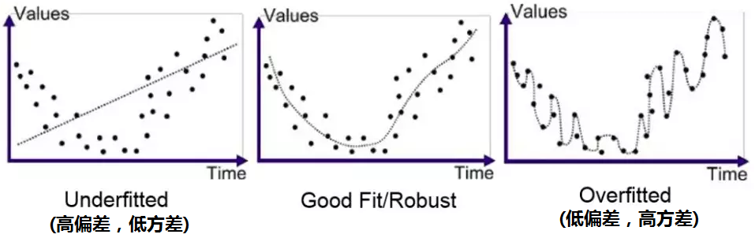
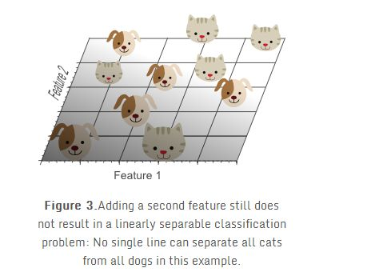
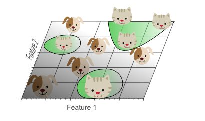
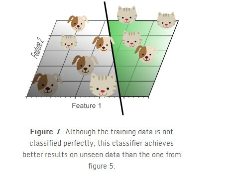
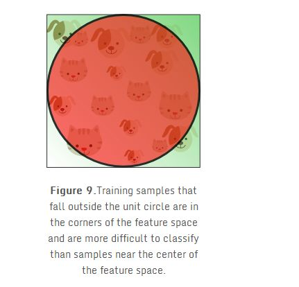
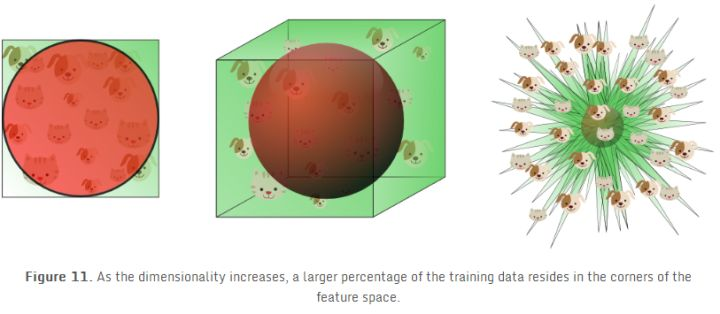

# 过拟合与模型复杂度

* [返回上层目录](../machine-learning-introduction.md)
* [直观理解过拟合与欠拟合](#直观理解过拟合与欠拟合)
* [训练误差与测试误差](#训练误差与测试误差)
* [过拟合与模型选择](#过拟合与模型选择)
* [VC维](#VC维)
* [偏差与方差](#偏差与方差)
* [维数灾难](#维数灾难)

# 直观理解过拟合与欠拟合

在正式讲这两个概念之前我们先来看一个故事：假设你想要习英语但之前对英语一无所知，不过曾听说过莎士比亚是一个位伟大的英国作家。你想要学英语的话，当然是将自己泡在一个图书馆中，背诵他的相关作品，用他的作品学习英语。一年的学习结束后，你走出图书馆，来到了纽约，并向你看到的第一个人打了声招呼：“嗨，愿光明与你同在！” 那人用奇怪的眼光看着你，嘴里嘟囔着“神经病”。你故作镇定地又试了一遍：“亲爱的夫人，今天是何等的优雅呢？” 你再次收获了失败，还把那个人吓跑了。当你三次尝试都失败后，你心烦意乱的说道：“啊，此乃何等之遗憾，何等之悲伤！”确实很遗憾，因为你犯下了一个建模当中最基础的错误之一：**对训练集的过度拟合。**

在数据科学学科中，**过拟合（overfit）模型被解释为一个从训练集（training set）中得到了高方差（variance）和低偏差（bias），导致其在测试数据中得到低泛化的模型**。为了更好地理解这个复杂的定义，我们试着将它理解为去尝试学习英语的过程。我们要构建的这一模型代表了如何用英语交流。把莎士比亚的所有作品作为训练数据，把在纽约的对话作为测试集(testing set)。如果我们把社会认可程度来衡量这一模型的表现的话，那么事实表明我们的模型将不能够有效推广到测试集上。但是，模型中的方差和偏差又是什么呢？

**方差**可以理解为为了响应训练集时模型所产生的变化。若我们只是单纯的去记忆训练集，我们的模型将具有高方差：它高度取决于训练集数据。如果我们读的所有作品来自J.K.罗琳，而不是莎士比亚，这个模型将变得完全不同。当这样一个具有高方差的模型应用到一个新的测试集上时，这个模型将无法获得很好的表现。因为在没有训练集数据的情况下模型将迷失方向。就好比一个学生只是单纯复习了教科书上列出的问题，但这却无法帮助他解决一些实际的问题。

**偏差**作为与方差相对的一个概念，表示了我们基于数据所做出的假设的强度（有效性）。在前文我们尝试学习英语的例子中，我们基于一个没有初始化的模型，并把作家的作品当作学习语言的教科书。低偏差看似是一个正向的东西，因为我们可能会有这样的想法：我们并不需要去带着倾向性思维看待我们的数据。然而我们却需要对数据表达的完整性持怀疑态度。因为任何自然处理流程都会生成噪点，并且我们无法自信地保证我们的训练数据涵盖了所有这些噪点。所以我们在开始学习英语之前需要明白，我们无法通过死记硬背莎士比亚的名著来熟练掌握英语。

总体来说，**偏差关系到数据被忽略的程度，而方差则关系到模型和数据的依赖程度**。在所有的建模过程中，偏差和方差之间永远存在着一个**权衡**问题，并且需要我们针对实际情况找到一个最佳的平衡点。偏差和方差这两个概念可应用于任何从简单到复杂的模型算法，对于数据科学家来说，它们至关重要。

刚才我们了解到了**过拟合的模型具有高方差、低偏差的特点**。那么相反的情况：**低方差、高偏差的模型被称作欠拟合**。相较于之前与训练数据紧密贴合的模型，一个**欠拟合模型忽视了从训练数据中获得的信息，进而使其无法找到输入和输出数据之间的内在联系**。让我们用之前尝试学习英语的例子来解释它，这一次我们试着去对之前我们用到的模型做出一些假设，并且我们改成使用《老友记》全集作为这一次学习英语的训练数据。为了避免我们之前犯过的错误，这次我们提前作出假设：只有那些以最常用的词：the, be, to, of, and, a为开头的句子才是重要的。当学习的时候，我们不去考虑别的句子，并且我们相信这能够构建更有效的模型。

经过了漫长的训练后，我们又再一次站在了纽约的大街上。这一次，我们的表现相对好了一点点，但是别人依然无法听懂我们，最后，我们还是以失败告终。尽管我们学习到了一些英语知识，并且能够组织一些数量有限的句子，由于从训练数据上造成的高偏差，我们无法从中学到英语的基础结构和语法。虽然这个模型没有受到高方差带来的影响，但是相对于之前的尝试来说，显得又太矫枉过正，拟合不充分！



对数据的过度关注会导致过度拟合，对数据的忽视又会导致欠拟合，那么我们到底该怎么办呢？一定有一个能找到最佳平衡点的办法！值得庆幸的是，在数据科学中，有一个很好的解决方案，叫作**“验证（Validation）”**。用上面的例子来说，我们只使用了一个训练集和一个测试集。这意味着我们无法在实战前知道我们的模型的好坏。最理想的情况是，我们能够用一个模拟测试集去对模型进行评估，并在真实测试之前对模型进行改进。这个模拟测试集被称作**验证集**（validation set），是模型研发工作中非常关键的部分。

两次失败的英语学习过后，我们学聪明了，这一次我们决定使用一个测试集。我们这次同时使用Shakespeare的作品和《老友记》，因为我们从过去的经验中认识到越多的数据总是能够改善这个模型。不同的是，在这次训练结束以后，我们不直接走到街上，我们先找到一群朋友，每周和他们相聚，并以用英语来和他们交谈的形式来评估我们的模型。刚开始的第一周，由于我们的英语水平还很差，我们很难融入到对话当中。然而这一切仅仅是被模拟成一个验证集，每当我们意识到错误后，就能够调整我们的模型。最后，当我们能够适应并掌控与朋友们的对话练习时，我们相信已经是准备好面对测试集的时候了。于是，我们再一次大胆的走了出去，这一次我们成功了！我们非常适应在真实的情况下和别人交谈，这得益于一个非常关键的因素：验证集，是它改善并优化了我们的模型。

英语学习只是一个相对简易的例子。在众多真实的数据科学模型中，考虑到在一个验证集上出现过拟合的可能性，通常会使用到非常多的验证集！这样的解决办法称之为交叉验证（corss-validation），这个方法要求我们将训练集拆分成多个不同的子集，或者在数据足够多的条件下来使用多个验证集。交叉验证法这一个概念涵盖着问题的方方面面。现在当你碰到一个和过度拟合vs欠拟合，偏差vs方差这几个概念有关的问题的时候，你脑海中将会浮现出一个概念框架，这个框架将有助于你去理解并且解决这个问题！

数据科学看似复杂，但它其实都是通过一系列基础的模块搭建而成的。其中的一些概念已经在这篇文章中提到过，它们是：

- 过拟合：过度依赖于训练数据
- 欠拟合：无法获取训练数据中的存在的关系
- 高方差：一个模型基于训练数据产生了剧烈的变化
- 高偏差：一个忽视了训练数据的模型假设
- 过度拟合和欠拟合造成对测试集的低泛化性
- 使用验证集对模型进行校正可以避免实际过程中造成的欠拟合和过度拟合

数据科学和其它科技领域其实与我们的日常生活息息相关。在一些与现实有关的例子的帮助下，我们可以很好地解释并理解这些概念。一旦我们了解了一个框架，我们就能够用技术来处理所有的细节，从而解决难题。

# 训练误差与测试误差

机器学习的目的是使学到的模型不仅对已知数据而且对**未知数据**都能有很好的预测能力。

不同的学习方法会给出不同的模型。当损失函数给定时，基于损失函数的模型的训练误差（training error）和模型的测试误差（testerror）就自然成为学习方法评估的标准。注意，统计学习方法具体采用的损失函数未必是评估时使用的损失函数。当然，让两者一致是比较理想的。

假设学习到的模型是$Y=f(X)$，**训练误差**是模型$Y=f(X)$关于训练数据集的平均损失：
$$
R_{\text{emp}}(f)=\frac{1}{N}\sum_{i=1}^NL(y_i,f(x_i))
$$
其中$N$是训练样本容量。

**测试误差**是模型关于测试数据集的平均损失：
$$
R_{\text{test}}(f)=\frac{1}{N'}\sum_{i=1}^{N'}L(y_i,f(x_i))
$$
其中$N^{'}$是测试样本容量。

训练误差的大小，对判断给定的问题是不是一个容易学习的问题是有意义的，但**本质上不重要**。测试误差反映了学习方法对**未知**的测试数据集的预测能力，是学习中的重要概念。显然，给定两种学习方法，**测试误差小的方法具有更好的预测能力，是更有效的方法**。通常将学习方法对未知数据的预测能力称为**泛化**能力（generalization ability）。

# 过拟合与模型选择

当假设空间含有不同**复杂度**（例如，不同的参数个数，也称为**容量**）的模型时，就要面临模型选择（model selection）的问题。我们希望选择或学习一个合适的模型。如果在假设空间中存在“真”模型，那么所选择的模型应该逼近真模型。具体地，所选择的模型要与真模型的参数个数相同，所选择的模型的参数向量与真模型的参数向量相近。

如果一味追求提高对**训练数据**的预测能力，所选模型的**复杂度则往往会比真模型更高**。这种现象称为**过拟合**（over-fitting）。**过拟合是指学习时选择的模型所包含的参数过多，以致于出现这一模型对已知数据预测得很好，但对未知数据预测得很差的现象**。可以说模型选择旨在避免过拟合并提髙模型的预测能力。

下面，以多项式函数拟合问题为例，说明**过拟合与模型选择**。这是一个回归问题。

**例子**：假设给定一个训练数据集：
$$
T = \{ (x_1,y_1), (x_2,y_2), ... , (x_N,y_N) \}
$$
其中，$x_i\in R$是输入$x$的观测值，$y_i\in R$是相应的输出$y$的观测值，$i = 1, 2, ... , N$。多项式函数拟合的任务是假设给定数据由$M$次多项式函数生成，选择最有可能产生这些数据的$M$次多项式函数，即在$M$次多项式函数中，选择一个对已知数据以及未知数据都有很好预测能力的函数。

假设给定如下图所示的10个数据点，用0~9次多项式函数对数据进行拟合。图中画出了需要用多项式函数曲线拟合的数据。

设$M$次多项式为
$$
f_M(x|w)=w_0+w_1x+w_2x^2+...+w_Mx^M=\sum_{j=0}^Mw_jx^j
$$
式中$x$是单变量输入，$w_0, w_1, ... , w_M$是$M+1$个参数。

解决这一问题的方法可以是这样：

首先确定模型的复杂度，即确定多项式的次数；然后在给定的模型复杂度下，按照经验风险最小化的策略，求解参数，即多项式的系数，具体地，求以下经验风险最小化：
$$
L(w)=\frac{1}{2}\sum_{i=1}^N(f(x_i,w)-y_i)^2
$$
这时，损失函数为平方损失，系数1/2是为了计算方便。

这是一个简单的最优化问题。将模型与训练数据代入上式中，有
$$
L(w)=\frac{1}{2}\sum_{i=1}^N\left(\sum_{j=0}^Mw_ix_i^j-y_i\right)^2
$$
这一问题可用最小二乘法求得你和多项式洗漱的唯一解，记作
$$
w_0^*,w_1^*,...,w_M^*
$$
，求解过程不予叙述，可参阅最小二乘法章节。

下图给出了$M = 0, M = 1, M = 3$及$M = 9$时多项式函数拟合的情况：


如果$M = 0$，多项式曲线是一个常数，数据拟合效果很差。

如果$M = 1$，多项式曲线是一条直线，数据拟合效果也很差。

相反，如果$M = 9$，多项式曲线通过每个数据点，训练误差为0。从对给定训练数据拟合的角度来说，效果是最好的。但是，因为训练数据本身存在噪声，这种拟合曲线对未知数据的预测能力往往并不是最好的，在实际学习中并不可取。这时**过拟合**现象就会发生。这就是说，**模型选择时，不仅要考虑对已知数据的预测能力，而且还要考虑对未知数据的预测能力**。

当$M = 3$时，多项式曲线对训练数据拟合效果足够好，模型也比较简单，是一个较好的选择。

在多项式函数拟合中可以看到，随着多项式次数（模型复杂度）的增加，训练误差会减小，直至趋向于0，但是测试误差却不如此，它会随着多项式次数（模型复杂度）的增加**先减小而后增大**。而最终的目的是使测试误差达到最小。这样，在多项式函数拟合中，就要选择合适的多项式次数，以达到这一目的。这一结论对一般的模型选择也是成立的。

下图描述了训练误差和测试误差与模型的复杂度之间的关系。当模型的复杂度增大时，训练误差会逐渐减小并趋向于0；而测试误差会先减小，达到最小值后又增大。当选择的模型复杂度过大时，过拟合现象就会发生。这样，在学习时就要防止过拟合，进行最优的模型选择，即选择复杂度适当的模型，以达到使测试误差最小的学习目的。


# VC维

建议看一下《机器学习基石》讲的比较清楚，只要点数学基础就行。

简单通俗的说。

VC维是模型的复杂程度，模型假设空间越大，VC维越高。

shatter和break point是VC维理论中的概念。shatter是指模型假设把数据打碎了，也就是区分开了。而break point是指当模型复杂度变的足够高了后，可以把数据打的足够散的一个数学临界点。

更重要的是，VC维的实践意义是给机器学习可学性提供了理论支撑。

- 测试集合的loss是否和训练集合的loss接近？VC维越小，理论越接近。
- 训练集合的loss是否足够小？VC维越大，loss理论越小。

一般工业实践中通过引入正则对模型复杂度(VC维)进行控制，平衡这两个问题的矛盾。

如果想深入理解，推荐看看腾讯广点通团队的这个技术博客：[VC维的来龙去脉 | 火光摇曳](http://www.flickering.cn/machine_learning/2015/04/vc%E7%BB%B4%E7%9A%84%E6%9D%A5%E9%BE%99%E5%8E%BB%E8%84%89/) 。个人认为总结的很好。

[如何通俗的理解机器学习中的VC维、shatter和break point？](https://www.zhihu.com/question/38607822)

[VC维的来龙去脉](http://www.flickering.cn/machine_learning/2015/04/vc%E7%BB%B4%E7%9A%84%E6%9D%A5%E9%BE%99%E5%8E%BB%E8%84%89/)

注：这里有待深入研究，暂时就懂这么多。


# 偏差与方差

对学习算法除了通过实验估计其泛化性能，人们往往还希望了解它"为什么"具有这样的性能"偏差方差分解" (bias-variance decomposition)是解释学习算法泛化性能的一种重要工具。

偏差方差分解试图对学习算法的期望泛化错误率进行拆解。我们知道，算法在不同训练集上学得的结果很可能不同，即便这些训练集是来自同一个分布。对测试样本x，令$y_D$为x在数据集中的标记，y为x的真实标记，有可能出现噪声，使得$y\neq y_D$，f(x; D)为训练集D上学得模型f在x上的预测输出。以回归任务为例，学习算法的期望预测为
$$
\bar{f}(x)=\mathbb{E}_D[f(x; D)]
$$
使用样本数相同的不同训练集产生的方差为
$$
var(x)=\mathbb{E}_D\left[ \left( f(x;D)-\bar{f}(x) \right)^2 \right]
$$
噪声为
$$
\epsilon^2=\mathbb{E}_D\left[ (y_D-y)^2 \right]
$$
期望输出与真实标记的差别称为偏差（bias），即
$$
bias^2(x)=\left( \bar{f}(x)-y \right)^2
$$
为便于讨论，假定噪声期望为零，即
$$
E_D[y_D - y] = 0
$$
。通过简单的多项式展开合并，可对算法的期望泛化误差进行分解：
$$
\begin{aligned}
E(f;D)=&\mathbb{E}_D\left[ \left( f(x;D)-y_D \right)^2 \right]\\
=&\mathbb{E}_D\left[ \left( f(x;D)-\bar{f}(x)+\bar{f}(x)-y_D \right)^2 \right]\\
=&\mathbb{E}_D\left[ \left( f(x;D)-\bar{f}(x) \right)^2 \right]+\mathbb{E}_D\left[ \left( \bar{f}(x)-y_D \right)^2 \right]\\
&+\mathbb{E}_D\left[ 2\left( f(x;D)-\bar{f}(x) \right)\left( \bar{f}(x)-y_D \right) \right]\\
=&\mathbb{E}_D\left[ \left( f(x;D)-\bar{f}(x) \right)^2 \right]+\mathbb{E}_D\left[ \left( \bar{f}(x)-y_D \right)^2 \right]\\
=&\mathbb{E}_D\left[ \left( f(x;D)-\bar{f}(x) \right)^2 \right]+\mathbb{E}_D\left[ \left( \bar{f}(x)-y+y-y_D \right)^2 \right]\\
=&\mathbb{E}_D\left[ \left( f(x;D)-\bar{f}(x) \right)^2 \right]+\mathbb{E}_D\left[ \left( \bar{f}(x)-y \right)^2 \right]+\mathbb{E}_D\left[ \left( y-y_D \right)^2 \right]\\
&+2\mathbb{E}_D\left[ \left( \bar{f}(x)-y \right)\left( y-y_D \right) \right]\quad\text{噪声期望为0}\\
=&\mathbb{E}_D\left[ \left( f(x;D)-\bar{f}(x) \right)^2 \right]+\left( \bar{f}(x)-y \right)^2+\mathbb{E}_D\left[ \left( y_D-y \right)^2 \right]\\
\end{aligned}
$$
于是，
$$
E(f;D)=bias^2(x)+var(x)+\epsilon^2
$$
也就是说，泛化误差可分解为偏差、方差与噪声之和。

回顾偏差、方差、噪声的含义：

- **偏差**度量了学习算法的期望预测与真实结果的偏离程度，即刻画了学习算法本身的拟合能力
- **方差**度量了同样大小的训练集的变动所导致的学习性能的变化，即刻画了数据扰动所造成的影响
- **噪声**则表达了在当前任务上任何学习算法所能达到的期望泛化误差的下界，即刻画了学习问题本身的难度。

**偏差—方差分解**说明，泛化性能是由学习算法的能力、数据的充分性以及学习任务本身的难度所共同决定的。给定学习任务，为了取得好的泛化性能，则需使偏差较小，即能够充分拟合数据，并且使方差较小，即使得数据扰动产生的影响小。

一般来说，偏差与方差是有冲突的，这称为偏差一方差窘境（bias-variance dilemma）。下图给出了一个示意图给定学习任务，假定我们能控制学习算法的训练程度，则在**训练不足时**，学习器的拟合能力不够强，训练数据的扰动不足以便学习器产生显著变化，此时**偏差**主导了泛化错误率；随着**训练程度的加深**，学习器的拟合能力逐渐增强，训练数据发生的扰动渐渐能被学习器学到，**方差**逐渐主导了泛化错误率；在训练程度充足后，学习器的拟合能力已非常强，训练数据发生的轻微扰动都会导致学习器发生显著变化，若训练数据自身的、非全局的特性被学习器学到了，则将发生过拟合。


# 维数灾难

当数据的维度很高时，很多机器学习的问题变得相当困难。这种现象被称为维数灾难。

维度增多会使得x的可能分布位置数目远大于训练样本的数目。

为了充分理解这个问题，假设空间被分成网格。

低维时，用少量划分的网格就可以描述这个空间。当泛化到新数据点时，可通过检测与这个新数据点在相同网格中的训练样本，来判断如何处理新数据点。

但是，如果该网格中没有样本，是不是就傻眼了？在高维空间中，**参数的分布位置数目远大于样本数目，大部分分布位置是没有样本的**。

那如何预测新的分布位置的输出呢？很多传统的机器学习算法仅仅假设新的位置点的输出应约等于最邻近的样本点的输出。


比如每个维度分成十份，一共十个训练数据点，一维的情况下，十个训练数据最多可以占据十个网格，即100%的覆盖率，而在二维空间，十个数据最多占据10%的网格(10/10^2=10%)，即10%的覆盖率，在三维空间，十个数据最多占据1%的网格(10/10^3=1%)，即1%的覆盖率。即随着维度的增加，样本的可能分布位置远大于样本数目。

------

对于大多数数据，在一维空间或者说是低维空间都是很难完全分割的，但是在高纬空间间往往可以找到一个超平面，将其完美分割。

引用[The Curse of Dimensionality in Classification](http://www.visiondummy.com/2014/04/curse-dimensionality-affect-classification/)的例子来说明：

想象下我们有一系列图片，每张图描述的不是猫就是狗。现在我们想利用这些图片来做一个可以判断猫狗的分类器。首先，我们需要找到一些描述猫狗特征，利用这些特征，分类器能够识别猫狗。比如可以通过颜色来区分它们，一种分类方法是将红、绿、蓝三种颜色作为识别特征。以简单的线性分类器为例，将这三种特征结合起来的分类算法为：

```python
If 0.5*red + 0.3*green + 0.2*blue > 0.6 : 
	return cat;
else 
	return dog;
```

然而，将这三种颜色作为特征来区分猫狗明显是不够的。为此，我们决定增加一些特征，比如x、y轴方向上的梯度dx、dy，那么现在就有5个特征了。

为了得到更精确的分类器，基于颜色和、纹理、统计动差等，我们还需要更多的特征。通过将特征增加到好几百，我们能得到一个完美的分类器吗？回答可能会出乎你们的意料：不能！事实上，过了某个临界点，如果还持续的增加特征，那么分类器的性能会下降。看图1，这就是我们经常说的“**维度灾难(curse of dimension)**”。


维度灾难和过拟合的关系：

假设在地球上有无数只猫和狗，但由于种种原因，我们总共只有10张描述猫狗的图片。我们的最终目的是利用这10张图片训练出一个很牛的分类器，它能准确的识别我们没见过的各种无数的猫、狗。

如果只使用一维特征，例如红色进行训练，在一维特征轴上展开


我们可以发现，分类效果并不好，因此我们准备再加入一个图像平均绿色的特征。



在红绿构成的二维特征空间中，我们发现还是没法找到一条线将他们分开。我们准备再加一个特征，把空间拓展到3维。


终于我们找到了一个平面可以将10个样本完美的分开。
从这个例子我们好像可以看出，分类器的效果随着特征维度的增加变得更好了，我们应该不停的增加特征维度直到分类器获得最好的结果为止，但是我们在上文论述过，从图1可以看出，实际上这是有问题的。

在1特征空间为1维时（如图2），10个训练实例覆盖在一维轴上，假设轴长为5，那么每个样本平均每个单位有2个样本。特征空间为2维时（如图3），我们仍然用10个实例进行训练，此时二维空间的面积是5x5=25，样本密度是10/25=0.4，即每个单位面积有0.4个样本。在特征空间为3维时，10个样本的密度是10/(5x5x5)=0.08，即每个单位体积有0.08个样本。

如果我们不断的增加特征，特征维度就会不断变大，同时变得越来越稀疏。**由于稀疏的原因，随着特征维度的不断变大，我们很容易的就找到一个能将样本按类别完美分开的超平面**，因为训练样本落到该空间的最优超平面错误一边的概率会随着维度增加无限变小。然而，如果将高维分类映射回低维，我们能很容易发现一个严重的问题：



使用太多的特征导致了过拟合。分类器学习了很多异常特征（如噪声等），因此对于新的数据泛化性能不好。

上图展示了3D分类结果投影到2D空间中的情景，我们可以看不像高维空间中，在低维空间中，数据并没有显示出可分性。而实际上，通过增加第三维度来获得最优分类效果等价于在低维空间使用复杂的非线性分类器，而往往复杂的模型结构也是导致过拟合的原因之一。结果就是分类器学习到了很多数据集中的特例，因此对于现实数据往往会效果较差，因为现实数据是没有这些噪声以及异常特性的。
因此说，**过拟合是维度灾难带来的最直接结果**。



展示了使用2个特征的线性分类器的训练结果，尽管这个分类边界看起来不如图5中的分类器，但是简单的分类器对于未知的数据具有更好的泛化性能，因为其不会学习到训练集中偶然出现的特例。换句话说，维度灾难可以通过使用更少的特征来避免，同时这样分类器就不会对训练数据过拟合。

下面从另一个角度来阐述，我们假设每个特征的范围是从0-1，同时每个猫和狗都具有不同的特征。如果我们想使用全数据的20%的数据来训练模型，那么在一维的情况下，我们的特征范围只需要取20%的范围，也就是0.2就够了。当上升到2维的情况下，我们需要45%的每维特征（0.45*0.45=0.2）才可以覆盖特征空间中的20%，当上升到3维空间时，我们则需要每维58%的特征范围（0.58^3 = 0.2）。


换句话说，如果特征数目一定，那么随着维度增加过拟合就会出现。另一方面，如果持续增加维度，那么训练数据需要指数级的增加才能保持同样的距离分布来避免过拟合。

举个例子：例如在一维空间中，样本密度是1000个/单位，那么我们在任意测试样本0.001的单位距离都可以找到一个样本。但是如果到2维空间，那么我们需要1000^2个样本才能保证，任意样本的0.001单位距离内都有一个样本。

换个角度来看，如果我们吧100个点丢到0-1的区间内，并且吧0-1分成每个0.1一共10个区间，那么极有可能每个区间都会有点存在，但是如果还是100个点丢到2维空间内，那么边长为0.1的单位单元就有100个，几乎不可能每个单元都有一个点。当拓展到3维就有1000个单元。所以当在更高维的空间内，数据会变得非常系数，会丢失在高维空间内。这就是数据的稀疏性。

 在上面的例子中，我们通过演示数据的稀疏性展示了维数灾难，即：在分类中我们使用的特征数量越多，那么由于高维下数据的稀疏性我们不得不需要更多的训练数据来对分类器的参数进行估计(高维数下分类器参数的估计将变得更加困难)。维数灾难造成的另外一个影响是：数据的稀疏性致使数据的分布在空间上不同(实际上，数据在高维空间的中心比在边缘区域具备更大的稀疏性，**数据更倾向于分布在空间的边缘区域**)。举个栗子更好理解：

假设一个二维的单位正方形代表了2维空间，特征的平均值作为特征空间的中点，所有距离特征空间单位距离内的点都在一个特征空间的内接圆内，而在内接圆外的点则分布在空间的角落，他们相对来说更难被区分，因为他们的特征差距很大(不同角落的样本如果同类别会很难区分)。因此单位圆内的样本越多，那么分类任务就越简单：



在这里一个有趣的问题就是随着维度的增长，超球体所占的空间和超立方体的空间的相对比例是如何变化的。超立方体的体积在维度d的情况下永远是1^d=1，超球题的体积在半径为0.5的情况下可以由以下公式计算：
$$
V(d)=\frac{\pi^{d/2}}{\Gamma(d/2+1)}0.5^d
$$
其体积-维度图画出来大概是这样的：


我们可以明显的发现，当维度不断增大，内接球的体积会趋于0，而超立方体的体积还是1，这种反直觉的发现解释了分类器维度灾难的相关问题：在高维空间中，大部分训练数据都位于定义的特征空间立方体的拐角处。正如前面提到的，样例在拐角处比样例在内接球体内是更难分类的，下图更明显的展示了这一点：



对于8维的超立方体，大概有98%的数据位于它的256个拐角处。当维度趋近于无穷大时，样本点到中心点的欧式距离的最大值和最小值的差值与最小值的比例趋近于0：
$$
\mathop{\text{lim}}_{d\rightarrow \infty}\frac{\text{dist}_{max}-\text{dist}_{min}}{\text{dist}_{min}}\rightarrow0
$$
因此，在某种意义上，几乎所有的高维空间都远离其中心，**或者从另一个角度来看，高维单元空间可以说是几乎完全由超立方体的“边角”所组成的，没有“中部”**，这对于理解卡方分布是很重要的直觉理解。 给定一个单一分布，由于其最小值和最大值与最小值相比收敛于0，因此，其最小值和最大值的距离变得不可辨别。 

因此，在高维空间用距离来衡量样本相似性的方法已经渐渐失效。所以以距离为标准的分类算法（欧氏距离，曼哈顿距离，马氏距离）在低维空间会有更好的表现。类似的，高斯分布在高维空间会变得更加平坦，而且尾巴也会更长。

对于使用距离测度的机器学习算法的影响：

由于维度灾难的影响，正如前面所说的在高维空间中，欧式距离的测度会失去意义，当维度趋于无穷时，数据集中任意两点的距离会趋向收敛，意思是任意两点的最大距离和最小距离会变为相同。

因此基于欧式距离的k-means算法，会无法进行聚类（因为距离会趋于收敛）。而K-NN会的临近K个点中，会出现更多非同类的点（远多于低维度的情况）。

参考网页：
[Curse of dimensionality](https://en.wikipedia.org/wiki/Curse_of_dimensionality)
[The Curse of Dimensionality in Classification](http://www.visiondummy.com/2014/04/curse-dimensionality-affect-classification/)


# 参考资料

- [一文区分什么是「过拟合」和「欠拟合」？](https://mp.weixin.qq.com/s?__biz=MzI4MDYzNzg4Mw==&mid=2247486990&idx=1&sn=31536229da8b403924de67da070f0d0e&chksm=ebb436dadcc3bfcc30230d64341ea60296e48db3d24a9802c4508593ea55ab40712bbde3b89e&scene=0#rd)

“直观理解过拟合与欠拟合”一节参考了此微信文章。

- [维度灾难](https://zhuanlan.zhihu.com/p/27488363)

"维数灾难"一节参考了此知乎专栏。


