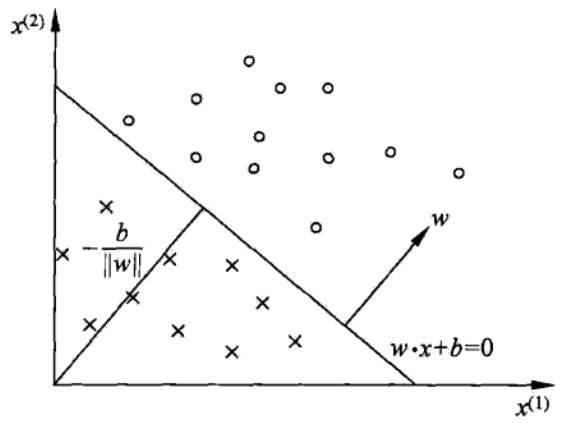
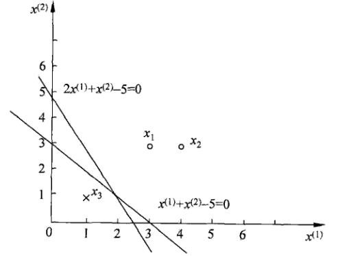
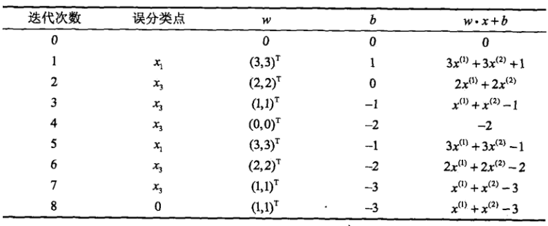
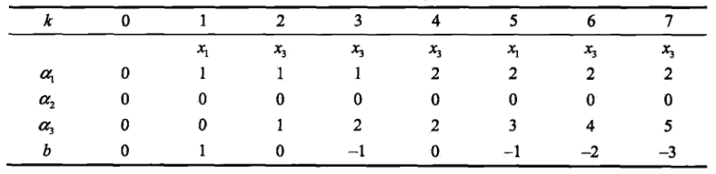
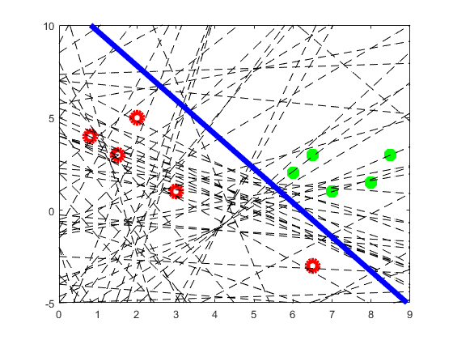

# 感知机

* [返回上层目录](../machine-learning.md)
* [感知机模型](#感知机模型)
* [感知机学习策略](#感知机学习策略)
  * [数据集的线性可分性](#数据集的线性可分性)
  * [感知机学习策略](#感知机学习策略)
* [感知机学习算法](#感知机学习算法)
  * [感知机学习算法的原始形式](#感知机学习算法的原始形式)
  * [感知机学习算法的对偶形式](#感知机学习算法的对偶形式)
    * [理解对偶形式](#理解对偶形式)
* [项目实践](#项目实践)
  * [原始与对偶形式的matlab代码对比](#原始与对偶形式的matlab代码对比)

感知机是神经网络（深度学习）的起源算法，学习感知机的构造是通向神经网络和深度学习的一种重要思想。


感知机（perceptron）是二类分类的线性分类模型，输入为实例的特征向量，输出为实例的类别，取$+1$和$-1$二值。感知机对应于输入空间（特征空间）中将实例划分为正负两类的分离超平面，属于判别模型。感知机学习旨在求出将训练数据进行线性划分的分离超平面，为此，导入基于误分类的损失函数，利用梯度下降法对损失函数进行极小化，求得感知机模型。感知机学习算法具有简单而易于实现的优点，分为原始形式和对偶形式。感知机预测是用学习得到的感知机模型对新的输入实例进行分类。感知机1957年由Rosenblatt提出，**是神经网络与支持向量机的基础**。

本章首先介绍感知机**模型**；然后叙述感知机的**学习策略**，特别是损失函数；最后介绍感知机**学习算法**，包括原始形式和对偶形式。

# 感知机模型

感知机模型**定义**：

假设输入空间是$R^n$，输出空间是$y={+1,-1}$，输入$x$表示实例的特征向量，对应于输入空间（特征空间）的点；输出$y$表示实例的类别。由输入空间到输出空间的如下函数
$$
f(x)=\text{sign}(w\cdot x+b)
$$
称为感知机。其中，$w$和$b$为感知机模型参数，$w\in R^n$叫做权值或权值向量，$b\in R$叫做偏置，$w\cdot x$表示$w$和$x$的内积。sign是符号函数，即
$$
\begin{aligned}
\text{sign}(x)=
\left\{\begin{matrix}
+1,\quad x\geqslant 0\\ 
-1,\quad x<0
\end{matrix}\right.\end{aligned}
$$
感知机是一种线性分类模型，属于判别模型。感知机模型的假设空间是定义在特征空间中的所有线性分类模型或者线性分类器，即函数几何${f|f(x)=w·x+b}$。

感知机有如下几何解释：线性方程
$$
w\cdot x+b=0
$$
对应于特征空间$R^n$中的一个超平面$S$，其中**$w$是超平面的法向量**，$b$是超平面的截距。这个超平面将特征空间划分为两个部分。位于两部分的点（特征向量）分别被分为正、负两类。因此，超平面$S$称为分离超平面，如下图所示：



这里证明下为什么$w$是超平面$S$的法向量：

超平面$S$为$w\cdot x+b=0$，设超平面$S$上任意两点$x_1$、$x_2$，因为它们在超平面$S$上满足
$$
\begin{aligned}
\left\{\begin{matrix}
wx_1+b=0\quad (1)\\ 
wx_2+b=0\quad (2)
\end{matrix}\right.
\end{aligned}
$$
(2)-(1)可得
$$
\begin{aligned}
\left\{\begin{matrix}
w(x_2-x_1)=0\\ 
x_2-x_1=\overrightarrow{x_1x_2}
\end{matrix}\right.
\end{aligned}
$$
则$w$与向量$\overrightarrow{x_1x_2}$垂直，由于$x_1$和$x_2$为超平面$S$上任一点，所以$w$向量垂直于超平面$S$上的任意直线，则证明$w$为超平面$S$的法向量。证明完毕。

感知机**学习**，由训练数据集（实例的特征向量及类别）
$$
T=\{(x_1,y_1),(x_2,y_2),...,(x_n,y_n)\}
$$
其中，$x\in R^n$，$y\in \{+1,-1\}$，求得感知机模型，也就是求得模型参数$w,b$。

感知机预测，即：通过学习得到的感知机模型，对于新的输入实例给出其对应的输出类别。

# 感知机学习策略

## 数据集的线性可分性

定义：

给定一个数据集$T=\{(x_1,y_1),(x_2,y_2),...,(x_n,y_n)\}$，其中，$x\in R^n$，$y\in \{+1,-1\}$，如果存在某个超平面$S$
$$
w\cdot x+b=0
$$
能够将数据集的正实例点和负实例点完全正确地划分到超平面的两侧，即对所有$y=+1$的实例，有$w\cdot x+b>0$，对所有$y=-1$的实例，有$w\cdot x+b<0$，则称数据集$T$为线性可分数据集；否则，称数据集$T$为线性不可分。

感知机的**前提**是训练集线性可分。

## 感知机学习策略

假设训练数据集是线性可分的，感知机学习的目标是求得一个能够将训练集正实例点和负实例点完全正确分开的分离超平面。为了找出这样的超平面，即确定感知机模型参数$w$、$b$，需要确定一个学习策略，即定义（经验）损失函数并将损失函数极小化。

损失函数的一个自然选择是误分类点的总数。但是，这样的损失函数不是参数$w$、$b$的连续可导函数，不易优化。损失函数的另一个选择是误分类点到超平面S的总距离，这是感知机所采用的。为此，首先写出输入空间$R^n$中任一点$x_0$到超平面$S$的距离：
$$
\frac{1}{||w||}|w\cdot x_0+b|
$$
这里，$||w||$是$w$的$L_2$范数。

其次，对于误分类的数据$(x_i,y_i)$来说，
$$
-y_i(w\cdot x_i+b)>0
$$
成立。因为当$w\cdot x_i+b>0$时，$y_i=-1$，而当$w\cdot x_i+b<0$时，$y_i=+1$。因此，误分类点$x_i$到超平面的距离是
$$
-\frac{1}{||w||}y_i(w\cdot x_i+b)
$$
这样的话，假设超平面$S$的误分类的点集合为$M$，那么所有的误分类点到超平面$S$的总距离为
$$
-\frac{1}{||w||}\sum_{x_i\in M}y_i(w\cdot x_i+b)
$$
不考虑$1/||w||$，就得到感知机学习的损失函数，$y(w\cdot x+b)$叫做样本点的函数间隔，考虑了$1/||w||$的话叫样本点的几何间隔。

明明$w$在求最优值的过程中是不断变化的，那为什么还能够不考虑$1/||w||$呢？

>之所以可以忽略$1/||W||$，是因为下面几个原因：
>
>- 感知机的前提是训练集线性可分。这意味着必须存在一个正确的超平面。那么，不管几何距离还是函数距离，损失函数最后都要等于0。
>
>
>- $1/||W||$不影响正负，所以不影响中间过程。因为感知机是误分类驱动的，这里误分类只是需要判断$-y(w\cdot x+b)$的正负即可以，不需要计算具体的距离；
>- $1/||W||$不影响感知机学习算法的最终结果。因为感知机的学习算法最终结果是损失函数为0, 这是$1/||W||$的取值无影响。
>
>综上所述，可以得到$1/||W||$对于感知机的学习过程是没有太大影响的，所以可以直接忽略，简化中间过程。
>
>假设使用几何距离的损失函数记为$L_1 $，使用函数距离的损失函数记为$L_2$。那么$min\ L_1=min\ L_2=0$，这样似乎又产生了新的问题，那就$arg\ min\ L_1$和$arg\ min\ L_2$的解不一样该怎么办？
>
>李航《统计学习方法》已经提到，感知机学习算法存在许多解，为了得到唯一的超平面，需要对分离超平面增加约束条件。

给定训练数据集$T=\{(x_1,y_1),(x_2,y_2),...,(x_N,y_N)\}$，其中，$x$属于$R^n$空间，$y$属于$\{+1,-1\}$空间。感知机$\text{sign}(w\cdot x+b)$学习的**损失函数**定义为
$$
L(w,b)=-\sum_{x_i\in M}y_i(w\cdot x_i+b)
$$
其中，$M$为误分类点的集合。这个损失函数就是感知机学习的经验风险函数。

显然，损失函数$L(w,b)$是非负的。如果没有误分类点，损失函数值就是0。而且，误分类点越少，误分类点离超平面越近，损失函数之就越小。一个特定的样本点的损失函数：在误分类时是参数$w$和$b$的线性函数，在正确分类时是0。因此，给定训练数据集$T$，**损失函数$L(w,b)$是$w$、$b$的连续可导函数**。

感知机的学习策略是在假设空间中选取使损失函数最小的模型参数$w$、$b$，即感知机模型。

# 感知机学习算法

感知机学习算法问题转化为求解损失函数的最优化问题，最优化的方法是**随机梯度下降法**。本节叙述感知机学习的具体算法，包括原始形式和对偶形式。

## 感知机学习算法的原始形式

感知机学习算法是对一下最优化问题的解法，给定一个训练数据集$T=\{(x_1,y_1),(x_2,y_2),...,(x_N,y_N)\}$，其中，$x$属于$R^n$空间，$y$属于$\{+1,-1\}$空间。求参数$w$、$b$，使其为以下损失函数极小化问题的解
$$
\mathop{\text{min}}_{w,b}\ L(w,b)=-\sum_{x_i\in M}y_i(w\cdot x_i+b)
$$
其中，$M$为误分类点的集合。

感知机学习算法是误分类驱动的，具体采用随机梯度下降法。首先，任意选取一个超平面$w_0$、$b_0$，然后采用梯度下降法不断地极小化目标函数。极小化过程不是一次使$M$中所有误分类点的梯度下降，而是一次随机选取一个误分类点使其梯度下降。

假设误分类点集合$M$是固定的，那么损失函数$L(w,b)$的梯度由
$$
\begin{aligned}
\bigtriangledown_wL(w,b)&=-\sum_{x_i\in M}y_ix_i\\
\bigtriangledown_bL(w,b)&=-\sum_{x_i\in M}y_i
\end{aligned}
$$
给出。

随机选取一个误分类点$(x_i,y_i)$，对$w$、$b$进行更新：
$$
\begin{aligned}
w&\leftarrow w+\eta y_ix_i\\
b&\leftarrow b+\eta y_i
\end{aligned}
$$
式中$\eta(0<\eta\leqslant 1)$是步长，在统计学习中又称为学习率。这样，通过迭代可以期待损失函数$L(w,b)$不断减小，直到0。综上所述，得到如下算法：

**感知机学习算法的原始形式：**

输入：**线性可分**的训练数据集$T=\{(x_1,y_1),(x_2,y_2),...,(x_N,y_N)\}$，其中，$x$属于$R^n$空间，$y$属于$\{+1,-1\}$空间；学习率$\eta(0<\eta\leqslant 1)$；

输出：$w$、$b$；感知机模型$f(x)=\text{sign}(w\cdot x+b)$。

（1）选取初始$w_0$、$b_0$

（2）在训练集中选取数据$(x_i,y_i)$

（3）如果$y_i(w\cdot x_i+b)\leqslant 0$
$$
\begin{aligned}
w&\leftarrow w+\eta y_ix_i\\
b&\leftarrow b+\eta y_i
\end{aligned}
$$
（4）转至（2），直至训练集中没有误分类点。

这种学习算法直观上有如下解释：当一个实例点被误分类，即位于分离超平面的错误一侧时，则调整$w$、$b$的值，使分离超平面向该误分类点的一侧移动，以减小该误分类点与超平面的距离，直至超平面越过该误分类点使其被正确分类。

上面的算法是感知机的基本算法，对应于后面的对偶形式，称为原始形式。感知机学习算法简单且易于实现。

**例子**

如下图所示的训练数据集，其正实例点是$x_1=(3,3)$，$x_2=(4,3)$，负实例点是$x_3=(1,1)$，试用感知机学习算法的原始形式求感知机模型$f(x)=sign(w\cdot x+b)$。这里，
$$
\begin{aligned}
w=\begin{bmatrix}
w^{(1)}\\ 
w^{(2)}
\end{bmatrix},\quad
x=\begin{bmatrix}
x^{(1)}\\ 
x^{(2)}
\end{bmatrix}\\
\end{aligned}
$$


解：构建最优化问题
$$
\mathop{\text{min}}_{w,b}\ L(w,b)=-\sum_{x_i\in M}y_i(w\cdot x_i+b)
$$
按照上述算法求解$w$、$b$。$\eta=1$。

（1）取初值$w_0=0$，$b_0=0$

（2）对$x_1=(3,3)$，$y_1(w_0\cdot x_1+b_0)=0$，未能被正确分类，更新$w,b$
$$
w_1=w_0+y_1x_1=(3,3)^T,\ b_1=b_0+y_1=1
$$
得到线性模型
$$
w_1\cdot x+b_1=3x^{(1)}+3x^{(2)}+1
$$
（3）对$x_1,x_2$，显然，$y_i(w\cdot x_i+b)>0$，被正确分类，不修改$w$、$b$；

对$x_3=(1,1)$，$y_3(w\cdot x_3+b)<0$，被误分类，更新$w,b$。
$$
w_2=w_1+y_3x_3=(2,2)^T,\quad b_2=b_1+y_3=0
$$
得到线性模型
$$
w_2\cdot x+b_2=2x^{(1)}+2x^{(2)}+0
$$
如此继续下去，直到
$$
w_7=(1,1)^T,\quad b_7=-3
$$

$$
w_7\cdot x+b_7=x^{(1)}+x^{(2)}-3
$$

对所有数据点$y_i(w_7\cdot x_i+b)>0$，没有误分类点，损失函数达到最小。

则分离超平面为
$$
x^{(1)}+x^{(2)}-3=0
$$
感知机模型为
$$
f(x)=\text{sign}(x^{(1)}+x^{(2)}-3)
$$
求解的整个迭代过程见下表



这是在计算中误分类点先后取$x_1, x_3, x_3, x_3, x_1, x_3, x_3$得到的分类超平面和感知机模型。如果在计算中误分类点依次取$x_1, x_3, x_3, x_3, x_2, x_3, x_3, x_3, x_1, x_3, x_3$，那么得到的分离超平面是
$$
2x^{(1)}+x^{(2)}-5=0
$$
可见，**感知机学习算法由于采用不同的初值或选取不同的误分类点，解可以不同。**

当训练数据集线性可分时，感知机学习算法原始形式迭代是收敛的。当训练数据集不可分时，感知机学习算法不收敛，迭代结果会发生震荡。

感知机学习算法存在许多解，这些解既依赖于初值的选择，也依赖于迭代过程中误分类点的选择顺序。**为了得到唯一的超平面，需要对分类超平面增加约束条件**。这其实就是线性支持向量机的想法。

## 感知机学习算法的对偶形式

现在考虑感知机学习算法的对偶形式。感知机学习算法的原始形式和对偶形式与支持向量机学习算法的原始形式和对偶形式相对应。

对偶形式的基本想法是，将$w$和$b$表示为**实例$x_i$和标记$y_i$的线性组合**的形式，通过求解其系数而求得的$w$和$b$。不失一般性，在原始形式的算法中可假设初始值$w_0$、$b_0$均为0。对误分类点$(x_i,y_i)$通过
$$
\begin{aligned}
w&\leftarrow w+\eta y_ix_i\\
b&\leftarrow b+\eta y_i
\end{aligned}
$$
逐步修改$w$、$b$，设修改$n$次，则$w$，$b$关于$(x_i, y_i)$的增量分别是$\alpha_i\cdot y_i\cdot x_i$和$\alpha_i\cdot y_i$，这里$\alpha_i=n_i\eta$，其中，$n_i$是每个点的累计修改次数，所以每个点的修改次数加起来就是总的修改次数$n$，即$n_i$满足
$$
\sum_{i=1}^Nn_i=n
$$
其中，$n$为总的修改次数。

这样，从学习过程不难看出，最后学习到的$w$、$b$可以分别表示为
$$
\begin{aligned}
w&=\sum_{i=1}^N\alpha_iy_ix_i\\
b&=\sum_{i=1}^N\alpha_iy_i
\end{aligned}
$$
这就是说，$w$和$b$可以表示为**全部实例$x_i$和标记$y_i$的线性组合**的形式，即以全部实例点作为坐标基，$\alpha_i$是每个坐标基的系数，我们只需要把坐标基的系数$\alpha_i$求出来即可表示出$w$和$b$。

上式中，$\alpha_i\geqslant 0$，$i=1,2,...,N$，当$\eta=1$时，表示第$i$个实例点由于误分类而进行更新的次数。实例点更新系数越多，意味着它距离分离超平面越近，也就越难正确分类。话句话说，这样的实例对学习结果影响最大，也就是说，**实例点距离分离超平面越近，这个点的坐标基的权重就越大**。这和（线性）SVM是类似的，但是SVM之所以叫支持向量机，是因为它的分离超平面只由距离分离超平面最近的几个点组成，而其他点的权值为0，这一点和感知机有所不同。

下面对照原始形式来叙述感知机学习算法的对偶形式。

**感知机学习算法的对偶形式：**

输入：**线性可分**的数据集
$$
T=\{(x_1,y_1),(x_2,y_2),...,(x_N,y_N)\}
$$
其中，$x$属于$R^n$空间，$y$属于$\{+1,-1\}$空间；学习率$\eta(0<\eta \leqslant 1)$；

输出：$\alpha$、$b$；感知机模型
$$
f(x)=\text{sign}(\sum_{j=1}^N\alpha_j \cdot y_j \cdot x_j  \cdot x+b)
$$
其中，
$$
\alpha=(\alpha_1,\alpha_2,...,\alpha_N)^T
$$
（1）$\alpha\leftarrow 0$，$b\leftarrow 0$

（2）在训练集中选取数据$(x_i,y_i)$

（3）如果$y_i(\sum_{j=1}^N\alpha_jy_jx_j\cdot x_i+b)\leqslant 0$，则
$$
\begin{aligned}
\alpha_i&\leftarrow \alpha_i+\eta\\
b&\leftarrow b+\eta y_i
\end{aligned}
$$
（4）转至（2），直至训练集中没有误分类点。

对偶形式中训练实例仅以内积的形式出现。为了方便，可以预先将训练集中实例间的内积计算出来，并以矩阵的形式存储，这个矩阵就是所谓的**Gram矩阵**。

**例子**：

数据同上个例子，正样本点是x1=(3;3)，x2=(4;3)，负样本点是x3=(1;1)，试用感知机学习算法的对偶形式求感知机模型f(x)=sign(w·x+b)。

解：按照上述对偶形式算法，

（1）取$\alpha_i=0$，$i=1,2,3$，$b=0$，$\eta=1$

（2）计算Gram矩阵
$$
\begin{aligned}
G=\begin{bmatrix}
18 & 21 & 6\\ 
21 & 25 & 7\\
6 & 7 & 2
\end{bmatrix}
\end{aligned}
$$
（3）误分类条件
$$
y_i(\sum_{j=1}^N\alpha_jy_jx_j \cdot x_i+b)\leq 0
$$
参数更新：
$$
\alpha_i\leftarrow\alpha_i+1,\quad b\leftarrow b+y_i
$$
（4）迭代。过程从略，结果列于下表：



（5）

分离超平面：
$$
\begin{aligned}
w&=2x_1+0x_2-5x_3=(1,1)^T\\
b&=-3
\end{aligned}
$$
分离超平面：
$$
x^{(1)}+x^{(2)}-3=0
$$
则感知机模型为：
$$
f(x)=\text{sign}(x^{(1)}+x^{(2)}-3)
$$
对照上例，结果一致，迭代步骤也是相互对应的。

与原始形式一样，感知机学习算法的对偶形式是收敛的，存在无穷多个解，其解由于不同的初值或不同的迭代顺序而可能有所不同。

### 理解对偶形式

可以看出，其实对偶形式和原始形式并没有本质区别，如果参数一样，计算过程也完全没有区别，因为对偶形式是靠计算每个样本点的累计值$\alpha$来更新权值的，这和原始形式的随机梯度下降来累计并更新权值是一样的，原始形式的梯度下降过程，本质就是用输入空间各点修正，对偶形式只不过是显式写出来了，对偶形式主要是对高维空间（如高斯核）减少计算量吧。

那么**对偶形式的意义**在哪里呢？从对偶形式的感知机模型可以看出，样本点的特征向向量以内积的形式存在与感知机对偶形式的训练算法中，因此，如果事先计算好所有的内积，也就是Gram矩阵，就可以打打加快计算速度。原始形式的内积是权重和样本的内积，这导致必须在线计算，而不能像对偶形式中可以事先计算出Gram矩阵并储存。可以类比引入核技巧的节约计算时间的理念。

更详细的解释：假设按照感知机原始形式所有的参数更新一共需要n次，对偶形式就是把这$n$次分摊到$i$个样本中去，这样最终的参数可以展开使用每个样本点进行表示，这样在判断误分类的时候的计算就都可以展开成样本之间的点乘形式，这样就可以通过提前算好的Gram矩阵来大大降低计算量，因为仅仅计算了一次，后续全部通过查表就可以了。而反观原始形式，每次参数改变，所有的矩阵计算全部需要计算，导致计算量比对偶形式要大很多。

**更深入的讨论**：所谓的对偶形式将w和b表示成了样本（$x$）和标签的（$y$）的线性组合，为核函数的引入提供了机会（不然哪来的SVM啊），尤其是像高斯核函数这种泰勒展开式无数项的函数，在这种情况下复杂度只与样本数有关，且因为很多$\alpha$其实是0，所以对优化速度会有一定提升作用。

对深入讨论的详细解释：

感知机的对偶形式的推导是很简单的，《统计学习方法》上写得够清楚了，这里解释一下动机。

对偶形式的目的是降低运算量，但是并不是在任何情况下都能降低运算量，而是在特征空间的维度很高时才起到作用。不妨设特征空间是$R^n$，$n$很大，一共有$N$个训练数据，$N$相对$n$很小。我们考虑原始形式的感知机学习算法，每一轮迭代中我们至少都要判断某个输入实例是不是误判点，既对于$x_i$，是否有
$$
y_i(wx_i+b)\leq0
$$
。这里的运算量主要集中在求输入实例$x_i$和权值向量$w$的内积上，$O(n)$的时间复杂度，由于特征空间维度很高，所以这很慢。

而在对偶形式的感知机学习算法中，对于输入实例$(x_i,y_i)$是否误判的条件变换为
$$
y_i(\sum_{j=1}^{N}\alpha_jy_jx_jx_i+b)\leq0
$$
。注意到这里所有输入实例都仅仅以内积的形式出现，所以我们可以预先计算输入实例两两之间的内积，得到所谓的Gram矩阵$G=[x_i^Tx_j]_{N \times N}$。这样一来每次做误判检测的时候我们直接在Gram矩阵里查表就能拿到内积$x_jx_i$，所以这个误判检测的时间复杂度$O(N)$。

也就是说，对偶形式的感知机，把每轮迭代的时间复杂度的数据规模从特征空间维度$n$转移到了训练集大小$N$上，那么对于维度非常高（如高斯核）的空间，自然就能提升性能了。

# 项目实践

## 原始与对偶形式的matlab代码对比

* 原始形式的matlab代码

```matlab
%% solution1 算法2.1 李航page29
% data
data_x1 = [0.8, 1.5, 2.0, 3.0, 6.5, 6.0, 6.5, 7.0, 8.0, 8.5];
data_x2 = [4.0, 3.0, 5.0, 1.0, -3.0, 2.0, 3.0, 1.0, 1.5, 3.0];
data_y  = [-1,  -1,  -1,  -1,  -1,  1,   1,   1,   1,   1  ];
plot(data_x1(1:5), data_x2(1:5), 'ro',data_x1(6:10), data_x2(6:10), 'g*', 'MarkerSize',10, 'LineWidth', 5)

w1 = 0; w2 = 0; b = 0; eta = 0.1;

index_wrong = -1;
while(index_wrong ~= 0)
    index_wrong = 0;
    for i=1:size(data_x1,2)
        if (sign(w1*data_x1(i)+w2*data_x2(i)+b) * data_y(i) <= 0)
            index_wrong = i;
            break;
        else
            index_wrong = 0;
        end
    end
    if(index_wrong ~= 0)
        w1 = w1 + eta * (data_y(index_wrong) * data_x1(index_wrong));
        w2 = w2 + eta * (data_y(index_wrong) * data_x2(index_wrong));
        b = b + eta * data_y(index_wrong);
        hold on
        fig_x = 0:0.1:9;
        if(w2 ~= 0)
            fig_y = -(w1/w2).*fig_x - b/w2;
            axis([0 9 -5 10]) 
            plot(fig_x, fig_y, 'k--')
            pause(0.10)
        end
    end
end

hold on
fig_x = 0:0.1:9;
if(w2 ~= 0)
    fig_y = -(w1/w2).*fig_x - b/w2;
    axis([0 9 -5 10]) 
    plot(fig_x, fig_y, 'b-', 'LineWidth', 5)
end
```

运行结果如下图：




* 对偶形式的matlab代码

~~~matlab
%% solution 2 算法2.2 page33
% data
data_x1 = [0.8, 1.5, 2.0, 3.0, 6.5, 6.0, 6.5, 7.0, 8.0, 8.5];
data_x2 = [4.0, 3.0, 5.0, 1.0, -3.0, 2.0, 3.0, 1.0, 1.5, 3.0];
data_y  = [-1,  -1,  -1,  -1,  -1,  1,   1,   1,   1,   1  ];

w1 = 0; w2 = 0; b = 0; eta = 1;
Gram = data_x1'*data_x1 + data_x2'*data_x2;
alpha = zeros(size(data_x1));

figure(2)
plot(data_x1(1:5), data_x2(1:5), 'ro',data_x1(6:10), data_x2(6:10), 'g*', 'MarkerSize',10, 'LineWidth', 5)
index_wrong = -1;
while(index_wrong ~= 0)
    index_wrong = 0;
    for i=1:size(data_x1,2)
        sum_a_y_x_x = 0;
        for j=1:size(data_x1,2)
            sum_a_y_x_x = sum_a_y_x_x + alpha(j) * data_y(j) * Gram(j,i);
        end
        
        if (data_y(i)*(sum_a_y_x_x + b) <= 0)
            alpha(i) = alpha(i) + 1;
            b = b + data_y(i);
            index_wrong = i;
            alpha
            break;
        else
            index_wrong = 0;
        end
    end
    if(index_wrong ~= 0)
        w1 = 0; w2 = 0;
        for j=1:size(data_x1,2)
            w1 = w1 + alpha(j) * data_y(j) * data_x1(j);
            w2 = w2 + alpha(j) * data_y(j) * data_x2(j);
        end
        
        hold on
        fig_x = 0:0.1:9;
        if(w2 ~= 0)
            fig_y = -(w1/w2).*fig_x - b/w2;
            axis([0 9 -5 10]) 
            plot(fig_x, fig_y, 'k--')
            pause(0.10)
        end
    end
end

hold on
fig_x = 0:0.1:9;
if(w2 ~= 0)
    fig_y = -(w1/w2).*fig_x - b/w2;
    axis([0 9 -5 10]) 
    plot(fig_x, fig_y, 'b-', 'LineWidth', 5)
end
alpha
~~~

运行结果如下图：


可以看到，感知机对偶形式的计算过程和结果和原始形式完全一致。

# 参考资料

* 《统计学习方法》李航

本文主要参考了李航的书的《感知机》一章。

* [感知机的损失函数为什么可以采用函数间隔(忽略1/||w||)?](https://www.zhihu.com/question/36241719)

“感知机学习策略”小节参考了此知乎回答。

* [如何理解感知机学习算法的对偶形式？](https://www.zhihu.com/question/26526858)

"理解感知机学习算法的对偶形式"小节参考了此知乎回答。

===

* [深度学习入门-感知机](https://www.jianshu.com/p/a25788130897)

