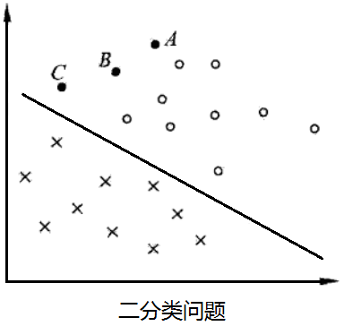
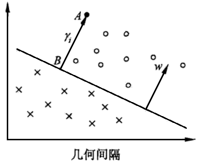
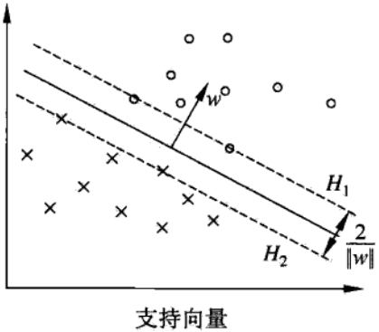

# 线性可分支持向量机与硬间隔最大化

* [返回上层目录](../support-vector-machine.md)
* [线性可分支持向量机](#线性可分支持向量机)
* [函数间隔和几何间隔](#函数间隔和几何间隔)
* [间隔最大化](#间隔最大化)
  * [最大间隔分离超平面](#最大间隔分离超平面)
  * [最大间隔分离超平面的存在唯一性](#最大间隔分离超平面的存在唯一性)
  * [支持向量和间隔边界](#支持向量和间隔边界)
* [线性可分支持向量机学习的对偶算法](#线性可分支持向量机学习的对偶算法)
  * [对偶优化问题](#对偶优化问题)
  * [以KKT条件由对偶解α求原始解w和b](#以KKT条件由对偶解α求原始解w和b)
  * [线性可分支持向量机学习算法](#线性可分支持向量机学习算法)
  * [线性可分数据集的支持向量](#线性可分数据集的支持向量)

支持向量机（support vector machines，SVM）是一种二类分类模型。它的基本模型是定义**在特征空间上的间隔最大的线性分类器**，间隔最大使它有别于感知机；支持向量机还包括核技巧，这使它成为实质上的非线性分类器。支持向量机的**学习策略就是间隔最大化**，可形式化为一个求解凸二次规划（convex quadratic programming）的问题，也等价于正则化的合页损失函数的最小化问题。支持向量机的学习算法是求解凸二次规划的最优化算法。

支持向量机学习方法包含构建由简至繁的模型：线性可分支持向量机（ linear support vector machine in linearly separable case )、线性支持向量机（ linear support vector machine)及非线性支持向量机（non-linear support vector machine)。简单模型是复杂模型的基础，也是复杂模型的特殊情况。当训练数据线性可分时，通过硬间隔最大化（ hard margin maximization)，学习一个线性的分类器，即线性可分支持向量机，又称为硬间隔支持向量机；当训练数据近似线性可分时，通过软间隔最大化（ soft margin maximization)，也学习一个线性的分类器，即线性支持向量机，又称为软间隔支持向量机；当训练数据线性不可分时，通过使用核技巧（kemel trick）及软间隔最大化，学习非线性支持向量机。

当输入空间为欧氏空间或离散集合、特征空间为希尔伯特空间时，核函数（kernel function）表示将输入从输入空间映射到特征空间得到的特征向量之间的内积。**通过使用核函数可以学习非线性支持向量机，等价于隐式地在高维的特征空间中学习线性支持向量机**。这样的方法称为核技巧。核方法（ kernel method)是比支持向量机更为一般的机器学习方法。

Cortes与Vapnik提出线性支持向童机，Boser、Guyon与Vapnik又引入核技巧，提出非线性支持向量机。

本章按照上述思路介绍3类支持向量机、核函数及一种快速学习算法——序列最小最优化算法（SMO)。

# 线性可分支持向量机

考虑一个二分类问题，假设输入空间与特征空间为两个不同的空间。**输入空间**为欧式空间或离散集合，**特征空间**为欧式空间或希尔伯特空间。

线性可分支持向量机、线性支持向量机假设这两个空间的元素一一对应，并将**输入空间中的输入映射为特征空间中的特征向量**。非线性支持向量机利用一个从输入空间到特征空间的非线性映射，将输入映射为特征向量，使得在特征空间中能够使用线性支持向量机来学习。所以，**输入都由输入空间转换到特征空间，支持向量机的学习是在特征空间上进行的**。

假设给定一个特征空间上的训练数据集
$$
T=\{ (x_1,y_1),(x_2,y_2),...,(x_N,y_N) \}
$$
其中，$x_i\in X=R^n$，$y_i\in Y=\{+1,-1\}, i=1,2,...,N$，$x_i$为第$i$个特征向量，也称为实例，$y_i$为$x_i$的类标记，当$y_i=+1$时，称$x_i$为正例；当$y_i=-1$时，称$x_i$为负例，$(x_i,y_i)$称为样本点。再假设训练数据集是线性可分的。

学习的目标是在特征空间中找到一个分离超平面，能将实例分到不同的类。分离超平面对应于方程$w\cdot x+b=0$，它由法向量$w$和截距$b$决定，可用$(w,b)$来表示。分离超平面将特征空间划分为两部分，一部分是正类，一部分是负类。法向量指向的一侧为正类，另一侧为负类。

一般地，当训练数据集线性可分时，存在无穷个分离超平面可将两类数据正确分开。感知机利用误分类最小的策略，求得分离超平面，不过这时的解有无穷多个。线性可分支持向量机利用间隔最大化求最优分离超平面，这时，解是唯一的。

**线性可分支持向量机的定义：**

给定线性可分训练数据集，通过间隔最大化或等价地求解相应的凸二次规划问题学习得到的分离超平面为
$$
w^*\cdot x+b^*=0
$$
以及相应的分类决策函数
$$
f(x)=\text{sign}(w^*\cdot x+b^*)
$$
称为线性可分支持向量机。

考虑如下图所示的二维特征空间中的分类问题。图中的“。”表示正例，“x”表示负例。训练数据集线性可分，这时有许多直线能将两类数据正确划分。线性可分支持向量机对应将两类数据正确划分并且间隔最大的直线，如下图所示。

间隔最大及相应的约束最优化问题将在下面叙述。这里先介绍函数间隔和集合间隔的概念。

# 函数间隔和几何间隔

在上图中，有A,B,C三个点，表示三个实例，均在分离超平面的正类一侧，预测他们的类。点A距分离超平面较远，若预测该点为正类，就比较确信预测是正确的；点C距分离超平面较近，若预测该点为正类就不那么确信；点B介于点A与C之间，预测其为正类的确信度也在A与C之间。

一般来说，**一个点距离分离超平面的远近可以表示分类预测的确信程度**。在超平面$w\cdot x+b=0$确定的情况下，$|w\cdot x+b|$能够相对地表示点$x$距离超平面的远近。而$w\cdot x+b$的符号与类标记$y$的符号（$\pm1$）是否一致能够表示分类是否正确。所以可用量**$y(w\cdot x+b)$来表示分类的正确性及确信度**，这就是**函数间隔**（functional margin）的概念。

疑问：为什么$|w\cdot x+b|$能够相对地表示点x距离超平面的远近？

因为：根据点到直线的距离计算公式为：设直线$L$的方程为$Ax+By+C=0$，点$P$的坐标为$(x_0, y_0)$，则点$P$到直线$L$的距离为：
$$
\frac{|Ax_0+By_0+C|}{\sqrt{A^2+B^2}}=\frac{|w\cdot x+b|}{||w||}
$$
**函数间隔的定义**

对于给定的训练数据集$T$和超平面$(w,b)$，定义超平面$(w,b)$关于样本点$(x,y)$的函数间隔为
$$
\hat{\gamma}_i=y_i(w\cdot x_i+b)
$$
定义超平面关于训练数据集$T$的函数间隔为超平面$(w,b)$关于T中所有样本点$(x_i,y_i)$的函数间隔之最小值，即
$$
\hat{\gamma}=\mathop{\text{min}}_{i=1,...,N}\hat{\gamma}_i
$$
函数间隔可以表示分类预测的正确性及确信度。但是选择分离超平面时，只有函数间隔还不够。因为只要成比例地改变$w$和$b$，例如将它们改为$2w$和$2b$，超平面并没有改变，但函数间隔却成为原来的$2$倍。这一事实启示我们，可以对分离超平面的法向量$w$加某些束，如规范化，$||w|| = 1$，使得间隔是确定的。这时函数间隔成为几何间隔（geometric margin)。

下图给出了超平面$(w,b)$及其法向量$w$。点$A$表示某一实例其类标记为$y_i=+1$。点$A$与超平面$(w,b)$的距离由线段$AB$给出，记作$\gamma_i$
$$
\gamma_i=\frac{w}{||w||}\cdot x_i+\frac{b}{||w||}
$$
其中，$||w||$为$w$的$L_2$范数。这是点$A$在超平面正的一侧的情形。如果点$Z$在超平面负的一侧，即$y_i=-1$，那么点与超平面的距离为
$$
\gamma_i=-\left(\frac{w}{||w||}\cdot x_i+\frac{b}{||w||}\right)
$$
一般地，当样本点$(x_i,y_i)$被超平面$(w,b)$正确分类时，点$x_i$与超平面$(w,b)$的距离是
$$
\gamma_i=y_i\left(\frac{w}{||w||}\cdot x_i+\frac{b}{||w||}\right)
$$
由这一事实导出几何间隔的概念。

**几何间隔的定义：**

对于给定的训练数据集$T$和超平面$(w,b)$，定义超平面$(w,b)$关于样本点$(x_i,y_i)$的几何间隔为
$$
\gamma_i=y_i\left(\frac{w}{||w||}\cdot x_i+\frac{b}{||w||}\right)
$$
定义超平面$(w,b)$关于训练数据集$T$的几何间隔为超平面$(w,b)$关于$T$所有样本点$(x_i,y_i)$的几何间隔之最小值，即
$$
\gamma=\mathop{\text{min}}_{i=1,...,N}\gamma_i
$$
超平面$(w,b)$关于样本点$(x_i,y_i)$的几何间隔一般是实例点到超平面的带符号的距离（signed distance），当样本点被超平面正确分类时就是实例点到超平面的距离。

从函数间隔和几何间隔的定义可知，函数间隔和几何间隔有下面的关系：
$$
\begin{aligned}
\gamma_i&=\frac{\hat{\gamma}_i}{||w||}\\
\gamma&=\frac{\hat{\gamma}}{||w||}\\
\end{aligned}
$$
如果$||w||=1$，那么函数间隔和几何间隔相等。如果超平面参数$w$和$b$成比例地改变（超平面没有改变），函数间隔也按此比例改变，而几何间隔不变。

# 间隔最大化

支持向量机学习的基本想法是**求解能够正确划分训练数据集并且几何间隔最大的分离超平面**。对线性可分的训练数据集而言，线性可分分离超平面有无穷多个（等价于感知机），但是几何间隔最大的分离超平面是**唯一**的。这里的间隔最大化又称为硬间隔最大化（与将要讨论的训练数据集近似线性可分时的软间隔最大化相对应）。

间隔最大化的直观解释是：对训练数据集找到几何间隔最大的超平面意味着**以充分大的确信度对训练数据进行分类**。也就是说，不仅将正负实例点分开，而且**对最难分的实例点（离超平面最近的点）也有足够大的确信度将它们分开**。这样的超平面应该**对未知的新实例有很好的分类预测能力**。

## 最大间隔分离超平面

下面考虑如何求得一个几何间隔最大的分离超平面，即最大间隔分离超平面。具体地，这个问题可以表示为下面的约束最优化问题：
$$
\begin{aligned}
&\mathop{\text{max}}_{w,b}\quad \gamma\\
&\text{s.t.}\quad y_i\left(\frac{w}{||w||}\cdot x_i+\frac{b}{||w||}\right)\geqslant \gamma,\ i=1,2,...,N\\
\end{aligned}
$$
即我们希望最大化超平面$(w,b)$关于训练数据集的几何间隔$\gamma$，约束条件表示的是超平面$(w,b)$关于每个训练样本点的几何间隔至少是$\gamma$。

考虑几何间隔$\gamma$和函数间隔$\hat{\gamma}$的关系式（$\gamma=\frac{\hat{\gamma}}{||w||}$），可将这个问题改写为
$$
\begin{aligned}
&\mathop{\text{max}}_{w,b}\quad \frac{\hat{\gamma}}{||w||}\\
&\text{s.t.}\quad y_i\left(w\cdot x_i+b\right)\geqslant \hat{\gamma},\ i=1,2,...,N\\
\end{aligned}
$$
函数间隔$\hat{\gamma}$的取值并不影响最优化问题的解。事实上，假设将$w$和$b$按比例改变为$\lambda w$和$\lambda b$，这时函数间隔为λ$\hat{\gamma}$。函数间隔的这一改变对上面最优化问题的不等式约束没有影响，对目标函数的优化也没有影响，也就是说，它产生一个等价的最优化问题。这样，就可以取函数间隔$\hat{\gamma}=1$。

将$\hat{\gamma}=1$带入上面的最优化问题，注意到最大化$\frac{1}{||w||}$和最小化$\frac{1}{2}||w||^2$是等价的，于是就得到下面的线性可分支持向量机学习的最优化问题
$$
\begin{aligned}
&\mathop{\text{min}}_{w,b}\quad \frac{1}{2}||w||^2\\
&\text{s.t.}\quad y_i\left(w\cdot x_i+b\right)-1\geqslant 0,\ i=1,2,...,N\\
\end{aligned}
$$
由于$\mathop{\text{min}}_{w,b}\frac{1}{2}||w||^2$是一个凸函数，所以这是一个凸二次规划问题。

凸优化是指约束优化问题
$$
\begin{aligned}
&\mathop{\text{min}}_{w}\quad f(w)&\\
&\text{s.t.}\ \quad g_i(w)\leqslant 0,\ i=1,2,...,k\\
&\ \ \quad \quad h_i(w)=0,\ i=1,2,...,l\\
\end{aligned}
$$
其中，目标函数$f(w)$和约束函数$g_i(x)$都是$R^n$上的连续可微的凸函数，约束函数$h_i(w)$是$R^n$上的仿射函数。

当目标函数$f(w)$是二次函数且约束函数$g_i(w)$是仿射函数时，上述凸最优化问题成了凸二次规划问题。

如果求出了约束最优化问题的解$w^{*}, b^{*}$，那么就可以得到最大间隔分离超平面$w^*\cdot x+b^*=0$及分类决策函数$f(x)=sign(w^*\cdot x+b^*)$，即线性可分支持向量机模型。

综上所述，就有下面的线性可分支持向量机的学习算法——最大间隔法（maximum margin method）。

**线性可分支持向量机学习算法：最大间隔法**

输入：线性可分训练数据
$$
T=\{ (x_1,y_1),(x_2,y_2),...,(x_N,y_N) \}
$$
其中，$x_i\in X=R^n$，$y_i\in Y=\{+1,-1\}, i=1,2,...,N$；

输出：最大间隔分离超平面和分类决策函数

（1）构造并求解约束最优化问题：
$$
\begin{aligned}
&\mathop{\text{min}}_{w,b}\quad \frac{1}{2}||w||^2\\
&\text{s.t.}\quad y_i\left(w\cdot x_i+b\right)-1\geqslant 0,\ i=1,2,...,N\\
\end{aligned}
$$
求得最优解$w^{*}, b^{*}$。

（2）由此得到分离超平面：
$$
w^*\cdot x+b^*=0
$$
和分类决策函数
$$
f(x)=\text{sign}(x^*\cdot x+b^*)
$$

## 最大间隔分离超平面的存在唯一性

线性可分训练数据集的最大间隔分离超平面是存在且唯一的。

证明此处略，详见李航的《统计学习基础》对应章节。

## 支持向量和间隔边界

在线性可分情况下，训练数据的样本点中与分离超平面最近的样本点的实例称为支持向量。支持向量是使不等式约束条件的等号成立的点，即
$$
y_i(w\cdot x_i+b)-1=0
$$
对$y_i=+1$的正例点，支持向量在超平面$H_1:w\cdot x+b=1$上，对$y_i=-1$的负例点，支持向量在超平面$H_2: w\cdot x+b=-1$上。如下图所示，在$H_1$和$H_2$上的点就是支持向量。

注意到$H_1$和$H_2$平行，并旦没有实例点落在它们中间。在$H_1$与$H_2$之间形成一条长带，分离超平面与它们平行且位于它们中央。长带的宽度，即$H_1$与$H_2$之间的距离称为间隔（margin）。间隔依赖于分离超平面的法向量$w$，等于$\frac{2}{||w||}$，$H_1$和$H_2$称为间隔边界。

在决定分离超平面时只有支持向量起作用，而其他实例点并不起作用。如果移动支持向量将改变所求的解：但是如果在间隔边界以外移动其他实例点，甚至去掉这些点，则解是不会改变的。由于支持向量在确定分离超平面中起着决定性作用，所以将这种分类模型称为支持向量机。支持向量的个数一般很少，所以支持向量机由很少的“重要的”训练样本确定。

# 线性可分支持向量机学习的对偶算法

## 对偶优化问题

为了求解线性可分支持向量机的最优化问题，将它作为原始最优化问题，应用拉格朗日对偶性，通过求解对偶问题，得到原始问题的最优解，这就是线性可分支持向量机的对偶算法。这样做的优点，一是**对偶问题往往更容易求解**，二是自然引入核函数，进而推广到非线性分类问题。

已知原始问题
$$
\begin{aligned}
&\mathop{\text{min}}_{w,b}\quad \frac{1}{2}||w||^2\\
&\text{s.t.}\quad y_i\left(w\cdot x_i+b\right)-1\geqslant 0,\ i=1,2,...,N\\
\end{aligned}
$$
首先构建拉格朗日函数。为此，对每一个不等式约束引入拉格朗日乘子$\alpha_i\geqslant 0, i=1,2,...,N$，定义拉格朗日函数：
$$
L(w,b,\alpha)=\frac{1}{2}||w||^2-\sum_{i=1}^N\alpha_iy_i(w\cdot x_i+b)+\sum_{i=1}^N\alpha_i
$$
其中，$\alpha=(\alpha_1,\alpha_2,...,\alpha_N)$为拉格朗日乘子向量。

所以，通过拉格朗日函数我们可以将原始问题
$$
\begin{aligned}
&\mathop{\text{min}}_{w,b}\quad \frac{1}{2}||w||^2\\
&\text{s.t.}\quad y_i\left(w\cdot x_i+b\right)-1\geqslant 0,\ i=1,2,...,N\\
\end{aligned}
$$
转化为：
$$
\begin{aligned}
&\mathop{\text{min}}_{w,b}\mathop{\text{max}}_{\alpha}\quad L(w,b,\alpha)\\
&\text{s.t.}\quad \alpha_i\geqslant 0\\
\end{aligned}
$$
有的小伙伴这里不理解，为什么这里突然变成了拉格朗日函数最大值的最小化？原因是
$$
\begin{aligned}
&\text{if}\quad 1-y_i(w^Tx_i+b)>0,\quad \mathop{\text{max}}_{\alpha}L(w,b,\alpha)=\frac{1}{2}||w||^2+\infty=\infty\\
&\text{if}\quad 1-y_i(w^Tx_i+b)\leqslant 0,\quad \mathop{\text{max}}_{\alpha}L(w,b,\alpha)=\frac{1}{2}||w||^2+0=\frac{1}{2}||w||^2\\
\end{aligned}
$$
所以，当求$\text{max}$后，其实是隐含了必须满足$1-y_i(w^Tx_i+b)\leqslant 0$这一条件的，就可以不再显式地要求满足这一条件了，所以是**等价**的。

根据拉格朗日对偶性，原始问题的对偶问题是极大极小问题：
$$
\mathop{\text{max}}_{\alpha}\mathop{\text{min}}_{w,b}L(w,b,\alpha)
$$
通俗的讲，这个过程的主要操作就是将$\text{min}$和$\text{max}$互掉位置，并且二者之间有一个性质，即前者$\geqslant$后者，这就好比在高个子人群中挑一个身高较矮的（$\text{min max}$）要高于在矮个子人群中挑一个身高较高的（$\text{max min}$）。默认情况下二者是呈弱对偶关系的，但在此目标函数和约束条件下是呈强对偶关系(等价关系)的。

**等等，“根据拉格朗日对偶性”是什么意思？你需要看看凸优化一章。。如果拉格朗日函数具有强对偶性，那么原函数（极小极大）的最优值$p^*$和对偶函数（极大极小）的最优值$d^*$的值是一样大的。**

**那怎么判断是否满足强对偶性呢？其中一个就是，在原函数和不等式约束是凸函数的基础上，如果满足Slater条件，那么强对偶性就成立，从而原函数和对偶函数的最优值就相等，就可以通过求对偶函数的最优值来求原函数的最优值了。**

**那Slater条件又是什么呢？Slater条件是说：存在$x$，使不等式约束中的“小于等于号”要严格取到“小于号”（也就是弹簧振子系统要能正常运转，等于零就是有约束力）。这个条件一般都能满足。。所以，我们的这个函数显然很容易就满足了Slater条件，而且它又是凸函数，那么就是满足强对偶性质喽，那么原函数（最小最大）和对偶函数（极大极小）的最优值就是一样的啦。所以，既然原函数不好求最优值，那我们就求对偶函数的最优值，因为对偶函数好求最优值嘛。。求出来的对偶函数的最优值，就是原函数的最优值了。。**

所以，为了求得对偶问题的解，需要先求$L(w,b,\alpha)$对$w,b$的极小，再求对$\alpha$的极大。

（1）求$\mathop{\text{min}}_{w,b}L(w,b,\alpha)$

将拉格朗日函数$L(w,b,\alpha)$分别对$w,b$求偏导数，并令其等于0。
$$
\begin{aligned}
\bigtriangledown_wL(w,b,\alpha)&=w-\sum_{i=1}^N\alpha_iy_ix_i=0\\
\bigtriangledown_bL(w,b,\alpha)&=-\sum_{i=1}^N\alpha_iy_i=0\\
\end{aligned}
$$
得
$$
\begin{aligned}
&w=\sum_{i=1}^N\alpha_iy_ix_i\\
&\sum_{i=1}^N\alpha_iy_i=0\\
\end{aligned}
$$
将上式中第一行式子带入拉格朗日函数，并利用上式中的第二行式子，即得：
$$
\begin{aligned}
L(w,b,\alpha)&=\frac{1}{2}||w||^2-\sum_{i=1}^N\alpha_iy_i(w\cdot x_i+b)+\sum_{i=1}^N\alpha_i\\
&=\frac{1}{2}\sum_{i=1}^N\sum_{j=1}^N\alpha_i\alpha_jy_iy_j(x_i\cdot x_j)-\sum_{i=1}^N\alpha_iy_i\left(\left( \sum_{j=1}^N\alpha_jy_jx_j \right)\cdot x_i+b\right)+\sum_{i=1}^N\alpha_i\\
&=-\frac{1}{2}\sum_{i=1}^N\sum_{j=1}^N\alpha_i\alpha_jy_iy_j(x_i\cdot x_j)+\sum_{i=1}^N\alpha_i\\
\end{aligned}
$$
即
$$
\mathop{\text{min}}_{w,b}L(w,b,\alpha)=-\frac{1}{2}\sum_{i=1}^N\sum_{j=1}^N\alpha_i\alpha_jy_iy_j(x_i\cdot x_j)+\sum_{i=1}^N\alpha_i
$$
**拉格朗日对偶的重要作用是将$w$的计算提前并消除$w$，使得优化函数变为拉格朗日乘子的单一参数优化问题**。

（2）求$\mathop{\text{min}}_{w,b}L(w,b,\alpha)$对$\alpha$的极大，即是对偶问题
$$
\begin{aligned}
&\mathop{\text{max}}_{\alpha}\ -\frac{1}{2}\sum_{i=1}^N\sum_{j=1}^N\alpha_i\alpha_jy_iy_j(x_i\cdot x_j)+\sum_{i=1}^N\alpha_i\\
&s.t.\quad \sum_{i=1}^N\alpha_iy_i=0\\
&\quad\quad\quad\alpha_i\geqslant 0,\quad i=1,2,...,N
\end{aligned}
$$
将上式从求极大换成求极小，就得到下面与之等价的**对偶优化问题**：
$$
\begin{aligned}
&\mathop{\text{min}}_{\alpha}\ \ \frac{1}{2}\sum_{i=1}^N\sum_{j=1}^N\alpha_i\alpha_jy_iy_j(x_i\cdot x_j)-\sum_{i=1}^N\alpha_i\\
&s.t.\quad \sum_{i=1}^N\alpha_iy_i=0\\
&\quad\quad\quad\alpha_i\geqslant 0,\quad i=1,2,...,N
\end{aligned}
$$
考虑原始最优化问题和对偶最优化问题，原始问题满足Slater条件，使得对偶性为强对偶，所以存在$w^*, \alpha^*, \beta^*$，使$w^*$是原始问题的解，$\alpha^*, \beta^*$是对偶问题的解。这意味着求解原始问题可以转换为求解对偶问题。

## 以KKT条件由对偶解α求原始解w和b

对线性可分训练数据集，假设对偶最优化问题对$\alpha$的解为$\alpha^*=(\alpha_1^*,\alpha_2^*,...,\alpha_N^*)^T$，可以由$\alpha^*$求得原始最优化问题对$(w,b)$的解$w^*,b^*$。有下面的定理。

**定理：**

设$\alpha^*=(\alpha_1^*,\alpha_2^*,...,\alpha_l^*)^T$是对偶最优化问题的解，则存在下标$j$，使得$\alpha_j^*>0$，并可按下式求得原始最优化问题的解$w^*,b^*$：
$$
\begin{aligned}
&w^*=\sum_{i=1}^N\alpha_i^*y_ix_i\\
&b^*=y_j-\sum_{i=1}^N\alpha_i^*y_i(x_i\cdot x_j)\\
\end{aligned}
$$
上式的通俗理解：把$\alpha$理解为接触力，那接触力大于零了，不就说明正好到达约束边界了嘛，所以，此时的约束边界就是真正起作用的支持向量了。

证明：

这里先说一下KKT条件（不知道KKT条件的，建议先看凸优化一章）：

在原函数和不等式约束是凸函数的基础上，如果满足Slater条件（存在$x$可以让所有不等式约束均小于零），那么强对偶性成立。则$x^*$和$\alpha^*,\beta^*$分别是原始问题和对偶问题的解的充分必要条件是$x^*,\alpha^*,\beta^*$满足下面的KKT条件：
$$
\begin{aligned}
&\bigtriangledown_xL(x^*,\alpha^*,\beta^*)=0\\
&\bigtriangledown_{\alpha}L(x^*,\alpha^*,\beta^*)=0\\
&\bigtriangledown_{\beta}L(x^*,\alpha^*,\beta^*)=0\\
&\alpha_i^*c_i(x_i^*)=0, \quad i=1,2,...,k\quad \text{KKT}\\
&c_i(x^*)\leqslant 0,\quad i=1,2,...,k\\
&\alpha_i^*\geqslant 0\quad i=1,2,...,k\\
&h_j(x^*)=0\quad i=1,2,...,l\\
\end{aligned}
$$
特别指出，上式中的第四行称为KKT的**互补松弛条件**，粗略地讲，互补松弛条件意味着在最优点处，除了第 $i$ 个约束起作用的情况（$c_i(x^*)=0$，即弹簧振子碰触到了边界），最优Lagrange乘子的第 $i$ 项$\alpha_i^*$（接触力）都为零，也就是说，若$\alpha_i^*>0$，则$c_i(x^*)=0$（即若接触力不为零，则弹簧振子接触边界）。

下面开始正式证明：

根据上面所述，KKT条件成立，即得
$$
\begin{aligned}
&\bigtriangledown_wL(w^*,b^*,\alpha^*)=w^*-\sum_{i=1}^N\alpha_i^*y_ix_i=0\\
&\bigtriangledown_{b}L(w^*,b^*,\alpha^*)=-\sum_{i=1}^N\alpha_iy_i=0\\
&\alpha_i^*(y_i(w^*\cdot x_i+b^*)-1)=0, \quad i=1,2,...,N\\
&y_i(w^*x_i+b^*)-1\geqslant 0,\quad i=1,2,...,N\\
&\alpha_i^*\geqslant 0,\quad i=1,2,...,N\\
\end{aligned}
$$
由此得
$$
w^*=\sum_i\alpha_i^*y_ix_i
$$
其中至少有一个$\alpha_j^*>0$（反证法，如果所有的$\alpha^*$均为0，则$w^*$为0，不是原始最优化问题的解，则产生矛盾），因此对这个 $j$ 或这几个 $j$ 有（**根据上面的互补松弛条件，不等式变为等式，这说明处于边界上，所以其实下标 $j$ 代表的点就位于边界上，也就是所谓的支持向量。所以注意观察上式，最优分界面的 $w$ 的值其实并不是每一个点都在贡献的，而仅仅是由 $\alpha$ 不为零的点，也就是边界上的支撑点贡献的**）：
$$
y_j(w^*\cdot x_j+b^*)-1=0
$$
将上上式带入上式，并注意到$y_j^2=1$，有
$$
\begin{aligned}
&y_j(w^*\cdot x_j+b^*)-y_j^2=0\\
\rightarrow &w^*\cdot x_j+b^*-y_j=0
\end{aligned}
$$
即得
$$
\begin{aligned}
b^*&=y_j-w^*x_j\\
&=y_j-\sum_{i=1}^N\alpha_i^*y_i(x_i\cdot x_j)\\
\end{aligned}
$$
故此定理得证，即有
$$
\begin{aligned}
&w^*=\sum_{i=1}^N\alpha_i^*y_ix_i\\
&b^*=y_j-\sum_{i=1}^N\alpha_i^*y_i(x_i\cdot x_j)\\
\end{aligned}
$$
由此定理可知，分离超平面可以写成
$$
\sum_{i=1}^N\alpha_i^*y_i(x\cdot x_i)+b^*=0
$$
分类决策函数可以写成
$$
f(x)=\text{sign}\left( \sum_{i=1}^N\alpha_i^*y_i(x\cdot x_i)+b^* \right)
$$
这就是说，分类决策函数只依赖与输入$x$和训练样本输入的内积。上式称为线性可分支持向量机的对偶形式。

## 线性可分支持向量机学习算法

综上所述，对于给定的线性可分训练数据集，可以首先求对偶问题（**强对偶性**，必须满足Slater条件，即弹簧振子系统能正常运转）
$$
\begin{aligned}
&\mathop{\text{min}}_{\alpha}\ \ \frac{1}{2}\sum_{i=1}^N\sum_{j=1}^N\alpha_i\alpha_jy_iy_j(x_i\cdot x_j)-\sum_{i=1}^N\alpha_i\\
&s.t.\quad \sum_{i=1}^N\alpha_iy_i=0\\
&\quad\quad\quad\alpha_i\geqslant 0,\quad i=1,2,...,N
\end{aligned}
$$
的解$\alpha^*$；再利用（**KKT条件**）
$$
\begin{aligned}
&w^*=\sum_{i=1}^N\alpha_i^*y_ix_i\\
&b^*=y_j-\sum_{i=1}^N\alpha_i^*y_i(x_i\cdot x_j)\\
\end{aligned}
$$
求得原始问题的解$w^*,b^*$；从而得到分离超平面及分类决策函数。这种算法称为**线性可分支持向量机的对偶学习算法**，是线性可分支持向量机的基本算法。

**线性可分支持向量机学习算法：**

输入：线性可分训练集$T=\{(x_1,y_1),(x_2,y_2),...,(x_N,y_N)\}$，其中，$x_i\in X=R^n$，$y_i\in Y=\{-1,+1\}$，$i=1,2,...,N$；

输出：分离超平面和分类决策函数。

（1）构造并求解约束最优化问题
$$
\begin{aligned}
&\mathop{\text{min}}_{\alpha}\ \ \frac{1}{2}\sum_{i=1}^N\sum_{j=1}^N\alpha_i\alpha_jy_iy_j(x_i\cdot x_j)-\sum_{i=1}^N\alpha_i\\
&s.t.\quad \sum_{i=1}^N\alpha_iy_i=0\\
&\quad\quad\quad\alpha_i\geqslant 0,\quad i=1,2,...,N
\end{aligned}
$$
求得最优解$\alpha^*=(\alpha_1^*,\alpha_2^*,...,\alpha_N^*)^T$。

（2）计算
$$
w^*=\sum_{i=1}^N\alpha_i^*y_ix_i
$$
并选择$\alpha^*$的一个正分量$\alpha_j^*>0$（即边界上的支持向量点），计算
$$
b^*=y_j-\sum_{i=1}^N\alpha_i^*y_i(x_i\cdot x_j)
$$
（3）求得分离超平面
$$
w^*\cdot x+b^=0
$$
分类决策函数：
$$
f(x)=\text{sign}(w^*\cdot x+b^*)
$$

## 线性可分数据集的支持向量

在线性可分支持向量机中，由上面的（如下式）式子可知，**$w^*$和$b^*$只依赖于训练数据中对应于$\alpha_i^*>0$的样本点($x_i,y_i$)，而其他样本点对$w^*$和$b^*$没有影响**。我们将训练数据中对应于**$\alpha_i^*>0$的实例点$x_i$称为支持向量**。
$$
\begin{aligned}
&w^*=\sum_{i=1}^N\alpha_i^*y_ix_i\\
&b^*=y_j-\sum_{i=1}^N\alpha_i^*y_i(x_i\cdot x_j)\\
\end{aligned}
$$
根据这一定义，**支持向量一定在分隔边界上**，为什么？因为由KKT互补松弛条件可知，
$$
\alpha_i^*(y_i(w^*\cdot x_i+b^*)-1)=0,\quad i=1,2,...,N
$$
对应于$\alpha_i^*>0$的实例$x_i$，有
$$
y_i(w^*\cdot x_i+b^*)-1=0
$$
或
$$
w^*\cdot x_i+b^*=\pm1
$$
即$x_i$一定在间隔边界上，这里的支持向量的定义与前面给出的支持向量的定义是一致的。

也可以这么理解：当接触力$\alpha^*$大于零时，那肯定是滑块挨在了边界上（$y(w\cdot x + b) - 1 = 0$），不然墙壁怎么给滑块接触力。

---

对于线性可分问题，上述线性可分支持向量机的学习（**硬间隔最大化**）算法是完美的。但是，训练数据集线性可分是理想的清醒。在现实问题中，训练数据集往往是线性不可分的，即在样本中出现的噪点或特异点。此时，有更一般的学习算法。

# 参考资料

* 《统计学习方法》李航

本章的结构和大部分内容均参考此书对应章节。

