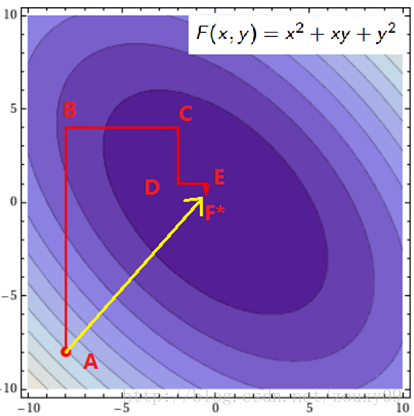
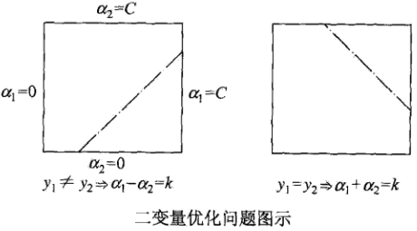

# 序列最小最优化算法SMO

* [返回上层目录](../support-vector-machine.md)

* [坐标下降（上升）法](#坐标下降（上升）法)
* [两个变量二次规划的求解方法](#两个变量二次规划的求解方法)
  * [α2须取临界值的情况](#α2须取临界值的情况)
* [变量的选择方法](#变量的选择方法)
  * [第一个变量的选择](#第一个变量的选择)
  * [第二个变量的选择](#第二个变量的选择)
  * [计算阈值b和插值Ei](#计算阈值b和插值Ei)
* [凸优化问题终止条件](#凸优化问题终止条件)
* [SMO算法](#SMO算法)

支持向量机（support vector machines，SVM）是一种二类分类模型。它的基本模型是定义**在特征空间上的间隔最大的线性分类器**，间隔最大使它有别于感知机；支持向量机还包括核技巧，这使它成为实质上的非线性分类器。支持向量机的**学习策略就是间隔最大化**，可形式化为一个求解凸二次规划（convex quadratic programming）的问题，也等价于正则化的合页损失函数的最小化问题。支持向量机的学习算法是求解凸二次规划的最优化算法。

支持向量机学习方法包含构建由简至繁的模型：线性可分支持向量机（ linear support vector machine in linearly separable case )、线性支持向量机（ linear support vector machine)及非线性支持向量机（non-linear support vector machine)。简单模型是复杂模型的基础，也是复杂模型的特殊情况。当训练数据线性可分时，通过硬间隔最大化（ hard margin maximization)，学习一个线性的分类器，即线性可分支持向量机，又称为硬间隔支持向量机；当训练数据近似线性可分时，通过软间隔最大化（ soft margin maximization)，也学习一个线性的分类器，即线性支持向量机，又称为软间隔支持向量机；当训练数据线性不可分时，通过使用核技巧（kemel trick）及软间隔最大化，学习非线性支持向量机。

当输入空间为欧氏空间或离散集合、特征空间为希尔伯特空间时，核函数（kernel function）表示将输入从输入空间映射到特征空间得到的特征向量之间的内积。**通过使用核函数可以学习非线性支持向量机，等价于隐式地在高维的特征空间中学习线性支持向量机**。这样的方法称为核技巧。核方法（ kernel method)是比支持向量机更为一般的机器学习方法。

Cortes与Vapnik提出线性支持向童机，Boser、Guyon与Vapnik又引入核技巧，提出非线性支持向量机。

本章按照上述思路介绍3类支持向量机、核函数及一种快速学习算法——序列最小最优化算法（SMO)。

====================

终于到SVM的实现部分了。那么神奇和有效的东西还得回归到实现才可以展示其强大的功力。SVM有效而且存在很高效的训练算法，这也是工业界非常青睐SVM的原因。

我们知道，支持向景机的学习问题可以形式化为求解凸二次规划问题。这样的**凸二次规划问题具有全局最优解**，并且有许多最优化算法可以用于这一问题的求解。但是当训练样本容最很大时，这些算法往往变得非常低效，以致无法使用。所以，如何高效地实现支持向量机学习就成为一个重要的问题。目前人们己提出许多快速实现算法，本节讲述其中的序列最小最优化（sequential minimal optimization，SMO）算法，这种算法1998年由Platt提出。

前面讲到，SVM的学习问题可以转化为下面的对偶问题：
$$
\begin{aligned}
&\mathop{\text{min}}_{\alpha}\quad \frac{1}{2}\sum_{i=1}^N\sum_{j=1}^N\alpha_i\alpha_jy_iy_j(x_i\cdot x_j)-\sum_{i=1}^N\alpha_i\\
&\text{s.t.}\ \quad \sum_{i=1}^N\alpha_iy_i=0\\
&\ \ \ \quad \quad 0\leqslant\alpha_i\leqslant C,\ i=1,2,...,N\\
\end{aligned}
$$
在这个问题中，变量是拉格朗日乘子，一个变量αi对应于一个样本(xi,yi)；变量的总数等于训练样本容量N。

上述对偶问题需要满足的KKT条件：
$$
\begin{aligned}
\alpha_i=0&\Rightarrow y^{(i)}(w^Tx^{(i)}+b)\geqslant1\\
\alpha_i=C&\Rightarrow y^{(i)}(w^Tx^{(i)}+b)\leqslant1\\
0<\alpha_i<C&\Rightarrow y^{(i)}(w^Tx^{(i)}+b)=1\\
\end{aligned}
$$
也就是说找到一组αi可以满足上面的这些条件的就是该目标的一个最优解。所以我们的优化目标是找到一组最优的αi\*。一旦求出这些αi\*，就很容易计算出权重向量**w\***和b，并得到分隔超平面了。

这是个凸二次规划问题，它具有全局最优解，一般可以通过现有的工具来优化。但当训练样本非常多的时候，这些优化算法往往非常耗时低效，以致无法使用。从SVM提出到现在，也出现了很多优化训练的方法。其中，非常出名的一个是1982年由Microsoft Research的John C. Platt在论文《Sequential Minimal Optimization: A Fast Algorithm for TrainingSupport Vector Machines》（这也是学习SMO最好的资料）中提出的Sequential Minimal Optimization序列最小化优化算法，简称SMO算法，并成为最快的二次规划优化算法，特别针对线性SVM和数据稀疏时性能更优。SMO算法的思想很简单，它将大优化的问题分解成多个小优化的问题。这些小问题往往比较容易求解，并且对他们进行顺序求解的结果与将他们作为整体来求解的结果完全一致。在结果完全一致的同时，SMO的求解时间短很多。

SMO算法是一种启发式算法，其基本思路是：**如果所有变量的解都满足此最优化问题的KKT条件（Karush-Kuhn-Tucker conditions)，那么这个最优化问题的解就得到了。因为KKT条件是该最优化问题的充分必要条件**。否则，选择两个变量，固定其他变量，针对这两个变量构建一个二次规划问题。这个二次规划问题关于这两个变量的解应该更接近原始二次规划问题的解，因为这会使得原始二次规划问题的目标函数值变得更小。重要的是，这时子问题可以通过解析方法求解，这样就可以大大提高整个算法的计算速度。子问题有两个变量，一个是违反KKT条件最严重的那一个，另一个由约束条件自动确定。如此，SMO算法将原问题不断分解为子问题并对子问题求解，进而达到求解原问题的目的。

注意，子问题的两个变童中只有一个是自由变量。假设α1，α2为两个变最，α3，α4，...，αN固定，那么由上面的等式约束可知
$$
\alpha_1=-y\sum_{i=2}^N\alpha_iy_i
$$
如果α2确定，那么α1也随之确定，所以子问题中同时更新两个变量。因此，我们需要一次选取两个参数做优化，比如α1和α2，此时α1可以由α2和其他参数表示出来。这样回代入W中，W就只是关于α2的函数了，这时候就可以只对α2进行优化了。在这里就是对α2进行求导，令导数为0就可以解出这个时候最优的α2了。然后也可以得到α1。这就是一次的迭代过程，一次迭代只调整两个拉格朗日乘子α1和α2。SMO之所以高效就是因为在固定其他参数后，对一个参数优化过程很高效（对一个参数的优化可以通过解析求解，而不是迭代。虽然对一个参数的一次最小优化不可能保证其结果就是所优化的拉格朗日乘子的最终结果，但会使目标函数向极小值迈进一步，这样对所有的乘子做最小优化，直到所有满足KKT条件时，目标函数达到最小）。

总结下来是：

重复下面过程直到收敛\{

（1）选择两个拉格朗日乘子αi和αj；

（2）固定其他拉格朗日乘子αk(k不等于i和j)，只对αi和αj优化w(**α**);

（3）根据优化后的αi和αj，更新截距b的值；

\}

整个SMO算法包括两个部分：

* 求解两个变量二次规划的解析方法
* 选择变量的启发式方法

在深入SMO算法之前，我们先来了解下坐标下降这个算法，SMO其实基于这种简单的思想的。

# 坐标下降（上升）法

假设要求解下面的优化问题：
$$
\mathop{\text{max}}_{\alpha}W(\alpha_1,\alpha_2,...,\alpha_m)
$$
在这里，我们需要求解m个变量αi，一般来说是通过梯度下降（这里是求最大值，所以应该叫上升）等算法每一次迭代对所有m个变量αi也就是α向量进行一次性优化。通过误差每次迭代调整α向量中每个元素的值。而坐标上升法（坐标上升与坐标下降可以看做是一对，坐标上升是用来求解max最优化问题，坐标下降用于求min最优化问题）的思想是每次迭代只调整一个变量αi的值，其他变量的值在这次迭代中固定不变。
$$
\begin{aligned}
&\text{Loop until convergence:\{}\\
&\quad \quad \text{For i = 1,...,m \{}\\
&\quad \quad \quad \quad \alpha_i:=\text{arg }\mathop{\text{max}}_{\hat{\alpha_i}} W(\alpha_1,...,\alpha_{i-1},\hat{\alpha_{i}},\alpha_{i+1},...,\alpha_m)\\
&\quad \quad \text{\}}\\
&\text{\}}\\
\end{aligned}
$$
最里面语句的意思是固定除αi之外的所有αj(i不等于j)，这时W可看作只是关于αi的函数，那么直接对αi求导优化即可。这里我们进行最大化求导的顺序i是从1到m，可以通过更改优化顺序来使W能够更快地增加并收敛。如果W在内循环中能够很快地达到最优，那么坐标上升法会是一个很高效的求极值方法。

用个二维的例子来说明下坐标下降法：我们需要寻找f(x,y)=x^2+xy+y^2的最小值处的(x\*, y\*)，也就是下图的F\*点的地方。

假设我们初始的点是A（图是函数投影到xoy平面的等高线图，颜色越深值越小），我们需要达到F\*的地方。那最快的方法就是图中黄色线的路径，一次性就到达了，其实这个是牛顿优化法，但如果是高维的话，这个方法就不太高效了（因为需要求解矩阵的逆，这个不在这里讨论）。我们也可以按照红色所指示的路径来走。从A开始，先固定x，沿着y轴往让f(x, y)值减小的方向走到B点，然后固定y，沿着x轴往让f(x, y)值减小的方向走到C点，不断循环，直到到达F\*。反正每次只要我们都往让f(x, y)值小的地方走就行了，这样脚踏实地，一步步走，每一步都使f(x, y)慢慢变小，总有一天，皇天不负有心人的。到达F\*也是时间问题。到这里你可能会说，这红色线比黄色线贫富差距也太严重了吧。因为这里是二维的简单的情况嘛。如果是高维的情况，而且目标函数很复杂的话，再加上样本集很多，那么在梯度下降中，目标函数对所有αi求梯度或者在牛顿法中对矩阵求逆，都是很耗时的。这时候，如果W只对单个αi优化很快的时候，坐标下降法可能会更加高效。

# 两个变量二次规划的求解方法

不失一般性，假设选择的两个变量是α1，α2，其他变量αi(i=3,4,...,N)是固定的，于是SMO的最优化问题
$$
\begin{aligned}
&\mathop{\text{min}}_{\alpha}\quad \frac{1}{2}\sum_{i=1}^N\sum_{j=1}^N\alpha_i\alpha_jy_iy_j(x_i\cdot x_j)-\sum_{i=1}^N\alpha_i\\
&\text{s.t.}\ \quad \sum_{i=1}^N\alpha_iy_i=0\\
&\ \ \ \quad \quad 0\leqslant\alpha_i\leqslant C,\ i=1,2,...,N\\
\end{aligned}
$$
其指令的两个变量的子问题可以写成：
$$
\begin{aligned}
&\mathop{\text{min}}_{\alpha_1,\alpha_2}\quad  W(\alpha_2,\alpha_2)=\frac{1}{2}K_{11}\alpha_1^2+\frac{1}{2}K_{22}\alpha_2^2+y_1y_2K_{12}\alpha_1\alpha_2\\
&\ \ \quad \quad \quad \quad  \quad \quad \quad \quad -(\alpha_1+\alpha_2)+y_1\alpha_1\sum_{i=3}^Ny_i\alpha_iK_{i1}+y_2\alpha_2\sum_{i=3}^Ny_i\alpha_iK_{i2}\\
&\text{s.t.}\ \quad \alpha_1y_1+\alpha_2y_2=-\sum_{i=3}^Ny_i\alpha_i=\zeta\\
&\ \ \ \quad \quad 0\leqslant\alpha_i\leqslant C,\ i=1,2\\
\end{aligned}
$$

其中，Kij=K(xi,yi)，i,j=1,2,...,N，ζ是常数，上式的优化目标函数中省略了不含是α1，α2的常数项。

为了求解两个变量的二次规划问题，首先分析约束条件，然后在此约束条件下求极小。

由于只有两个变量(α1, α2)，约束可以用二维空间的图形表示：

上式（SMO优化问题）的不等式约束使得(α1, α2)在盒子[0, C]x[0, C]内，等式约束使得(α1, α2)在平行于盒子[0, C]x[0, C]的对角线的直线上。因此要**求的是目标函数在一条平行于对角线的线段上的最优值**。这使得**两个变量的最优化问题成为实质上的单变量的最优化问题**，不妨考虑为变量α2的最优化问题。

假设问题的初始可行解为α1(old)，α2(old)，最优解为α1(new)，α2(new)，并且假设在沿着约束方向未经剪辑时α2的最优解为α2(new,unc)。

由于α2(new)需满足不等式约束，所以最优值α2(new)的取值范围必须满足条件
$$
L\leqslant\alpha_2^{\text{new}}\leqslant H
$$
其中，L与H是α2(new)所在对角线断点的界。如果y1≠y2（如上图左图所示），则
$$
L=\text{max}(0,\alpha_2^{\text{old}}-\alpha_1^{\text{old}}),\quad H=\text{min}(C,C+\alpha_2^{\text{old}}-\alpha_1^{\text{old}})
$$
如果y1=y2（如上图右图所示），则
$$
L=\text{max}(0,\alpha_2^{\text{old}}+\alpha_1^{\text{old}}-C),\quad H=\text{min}(C,\alpha_2^{\text{old}}+\alpha_1^{\text{old}})
$$
下面，首先求沿着约束方向未经剪辑即未考虑约束时α2的最优解α2(new,unc)；然后再求剪辑后α2的解α2(new)。我们用定理来叙述这个结果。为了叙述简单，记
$$
g(x)=\sum_{i=1}^N\alpha_iy_iK(x_i,x)+b
$$
令
$$
E_i=g(x_i)-y_i=\left( \sum_{j=1}^N\alpha_jy_jK(x_j,x_i)+b \right)-y_i,\quad i=1,2
$$
当i=1,2时，Ei为函数g(x)对输入xi的预测值与真实值输出yi之差。

**定理**

上述最优化问题沿着约束方向未经剪辑时的解是
$$
\alpha_2^{\text{new,unc}}=\alpha_2^{\text{old}}+\frac{y_2(E_1-E_2)}{\eta}
$$
其中，
$$
\eta=K_{11}+K_{22}-2K_{12}=||\phi(x_1)-\phi(x_2)||^2
$$
Φ(x)是输入空间到特征空间的映射，Ei，i=1,2，上面已经给出。

经剪辑后α2的解是
$$
\begin{aligned}
\alpha_2^{\text{new}}=
\left\{\begin{matrix}
&H, &\alpha_2^{\text{new,unc}}>H\\
&\alpha_2^{\text{new,unc}},&L\leqslant\alpha_2^{\text{new,unc}}\leqslant H\\ 
&L, &\alpha_2^{\text{new,unc}}<L\\
\end{matrix}\right.
\end{aligned}
$$
由α2(new)求得α1(new)是
$$
\alpha_1^{\text{new}}=\alpha_1^{\text{old}}+y_1y_2(\alpha_2^{\text{old}}-\alpha_2^{\text{new}})
$$
**证明**

引进记号
$$
v_i=\sum_{j=3}^N\alpha_jy_jK(x_i,x_j)=g(x_i)-\sum_{j=1}^2\alpha_jy_jK(x_i,x_j)-b,\quad i=1,2
$$
目标函数可以写成
$$
\begin{aligned}
W(\alpha_1,\alpha_2)=&\frac{1}{2}K_{11}\alpha_1^2+\frac{1}{2}K_{22}\alpha_2^2+y_1y_2K_{12}\alpha_1\alpha_2\\
&-(\alpha_1+\alpha_2)+y_1v_1\alpha_1+y_2v_2\alpha_2\\
\end{aligned}
$$
由α1y1=ζ-α2y2及yi^2=1，可将α1表示为
$$
\alpha_1=(\zeta-y_2\alpha_2)y_1
$$
带入上上式，得到只是α2的函数的目标函数：
$$
\begin{aligned}
W(\alpha_2)=&\frac{1}{2}K_{11}(\zeta-\alpha_2y_2)^2+\frac{1}{2}K_{22}\alpha_2^2+y_2K_{12}(\zeta-\alpha_2y_2)\alpha_2\\
&-(\zeta-\alpha_2y_2)y_1-\alpha_2+v_1(\zeta-\alpha_2y_2)+y_2v_2\alpha_2\\
\end{aligned}
$$
上式对α2求导数
$$
\begin{aligned}
\frac{\partial W}{\partial \alpha_2}=&K_{11}\alpha_2+K_{22}\alpha_2-2K_{12}\alpha_2\\
&-K_{11}\zeta y_2+K_{12}\zeta y_2+y_1y_2-1-v_1y_2+y_2v_2
\end{aligned}
$$
令其为0，
$$
\zeta=\alpha_1^{\text{old}}y_1+\alpha_2^{\text{old}}y_2
$$
代入，得到
$$
\begin{aligned}
(K_{11}+K_{22}-2K_{12})\alpha_2^{\text{new,unc}}=&y_2((K_{11}+K_{22}-2K_{12})\alpha_2^{\text{old}}y_2+y_2-y_1+g(x_1)-g(x_2))\\
&=(K_{11}+K_{22}-2K_{12})\alpha_2^{\text{old}}+y_2(E_1-E_2)
\end{aligned}
$$
将
$$
\eta=K_{11}+K_{22}-2K_{12}
$$
代入，于是得到
$$
\alpha_2^{\text{new,unc}}=\alpha_2^{\text{old}}+\frac{y_2(E_1-E_2)}{\eta}
$$
要使其满足不等式约束必须将其限制在区间[L,H]内，从而得到α2(new)的表达式（就是上面的定理）。具体求解如下：

由SMO的优化问题的等式约束
$$
\alpha_1y_1+\alpha_2y_2=\zeta
$$
得到
$$
\begin{aligned}
&\alpha_1^{\text{new}}y_1+\alpha_2^{\text{new}}y_2=\alpha_1^{\text{old}}y_1+\alpha_2^{\text{old}}y_2\\
\Rightarrow &\alpha_1^{\text{new}}=y_1(\alpha_1^{\text{old}}y_1+\alpha_2^{\text{old}}y_2-\alpha_2^{\text{new}}y_2)\\
\Rightarrow &\alpha_1^{\text{new}}=\alpha_1^{\text{old}}+y_1y_2(\alpha_2^{\text{old}}-\alpha_2^{\text{new}})\\
\end{aligned}
$$
于是就得到了SMO的优化问题的解
$$
(\alpha_1^{\text{new}},\alpha_2^{\text{new}})
$$

## α2须取临界值的情况

大部分情况下，有
$$
\eta=K_{11}+K_{22}-2K_{12}>0
$$
。但是在如下几种情况下，α2(new)需要取临界值L或者H。

* η<0，当核函数K不满足Mercer定理时，K矩阵负定
* η=0，样本x1与x2输入特征相同

也可以如下理解，对SMO的优化问题的目标值W(α1,α2)求二阶导数就是η=K11+K22-2K12

* 当η<0时，目标函数W为凸函数，没有极小值，极值在定义域边界处取得
* 当η=0时，目标函数W为单调函数，同样在边界处取极值

计算方法：

即把α2(new)=L和α2(new)=H分别带入
$$
\alpha_1^{\text{new}}=\alpha_1^{\text{old}}+y_1y_2(\alpha_2^{\text{old}}-\alpha_2^{\text{new}})
$$
中，计算出α1(new)=L1和α1(new)=H1，如下式所示：
$$
\begin{aligned}
&L1=\alpha_1^{\text{old}}+y_1y_2(\alpha2^{\text{old}}-L)\\
&H1=\alpha_1^{\text{old}}+y_1y_2(\alpha2^{\text{old}}-H)\\
\end{aligned}
$$
然后将(α1(new)=L1, α2(new)=L)和(α1(new)=H1, α2(new)=H)带入目标函数W内，比较W(α1(new)=L1, α2(new)=L)和W(α1(new)=H1, α2(new)=H)的大小。 α2取小的函数值对应的边界点。

# 变量的选择方法

SMO算法在每个子问题中选择两个变量优化，其中至少一个变量是违反KKT条件的。

## 第一个变量的选择

SMO称选择呢第一个变量的过程为外层循环。**外层循环在训练样本中选取违反KKT条件最严重的样本点**，并将其对应的变量作为第1个变量。具体地，检验训练样本点(xi,yi)是否满足KKT条件，即
$$
\begin{aligned}
\alpha_i=0&\Leftrightarrow  y_ig(x_i)\geqslant1\\
0<\alpha_i<C&\Leftrightarrow  y_ig(x_i)=1\\
\alpha_i=C&\Leftrightarrow  y_ig(x_i)\leqslant1\\
\end{aligned}
$$
其中，
$$
g(x_i)=\sum_{j=1}^N\alpha_jy_jK(x_i,x_j)+b
$$
该检验是在ε范围内进行的。在检验过程中，**外层循环首先优先遍历所有满足条件0<αi<C的样本点，即在将间隔边界上的支持向量点，检验他们是否满足KKT条件**，因为在界上（αi为0或C）的样例对应的系数αi一般不会更改。如果这些样本点都满足KKT 条件，那么遍历整个训练集。

## 第二个变量的选择

SMO称选择第二个变量的过称谓内层循环。假设在外层循环中已经找到第1个变量α1，现在要在内层循环中找到第2个变量α2。**第二个变量选择的标准是希望能使α2有足够大的变化**。

由下式
$$
\alpha_2^{\text{new,unc}}=\alpha_2^{\text{old}}+\frac{y_2(E_1-E_2)}{\eta}
$$
可知，α2(new)是依赖于|E1-E2|的，为了加快计算速度，以中间打的做法是选择α2，使其对应的|E1-E2|最大。因为α1已定，E1也确定了。如果E1是正的，那么选择最小的Ei作为E2；如果E1是负的，那么选择最大的Ei作为E2。为了节省计算时间，将所有的Ei值保存在一个列表中。

在特殊情况下，如果内层循环通过以上方法选择的α2不能使目标函数有足够的下降，那么采用一下启发式规则继续选择α2。遍历在间隔边界上的支持向量点，依次将其对应的变量作为α2试用，知道目标函数有足够的下降。若找不到合适的α2，那么遍历训练数据集；若仍然找不到合适的α2，则放弃第一个α1，再通过外层循环寻求另外的α1。

至此，迭代关系式出了b的推导式以外，都已经推出。

## 计算阈值b和插值Ei

在每次完成两个变量的优化后，都要重新计算阈值b，也就是说b每一步都要更新，因为前面的KKT条件指出αi和yi·g(xi)的关系，而g(xi)和b有关，在每一步计算出αi后，根据KKT条件来调整b。

当0<α1(new)<C时，由KKT条件可知：
$$
\sum_{i=1}^N\alpha_iy_iK_{i1}+b=y_1
$$
于是，
$$
b_1^{\text{new}}=y_1-\sum_{i=3}^N\alpha_iy_iK_{i1}-\alpha_1^{\text{new}}y_1K_{11}-\alpha_2^{\text{new}}y_2K_{21}
$$
由前面的E1定义
$$
E_i=g(x_i)-y_i=\left( \sum_{j=1}^N\alpha_jy_jK(x_j,x_i)+b \right)-y_i,\quad i=1,2
$$
有
$$
E_i=\sum_{i=3}^N\alpha_iy_iK_{i1}+\alpha_1^{\text{old}}y_1K_{11}+\alpha_2^{\text{old}}y_2K_{21}+b^{\text{old}}-y_1
$$
计算b1(new)的上上上式的前两项由上式可写成：
$$
y_1-\sum_{i=3}^N\alpha_iy_iK_{i1}=-E_i+\alpha_1^{\text{old}}y_1K_{11}+\alpha_2^{\text{old}}y_2K_{21}+b^{\text{old}}
$$
并将上式带入计算b1(new)的式子（上上上上式）中，可得
$$
b_1^{\text{new}}=-E_1-y_1K_{11}(\alpha_1^{\text{new}}-\alpha_1^{\text{old}})-y_2K_{21}(\alpha_2^{\text{new}}-\alpha_2^{\text{old}})+b^{\text{old}}
$$
同样，如果0<α2(new)<C，那么，
$$
b_2^{\text{new}}=-E_2-y_1K_{12}(\alpha_1^{\text{new}}-\alpha_1^{\text{old}})-y_2K_{22}(\alpha_2^{\text{new}}-\alpha_2^{\text{old}})+b^{\text{old}}
$$
如果α1(new)，α2(new)同时满足条件0<αi(new)<C，i=1,2，那么b1(new)=b2(new)。如果α1(new)，α2(new)是0或者C，那么b1(new)和b2(new)以及它们之间的数都是符合KKT条件的阈值，这时选择它们的中点作为b(new)。

在每次完成两个变量的优化之后，还必须更新对应的Ei值，并将它们保存在列表中，Ei值的更新要用到b(new)值，以及所有支持向量对应的对应的αj：
$$
E_i^{\text{new}}=\sum_Sy_j\alpha_jK(x_i,x_j)+b^{\text{new}}-y_i
$$
其中，S是所有支持向量xj的集合。

**个人理解：注意，每次更新的只有三个变量：αi,Ei(实际上是ui,即当前模型的预测值,因为每个样本点的真实值是不会改变的),b.**

**更新的变量里没有w,因为计算过程中不需要w的参与,我们并不需要计算出w再来计算每个样本点的预测值，因为从w的计算公式可以看出来，只需计算那些支持向量与样本点的内积即可，之所以这样做，而不是计算出w，再计算每个样本点的预测值，是因为引入核函数之后，就不需要，也很难计算w的值了，w对应的将是一个高维向量，计算起来相当麻烦，而且我们用到w的地方全都可以用低维空间的内积和核函数来代替，所以不更新w。**

# 凸优化问题终止条件

SMO算法的基本思路是：如果说有变量的解都满足此最优化问题的KKT条件，那么这个最优化问题的解就得到了。因为KKT条件是该最优化问题的充分必要条件（证明请参考文献）。

所以我们可以监视原问题的KKT条件，所以所有的样本都满足KKT条件，那么就表示迭代结束了。但是由于KKT条件本身是比较苛刻的，所以也需要设定一个容忍值ε，即所有样本在容忍值ε范围内满足KKT条件则认为训练可以结束；当然了，对于对偶问题的凸优化还有其他终止条件，可以参考文献。

# SMO算法

输入：训练数据集T=\{ (x1,y1),(x2,y2),...,(xN,yN) \}

其中，xi∈X=R^n，yi∈Y=\{+1,-1\}，i=1,2,...,N，精度ε；

输出：近似解
$$
\hat{\alpha}
$$
（1）取初始值α(0)=0，令k=0；

（2）选取优化变量α1(k),α2(k)，解析求解两个变量的最优化问题（如前面所示），求得最优解α1(k+1)，α2(k+1)，更新α为α(k+1)；

（3）若在精度ε范围内满足停止条件：
$$
\begin{aligned}
&\sum_{i=1}^N\alpha_iy_i=0\\
&0\leqslant\alpha_i\leqslant C,\quad i=1,2,...,N\\
&y_i\cdot g(x_i)=
\left\{\begin{matrix}
&\geqslant 1,\quad &\{ x_i|\alpha_i=0 \}\\ 
&= 1,\quad &\{ x_i|0<\alpha_i<C \}\\ 
&\leqslant 1,\quad &\{ x_i|\alpha_i=C \}\\ 
\end{matrix}\right.
\end{aligned}
$$
其中，
$$
g(x_i)=\sum_{j=1}^N\alpha_jy_jK(x_i,x_j)+b
$$
则转（4），否则令k=k+1，转（2）；

（4）取
$$
\hat{\alpha}=\alpha^{(k+1)}
$$
**建议参看SMO原文的伪代码**

这里再总结下SMO算法：

SMO算法是支持向量机学习的一种快速方法，其特点是不断地将元二次规划问题分解为只有两个变量的二次规划问题，并对子问题进行解析求解，知道所有变量满足KKT条件为止。这样通过启发式的方法得到原二次规划问题的最优解。因为子问题有解析解，所以每次计算子问题都很快，虽然计算子问题次数很多，但在总体上还是高效的。

# 参考资料

* 《统计学习方法》李航

本章的结构和大部分内容均参考此书对应章节。

* [机器学习算法与Python实践之（四）支持向量机（SVM）实现](https://blog.csdn.net/zouxy09/article/details/17292011)

"SMO算法"参考了此博客。

* [坐标上升/下降算法](https://blog.csdn.net/u010626937/article/details/75044343)

"坐标下降（上升）法"参考了此博客。

* [【机器学习详解】SMO算法剖析](https://blog.csdn.net/luoshixian099/article/details/51227754)

"α2须取临界值的情况"参考了此博客。

* [SMO算法(比较好的讲解)](https://blog.csdn.net/aiaiai010101/article/details/73350990)

"变量的选择方法"最后的个人理解参考了此博客。

* [支持向量机（五）SMO算法](https://www.cnblogs.com/jerrylead/archive/2011/03/18/1988419.html)

"SMO算法"参考了此博客。

