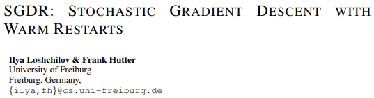
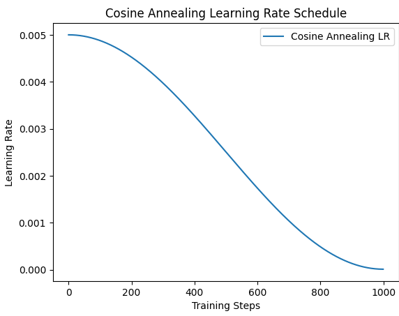
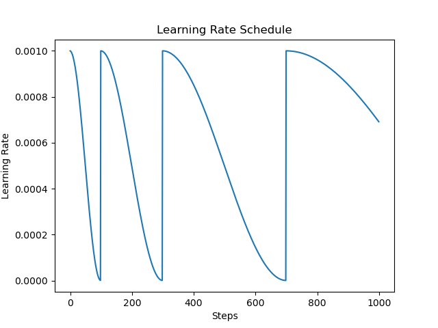
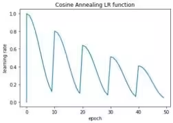
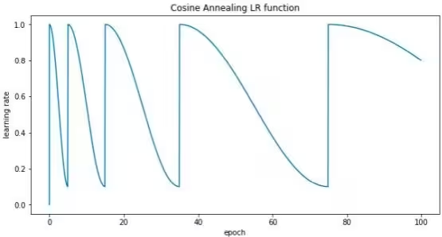
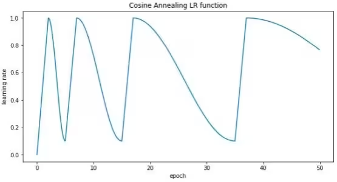

# 余弦退火和余弦重启

- [返回上层目录](../learning-rate.md)
- [余弦退火和余弦重启的理念](#余弦退火和余弦重启的理念)
  - [余弦退火](#余弦退火)
  - [余弦重启](#余弦重启)
    - [余弦重启算法的具体参数含义](#余弦重启算法的具体参数含义)
      - [指数衰减step_scale](#指数衰减step_scale)
      - [逐渐放大周期（Tmult参数）](#逐渐放大周期（Tmult参数）)
      - [预热机制warm_up](#预热机制warm_up)
- [余弦退火和余弦重启在pytorch中的实现](#余弦退火和余弦重启在pytorch中的实现)
  - [余弦退火（Cosine Annealing）](#余弦退火（Cosine Annealing）)
  - [余弦重启（Cosine Annealing with Restarts）](#余弦重启（Cosine Annealing with Restarts）)
  - [两者的核心区别](#两者的核心区别)
  - [高级用法](#高级用法)
  - [可视化对比](#可视化对比)
  - [对比总结](#对比总结)

余弦退火很简单，这里只看余弦重启的论文《*SGDR: Stochastic Gradient Descent With Warm Restarts*》：



pdf: [SGDR: Stochastic Gradient Descent With Warm Restarts](https://arxiv.org/pdf/1608.03983)

在深度学习模型训练过程中，学习率（Learning Rate, LR）对模型的收敛速度和最终性能起着至关重要的作用。如果学习率过大，可能导致梯度更新过大，模型难以收敛甚至发散；如果学习率过小，模型的训练时间可能会过长，并且可能陷入局部最优解。因此，合理地调整学习率是训练深度学习模型的关键策略之一。

学习率调度器（Learning Rate Scheduler）用于**动态调整训练过程中使用的学习率**，以提高模型的收敛性并避免陷入局部最优解。

# 余弦退火和余弦重启的理念

## 余弦退火

余弦衰减的作用

- **缓慢降低学习率**：在训练初期，学习率较高，让模型快速探索最优解。随着训练进行，学习率逐渐下降，让模型稳定收敛。
- **避免梯度震荡**：相比于直接线性衰减，余弦曲线能更平稳地调整学习率，避免梯度更新过快或过慢。

余弦衰减学习率的公式如下：
$$
\eta_{t}=\eta_{\text{min}}+\frac{1}{2}(\eta_{\text{max}}-\eta_{\text{min}})\left(1+\cos\left(\frac{t}{T}\pi\right)\right)
$$
其中：

* $\eta_{t}$表示第$t$轮训练的学习率。
* $\eta_{\text{max}}$表示初始学习率。
* $\eta_{\text{min}}$表示最终的学习率（一般设为 0）。
* $T$代表训练的总步数。



## 余弦重启

余弦重启的核心思想是：

> "当模型逐渐收敛时，用周期性的高学习率注入新的探索机会"

对于PPO来说，这种“再激活”有时候能**帮助跳出次优策略局部最优解**，尤其在训练陷入停滞或plateau的时候。


余弦重启调度器（Cosine Annealing with Warm Restarts）是一种分段余弦衰减策略，能够周期性地将学习率重置回较高值，从而帮助优化器跳出局部最优解，提高泛化性能。

**余弦重启**（Cosine Annealing with Warm Restarts）是余弦衰减（Cosine Annealing）的一个扩展，区别在于它**周期性地重启**，每次重启可能还会**周期变长**。

在 `SGDR`（Stochastic Gradient Descent with Warm Restarts）论文中，它把衰减周期设置成会**周期性重启**，

- 这是**余弦衰减的变种**，它允许**学习率在下降到最低点后重启**，适用于**周期性任务**（如强化学习、元学习）。
- 学习率曲线呈现多个下降周期，而不是单调下降。



设初始学习率为 $\eta_{\max}$，最小学习率为 $\eta_{\min}$，初始周期步数为 $T_0$，周期增长因子为 $T_{\text{mult}}$，则第 $i$ 个周期的长度为：
$$
T_i = T_0 \cdot T_{\text{mult}}^i
$$
设当前step为$t$，且位于第 $i$ 个周期中，周期起始位置为 $T_{\text{cur_start}}$，则当前step对应的学习率为：

$$
\eta_t = \eta_{\min} + \frac{1}{2} (\eta_{\max} - \eta_{\min}) \left(1 + \cos\left( \pi \cdot \frac{t - T_{\text{cur_start}}}{T_i} \right)\right)
$$
适用范围：

- $t \in [T_{\text{cur_start}}, T_{\text{cur_start}} + T_i)$
- 每当$t \geq T_{\text{cur_start}} + T_i$，就进入下一个重启周期
- 周期长度更新为：$T_i = T_0 \cdot T_{\text{mult}}^i$

参数说明

* $\eta_t$：当前step的学习率
* $\eta_{\max}$：每次重启后的初始学习率
* $\eta_{\min}$：学习率衰减的最小值
* $T_0$：初始余弦周期长度（step数）
* $T_i$：第$i$次余弦周期的长度
* $T_{\text{mult}}$：每次周期增长倍数（默认为 $2$）
* $t$：当前的训练step
* $T_{\text{cur_start}}$：当前周期的起始step编号


### 余弦重启算法的具体参数含义

#### 指数衰减step_scale

在实际的训练中，在一定次数的训练后，损失函数可能已经达到全局最优解附近，每 次重启后的学习率不必返回到一开始设定的全局最大值（否则会浪费大量时间在跳出最优解 和回到最优解上，也会造成难以收敛的情况）， 因此在每次重启后，设定的返回值要逐渐减 小， 因此设定step_scale参数， 可以使函数每次重启的时候乘上一个step_scale的权重， 实现每次重启后学习率的最大值逐渐减小的效果， 如下图所示：



#### 逐渐放大周期（Tmult参数）

同样的，在设定重启所间隔的步数时，也考虑到了同样的问题。到了训练后期， 随着损失函数逐渐靠近全局最优解，在这时用测试集去测试正确率，总能在学习率较低的时候获得一个较高的正确率，但是在重启后测试，正确率会降低，这是因为重启后较大的学习率会导致损失函数冲出全局最优解而重新开始训练， 因此一开始设定的重启周期将不再适用 （本质上重启是为了越过局部最小值而设定的，当损失函数已经接近全局最优解时，重启已 经没有意义）， 需要引入新的参量$T_{mult}$， 新参量的引入实现了如下效果：

$T_0$参数表示函数第一次重启时的epoch；

当$T_{mult}$没有被引入时（default= 1 ），那么学习率将在$T_0 , 2\times T_0 , 3\times T_0 , ...... , i\times T_0$处回到最大值。

例如， 当设定$T_0=5$时， 学习率会在$5, 10, 15, \cdots, 5\times i$的位置重启；

引入参量$T_{mult}$， 学习率将在$T_0 , ( 1+T_{mult})\times T_0 , ( 1+T_{mult}+T_{mult}^2)\times T_0 , \cdots , ( 1+T_{mult}+T_{mult}^2+\cdots+T_{mult}^i)\times T_0$ 处回到最大值；

例如， 当设定$T_0=5$，$T_{mult}=2$时候， 学习率会在$5, 15, 35, \cdots$处重启。



上图展示了$T_{mult}$被引入后学习率的变化图像，每次重启所需要的epoch会逐渐变大， 这样到了训练后期， 学习率不会再有重启的过程， 而是一直保持下降的趋势直到训练结束， 可以有效的避免训练后期重启后损失函数冲出全局最优解的情况。

#### 预热机制warm_up

在实战中， 大部分模型的参数都是随机初始化的， 因此初始参量的数值可能不稳定， 训练时如果贸然将学习率重启为一个较大的值可能会发生数值爆炸导致后续训练无法完成， 因此需要引入一个新的步骤—warm up。在warm up步骤中，学习率会从$\eta_{min}$逐渐增大到$\eta_{max}$， 保证了模型的数值不会在重启后爆炸， 而是短暂的学习一段时间将数值稳定下来再 调大学习率开始寻找最优解。



**为什么 warm-up 阶段不直接用余弦重启**：

1. **warm-up 的目标是“逐步增大学习率”**

- 一开始模型参数是随机初始化的，如果学习率太大，可能会导致 **梯度爆炸或不稳定**；
- 所以 warm-up 通常用线性（或指数）方式 **从很小逐渐增大**；
- 如果这时候用余弦曲线，会出现**学习率先降后升**的震荡行为，可能会干扰训练初期的稳定性。

2. **余弦调度是为了“逐渐减小学习率”**

- 它假设模型已经进入一个相对好的状态，可以慢慢收敛；
- 而 warm-up 阶段模型还在“摸索”，太早开始 cosine 反而容易让模型陷入震荡。

3. **warm-up + cosine 是两个阶段、两个目标**

- warm-up：让学习率从小到大，稳定进入训练状态；
- cosine：训练过程中做 fine-tune，逐渐收敛；
- 所以更合理的方式是：**先 warm-up 再 cosine**，中间用 `piecewise`（分段调度）实现。

# 余弦退火和余弦重启在pytorch中的实现

在PyTorch中，**余弦退火（Cosine Annealing）**和**余弦重启（Cosine Annealing with Restarts）**分别通过 `CosineAnnealingLR` 和 `CosineAnnealingWarmRestarts` 实现。以下是它们的核心区别、使用方法和代码示例：

## 余弦退火（Cosine Annealing）

**功能**

- 学习率按余弦函数从初始值平滑下降至最小值（`eta_min`），**无周期性重启**。
- 适用于稳定收敛至局部最优的场景。

**PyTorch实现**

```python
from torch.optim.lr_scheduler import CosineAnnealingLR
from torch.optim import Adam

# 模型和优化器
model = ...  # 你的模型
optimizer = Adam(model.parameters(), lr=0.1)

# 定义余弦退火调度器
scheduler = CosineAnnealingLR(
    optimizer,
    T_max=100,     # 半周期长度（总迭代次数）
    eta_min=1e-5   # 最小学习率
)

# 训练循环
for epoch in range(200):
    optimizer.step()
    scheduler.step()  # 更新学习率
    print(f'Epoch {epoch}, LR: {optimizer.param_groups[0]["lr"]}')
```

**学习率曲线**

```
初始学习率 (0.1) → 余弦下降 → 最小学习率 (1e-5) → 保持最小值
```

## 余弦重启（Cosine Annealing with Restarts）

**功能**

- 学习率按余弦函数周期性下降并重启（恢复到初始值），每个周期长度为 `T_0`。
- 适用于需要**周期性跳出局部最优**的任务（如强化学习、对抗训练）。

**PyTorch实现**

```pytorch
from torch.optim.lr_scheduler import CosineAnnealingWarmRestarts
from torch.optim import Adam

# 模型和优化器
optimizer = Adam(model.parameters(), lr=0.1)

# 定义余弦重启调度器
scheduler = CosineAnnealingWarmRestarts(
    optimizer,
    T_0=50,        # 重启周期长度
    T_mult=2,      # 周期倍增因子（可选，每次重启后T_0 *= T_mult）
    eta_min=1e-5   # 最小学习率
)

# 训练循环
for epoch in range(200):
    optimizer.step()
    scheduler.step()
    print(f'Epoch {epoch}, LR: {optimizer.param_groups[0]["lr"]}')
```

**学习率曲线**

```
初始学习率 (0.1) → 余弦下降 → 最小值 (1e-5) → 重启 → 重复...
```

**关键参数**

| 参数      | 作用                                                 |
| :-------- | :--------------------------------------------------- |
| `T_0`     | 初始周期长度（如50步）                               |
| `T_mult`  | 周期倍增因子（默认1，设为2时每次重启后周期长度翻倍） |
| `eta_min` | 最小学习率（默认0）                                  |

## 两者的核心区别

| 特性               | 余弦退火 (`CosineAnnealingLR`) | 余弦重启 (`CosineAnnealingWarmRestarts`) |
| :----------------- | :----------------------------- | :--------------------------------------- |
| **周期性重启**     | ❌ 无                           | ✅ 有                                     |
| **适用场景**       | 稳定收敛任务                   | 需跳出局部最优的任务                     |
| **参数**           | `T_max`（半周期长度）          | `T_0`（完整周期长度）                    |
| **学习率曲线形状** | 单次余弦下降                   | 多次余弦下降+重启                        |

## 高级用法

**(1) 分组学习率调度**

为模型不同部分（如共享层、任务头）设置独立的调度器：

```python
# 优化器分组
optimizer = Adam([
    {'params': model.base.parameters(), 'lr': 0.1},
    {'params': model.head.parameters(), 'lr': 0.05}
])

# 为每组定义独立的余弦重启
scheduler_base = CosineAnnealingWarmRestarts(optimizer.param_groups[0], T_0=50)
scheduler_head = CosineAnnealingWarmRestarts(optimizer.param_groups[1], T_0=30)

# 训练中分别更新
for epoch in range(100):
    optimizer.step()
    scheduler_base.step()
    scheduler_head.step()
```

**(2) 自定义余弦周期**

通过 `LambdaLR` 实现更灵活的周期控制：

python

复制

```
from torch.optim.lr_scheduler import LambdaLR

def cosine_with_restarts(epoch, T_0=50, eta_min=1e-5):
    return eta_min + 0.5 * (1 - eta_min) * (1 + math.cos(math.pi * (epoch % T_0) / T_0))

scheduler = LambdaLR(optimizer, lr_lambda=lambda epoch: cosine_with_restarts(epoch, T_0=50))
```

## 可视化对比

使用Matplotlib绘制两种调度器的学习率曲线：

```python
import matplotlib.pyplot as plt

def plot_scheduler(scheduler, epochs, title):
    lrs = []
    for _ in range(epochs):
        lrs.append(optimizer.param_groups[0]['lr'])
        scheduler.step()
    plt.plot(lrs, label=title)

# 对比
optimizer = Adam([torch.randn(2, 2)], lr=0.1)
plt.figure(figsize=(10, 5))

# 余弦退火
scheduler1 = CosineAnnealingLR(optimizer, T_max=50, eta_min=1e-5)
plot_scheduler(scheduler1, 200, 'CosineAnnealingLR')

# 余弦重启
optimizer.param_groups[0]['lr'] = 0.1  # 重置学习率
scheduler2 = CosineAnnealingWarmRestarts(optimizer, T_0=50, eta_min=1e-5)
plot_scheduler(scheduler2, 200, 'CosineAnnealingWarmRestarts')

plt.legend()
plt.show()
```

## 对比总结

- **余弦退火**：单次下降，适合稳定收敛。
- **余弦重启**：周期性重启，适合探索性任务。
- **选择依据**：根据任务是否需要周期性“重置”学习率来决定。
- **扩展性**：可通过分组调度或自定义 `LambdaLR` 实现更复杂策略。

# 参考资料

* [深度学习中的学习率调度器（lr_scheduler）详解：以 Cosine 余弦衰减为例（中英双语）](https://lishizheng.blog.csdn.net/article/details/145780989)

“余弦退火和余弦重启的理念”一节参考了此博客。

- [深度学习中神奇的lr schedule算法—余弦退火【第一届寻翊奖】尾羽奖](https://www.bilibili.com/opus/923404503954227221)

该博客又参考了：Ilya Loshchilov , Frank Hutter,University of Freiburg , Freiburg , Germany.SGDR: Stochastic Gradient Descent With Warm Restarts

===

