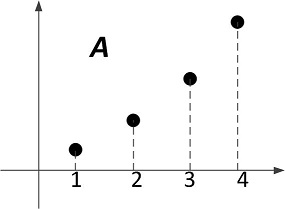
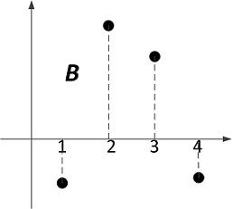

# 傅里叶变换

* [返回上层目录](../calculus.md)
* [傅里叶变换的直观理解](#傅里叶变换的直观理解)
  * [直观理解之一：从相似度角度理解傅里叶变换](#直观理解之一：从相似度角度理解傅里叶变换)

重要：

[拉普拉斯变换的物理意义是什么？](https://www.zhihu.com/question/22102732/answer/290339137?group_id=934197907310129152#comment-381616429)

https://www.zhihu.com/question/22102732/answer/369089156

# 傅里叶变换的直观理解

## 直观理解之一：从相似度角度理解傅里叶变换

**声明：这个理解源自邹博老师的[《机器学习》](http://www.chinahadoop.cn/course/982/learn#lesson/18658)授课视频。**

先介绍**相似度**的概念。

两向量$A$和$B$，如下图所示，它们如果重合，则完全相似，若垂直，则完全不相似，所以，它们之间的夹角$\theta$的余弦$cos(\theta)$就反映了向量$A$和$B$之间的相似度，若两向量重合则为1，若垂直则为0。

而$cos(\theta)=\frac{A\cdot B}{|A||B|}$，对于多维向量，假设$A = [1, 3, 7, 9]^{T}$，$B = [-4, 9, 7, -3]^{T}$。我们把不同维度依次排开在$x$轴上，$y$轴是不同维度对应的向量坐标值，则$A$、$B$向量如下图所示：

                 

则向量$A$和向量$B$的相似度为$A\cdot B = \sum_{i=1}^{4}A_i\cdot B_i$。注：这里忽略了向量模的大小，因为这里并不追求绝对相似度，之后不再就此注解。

那么对于无穷维向量(无穷维向量其实就是普通的单变量实数函数)，如$f(x)$、$g(x)$等。令无穷维向量$A = f(x)$、$B = g(x)$。那么无穷维向量$A$、$B$之间的相似度就是
$$
A\cdot B = \int f(x)\cdot g(x)dx
$$
上式其实也能理解为函数$f(x)$在$g(x)$这个坐标向量上的投影。

那么现在我们使用一些列线性无关且相互正交的无穷维坐标向量作为$g(x)$，比如：
$$
\left\{\begin{matrix}
sin(x)\\ 
sin(2x)\\ 
...\\ 
sin(wx)\\ 
...
\end{matrix}\right.
$$
也就是$sin$函数组成的无穷维空间上的正交基。则函数$A = f(x)$在无穷维正交坐标基上的坐标分量为
$$
\left\{\begin{matrix}
A_1 = A\cdot sin(x) = \int f(x)\cdot sin(x) dx\\ 
A_2 = A\cdot sin(2x) = \int f(x)\cdot sin(2x) dx\\ 
...\\ 
A_w = A\cdot sin(wx) = \int f(x)\cdot sin(wx) dx\\ 
...
\end{matrix}\right.
$$
那么，显然函数$A = f(x)​$就可以表示为在无穷维坐标基上的无穷维坐标：
$$
\begin{aligned}

f(x) &= A_1\cdot sin(x) + A_2\cdot sin(2x) + ... + A_w \cdot sin(wx) + ...\\

&= sin(x)\cdot \int f(x)\cdot sin(x)dx +  sin(2x)\cdot \int f(x)\cdot sin(2x)dx + ... + sin(wx)\cdot \int f(x)\cdot sin(wx)dx + ...

\end{aligned}
$$

# 如何理解傅里叶公式？

https://www.zhihu.com/question/19714540

# 参考资料

===

[Laplace变换与Fourier变换之间有何关系？](https://zhuanlan.zhihu.com/p/130933080)

