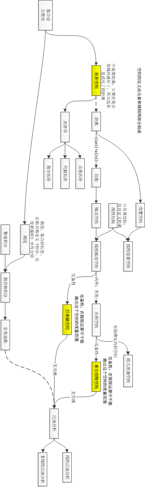

# 希尔伯特空间

* [返回上层目录](../calculus.md)

这里讲希尔伯特空间，是因为机器学习的支持向量机SVM需要用到。

大家一听希尔伯特空间，头肯定就大了，都对数学有一种恐惧。

其实，这就是国内数学老师的一种通病，就是，不给你把概念的来源去脉说清楚，直接上来就讲公式，你说，这样除了天才，谁还能听懂。。

这样讲的原因，我分析了一下，主要有两个原因：

* 老师自己也没搞懂，就只好照着书上念了。
* 自己搞懂了，
  * 但是因为本质太简单，其实一句话就能说清楚的事，他就不说，生怕你一下子就理解了，显得自己教的东西没水平，怕让学生觉得自己很lowB。
  * 还有就是自己当年也是辛辛苦苦参悟出来的，现在不愿意把自己的理解给你说出来，想让你也经历一次这样的痛苦，不然就显得自己当时吃的苦没有意义。 

其实，数学就是数据加结构，也就是C++中类的概念，这个类中的操作一般可以在这个类定义的数据中完成。

关于希尔伯特空间，我们从最基本的数学概念说起，然后一步步严格化和规则化，得到希尔伯特空间。

1. 最基本的数学概念，就是**集合论和公理化**
2. 集合稍微规则化一些，就得到了**拓扑空间**，拓扑空间还没有定义距离，只要在集合内就好了，所以，拓扑空间是弱化了的距离
3. 然后加上“距离”的规则限制，就得到了**度量空间**，什么是距离呢？这是个很有意思的问题。。
4. 给度量空间加上范数的限制，就得到了**赋范空间**
5. 赋范空间使用线性结构（给定基坐标），就得到了**线性赋范空间**
6. 线性赋范空间加上内积的概念，就得到了**内积空间**。什么是内积呢？就是夹角啊。。。内积的本质，就是相似度
7. 给内积空间加上完备性限制，就是**希尔伯特空间**。什么是完备性，就是你在这个空间跑啊跑啊，但是总也跑不出，就是极限运算也跑不出这个空间的度量范围。
8. 延伸一下，希尔伯特空间拓展到无穷维，就是**泛函分析**。什么是无穷维，傅里叶变换学过吗？它的函数基就是无穷维呀。
9. 最后再从集合论讲述下另一个分支，最后这两大分支可以合二为一：由集合论和公理化可以得到**测度**的概念。测度加上**黎曼积分**，就成了**勒贝格积分**，勒贝格积分就是**实变函数**，实变函数用于**泛函分析**。你看，这样子，两条主线就合二为一了。嘿嘿

所以，我很鄙视那些讲课故意只讲概念的数学老师！明明这么简单的概念，他就是故意不给你讲清楚本质，然后在表面的概念上绕老绕去，故意让学生不理解，显得自己很牛逼，这样其实太LowB！

学过傅立叶展开吗？傅立叶展开是以三角函数为基矢。希尔伯特空间类似，以一个相互正交的函数组为基矢的空间。那么函数就成了这个空间的矢量。函数可以展开为基矢的线性叠加，基矢的系数就相当于矢量的各个分量。

下面用一张图来说明希尔伯特空间是怎么一步步由最基本的集合加上各种规则得到的。什么是函数空间，什么是希尔伯特空间，简单清楚：

# 参考资料

* [函数空间-上海交通大学公开课：数学之旅](http://open.163.com/special/cuvocw/shuxuezhilv.html)

文中的图就来自于次公开课中的讲述内容。

* [如何理解希尔伯特空间？](https://www.zhihu.com/question/19967778)

文中对希尔伯特空间的理解来自于此。

* [什么是数学中的各种空间：线性空间、度量空间、赋范空间、内积空间、欧几里得空间、希尔伯特空间、巴拿赫空间？](https://zhuanlan.zhihu.com/p/541226732)
* [空间，框架与基](https://zhuanlan.zhihu.com/p/37916836)
* [内积空间、距离空间、赋范线性空间之间的关系](https://zhuanlan.zhihu.com/p/467333570)

