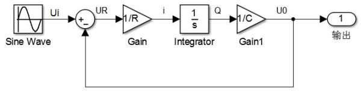

# e的直观认识

* [返回上层目录](../calculus.md)

* [对e的困惑](#对e的困惑)
* [e的起源](#e的起源)
* [泰勒级数](#泰勒级数)
* [什么是e](#什么是e)
* [进一步发散思维](#进一步发散思维)
* [结语](#结语)

# 对e的困惑

在高中，数学课本就告诉我们，e是一个自然常数，约等于2.717，可作为指数函数的底。在大学，高数课本直接告诉我们
$$
e=\lim_{t \rightarrow\infty }{ (1+\frac{1}{t})^{t}}
$$
，但都没有告诉我们它是怎么得到的，以及为什么这么奇怪的一个数字却叫自然常数。

不仅书上不讲为什么，而且老师也从来不讲，因为老师也特码不知道啊，这真是令人操蛋啊。多少本来可以很热爱数学的人都被生生折磨的认为自己根本不是学数学的料，从此放弃了数学，损失了人生的一大乐趣，其实数学和艺术一样，都是非常有意思和耐人寻味的。

实际上，e是自然界所有连续增长过程都共有的基本增长率，类似于π是所有圆都共有的周长与直径的比率，是在自然界普遍存在的，所以是自然常数。类似于：

热水自然会冷却；大火自然会熄灭；植物自然会长成；动物自然会繁衍。

这里的“自然”，就是自然本身赋予事物的有关变化属性。按照古希腊哲学家的自然思想，自然是指万物的内在规律，就像自然数一样，是事物本身的属性，不以人的喜好而变化。

# e的起源

e是怎么来的呢？现在假设我们对e一无所知，重新来发现和认识e。

先来看典型的RC系统（电阻电容串联系统），它的变化规律能代表自然界很多相似现象的变化规律。

给RC电路一个阶跃输入，输出变化的速度是时刻变化的，而且这种变化与当前的输出量本身是相关联的。假设输入输出的初值是0，当输入突然变为1以后，输出开始上升，并且输出越大，上升约慢，且输出上升的速度与输出的大小呈正比。

这里我们可以根据上述例子抽象出下面这个公式
$$
\frac{df(x)}{dx}=\lambda f(x)
$$
为了简单明了起见，这里将系数λ置为1，则上面的式子变为了下面的式子
$$
\frac{df(x)}{dx}=f(x)
$$
从上面这个式子能看出，f(x)的变化率就等于它本身，也就是说，如果事物A的变化=A本身的某种性质，那么我们就把这个f(x)叫作e^x ，即为以e为底的指数函数。

好了，上面的内容先到这里，一会会继续用到，这里先讲讲泰勒级数吧。

# 泰勒级数

假设你并不知道什么是泰勒级数，如果你知道，请假装不知道。

我们知道，时间是无时不刻在流逝的，相应的变化也无时不刻在发生，对于变化的研究，先从最容易测量的物体位置开始。

来看这个容易直观理解的例子。假设你和小明从同一个起点开始跑。如果你和他在起点处的速度相等，加速度相等，加加速度相等。。。那么在任意时刻，你和小明跑过的路程一样。因为起点处速度相同，所以经过很短的时间，你们的路程相同。又因为起点处的加速度相同，所以此刻你们的速度也还是相同，又因为起点处的加加速度相同，所以此刻你们的加速度也还是相同，以此类推，所以你们的所有状态都相同。再经过很短的时间后你们又像初始时刻那样所有状态完全相同。以此类推，经过任意长时间后，结论亦相同。这里唯一的条件就是任意阶导数可导。

这样，可以把函数看成距离s(t) = 初始距离 + 初始速度产生的距离 + 初始加速度产生的距离 + 初始加加速度（加速度的变化率：jerk）产生的距离 + ...产生的距离，即
$$
S(t) = S_{0} + \int_{0}^{t} v_{0} dt + \int_{0}^{t}\int_{0}^{t} a_{0} dtdt + \int_{0}^{t}\int_{0}^{t}\int_{0}^{t} j_{0} dtdtdt + ...\ =S_{0} + v_{0}t + \frac{1}{2\times 1} a_{0}t^{2} + \frac{1}{3\times 2\times 1} j_{0}t^{3} + ...
$$
如果不理解无穷阶的，那我们用递推法理解。

①假设速度为0，小明和你的初始位置一样，则有
$$
S(t) = S_{0} 
$$
②假设加速度为0，小明和你的初始位置和初始速度一样，则有
$$
S(t) = S_{0} + \int_{0}^{t} v_{0} dt
$$
③假设加加速度为0，小明和你的初始位置和初始速度和初始加速度一样，则有
$$
S(t) = S_{0} + \int_{0}^{t} v_{0} dt + \int_{0}^{t}\int_{0}^{t} a_{0} dtdt
$$
④假设加加加速度为0，小明和你的初始位置和初始速度和初始加速度和初始加加速度一样，则有
$$
S(t) = S_{0} + \int_{0}^{t} v_{0} dt + \int_{0}^{t}\int_{0}^{t} a_{0} dtdt + \int_{0}^{t}\int_{0}^{t}\int_{0}^{t} j_{0} dtdtdt
$$
⑤然后假设各阶导数都存在，小明和你的初始各阶导数都一样，则有
$$
S(t) = S_{0} + \int_{0}^{t} v_{0} dt + \int_{0}^{t}\int_{0}^{t} a_{0} dtdt + \int_{0}^{t}\int_{0}^{t}\int_{0}^{t} j_{0} dtdtdt + ...
$$
所以同样也能得到
$$
S(t) =S_{0} + v_{0}t + \frac{1}{2\times 1} a_{0}t^{2} + \frac{1}{3\times 2\times 1} j_{0}t^{3} + ...
$$
我们身边一切事物的特征，除以无时不刻在流逝的时间，不就是他们的变化吗。我们开始发现，只要知道了事物的变化规律，就能掌握事物的未来。

从微积分的观点看，世界是可以求导的，拉普拉斯说：如果知道宇宙中每个粒子的位置，并且知道其变化速率，那么我们就能够准确地预知宇宙的未来。这就是著名的还原论。

我们身边一切事物的特征，除以无时不刻在流逝的时间，不就是他们的变化吗。我们开始发现，只要知道了事物的变化规律，就能掌握事物的未来。
$$
f(x) = f(0) + \frac{f^{'}(0) }{1} x + \frac{f^{''}(0) }{2\times 1} x^{2} + \frac{f^{'''}(0) }{3\times 2\times 1} x^{3} + ...
$$
上面这个式子就是泰勒级数展开，它既能预测未来，也能获知过去，这真是碉堡了有没有。

这里如果令
$$
k_{n}=\frac{x^{n}}{n\times (n-1)\times (n-2)\times ...3\times 2\times 1}=\frac{x^{n}}{n!}
$$
则函数f(x)的泰勒展开变为其各阶导数的线性加权
$$
f(x) = k_{0}f(0) + k_{1}f^{'}(0) + k_{2}f^{''}(0) +k_{3} f^{'''}(0) + ...
$$
这里，我们好奇随着求导阶次n的提高，kn的变化趋势及极限是多少。

即求
$$
\lim_{n \rightarrow \infty}{\frac{x^{n}}{n!} }
$$
为了方便描述，令
$$
b_{n}=\frac{x^{n}}{n!} 
$$
对于任意的x，肯定存在这样的一个N满足：N>2a

于是当n>N时，
$$
\frac{b_{n}}{b_{n-1}} =\frac{a}{n}<\frac{1}{2}
$$
，所以，
$$
\frac{b_{n}}{b_{n-1}} \frac{b_{n-1}}{b_{n-2}} \frac{b_{n-2}}{b_{n-3}}... \frac{b_{N+1}}{b{N}}=(\frac{a}{n})^{n-N}<(\frac{1}{2})^{n-N}
$$
所以，
$$
b{n}<(\frac{1}{2})^{n-N}b{N}\  \ \ \ \ \ \ (\text{while } n>N)
$$
由夹逼（我真的不懂啊。。。）定理，显然有
$$
\lim_{n \rightarrow \infty}{\frac{x^{n}}{n!} }=\lim_{n \rightarrow \infty}{b_{n}}=0
$$

# 什么是e

前面我们说了，如果一个函数，满足
$$
\frac{df(x)}{dx}=f(x)
$$
，那么，这个函数f(x)就是e^x。虽然这么定义了e，但是e到底是什么呢？

首先，由泰勒公式，我们知道一个任意函数f(x)可以进行泰勒展开。
$$
f(x) = f(0) + \frac{f^{'}(0) }{1} x + \frac{f^{''}(0) }{2\times 1} x^{2} + \frac{f^{'''}(0) }{3\times 2\times 1} x^{3} + ...
$$
同时，
$$
\frac{df(x) }{dx}=f^{'}(x)
$$
也是一个函数，当然也可以进行泰勒展开喽。
$$
\frac{df(x) }{dx}=f^{'}(x) = f^{'}(0) + \frac{f^{''}(0) }{1} x + \frac{f^{'''}(0) }{2\times 1} x^{2} + \frac{f^{''''}(0) }{3\times 2\times 1} x^{3} + ...
$$
所以，由e^x的性质
$$
\frac{df(x)}{dx}=f(x)
$$
可知
$$
f(0) + \frac{f^{'}(0) }{1} x + \frac{f^{''}(0) }{2\times 1} x^{2} + \frac{f^{'''}(0) }{3\times 2\times 1} x^{3} + ...=f^{'}(0) + \frac{f^{''}(0) }{1} x + \frac{f^{'''}(0) }{2\times 1} x^{2} + \frac{f^{''''}(0) }{3\times 2\times 1} x^{3} + ...
$$
对上面的公式合并同类项
$$
(f(0)-f^{'}(0)) + (\frac{f^{'}(0) }{1}-\frac{f^{''}(0) }{1}) x + (\frac{f^{''}(0) }{2\times 1}-\frac{f^{'''}(0) }{2\times 1} ) x^{2} + (\frac{f^{'''}(0) }{3\times 2\times 1}-\frac{f^{''''}(0) }{3\times 2\times 1}) x^{3} + ...=0
$$
因为上面这个式子中，不论x是多少，它总是等于0。所以，它的每一项都等于0才行，即
$$
f(0)=f^{'}(0)\ f^{'}(0)=f^{''}(0)\ f^{''}(0)=f^{'''}(0)\ f^{'''}(0)=f^{''''}(0)\ ...
$$
即
$$
f(0)=f^{'}(0)=f^{''}(0)=f^{'''}(0)=f^{''''}(0)=...
$$
也就是说，为了满足
$$
\frac{df(x)}{dx}=f(x)
$$
，函数f(x)的初值和各阶导数必须要全部相等。

所以e^x的定义就是
$$
e^x= f(0) + \frac{f(0) }{1} x + \frac{f(0) }{2\times 1} x^{2} + \frac{f(0) }{3\times 2\times 1} x^{3} + ... \ \ \ \ \ \ (\text{here }f(0)=1)
$$
这里怎么理解呢？

注意是
$$
\frac{df(x)}{dx}=f(x)
$$
，而不是
$$
\frac{df(x)}{dx}|_{x=0}=f(0)
$$
，所以就意味着不仅仅是初始时刻要想等，还要保证时时刻刻都相等。怎么样保证时时刻刻都相等呢？

为了方便表述起见，这里先令
$$
g(x)=\frac{df(x)}{dx}
$$
，则有
$$
\begin{aligned}
f(x)&=f(0) + \frac{f^{'}(0) }{1} x + \frac{f^{''}(0) }{2\times 1} x^{2} + \frac{f^{'''}(0) }{3\times 2\times 1} x^{3} + ...\\
f(x)&=g(x)=g(0) + \frac{g^{'}(0) }{1} x + \frac{g^{''}(0) }{2\times 1} x^{2} + \frac{g^{'''}(0) }{3\times 2\times 1} x^{3} + ...\\
&=f^{'}(0) + \frac{f^{''}(0) }{1} x + \frac{f^{'''}(0) }{2\times 1} x^{2} + \frac{f^{''''}(0) }{3\times 2\times 1} x^{3} + ...
\end{aligned}
$$
看着上面的式子，并回想小明(f(x))和你(g(x))赛跑的故事，要想你和小明跑的路程完全一致，那你的初始各阶导数的值必须和小明的一样，而你的n阶导数其实就等于小明的n+1阶导数，所以其实就强制小明的初始n+1阶导数等于其初始n阶导数，这样才能保证你和小明能保持同步。

也就是说，为了让一个函数的变化率等于函数本身，那就必须要求函数的n+1阶导数的初始值，等于其n阶导数。

# 进一步发散思维

我们现在知道了
$$
\frac{df(x)}{dx}=f(x)
$$
的解就是e^x，稍微发散一下思维，就会好奇
$$
\frac{d^{2}f(x)}{dx^{2}}=f(x)
$$
的解会是什么呢？会不会是某种我们未曾发现的更牛逼更神奇的函数呢？哇，一想到我们可能要发现神奇的函数了，是不是已经变得迫不及待了。

方法还是原来的老方法，用泰勒展开来把函数拆开进行对比分析。
$$
\begin{aligned}
f(x)&=f(0) + \frac{f^{'}(0) }{1} x + \frac{f^{''}(0) }{2\times 1} x^{2} + \frac{f^{'''}(0) }{3\times 2\times 1} x^{3} + ...\\
\frac{df(x) }{dx}=f^{'}(x)& = f^{'}(0) + \frac{f^{''}(0) }{1} x + \frac{f^{'''}(0) }{2\times 1} x^{2} + \frac{f^{''''}(0) }{3\times 2\times 1} x^{3} + ...\\
\frac{d^{2}f(x) }{dx^{2}}=f^{''}(x)& = f^{''}(0) + \frac{f^{'''}(0) }{1} x + \frac{f^{''''}(0) }{2\times 1} x^{2} + \frac{f^{'''''}(0) }{3\times 2\times 1} x^{3} + ...\\
\end{aligned}
$$
哎，我们突然发现，所谓的微分求导，用泰勒展开后，不过就是把函数各阶导数的初始值向左依次移位而已嘛，是不是想到了C语言中的移位操作，比如1<<1就变成了2^1，1<<2就变成了2^2，1<<3就变成了2^3。

呀，原来泰勒展开和二进制也有某种相似的地方啊，我们来分析一下二进制，当然十进制也可以啊。e是最有效率的进制，参见《同构的世界:自然数学的哲学原理》感觉和 任意 函数 展开成 幂级数或 付立叶级数 类似。其背后 或许隐藏着 更基本的 原理

假设一个n位数，用m进制可以表示的最大容量是
$$
k = 1 + (m-1)m^{n-(n)} + (m-1)m^{n-(n-1)} + (m-1)m^{n-(n-2)} + ... + (m-1)m^{n-2} + (m-1)m^{n-1} + ...
$$
比如，3位数，2进制最大的容量是能表示8个数，即000,001,010,011,100,101,110,111，也即2^3个。十进制最大的容量是能表示1000个数，即0,1,2,3,...999，也即10^3个，所以n位数，m进制能表示数的最大的容量是m^{n}个数。

假设一个n位数，方便书写起见，这里暂时令n=4，用二进制可以表示的最大容量是
$$
k = (2-1) + (2-1)2^{1} + (2-1)2^{2} + (2-1)2^{3} + (2-1)2^{4} + ...
$$

$$
e^{x}=1 + x + \frac{1}{2\times 1} x^{2} + \frac{1}{3\times 2\times 1} x^{3} + ...
$$

要想
$$
\frac{d^{2}f(x)}{dx^{2}}=f(x)
$$
，只需

============================================================

大型分割线，以下未写完。

==========================================================[zz from newsmth e进制是信息表示的最优解](http://www.cnblogs.com/kernel_hcy/archive/2010/05/04/1727462.html) [[渣文\]为何e进制是最优的？ - 【人人分享-人人网】](http://blog.renren.com/share/279182900/3364344670)[即然e进制最高效，为何会出现离很e远的八进制和十六进制？以及三进制比二进制离e进制近，为何不如二进制_已解决 - 阿里巴巴生意经](https://baike.1688.com/doc/view-d26167052.html) 

自然底数的含义建议参考：网易公开课中的麻省理工学院公开课：微积分重点 第五课。e的自然性表现为：e^x的导数是e^x,因此e^x可以展开为：e^x=1+x^2/2!+x^3/3!……+x^n/n!,你可以算算这个式子的导数是不是自己（就按照x^n的导数为nx^(n-1)），这一点对数学的发展十分重要，还有一个类似的函数：sinx,它的二阶倒数为-sinx，就是等于有个函数的二阶导数为负的自己，这一点也可以统一到e^x,只要你加上虚数i，因此我们可以写出：e^ix=cosx+isinx或者e^(a+bi)=(cosbx+isinbx)e^ax，e的这些性质对于微分方程、傅里叶、概率论（你看看正太分布是不是也有e的身影）都有非常大的作用，可以说是一个伟大的发现，而且确实来自自然，因为e^x=1+x^2/2!+x^3/3!……+x^n/n!,这个的极限趋近与一个大于2的数字，而不是无穷大，虽然是无理数，如3.14一般，但这也足已说明是自然的馈赠了！个人愚见，今天在学习多维理论时突然发现一个公式e^(i*pi)=-1，i是虚数，物理意义为另外一个空间，pi表示角度，1表示实数即现实空间，所以解读为虚空间与实空间之间的转换关系。所以是两个多维空间的关系描述。有很多数学算子里用到i与pi,e，一旦变换后运算就会变得很简单，其实真实的物理意义是两个空间之间的变换带来的计算转化与简化。所以三个字符是对物理世界高度抽象描述作者：匿名用户链接：[自然底数e的意义是什么？ - 知乎](https://www.zhihu.com/question/22725912/answer/119127073)来源：知乎著作权归作者所有。商业转载请联系作者获得授权，非商业转载请注明出处。

对于微分方程，如果激励是正弦波。那么微分方程可以转化成常数方程。因为正弦的微积分就是相位加减90度，在复数域上看就是乘除i

更进一步的说，由于傅里叶理论的存在，任意信号都是正弦信号的和。这一理论得以推广。

因此可以用微分方程描述的物理模型都可以用复数来简化分析。

这也是可以使用拉普拉斯变换或者傅里叶变换解微分方程积分方程的根本原因。

有了这层数学基础，物理学中很多模型都可以用复数描述了。从电磁场到量子都有可以使用复数的地方

作者：杨小当

链接：[复数的物理意义是什么？ - 知乎](https://www.zhihu.com/question/23234701/answer/52962652)

来源：知乎

著作权归作者所有。商业转载请联系作者获得授权，非商业转载请注明出处。

有一本书《万物皆复数》，其实复数是用数来表示向量，简化计算

一个一维的cosx变化可以看成那个二维平面内两个圆周运动的叠加cosx=e^(ix)/2+e^(-ix)/x,另从高维看向低维的时候确实很多东西都可以统一。（如，泰勒和傅立叶级数，不过是复平面内洛朗级数的两个特例--复分析可视化方法）

# 结语

e是对自身变化的描述。

# 参考资料

1

未完，正在写
