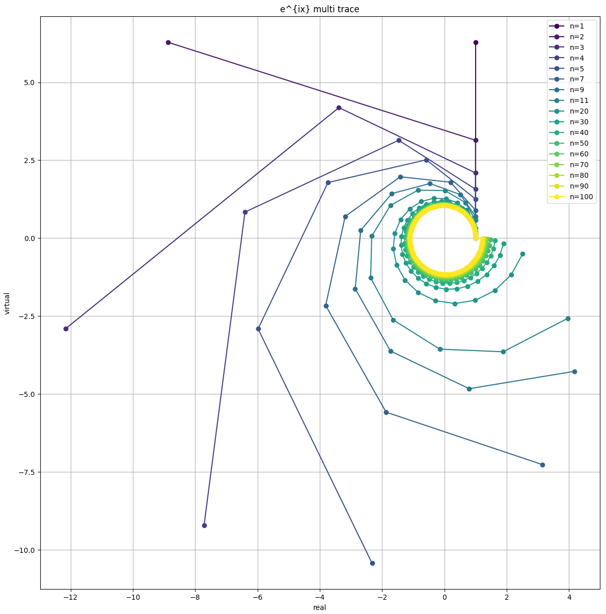

# 复变函数

# 虚数指数幂

## 为什么虚数指数幂是旋转而不是指数级增长

为什么复指数$e^{x+iy}$里的虚数部分$e^{iy}$是旋转，而不是像实数部分$e^{x}$那样是指数级增长呢？

下面我们就来分析一下，虚数部分按照指数定义展开为：
$$
e^{ix}=\lim_{n\rightarrow \infin}\left( 1+i\frac{x}{n} \right)^n
$$
指数函数不是线性叠加，而是连续乘法，也就是说：

* 每一小步变化 $(1 + i x/n)$ 不是单纯的加法
* 而是**乘以一个复数**，乘法在复平面上是**伸缩+旋转**的操作

看到这里我们会觉得，是啊，复数乘以复数，即
$$
r_1e^{i\theta_1}\cdot r_2e^{i\theta_2}=(r_1r_2)e^{i(\theta_1+\theta_2)}
$$
明明是既有拉伸，也有旋转的啊，

那为什么
$$
e^{ix}=\lim_{n\rightarrow \infin}\left( 1+i\frac{x}{n} \right)^n
$$
就只有旋转而没有拉伸呢？

那就让我们来分析一下：

令$\delta=\frac{x}{n}$，显然当$n\rightarrow\infin$时，$\delta$远远小于1，那么
$$
1+i\delta\quad (\delta \ll 1)
$$
该复数的模长为$\sqrt{1+\delta^2}\approx 1$，几乎没有增长。该复数的角度为$\text{arctan}(\frac{\delta}{1})\approx \delta$，属于是微小旋转

那么$e^{ix}$ 相当于做了$n$次复数$1+i\delta$的连乘，所以，每一步的微小乘法，就相当于模长做$n$次连乘，角度做$n$次累加，即沿着单位圆旋转。即：
$$
\begin{aligned}
e^{ix} &= \lim_{n\to\infty} \left( 1 + i \frac{x}{n} \right)^n \\
&= \lim_{n\to\infty} \left( 1 + i \delta \right)^n, \quad \delta = \frac{x}{n} \\
&= \lim_{n\to\infty} \left( \sqrt{1+\delta^2} \, e^{i \arctan(\delta)} \right)^n \\
&= \lim_{n\to\infty} \left( \sqrt{1+\delta^2} \right)^n \, \left( e^{i \arctan(\delta)} \right)^n \\
&= \lim_{n\to\infty} \underbrace{\left( 1 + \frac{\delta^2}{2} + O(\delta^4) \right)^n}_{\text{模长}} \; \cdot \; \underbrace{e^{i n \arctan(\delta)}}_{\text{角度}} \\
&= \lim_{n\to\infty} \left( 1 + \frac{x^2}{2 n^2} + O(n^{-4}) \right)^n \cdot e^{i n \frac{x}{n}} \\
&= \lim_{n\to\infty} \left( 1 + \frac{x^2}{2 n^2} + O(n^{-4}) \right)^n \cdot e^{i n \frac{x}{n}} \\
&= \underbrace{1}_{\text{模长}} \cdot \underbrace{e^{i x}}_{\text{旋转}} \\
&= e^{ix}
\end{aligned}
$$
可见，虽然复数$1+i\delta$ 的模长是略大于1的，经过无穷次乘法，模长竟然是等于1的，然后复数$1+i\delta$的虚部，角度虽然是很小，但是经过无穷次累加，就变成了

注意，上式中的模长求极限部分：
$$
(1 + \delta^2)^n \approx (1 + \frac{\delta^2}{2})^n = \left(1 + \frac{x^2}{2} \right)^n = (1 + \frac{x^2}{n^2})^n
$$
n 步累积指数级增长公式：
$$
\left(1 + \frac{C}{n^2}\right)^n = \left[ \left(1 + \frac{C}{n^2}\right)^{n^2} \right]^{1/n} \to 1 \quad \text{当 } n \to \infty
$$
因为$(1 + C/n^2)^{n^2} \to e^C$，再开 $1/n$ 次方 → $e^{C/n} \to 1$

可以感受一下这个求极限的过程，随着n的增大，逐渐幅值逼近于1。这里旋转角度是360度。



代码是

```python
import numpy as np
import matplotlib.pyplot as plt
from matplotlib import rcParams

x = np.pi * 2  # 最终旋转角度

# 自定义步数列表
n_list = [1,2,3,4,5,7,9,11] + list(range(20, 101, 10))  # 前半段密集，后半段每10步

colors = plt.cm.viridis(np.linspace(0,1,len(n_list)))  # 生成颜色表

plt.figure(figsize=(6,6))

for idx, n in enumerate(n_list):
    delta = x / n
    z = 1 + 0j
    zs = [z]
    for _ in range(n):
        z *= 1 + 1j*delta
        zs.append(z)
    zs = np.array(zs)

    plt.plot(np.real(zs), np.imag(zs), '-o', color=colors[idx], label=f'n={n}')

plt.gca().set_aspect('equal')  # 保持单位圆比例
plt.xlabel
```

## 为什么实数指数幂会增长而虚数指数幂模长不增长


## 虚数指数幂不增长的本质


# 参考资料

## 大模型

https://chatgpt.com/c/698f3d25-cfb4-8320-8581-fa83d797053b

https://chatgpt.com/c/698f3d25-cfb4-8320-8581-fa83d797053b

https://chatgpt.com/c/698f3d25-cfb4-8320-8581-fa83d797053b