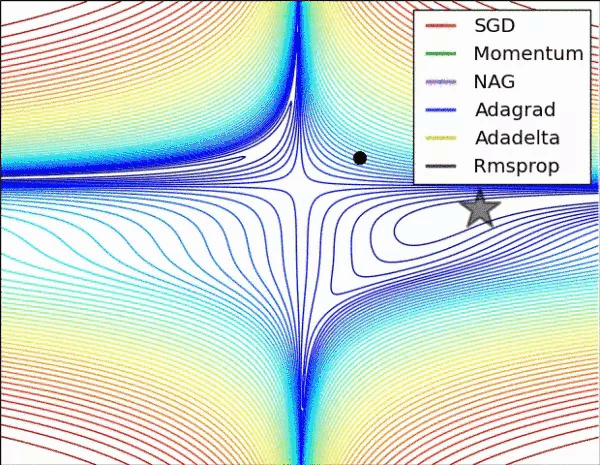

# 梯度下降算法的演化

* [返回上层目录](../offline-learning.md)
* [各类梯度下降算法的演化](#各类梯度下降算法的演化)

# 各类梯度下降算法的演化

# 参考资料

* [Deep Learning 之 最优化方法](https://blog.csdn.net/BVL10101111/article/details/72614711)

* [从 SGD 到 Adam —— 深度学习优化算法概览(一)](https://zhuanlan.zhihu.com/p/32626442)

* [深度学习最全优化方法总结比较（SGD，Adagrad，Adadelta，Adam，Adamax，Nadam）](https://zhuanlan.zhihu.com/p/22252270)

* [10个梯度下降优化算法+备忘单](https://ai.yanxishe.com/page/TextTranslation/1603?from=singlemessage)

  [深度学习——优化器算法Optimizer详解（BGD、SGD、MBGD、Momentum、NAG、Adagrad、Adadelta、RMSprop、Adam）](https://www.cnblogs.com/guoyaohua/p/8542554.html)

