# SVD奇异值分解

* [返回上层目录](../linear-algebra.md)
* [SVD的思想](#SVD的思想)
* [SVD的直观理解](#SVD的直观理解)
* [SVD的几何含义](#SVD的几何含义)
* [SVD的推导](#SVD的推导)
* [应用实例](#应用实例)
* [奇异值与主成分分析](#奇异值与主成分分析)
* [总结](#总结)

# SVD的思想

[福利：女神lena的高清裸照](http://www.lenna.org/full/len_full.html)

工程里，用一些比较简单的东西去表达一个复杂的东西，是很有用的。对应到数学，比如一个复杂的函数，我们可以用泰勒级数去模拟他，这样泰勒级数前几项，就可以近似当做这个函数的值。更自然的是三角函数的级数去模拟一个函数， 工具是傅里叶分析。**在矩阵来说，我们想用一个简单的矩阵，或者说几个数字，去代表一个复杂的矩阵。奇异值就是很好的一个选择**。

其实一句话就可以对奇异值分解所做的工作进行概括，相信你应该学过在平面内用一条直线拟合点的方法，也就是所谓的最小二乘法，那么奇异值分解所做的工作就是**将这种方法扩展到高维空间，即寻找一个平面去拟合空间内的点，或者是寻找更高维度的线性子空间去拟合高维点集**，唯一与最小二乘法不同的是:最小二乘不要求找到的直线过原点，而奇异值分解要求找到的平面或者更高维线性空间必须过原点（即线性子平面），然而这一差别完全可以先对数据进行中心化而完全消除，X=U×D×V',在这个分解式子中，X是p×N矩阵，代表N个p维点,U是p×r，D是r×r，V是N×r，U的前k列(k<=r)张成的空间就是最佳线性子空间。这就是svd的几何含义。

简单地说，奇异值的意义在于一个m*n的矩阵会把n维空间的单位球映射到m维空间的一个椭球(可能是退化的)，而这些奇异值就对应这个椭球的各个半轴长。而奇异向量就恰好是椭球的半轴的方向，以及它们的原像。

# SVD的直观理解

矩阵的奇异值是一个数学意义上的概念，一般是由奇异值分解（Singular Value Decomposition，简称SVD分解）得到。如果要问奇异值表示什么物理意义，那么就必须考虑在不同的实际工程应用中奇异值所对应的含义。

首先先给出奇异值的物理意义：**奇异值往往对应着矩阵中隐含的重要信息，且重要性和奇异值大小正相关。每个矩阵$A$都可以表示为一系列秩为1的“小矩阵”之和，而奇异值则衡量了这些“小矩阵”对于$A$的权重。**

然后下面先尽量避开严格的数学符号推导，直观的从一张图片出发，让我们来看看奇异值代表什么意义。

这是女神上野树里（Ueno Juri）的一张照片，像素为高度450×宽度333。暂停舔屏先（痴汉脸

我们都知道，图片实际上对应着一个矩阵，矩阵的大小就是像素大小，比如这张图对应的矩阵阶数就是450×333，矩阵上每个元素的数值对应着像素值。我们记这个像素矩阵为A。

现在我们对矩阵A进行奇异值分解。直观上，奇异值分解将矩阵分解成若干个秩一矩阵之和，用公式表示就是：
$$
A = \sigma_{1}u_{1}v_{1}^{T} + \sigma_{2}u_{2}v_{2}^{T} + ... + \sigma_{r}u_{r}v_{r}^{T}\ \ \ \ \ \ \ \ \ \ \ (1)
$$
其中(1)式右边每一项前的系数$\sigma$就是奇异值，u和v分别表示列向量，秩一矩阵的意思是矩阵秩为1。注意到每一项$uv^{T}$都是秩为1的矩阵。我们假定奇异值满足
$$
\sigma_1\geq\sigma_2\geq...\geq\sigma_r>0
$$
（奇异值大于0是个重要的性质，但这里先别在意），如果不满足的话重新排列顺序即可，这无非是编号顺序的问题。

既然奇异值有从大到小排列的顺序，我们自然要问，如果只保留大的奇异值，舍去较小的奇异值，这样(1)式里的等式自然不再成立，那会得到怎样的矩阵——也就是图像？

令
$$
A = \sigma_{1}u_{1}v_{1}^{T}
$$
，这只保留上式中等式右边第一项，然后作图：

结果就是完全看不清是啥……我们试着多增加几项进来：
$$
A_5=\sigma_1 u_1 v_1^{T}+\sigma_2 u_2 v_2^{T}+\sigma_3 u_3 v_3^{T}+\sigma_4 u_4 v_4^{T}+\sigma_5 u_5 v_5^T
$$
，再作图

隐约可以辨别这是短发伽椰子的脸……但还是很模糊，毕竟我们只取了5个奇异值而已。下面我们取20个奇异值试试，也就是(1)式等式右边取前20项构成A20

虽然还有些马赛克般的模糊，但我们总算能辨别出这是Juri酱的脸。当我们取到(1)式等式右边前50项时：

我们得到和原图差别不大的图像。也就是说当k从1不断增大时，Ak不断的逼近A。让我们回到公式
$$
\begin{aligned}
A = \sigma{1}u{1}v{1}^{T} + \sigma{2}u{2}v{2}^{T} + ... + \sigma{r}u{r}v_{r}^{T}\ \ \ \ \ \ \ \ \ \ \ (1)
\end{aligned}
$$
矩阵A表示一个450×333的矩阵，需要保存450×333=149850个元素的值。等式右边u和v分别是450×1和333×1的向量，每一项有1+450+333=784个元素。如果我们要存储很多高清的图片，而又受限于存储空间的限制，在尽可能保证图像可被识别的精度的前提下，我们可以保留奇异值较大的若干项，舍去奇异值较小的项即可。例如在上面的例子中，如果我们只保留奇异值分解的前50项，则需要存储的元素为784×50=39200，和存储原始矩阵A相比，存储量仅为后者的26%。

奇异值的物理意义是：**奇异值往往对应着矩阵中隐含的重要信息，且重要性和奇异值大小正相关。每个矩阵$A$都可以表示为一系列秩为1的“小矩阵”之和，而奇异值则衡量了这些“小矩阵”对于$A$的权重。**

在图像处理领域，奇异值不仅可以应用在数据压缩上，还可以对图像去噪。如果一副图像包含噪声，我们有理由相信那些较小的奇异值就是由于噪声引起的。当我们强行令这些较小的奇异值为0时，就可以去除图片中的噪声。如下是一张25×15的图像。

但往往我们只能得到如下带有噪声的图像（和无噪声图像相比，下图的部分白格子中带有灰色）：

通过奇异值分解，我们发现矩阵的奇异值从大到小分别为：14.15，4.67，3.00，0.21，……，0.05。除了前3个奇异值较大以外，其余奇异值相比之下都很小。强行令这些小奇异值为0，然后只用前3个奇异值构造新的矩阵，得到

可以明显看出噪声减少了（白格子上灰白相间的图案减少了）。

奇异值分解还广泛的用于主成分分析（Principle Component Analysis，简称PCA）和推荐系统（如Netflex的电影推荐系统）等。在这些应用领域，奇异值也有相应的意义。

# SVD的几何含义

先直接说含义再解释：

**奇异值分解的几何含义为：对于任何的一个矩阵，我们要找到一组两两正交单位向量序列，使得矩阵作用在此向量序列上后得到新的向量序列保持两两正交。**

下面我们要说明的是，**奇异值的几何含义为：这组变换后的新的向量序列的长度。**

也就是说，奇异值和特征值不同的地方在于：

* **特征值：变换前后的两两正交的单位向量是不变的，即没有旋转，只有拉伸，**
* **奇异值变换：变换前后的两两正交的单位向量是不同轴的，即既有旋转，又有拉伸。**

下面简单介绍一下奇异值的几何含义，主要参考文献是美国数学协会网站上的文章[2]。

下面的讨论需要一点点线性代数的知识。线性代数中最让人印象深刻的一点是，要将**矩阵**和空间中的**线性变换**视为同样的事物。比如**对角矩阵M**作用在任何一个向量上。
$$
\begin{bmatrix}
 3&0\\ 
 0&1
\end{bmatrix}
\begin{bmatrix}
 x\\ 
 y
\end{bmatrix}=
\begin{bmatrix}
 3x\\ 
 y
\end{bmatrix}
$$
其几何意义为在水平x方向上拉伸3倍，方向保持不变的线性变换。换言之**对角矩阵起到作用是将水平垂直网格作水平拉伸（或者反射后水平拉伸）的线性变换。**

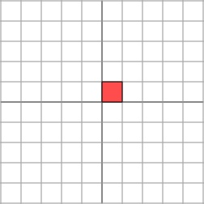$M \rightarrow$

如果$M$不是对角矩阵，而是一个**对称矩阵**
$$
M = \begin{bmatrix}2 & 1\\1 & 2\end{bmatrix}
$$
对于对称矩阵，**我们也总可以找到一组网格线，使得矩阵作用在该网格上仅仅表现为（反射）拉伸变换，而没有旋转变换。**

$M  \rightarrow$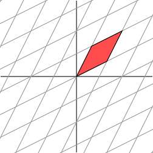

上图并不能清晰地描述对称矩阵的变换效果，于是我们将网格线旋转45°，看看会发生什么。

$M \rightarrow$

啊哈，我们看到，对称矩阵对这个新网格的变换方式和对角矩阵对直角网格的变换方式是一样的：网格沿着一个方向被拉升了3倍。

如果我们有一个2×2对称矩阵，通过旋转网格，我们可以让矩阵的作用仅仅是在两个方向上的拉伸，也就是说，对称矩阵的作用有些类似于对角矩阵。

说得更数学一点，对于对称矩阵$M$，存在正交向量$v_i$，使得$M v_i$相当于一个标量乘以$v_i$，即
$$
M v_{i} = \lambda_{i} v_{i}
$$
其中，$\lambda_i$为标量。从几何上来说，这意味着$v_{i}$被$M$乘的结果仅仅相当于被简单的拉伸了$\lambda_i$倍。标量$\lambda_i$称为特征值。一个重要的事实是，对称矩阵不同特征值的特征向量是相互正交的。

如果我们将网格线和对称矩阵的特征向量对齐，则矩阵对网格的拉伸和对特征向量的拉伸是一样的。

目前我们给出的线性变换的几何描述都是简单的：网格仅仅沿着一个方向被拉伸，对于更一般的矩阵，我们将探求是否能发现一个正交的网格，能够被矩阵变换为另一个正交的网格。

最后一个例子，更一般的**非对称矩阵**
$$
M=\begin{bmatrix}1 & 1 \\0 & 1\end{bmatrix}
$$
这个矩阵对网格的变换效果相当于剪切应变。

$M \rightarrow$

很容易找到一族沿着水平轴的特征向量。然而，上面的图像显示这些特征值不能创造一个正交网格，能够被变换为另一个正交网格。尽管如此，我们还是来看下如果先把网格旋转30°会发生什么。

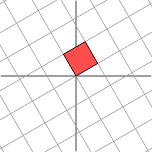$M \rightarrow$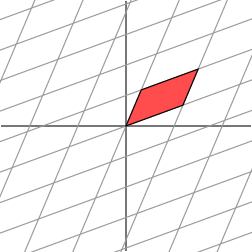

注意，红色平行四边形的原点处的夹角似乎比之前的大了一些，那我们就有理由猜测，是不是继续旋转，夹角会越来越大，直到垂直呢？让我们继续把网格旋转到60°试试。

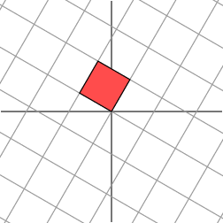$M \rightarrow$

嗯~似乎现在转换后的网格已经几乎垂直了。但实际上，当旋转角度精确为58.28°时，网格会正交。

$M \rightarrow$

很遗憾，此时我们再也找不到一组网格，使得矩阵作用在该网格上之后只有拉伸变换（找不到背后的数学原因是对一般非对称矩阵无法保证在实数域上可对角化，不明白也不要在意）。我们退求其次，找一组网格，使得矩阵作用在该网格上之后允许有**拉伸变换**和**旋转变换**，但要保证变换后的网格依旧互相垂直。这是可以做到的。

下面我们就可以自然过渡到奇异值分解的引入。**奇异值分解的几何含义为：对于任何的一个矩阵，我们要找到一组两两正交单位向量序列，使得矩阵作用在此向量序列上后得到新的向量序列保持两两正交。**下面我们要说明的是，**奇异值的几何含义为：这组变换后的新的向量序列的长度。**

# SVD的推导

奇异值分解的几何本质为：我们总能发现一个正交的网格，能够被变换为另一个正交的网格。

接下来我们使用向量来解释：已知经过恰当选择的正交单位向量$v_1$和$v_2$，向量$M v_1$和$M v_2$是正交的。(注意：并不是同轴的，这一点和特征值是不一样的)

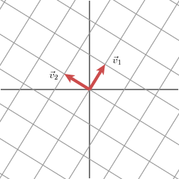$M \rightarrow$

将向量$M v_1$和$M v_2$同轴的单位向量记为$u_1$和$u_2$，将向量$M v_1$和$M v_2$的长度记为$\sigma_1$和$\sigma_2$，用来描述网格在这些特定的方向上被拉伸的倍数。这些值就被称为矩阵$M$的奇异值。

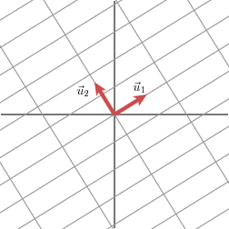

因此我们有
$$
\begin{aligned}
M v_1 = \sigma_1 u_1\\
M v_2 = \sigma_2 u_2
\end{aligned}
$$
我们现在简单描述下矩阵M如何对一般的向量$x$做处理。由于向量$v_1$和$v_2$是正交单位向量，所以有
$$
x = (v_{1} \cdot x)v_1 + (v_{2} \cdot x)v_2
$$
这意味着
$$
\begin{aligned}
Mx &=  (v_1 \cdot x)Mv_1 +  (v_2 \cdot x)Mv_2\\
&= (v_1 \cdot x)\sigma_1 u_1 + (v_2 \cdot x) \sigma_2 u_2
\end{aligned}
$$
我们知道，向量$v$和$x$的点乘可以用向量$v$转置乘以向量$x$表示，即
$$
v \cdot x = v^{T}x
$$
则
$$
\begin{aligned}
Mx = u_1 \sigma_1 v_1^{T} x + u_2 \sigma_2 v_2^{T} x\\
M = u_1 \sigma_1 v_1^{T} + u_2 \sigma_2 v_2^{T}
\end{aligned}
$$
通常将其表示为
$$
M = U \Sigma V^{T}
$$
其中，矩阵$U$的列向量分别为$u_1$和$u_2$，$\Sigma$是对角矩阵，其对角元为$\sigma_1$和$\sigma_2$，并且矩阵$V$的列向量分别为$v_1$和$v_2$，T表示转置。

上式表明了如何将矩阵分解为三个矩阵相乘：V描述了一组正交基，U描述了值域中的一组正交基，$\Sigma$描述了V中的向量在U中被拉伸了多少。

## 如何求奇异值

奇异值分解的威力在于我们能对任何矩阵进行奇异值分解。如何做呢？来看一个例子，一个单位圆，经过奇异值变换后，其图像将是一个椭圆，其长轴和短轴确定了正交的网格。

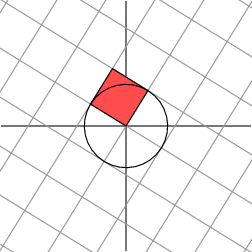$M \rightarrow$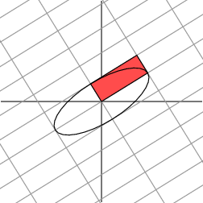

注意，主轴和短轴被定义为$M v_1$和$M v_2$。这些向量因此是所有单位圆向量中最长和最短的向量。

$M \rightarrow$

换句话说，单位圆上的函数$|Mx|$在$v_1$处有最大值，在$v_2$处取最小值。这将求解在单位圆上函数的最优值问题降为了标准的微积分问题。结果证明，函数的关键点位于矩阵$M^{T}M$的特征值处。由于矩阵是对称的，不同特征值对应的特征向量是正交的。从而得出了向量$v_{i}$族。

* **如何求取奇异值$\sigma_i$和对应的$v_i$**

由上面容易知道，**奇异值$\sigma_i = |M v_i|$**，$v_i$为正交单位向量，则有
$$
\begin{aligned}
\sigma_i^2 = |M v_i|^2 = (M v_i)^T (M v_i)\\
= v_i^T M^T M v_i
= v_i^{-1} M^T M v_i\\
\sigma_i^2  v_i = M^T M v_i
\end{aligned}
$$
由上式很清晰的看出，**$\sigma_i^2$是对称矩阵$M^TM$的特征值**（为什么$M^TM$的特征值是正的呢？若M为m×n实矩阵,，则$M^{T}M$为正定矩阵的充分必要条件是r(M)=n；若矩阵对称且镇定，则其特征值全为正），并且$\sigma_i$是正的。**$v_i$是特征值$\sigma_i^2$的特征向量**，并且由对称矩阵的特征向量相互正交也与我们的假设$v_i$相互正交一致。

现在我们已知奇异值$\sigma_i = |M v_i|$，且向量$u_i$为$Mv_i$方向上的单位向量。但是为什么向量$u_i$也相互正交呢？

为了解释这个，假设$\sigma_i$和$\sigma_j$是不同的奇异值。我们有
$$
\begin{aligned}
M v_i = \sigma_i u_i\\
M v_j = \sigma_j u_j\\
\end{aligned}
$$
我们来看看$(M v_i)\cdot(M v_j)$，为方便起见，假设奇异值为非零。

一方面，由于向量$v_i$为对称矩阵$M^T M$的特征值，所以$v_i$和$v_j$相互正交，所以$(M v_i)\cdot(M v_j)$为0，即
$$
(M v_i)\cdot(M v_j) = (M v_i)^T(M v_j) = v_i^T M^T M v_j = \lambda_j v_i^T v_j = 0
$$
而另一方面，我们有
$$
(M v_i)\cdot(M v_j) = \sigma_i \sigma_j u_i \cdot u_j = 0
$$
因此，$u_i$和$u_j$是正交的，所以我们找到了一组正交基$v_i$，能够被变换到另一组正交基$u_i$中去。奇异值$\sigma_i$描述了不同方向上拉伸的长度。

在实践中，并非像上文所述这样来找到一个矩阵的奇异值分解，因为它不是特别的有效率或者对其数值求解性能并不很好。

## SVD更严格的数学推导

https://zhuanlan.zhihu.com/p/26306568

# SVD和矩阵特征分解的关系

花书的第二十八页：事实上，我们可以用与A相关的特征分解去解释A的奇异值分解。A的**左奇异向量**是$AA^T$的特征向量。A的**右奇异向量**是$A^TA$的特征向量。A的非零奇异值是$A^TA$特征值的平方根，同时也是$AA^T$特征值的平方根。

# 应用实例

## 实例一

现在我们看一个奇异矩阵
$$
M=\begin{bmatrix}1 & 1 \\2 & 2\end{bmatrix}
$$
该矩阵的几何效果如下图所示：

$M \rightarrow$

在这个例子中，第二个奇异值为0，所以我们可以写为：
$$
M = u_1 \sigma_1 v_1^T
$$
换句话说，如果奇异值中的某些为0，则对应项在对矩阵$M$的分解中不会出现。按这个思路，我们看看矩阵$M$的秩（为线性变换的图像的维度），等于非零奇异值的数目。

## 实例二

数据压缩

奇异值分解可用于有效的表达数据。假设我们希望传送下面的图片，这个图片由$15\times25$的黑白像素矩阵组成。

在这幅图中，存在着三种类型的列，如下图所示，这三中列应该能够以更复杂的形式来表示这些图像数据。

                    

我们把这个图像用15×25矩阵表示，0代表黑色像素，1代表白色像素。这样的话，矩阵一共有375个元素。

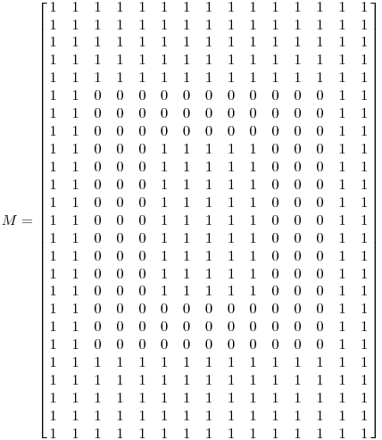

如果我们对矩阵M进行奇异值分解，会发现只有三个非零奇异值。
$$
\begin{aligned}
\sigma_1 = 14.72\\
\sigma_2 = 5.22\\
\sigma_3 = 3.31
\end{aligned}
$$
因此，矩阵可以表示为
$$
M = u_1 \sigma_1 v_1^T +  u_2 \sigma_2 v_2^T +  u_3 \sigma_3 v_3^T
$$
其中，$v_i$有三个，每一个有15个元素，$u_i$有三个，每一个有25个元素，奇异值有三个。我们仅用了3×(1+15+25)=123个数就能表示375个像素的图片了。这说明，奇异值分解能够发现矩阵中的冗余元素，并且能够消除它。

为什么只有三个非零奇异值？因为非零奇异值的数目等于矩阵的秩，在本例中，矩阵中有三个线性无关的列，即秩为3。

## 实例三

降噪

上一个例子说明了我们如何处理许多奇异值为零的情况。通常大的奇异值指向感兴趣的信息。举个例子，当我们把一幅图用扫描仪扫进电脑中时，会在图像中引入一些瑕疵点（通常称为噪声）。

我们用和上例相同的方式来处理：将数据用15×25的矩阵来表示，并进行奇异值分解。奇异值如下所示：
$$
\begin{aligned}
&\sigma_1 = 14.15\\
&\sigma_2 = 4.67\\
&\sigma_3 = 3.00\\
&\sigma_4 = 0.21\\
&\sigma_5 = 0.19\\
&...\\
&\sigma_{15} = 0.05\\
\end{aligned}
$$
很明显，前三个奇异值是最重要的，所以我们假设其他的都是图像中的噪声引起的，所以只保留前三项做近似
$$
M \approx u_1\sigma_1v_1^T + u_2\sigma_2v_2^T + u_2\sigma_2v_2^T
$$
这样就可以改善图像质量。

## 实例四

数据分析

噪声在手机数据的时候也会毫无例外的出现：不论设备有多好，测量值总是有一些误差在里面。如果我们还记得在矩阵中，大的奇异值指向重要的特征，则当数据收集完后，很自然的就会想到用奇异值分解来研究数据。

作为一个例子，假设我们收集到了如下数据。

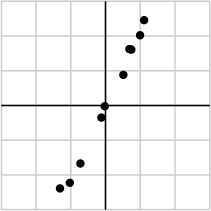

我们把这些数据放到矩阵中：
$$
M=
\begin{bmatrix}
-1.03 & 0.74 & -0.02 & 0.51 & -1.31 & 0.99 & 0.69 & -0.12 & -0.72 & 1.11\\
-2.23 & 1.61 & -0.02 & 0.88 & -2.39 & 2.02 & 1.62 & -0.35 & -1.67 & 2.46
\end{bmatrix}
$$

并进行奇异值分解，得到奇异值为
$$
\begin{aligned}
\sigma_1 = 6.04\\
\sigma_2 = 0.22
\end{aligned}
$$
由于第一个奇异值远远要比第二个奇异值大，我们有理由认为，较小的$\sigma_2$是数据中的噪声引起的，所以理想情况下$\sigma_2$等于零。在这种情况下，矩阵的秩为1($y_i = kx_i$)意味着所有的数据都是都在一条由$u_i$定义的线上。

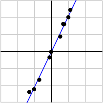

这个简单的例子其实是给 PCA (**主成分分析**：principal component analysis)开了个小头，PCA使用奇异值分解来检测数据的相关性和冗余程度。

类似的，奇异值分解还可用于检测数据中的群组类别，这就解释了为什么奇异值分解能改善Netflix的电影推荐系统。你观看过的电影的评分可让程序把你排进一个群组，这个群组中的其他人观看过的电影评分和你类似。这样就可以选择一个你所在的群组中的其他人看过的电影评分较高的电影推荐给你。

# 奇异值与主成分分析

http://www.cnblogs.com/LeftNotEasy/archive/2011/01/19/svd-and-applications.html

https://zhuanlan.zhihu.com/p/27214578

# 总结

本文开头就提过，奇异值分解应当是本科数学专业线性代数课程的核心部分。除了做了一个相当简单的几何解释，奇异值分解提供了极其有效的技术，将线性代数的思想用于实际当中。然而，在线性代数课程中，奇异值分解往往会被忽略。

# 参考文献

* [奇异值的物理意义是什么？-知乎](https://www.zhihu.com/question/22237507)

这个是我最开始的阅读资料

* [We Recommend a Singular Value Decomposition（[Feature Column from the AMS](http://www.ams.org/publicoutreach/feature-column/fcarc-svd)）

这个是本文的主要参考来源

* [A Singularly Valuable Decomposition: The SVD of a Matrix](http://www-users.math.umn.edu/~lerman/math5467/svd.pdf)

这个是文献[2]中列出的参考文献之一，有较详细的数学推导和说明，如果以后要深入学SVD可再看
