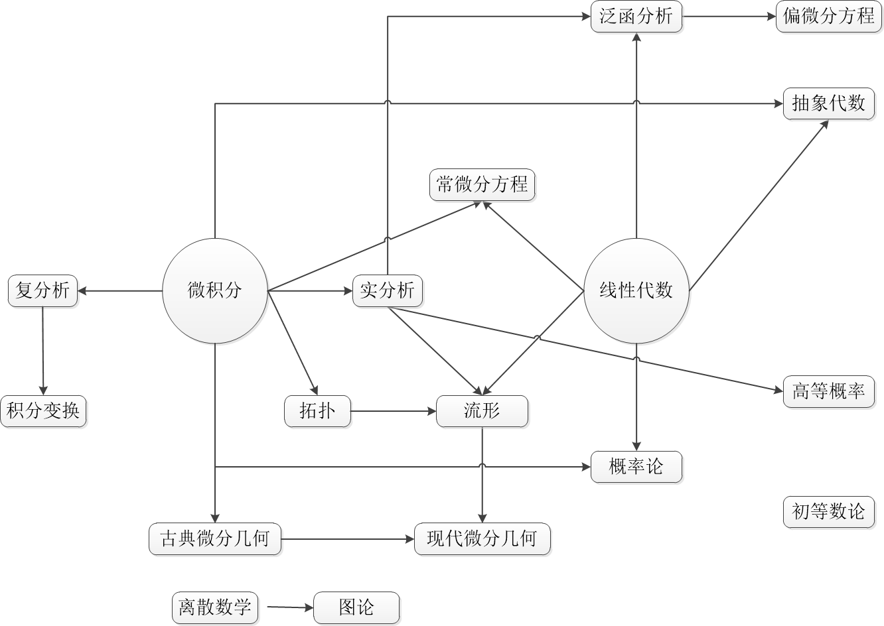

# 数学系课程地图

* [返回上层目录](../mathematics.md)

# 数学系课程分类

可以把数学系本科的干货课程笼统的分为三类：分析、代数和几何。

* **分析**：数学分析（微积分），实分析（实变函数），泛函分析，复分析
* **代数**：高等代数（线性代数），抽象代数（群论，伽罗瓦理论）
* **几何**：解析几何，拓扑，微分几何（流形）
* **其他**：概率论，随机过程，图论，常微分方程（ODE），偏微分方程（PDE），初等数论等等

如果你觉得没有时间把这么多数学课一个一个刷下来的话，那么最后再推荐一本书来速成，[程代展，赵寅. 系统与控制中的近代数学基础[M]. 清华大学出版社, 2007](https://item.jd.com/11462967.html)。这本书基本上把常用到的数学工具每个一章简单介绍了下，作为提纲来看还是不错的。

其他：群论，数学物理方法

# 数学技能树

复分析和实分析基本上是平行的，不学实分析也能学复分析；

高等概率论是建立在测度（实变函数）的基础上的，因此会把初等概率论的内容严谨化；

概率论中的多元随机变量分布，经常涉及矩阵求逆、矩阵乘法、还有雅克比矩阵等操作，需要线性代数。

学pde之前最好能先学泛函，因为在学Sobolev空间，广义函数的时候需要用到泛函中的理论；

微分几何本科课程一般分为古典微分几何和现代微分几何，古典微分几何和拓扑学没关系，只要学过数分就行，现代微分几何基于流形，学流形之前一定要先学点集拓扑（拓扑学的分支）。

# 分析

## 常微分方程

台湾交通大学数学系李荣耀老师的微分方程。微分方程课程需要大量的画图来帮助理解，这位老师全程手写板书，足见其深厚的功底。微分方程其实大量存在于现实物理系统中，我们常见的机器人运动控制，优化算法搜索过程，大脑神经元的机理，无人驾驶汽车速度和位置，生态系统中物种数量的变化，疾病传播与扩散的描述（现在很多预测新冠肺炎的患病人数的模型都是基于微分方程）等等都可以被建模微分方程。对于控制理论的同学来说，主要的研究对象说白了就是微分方程，自然学习好这门课程对于控制系的童鞋来说绝对会受益匪浅。

[微分方程 台湾交通大学 李荣耀](https://ocw.nctu.edu.tw/course_detail-v.php?bgid=1&gid=1&nid=500)

参考书目：Differential Equations by P. Blanchard, R. L. Devaney, G. R. Hall, 4th edition Publisher: Cengage Learning

# 参考资料

* [非数学系的学生如何克服「数学焦虑」？](https://www.zhihu.com/question/521886088/answer/2390678371)

* [工科生除了学习课内的《高等数学》，还可以做什么提高自己的数学水平？](https://www.zhihu.com/question/264705362/answer/1326140204)

这个知乎回答必须要看。

