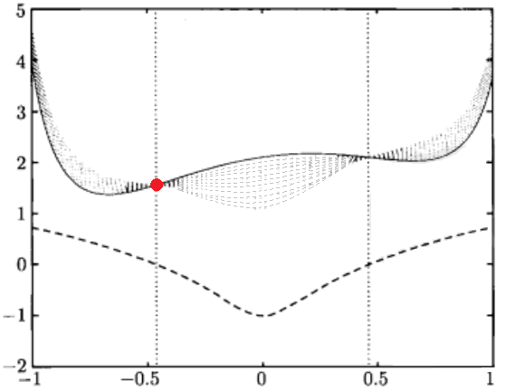
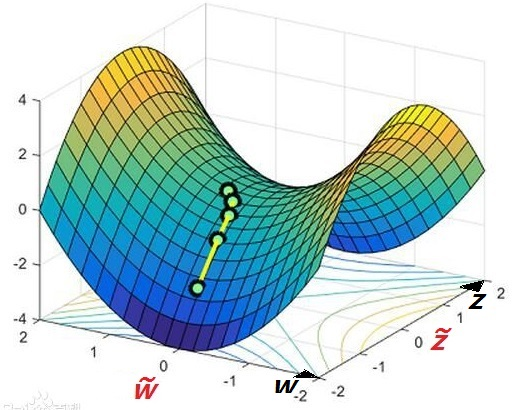
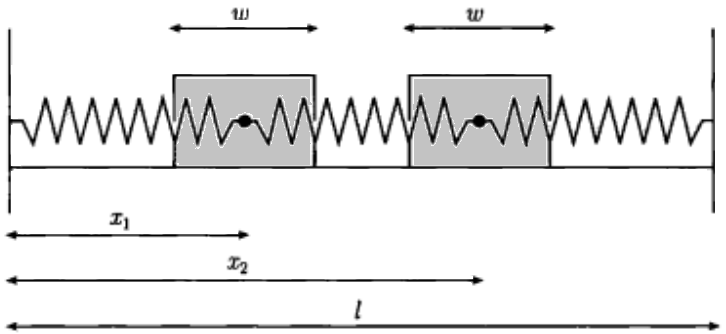
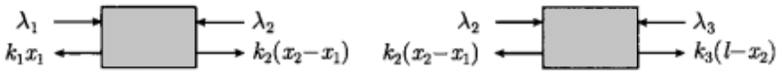

# 凸优化问题

* [返回上层目录](../convex-optimization.md)
* [凸优化问题](#凸优化问题)
  * [优化问题](#优化问题)
  * [凸优化问题定义](#凸优化问题定义)
* [对偶](#对偶)
  * [拉格朗日函数](#拉格朗日函数)
  * [拉格朗日对偶函数](#拉格朗日对偶函数)
    * [最优值的下界](#最优值的下界)
    * [通过线性逼近来理解下界性质](#通过线性逼近来理解下界性质)
    * [拉格朗日对偶函数和共轭函数](#拉格朗日对偶函数和共轭函数)
  * [拉格朗日对偶问题](#拉格朗日对偶问题)
    * [弱对偶性](#弱对偶性)
    * [强对偶性和Slater约束准则](#强对偶性和Slater约束准则)
  * [拉格朗日对偶的解释](#拉格朗日对偶的解释)
    * [强弱对偶性的极大极小描述](#强弱对偶性的极大极小描述)
    * [鞍点解释](#鞍点解释)
    * [对策解释](#对策解释)
  * [最优性条件](#最优性条件)
    * [互补松弛性](#互补松弛性)
    * [KKT最优性条件](#KKT最优性条件)
    * [KKT条件的力学解释](#KKT条件的力学解释)
    * [通过解对偶问题求解原问题](#通过解对偶问题求解原问题)

# 凸优化问题

## 优化问题

我们用
$$
\begin{aligned}
&\text{minimize}\quad &f_0(x)\quad&\\
&\text{subject to}\quad &f_i(x)\leqslant0,\quad &i=1,...,m\\
&&h_i(x)=0,\quad&i=1,...,p
\end{aligned}
$$
描述在所有满足
$$
\begin{aligned}
 &f_i(x)\leqslant0,\quad i=1,...,m\\
&h_i(x)=0,\quad i=1,...,p
\end{aligned}
$$
的x中寻找极小化$f_0(x)$的x的问题。

我们称

* x为**优化变量**
* 函数f0为**目标函数**或**费用函数**
* 不等式fi(x)≤0成为**不等式约束**，相应的函数fi称为**不等式约束函数**
* 方程组hi(x)=0称为**等式约束**，相应的函数hi称为**等式约束函数**
* 如果没有约束，我们称问题为**无约束**问题

对目标和所有约束函数有定义的点的集合
$$
\mathbb{D}=\bigcap_{i=0}^{m}\text{dom}\ f_i\ \cap\ \bigcap_{i=1}^{p}\text{dom}\ h_i
$$
称为上述优化问题的**定义域**。当点x∈D满足约束
$$
\begin{aligned}
 &f_i(x)\leqslant0,\quad i=1,...,m\\
&h_i(x)=0,\quad i=1,...,p
\end{aligned}
$$
时，x是**可行**的。当上述优化问题至少有一个可行点时，我们称为是**可行**的，否则称为**不可行**。所有可行点的集合称为**可行集**或**约束集**。

上述优化问题的最优值p\*定义为
$$
p^*=\text{inf}\left\{ f_0(x)|f_i(x)\leqslant0,\ i=1,...,m,\quad h_i(x)=0,\ i=1,...,p \right\}
$$
如果x\*是可行的，并且f0(x\*)=p\*，我们称x\*为**最优点**，或x\*解决了上述优化问题。所有解的集合称为**最优集**，记为
$$
X_{\text{opt}}=\left\{ x|f_i(x)\leqslant0,\ i=1,...,m,\quad h_i(x)=0,\ i=1,...,p,\ f_0(x)=p^* \right\}
$$
如果上述优化问题存在最优解，我们称最优值是**可得**或**可达**的，称问题**可解**。如果Xopt是空集，我们称最优值是不可得或者不可达的（这种情况常在问题无下界时发生）。

## 凸优化问题定义

**凸优化问题**是形如
$$
\begin{aligned}
&\text{minimize}\quad &f_0(x)\quad&\\
&\text{subject to}\quad &f_i(x)\leqslant0,\quad &i=1,...,m\\
&&h_i(x)=0,\quad&i=1,...,p
\end{aligned}
$$
的问题，其中f0,...,fm为凸函数。

对比上式的问题和上届的一般的优化问题，凸优化问题有三个附加的要求：

* 目标函数必须是**凸**的

* 不等式约束函数必须是**凸**的

* 等式约束函数$h_i(x)=a_i^Tx-b_i$必须是**仿射**的

我们立即注意到一个重要的性质：凸优化问题的可行集是凸的，因为它是问题定义域
$$
\mathbb{D}=\bigcap_{i=0}^{m}\text{dom}\ f_i
$$
（这是一个凸集）、m个（凸的）下水平集
$$
\{x|f_i(x)\leqslant0\}
$$
以及p个超平面
$$
\left\{ x|a_i^Tx=b_i \right\}
$$
的交集。因此，在一个凸优化问题中，我们是**在一个凸集上极小化一个凸的目标函数**。

# 对偶

## 拉格朗日函数

如上一章节所示，标准形式的优化问题如下：
$$
\begin{aligned}
&\text{minimize}\quad &f_0(x)\quad&\\
&\text{subject to}\quad &f_i(x)\leqslant0,\quad &i=1,...,m\\
&&h_i(x)=0,\quad&i=1,...,p
\end{aligned}
$$
其中，自变量x∈R^n，设问题的定义域为
$$
\mathbb{D}=\bigcap_{i=0}^{m}\text{dom}\ f_i\ \cap\ \bigcap_{i=1}^{p}\text{dom}\ h_i
$$
是非空集合，优化问题的最优值为p\*。注意到这里并没有假设上述问题是凸优化问题。

Lagrange对偶的基本思想是在目标函数中考虑上述问题的约束条件，即添加约束条件的加权和，得到增广的目标函数。

定义上述问题的**Lagrange函数**L为
$$
L(x,\lambda,\nu)=f_0(x)+\sum_{i=1}^m\lambda_if_i(x)+\sum_{i=1}^p\nu_ih_i(x)
$$
其中，$\lambda_i$称为第i个不等式约束fi(x)≤0对应的**Lagrange乘子**；类似地，$\nu_i$称为第i个等式约束hi(x)=0对应的Lagrange乘子。向量$\lambda$和$\nu$称为对偶函数的变量，或者称为上述问题的Lagrange乘子向量。

## 拉格朗日对偶函数

定义**Lagrange对偶函数** g为Lagrange函数关于x取得的最小值，即对任意的$\lambda$和$\nu$，有
$$
\begin{aligned}
g(\lambda,\nu)&=\mathop{\text{inf}}_{x\in \mathbb{D}}L(x,\lambda,\nu)\\
&=\mathop{\text{inf}}_{x\in \mathbb{D}}\left( f_0(x)+\sum_{i=1}^m\lambda_if_i(x)+\sum_{i=1}^p\nu_ih_i(x) \right)
\end{aligned}
$$
对上式的不严谨解释：保持$\lambda$和$\nu$不变，找到拉格朗日函数L的下确界（最小值），即为$g(\lambda,\nu)$函数的值。

### 最优值的下界

对偶函数构成了原问题最优值p\*的下界：即对任意$\lambda\geqslant 0$和$\nu$，下式都成立：
$$
g(\lambda,\nu)\leqslant p^*
$$
下面来很容易地验证这个重要性质。

假设$\tilde{x}$是原问题的一个可行点，即
$$
f_i(\tilde{x})\leqslant 0,\quad h_i(\tilde{x})=0
$$
。根据假设，$\lambda\geqslant 0$，我们有
$$
\sum_{i=1}^m\lambda_if_i(\tilde{x})+\sum_{i=1}^p\nu_ih_i(\tilde{x})\leqslant0
$$
这是因为左边的第一项非正，而第二项为零。根据上述不等式，有
$$
L(\tilde{x},\lambda,\nu)=f_0(\tilde{x})+\sum_{i=1}^m\lambda_if_i(\tilde{x})+\sum_{i=1}^p\nu_ih_i(\tilde{x})\leqslant f_0(\tilde{x})
$$
由于每一个可行点$\tilde{x}$都满足$g(\lambda,\nu)\leqslant f_0(\tilde{x})$，因此不等式$g(\lambda,\nu)\leqslant p^*$成立。针对x∈R和具有一个不等式约束的某简单问题，下图描述了上式所给出的下界。

上图为对偶可行点给出的下界。实线表示目标函数f0，虚线表示约束函数f1。可行集是区间[-0.46,0.46]，如图中两条垂直点线所示。最优点和最优值分别为x\*=-0.46，p\*=1.54（在图中用红色原点表示）。点线表示一系列Lagrange函数$L(x,\lambda)$，其中$\lambda=0.1,0.2,...,1.0$。每个Lagrange函数都有一个极小值，均小于等于原问题最优目标值p\*，这是因为在可行集上（假设$\lambda\geqslant 0$）有$L(x,\lambda)\leqslant f_0(x)$。

### 通过线性逼近来理解下界性质

可通过示性函数进行线性逼近来理解拉格朗日函数和其给出下界的性质。

首先将原问题重新描述为一个无约束问题
$$
\text{minimize}\quad f_0(x)+\sum_{i=1}^mI\_(f_i(x))+\sum_{i=1}^pI_0(h_i(x))
$$
其中，$I\_$是非正实数集的示性函数
$$
\begin{aligned}
I\_(u)=
\left\{\begin{matrix}
&0\quad &u\leqslant 0\\ 
&\infty\quad &u>0
\end{matrix}\right.
\end{aligned}
$$
类似地，$I_0$是集合\{0\}的示性函数。在上面的无约束表达式中，函数$I\_(u)$可以理解为我们对约束函数值u=fi(x)的一种恼怒或不满：如果fi(x)≤0，$I\_(u)$为零，如果fi(x)>0，$I\_(u)$为$\infty$。用砖块撞墙来理解比较直观：当砖块还没撞墙，接触力为0，当砖块撞进了墙里面，接触力为无穷大。类似地，$I_0(u)$表达了我们对等式约束值u=hi(x)的不满。我们可以认为函数$I\_()$是一个“砖墙式”或“无限强硬”的不满意方程；即随着函数fi(x)从非正数变为正数，我们的不满意从零升到无穷大。

假设在上面的表达式中，用线性函数$\lambda_{i}u$替代函数$I\_(u)$，其中$\lambda_i\geq0$，用函数$\mu_iu$替代$I_0(u)$。则目标函数变为拉格朗日函数$L(x,\lambda,\nu)$，且对偶函数值$g(\lambda,\nu)$是问题
$$
L(x,\lambda,\nu)=f_0(x)+\sum_{i=1}^m\lambda_if_i(x)+\sum_{i=1}^p\nu_ih_i(x)
$$
的最优值。在上述表达式中，我们用线性或者“软”的不满意函数替换了函数$I\_$和$I_0$。对于不等式约束，如果fi(x)=0，我们的不满意度为零，当fi(x)>0，我们的不满意度大于零；随着约束“越来越被违背”，我们越来越不满意。在上面的原始表达式中，任意不大于零的fi(x)都是可接受的，而在软的表达式中，当约束有裕量时，我们会感到满意，例如当fi(x)<0时。

显然，用线性函数$\lambda_iu$去逼近$I\_(u)$是远远不够的。然而，线性函数至少可以看成是示性含糊的一个**下估计**。这是因为对任意u，有
$$
\lambda_iu\leqslant I\_(u),\quad \nu_iu\leqslant I_0(u)
$$
，我们随之可以得到，**对偶函数是原问题最优函数值的一个下界**。

### 拉格朗日对偶函数和共轭函数

前面“共轭函数”一节提到的函数f的共轭函数f\*为
$$
f^*(y)=\mathop{\text{sup}}_{x\in dom\ f}(y^Tx-f(x))
$$
事实上，共轭函数和拉格朗日对偶函数紧密相关。下面的问题说明了一个简单的联系，考虑问题
$$
\begin{aligned}
&\text{minimize}\quad &f(x)\\
&\text{subject to}\quad &x=0\\
\end{aligned}
$$
（虽然此问题没有什么挑战性，目测就可以看出答案）。上述问题的拉格朗日函数为
$$
L(x,\nu)=f(x)+\nu^Tx
$$
，其对偶函数为
$$
\begin{aligned}
g(\nu)=&\mathop{\text{inf}}_x\left(f(x)+\nu^Tx\right)\\
=&-\mathop{\text{sup}}_x\left((-\nu)^Tx-f(x)\right)\\
=&-f^*(-\nu)
\end{aligned}
$$
更一般地（也更有用地），考虑一个优化问题，其具有线性不等式以及等式约束，
$$
\begin{aligned}
&\text{minimize}\quad &f_0(x)\\
&\text{subject to}\quad &Ax\leqslant b\\
&&Cx=d\\
\end{aligned}
$$
利用函数f0的共轭函数，我们可以将问题（上式）的对偶函数表述为
$$
\begin{aligned}
g(\lambda,\nu)=&\mathop{\text{inf}}_x\left( f_0(x)+\lambda^T(Ax-b)+\nu^T(Cx-d) \right)\\
=&-b^T\lambda-d^T\nu+\mathop{\text{inf}}_x\left( f_0(x)+(A^T\lambda+C^T\nu)^Tx \right)\\
=&-b^T\lambda-d^T\nu-f^*_0(-A^T\lambda-C^T\nu)
\end{aligned}
$$
函数g的定义域也可以由函数$f_0^*$的定义域得到：
$$
\text{dom}\ g=\left\{ (\lambda,\nu)|-A^T\lambda-C^T\nu\in\text{dom}\ f_0^* \right\}
$$

## 拉格朗日对偶问题

对于任意一组$(\lambda,\mu)$，其中$\lambda\geqslant 0$，Lagrange对偶函数给出了优化问题的最优值的一个下界。因此，我们可以得到和参数$\lambda$、$\nu$相关的一个下界。一个自然的问题是：从Lagrange函数能够得到的**最好**下界是什么？

可以讲这个问题表述为优化问题
$$
\begin{aligned}
&\text{maximize}\quad &g(\lambda,\nu)\\
&\text{subject to}\quad &\lambda\geqslant0
\end{aligned}
$$
上述问题称为原始问题的**Lagrange对偶问题**。原始问题也被称为原问题。若解$(\lambda^*,\nu^*)$是对偶问题的最优解，则称解$(\lambda^*,\nu^*)$是**对偶最优解**或者是**最优Lagrange乘子**。

Lagrange对偶问题是一个凸优化问题，这是因为极大化的目标函数是凹函数（因为它包含负的共轭函数，而共轭函数是凸函数），且约束集合是凸集。因此，对偶问题的凸性和原问题是否是凸优化问题无关。

### 弱对偶性

Lagrange对偶问题的最优值，我们用d\*表示，根据定义，这是通过Lagrange函数得到的原问题最优值p\*的最好下界。特别地，我们有下面简单但是非常重要的不等式
$$
d^*\leqslant p^*
$$
即使原问题不是凸问题，上述不等式依然成立。这个性质称为**弱对偶性**。

定义差值p\*-d\*是原问题的最优对偶间隙。它给出了原问题最优值以及通过Lagrange对偶函数所能得到的最好（最大）下界之间的差值。最优对偶间隙总是非负的。

**当原问题很难求解时，弱对偶不等式（上式）可以给出原问题最优值的一个下界，这是因为对偶问题总是凸问题，而且在很多情况下都可以进行有效的求解得到$d^*$**。

### 强对偶性和Slater约束准则

如果等式d\*=p\*成立，即最优对偶间隙为零，那么强对偶性成立。这说明从Lagrange对偶函数得到的最好下界是紧的。

对于一般情况，强对偶性不成立。但是，如果原问题是凸问题，即可以表述为如下形式
$$
\begin{aligned}
&\text{minimize}\quad &f_0(x)\quad&\\
&\text{subject to}\quad &f_i(x)\leqslant0,\quad &i=1,...,m\\
&&Ax=b,\quad&\\
\end{aligned}
$$
其中，函数f0,...,fm是凸函数，强对偶性通常（但不总是）成立。有很多研究成果给除了强对偶性成立的条件（除了凸性条件外），这些条件称为**约束准则**。

一个简单的约束准则是**Slater条件**：存在一点$x\in \text{relint}\ D$（relint：relative interior相对内部，即D的相对内点集）使得下式成立
$$
f_i(x)<0,\quad i=1,...,m,\quad Ax=b
$$
满足上述条件的点有时称为**严格可行**，这是因为不等式约束严格成立。

Slater条件是说：**存在x，使不等式约束中的“小于等于号”要严格取到“小于号”**。

Slater定理说明，**当Slater条件成立（且原问题是凸问题）时，强对偶性成立。**

当不等式约束函数$f_i$中有一些是仿射函数时，Slater条件可以进一步改进。如果最前面的k个约束函数f1,...,fk是仿射的，则若下列弱化的条件成立，强对偶性成立。该条件为：存在一点$x\in \text{relint}\ D$，使得
$$
\begin{aligned}
&f_i(x)\leqslant 0,\quad i=1,...,k\\
&f_i(x)<0,\quad i=k+1,...,m\\
&Ax=b
\end{aligned}
$$
换言之，仿射不等式不需要严格成立。注意到当所有约束条件都是线性等式或不等式且$\text{dom}\ f_0$是开集时，改进的Slater条件就是可行性条件。

若Slater条件（以及其改进形式）满足，则对于凸问题，强对偶性成立，即存在一组对偶可行解$(\lambda^*,\nu^*)$使得$g(\lambda^*,\nu^*)=d^*=p^*$。

## 拉格朗日对偶的解释

### 强弱对偶性的极大极小描述

可以将原、对偶优化问题以一种**更为对称**的方式进行表达，为了简化讨论，假设没有等式约束；事实上，现有的结果很容易就能拓展到有等式约束的情形。

首先，我们注意到
$$
\begin{aligned}
\mathop{\text{sup}}_{\lambda\geqslant 0}L(x,\lambda)&=\mathop{\text{sup}}_{\lambda\geqslant 0}\left( f_0(x)+\sum_{i=1}^m\lambda_if_i(x) \right)\\
&=\left\{\begin{matrix}
f_0(x)&f_i(x)\leqslant0,\quad i=1,...,m\\ 
\infty&\text{other}
\end{matrix}\right.
\end{aligned}
$$
假设x不可行，即存在某些i使得fi(x)>0。选择$\lambda_j=0$，$j\neq i$，以及$\lambda_i\rightarrow \infty$，可以得出
$$
\mathop{\text{sup}}_{\lambda\geqslant 0}L(x,\lambda)=\infty
$$
。反过来，如果x可行，则有fi(x)≤0,i=1,...,m，$\lambda$的最优选择为$\lambda=0$，
$$
\mathop{\text{sup}}_{\lambda\geqslant 0}L(x,\lambda)=f_0(x)
$$
。这意味着我们可以**将原问题的最优值写成如下形式**：

$$
p^*=\mathop{\text{inf }}_x\mathop{\text{sup}}_{\lambda\geqslant 0}L(x,\lambda)
$$
根据对偶函数的定义，有
$$
d^*=\mathop{\text{sup }}_{\lambda\geqslant 0}\mathop{\text{inf}}_{x}L(x,\lambda)
$$
因此弱对偶性可以表述为下述不等式
$$
d^*=\mathop{\text{sup }}_{\lambda\geqslant 0}\mathop{\text{inf}}_{x}L(x,\lambda)\leqslant\mathop{\text{inf }}_x\mathop{\text{sup}}_{\lambda\geqslant 0}L(x,\lambda)=p^*
$$
强对偶性可以表述为下述不等式
$$
d^*=\mathop{\text{sup }}_{\lambda\geqslant 0}\mathop{\text{inf}}_{x}L(x,\lambda)=\mathop{\text{inf }}_x\mathop{\text{sup}}_{\lambda\geqslant 0}L(x,\lambda)=p^*
$$

==========================================================

**强对偶性意味着对x求极小和对$\lambda\geqslant 0$求极大可以互换而不影响结果**。

==========================================================

事实上，上面的不等式是否成立和L的性质无关：对任意f，下式成立：
$$
\mathop{\text{sup }}_{z\in Z}\mathop{\text{inf}}_{w\in W}f(w,z)\leqslant\mathop{\text{inf }}_{w\in W}\mathop{\text{sup}}_{z\in Z}f(w,z)
$$
这个一般性的等式称为**极大极小不等式**。若等式成立，即
$$
\mathop{\text{sup }}_{z\in Z}\mathop{\text{inf}}_{w\in W}f(w,z)=\mathop{\text{inf }}_{w\in W}\mathop{\text{sup}}_{z\in Z}f(w,z)
$$
我们称f（以及W和Z）满足**强**极大极小性质或者**鞍点**性质。当然，强极大极小性质只在特殊情况下成立，例如函数f是满足**强**对偶性问题的Lagrange函数。

### 鞍点解释

我们称一对$\tilde{w}\in W,\ \tilde{z}\in Z$是函数f（以及W和Z）的**鞍点**，如果对任意w∈W和z∈Z下式成立
$$
f(\tilde{w},z)\leqslant f(\tilde{w},\tilde{z})\leqslant f(w,\tilde{z})
$$
换言之，$f(w,\tilde{z})$在$\tilde{w}$处取得最小值（关于变量w∈W），$f(\tilde{w},z)$在$\tilde{z}$处取得最大值（关于变量z∈Z）：
$$
f(\tilde{w},\tilde{z})=\mathop{\text{inf}}_{w\in W}\ f(w,\tilde{z}),\quad f(\tilde{w},\tilde{z})=\mathop{\text{sup}}_{z\in Z}\ f(\tilde{w},z)
$$
其中，
$$
f(w,\tilde{z})=\mathop{\text{sup}}_{z\in Z}f(w,z),\quad f(\tilde{w},z)=\mathop{\text{inf}}_{w\in W}f(w,z)
$$
所以，上式意味着强极大极小性质成立，且共同值为$f(\tilde{w},\tilde{z})$。

回到我们关于Lagrange对偶的讨论，如果x\*和$\lambda^*$分别是原问题和对偶问题的最优解，且强对偶性成立，则它们是Lagrange函数的一个鞍点。反过来同样成立：如果$(x,\lambda)$是Lagrange函数的一个鞍点，那么x是原问题的最优解，$\lambda$是对偶问题的最优解，且最优对偶间隙为零。

### 对策解释

我们可以通过一个连续**零和对策**来理解上面的**极大极小不等式，极大极小等式**（如下式所示），以及鞍点性质（如下图所示）。
$$
\begin{aligned}
\mathop{\text{sup }}_{z\in Z}\mathop{\text{inf}}_{w\in W}f(w,z)\leqslant\mathop{\text{inf }}_{w\in W}\mathop{\text{sup}}_{z\in Z}f(w,z)\\
\mathop{\text{sup }}_{z\in Z}\mathop{\text{inf}}_{w\in W}f(w,z)=\mathop{\text{inf }}_{w\in W}\mathop{\text{sup}}_{z\in Z}f(w,z)
\end{aligned}
$$

如果局中人甲选择w∈W，局中人乙选择z∈Z。那么甲支付给乙支付额f(w,z)。甲希望极小化f，而乙当然希望极大化f了，因为想要拿更多的钱嘛。

（1）设甲先做出选择，乙知道甲的选择后，再做出选择。

乙希望极大化支付额f(w,z)，因此选择z∈Z来极大化f(w,z)。所产生的支付额为$\mathop{\text{sup}}_{z\in Z}f(w,z)$，由甲的选择w决定。

而甲知道乙将基于自己选择的w∈W来采取此措施，所以，甲会选择w∈W使得最坏情况下的支付额尽可能得小。因此甲选择w为
$$
\mathop{\text{arg min}}_{w\in W}\ \mathop{\text{sup}}_{z\in Z}f(w,z)
$$
，这样甲付给乙的支付额为
$$
\mathop{\text{inf}}_{w\in W}\ \mathop{\text{sup}}_{z\in Z}f(w,z)
$$
（2）现在假设对策的顺序反过来：乙先做出选择z∈Z，甲随后选择w∈W（甲已经知道了乙的选择$z$）。那么，类似地，乙在先做出选择的时候，就肯定会让甲选择的最小值最大化，即如果选择最优策略，乙必须选择z∈Z来极大化
$$
\mathop{\text{inf}}_{w\in W}f(w,z)
$$
，这样甲需付给乙的支付额为
$$
\mathop{\text{sup }}_{z\in Z}\mathop{\text{inf}}_{w\in W}f(w,z)
$$
极大极小不等式说明（直观上显然）这样一个事实，**后选择的人具有优势**，即如果在选择的时候，已经知道对手的选择，则更具有优势。换言之，如果甲必须先做出选择，乙获得的支付额更大。当鞍点性质成立时，做出选择的顺序对最后的支付额没有影响。

如果$(\tilde{w},\tilde{z})$是函数f（在W和Z上）的一个**鞍点**，那么称它为对策的一个解；$\tilde{w}$称为甲的最优选择或对策，$\tilde{z}$称为乙的最优选择或对策。在这种情况下，**后选择没有任何优势**。

现在考虑一种特殊的情况，支付额函数是Lagrange函数。此时，甲选择原变量x，乙选择对偶变量$\lambda\geqslant 0$。根据前面的讨论，如果乙必须先选择，其最优方案是任意对偶最优解$\lambda^*$，乙所获得的支付额此时为d\*。反过来，如果甲必须先选择，其最优选择是任意原问题的最优解x\*，相应的支付额为p\*。

**此问题的最优对偶间隙恰是后选择的局中人所具有的优势，即当知道对手的选择后再做出选择的优势。如果强对偶性成立，知晓对手的选择不会带来任何优势。**

## 最优性条件

### 互补松弛性

设原问题和对偶问题的最优值都可以达到且相等（即强对偶性成立）。令x\*是原问题的最优解，$(\lambda^*,\mu^*)$是对偶问题的最优解，这表明
$$
\begin{aligned}
f_0(x^*)&=g(\lambda^*,\mu^*)\\
&=\mathop{\text{inf}}_x\left( f_0(x)+\sum_{i=1}^m\lambda_i^*f_i(x)+\sum_{i=1}^p\mu_i^*h_i(x) \right)\\
&\leqslant f_0(x^*)+\sum_{i=1}^m\lambda_i^*f_i(x^*)+\sum_{i=1}^p\mu_i^*h_i(x) \\
&\leqslant f_0(x^*)
\end{aligned}
$$
第一个等式说明最优对偶间隙为零，第二个等式是对偶函数的定义。第三个不等式是根据Lagrange函数关于x求下确界小于等于其在x=x\*处的值得来。最后一个不等式的成立是因为下式
$$
\begin{aligned}
&\lambda_i^*\geqslant0,\quad f_i(x^*)\leqslant0,\ &i=1,...,m\\
&h_i(x^*)=0,&i=1,...,p
\end{aligned}
$$
。因此，在上面的式子链中，两个不等式取等号。

可以由此得出一些有意义的结论。例如，由于第三个不等式变为等式，我们知道$L(x,\lambda^*,\nu^*)$关于$x$求极小时在$x^*$处取得最小值（Lagrange函数也可$L(x,\lambda^*,\nu^*)$以有其他最小点；$x^*$只是其中一个最小点）。

另外一个重要的结论是
$$
\sum_{i=1}^m\lambda_i^*f_i(x^*)=0
$$
事实上，求和项的每一项都非正，因此有
$$
\lambda_i^*f_i(x^*)=0,\quad i=1,...,m
$$
上述条件称为**互补松弛性**；它对任意原问题最优解$x^*$以及对偶问题最优解$(\lambda^*,\nu^*)$都成立（当强对偶性成立时）。我们可以将互补松弛条件写成
$$
\lambda_i^*>0\rightarrow f_i(x^*)=0
$$
或者等价地
$$
f_i(x^*)<0\rightarrow \lambda_i^*=0
$$
粗略地讲，上式意味着在最优点处，除了第 $i$ 个约束起作用的情况（$f_i(x^*)=0$），最优Lagrange乘子的第 $i$ 项（即$\lambda_i^*$）都为零。

### KKT最优性条件

现在假设函数$f_0,...,f_m, h_1,...,h_p$可微（因此定义域是开集），但并不假设这些函数是凸函数。

**非凸问题的KKT条件**

和前面一样，令x\*和$(\lambda^*,\nu^*)$分别是原问题和对偶问题的某对最优解，**对偶间隙为零（需要满足Slater条件）**。因为$L(x,\lambda^*,\nu^*)$关于x求极小在x\*处取得最小值，因此函数在x\*处的导数必须为零，即
$$
\triangledown f_0(x^*)+\sum_{i=1}^m\lambda_i^*\triangledown f_i(x^*)+\sum_{i=1}^p\mu_i^*\triangledown h_i(x^*)=0
$$
因此，我们有
$$
\begin{aligned}
f_i(x^*)\leqslant0&,\quad i=1,...,m\\
h_i(x^*)=0&,\quad i=1,...,p\\
\lambda_i^*\geqslant0&,\quad i=1,...,m\\
\lambda_i^*f_i(x^*)=0&,\quad i=1,...,m\\
\end{aligned}
$$
$$
\triangledown f_0(x^*)+\sum_{i=1}^m\lambda_i^*\triangledown f_i(x^*)+\sum_{i=1}^p\mu_i^*\triangledown h_i(x^*)=0
$$

我们称上式为**Karush-Kuhn-Tucker**（KKT）条件。

总之，对于目标函数和约束函数可微的任意优化问题，如果**强对偶性成立**，那么任意一对原问题最优解和对偶问题最优解必须满足KKT条件。即KKT条件是一组解成为最优解的**必要条件**。

**凸问题的KKT条件**

**当原问题是凸问题时，满足KKT条件的点也是原、对偶最优解**，即KKT条件是一组解成为最优解的充分条件。换言之，如果函数fi是凸函数，hi是仿射函数，x\*、$\lambda^*$、$\nu^*$是已满足KKT条件的点，那么，x\$和$(\lambda^*,\nu^*)$分别是原问题和对偶问题的最优解，对偶间隙为零。

总结上面两段：当原问题是凸问题时，KKT条件是一组解成为最优解的**充分条件**；当强对偶性成立，KKT条件是一组解成为最优解的**必要条件**。

**所以，若某个凸优化问题满足Slater条件，那么KKT条件是最优性的充要条件：Slater条件意味着最优对偶间隙为零，且对偶最优解可以达到，因此x是原问题的最优解，当且仅当存在$(\lambda,\nu)$，二者满足KKT条件。**

也就是说，当一个问题满足下面两个条件：

* 原始问题是凸的，即凸优化问题
* 满足Slater条件

那么，$(x^*,\lambda^*,\nu^*)$满足KKT条件，等价于（充要条件）x\*是原问题的最优解。

KKT条件的用途：

KKT条件在优化领域有着重要作用。在一些特殊的情况下，是可以求解KKT条件的（因此也可以求解优化问题）。更一般地，很多求解凸优化问题的方法可以认为或者理解为求解KKT条件的方法。

KKT条件可以用于如下方面：

* 有时候可以直接从KKT条件里得到最优的解析解。 
* 等式约束的优化问题，可以通过KKT条件转化为无约束方程求零点问题。 
* 有不等式约束的优化问题，可以使用KKT条件来简化，帮助求解。

### KKT条件的力学解释

可以从力学角度（这其实也是最初提出Lagrange的动机）对KKT条件给出的一个较好的解释。我们可以通过一个简单的例子描述这个想法。下图所示系统包含两个连在一起的模块，左右两端是墙，通过三段弹簧将它们连在一起。

模块的位置用x描述，x1是左边模块的中心点的位移，x2是右边模块中心点的位移。左边墙的位置是0，右边墙的位置是$l$。

模块本身的宽度是w>0，且它们之间不能互相穿透，也不能穿透墙。

弹性势能可以写成模块位置的函数
$$
f_0(x_1,x_2)=\frac{1}{2}k_1x_1^2+\frac{1}{2}k_2(x_2-x_1)^2+\frac{1}{2}(l-x_2)^2
$$
其中，ki>0是三段弹簧的劲度系数。在满足以下不等式的约束
$$
\begin{aligned}
w/2-x_1&\leqslant0\\
w+x_1-x_2&\leqslant0\\
w/2-l+x_2&\leqslant0
\end{aligned}
$$
的条件下极小化弹性使能可以得到平衡位置x\*。这些约束也称为运动约束，它描述了模块的宽度w>0，且不同的模块之间以及模块和墙之间不能穿透，通过求解如下优化问题可以得到平衡位置
$$
\begin{aligned}
&\text{minimize}\quad &\left(1/2)(k_1x_1^2+k_2(x_2-x_1)^2+k_3(l-x_2)^2\right)\\
&\text{subjuect to}\quad &w/2-x_1\leqslant0\\
&&w+x_1-x_2\leqslant0\\
&&w/2-l+x_2\leqslant0
\end{aligned}
$$
这是一个二次规划问题。

引入Lagrange乘子$\lambda_1, \lambda_2,\lambda_3$，此问题的KKT条件包含：

* 运动约束
  $
  \begin{aligned}
  w/2-x_1&\leqslant0\\
  w+x_1-x_2&\leqslant0\\
  w/2-l+x_2&\leqslant0
  \end{aligned}
  $

* 非负约束
  $
  \lambda_i\geqslant0
  $

* 互补松弛条件
  $
  \begin{aligned}
  \lambda_1(w/2-x_1)&=0\\
  \lambda_2(w+x_1-x_2)&=0\\
  \lambda_3(w/2-l+x_2)&=0
  \end{aligned}
  $

* 零梯度条件
  $
  \begin{aligned}
  \begin{bmatrix}
   k_1x_1-k_2(x_2-x_1)\\ 
   k_2(x_2-x_1)-k_3(l-x_2)
  \end{bmatrix}
  +\lambda_1
  \begin{bmatrix}
  -1\\ 
  0
  \end{bmatrix}
  +\lambda_2
  \begin{bmatrix}
  1\\ 
  -1
  \end{bmatrix}
  +\lambda_3
  \begin{bmatrix}
  0\\ 
  1
  \end{bmatrix}
  =0
  \end{aligned}
  $

上式可以理解为两个模块间的受力平衡方程，这里假设**Lagrange乘子是模块之间，模块与墙之间的接触力**，如下图所示。第一个方程表示第一个模块上的总受力为零，其中$\lambda_1$是左边墙施加在这个模块上的接触力，$-\lambda_2$是右边模块给的力。**当存在接触时，接触力不为零（如上面的互补松弛条件所描述）**，上面的互补松弛条件中的最后一个条件表明，除非右边模块接触墙，否则$\lambda_3$为零。

在这个例子中，弹性势能和运动约束方程都是凸函数，若$2w\leqslant l$且Slater约束准则成立，即墙之间有足够的空间安放两个模块，我们有：**原始问题（即求弹性势能最小）的平衡点能量表述和KKT条件给出的受力平衡表述具有一样的结果**。我们有：**原始问题（即求弹性势能最小）的平衡点能量表述和KKT条件给出的受力平衡表述具有一样的结果**。我们有：**原始问题（即求弹性势能最小）的平衡点能量表述和KKT条件给出的受力平衡表述具有一样的结果**。我们有：**原始问题（即求弹性势能最小）的平衡点能量表述和KKT条件给出的受力平衡表述具有一样的结果**。

### 通过解对偶问题求解原问题

前面已经提到，如果**强对偶性**成立，且存在一个对偶最优解$(\lambda^*,\nu^*)$，那么任意原问题最优点也是$L(X,\lambda^*,\nu^*)$的最优解（为什么？简单理解：当$\lambda\neq 0$时，f=0，当$\lambda=0$时，f≤0，而h=0一直满足）。这个性质可以让我们从对偶最优方程中去求解原问题最优解。

更精确地，假设强对偶性成立，对偶最优解$(\lambda^*,\nu^*)$已知。假设$L(X,\lambda^*,\nu^*)$的最小点，即下列问题的解
$$
\text{minimize}\quad f_0(x)+\sum_{i=1}^m\lambda_i^*f_i(x)+\sum_{i=1}^p\nu_i^*h_i(x)
$$
唯一。那么，如果上式的解是原问题的可行解，那么它一定就是原问题的最优解；如果它不是原问题的可行解，那原问题本身就不存在最优解，即原问题的最优解无法达到。

**当对偶问题比原问题更容易求解时**，比如说对偶问题可以解析求解或者有某些特殊的结构容易求解，上述方法很有效。

# 参考资料

* 《凸优化》Boyd

本文绝大部分内容就是摘抄浓缩的此书的前240页，以方便快速学习此书中与机器学习相关的核心内容。

* [凸优化 - 3 - Jensen不等式、共轭函数、Fenchel不等式](https://blog.csdn.net/xueyingxue001/article/details/51858074)

"共轭函数"一小节部分参考了此博客。
