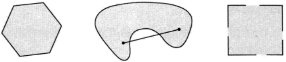
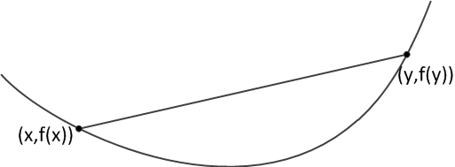
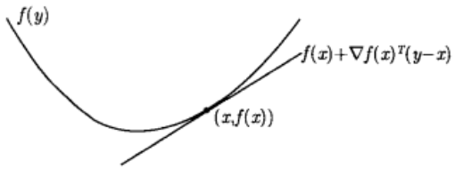
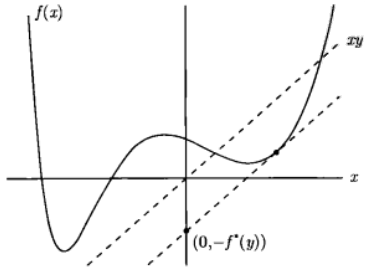
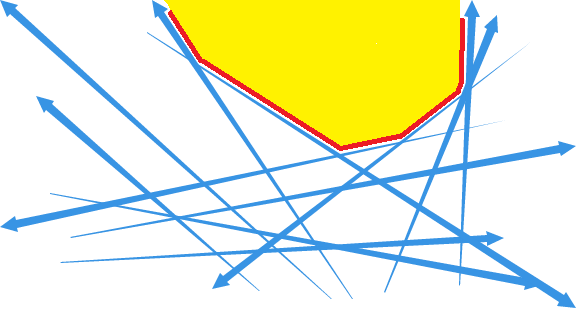
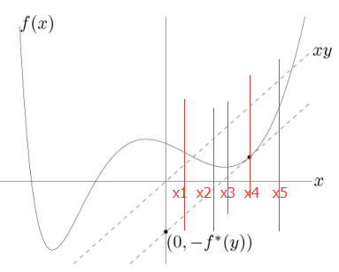
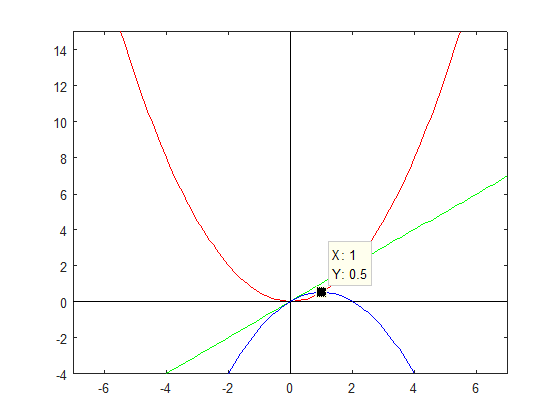
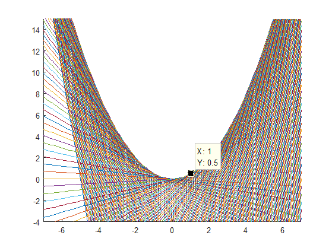

# 凸集和凸函数

* [返回上层目录](../convex-optimization.md)

* [仿射集合和凸集](#仿射集合和凸集)
  * [仿射集合](#仿射集合)
  * [凸集](#凸集)
* [凸函数](#凸函数)
  * [凸函数定义](#凸函数定义)
    * [一阶条件](#一阶条件)
    * [二阶条件](#二阶条件)
  * [Jensen不等式](#Jensen不等式)
  * [共轭函数](#共轭函数)
    * [如何求共轭函数](#如何求共轭函数)
    * [Fenchel不等式](#Fenchel不等式)
    * [共轭的共轭是原函数](#共轭的共轭是原函数)


# 仿射集合和凸集

## 仿射集合

如果通过集合C⊆R^n中任意两个不同点的直线仍然在集合C中，那么称集合C是**仿射**的。也就是说，C⊆R^n是仿射的，等价于：对于任意x1,x2∈C以及θ∈R有
$$
\theta x_1+(1-\theta)x_2\in C
$$
。换言之，C包含了C中任意两点的系数之和为1的线性组合。

形象地理解仿射集合：比如R^n空间中的任意一个超平面，就是一个仿射集合。

这个概念可以扩展到多个点的情况。如果θ1+...+θk=1，我们称具有θ1x1+...+θkxk形式的点为x1,...,xk的**仿射组合**。

**线性方程组的解集是一个仿射集合，反之，任意仿射集合可以表示为一个线性方程组的解集**。

证明：线性方程组的解集
$$
C=\{x|Ax=b\},\quad A\in R^{m\times n},b\in R^m
$$
，是一个仿射集合，为说明这一点，设x1,x2∈C，即Ax1=b, Ax2=b。则对于任意θ，我们有
$$
\begin{aligned}
A(\theta x_1+(1-\theta)x_2)&=\theta A x_1+(1-\theta)Ax_2\\
&=\theta b+(1-\theta)b\\
&=b
\end{aligned}
$$
这表明任意的仿射组合θx1+(1-θ)x2也在C中，并且与仿射集合C相关联的子空间就是A的零空间。反之，任意仿射集合可以表示为一个线性方程组的解集。

## 凸集

集合C被称为凸集，如果C中任意两点间的线段仍在C中，即对于任意x1,x2∈C和满足0≤θ≤1的θ都有
$$
\theta x_1+(1-\theta)x_2\in C
$$
。粗略地，如果集合中的每一点都可以被其他点沿着他们之间一条无阻碍的路径看见，那么这个集合就是凸集，所谓无阻碍，是指整条路径都在集合中。由于仿射集包含穿过集合中任意不同两点的整条直线，任意不同两点的线段自然也包含在集合中。因因而仿射集是凸集。

下图展示了R^2空间中的一些简单的凸和非凸集合：



上图中，

* 左图：包含其边界的六边形是凸的
* 中图：肾形集合不是凸的，因为图中所示集合中两点间的线段不为集合所包含
* 右图：仅包含部分边界的正方形不是凸的

# 凸函数

## 凸函数定义

**函数f是凸的**，如果dom f是凸集，且对于任意x, y ∈ dom f和任意0≤θ≤1，有
$$
f(\theta x+(1-\theta)y)\leqslant\theta f(x)+(1-\theta)f(y)
$$
从几何意义上看，上述不等式意味着点(x,f(x))和(y,f(y))之间的线段，即**从x到y的弦，在函数f的上方**，如下图所示。



### 一阶条件

假设f可微（即其梯度▽f在开集dom f内处处存在），则函数f是凸函数的充要条件是dom f是凸集且对于任意x, y ∈ dom f，下式成立
$$
f(y)\geqslant f(x)+\bigtriangledown f(x)^T(y-x)
$$
下图描述了上述不等式。




上述不等式表明，对于一个凸函数，其一阶Taylor近似实质上是原函数的一个全局下估计。反之，如果某个函数的一阶Taylor近似总是其全局下估计，那么这个函数是凸的。

上述不等式说明从一个凸函数的局部信息（即其在某点的函数值及导数），我们可以得到一些全局信息（如它的全局下估计）。这也许是凸函数的最重要的信息，由此可以解释凸函数以及凸优化问题的一些非常重要的性质。

下面是一个简单的例子，由上述不等式可知，如果▽f(x)=0，那么对于所有的y ∈  dom f，存在f(y)≥f(x)，即x是函数f的全局极小点。

### 二阶条件

现在假设函数f二阶可微，即对于开集dom f内的任意一点，它的Hessian矩阵或者二阶导数▽^2f存在，则函数f是凸函数的充要条件是，其Hessian矩阵是半正定阵：即对于所有的x ∈ dom f，有
$$
\bigtriangledown^2f(x)\geqslant 0
$$
对于R上的函数，上式可以简化为一个简单的条件f''(x)≥0（dom是凸的，即一个区间），此条件说明函数f是非减的。二阶导数大于等于零从几何上可以理解为函数图像在点x处具有正（向上）的曲率。

## Jensen不等式

基本不等式
$$
f(\theta x+(1-\theta )y)\leqslant \theta f(x)+(1-\theta)f(y)
$$
有时也称作Jesen不等式。此不等式可以很方便地扩展到更多点的凸组合：如果函数f是凸函数，x1,...,xk ∈  dom f，θ1,...,θk≥0且θ1+...+θk=1，则下式成立
$$
f(\theta_1x_1+...+\theta_kx_k)\leqslant\theta_1f(x_1)+...+\theta_kf(x_k)
$$
考虑凸集时，此不等式可以扩展到无穷和、积分以及期望。例如，如果在S⊆ dom f上p(x)≥0且
$$
\int_Sp(x)dx=1
$$
，则当相应的积分存在时，下式成立
$$
f\left( \int_Sp(x)xdx \right)\leqslant \int_Sf(x)p(x)dx
$$
如果x是随机变量，事件x ∈ dom f发生的概率为1，函数f是凸函数，当相应的期望存在时，我们有
$$
f(\mathbb{E}x)\leqslant\mathbb{E}f(x)
$$
上述所有不等式均被称为Jensen不等式，而实际上最初由Jessen提出的不等式相当简单
$$
f\left( \frac{x+y}{2} \right)\leqslant \frac{f(x)+f(y)}{2}
$$

## 共轭函数

已知函数f，定义函数f*为
$$
f^*(y)=\mathop{\text{sup}}_{x\in \text{dom}\ f}\left( y^Tx-f(x) \right)
$$
此函数称为函数f的**共轭函数**。如下图所示。

这个的意思就是说：我们求$y^Tx- f(x)$这个关于x和y函数在定义域内的上界，将这个上界形成的函数定义为共轭函数。



如上图所示，共轭函数f\*(y)是线性函数yx和f(x)之间的最大差值。如果f可微，在满足f'(x)=y处的点x处差值最大。

显而易见，f\*是凸函数，这是因为它是一系列y的凸函数（实质上是仿射函数）的逐点上确界。无论f是否是凸函数，f\*都是凸函数。这句话怎么理解呢？来，很好理解：

看下面这个图，图中对应那些直线如果是yTx- f(x)的图像的话（注意y才是自变量，x是可变的系数），那图中的上确界就是那些直线的共轭函数的图像。

其实也就是这样，不信你再看看共轭函数的定义式：先看左边，既然是f\*(y)，那这个函数就是关于y的函数，于是函数右边的yTx - f(x) 部分的x就是y的系数，f(x)就是一个常数，当x和y都是一维的时候这不就是直线的方程吗？对吧。



话说上面的解释虽然很直观，但我想下面的理解方法也需要给出。

如下图所示：



注意，这个函数并不是凸函数。

假设y=2时，yTx的图像是xy那条虚线，而定义式右边的部分是求x等于多少时yTx - f(x)的值最大，在上图中我们可以一眼看出，在“和xy平行且是f(x)切线的那个点”处两函数的差值最大，假设差值是10，于是我们就求出yTx - f(x)的共轭函数的一个点，即f\*(2) = 10，就这样把y扩展到这个定义域范围内后就得到了整个共轭函数。

 然后说几点：

* 定义式中的f(x)不一定是凸函数。
* 共轭函数一定是凸函数。（嗯？你问为啥？你再看看上上图，无数条仿射函数的逐点上确界啊，当然是凸函数了。。看见那条红线了没？）
* 凸函数的共轭函数的共轭函数是其本身。

下面我们来用matlab画一个函数来加深理解：





这里附上图的matlab代码：

```matlab
figure(1)
x = [-10:0.1:17];
y = hanshu(x);
y2 = x;
plot(x,y, 'r', x, y2, 'g', 0*x, y2, 'k', x, 0*x, 'k', x, y2 - y, 'b')
%%
axis([-7 7 -4 15])
figure(2)
axis([-7 7 -4 15])
hold on
for w1 = [-10:0.1:17]
    w0 = hanshu(w1);
    y_ge = w1*x - w0;
    plot(x, y_ge)
end
```

其中，函数y = hanshu(x)的matlab function类型代码为：

```matlab
function [y] = hanshu(x)
%w0 = 2.432; w1 = 0.3675; w2 = -0.3701; w3 = 0.003058; w4 = 0.01168;
%y = w0 + w1*x + w2*x.^2 + w3*x.^3 + w4*x.^4;
y = x.^2;
end
```

### 如何求共轭函数

上面只是为了直观的理解共轭函数，那如果求呢？看下面的例子：

假设有函数
$$
f(x) = x^TQx/2
$$
，其中Q是可逆的对称阵，算它的共轭函数，根据定义就是求：
$$
g(x, y) = y^Tx - x^TQx/2
$$
的上确界。

于是将g(x, y)对x求偏导：
$$
g'(x,y) = (y^Tx)' - (x^TQx/2)'=y - Qx
$$
其中，xTQx对x求偏导的结果是2Qx。

令其对x的偏导等于零，得
$$
x= Q^{-1}y
$$
因为是求偏导，所以得到的是上确界，于是把上式代入g(x, y)后就得f(x)的共轭函数：
$$
f^*(y)= y^TQ^{-1}y/2
$$

### Fenchel不等式

还记得共轭函数的定义式吗？不记得的话往上翻翻~

总之，根据共轭函数的定义，f\*(x)是对yTx- f(x)求上确界，于是一定有f*(x)≥yTx - f(x)，把f(x)移到左边于是就有了下面的式子：
$$
f(x) + f^*(y)\geqslant x^Ty
$$
这，就是Fenchel不等式。但这有什么用呢？

 你看啊，从小学开始我们就在学习一些奇怪的不等式，如：

 两个正数的算术平均数大于等于几何平均数，即：
$$
\frac{a+b}{2}\geqslant\sqrt{ab},\quad a>0,\ b>0
$$
这个还蛮好证明的：因为对于两个正数x、y有x2+y2≥2xy，这时令a=x2、b=y2，就得出了上面的公式。但下面这个不等式你知道怎么证明吗？

给定可逆对称阵Q，对于任意的向量x, y，有：
$$
x^TQx+ y^TQ^{-1}y \geqslant 2x^Ty
$$
不知道吧。其实这个用Fenchel不等式就可以证明。

还记得共轭函数里已经求得的f(x)= xTQx/2时f(x)的共轭函数是f\*(y) = yTQ-1y吗？将其代入到Fenchel不等式中就立马得到了xTQx+ yTQ-1y ≥ 2xTy。

PS：xTQx+ yTQ-1y ≥ 2xTy退化到一维就是ax2 + y2/a ≥ 2xy。

### 共轭的共轭是原函数

上面的例子以及“共轭”都隐含了凸函数的共轭函数的共轭函数是原函数，也即：如果函数f是凸函数且f是闭的，则f\*\*=f\*。

例如，如果dom f = R^n，则我们有f\*\*=f，即f的共轭函数的共轭函数还是f。

# 参考资料

* 《凸优化》Boyd

本文绝大部分内容就是摘抄浓缩的此书的前240页，以方便快速学习此书中与机器学习相关的核心内容。

* [凸优化 - 3 - Jensen不等式、共轭函数、Fenchel不等式](https://blog.csdn.net/xueyingxue001/article/details/51858074)

"共轭函数"一小节部分参考了此博客。
