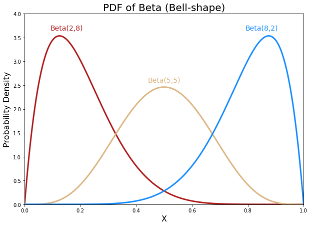
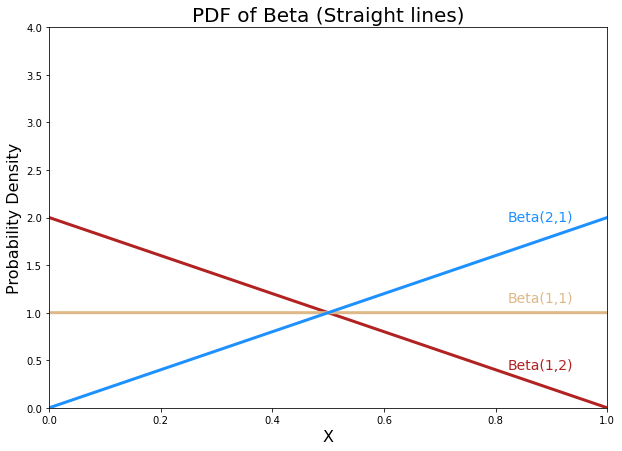
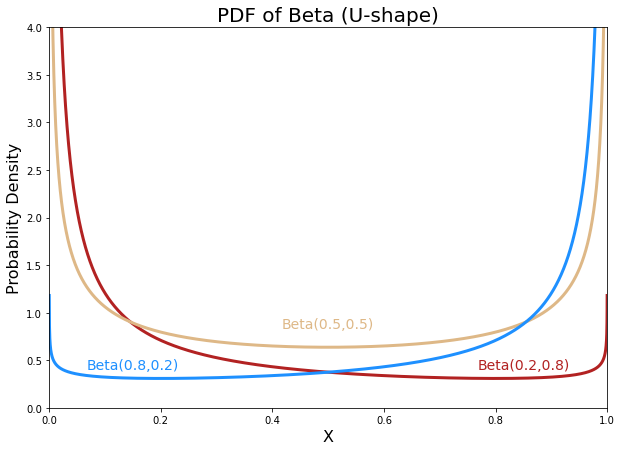

# Beta贝塔分布

* [返回上层目录](../probability-distribution.md)
* [Beta分布定义](#Beta分布定义)
  * [不同参数下的Beta分布](#不同参数下的Beta分布)
  * [概率密度函数](#概率密度函数)
* [Beta分布的性质](#Beta分布的性质)
* [对Beta分布的理解](#对Beta分布的理解)

# Beta分布定义

Beta分布$Beta(\alpha, \beta)$的定义域为[0, 1]，参数$\alpha, \beta$均为正值，又称为形状参数。

## 不同参数下的Beta分布

Beta分布的形状可以是钟形、U形、甚至是直线。

* $\alpha,\beta$均大于1， 为钟形；

* $\alpha,\beta$有一值为1，为直线；
* $\alpha,\beta$均小于1，则为U形。

钟型：

直线型：

U形：

从Beta分布的概率密度函数的图形我们可以看出，Beta分布有很多种形状，但都是在0-1区间内，因此Beta分布可以描述各种0-1区间内的形状（事件）。因此，它特别适合为某件事发生或者成功的概率建模。同时，当$\alpha=1$，$\beta=1$的时候，它就是一个均匀分布。

贝塔分布主要有$\alpha$和$\beta$两个参数，这两个参数决定了分布的形状，从上图及其均值和方差的公式可以看出：

1）$\alpha/(\alpha+\beta)$也就是均值，其越大，概率密度分布的中心位置越靠近1，依据此概率分布产生的随机数也多说都靠近1，反之则都靠近0。

2）$\alpha+\beta$越大，则分布越窄，也就是集中度越高，这样产生的随机数更接近中心位置，从方差公式上也能看出来。

## 概率密度函数

$$
\begin{aligned}
f(x,\alpha,\beta)&=\text{constant}\cdot x^{\alpha-1}\cdot (1-x)^{\beta-1}\\
&=\frac{x^{\alpha-1}\cdot (1-x)^{\beta-1}}{\int_0^1u^{\alpha-1}(1-u)^{\beta-1}\text{d}u}\\
&=\frac{\Gamma(\alpha+\beta)}{\Gamma(\alpha)\Gamma(\beta)}x^{\alpha-1}(1-x)^{\beta-1}\\
&=\frac{1}{B(\alpha,\beta)}x^{\alpha-1}(1-x)^{\beta-1}
\end{aligned}
$$
 其中，$\Gamma$为Gamma函数，是阶乘的扩展：

- 当n为正整数时，n的阶乘定义如下：
  $$
  n!=n\cdot(n−1)\cdot(n−2)\cdot\cdots\cdot2\cdot1
  $$

- 当n不是整数时，n!为：
  $$
  \Gamma(x)=\int_0^{+\infty}t^{x-1}e^{-t}\text{d}t\quad(x>0)
  $$

# Beta分布的性质

Beta分布的均值是：
$$
\frac{\alpha}{\alpha+\beta}
$$
Beta分布的方差是：
$$
\frac{\alpha\beta}{(\alpha+\beta)^2(\alpha+\beta+1)}
$$

# 对Beta分布的理解

为了衡量一个棒球运动员的击球率。

首先在运动员打球之前，我们就先对他的击球率有一个预测值（先验概率）。假设我们预计运动员整个赛季的击球率平均值大概是0.27左右，范围大概是在0.21到0.35之间（根据历史运动员的击球率）。那么用贝塔分布来表示，我们可以取参数$\alpha=81$，$\beta=219$，因为$\alpha/(\alpha+\beta)=0.27$，图形分布也主要集中在0.21~0.35之间，非常符合经验值，也就是我们在不知道这个运动员真正击球水平的情况下，我们先给一个平均的击球率的分布。

假设运动员一次击中，那么现在他本赛季的记录是“1次打中；1次打击”。那么我们更新我们的概率分布，让概率曲线做一些移动来反应我们的新信息。
$$
Beta(\alpha_0+hits, \beta_0+misses)
$$
其中，$\alpha_0=81$、$\beta_0=219$是初始参数。hits表示击中的次数，misses表示未击中的次数。假设赛季过半时，运动员一共打了300次，其中击中100次。那么新的贝塔分布是$Beta(81+100,219+200)$，如下图：

可以看出，曲线更窄而且往右移动了（击球率更高），由此我们对于运动员的击球率有了更好的了解。新的贝塔分布的期望值为0.303，比直接计算100/(100+200)=0.333要低，是比赛季开始时的预计0.27要高，所以贝塔分布能够抛出掉一些偶然因素，比直接计算击球率更能客观反映球员的击球水平。

这个公式就相当于给运动员的击中次数添加了“初始值”，相当于在赛季开始前，运动员已经有81次击中219次不中的记录。 因此，**在我们事先不知道概率是什么但又有一些合理的猜测时，贝塔分布能够很好地表示为一个概率的分布**。

# 参考资料

* [汤普森采样（Thompson sampling）](https://blog.csdn.net/sinat_37422398/article/details/113381119)

本文部分复制了该博客内容。

* [Dirichlet Distribution 狄利克雷分布](https://zhuanlan.zhihu.com/p/425388698)

背景知识：Beta分布。不同参数下的Beta分布。

===

* [贝塔分布（Beta Distribution）简介及其应用](https://www.datalearner.com/blog/1051505532393058)

举了beta分布的几个例子。其中有个二项分布作为似然函数的，要看。

===

- [关于Beta分布、二项分布与Dirichlet分布、多项分布的关系](https://www.cnblogs.com/wybang/p/3206719.html)
- [机器学习的数学基础（1）--Dirichlet分布](https://blog.csdn.net/jwh_bupt/article/details/8841644)

- [贝叶斯学习笔记（一）共轭先验](https://zhuanlan.zhihu.com/p/89398684)

1

