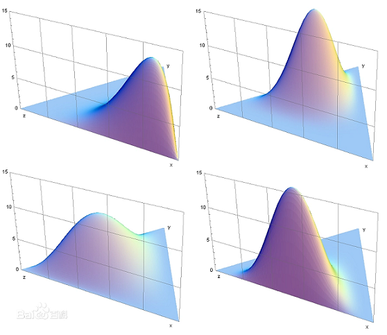
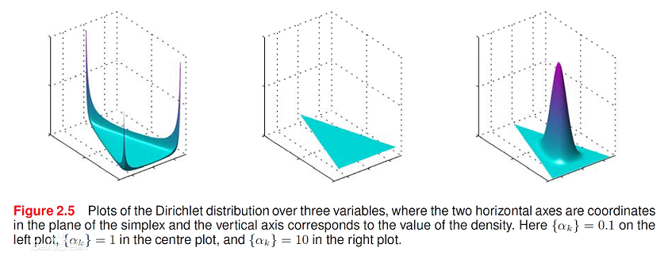

# Dirichlet狄利克雷分布

* [返回上层目录](../probability-distribution.md)

# 参考资料

===

- [关于Beta分布、二项分布与Dirichlet分布、多项分布的关系](https://www.cnblogs.com/wybang/p/3206719.html)

- [机器学习的数学基础（1）--Dirichlet分布](https://blog.csdn.net/jwh_bupt/article/details/8841644)

- [贝叶斯学习笔记（一）共轭先验](https://zhuanlan.zhihu.com/p/89398684)

* [狄利克雷分布(Dirichlet Distribution)](https://zhuanlan.zhihu.com/p/78743630)

