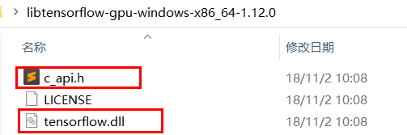
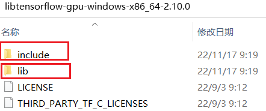
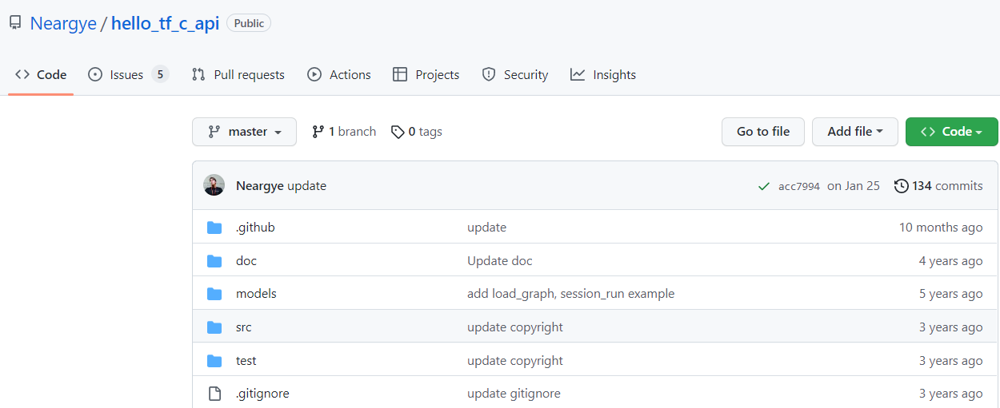
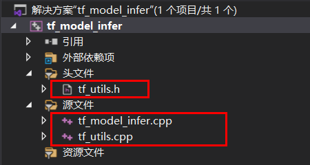
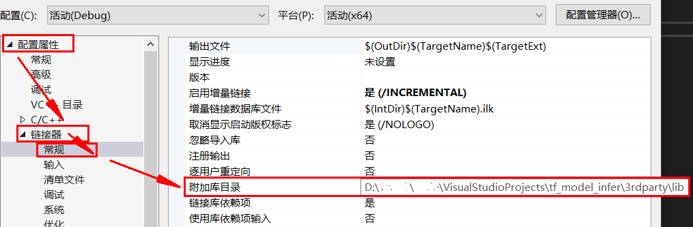
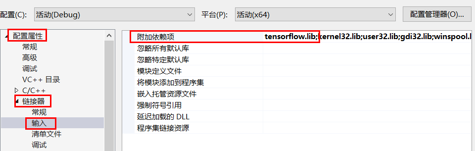
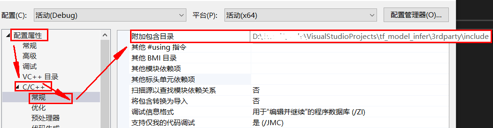
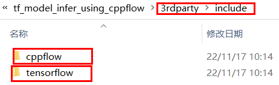

# 基于C/C++部署TensorFlow模型

* [返回上层目录](../model-deployment.md)
* [TensorFlow官方C库介绍](#TensorFlow官方C库介绍)
  * [获取库文件](#获取库文件)
  * [编译](#编译)
  * [C库的API讲解](#C库的API讲解)
* [TensorFlow官方C++库介绍](#TensorFlow官方C++库介绍)
* [第一种C++部署工程Neargye](#第一种C++部署工程Neargye)
  * [下载并打开C++部署的VS工程](#下载并打开C++部署的VS工程)
    * [由cmake创建VS工程](#由cmake创建VS工程)
    * [运行并改造VS工程](#运行并改造VS工程)
  * [基于Neargye建立自己的VS工程](#基于Neargye建立自己的VS工程)
    * [找出必要的第三方链接库和头文件](#找出必要的第三方链接库和头文件)
    * [创建VS工程](#创建VS工程)
    * [加载动态链接库](#加载动态链接库)
    * [编译运行](#编译运行)
    * [动态库和pb模型文件的放置位置分析](#动态库和pb模型文件的放置位置分析)
    * [警告消除](#警告消除)
    * [GPU还是CPU？](#GPU还是CPU？)
* [第二种C++部署工程gdyshi](#第二种C++部署工程gdyshi)
  * [查看并梳理dyshi工程代码](#查看并梳理dyshi工程代码)
  * [基于gdyshi建立自己的VS工程](#基于gdyshi建立自己的VS工程)
* [第三种C++部署工程CppFlow](#第三种C++部署工程CppFlow)
  * [查看并梳理CppFlow工程代码](#查看并梳理CppFlow工程代码)
  * [基于CppFlow建立自己的VS工程](#基于CppFlow建立自己的VS工程)

本文介绍使用C++语言实现通用模型的部署。本文主要使用pb格式的模型文件，其它格式的模型文件请先进行格式转换。

# TensorFlow官方C库

## TensorFlow官方C库介绍

TensorFlow官方同时提供了C++接口和C接口，目前不能直接使用C++接口的调用，使用之前需要使用TensorFlow bazel build编译；而C接口TensorFlow官方提供了预编译库，可直接下载。

### 获取库文件

库文件在获取和安装可参考[TensorFlow官方C库安装教程](https://tensorflow.google.cn/install/lang_c)


Download and extract

| TensorFlow C library | URL                                                          |
| :------------------- | :----------------------------------------------------------- |
| Linux                |                                                              |
| Linux CPU only       | <https://storage.googleapis.com/tensorflow/libtensorflow/libtensorflow-cpu-linux-x86_64-2.10.0.tar.gz> |
| Linux GPU support    | <https://storage.googleapis.com/tensorflow/libtensorflow/libtensorflow-gpu-linux-x86_64-2.10.0.tar.gz> |
| macOS                |                                                              |
| macOS CPU only       | <https://storage.googleapis.com/tensorflow/libtensorflow/libtensorflow-cpu-darwin-x86_64-2.10.0.tar.gz> |
| Windows              |                                                              |
| Windows CPU only     | <https://storage.googleapis.com/tensorflow/libtensorflow/libtensorflow-cpu-windows-x86_64-2.10.0.zip> |
| Windows GPU only     | <https://storage.googleapis.com/tensorflow/libtensorflow/libtensorflow-gpu-windows-x86_64-2.10.0.zip> |

Extract the downloaded archive, which contains the header files to include in your C program and the shared libraries to link against.

选择`Windows GPU only`，下载并解压缩：

`libtensorflow-gpu-windows-x86_64-1.12.0.zip`

注意，上面的地址的zip版本是随着Tensorflow的更新而升级的，我下的是参考的博客里的，比较老，还是tf1.12的，暂时也够了。

解压缩后如下，就只有一个**动态链接库**和一个**头文件**，注意这个头文件是用于C的，不是用于C++，用于C++的稍后有大神适配了，但这里官方的还不行。



注：最新版(2.10.0版)的下载下来，头文件有好几个，doing链接库也分为了dll和配套的lib。



下载完毕后只需将解压后的库文件和头文件添加到系统环境变量中即可。这里我自己没有加，因为我需要放到其他任意机器上跑。

### 编译

如果以上列表中没有我们想要的平台库，或者我们需要开启一些未开启的加速选项，就需要从源代码编译C库了。具体编译环境搭建可参考官方文档[linux/macOS](https://tensorflow.google.cn/install/source) [windows](https://tensorflow.google.cn/install/source_windows) [树莓派](https://tensorflow.google.cn/install/source_rpi)，编译命令可参考[官方文档](https://github.com/tensorflow/tensorflow/blob/master/tensorflow/tools/lib_package/README.md)

关于TensorFlow的编译因为东西比较多，[参考资料](https://blog.csdn.net/chongtong/article/details/91947690)的作者说会在后续专门写一个博客进行说明。这篇文章主要聚焦在使用C++调用模型文件进行推理这一块。

### C库的API讲解

TensorFlow的C接口详见[c_api.h](https://github.com/tensorflow/tensorflow/blob/master/tensorflow/c/c_api.h)，这里针对常用接口做一个说明，并跟将C接口跟[tensorflow模型部署系列—单机python部署](https://blog.csdn.net/chongtong/article/details/90693787)中的python代码进行对应，以便于读者更好地理解接口。

* 加载模型文件，对应python代码`tensors = tf.import_graph_def(output_graph_def, name="")`

  ```c++
  // 函数`TF_GraphImportGraphDef`用于从序列化的缓存中导入模型
  void TF_GraphImportGraphDef(
   TF_Graph* graph, const TF_Buffer* graph_def,
   const TF_ImportGraphDefOptions* options, TF_Status* status)
  ```

* 创建session，对应python代码`self.__sess = tf.Session()`

  ```c++
  // 函数TF_NewSession用于使用当前模型图创建session
  TF_Session* TF_NewSession(TF_Graph* graph, const TF_SessionOptions* opts, TF_Status* status);
  ```

* 获取输入输出OP，对应python代码`self.__input = graph.get_tensor_by_name("input:0")`

  ```c++
  // 函数TF_GraphOperationByName可根据op名称获取当前图的op。op名称的获取方式见tensorflow模型部署系列—单机python部署https://blog.csdn.net/chongtong/article/details/90693787。注意：C中将冒号切分开了，代码表述为{TF_GraphOperationByName(tf_app.graph, "output/Softmax"), 0}
  TF_CAPI_EXPORT extern TF_Operation* TF_GraphOperationByName(
   TF_Graph* graph, const char* oper_name);
  ```

* 张量填充，无对应python代码，python可直接赋值

  ```c++
  // 使用TF_AllocateTensor创建张量，张量的数据缓冲区地址使用TF_TensorData获取，找到张量的数据缓冲区地址就可以用memcpy进行数据填充了
  F_Tensor* TF_AllocateTensor(TF_DataType, const int64_t* dims,
  int num_dims, size_t len);
  void* TF_TensorData(const TF_Tensor*);
  ```

* 运行OP，对应python代码`output = self.__sess.run(self.__output, feed_dict={self.__input: input})`

  ```c++
  // 使用TF_SessionRun运行op，在运行之前需要拿到session、填充好输入数据
  void TF_SessionRun(
   TF_Session* session,
   // RunOptions
   const TF_Buffer* run_options,
   // Input tensors
   const TF_Output* inputs, TF_Tensor* const* input_values, int ninputs,
   // Output tensors
   const TF_Output* outputs, TF_Tensor** output_values, int noutputs,
   // Target operations
   const TF_Operation* const* target_opers, int ntargets,
   // RunMetadata
   TF_Buffer* run_metadata,
   // Output status
   TF_Status*);
  ```

* 获取张量值，无对应python代码，因python可直接获取

  ```c++
  // op运行完毕后就可以通过TF_TensorData找到张量的数据缓冲区地址，并获取输出数据了
  ```

* 释放资源，无对应python代码，因python可自动释放资源

  ```c++
  // 这一步是C/C++特有的，需要手动释放资源。包括释放张量TF_DeleteTensor、关闭sessionTF_CloseSession、删除sessionTF_DeleteSession、删除计算图TF_DeleteGraph
  void TF_DeleteTensor(TF_Tensor*);
  void TF_CloseSession(TF_Session*, TF_Status* status);
  void TF_DeleteSession(TF_Session*, TF_Status* status);
  void TF_DeleteGraph(TF_Graph*);
  ```

## TensorFlow官方C++库介绍

TensorFlow官方的C++库接口见这里：[TensorFlow C++ API Reference](https://www.tensorflow.org/api_docs/cc/)，具体界面是：


目前基于C++库的好像很少。下面三种都是基于C库的，封装成了C++形式。

这篇文章介绍了如何下载编译C++DLL并使用pb文件进行推理。下面参考这篇文章进行下载编译和推理

[windows下编译tensorflow源码 用其c++接口调用训练好的模型](https://blog.csdn.net/yuejisuo1948/article/details/84197534)

### 下载并编译

参考文章：

* [windows下编译tensorflow源码 用其c++接口调用训练好的模型](https://blog.csdn.net/yuejisuo1948/article/details/84197534)

* [indows下编译tensorflow2.5.0 c++库并调用](https://blog.csdn.net/dycljj/article/details/118408400)
* [Windows10 Bazel 编译 Tensorflow 2 C++ dll 和 lib 文件](https://blog.csdn.net/yx123919804/article/details/107042822)


# 第一种C++部署工程Neargye

因为C/C++语言本身的特性，tensorflow的C/C++接口相对复杂了不少，好在已有大神把TensorFlow的C接口进行了封装，见[GitHub](https://github.com/Neargye/hello_tf_c_api)，第一种C++部署工程就是参考此GitHub。

## 下载并打开C++部署的VS工程

打开[GitHub: Neargye/hello_tf_c_api](https://github.com/Neargye/hello_tf_c_api)，下载源代码。看时间应该配套的tensorflow.dll是1.15版本的。



这里有介绍如何从dll生成配套的lib(引入库，不是静态库)：[Create .lib file from .dll for windows](https://github.com/Neargye/hello_tf_c_api/blob/master/doc/create_lib_file_from_dll_for_windows.md)。

仔细看看ReadMe。

### 由cmake创建VS工程

在其GitHub：[Neargye/hello_tf_c_api](https://github.com/Neargye/hello_tf_c_api)主页上有介绍如何在Windows下创建VS工程，摘录如下：

```shell
git clone --depth 1 https://github.com/Neargye/hello_tf_c_api
cd hello_tf_c_api  # cd进去后打开CmakeList，可以看到下载的tf的版本及cpu/gpu,可以自行修改
mkdir build
cd build
cmake -G "Visual Studio 15 2017" -A x64 ..  # 64位 若32位则改为Win32
cmake --build . --config Debug
```

其中，


```shell
cmake --build . --config Debug
```


### 运行并改造VS工程

该VS工程的解决方案打开后有好几个项目，我们需要两个项目：

* `graph_info`

  用于显示模型文件的结构和各变量名

* `interface`

  用于前向推理，得出推理结果。


我们需要先用`graph_info`得到模型文件的输入输出变量名和维度，然后争取填写到`interface`中，得到正确的模型推理输出结果。

首先运行`graph_info`工程，把输入的pb模型文件变为自己的pb模型文件，可以指定路径，如果不指定路径，只有文件名的话，就默认是在`inferface.vcxproj`同目录下。

```shell
2: state type: Placeholder device:  number inputs: 0 number outputs: 1
Number inputs: 0
Number outputs: 1
0 type : TF_FLOAT dims: 2 [-1,7]

...

18: pi/mul type: Mul device:  number inputs: 2 number outputs: 1
Number inputs: 2
0 type : TF_FLOAT
1 type : TF_FLOAT
Number outputs: 1
0 type : TF_FLOAT dims: 2 [-1,2]
```

根据输出来确定模型的输入输出的名称，以及输入的维度，来改编`interface`工程，具体如下：

```c++
// 由2: state type: Placeholder | type : TF_FLOAT dims: 2 [-1,7]可知
// 输入名字叫state，维度是[1, 7]，即
const std::vector<TF_Output> input_ops = { {TF_Graph...ByName(graph, "state"), 0} };
const std::vector<std::int64_t> input_dims = { 1, 7 };
// 由18: pi/mul type: Mul | type : TF_FLOAT dims: 2 [-1,2]可知
// 输出名字叫pi/mul，维度是[1, 2]，即
const std::vector<TF_Output> out_ops = { {TF_Graph...ByName(graph, "pi/mul"), 0} };
std::cout << "Output vals: " << result[0] << ", " << result[1] << std::endl;
```

运行结果为

```shell
2022-11-16 22:01:48.389869: I tensorflow/core/platform/cpu_feature_guard.cc:142] Your CPU supports instructions that this TensorFlow binary was not compiled to use: AVX2
4
Output vals: 0.867242, -0.558126
0.867241501808, -0.558125674725
```

成功输出模型运行结果，经过比对验证，结果正确无误。

## 基于Neargye建立自己的VS工程

这里建立的VS工程名字是`tf_model_infer`。

注意：第二种工程不能使用最新版(2.9.0版本)的TensorFlow官网给的C接口，**只能使用1.12.0版本的旧**的C接口，这是因为作者已经有4年（写这段话的时间为2022年11月17日）没维护代码了，可能有些函数接口已经变了？所以这个代码虽然能用，但是我**不打算用了**，因为它不能使用官方最新的C接口，但是它的**运行速度真的很快**，同样的模型，10万次循环测试下来，单次耗时只需要0.03ms，其他两个模型（第二种和第三种都需要0.3ms）。

| 模型类型                      | 是否能使用最新版C接口(2.9.0版)  | 单次推理速度 | 备注           |
| ----------------------------- | ------------------------------- | ------------ | -------------- |
| 第一种Neargye/hello_tf_c_api  | 不能，能使用旧版C接口(1.12.0版) | 0.03ms       |                |
| 第二种gdyshi/model_deployment | 能                              | 0.3ms        | 二是基于一写的 |
| 第三种CppFlow                 | 能                              | 0.3ms        |                |

而且该工程可以打印pb文件的模型结构，即内部的变量和算子名字。

### 找出必要的第三方链接库和头文件

经过仔细查看示例工程给的VS源码工程，发现需要第三方导入的就是一个dll动态链接库（以及配套的lib引入库），还有与动态链接库对应的一些头文件。整理如下所示，按下面的目录进行整理即可。

```shell
├─3rdparty
│  ├─include
│  │  ├─scope_guard  # 这也是某个需要的头文件，没看内容
│  │  │  └─include
│  │  │          scope_guard.hpp
│  │  │
│  │  └─tensorflow  # 动态链接库对应的头文件
│  │      └─c
│  │          │  c_api.h
│  │          │  tf_attrtype.h
│  │          │  tf_datatype.h
│  │          │  tf_status.h
│  │          │  tf_tensor.h
│  │          │
│  │          └─eager
│  │                  c_api.h
│  │
│  └─lib  # 动态链接库
│          tensorflow.dll
│          tensorflow.lib  # 注：这不是静态库，而是动态链接库对应的引入库
```

### 创建VS工程

创建新的VS工程，解决方案起名为`tf_model_infer`，里面的代码如下图所示，含有一个main函数所在的`tf_model_infer.cpp`文件，还有一个原工程里就有的`tf_utils.cpp`和`tf_utils.h`文件。



然后把原代码中的`graph_info`工程中的代码加进来，目的是为了显示pb模型文件的结构，方便找出输入和输出的变量名。


这样我们的工程就建好了，但是运行会报错，因为还没有加载动态链接库和对应的头文件。

### 加载动态链接库

先回顾下动态链接库和静态链接库的概念：

函数库一般分为`静态库`和`动态库`两种，所谓静态、动态是指链接过程。

|         | 静态库 | 动态库 |
| :-----: | :----: | :----: |
| Windows |  .lib  |  .dll  |
|  Linux  |   .a   |  .so   |

虽然Windows下静态库后缀为`.lib`，但是Windows下的动态链接库，往往提供两个文件：一个**引入库（.lib）文件（也称“导入库文件”）**和一个**DLL（.dll）**文件。当然到了后面会告诉你如果只提供一个DLL文件，使用显示连接的方式也可以调用，只是稍加麻烦而已。

**Windows中两种lib的区别**

**静态库（.lib）**

- 函数和数据被编译进一个二进制文件（通常扩展名为.lib）。
- 在使用静态库的情况下，在编译链接可执行文件时，链接库从库中复制这些函数和数据并把它们和应用程序的其他模块组合起来创建最终的可执行文件（.EXE文件）
- 当发布产品时，只需要发布这个可执行文件，并不需要发布被使用的静态库

**动态库(.lib和.dll)**

- 在使用动态库的时候，编译后往往提供两个文件：一个引入库（.lib）文件（也称“导入库文件”）和一个DLL（.dll）文件。当然到了后面会告诉你如果只提供一个DLL文件，使用显示连接的方式也可以调用，只是稍加麻烦而已。
- 虽然引入库的后缀名也是“lib”，但是，动态库的引入库文件和静态库文件有着本质的区别。对于一个dll文件来说，其引入库文件（.lib）包含该DLL导出的函数和变量的符号名，而.dll文件包含该DLL实际的函数和数据。
- 在使用动态库的情况下，在编译链接可执行文件时，只需要链接该DLL的引入库文件，该DLL中的函数代码和数据并不复制到可执行文件，知道可执行程序运行时，才去加载所需的DLL，将该DLL映射到进程的地址空间中，然后访问DLL中导出的函数。
- 也就是说，在发布产品时，除了发布可执行文件以外，同时还需要发布该程序将要调用的动态链接库。
- 只有当EXE程序确实要调用这些DLL模块的情况下，系统才会将它们加载到内存空间中。这种方式不仅减少了EXE文件的大小和对内存空间的需求，而且使这些DLL模块可以同时被多个应用程序使用。**链接Windows程序以产生一个可执行文件时，你必须链接由编程环境提供的专门的 “引入库(import library)”**。这些引入库包含了动态链接库名称和所有Windows函数调用的引用信息。链接程序使用该信息在.EXE文件中构造一个表，当加载程序时，Windows使用它将调用转换为Windows函数。
- **“引入库”和静态库的区别很大**，它们本质是不一样的东西。静态库本身就包含了实际执行代码、符号表等等，而对于**引用库而言，其实际的执行代码位于动态库中，引入库只包含了地址符号表等，确保程序找到对应函数的一些基本地址信息**。但是**引入用文件的引入方式和静态库一样**，要在链接路径上添加找到这些.lib的路径

上文是复制的[基础：windows下lib和dll的区别和使用](https://blog.csdn.net/zhizhengguan/article/details/121532075)中的一段话，更详细的介绍，请看该博客。

下面介绍我自己在VS2019中加载使用动态链接库的方法。

加载动态库有隐式链接和显示链接两种方式，具体见[基础：windows下lib和dll的区别和使用](https://blog.csdn.net/zhizhengguan/article/details/121532075)，这里不再详述，我选择了隐式链接，因为显示链接1是有点麻烦，不优雅，2是需要指定dll的位置，不方便，相对位置一变就要重新编译（除非一直放在根目录下），不灵活。

正式开始介绍隐式链接的方法：

隐式链接需要三个东西，分别是*.h头文件，lib库（动态的），dll库；而这里的lib库仅是编译的时候用，运行时候不用，运行时只用dll。

**第一步：添加动态链接库的Lib引入库**

有两种方法，这里选择其中一种：通过设置工程配置来添加lib库。

- 添加文件引用的lib静态库**路径**：工程->属性->配置属性->链接器->常规->附加库目录：加上lib文件存放目录。



- 然后添加工程引用的lib**文件名**：工程->属性->配置属性->链接器->输入->附加依赖项：加上lib文件名。



**第二步：添加头文件**

在调用DLL中导出的函数之前要include对应的头文件，可以写绝对路径，也可以拷贝到工程调用源文件的同一目录下，也可以通过VS添加（include）头文件目录，VS中配置方法：

- VS项目->右击属性->配置属性->VC++目录->包含目录
- VS项目->右击属性->配置属性->C/C+±>常规->附加包含目录

两种估计都行，但是我选择了第二种，没啥理由，就是一种直觉。。



**第三步：VS工程模式选择**

最后要注意，VS工程选择的是32位还是64位，是Debug模式还是Release模式。选择不同，可能会导致动态链接库链接失败。


### 编译运行

如果一切正确的话，运行结果分为两个部分，1是显示模型文件的结构，2是显示模型的输出结果，具体如下：

```shell
2: state type: Placeholder device:  number inputs: 0 number outputs: 1
Number inputs: 0
Number outputs: 1
0 type : TF_FLOAT dims: 2 [-1,7]

...

18: pi/mul type: Mul device:  number inputs: 2 number outputs: 1
Number inputs: 2
0 type : TF_FLOAT
1 type : TF_FLOAT
Number outputs: 1
0 type : TF_FLOAT dims: 2 [-1,2]

==========================

2022-11-16 21:34:17.601445: I tensorflow/core/platform/cpu_feature_guard.cc:142] Your CPU supports instructions that this TensorFlow binary was not compiled to use: AVX2
infer time is 5
Output vals: 0.867242, -0.558126
0.867241501808, -0.558125674725
```

### 动态库和pb模型文件的放置位置分析

设定`std::string pb_file = "dppo.pb";`，即没有加绝对或者相对路径。

（1）编译：

* 必须要有lib：

  若没有指定lib文件路径，则必须放在和`tf_model_infer.vcxproj`同目录下；

  若指定lib文件路径，则要么放在和`tf_model_infer.vcxproj`同目录下，要么放在指定的lib文件路径下：`属性->链接器->常规->附加库目录`

* 可以没有dll；

* 可以没有pb模型文件，因为不会实际运行代码

（2）IDE中调试/运行：

* dll文件：

  （1）要么放在和`tf_model_infer.vcxproj`同目录下；

  （2）要么放在和`tf_model_infer.exe`同目录下，即`\x64\Debug`目录

  注：`属性->链接器->常规->附加库目录`不是检索dll的目录，是检索lib的目录

* pb文件必须放在和`tf_model_infer.vcxproj`同目录下

（3）运行`\x64\Debug\xxx.exe`可执行文件：

* dll文件必须放在和`tf_model_infer.exe`同目录下，即`\x64\Debug`目录
* pb文件必须放在和`tf_model_infer.exe`同目录下，即`\x64\Debug`目录

### 警告消除

运行时有警告：

```shell
严重性 代码  说明  项目  文件  行   禁止显示状态
警告  C4190   “TF_NewWhile”有指定的 C 链接，但返回了与 C 不兼容的 UDT“TF_WhileParams” tf_model_infer  D:\1work\code\VisualStudioProjects\tf_model_infer\3rdparty\include\tensorflow\c\c_api.h 935 
```

查了下说是动态链接库太老了，估计需要重新编译该动态库，或者直接用最新的动态库。

疑惑：下的官网的压缩包里没有lib啊。。这个里面哪里来的？可能是要么官网删了，要么是重新编译生成的。

### GPU还是CPU？

经过实际运行并查看`nvidia-smi`，显示GPU占用率为0%，故是CPU运行。

# 第二种C++部署工程gdyshi

第二种C++部署工程的原作者的代码，参考了第一种的代码。

## 查看并梳理dyshi工程代码

因为C/C++语言本身的特性，tensorflow的C/C++接口相对复杂了不少，好在已有大神把TensorFlow的C接口进行了封装，见[GitHub](https://github.com/Neargye/hello_tf_c_api)，第一种C++部署工程就是参考此GitHub。

相比大神的封装，我们可以基于此更简单的使用。我写这篇文章所参考的博客[tensorflow模型部署系列—单机C++部署（附源码）](https://blog.csdn.net/chongtong/article/details/91947690)的作者的开源的[代码](https://github.com/gdyshi/model_deployment)（即第二种的参考）便是**在此（第一种C++部署工程）基础上做的**。

GitHub：[gdyshi/model_deployment](https://github.com/gdyshi/model_deployment/tree/master/C%2B%2B)

**（1）TensorFlow库接口封装**

TensorFlow库接口封装参考大神的代码，主要提供了计算图的加载与删除；session的创建、运行和删除；张量的创建、填充、获取与删除。

**（2）模型封装库**

模型封装类主要包括三个方法：初始化、去初始化和推理。

初始化只用于处理与sess.run无关的所有操作，以减少推理时的操作，保证模型推理高效运行。初始化主要进行的操作包括：模型文件加载、获取计算图和计算session、根据输入输出tensor名称获取输入输出tensor。从模型文件中获取输入输出op名请参考博客[tensorflow模型部署系列—单机python部署](https://blog.csdn.net/chongtong/article/details/90693787)

推理主要进行的操作有：输入张量填充、sesson.run、和输出张量获取。

去初始化用于释放资源，这一块是python所没有的。主要操作包括：session的关闭和释放、计算图的释放。

**（3）模型封装类示例代码**

经过模型封装类封装以后，示例代码就很简单了。只用准备数据，然后推理就行了。

## 基于gdyshi建立自己的VS工程

| 模型类型                      | 是否能使用最新版C接口(2.9.0版)  | 单次推理速度 | 备注           |
| ----------------------------- | ------------------------------- | ------------ | -------------- |
| 第一种Neargye/hello_tf_c_api  | 不能，能使用旧版C接口(1.12.0版) | 0.03ms       |                |
| 第二种gdyshi/model_deployment | 能                              | 0.3ms        | 二是基于一写的 |
| 第三种CppFlow                 | 能                              | 0.3ms        |                |

这里建立的VS工程名字是`tf_model_infer_by_gdyshi`。

创建VS工程的过程和第一种的创建方法一样，这里就不再重复说了。

# 第三种C++部署工程CppFlow

这种是直接使用CppFlow，而CppFlow又依赖于[Tensorflow C API](https://tensorflow.google.cn/install/lang_c)。

CppFlow的[GitHub](https://github.com/serizba/cppflow)

CppFlow的[quickstart guide](https://serizba.github.io/cppflow/quickstart.html)


## 查看并梳理CppFlow工程代码


我们把CppFlow的源码从[GitHub](https://github.com/serizba/cppflow)下载下来，里面有包含的源代码`include/cppflow`，还有例子库`examples`。，由此可知：

（1）所以我们在建立自己的工程时，就需要把`include/cppflow`作为自己的头文件库，又因为它依赖了[Tensorflow C API](https://tensorflow.google.cn/install/lang_c)，所以还需要从[Tensorflow C API](https://tensorflow.google.cn/install/lang_c)中下载动态链接库和头文件，具体做法见前面的第一种部署，这里不再重复叙述了，累了。

（2）具体怎么编写代码呢？在例子库中找到`cppflow/examples/load_model/main.cpp`，查看：

```c++
// CppFlow headers
#include <cppflow/ops.h>
#include <cppflow/model.h>

// C++ headers
#include <iostream>

int main() {
    auto input = cppflow::fill({10, 5}, 1.0f);
    cppflow::model model(std::string(MODEL_PATH));
    auto output = model(input);

    std::cout << output << std::endl;

    auto values = output.get_data<float>();

    for (auto v : values) {
        std::cout << v << std::endl;
    }
    return 0;
}
```

其中，输入部分如果想改变，可以这么做：

```c++
const std::vector<float> input_vals = {0.f,-1.5f,-1.29f,-1.5f,-1.29f,-0.5f,-0.29f,};
//auto input = cppflow::fill({ 1, 7 }, 1.0f);
auto input = cppflow::tensor(input_vals, { 1, 7 });//{1, 7});
```

## 基于CppFlow建立自己的VS工程

| 模型类型                      | 是否能使用最新版C接口(2.9.0版)  | 单次推理速度 | 备注                 |
| ----------------------------- | ------------------------------- | ------------ | -------------------- |
| 第一种Neargye/hello_tf_c_api  | 不能，能使用旧版C接口(1.12.0版) | 0.03ms       | 基于Tensorflow C API |
| 第二种gdyshi/model_deployment | 能                              | 0.3ms        | 二是基于一写的       |
| 第三种CppFlow                 | 能                              | 0.3ms        | 基于Tensorflow C API |

具体过程见上面的第一种建立过程。

值得一提的是，头文件库同时包含了tensorflow和cppflow的头文件库，动态链接库还是和第一种第二种都一样，只有tensorflow的动态链接库。



# 参考资料

* [基础：windows下lib和dll的区别和使用](https://blog.csdn.net/zhizhengguan/article/details/121532075)

该博客详细介绍了windows下，动态库分为了导入库(.lib)和链接库(.dll)，以及在工程中怎么使用。很好！

* [Tensorflow C API](https://tensorflow.google.cn/install/lang_c)

TensorFlow官方的C接口。

* [TensorFlow C++ API Reference](https://www.tensorflow.org/api_docs/cc/)

TensorFlow官方的C++接口。这个[FloopCZ/**tensorflow_cc**](https://github.com/FloopCZ/tensorflow_cc)是基于TensorFlow官方的C++接口，但是我没看懂。