# Ollama本地大模型部署与调用指南

* [返回上层目录](../model-deployment-practice.md)
* [使用前准备工作](#使用前准备工作)
* [Ollama的交互模式](#Ollama的交互模式)
* [Ollama本地调用服务和API远程调用服务的本质区别](#Ollama本地调用服务和API远程调用服务的本质区别)
* [OpenAI-API已成为大模型服务接口标准](#OpenAI-API已成为大模型服务接口标准)

Ollama 是一个本地大模型推理平台，支持在个人电脑或私有服务器上运行大规模语言模型（LLM），无需依赖远程云服务。它不仅提供模型管理、下载和运行功能，还兼容 OpenAI 风格的 API 调用，使开发者能够轻松在本地环境中实现文本生成、问答、指令执行和向量嵌入等功能。

相比在线 API：

- 避免了联网调用和数据传输；
- 适合对隐私敏感或需要低延迟的场景。

本指南旨在帮助开发者快速上手 Ollama，包括模型的安装、调用方法以及流式交互实践。文档涵盖从基础部署到 Python 接口调用的完整流程，并演示如何利用流式输出进行实时文本生成。无论你是希望在本地实验大模型，还是打算将其集成到项目中，本指南都提供了实用的操作示例和工程化建议。

#  使用前准备工作

## 官网下载安装Ollama

打开Ollama下载页面：[Download Ollama](https://ollama.com/download/linux)

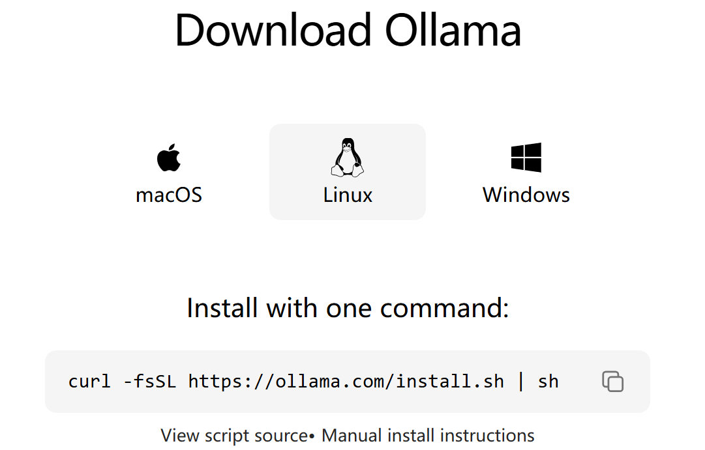

用指令下载+安装：

```shell
curl -fsSL https://ollama.com/install.sh | sh
```

下载中

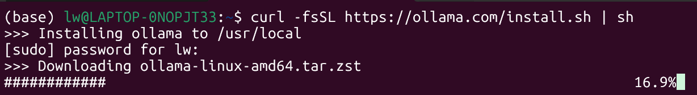

 安装完成：

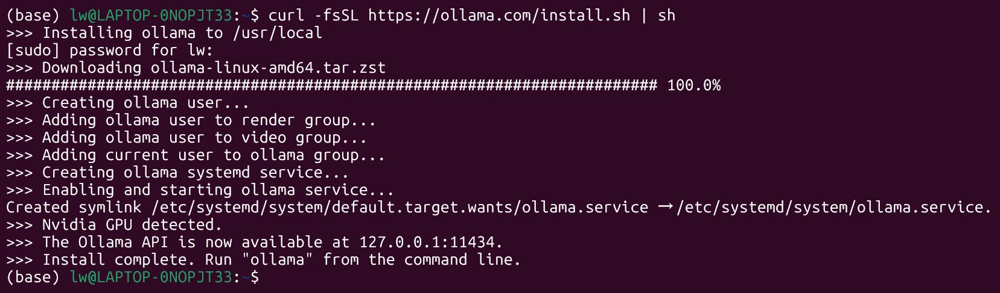

**执行流程是：**

1. 使用 `curl` 从 `https://ollama.com/install.sh` **下载一个安装脚本**
2. 将下载到的脚本内容 **通过管道 `|` 直接交给 `sh` 执行**
3. 脚本中包含：
   - 系统检测（Linux / macOS / 架构）
   - 下载 Ollama 可执行文件
   - 安装到系统路径（通常是 `/usr/local/bin` 或类似位置）
   - 可能创建 systemd 服务（Linux）

👉 所以结论是：**下载 + 安装 + 配置**，一步完成。

等价于：

```shell
curl -O https://ollama.com/install.sh
chmod +x install.sh
./install.sh
```

只是被压缩成了一行。

## 安装Ollama完成检查

1️⃣ `ollama` 已正确安装

验证方式：

```shell
ollama --version
# ollama version is 0.14.3
```

如果能正常输出版本号，说明：

- 二进制已安装
- PATH 配置正确

2️⃣ Ollama 服务已运行

大多数 Linux / macOS 安装脚本会**自动启动后台服务**。

验证方式：

```shell
ollama ps
# NAME    ID    SIZE    PROCESSOR    CONTEXT    UNTIL
```

能返回结果（哪怕是空） → 服务正常

报错（如 connection refused） → 服务未启动

如果未启动，手动启动方式（Linux）：

```shell
ollama serve
```

## 使用Ollama下载模型

在终端窗口输入命令，下载需要的模型。

例如本项目默认使用的大语言模型是`qwen3:qwen3:4b-instruct-2507-q4_K_M`，嵌入模型是`qwen3-embedding:0.6b-q8_0`，可通过以下命令下载：

```shell
ollama pull qwen3:4b-instruct-2507-q4_K_M
ollama pull qwen3-embedding:0.6b-q8_0
```

注：MacOS系统M芯片+16G以上内存，或Windows系统30/40系列N卡+12G以上显存，建议使用7b以上模型。24G以上显存可使用更大的量化模型。

下载`qwen3:4b-instruct-2507-q4_K_M`中：

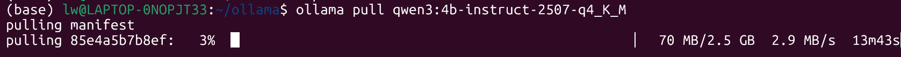

下载`qwen3-embedding:0.6b-q8_0`中：

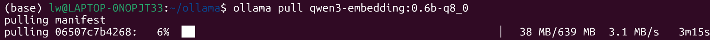

两个模型全部下载完成：

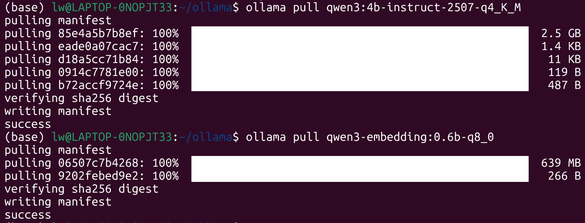

`ollama pull` 在做什么（不是简单下载）

它会：

1. 从 Ollama 官方 registry 拉取模型 manifest

2. 下载对应的 **GGUF 分片文件**

3. 校验哈希

4. 存储到本地模型缓存目录，通常是：

   ```
   ~/.ollama/models/
   ```

5. 注册到本地 Ollama 模型索引

完成后即可 **本地离线使用**

## 模型介绍

你拉的这两个模型是否合理？

✅ `qwen3:4b-instruct-2507-q4_K_M`

- 4B 参数
- instruct 微调
- `q4_K_M`：中等质量 / 显存占用较低
- 非常适合：
  - 本地推理
  - CPU 或中端 GPU
  - 指令对话 / agent

✅ `qwen3-embedding:0.6b-q8_0`

- embedding 专用模型
- 高精度 `q8_0`
- 典型用途：
  - RAG
  - 向量检索
  - 语义相似度

这是一个**标准 LLM + embedding 的正确组合**

## 模型命名解释

### instruct模型名称解释

以`qwen3:4b-instruct-2507-q4_K_M`为例：

---

1. `instruct` 是什么含义？

核心结论

> **`instruct` 表示这是一个“指令微调（Instruction-tuned）模型”**

也可以理解为：**已经被训练成“听人话、会对话”的版本**

对比说明

| 类型            | 特点                      | 适合场景                  |
| --------------- | ------------------------- | ------------------------- |
| `base` / 无后缀 | 纯预训练模型              | 研究、继续微调            |
| **`instruct`**  | **指令对齐 + RLHF / DPO** | **对话、Agent、工具调用** |

如果没有 `instruct`，模型的行为通常是：

- 更像语言建模器
- 不一定遵守指令
- 不一定给“有用的回答”

---

2. `q4` 是什么？

核心结论

> **`q4` 表示 4-bit 量化（4-bit quantization）**

量化的目的只有一个：

> **用更小的显存 / 内存，换取可接受的精度损失**

常见量化等级对照

| 标记     | 含义      | 资源占用 | 精度               |
| -------- | --------- | -------- | ------------------ |
| `q8`     | 8-bit     | 高       | 接近原模型         |
| `q6`     | 6-bit     | 中       | 很好               |
| **`q4`** | **4-bit** | **低**   | **可接受（主流）** |
| `q2`     | 2-bit     | 极低     | 明显退化           |

4B 模型用 `q4`，是**本地推理的黄金平衡点**。

---

3. `K` 是什么意思？

这是 GGUF 量化体系里的关键点。

`K` 的含义

> **`K` = K-quant（块量化 / kernel-aware quantization）**

解释成工程语言：

- 参数不是逐元素量化
- 而是**按 block 分组**
- 每个 block 有独立的 scale / zero-point
- **显著降低精度损失**

也就是说：

```
q4_K  >  q4_0 / q4_1
```

在**相同 4-bit**下，`K` 的质量明显更好。

---

4. `M` 是什么意思？

核心结论

> **`M` = Medium（中等质量 / 中等显存）变体**

在 GGUF 中，常见组合有：

| 标记         | 含义       | 特点                |
| ------------ | ---------- | ------------------- |
| `q4_K_S`     | Small      | 更省内存，略降精度  |
| **`q4_K_M`** | **Medium** | **质量 / 性能平衡** |
| `q4_K_L`     | Large      | 更高质量，更吃资源  |

你用的：

```
q4_K_M
```

在社区里通常被认为是：

> **“默认推荐版本”**

5. 把整个名字翻译成一句“人话”

```
qwen3:4b-instruct-2507-q4_K_M
```

可以翻译为：

> Qwen3 系列
>  4B 参数规模
>  经过指令微调（适合对话）
>  2025 年 07 月版本
>  使用 4-bit K-quant 量化
>  Medium 配置，质量与资源占用平衡

6. 给你一个“选型速查表”（很实用）

| 你要做什么            | 推荐                  |
| --------------------- | --------------------- |
| 对话 / Agent / 工具   | `instruct`            |
| 本地 CPU / 小显存 GPU | `q4_K_M`              |
| RAG embedding         | 单独的 embedding 模型 |
| 研究 / 微调           | base + fp16 / q8      |

### embedding模型名称解释

> 那对应的，qwen3-embedding:0.6b-q8_0名字的含义是啥？加embedding代表啥？这个模型的输出是embedding吗？q8表示啥，q8_0最后的0表示啥？

下面我**严格按模型命名语义与工程实现**来拆解，不做泛泛而谈。
 模型名：

```
qwen3-embedding:0.6b-q8_0
```

1. `embedding` 是什么意思？

核心结论

> **`embedding` 表示这是一个“专门用于向量表示”的模型，而不是生成文本的模型。**

也就是说：

- ❌ 不能正常“对话”
- ❌ 不适合生成长文本
- ✅ 只用于把文本 → 向量

和 `instruct` 的根本区别

| 模型类型        | 输入     | 输出                  |
| --------------- | -------- | --------------------- |
| `instruct`      | 文本     | 文本                  |
| **`embedding`** | **文本** | **向量（embedding）** |

所以你问的这个问题：

> 这个模型的输出是 embedding 吗？

**答案是：是的，而且“只会”输出 embedding。**

2. embedding 模型在系统中的角色（工程视角）

`qwen3-embedding` 的典型用途：

- RAG（检索增强生成）
- 向量数据库（FAISS / Milvus / Qdrant）
- 语义相似度
- 聚类 / 检索 / rerank 前的召回

在一个标准 LLM 系统里：

```
文本 → embedding → 向量库 → top-k → LLM
```

3. `0.6b` 表示什么？

> **模型参数规模是 0.6 Billion（6 亿）**

这对 embedding 模型来说是**相当主流的尺寸**：

- 小于生成模型（4B / 7B / 14B）
- 但足够捕捉语义结构
- 推理速度快、吞吐高

4. `q8` 表示什么？

核心结论

> **`q8` = 8-bit 量化（int8 / 类 int8）**

和你前面见过的 `q4` 类似，但定位不同。

为什么 embedding 通常用 `q8`

embedding 模型对数值精度**非常敏感**：

- 向量距离
- cosine similarity
- dot product

4-bit 量化可能会：

- 拉平向量分布
- 影响相似度排序
- 降低 recall / precision

因此工程实践中：

> **embedding：优先 q8
>  生成模型：常用 q4**

这是行业共识。

5. `q8_0` 里的 `_0` 是什么意思？

这是 GGUF / llama.cpp 体系中的**量化变体标识**。

结论先给出

> **`_0` 表示“标准 / 默认的 q8 量化方案”**

更精确一点的解释

在 GGUF 中：

| 标记   | 含义                                   |
| ------ | -------------------------------------- |
| `q8_0` | 逐 block 的 8-bit 对称量化（baseline） |
| `q8_1` | 改进版 q8（更复杂，收益有限）          |

`q8_0` 的特点是：

- 稳定
- 广泛支持
- 几乎无精度问题
- 计算开销可控

所以你看到 **绝大多数 embedding 模型都选 `q8_0`**。

6. 把整个名字翻译成人话

```
qwen3-embedding:0.6b-q8_0
```

可以翻译为：

> Qwen3 系列
>  专用 embedding 模型（不生成文本）
>  0.6B 参数规模
>  使用 8-bit 标准量化
>  保证向量质量与数值稳定性

7. 和你前一个模型的“系统级对照”

| 模型                            | 角色                | 量化             |
| ------------------------------- | ------------------- | ---------------- |
| `qwen3:4b-instruct-q4_K_M`      | 生成 / 推理 / Agent | q4（省资源）     |
| **`qwen3-embedding:0.6b-q8_0`** | **向量化 / 检索**   | **q8（保精度）** |

这是一个**非常“工程正确”的组合**。

8. 最后一句工程总结

> - `embedding` = 输出向量，不是文本
> - `q8` = 为相似度计算保精度
> - `q8_0` = 稳定、默认、业界通用

## 验证pull下来的模型

拉完之后怎么验证

查看本地已有模型

```shell
ollama list
```

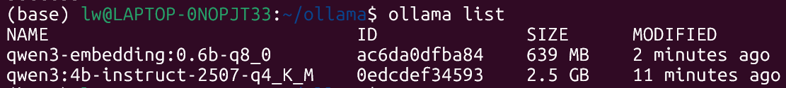

你应该能看到类似：

```shell
qwen3:4b-instruct-2507-q4_K_M
qwen3-embedding:0.6b-q8_0
```

Ollama **对 tag 非常严格**，多一个字符都会失败。

如果不确定，可以搜索局部名字：

```
ollama search qwen3
```

## 快速测试模型

### 快速测试对话模型

```shell
ollama run qwen3:4b-instruct-2507-q4_K_M
```

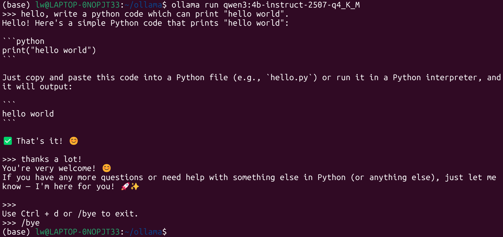

Use `Ctrl + d` or `/bye` to exit.

### 快速测试embedding模型

```shell
ollama run qwen3-embedding:0.6b-q8_0 "你好，世界"
```

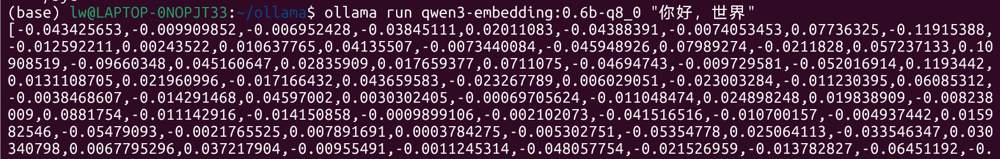

或通过 API（更常见）：

```shell
curl http://localhost:11434/api/embeddings \
  -d '{
    "model": "qwen3-embedding:0.6b-q8_0",
    "prompt": "强化学习中的 PPO 是什么"
  }'
```

> 为什么输出了很长一串数字？这是多长啊？谁规定的长度？在哪里能看到长度？

这是 **embedding 模型的正常、且唯一合理的输出形式**。下面我按你的三个问题逐一说明：**为什么是一串数字、到底多长、由谁规定、以及如何确认长度**。

1. 为什么会输出一长串数字？

核心原因

> **embedding 模型的输出不是文本，而是一个定长向量（vector）。**

你运行的是：

```
ollama run qwen3-embedding:0.6b-q8_0 "你好，世界"
```

这类模型的目标函数不是“生成下一个 token”，而是：

> 将输入文本映射到一个 **高维语义空间中的点**

因此输出形式必然是：

```
[float, float, float, ..., float]
```

这些数字：

- 是浮点数（通常 float32 / 量化后再反解）
- 每一维代表一种**语义特征投影**
- 本身**不可人工解读**
- 只用于数值计算（cosine / dot product）

2. 这串数字“有多长”？是不是随便的？

结论先给出

> **长度是固定的，由模型结构决定，不随输入变化。**

也就是说：

- “你好” → 向量长度 = N
- “你好，世界，这是一个测试” → 向量长度 **仍然 = N**

embedding 向量长度由什么决定？

**由模型在训练时就已经固定的 embedding head 决定**：

```
Transformer hidden size
        ↓
Projection / pooling
        ↓
Embedding dimension = 固定值
```

这是模型设计的一部分，不是运行时参数。

3. 谁规定这个长度？

严格来说，有三层“规定者”

1. **模型架构设计者（Qwen 团队）**
   - 决定 embedding 维度（如 768 / 1024 / 1536 等）
2. **训练目标**
   - 要在向量空间中做相似度学习
   - 维度太低 → 表达力不足
   - 维度太高 → 计算和存储成本过高
3. **下游生态（向量数据库 / 检索系统）**
   - 实际工程中常用固定维度
   - 便于索引、ANN 搜索、GPU 加速

4. 那“具体到底是多少维”？在哪里能看到？

最严谨、工程上推荐的做法：**直接数**

方法一：用 Ollama embeddings API（推荐）

```
curl http://localhost:11434/api/embeddings \
  -d '{
    "model": "qwen3-embedding:0.6b-q8_0",
    "prompt": "你好，世界"
  }'
```

返回结果类似：

```
{
  "embedding": [ ... 一长串数字 ... ]
}
```

你只需要数：

```
len(embedding)
```

这就是**官方、无歧义的真实维度**。

# Ollama的交互模式

**Ollama的交互模式是标准的 HTTP API 方式；Ollama 的交互模式本质上就是“本地模型服务 + REST API”**。

你现在看到的命令行 `ollama run` 只是**最外层的一个 CLI 封装**。

下面我从**架构 → 交互模式 → 和 OpenAI API 的对应关系 → Python 示例**，一次性讲清楚。

## Ollama的真实交互模式是什么

核心一句话

> **Ollama 是一个本地常驻模型服务（daemon），CLI 只是它的一个客户端。**

安装完成后，Ollama 会在本地启动一个服务：

```shell
http://localhost:11434
```

所有交互最终都是：

```
Client  →  HTTP API  →  Ollama Server  →  本地模型
```

你现在用的：

```sehll
ollama run qwen3:4b-instruct-...
```

等价于：

> “CLI 客户端调用了本地的 HTTP API”

那 Ollama 的“交互模式”到底是什么？

用一句工程语言总结：

> **Ollama 是一个本地模型推理服务，**
>
> **CLI / Python / LangChain / LlamaIndex 都只是不同的客户端。**

推荐你在脑子里把它理解成：

```
Ollama ≈ 本地版 OpenAI API Server
```

## Ollama提供哪些API交互方式

官方支持的三类

| 方式               | 用途     | 本质         |
| ------------------ | -------- | ------------ |
| CLI (`ollama run`) | 手动测试 | API 封装     |
| **HTTP REST API**  | 程序调用 | ⭐ 正式接口   |
| OpenAI 兼容 API    | 生态对接 | OpenAI-style |

你关心的是 **第 2 和第 3 类**。

什么是API 封装？

## Ollama原生HTTP-API（最底层、最稳定）

### Chat/Generate（对应 chat completion）

请求示例（curl）

```shell
curl http://localhost:11434/api/chat \
  -d '{
    "model": "qwen3:4b-instruct-2507-q4_K_M",
    "messages": [
      {"role": "system", "content": "You are a helpful assistant."},
      {"role": "user", "content": "你好，帮我写一段python代码，判断一个整数是不是偶数？"}
    ]
  }'
```

返回的是 **流式 JSON（默认）**，这是 Ollama 的一个设计特点。

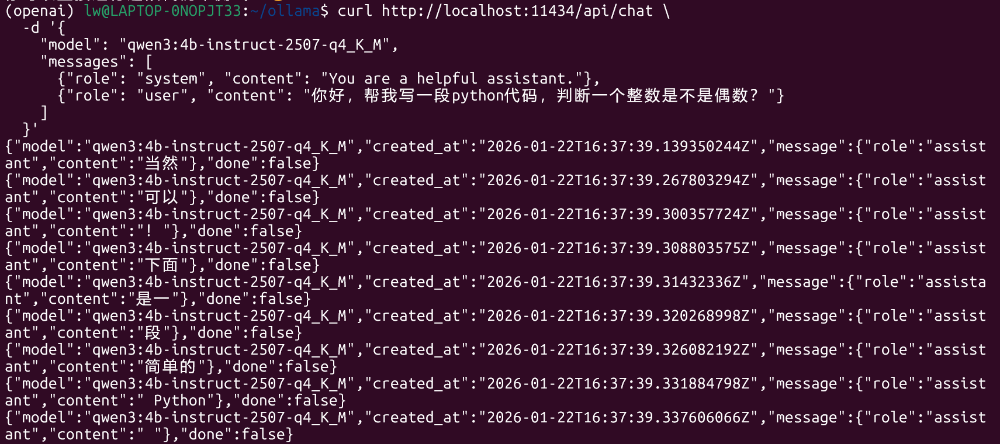

```json
{"model":"qwen3:4b-instruct-2507-q4_K_M","created_at":"2026-01-22T16:37:39.139350244Z","message":{"role":"assistant","content":"当然"},"done":false}
{"model":"qwen3:4b-instruct-2507-q4_K_M","created_at":"2026-01-22T16:37:39.267803294Z","message":{"role":"assistant","content":"可以"},"done":false}
{"model":"qwen3:4b-instruct-2507-q4_K_M","created_at":"2026-01-22T16:37:39.300357724Z","message":{"role":"assistant","content":"！"},"done":false}
{"model":"qwen3:4b-instruct-2507-q4_K_M","created_at":"2026-01-22T16:37:39.308803575Z","message":{"role":"assistant","content":"下面"},"done":false}
{"model":"qwen3:4b-instruct-2507-q4_K_M","created_at":"2026-01-22T16:37:39.31432336Z","message":{"role":"assistant","content":"是一"},"done":false}
{"model":"qwen3:4b-instruct-2507-q4_K_M","created_at":"2026-01-22T16:37:39.320268998Z","message":{"role":"assistant","content":"段"},"done":false}
{"model":"qwen3:4b-instruct-2507-q4_K_M","created_at":"2026-01-22T16:37:39.326082192Z","message":{"role":"assistant","content":"简单的"},"done":false}
{"model":"qwen3:4b-instruct-2507-q4_K_M","created_at":"2026-01-22T16:37:39.331884798Z","message":{"role":"assistant","content":" Python"},"done":false}
{"model":"qwen3:4b-instruct-2507-q4_K_M","created_at":"2026-01-22T16:37:39.337606066Z","message":{"role":"assistant","content":" "},"done":false}
{"model":"qwen3:4b-instruct-2507-q4_K_M","created_at":"2026-01-22T16:37:39.34375524Z","message":{"role":"assistant","content":"代码"},"done":false}
{"model":"qwen3:4b-instruct-2507-q4_K_M","created_at":"2026-01-22T16:37:39.349786681Z","message":{"role":"assistant","content":"，"},"done":false}
{"model":"qwen3:4b-instruct-2507-q4_K_M","created_at":"2026-01-22T16:37:39.355623272Z","message":{"role":"assistant","content":"用于"},"done":false}
{"model":"qwen3:4b-instruct-2507-q4_K_M","created_at":"2026-01-22T16:37:39.361422103Z","message":{"role":"assistant","content":"判断"},"done":false}
{"model":"qwen3:4b-instruct-2507-q4_K_M","created_at":"2026-01-22T16:37:39.368357912Z","message":{"role":"assistant","content":"一个"},"done":false}
{"model":"qwen3:4b-instruct-2507-q4_K_M","created_at":"2026-01-22T16:37:39.373856886Z","message":{"role":"assistant","content":"整"},"done":false}
{"model":"qwen3:4b-instruct-2507-q4_K_M","created_at":"2026-01-22T16:37:39.37951655Z","message":{"role":"assistant","content":"数"},"done":false}
{"model":"qwen3:4b-instruct-2507-q4_K_M","created_at":"2026-01-22T16:37:39.384878482Z","message":{"role":"assistant","content":"是不是"},"done":false}
{"model":"qwen3:4b-instruct-2507-q4_K_M","created_at":"2026-01-22T16:37:39.390348508Z","message":{"role":"assistant","content":"偶"},"done":false}
{"model":"qwen3:4b-instruct-2507-q4_K_M","created_at":"2026-01-22T16:37:39.395855814Z","message":{"role":"assistant","content":"数"},"done":false}
{"model":"qwen3:4b-instruct-2507-q4_K_M","created_at":"2026-01-22T16:37:39.40109197Z","message":{"role":"assistant","content":"：\n\n"},"done":false}
{"model":"qwen3:4b-instruct-2507-q4_K_M","created_at":"2026-01-22T16:37:39.406350076Z","message":{"role":"assistant","content":"```"},"done":false}
{"model":"qwen3:4b-instruct-2507-q4_K_M","created_at":"2026-01-22T16:37:39.411655142Z","message":{"role":"assistant","content":"python"},"done":false}
{"model":"qwen3:4b-instruct-2507-q4_K_M","created_at":"2026-01-22T16:37:39.41687238Z","message":{"role":"assistant","content":"\n"},"done":false}
{"model":"qwen3:4b-instruct-2507-q4_K_M","created_at":"2026-01-22T16:37:39.422294556Z","message":{"role":"assistant","content":"def"},"done":false}
{"model":"qwen3:4b-instruct-2507-q4_K_M","created_at":"2026-01-22T16:37:39.427823167Z","message":{"role":"assistant","content":" is"},"done":false}
{"model":"qwen3:4b-instruct-2507-q4_K_M","created_at":"2026-01-22T16:37:39.433885641Z","message":{"role":"assistant","content":"_even"},"done":false}
{"model":"qwen3:4b-instruct-2507-q4_K_M","created_at":"2026-01-22T16:37:39.440038984Z","message":{"role":"assistant","content":"(n"},"done":false}
{"model":"qwen3:4b-instruct-2507-q4_K_M","created_at":"2026-01-22T16:37:39.44572543Z","message":{"role":"assistant","content":"):\n"},"done":false}
```

> 请问什么是流式 JSON？这设计特点有啥用？

#### 什么是流式 JSON？

核心概念

**流式 JSON = 服务器不一次性返回完整 JSON，而是把结果**“分片 / 分事件 / 按 token / 按 chunk”**逐步发送”**。

你看到的：

```json
{"model":"qwen3:4b-instruct-2507-q4_K_M","created_at":"2026-01-22T16:37:39.139350244Z","message":{"role":"assistant","content":"当然"},"done":false}
{"model":"qwen3:4b-instruct-2507-q4_K_M","created_at":"2026-01-22T16:37:39.267803294Z","message":{"role":"assistant","content":"可以"},"done":false}
{"model":"qwen3:4b-instruct-2507-q4_K_M","created_at":"2026-01-22T16:37:39.300357724Z","message":{"role":"assistant","content":"！"},"done":false}
...
...
...
{"model":"qwen3:4b-instruct-2507-q4_K_M","created_at":"2026-01-22T16:37:40.32677329Z","message":{"role":"assistant","content":"😊"},"done":false}
{"model":"qwen3:4b-instruct-2507-q4_K_M","created_at":"2026-01-22T16:37:40.332322571Z","message":{"role":"assistant","content":""},"done":true,"done_reason":"stop","total_duration":1423876756,"load_duration":98720916,"prompt_eval_count":35,"prompt_eval_duration":129005264,"eval_count":183,"eval_duration":1119074549}
```

每一行都是 **一个 JSON 对象（一个 chunk）**：

- `message.content` → 这一段文本（通常是一个或几个 token）
- `done` → 是否生成完成（`false` 表示还没结束）
- `created_at` → timestamp

等生成结束时，最后一条会是：

```json
{"done": true}
```

直观比喻

> 就像 **流媒体视频**
>
> - 不是等整部电影生成完再给你看
> - 而是一边生成，一边播放
> - 你可以边看边接收

流式 JSON 就是文本生成版的“流媒体”。

#### 为什么 Ollama 设计成流式？

**1、实时性 / 响应速度**

- **不必等模型生成完整答案**
- 用户或客户端可以**立即显示部分结果**
- 提高交互体验，尤其是长文本生成

例如：

```
"下面是一段Python代码..." → 用户可以边显示边运行
```

**2、内存 / 网络优化**

- 如果一次返回上千 token 的 JSON：
  - JSON 太大 → 网络传输慢
  - 客户端内存占用高
- 流式返回每次只传少量 token → **网络压力低、延迟小**

**3、支持流式消费**

客户端可以：

- **边解析边显示**
- **边写入文件 / 数据库**
- **边做 token 级的逻辑处理**（如实时语音合成、RAG 插入）

#### 这种设计在工程上的意义

| 优点               | 场景示例                        |
| ------------------ | ------------------------------- |
| **低延迟响应**     | UI 即时显示生成文字             |
| **可中途截断**     | 用户取消请求 → 模型立即停止     |
| **边生成边处理**   | 生成向量 / 检索 / 音频实时合成  |
| **适合长文本生成** | 上万 token 文本不会一次性爆内存 |

#### 使用技巧

- **完整输出**：把每条 `message.content` 拼接起来
- **Python 示例**：

```python
import requests
import json

resp = requests.post(
    "http://localhost:11434/api/chat",
    json={
        "model": "qwen3:4b-instruct-2507-q4_K_M",
        "messages": [
            {"role": "system", "content": "You are a helpful assistant."},
            {"role": "user", "content": "你好，帮我写一段python代码，判断一个整数是不是偶数？"}
        ]
    },
    stream=True
)

full_text = ""
for line in resp.iter_lines():
    if line:
        data = json.loads(line)
        full_text += data["message"]["content"]
print(full_text)
```

* 这样你就可以得到 **完整文本**，而不是一条条 JSON chunk。

#### 总结一句话

> **流式 JSON = 模型生成按 token / chunk 分片返回 JSON，**
>
> **可以边生成边消费，提高实时性、降低内存和网络压力，是大模型本地服务（Ollama）交互的标准设计特点。**

如果你愿意，我可以帮你画一张**Ollama 流式 JSON 生成流程图**，让你一眼就看懂 **token → chunk → client → 拼接** 的整个过程。

好的，我用 **字符+文字** 给你画一张 **Ollama 流式 JSON 生成流程图**，完全用文本表示，方便在文档里直接用。

```
┌───────────────┐
│   Client      │
│ (你的程序/CLI)│
└───────┬───────┘
        │ 发送请求 (POST /api/chat)
        ▼
┌───────────────┐
│ Ollama Server │
│ (本地模型服务)│
└───────┬───────┘
        │ 生成文本（token by token）
        ▼
  ┌───────────────┐   每生成一小段 token
  │ JSON Chunk 1  │ ──────────┐
  │ {"message":{" │           │
  │ "content":"你"}}│          │
  │ "done":false} │           │
  └───────────────┘           │
  ┌───────────────┐   下一段 token
  │ JSON Chunk 2  │ ──────────┤
  │ {"message":{" │           │
  │ "content":"好"}}│          │
  │ "done":false} │           │
  └───────────────┘           │
         ...                   │
  ┌───────────────┐            │
  │ JSON Chunk N  │ ───────────┘
  │ {"message":{" │
  │ "content":"!"}}│
  │ "done":true}  │  ← 生成完成标志
  └───────────────┘
        │
        ▼
┌───────────────┐
│ Client 拼接   │
│ full_text =   │
│ chunk1+chunk2+│
│ ...+chunkN    │
└───────────────┘
```

解释：

1. **Client** → 发送请求（POST /api/chat）
2. **Ollama Server** → 模型开始生成，按 token 或小片段产生文本
3. **流式返回 JSON chunk**：
   - 每条 JSON 包含 `content`（当前生成的文本）和 `done`（是否完成）
4. **Client** → 边接收边拼接，得到完整结果
5. **优点**：
   - 实时显示
   - 低内存
   - 可中途取消或处理

#### resp.iter_lines是怎么持续接受断续的字符的

问题：

```python
resp = requests.post(...
# ...
for line in resp.iter_lines():
	# ...
```

是怎么持续接受断续的字符的，同时，是怎么知道结束了的？

的？

好的，我们分两部分仔细讲：**1）如何持续接受断续字符**，**2）如何知道流结束**。我尽量从底层原理解释，但用你能直接理解的 Python/HTTP 角度。

##### 1️⃣ 持续接受断续字符：`resp.iter_lines()` 怎么做到的？

**背景**

- 你在请求 `curl` 或 `requests.post(..., stream=True)` 时
- HTTP 连接是 **长连接 / 持续传输**，服务端可以一边生成一边发数据
- 数据不是一次性返回，而是**按块（chunked transfer）发送**

**1.1 HTTP Chunked Transfer**

HTTP/1.1 支持 **Transfer-Encoding: chunked**：

```shell
HTTP/1.1 200 OK
Transfer-Encoding: chunked

4\r\n
Wiki\r\n
5\r\n
pedia\r\n
0\r\n
\r\n
```

- 服务端可以分多块发送数据
- 每块大小可变
- 客户端读到最后一个长度为 0 的 chunk 就知道结束

Ollama 就是用类似机制把每个 token 的 JSON 逐个发送。

**1.2 Python `requests` 的处理**

```python
resp = requests.post(..., stream=True)
```

- `stream=True` → **不一次性读取整个响应**
- `resp.iter_lines()` → 迭代器，每次返回 **一行**（以 `\n` 或 `\r\n` 分割）
- 底层原理：
  1. `requests` 从 socket 持续读取数据块
  2. 缓冲区拼接数据，遇到换行符 `\n` 就返回一行
  3. 如果还没换行，就继续等待新数据到来

> 因此你看到的是“断续接收”，每个 JSON chunk 一行一行地出来。

**1.3 可类比示意（伪代码）**

```python
socket_buffer = ""
while True:
    new_data = socket.recv(1024)  # 等待服务端新数据
    if not new_data:
        break  # 服务端关闭连接
    socket_buffer += new_data
    while "\n" in socket_buffer:
        line, socket_buffer = socket_buffer.split("\n", 1)
        yield line  # 交给 iter_lines
```

这就是 Python `requests` 在后台做的事情。

> 我没太理解这里你说的类比代码。
>
> 因为我觉得resp = requests.post(完成之后，才开始for line in resp.iter_lines():的，不可能返回去又来一次request啊，只能一次性啊

啊，我明白你的疑惑了，你的理解里有一个 **常见误区**：你以为

```python
resp = requests.post(...)
for line in resp.iter_lines():
```

会等 `requests.post` 完全结束，才开始 `for line`，所以觉得怎么可能“持续接收断续字符”。其实不是这样。让我详细解释。

1️⃣ `requests.post(..., stream=True)` 真正的行为

- 当你写 `stream=True` 时：

```python
resp = requests.post("http://localhost:11434/api/chat", stream=True, json=...)
```

1. `requests.post` **发起 HTTP 请求**
2. **得到响应头**（HTTP status code, headers）
3. **并不会读取完整响应体**（因为 `stream=True`）
4. `resp` 对象已经拿到，但 **响应体仍在服务端生成**
5. 后续的 `for line in resp.iter_lines()` 才开始**按行读取 socket 流**

> 换句话说，`requests.post` 完成的是“请求发出 + 响应头收到”，不是“响应体收完”。

2️⃣ 类比真实过程（一次 TCP 连接）

可以把整个过程想成：

```python
Client: 发送 HTTP POST 数据
Client: 收到 HTTP 响应头 → resp 对象生成
while True:
    Client: 从 socket 读取一小块数据（不阻塞）
    if 有换行:
        yield line
    if 服务端 done 或关闭连接:
        break
```

- **重点**：这是一个 **单个 HTTP 连接**
- `for line in resp.iter_lines()` 并不是重新发请求
- 它只是“在这个已建立的 socket 上，边等待边读取数据”

3️⃣ 为什么可以“边生成边返回”

服务端（Ollama）是**边生成 token 边发数据**：

```python
{"message":{"content":"你"},"done":false}\n
{"message":{"content":"好"},"done":false}\n
...
{"done":true}\n
```

- 你的 HTTP 连接一直保持 open
- 每次生成一小段 JSON 就 flush 到 socket
- Python `iter_lines()` 检测到 `\n` 就返回一行
- **无需等待整个生成结束**

4️⃣ 用一个小动画文字比喻

```
时间 → 

服务端生成 token: "你"   → socket flush → client iter_lines() yield "你"
服务端生成 token: "好"   → socket flush → client iter_lines() yield "好"
服务端生成 token: "！"   → socket flush → client iter_lines() yield "！"
...
服务端生成完成          → done=True → client break
```

- 你看到的是**逐行输出**
- **整个过程只有一次请求**
- 并不是“请求返回后再发请求”，是**同一连接上流式接收**

5️⃣ Python 角度总结

```python
resp = requests.post(..., stream=True)  # 发起一次请求，拿到响应头
for line in resp.iter_lines():          # 持续从 socket 读取，每次一行
    process(line)                       # 可以边处理边拼接
```

- `requests.post` ≠ 等待全部数据
- `iter_lines` ≈ “阻塞迭代器 + socket buffer”
- 真实 HTTP 连接是一条线，数据逐步流过来

##### 2️⃣ 怎么知道流结束？

在流式 JSON 的设计里，有两种方式告诉客户端结束：

**2.1 `done` 字段**

你看到的每条 JSON 都有：

```
{"message":{"content":"!"}, "done":false}
```

- 当模型生成完毕，最后一条会：

```
{"done": true}
```

- 客户端就可以停止迭代，知道 **所有文本生成完成**

**2.2 HTTP 连接关闭**

- 在 chunked transfer 的底层，服务端最后会发送 **长度为 0 的 chunk**
- Python `requests.iter_lines()` 会自动检测到 EOF
- 如果服务端连接关闭，但最后一条 `done` 也没出现，迭代器也会结束

##### 3️⃣ 总结流程（结合你 Python 代码）

```python
full_text = ""
for line in resp.iter_lines():
    if line:  # 每次 line 对应一个 JSON chunk
        data = json.loads(line)
        full_text += data["message"]["content"]
        if data.get("done"):
            break  # 流结束
```

- **持续接收**：`requests` + socket + iter_lines()
- **断续**：每条 JSON chunk 对应几个 token / 一小段文本
- **结束条件**：1）`done=True` 或 2）HTTP 连接关闭

------

✅ 关键理解：

- **iter_lines() = 持续监听 socket，按行返回数据**
- **done = true** = 模型生成完成
- **流式 JSON = 边生成边返回，不必等完整文本**

### Python版本（官方推荐风格）

```python
import requests

url = "http://localhost:11434/api/chat"

payload = {
    "model": "qwen3:4b-instruct-2507-q4_K_M",
    "messages": [
        {"role": "system", "content": "You are a helpful assistant."},
        {"role": "user", "content": "你好，帮我写一段python代码，判断一个整数是不是偶数？"}
    ],
    "stream": False
}

resp = requests.post(url, json=payload, timeout=100)
print(resp.json()["message"]["content"])
```

**这已经是完整可用的“API 交互方式”**。

返回：

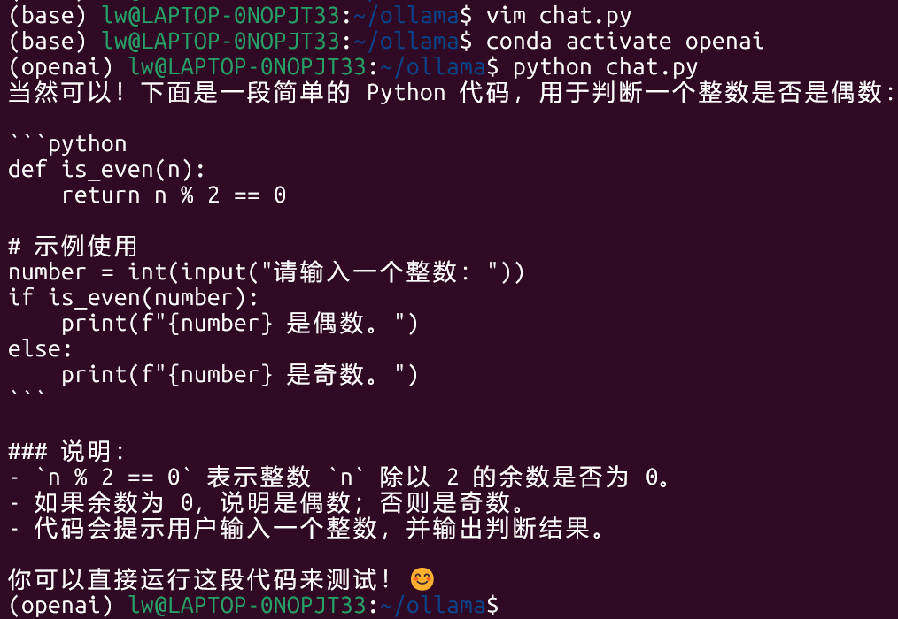

````markdown
当然可以！下面是一段简单的 Python 代码，用于判断一个整数是否是偶数：

```python
def is_even(n):
    return n % 2 == 0

# 示例使用
number = int(input("请输入一个整数："))
if is_even(number):
    print(f"{number} 是偶数。")
else:
    print(f"{number} 是奇数。")
```

### 说明：
- `n % 2 == 0` 表示整数 `n` 除以 2 的余数是否为 0。
- 如果余数为 0，说明是偶数；否则是奇数。
- 代码会提示用户输入一个整数，并输出判断结果。

你可以直接运行这段代码来测试！😊
````

## OpenAI风格API：你最关心的部分

好消息

> **Ollama 原生支持 OpenAI-compatible API。**

只需要把 `base_url` 指向本地即可。

你之前的代码，几乎不用改

你给的代码：

```python
from openai import OpenAI

client = OpenAI(
    base_url="https://yunwu.ai/v1",
    api_key="sk-xxxxxxxx"
)
```

改成 **Ollama 本地**：

```python
from openai import OpenAI

client = OpenAI(
    base_url="http://localhost:11434/v1",
    api_key="ollama"  # 随便写，Ollama 不校验
)

response = client.chat.completions.create(
    model="qwen3:4b-instruct-2507-q4_K_M",
    messages=[
        {"role": "system", "content": "You are a helpful assistant."},
        {"role": "user", "content": "你好，帮我写一段python代码，判断一个整数是不是偶数？"}
    ],
    timeout=100,
)

print(response.choices[0].message.content)
```

**这在工程上是完全合法、完全可用的。**

返回：

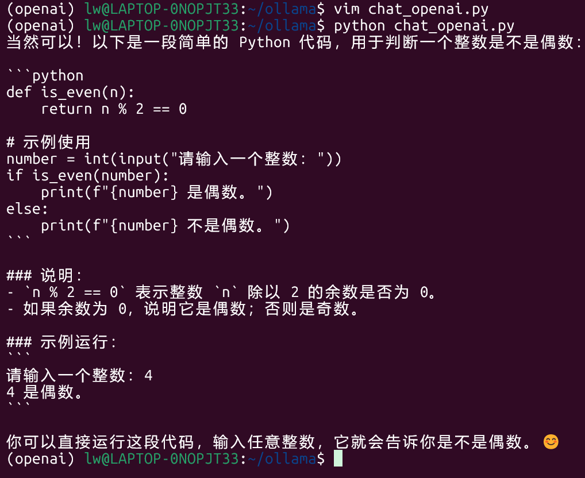

````markdown
当然可以！以下是一段简单的 Python 代码，用于判断一个整数是不是偶数：

```python
def is_even(n):
    return n % 2 == 0

# 示例使用
number = int(input("请输入一个整数："))
if is_even(number):
    print(f"{number} 是偶数。")
else:
    print(f"{number} 不是偶数。")
```

### 说明：
- `n % 2 == 0` 表示整数 `n` 除以 2 的余数是否为 0。
- 如果余数为 0，说明它是偶数；否则是奇数。

### 示例运行：
```
请输入一个整数：4
4 是偶数。
```

你可以直接运行这段代码，输入任意整数，它就会告诉你是不是偶数。😊
````

## 对应关系一览表（帮你建立心智模型）

| OpenAI 概念        | Ollama 对应                 |
| ------------------ | --------------------------- |
| `chat.completions` | `/v1/chat/completions`      |
| `embeddings`       | `/v1/embeddings`            |
| `model`            | 本地已 pull 的模型名        |
| `api_key`          | 不需要（占位即可）          |
| `base_url`         | `http://localhost:11434/v1` |

## embedding 的 OpenAI-style 用法（你前面正好用到了）

```python
response = client.embeddings.create(
    model="qwen3-embedding:0.6b-q8_0",
    input="你好，世界"
)

embedding = response.data[0].embedding
print(len(embedding))
```

这和你用 OpenAI embedding 的方式 **在接口层完全一致**。

## 什么时候用哪种方式？

| 场景              | 推荐                  |
| ----------------- | --------------------- |
| 手动测试          | `ollama run`          |
| Python / 系统集成 | OpenAI-compatible API |
| 流式 / 高控制     | 原生 `/api/chat`      |
| RAG / Agent 框架  | OpenAI-compatible     |

> Python版本（官方推荐风格） 和 OpenAI风格API：你最关心的部分 到底现在一般用哪个？

Python 版本（官方推荐风格） vs OpenAI 风格 API

### 1️⃣ Python 版本（官方推荐风格）

```
import requests

url = "http://localhost:11434/api/chat"
payload = {
    "model": "qwen3:4b-instruct-2507-q4_K_M",
    "messages": [
        {"role": "system", "content": "You are a helpful assistant."},
        {"role": "user", "content": "你好，帮我写一段python代码，判断一个整数是不是偶数？"}
    ],
    "stream": False
}

resp = requests.post(url, json=payload, timeout=100)
print(resp.json()["message"]["content"])
```

- **本质**：直接调用 HTTP 接口
- **依赖**：只有 `requests` 库
- **优点**：
  - 透明、轻量
  - 官方推荐、适合本地或低依赖环境
- **缺点**：
  - 参数和流式处理需要自己实现
  - 不方便在多厂商/多模型环境下统一调用

### 2️⃣ OpenAI 风格 API

```
from openai import OpenAI

client = OpenAI(base_url="http://localhost:11434", api_key="")
response = client.chat.completions.create(
    model="qwen3:4b-instruct-2507-q4_K_M",
    messages=[
        {"role": "system", "content": "You are a helpful assistant."},
        {"role": "user", "content": "你好，帮我写一段python代码，判断一个整数是不是偶数？"}
    ]
)
print(response.choices[0].message.content)
```

- **本质**：在 Python 层封装了 HTTP 请求和响应解析
- **优点**：
  - 与 OpenAI API 完全兼容 → 多厂商可迁移
  - 内置流式和 JSON 解析
  - 生态友好，支持 LangChain、AutoGen 等框架
- **缺点**：
  - 依赖 `openai` 库
  - 对底层 HTTP 透明性略低

### 3️⃣ 工程实践趋势

- **现在大部分实际项目和主流框架都用 OpenAI 风格 API**
  - 原因：生态兼容性高、支持多厂商、流式处理方便
  - LangChain、LlamaIndex、AutoGen 等框架都默认使用 OpenAI 风格 API
- **Python 官方风格（requests）**：
  - 适合学习、低依赖本地调用
  - 或只想简单调用单个模型的场景

### 4️⃣ 总结建议

| 场景                               | 推荐方式                    |
| ---------------------------------- | --------------------------- |
| 学习 / 本地快速调用 / 低依赖       | Python 官方风格（requests） |
| 工程化 / 多厂商兼容 / 生态框架支持 | OpenAI 风格 API             |

> 简单一句话：**如果追求可迁移性和工程实践，大部分团队现在直接用 OpenAI 风格 API；如果只是本地或轻量调用，官方 Python 风格也够用。**

## 最后一句总结（非常关键）

> **你现在已经不需要“命令行交互”了，**
>
> **Ollama 完全可以作为你系统中的一个“模型服务节点”。**

如果你愿意，下一步我可以直接帮你：

- 把 Ollama 接进 **你已有的 Agent / RL / Planner 架构**
- 或给你一个 **“Ollama + embedding + 向量库”的完整最小工程结构**

# Ollama本地调用服务和API远程调用服务的本质区别

> openai api远程调用和ollama这种本地的模型服务的本质核心区别是不是：
> openai api是远程调用大模型厂商（OpenAI，阿里，DeepSeek）服务器的模型推理服务，而ollama是调用本机的模型推理服务？
> 实际是这样吗？

你的理解**是正确的，而且已经抓住了本质**。
 我会在肯定你结论的基础上，把“哪里完全一样、哪里不一样、工程上该怎么理解”讲清楚，避免你后面形成模糊概念。

## 先直接回答你的判断

> **openai API 是远程调用大模型厂商服务器上的模型推理服务，
>  ollama 是调用本机（或内网服务器）上的模型推理服务。**

**是的，这句话在“本质层面 100% 成立”。**

## 用一句话建立正确的“心智模型”

> **两者的本质都是：
>  「Client → HTTP API → Model Inference Service」**

区别只在于：
 👉 **Model Inference Service 在哪里运行**

## 把两者画成“同一张架构图”

### OpenAI / 云厂商 API

```
你的程序
   |
   |  HTTPS
   v
OpenAI / 阿里 / DeepSeek 云端 API
   |
   |  高性能 GPU 集群
   v
大模型推理
```

特征：

- 模型在 **厂商服务器**
- 你只看到 API
- 不接触模型权重
- 按 token / 请求计费

### Ollama（本地模型服务）

```
你的程序
   |
   |  HTTP (localhost / 内网)
   v
Ollama 本地服务
   |
   |  CPU / GPU / Metal
   v
本地模型推理
```

特征：

- 模型在 **你自己的机器**
- 权重在磁盘上
- 不走公网
- 不按 token 计费

## 为什么你会“感觉它们很像”？

这是一个**非常关键的设计点**：

> **Ollama 故意把自己设计成 OpenAI API 的“等价替身”**

原因是：

- 生态已经围绕 OpenAI API 建好了
- LangChain / LlamaIndex / Agent 框架
- 开发者已经熟悉 `chat.completions`

所以你才会发现：

```
client = OpenAI(base_url=..., api_key=...)
```

**这一行几乎不变**。

## 那它们“真正不一样”的地方在哪？

下面是工程层面的关键差异。

### 资源责任

| 维度        | OpenAI API | Ollama       |
| ----------- | ---------- | ------------ |
| 计算资源    | 厂商负责   | **你负责**   |
| 显存 / 内存 | 不关心     | **必须关心** |
| 并发能力    | 极高       | 受限于本机   |

### 模型控制权

| 维度       | OpenAI API | Ollama       |
| ---------- | ---------- | ------------ |
| 模型权重   | 看不到     | **完全可见** |
| 版本固定性 | 厂商决定   | **你决定**   |
| 可复现实验 | 较弱       | **极强**     |

### 成本模型

| 维度     | OpenAI API | Ollama     |
| -------- | ---------- | ---------- |
| 单次调用 | 付费       | 免费       |
| 长期成本 | 线性增长   | 硬件一次性 |
| 离线可用 | 不可       | **可**     |

## 你应该怎么“正确理解”？

你刚接触，这里给你一个**非常重要的定位建议**：

> **不要把 Ollama 当成“另一种 API”，**
>
> **而是把它当成“你自己搭建的一个小型模型服务器”。**

就像：

- 你可以用云数据库（RDS）
- 也可以自己装 MySQL

**概念完全一致**。

## 一个你未来一定会遇到的“进阶问题”

当你继续深入时，你会发现还有第三类：

**自建推理服务（vLLM / TensorRT-LLM / Triton）**

就是说，Ollama和vLLM / TensorRT-LLM / Triton一样，都是推理服务的一种吗？

```
你的程序
   |
   v
你自己部署的推理服务（多卡 / 并发 / 批处理）
```

Ollama 实际上是：

> **“面向个人和小团队的、极低门槛的推理服务封装”**

## 最终一句总结（非常重要）

> ✔ 你的理解是**完全正确的**
>  ✔ 两者的区别不在 API，而在 **模型在哪里跑**
>  ✔ Ollama = 本地模型推理服务
>  ✔ OpenAI API = 远程模型推理服务

你现在已经完成了**“从 API 使用者 → 系统理解者”**这一步。

# OpenAI-API已成为大模型服务接口标准

> 各种大模型服务的api接口现在都是OpenAI API这种接口吗？就是说，都用的是from openai import OpenAI吗？

**简短结论先给出：不是“都”，但「OpenAI API 风格」已经成为事实上的行业标准。**

下面我从**历史、现状、例外、以及你在工程上该如何应对**四个层面讲清楚。

## 现在是不是“大家都用 OpenAI API”？

准确说法应该是：

> **大多数通用大模型服务，都在“兼容 OpenAI API”，**
>
> **但不等于它们的原生 API 就是 OpenAI API。**

也就是说：

- OpenAI API ≈ **通用接口标准**
- 但并非唯一接口

## 为什么 OpenAI API 成了事实标准？

三个关键原因

**1、先发优势 + 开发者惯性**

- OpenAI 最早提供：

  ```
  from openai import OpenAI
  ```

- ChatCompletion / Embeddings 定义得非常早

- 大量开源框架围绕它构建

---

**2、生态“锁定效应”**

以下生态基本**默认 OpenAI API**：

- LangChain
- LlamaIndex
- AutoGen
- CrewAI
- 各种 Agent / Tool 框架

厂商如果不兼容：

> 基本无法进入主流生态

---

3、兼容成本极低

对模型服务提供方来说：

- OpenAI API 是一层 **HTTP 协议**
- 不涉及模型内部结构
- 做一层 adapter 即可

## 现实中的分类（非常重要）

### 第一类：原生OpenAI-API

| 厂商             | 说明     |
| ---------------- | -------- |
| OpenAI           | 原生     |
| Azure OpenAI     | 轻微差异 |
| Yunwu / 中转服务 | 代理     |

你的使用OpenAI API的代码就是这一类。

### 第二类：**OpenAI-compatible API（主流）**

| 服务                  | 情况     |
| --------------------- | -------- |
| Ollama                | 原生支持 |
| vLLM                  | 官方支持 |
| LM Studio             | 支持     |
| Text Generation WebUI | 支持     |
| DeepSeek              | 支持     |
| 阿里云（通义）        | 支持     |
| 智谱 / 月之暗面       | 支持     |

👉 **你可以继续用：**

```
from openai import OpenAI
```

只改：

```
base_url
api_key
model
```

### 第三类：**非 OpenAI 风格（少数）**

这类一般是：

- 历史包袱重
- 或做垂直封装

例如：

- Hugging Face Inference API
- Google Gemini（早期）
- 一些私有企业接口

但即便如此：

> **它们现在也在补 OpenAI-compatible 接口**

## 那 `from openai import OpenAI` 是不是“唯一正确姿势”？

工程视角的正确答案

> **它是“最低阻力路径”，但不是架构上必须绑定的。**

推荐你的工程结构是：

```
你的业务逻辑
   |
   v
LLM Client 抽象层
   |
   +-- OpenAI API
   +-- Ollama (OpenAI-compatible)
   +-- DeepSeek
```

这样：

- 切换 provider ≈ 改配置
- 不改业务代码

## 一个你现在就该有的认知（非常关键）

> **OpenAI API ≠ OpenAI 公司**
>
> *它已经演变成一种“协议 / 接口规范”**

就像：

- SQL ≠ MySQL
- POSIX ≠ Linux

## 那未来会不会“统一到一个标准”？

非常现实的判断

- **短期：OpenAI API 继续主导**
- **中期：功能分叉（tool / vision / agent）**
- **长期：可能出现正式标准，但短期不会**

## 你现在该怎么做（实用建议）

既然你刚接触，我给你一个**极简、但正确的建议**：

> **优先使用 OpenAI-compatible API**
>
> *避免厂商私有 SDK 绑定**

你已经本能地走在**正确路径上**了。

## 一句话总结

- OpenAI API 已成为事实上的大模型服务接口标准
- 多数厂商选择“兼容”而不是“发明新接口”
- `from openai import OpenAI` 更像是“HTTP 客户端”，而不是“只属于 OpenAI”

# 参考资料


## 大模型

* [Ollma pull 使用指导](https://chatgpt.com/c/69722b54-8524-8322-93ea-757066c63fb1)

如果你下一步是：

- 接 Python / LangChain / LlamaIndex
- 用作 RAG
- 或和你现有的 **RL / agent 系统**对接

我可以直接给你**最小可运行示例**，不走弯路。